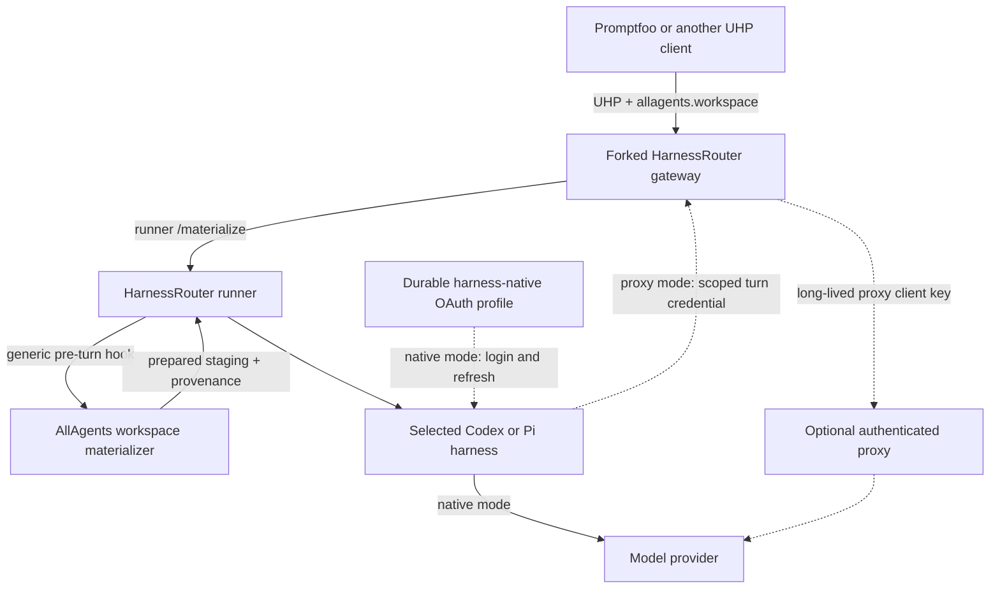

# ADR 0002: Adopt UHP through HarnessRouter with an AllAgents workspace materializer

- Status: Accepted; implementation pending
- Date: 2026-09-21

## Decision

AllAgents will use the Unified Harness Protocol (UHP) `2026-09-12` through a
pinned HarnessRouter Community Edition deployment for remote Codex and Pi
execution.

The selected harness owns provider authentication. Codex signs in through
`codex login`; Pi signs in through its `/login` flow for the configured provider.
Those native OAuth sessions are the default and require no provider-route API
key. An explicitly configured API-key-authenticated proxy is a last-resort
route, never an automatic fallback from failed OAuth.

HarnessRouter owns caller authentication, UHP request and response semantics,
streaming, cancellation, idempotency, session continuity, per-session
workspaces, agent execution, usage, and artifacts. AllAgents owns the workspace
descriptor, deterministic source materialization, and provenance returned
through the HarnessRouter response.

The initial deployment will use a narrow AllAgents-maintained HarnessRouter fork.
The fork adds a generic pre-turn workspace-materializer hook. An AllAgents
materializer behind that hook interprets a namespaced workspace descriptor,
acquires the configured Git repository set or an immutable OCI workspace
snapshot, and returns normalized provenance before HarnessRouter launches the
agent.

The fork is a delivery mechanism, not a new protocol. All fork changes must be
structured for a later upstream contribution. Delivery does not depend on
upstream acceptance or timing.

Implementation details live in the
[coding-agent execution gateway plan](../plans/2026-09-18-0837-feat-coding-execution-gateway-plan.md).

## Topology



Promptfoo authenticates to HarnessRouter with a HarnessRouter API key. That
control-plane credential is separate from provider authentication. In the
default route, the selected Codex or Pi process uses its own durable OAuth
profile and refreshes it through the harness's native mechanism. HarnessRouter
does not translate that OAuth session into an API key.

Native OAuth is an owner-trust mode: the selected harness and tool subprocesses
running under the same operating-system identity may access and emit its
credential. The gateway/runner does not automatically serialize the auth file
into source trees, checkpoints, produced-file records, passive logs, request
metadata, or response metadata, and it mounts no other profile. Deployments that
cannot accept active exfiltration risk must explicitly configure the brokered
proxy route.

## Protocol boundary

UHP is the sole execution wire contract. Version one uses its Responses-shaped
request, ordered streaming events, `previous_response_id` continuation,
cancellation, files, artifacts, usage, lifecycle, and error semantics.
HarnessRouter's UHP conformance suite is the protocol oracle.

AllAgents adds one namespaced request extension:

```json
{
  "metadata": {
    "allagents.workspace": {
      "version": "1",
      "source": {
        "kind": "repositories",
        "revisions": {
          "api": "main"
        }
      },
      "workingDirectory": {
        "kind": "repository",
        "repository": "api",
        "path": "packages/service"
      }
    }
  }
}
```

The extension identifies configured sources by logical name. Callers cannot
supply repository or registry origins, host paths, credentials, commands,
environment variables, materializer executables, or Docker options.

The materializer returns a strict result containing the resolved source
identity, logical working directory, workspace-manifest digest, and bounded
failure information. HarnessRouter returns that result in namespaced response
metadata. It does not expose configured origins, physical paths, or credentials.

Ordinary UHP input files remain supported. HarnessRouter applies the materialized
workspace first and request input files second, so explicit attachments may
overlay source files deterministically.

## Workspace and session semantics

The workspace descriptor and selected authentication binding are accepted only
when creating the first response in a session. HarnessRouter binds the canonical
workspace digest, resolved provenance, harness target, auth mode, and native
profile or proxy-connection identity/digest before agent execution.

A continuation uses `previous_response_id` and the same HarnessRouter session
workspace. It must omit the workspace descriptor and reuse the persisted auth
binding. A deployment configuration change never silently switches mode,
profile, or connection; if the exact binding is unavailable, continuation fails
closed until it is restored. A new source revision, working directory, or auth
binding requires a new session.

The materializer runs before the first agent turn and never depends on the model
reading a prompt, calling an MCP tool, or extracting an archive. Source
acquisition failure starts no agent process and never falls through to another
source mode or credential identity.

Workspaces are writable and private to the HarnessRouter session. Version one
does not provide read-only workspaces or copy-on-write generations. The fork
extends HarnessRouter's existing workspace checkpoint with a durable pre-agent
materialization state and nested-repository collection metadata.

Completed session state survives a HarnessRouter restart when its documented
durable data volume is preserved. An in-flight agent process does not survive
whole-container termination. Interrupted turns fail and are not replayed
automatically; a later continuation is allowed only when HarnessRouter reports
the session resumable.

## Fork boundary

The HarnessRouter fork is limited to the workspace-integration seam and the
harness-native authentication-state seam. The workspace seam:

1. recognizes one configured, bounded metadata key on the first UHP response;
2. treats its JSON value as opaque, canonicalizes it, and binds it to the session;
3. calls a dedicated runner materialization endpoint once, before provider
   selection or fallback;
4. invokes the configured materializer executable and validates its typed envelope;
5. publishes and checkpoints the prepared workspace before any agent starts;
6. allows a symlink-safe logical working directory beneath the session root while
   preserving session-UID isolation;
7. preserves nested repository Git state and collects their produced files;
8. persists and returns bounded hook metadata through streaming, terminal,
   retrieval, and idempotent-replay response paths;
9. rejects the workspace key on continuations;
10. applies ordinary input files only after successful materialization; and
11. strips every configured materializer-only environment name from agent children.

The authentication-state seam separates session conversation state from durable
per-harness OAuth state. In native mode it projects only the selected profile
into the Codex or Pi home and permits the harness to persist token refreshes. It
prevents the gateway/runner lifecycle from copying auth files into checkpoints,
produced-file records, passive logs, or public metadata. Other profile roots are
not mounted.
This does not prevent the selected harness or same-identity tools from reading
or emitting the credential inside the accepted owner-trust boundary.

The projection mechanism must preserve each harness's credential-file write and
atomic-replacement behavior. A locally committed refresh uses a same-filesystem
temporary file, file and parent-directory `fsync`, atomic rename, and validation.
A crash after the provider rotates credentials but before local commit may leave
the profile stale; restart marks it `repair-required` when validation fails and
requires native login again. It never switches profiles or activates the proxy.
Version one holds a per-profile lock for every refresh-capable turn and every
login, logout, or repair operation. A second turn for that profile waits or
fails before launch.

The generic fork layer does not understand the AllAgents descriptor. It enforces
only the configured key, JSON/size bounds, immutable first-turn binding, hook
envelope, lifecycle, and response namespace. The external AllAgents executable
owns schema/default validation, workspace configuration, Git/OCI acquisition,
source-credential selection, filesystem policy, and provenance.

The fork must preserve stock behavior for requests without the configured key
and must continue to pass upstream UHP conformance. The maintained patch series
is pinned to an upstream commit, covered by focused integration tests, and kept
free of unrelated changes. The intended upstream contributions are the generic
materializer boundary and secure harness-auth state separation, not the
AllAgents-specific descriptor schema.

## Source authority and credentials

The project `workspace.yaml` remains the source of truth for logical repository
names, origins, non-root destinations, and default revisions. Repository
execution names are explicit `name` values or the portable basename of `path`;
duplicate names or destinations, root destinations, and local/originless entries
make execution preflight fail. Its schema gains a strict `workspaceSnapshots`
catalog and environment-variable credential references; secret values remain
deployment-only. HarnessRouter owns harness/model/provider configuration. The
user workspace does not become a second source catalog, and no `gateway.yaml` or
caller-controlled registry is introduced.

Repository mode acquires the complete declared repository set, with optional
revision overrides by logical name. It accepts only a bounded ref-name grammar,
rejects option-like or refspec-shaped values, resolves advertised refs to full
commits before agent execution, fetches by verified object ID, and records those
commits in provenance.

Snapshot mode accepts only a configured OCI repository plus immutable manifest
and workspace-manifest digests. It verifies manifest, config, layer sizes and
digests, applies OCI whiteouts, validates the resulting declared workspace
layout, and records the ordered layer digests.

Source credentials are selected server-side from an owner-only secret mount or
credential-store handle available to the runner, not from the long-lived service
environment. The runner resolves exactly the selected value when it constructs
the materializer child environment; the gateway/runner base environment and
every agent child remain credential-free. The materializer must use hermetic
Git/registry configuration, prevent credentials from being persisted in Git
configuration or remote URLs, remove temporary credential state before
returning, and emit no secret value. If a configured source secret appears in
the service or agent environment, the runner refuses to launch the agent.

## Trust and deployment

HarnessRouter API authentication is mandatory on every externally reachable UHP,
response/session retrieval, stream, cancellation, file, and artifact endpoint,
even on a private network. Gateway-to-runner operations are not externally
routable and are mutually authenticated. Operators should still bind the
deployment to loopback or a private network and enforce Tailscale ACLs, firewall
policy, or equivalent controls. Version one is not a public multi-tenant service.

HarnessRouter CE provides per-session operating-system identities and workspace
directories, not a hostile-code sandbox. Native harness OAuth therefore requires
an operator-owned, private deployment: agent tools sharing the harness identity
may access that harness's OAuth profile. Operators requiring stronger provider
credential isolation must use the explicit brokered proxy route or place the
complete deployment inside a stronger isolation boundary.

The deployment uses a pinned custom HarnessRouter image containing:

- an OCI base image pinned by digest;
- the pinned HarnessRouter CE revision plus the reviewed patch series;
- the AllAgents materializer executable and its locked runtime dependencies;
- version-locked OS packages and Git/OCI source-acquisition tools; and
- pinned HarnessRouter-supported Codex and Pi versions.

AllAgents publishes the `linux/amd64` release image as the public package
`ghcr.io/allagentsdev/harnessrouter`. Version and commit tags are mutable
discovery labels; deployment configuration pins the published manifest digest.
A protected release workflow publishes from an approved ref, uses commit-pinned
actions, and separates unprivileged build/test jobs from the environment-approved
publish job. GitHub's package permission replaces third-party registry
credentials. The final manifest digest receives GitHub/Sigstore build-provenance
and SBOM attestations. Both must verify the expected repository, workflow, ref,
subject digest, and predicate before deployment.

Each configured harness target binds exactly one authentication union:
`nativeOAuth` plus a profile, or `proxyApiKey` plus a proxy connection.
`nativeOAuth` is the default. The operator runs `codex login` against a dedicated
Codex auth root or Pi `/login` against a dedicated Pi auth root during controlled
setup. Codex uses file credential storage under `CODEX_HOME`; Pi uses
`~/.pi/agent/auth.json`. Both harnesses own token refresh. Conversation and
rollout state remain session-scoped, while refreshed OAuth state persists in the
selected auth root outside the workspace checkpoint.

The runner verifies the selected binding and a live turn before advertising the
target: login status and refresh for native OAuth, or proxy configuration,
broker, and endpoint compatibility for `proxyApiKey`. A missing, expired,
revoked, or unrefreshable OAuth profile disables that target; it does not select
another profile or fall through to an API key.

`proxyApiKey` is an optional, explicit last-resort mode. HarnessRouter keeps the
long-lived proxy client key in the gateway. It gives the harness a
non-refreshable broker credential bound to one proxy audience, harness target,
model allowlist, response/turn ID, and the UHP deadline plus minimal clock skew.
The token may authorize the bounded provider calls, compaction, and retries
needed during that active turn. Cancellation or terminal completion revokes it;
logs, checkpoints, artifacts, and stored responses do not passively persist it.
A configured proxy such as `codex-lb` owns its upstream provider authentication.
The HarnessRouter broker must reject wrong-audience, wrong-model, wrong-turn,
expired, or revoked credentials. Native OAuth failure never activates this route
automatically.

## Failure behavior

- **Invalid extension:** the AllAgents hook rejects it before acquisition.
- **Extension on a continuation:** reject without changing session state.
- **Unknown logical source or working directory:** fail before network access.
- **Source authentication or acquisition failure:** remove partial workspace
  state, return a stable materializer failure, and start no agent or provider
  fallback.
- **Materializer timeout or crash:** terminate the hook, remove partial source
  state, return failure, and start no agent.
- **Agent cancellation or timeout:** use HarnessRouter's UHP lifecycle and
  cancellation behavior.
- **HarnessRouter restart:** preserve completed state from the durable volume;
  fail interrupted turns without automatic replay.
- **Provider authentication failure:** fail the selected harness target without
  switching OAuth profiles or activating the proxy/API-key route.
- **Provider execution failure:** return HarnessRouter's normalized UHP failure
  without source fallback or credential material in public output.

Failures report only verified provenance. Partial acquisition never appears as a
complete workspace identity.

## Consequences

HarnessRouter is the execution control plane. AllAgents does not add a parallel
task/session store, streaming lifecycle, process supervisor, artifact service,
provider adapter, or Promptfoo-specific runtime.

AllAgents owns workspace selection, deterministic Git/OCI materialization,
source credentials, provenance, the HarnessRouter integration patch, and
deployment documentation. The selected harness owns provider OAuth login and
refresh. Native OAuth deliberately places that profile inside the
operator-controlled harness trust boundary; source-acquisition credentials
remain isolated from the harness.

The integration requires a maintained fork and custom image. The fork must be
rebased and tested against upstream releases until the generic seams are
accepted or equivalent supported extensions exist.

## Alternatives rejected

- **Custom execution gateway:** duplicates mature UHP/HarnessRouter session,
  streaming, cancellation, authentication, artifact, and provider behavior.
- **Proxy-first provider authentication:** adds a mandatory API key and network
  hop even when Codex or Pi can use the operator's subscription directly. The
  proxy remains an explicit compatibility and isolation fallback.
- **Thin adapter in front of stock HarnessRouter:** avoids a fork but introduces
  another network service and makes source acquisition a client-side concern.
- **Put the descriptor in the prompt:** lets the model control acquisition and
  is not deterministic or safe.
- **Expose acquisition as an MCP tool:** depends on the model choosing to call it
  and runs too late to define the initial working directory.
- **Upload every source file as UHP input files:** works for small regular-file
  snapshots, but loses exact symlink, mode, and OCI layer semantics and moves
  repository acquisition to every caller.
- **Wait for upstream before delivery:** makes the product schedule depend on a
  project we do not maintain.

## Deliberate limits

Version one does not add evaluation datasets, scoring, assertions, automatic
retries, session branching, concurrent turns within one session, concurrent
refresh-capable turns sharing an auth profile, caller-supplied origins, public
multi-tenancy, arbitrary materializer commands, mutable OCI tags, transparent
source-mode fallback, or guaranteed provider prompt-cache hits.

## Reconsider when

Revisit this decision when:

- upstream HarnessRouter accepts the generic materializer hook or exposes an
  equivalent supported extension;
- the maintained patch grows beyond the narrow integration boundary;
- HarnessRouter changes or removes required UHP/session/provider behavior;
- exact per-turn workspace rollback becomes a product requirement;
- source acquisition must run in a stronger isolation boundary;
- callers require a public multi-tenant authorization model; or
- a second independent UHP implementation offers a materially smaller and more
  stable integration surface.
