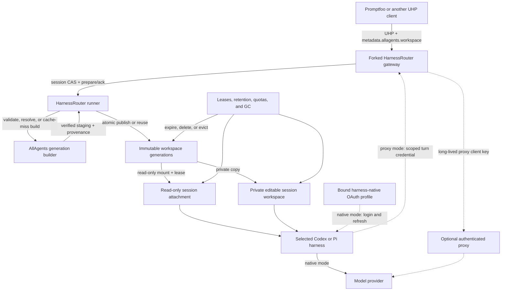

# ADR 0002: Adopt UHP through HarnessRouter with an AllAgents workspace materializer

- Status: Accepted; implementation gated on native-auth feasibility
- Date: 2026-09-21
- Updated: 2026-09-23

## Decision

AllAgents will use the Unified Harness Protocol (UHP) `2026-09-12` through a
pinned HarnessRouter Community Edition deployment for remote Codex and Pi
execution.

The selected harness owns provider authentication. Codex signs in through
`codex login`; Pi signs in through its `/login` flow for the configured provider.
Those native OAuth sessions are the default and require no provider-route API
key. An explicitly configured API-key-authenticated proxy is a last-resort
route, never an automatic fallback from failed OAuth. Optional describes
deployment configuration, not release scope: version one implements and verifies
the route so operators that reject the native owner-trust boundary have a
supported alternative.

HarnessRouter owns caller authentication, UHP request and response semantics,
streaming, cancellation, idempotency, session continuity, workspace-generation
publication, session attachments, retention, quotas, garbage collection, agent
execution, usage, and artifacts. AllAgents owns the
`metadata["allagents.workspace"]` JSON descriptor, including caller-supplied
HTTPS Git repository URLs, deterministic Git/OCI generation construction, and
provenance returned through the HarnessRouter response. Project
`workspace.yaml` is not the authority for caller-requested Git origins.

The initial deployment will use a narrow AllAgents-maintained HarnessRouter fork.
Its generic pre-turn workspace hook resolves a verified immutable source
generation. HarnessRouter reuses an existing generation when possible; otherwise
an AllAgents materializer builds private staging and HarnessRouter atomically
publishes it. Each session then receives either a shared read-only attachment or
a private editable workspace derived from that generation before the harness
starts.

The fork is a delivery mechanism, not a new protocol. All fork changes must be
structured for a later upstream contribution. Delivery does not depend on
upstream acceptance or timing.

Implementation details live in the
[coding-agent execution gateway plan](../plans/2026-09-18-0837-feat-coding-execution-gateway-plan.md).

## Topology



Promptfoo authenticates to HarnessRouter with a HarnessRouter API key. That
control-plane credential is separate from provider authentication. In the
default route, the selected Codex or Pi process uses its own durable OAuth
profile and refreshes it through the harness's native mechanism. HarnessRouter
does not translate that OAuth session into an API key.

Native OAuth is an owner-trust mode: the selected harness and tool subprocesses
running under the same operating-system identity may access and emit its
credential during an active turn. The runner projects only the selected profile
through a turn-scoped mount namespace or equivalent same-filesystem view; it
never copies the credential into durable session state. Before terminal
acknowledgement and profile-lock release it commits or rejects refresh, removes
the projection, and verifies retained homes clean. Restart removes or quarantines
stale projections before readiness or profile reacquisition. Checkpoints,
produced-file records, backups, passive logs, request metadata, and response
metadata never serialize the auth file. Deployments that cannot accept active
exfiltration risk must explicitly configure the brokered proxy route.

## Protocol boundary

UHP is the sole execution wire contract. Version one uses its Responses-shaped
request, ordered streaming events, `previous_response_id` continuation,
cancellation, files, artifacts, usage, lifecycle, and error semantics.
HarnessRouter's UHP conformance suite is the protocol oracle.

AllAgents adds one namespaced JSON request extension:

```json
{
  "metadata": {
    "allagents.workspace": {
      "version": "1",
      "access": "readOnly",
      "retention": "session",
      "source": {
        "kind": "repositories",
        "repositories": [
          {
            "name": "api",
            "url": "https://github.com/acme/api.git",
            "revision": "main",
            "destination": "api"
          }
        ]
      },
      "workingDirectory": {
        "kind": "repository",
        "repository": "api",
        "path": "packages/service"
      }
    }
  }
}
```

`metadata["allagents.workspace"]` is the first-response session descriptor, not
the project configuration file. Promptfoo supplies each repository's logical
name, HTTPS Git URL, optional revision, and destination. The pre-turn
materializer resolves and loads those repositories before the harness starts, so
the harness receives the populated workspace; this is not a model-directed
in-agent `git clone`. The descriptor cannot supply credentials, host paths,
commands, environment variables, materializer executables, or Docker options.

`access` is required and is exactly `readOnly` or `editable`. `retention` is
optional and defaults to `session`; `persistent` is accepted only when enabled
by deployment policy and within persistent-workspace quotas. Access and
retention are independent: either access mode may use either retention class.

Namespaced response metadata contains the effective descriptor digest, resolved
source provenance, public `generationId`, logical working directory, workspace-
manifest digest, access mode, retention class, and effective expiry.
`generationId` is the SHA-256 digest of versioned RFC 8785 bytes containing only
the returned normalized source provenance, normalized destinations, and
workspace-manifest digest; it is never an internal cache, authorization,
attachment, or lookup key. Active turns and `persistent` sessions report
`expiresAt: null`; a `session` terminal acknowledgement sets the timestamp
returned by terminal, retrieval, and replay paths. Failures before attachment
`ready` omit workspace metadata entirely; terminal failures after `ready` include
the same complete public object. Metadata never exposes the private generation
key, raw request digest, URL credentials (which requests cannot contain),
credential-scope mappings or selected references/values, redirect-chain URLs,
resolved network addresses, physical paths, internal generation-epoch/lease/
attachment identifiers, or other sessions' quota state. Normalized caller-
supplied repository URLs and resolved commits are returned as source provenance.

Ordinary UHP input files remain supported for `editable` sessions and are
applied to the private workspace after generation attachment. A `readOnly`
request containing workspace input files is rejected after response allocation
but before source byte acquisition; the system never shadows a read-only
generation with an implicit writable layer.

## Workspace generations and session semantics

On the first response, HarnessRouter atomically binds the session to one
canonical workspace descriptor, one verified generation key and publication
epoch, one access mode, one retention class, one harness target, and exactly one
native profile or proxy connection. A new source revision, logical working
directory, access mode, retention class, harness, or authentication binding
requires a new session.

A workspace generation is immutable source-visible content identified by a
canonical resolved-source key and a verified workspace-manifest digest. Each
publication also has a unique internal epoch ID. At most one live epoch exists
for a key; a later epoch may begin only after durable logical and physical
eviction of the prior one completes, and existing sessions never substitute it.
In repository mode publication also binds a separately validated semantic Git-
state record to the exact resolved commits; volatile `.git` pack/index bytes do
not fragment identity. Sharing authorization and selected credential-reference
identities do fragment the key; credential values do not. Access, retention,
logical working directory, harness target, profile, and session identity do not.

Concurrent requests for the same absent epoch share one runner-owned build claim
and observe one atomically published result. Each request retains its own
cancellation and deadline: cancellation detaches only that waiter, and the build
continues while another live waiter exists. Failed or partial staging never
becomes attachable. A ready hit or completed build acquires a durable provisional
attachment pin under the same generation lock before mount or copy; garbage
collection cannot race that pin.

A `readOnly` session mounts the published generation read-only. Multiple sessions
using different harnesses or authentication profiles may execute concurrently
against the same generation while keeping their operating-system identity,
conversation state, harness home, temporary files, logs, outputs, and response
state separate. The filesystem, not caller intent, enforces generation
immutability.

An `editable` session receives a unique private writable copy derived from the
generation. After a shared publication, each editable waiter independently proves
the generation's full physical byte/inode usage fits its admitted hard allowance;
a non-fitting waiter fails alone without invalidating the ready epoch or another
waiter. No writable inode or checkpoint is shared with another session, and
mutations never flow back into the generation. The allowance covers the private
tree, UHP input overlays, root/nested checkpoints, and produced-file state
throughout every turn and continuation. Exceeding it fails the turn without
changing access or retention. Read-only sessions have no workspace mutation
checkpoint or produced-file delta; editable sessions preserve private mutations,
checkpoints, and produced files.

The gateway is the sole writer of session attachment, expiry, and tombstone
state. The runner owns generation/reference/mount/private-resource state. It
durably prepares resources and returns opaque attachment evidence; the gateway
commits `ready` and acknowledges it. That acknowledgement causes the runner to
release the provisional pin exactly once. Restart either preserves a committed
attachment or rolls an uncommitted prepare back; neither component independently
binds the other's state.

One generation use updates `lastUsedAt` only when the gateway commits an
attachment `ready`. Before that it remains null. After acknowledgement, the
runner records `max(existing, readyCommitTimestamp)` under the generation lock;
startup can replay a missed update idempotently from committed gateway evidence.
Publication or a failed prepare does not count as use. Eviction orders null
`lastUsedAt` first by `publishedAt`, then non-null `lastUsedAt`, then
`publishedAt`, ascending generation-key bytes, and epoch-ID bytes.

A continuation uses `previous_response_id`, omits
`metadata["allagents.workspace"]`, and reuses the original session binding only
when its exact key/epoch evidence remains valid and retention is persistent or
its session idle deadline is unexpired. It sees the same immutable epoch in
`readOnly` mode or the same private writable workspace in `editable` mode. It
cannot change the generation, access, retention, logical working directory,
harness, profile, or proxy connection. A changed or unavailable authentication
binding fails closed until restored. Known missing or corrupt attachment evidence
returns `allagents_workspace_non_resumable`; it never resolves source,
rematerializes, or substitutes a rebuilt epoch.

Generation resolution and attachment finish before the first agent turn. On a
cache miss, materialization, independent verification, and atomic publication
also finish first; on a hit, byte acquisition is skipped. Source failure starts
no agent process and never falls through to another source mode, access mode,
credential identity, or provider route.

Every active operation holds a durable session lease and has no idle expiry. One
gateway session CAS checks `session_busy`, exact attachment/binding, and expiry/
deletion together. A busy or invalid attempt changes no deadline. A valid
`session` continuation stores and clears its unexpired deadline in a provisional
turn-admission fence before the zero-waiter profile attempt. Profile success
commits active; pre-allocation profile failure restores the exact original
deadline when still future or tombstones the session if it elapsed. A read-only
session keeps an exact generation-epoch reference until expiry or deletion. An
editable session holds a provisional generation pin through successful private-
copy attachment, then retains only its private workspace and provenance. Idle
time starts only after durable terminal acknowledgement; GET, stream polling, and
idempotent replay do not renew it.

Deployment policy supplies finite, nonzero limits for session idle TTL, staging
bytes and concurrent builds, published-generation bytes/count, each editable
session's hard bytes/inodes, total reserved private bytes/inodes, total sessions,
persistent sessions, and tombstone bytes/count/TTL. Before exposing a workspace
response/session, one idempotent admission token durably reserves its generic
session slot and fixed-size tombstone slot. Invalid descriptors remain charged
through finite failed-response retention, tombstoning, and purge. After
validation, `persistent` and the stable editable private-reservation ID are
authorized/reserved before source resolution. Active leases, durable references,
and provisional pins are never evicted. Ready zero-reference/zero-pin epochs are
the only generation GC candidates; failed deletion remains quarantined and
counted, prevents same-key republication, and never advertises freed capacity. If
protected state consumes available quota, new admission fails instead of
deleting protected state or changing policy.

Expiry or authenticated deletion atomically tombstones the session before
cleanup, rejects new continuations, waits for active work, credential projections,
and mounts to quiesce, removes private state, and releases every reference and
reservation exactly once. Retained tombstones live at least as long as response/
idempotency records and produce `allagents_workspace_expired`; bounded compaction
then purges both lifecycle identity and its reserved slot, after which the stock
non-disclosing unknown-ID error applies. Neither outcome silently rematerializes.

Completed, unexpired session state and generation records survive a
HarnessRouter restart when the documented durable volume is preserved. Startup
reconciles build waiters, provisional pins, publications, leases, mounts, private
quota usage, credential projections, tombstones/compaction, and deletion before
readiness or garbage collection. An internal `containment_pending` session stays
non-terminal until its recorded cgroup is empty. In-flight agent processes do not
survive whole-container termination; interrupted turns fail and are not replayed
automatically.

## Fork boundary

The HarnessRouter fork is limited to the workspace-integration seam and the
harness-native authentication-state seam. The workspace seam:

1. recognizes one configured, bounded JSON metadata key and, before response
   allocation, uses the idempotent admission transaction to reserve its generic
   session and tombstone slots together with applicable profile admission;
2. canonicalizes the initial JSON, records its raw digest, binds it to the
   allocated session, and invokes source-free generic `validate` to return
   effective access, requested retention, effective descriptor digest/cwd, a
   bounded selected credential-reference set, and a private normalized-
   descriptor reference; the runner verifies that set against secret-free
   preflight declarations and credential-store handles;
3. makes the runner the sole persistence authority and, before source
   resolution, reserves any persistence slot and one stable editable hard-private
   byte/inode reservation ID;
4. invokes `resolve` with the exact validated descriptor and selected reference
   set to produce an exact private source-plan reference/digest, generation key,
   and bounded provenance;
5. atomically joins or creates a runner-owned generation epoch build, preserves
   each waiter's cancellation/deadline, takes ownership of the exact resolved
   plan and selected reference identities, reserves full staging/prospective-
   generation capacity before byte acquisition, and acquires a provisional pin
   before handing a ready epoch to attachment;
6. invokes `materialize` with that resolved plan and selected set only on a miss,
   independently validates staging, semantic Git state, and its manifest, proves
   the materializer boundary empty, computes physical retained byte/inode usage,
   and under the generation lock atomically converts prospective capacity to
   actual usage, releases excess plus staging reservation, persists accounting,
   and publishes the immutable epoch before waiter pins;
7. independently checks each editable waiter's initial copy fit, then has the
   runner prepare a read-only epoch reference/mount or a private editable copy
   carrying the admitted private-reservation ID, has the gateway alone commit the
   attachment `ready`, and on acknowledgement transfers the reservation without
   a second debit and releases the provisional pin;
8. allows a symlink-safe logical working directory while preserving per-session
   identity and writable-state isolation;
9. checkpoints and collects produced files only from private editable state and
   enforces its byte/inode quota across every turn;
10. persists bounded generation, attachment, retention, expiry, and provenance
    metadata through streaming, terminal, retrieval, and idempotent replay paths;
11. rejects the workspace key on continuations and never renews retention for
    polling or replay;
12. applies ordinary input files only to editable private state;
13. strips every configured materializer-only environment name from agent
    children; and
14. owns crash-safe build/pin/reference reconciliation, bounded tombstones,
    expiry, deletion, quota admission, and deterministic eviction of only ready
    unreferenced and unpinned generation epochs.

The authentication-state seam separates session conversation state from durable
per-harness OAuth state. In native mode it projects only the selected profile
into the Codex or Pi home for the active turn and permits the harness to persist
token refreshes. The projection preserves the harness's credential-file write
and atomic-replacement behavior without copying the credential into the retained
session home. It is removed after descendant termination and refresh disposition,
before terminal acknowledgement or lock release. Checkpoints, produced-file
records, backups, passive logs, and public metadata exclude it. Other profile
roots are never mounted. This does not prevent the selected harness or
same-identity tools from reading or emitting the credential inside the accepted
owner-trust boundary.

A locally committed refresh uses a same-filesystem temporary file, file and
parent-directory `fsync`, atomic rename, and validation. A crash after the
provider rotates credentials but before local commit may leave the profile stale;
restart marks it `repair-required` when validation fails, removes or quarantines
stale projections, and requires native login again before readiness. It never
switches profiles or activates the proxy. Version one supports exactly one active
refresh-capable turn per native profile and holds that profile lock for every turn
and every login, logout, or repair operation. Admission first atomically claims
the UHP `Idempotency-Key`; concurrent same-key requests share one
admission/result. The session CAS returns stock `session_busy` before changing
the deadline, then provisionally fences a genuinely new turn before it tries the
zero-waiter profile lock. Collision returns HTTP 503 `harness_unavailable` with
`detail.reason: "allagents_auth_profile_busy"` before response allocation,
runner work, or materialization, and rolls the session fence back to the exact
future deadline or an elapsed-deadline tombstone.

The runner turn supervisor persists the admission record and owns the profile
lock through descendant termination, refresh disposition, projection teardown,
and terminal-state acknowledgement. Gateway-only failure cannot release it.
Runner failure leaves a durable fence; startup blocks readiness and admission
until descendant, projection, and profile reconciliation. Operators provision
distinct profiles for parallel capacity.

The generic fork layer does not understand the AllAgents descriptor. It enforces
only the configured key, JSON/size bounds, immutable first-turn binding, typed
hook envelope, runner-owned persistence authorization, lifecycle, and response
namespace. The external AllAgents executable owns schema/default validation,
workspace configuration, Git/OCI acquisition, source-credential selection,
source-tree construction policy, and provenance; it never authorizes retention
or writes live session state.

The fork must preserve stock behavior for requests without the configured key
and must continue to pass upstream UHP conformance. The maintained patch series
is pinned to an upstream commit, covered by focused integration tests, and kept
free of unrelated changes. The intended upstream contributions are the generic
materializer boundary and secure harness-auth state separation, not the
AllAgents-specific descriptor schema.

## Phase-zero feasibility gate

The harness-native auth adapter is a blocking phase-zero spike. Production
workspace-materializer implementation must not begin until a minimal pinned image
using the release's HarnessRouter, base-image, and Codex/Pi inputs proves the
adapter with real provider traffic. The spike does not need the AllAgents
materializer, Git acquisition, or OCI acquisition.

The gate evidence records the HarnessRouter commit, base-image digest, Codex
version, Pi version, and auth-adapter patch digest. Those inputs are frozen for
dependent work. Changing any of them invalidates the gate: dependent work must
stop until both native targets pass again on the new input set.

Each required native target must prove:

1. operator-controlled native login in its dedicated profile root;
2. a real first turn and continuation without a provider-route API key;
3. persisted auth-binding identity across restart and fail-closed behavior when
   that binding is changed or unavailable;
4. session-specific conversation state with only the selected auth profile
   visible to the harness identity;
5. serialized overlapping turns for one profile;
6. complete local credential files after termination before, during, and after
   refresh persistence, with invalid post-rotation state becoming
   `repair-required`;
7. active-turn-only projection teardown on success, failure, cancellation, and
   crash recovery, with no auth path retained in homes, mounts, checkpoints,
   produced-file records, backups, passive logs, or response metadata; and
8. explicit acknowledgement that same-identity harness tools can read or emit
   the selected credential.

The proxy route cannot satisfy this gate on behalf of a native target. If either
required native target fails, dependent implementation stops. Continuing with a
proxy-only target or narrower harness scope requires an explicit decision change;
the implementation must not introduce an implicit fallback or credential shim.

## Source authority and credentials

Project `workspace.yaml` remains the source of truth for the ordinary local
AllAgents workspace and the optional operator-owned OCI snapshot catalog. It is
not a Git origin allowlist and is not consulted to translate repository names in
a UHP request. HarnessRouter deployment configuration owns harness/model/provider
targets, persistence authorization, idle TTLs, quotas, garbage-collection policy,
outbound network policy, and optional source-credential scope mappings.

For repository mode, the UHP JSON descriptor supplies one through 128 repository
objects containing required `name`, `url`, and `destination` fields plus an
optional `revision`. `workingDirectory.repository` references `name`;
`destination` is a non-empty, non-root relative path. Names and destinations are
unique, and destinations are pairwise non-overlapping. The descriptor is session
input, not parsed as, merged with, or persisted as a replacement for
`workspace.yaml`.

An authenticated caller may request any repository reachable through the
deployment's HTTPS egress boundary. Before parsing, validation rejects ASCII
controls, whitespace, and backslashes. It parses once with the WHATWG URL
Standard and requires the input bytes to equal the serialized URL exactly. That
serialization must use `https`, an ASCII lowercase IDNA A-label DNS hostname
without a trailing dot, no userinfo/query/fragment or IP literal, no explicit
default port, a non-empty repository path, and no percent-encoded control, slash,
backslash, or dot segment. The same serialization and structured `(scheme, host,
effectivePort)` origin drive policy, credentials, redirects, DNS, provenance,
generation identity, and the exact Git/libcurl request. Local paths and `file`,
`ssh`, `git`, and extension transports are rejected.

The acquisition child cannot bypass the deployment connector through direct
network access or inherited proxy configuration. Resolution and each connection
or redirect reject the entire DNS answer set if any address is loopback, link-
local, private, reserved, metadata, or otherwise non-public; the connector pins
one approved address for each connection. At most five redirects are accepted.
Each is parsed and serialized by the same rules, re-resolved, and rechecked.
Deployment policy may further restrict egress but does not require every
repository to be predeclared.

The materializer `preflight` receives no repository URL or secret value. It
validates hook/policy versions, credential-scope mapping syntax, and source tools,
then returns bounded configured credential-reference names or opaque IDs. A
credential scope is either an exact structured origin or that origin plus a
canonical repository-path segment prefix; a prefix matches complete segments,
never raw strings. Source-free `validate` selects the matching rule with the most
path segments for each normalized URL. The runner, not the hook, verifies those
store handles and actual filesystem relationships and injects values only into
`resolve` or `materialize`.

Repository mode acquires exactly the caller-declared repository set. It accepts
only a bounded ref-name grammar, rejects option-like or refspec-shaped values,
resolves the requested revision—or the remote symbolic HEAD when omitted—to a
full commit before agent execution, fetches by verified object ID, and records
the normalized URL, requested revision, and commit in provenance. It preserves
`.git` for coding tools but hermetically normalizes the allowed detached-HEAD
configuration/ref set and removes reflogs, `FETCH_HEAD`, locks, hooks, worktree
links, alternates, shallow/replace/graft state, extra refs, extra objects, and
credential-bearing configuration. The runner independently verifies HEAD, an
index exactly matching the resolved commit tree, its canonical object-set digest,
and exactly the transitive required object closure with no extras. It then proves
the source-visible manifest equals exactly the union of each resolved commit tree
prefixed by its pairwise non-overlapping destination plus only necessary
destination ancestor directories. Undeclared paths outside that union fail
integrity validation.

Snapshot mode accepts only a configured OCI repository plus immutable image-
manifest and workspace-manifest digests. It verifies the image manifest,
canonical workspace-manifest bytes, layer sizes and digests, applies OCI
whiteouts, validates the resulting declared workspace layout against the
manifest, rejects `.git` administrative subtrees, and records the ordered layer
digests. Version-one snapshot requests use `workspaceRoot`; snapshots requiring
Git history or repository-relative working directories use repository mode.

Both source modes produce the same versioned canonical workspace manifest. Its
RFC 8785 bytes enumerate every source-visible directory, regular file, and
symbolic link in logical path order with normalized mode, size, content digest,
or link target as applicable. Repository mode omits only separately validated
`.git` administrative subtrees so volatile pack/index/stat representation does
not fragment identity; no source-visible path may be omitted. Git mode computes
the manifest from completed staging and binds it to the semantic Git-state record
for the resolved commits. OCI mode carries the same bytes in the configured
workspace-manifest blob and must reproduce them after applying the layers. The
runner receives the manifest through a private bounded result root, verifies its
digest, source-visible tree, and any omitted Git state independently, and never
places the manifest in source content.

Before materialization, resolution computes a canonical generation key from every
input that can affect source-visible bytes, declared agent-visible filesystem
semantics, or sharing authorization: descriptor and hook contract versions,
deployment authorization scope, normalized caller Git URLs, bounded selected
credential-reference identities, resolved commits or immutable OCI digests,
normalized destinations, snapshot identity when applicable, and acquisition/
egress policy version. Logical repository names, physical paths, access,
retention, working directory, harness/profile identity, credential values, and
volatile Git administrative representation are excluded. Publication binds that
key and one
internal epoch to one verified workspace-manifest digest and, in repository mode,
one semantic Git-state record. Materialize receives the exact private source-only
plan bytes/digest and selected reference set returned by resolve; it never
re-resolves source.

The generation backing store is owner-writable and never exposed writable to a
session. Publication is a recoverable same-filesystem atomic transition.
Editable copies may use a safe copy or snapshot mechanism but may not share
mutable inodes with the generation. Corrupt, partial, quarantined, or deleting
generations are not attachable.

Source credentials are selected server-side from an owner-only secret mount or
credential-store handle available to the runner, not from request JSON or the
long-lived service environment. Anonymous access is used when no configured
credential scope matches. Otherwise the runner resolves only the selected value
when constructing a source-access child environment. That child has an isolated
HOME, no inherited proxy variables, no direct network path, hermetic Git/
registry configuration, `credential.useHttpPath=true`, and an ephemeral helper
that independently rejects any protocol, host, effective port, or canonical
repository path outside the selected structured scope. Each redirect is checked
against the originally selected scope; credentials are stripped whenever it
leaves that scope, including a same-origin path-prefix escape, and a redirect
never selects a new credential. Credentials are never encoded in the URL,
persisted in Git configuration or remote URLs, or emitted. Temporary credential
state is removed before return. The gateway/runner base environment and every
agent child remain credential-free; if a configured source secret appears there,
the runner refuses to launch the agent.

## Trust and deployment

HarnessRouter API authentication is mandatory on every externally reachable UHP,
response/session retrieval, stream, cancellation, file, artifact, persistence,
deletion, and lifecycle-administration endpoint, even on a private network.
Unauthenticated requests disclose neither existence nor retention state.
Gateway-to-runner operations are not externally
routable and are mutually authenticated. Operators should still bind the
deployment to loopback or a private network and enforce Tailscale ACLs, firewall
policy, or equivalent controls. Version one is not a public multi-tenant service.

HarnessRouter CE provides per-session operating-system identities and private
runtime state, not a hostile-code sandbox. Immutable generations may be mounted
read-only into multiple session identities, but no session receives write access
to their backing store. Editable source state, harness homes, temporary files,
outputs, and checkpoints remain private to one session identity.

Native harness OAuth therefore requires an operator-owned, private deployment:
agent tools sharing the harness identity may access that harness's OAuth profile.
Operators requiring stronger provider credential isolation must use the explicit
brokered proxy route or place the complete deployment inside a stronger
isolation boundary.

The deployment uses a pinned custom HarnessRouter image containing:

- an OCI base image pinned by digest;
- the pinned HarnessRouter CE revision plus the reviewed patch series;
- the AllAgents materializer executable and its locked runtime dependencies;
- version-locked OS packages and Git/OCI source-acquisition tools; and
- pinned HarnessRouter-supported Codex and Pi versions.

The runtime grants only the runner a delegated cgroup v2 subtree and applies an
`on-failure` restart policy. The attested image, durable volumes, project
configuration, secret handle, and cgroup delegation are mounted in non-serving
initialization mode before preflight or reconciliation. Readiness stays false
unless that delegation is usable and startup has removed or quarantined every
orphaned materializer cgroup and credential projection.

Readiness also requires finite session idle TTL; build/staging, generation,
per-editable-session hard byte/inode, total private reservation, session,
persistence, and tombstone quotas; a writable private staging and editable-
workspace volume; and a protected immutable generation store. The runner
validates their actual mount, same-filesystem publication, quota, and isolation
relationships; the hook does not. Readiness also requires successful startup
reconciliation of build waiters, provisional pins, references, quota usage,
mounts, credential projections, tombstone compaction, and interrupted deletion.
Operators must be able to observe aggregate generation, private-workspace,
persistent-session, tombstone, quarantine, and failed-deletion capacity without
receiving source paths or credentials.

AllAgents publishes the `linux/amd64` release image as the public package
`ghcr.io/allagentsdev/harnessrouter`. Version and commit tags are mutable
discovery labels; deployment configuration pins the published manifest digest.
A protected release workflow publishes from an approved ref, uses commit-pinned
actions, and separates unprivileged build/test jobs from the environment-approved
publish job. GitHub's package permission replaces third-party registry
credentials. The final manifest digest receives GitHub/Sigstore build-provenance
and SBOM attestations. Both must verify the expected repository, workflow, ref,
subject digest, and predicate before deployment.

Each configured harness target binds exactly one authentication union:
`nativeOAuth` plus a profile, or `proxyApiKey` plus a proxy connection.
`nativeOAuth` is the default. The operator runs `codex login` against a dedicated
Codex auth root or Pi `/login` against a dedicated Pi auth root during controlled
setup. Codex uses file credential storage under `CODEX_HOME`; Pi uses
`~/.pi/agent/auth.json`. Both harnesses own token refresh. Conversation and
rollout state remain session-scoped, while refreshed OAuth state persists in the
selected auth root outside immutable generations and private workspace
checkpoints.

The runner verifies the selected binding and a live turn before advertising the
target: login status and refresh for native OAuth, or proxy configuration,
broker, and endpoint compatibility for `proxyApiKey`. A missing, expired,
revoked, or unrefreshable OAuth profile disables that target; it does not select
another profile or fall through to an API key.

`proxyApiKey` is optional to configure but its implementation and verification
remain required version-one scope. It is an explicit last-resort mode.
HarnessRouter keeps the long-lived proxy client key in the gateway. It gives the
harness a
non-refreshable broker credential bound to one proxy audience, harness target,
model allowlist, response/turn ID, and the UHP deadline plus minimal clock skew.
The token may authorize the bounded provider calls, compaction, and retries
needed during that active turn. Cancellation or terminal completion revokes it;
logs, checkpoints, artifacts, and stored responses do not passively persist it.
A configured proxy such as `codex-lb` owns its upstream provider authentication.
The HarnessRouter broker must reject wrong-audience, wrong-model, wrong-turn,
expired, or revoked credentials. Native OAuth failure never activates this route
automatically.

## Failure behavior

- **Invalid extension:** the source-free hook validation rejects unknown or
  malformed repository names, URLs, revisions, destinations, source, access,
  retention, or logical-working-directory fields before source resolution.
- **Unauthorized persistence:** after response allocation but before source
  resolution or byte acquisition, the runner rejects
  `retention: "persistent"` when deployment policy does not authorize it; the
  hook never authorizes and the runner never silently downgrades it to `session`.
- **Read-only input overlay:** after response allocation but before source
  resolution, reject workspace input files on a `readOnly` request. A runtime
  write receives the filesystem's read-only failure and never causes copy-up or
  mode conversion.
- **Extension on a continuation:** reject without changing session state,
  acquiring a lease, or clearing its idle deadline.
- **Expired, deleted, or purged session:** while its bounded tombstone remains,
  return `allagents_workspace_expired` before runner or profile work. After
  tombstone and matching response/idempotency retention are purged, return the
  stock non-disclosing unknown-predecessor error. Neither rematerializes source.
- **Non-resumable session:** a known attached session with missing or corrupt
  bound generation key/epoch, reference, publication, private workspace, or
  checkpoint evidence returns HTTP 409 `allagents_workspace_non_resumable`
  before profile admission. It never substitutes a rebuilt epoch. Because the
  attachment previously reached `ready`, the error includes its committed
  complete public workspace metadata.
- **Busy auth profile:** after atomic idempotency replay and stock `session_busy`
  precedence, a genuinely new cross-session turn fails immediately with HTTP 503
  `harness_unavailable` and
  `detail.reason: "allagents_auth_profile_busy"` before response allocation,
  runner work, or materialization; sessions using other profiles may continue
  concurrently.
- **Capacity exhaustion:** before response allocation, atomically reserve generic
  session/tombstone capacity or return HTTP 503
  `allagents_workspace_capacity_exceeded` without exposing state. After
  validation but before source resolution, reserve persistence and the one
  editable hard byte/inode allowance. After resolve but before byte acquisition,
  a miss claim reserves full staging and prospective generation byte/count
  capacity. Independent post-build full-tree accounting atomically converts the
  generation reservation to physical retained usage and releases excess and
  staging before ready. Each editable waiter then independently proves the
  initial copy fits its hard allowance; a non-fitting waiter fails
  `allagents_workspace_private_quota_exceeded` without invalidating the epoch or
  siblings. Evict only ready epochs with zero references and zero provisional
  pins. Never evict protected state or alter access or retention.
- **Editable quota exhaustion:** fail an editable waiter whose initial copy does
  not fit, or let the filesystem deny a later private-workspace write beyond its
  reserved byte or inode allowance; the runner returns
  `allagents_workspace_private_quota_exceeded`. Persistent sessions cannot exceed
  the same fixed envelope; retries never change mode or retention.
- **Source policy, authentication, or acquisition failure:** reject any
  destination that resolves or redirects outside the permitted public HTTPS
  egress boundary before source bytes reach staging. Strip credentials whenever
  a redirect leaves the originally selected structured scope, including a same-
  origin path-prefix escape. For authentication or transport failure, remove only
  unpublished staging, publish no generation, and start no agent or provider
  fallback. An existing verified generation is not poisoned by a failed
  competing build. Cancelling one build waiter detaches only it; other live
  waiters keep the runner-owned build alive.
- **Generation, attachment, or private-copy failure:** quarantine corrupt or
  incomplete state, release reservations and provisional pins exactly once,
  acquire no live attachment, and fail closed. A session never substitutes
  another generation after binding. Prepare/ack reconciliation preserves only a
  gateway-committed ready attachment.
- **Materializer timeout, cancellation, malformed result, crash, or live
  descendant after parent exit:** create a runner-owned cgroup v2 leaf and start
  the child inside it atomically with `clone3(CLONE_INTO_CGROUP)` or a stopped,
  secret-free pre-exec move-and-verify handshake. The child cannot escape or
  administer the subtree. On every outcome, kill remaining members and wait for
  `cgroup.events` to report `populated 0` before any terminal result, private
  manifest read, generation publication, secret release, or cleanup. A completed
  parent with a live descendant returns the containment failure. An unquiescent
  leaf remains internal `containment_pending`; the runner exits, blocks readiness
  and terminal visibility, and startup transitions once to the preserved failed,
  cancelled, or incomplete outcome only after proving it empty.
- **Expiry or deletion race:** atomically fence new turns before unmounting or
  deleting. Repeated deletion is idempotent; failed physical deletion remains
  quarantined and counted against quota for retry. Tombstone compaction is
  bounded, ordered, durable, and never precedes response/idempotency retention.
- **HarnessRouter restart:** preserve completed, unexpired or persistent state;
  reconcile generic and provisional turn admission, staging/prospective-
  generation reservations, publication/accounting, builds/waiters, provisional
  pins, references, private reservation transfer and actual usage, attachment
  prepare/ack, credential projections, tombstones/compaction, and cleanup before
  readiness. Interrupted turns fail without automatic replay.
- **Provider authentication failure:** fail the selected harness target without
  switching OAuth profiles or activating the proxy/API-key route. Refresh
  disposition and projection teardown still complete before the profile lock is
  released.
- **Provider execution failure:** return HarnessRouter's normalized UHP failure
  without source fallback or credential material in public output.
- **Public error mapping:** use UHP request errors before response allocation and
  terminal failed responses afterward. New codes carry the `allagents_` vendor
  prefix. Promptfoo maps every non-success to a coded error, never successful
  empty output or an automatic retry. Failures before attachment `ready` omit
  workspace metadata. Failures after `ready` include the same complete verified
  public workspace object as success; internal epoch/reservation identifiers stay
  private. Partial acquisition never appears as a complete workspace identity.

## Consequences

HarnessRouter remains the sole execution control plane. Its generation index,
session references, retention timestamps, tombstones, and deletion state are
subordinate workspace lifecycle state, not a parallel task/session API.
AllAgents does not add another streaming lifecycle, process supervisor, artifact
service, provider adapter, or Promptfoo-specific runtime.

AllAgents owns workspace selection, deterministic Git/OCI generation
construction, source credentials, and provenance. HarnessRouter owns atomic
generation publication, read-only attachment, private editable copies, quotas,
expiry, deletion, and garbage collection. The selected harness owns provider
OAuth login and refresh.

Read-only sessions avoid repeated byte acquisition and may run different
harness/profile bindings concurrently against one immutable generation. Editable
sessions consume a reserved private byte/inode envelope and never share
mutations. Persistent sessions, active read-only references, provisional pins,
and retained tombstones reduce available capacity, making crash-consistent
accounting, deterministic LRU tie-breaking, bounded compaction, and admission
operational requirements. Native OAuth deliberately exposes only the selected
turn-scoped profile projection inside the operator-controlled harness trust
boundary; source-acquisition credentials remain isolated from the harness and
every published generation.

The integration requires a maintained fork and custom image. The fork must be
rebased and tested against upstream releases until the generic seams are
accepted or equivalent supported extensions exist.

## Alternatives rejected

- **Custom execution gateway:** duplicates mature UHP/HarnessRouter session,
  streaming, cancellation, authentication, artifact, and provider behavior.
- **Proxy-first provider authentication:** adds a mandatory API key and network
  hop even when Codex or Pi can use the operator's subscription directly. The
  proxy remains an explicit compatibility and isolation fallback.
- **Thin adapter in front of stock HarnessRouter:** avoids a fork but introduces
  another network service and makes source acquisition a client-side concern.
- **Put the descriptor in the prompt:** lets the model control acquisition and
  is not deterministic or safe.
- **Expose acquisition as an MCP tool:** depends on the model choosing to call it
  and runs too late to define the initial working directory.
- **Upload every source file as UHP input files:** works for small regular-file
  snapshots, but loses exact symlink, mode, and OCI layer semantics and moves
  repository acquisition to every caller.
- **Rematerialize a private source tree for every trial:** is simple but repeats
  network, CPU, and storage work for identical read-only jobs and prevents safe
  concurrent reuse of verified immutable content.
- **Wait for upstream before delivery:** makes the product schedule depend on a
  project we do not maintain.

## Deliberate limits

Version one does not add evaluation datasets, scoring, assertions, automatic
retries, session branching, concurrent turns within one session, simultaneous
refresh-capable turns sharing one auth profile, caller-supplied credentials,
non-HTTPS or private-network Git origins, public multi-tenancy, arbitrary
materializer commands, mutable OCI tags, transparent source-mode fallback, or
guaranteed provider prompt-cache hits.

Read-only attachments never copy up or become editable. Editable workspaces never
share mutations across sessions. Callers cannot choose arbitrary TTLs, bypass
persistence quotas, or convert retention on continuation. Leased or pinned state
is never an eviction candidate, and retention is never unbounded by default.

## Reconsider when

Revisit this decision when:

- either required harness-native OAuth target cannot pass the phase-zero gate;
- the host cannot enforce immutable read-only generation mounts across session
  identities;
- continuation, expiry, deletion, and lease acquisition cannot be made
  linearizable and crash-safe;
- generation churn or authorized persistent demand cannot fit practical bounded
  quotas;
- editable derivation requires stronger filesystem semantics than a private copy
  can provide;
- upstream HarnessRouter accepts the generic workspace lifecycle seam or exposes
  an equivalent supported extension;
- UHP adopts a standard workspace attachment or retention contract that
  supersedes the namespaced extension;
- the maintained patch grows beyond the narrow integration boundary;
- HarnessRouter changes or removes required UHP/session/provider behavior;
- exact per-turn workspace rollback becomes a product requirement;
- the host cannot enforce public-address egress validation, connection address
  pinning, bounded redirect revalidation, and out-of-scope credential stripping;
- source acquisition must run in a stronger isolation boundary;
- callers require a public multi-tenant authorization model; or
- a second independent UHP implementation offers a materially smaller and more
  stable integration surface.
