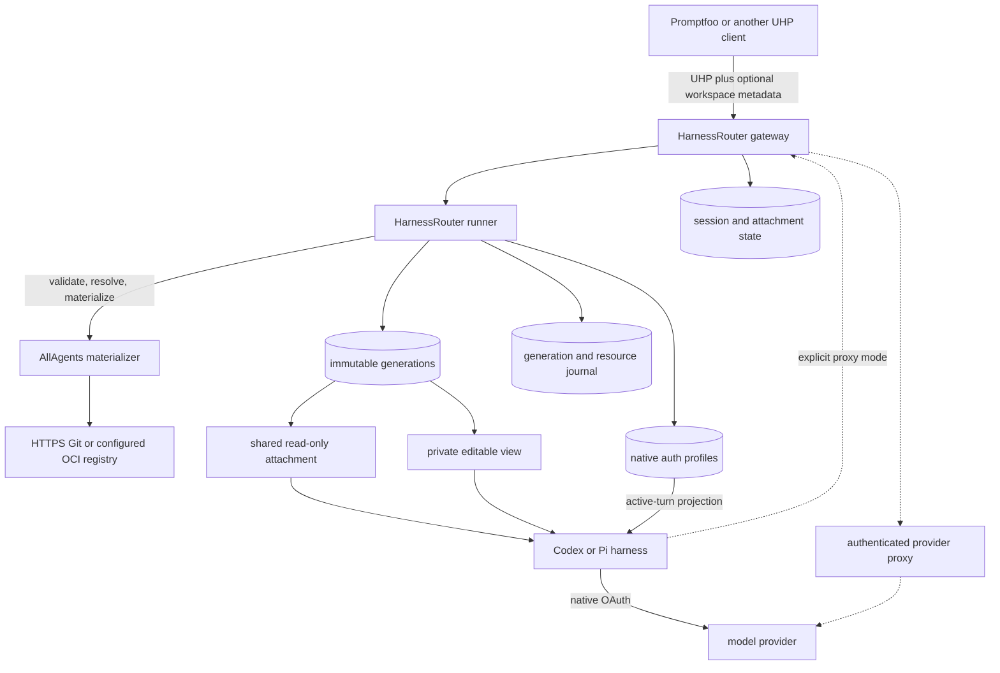

# ADR 0002: Adopt UHP through HarnessRouter with an AllAgents workspace materializer

- Status: Accepted; implementation gated on native-auth feasibility
- Date: 2026-09-21
- Updated: 2026-09-24

## Decision

AllAgents will use the Unified Harness Protocol (UHP) `2026-09-12` through a pinned HarnessRouter Community Edition deployment for remote Codex and Pi execution. UHP remains the only execution protocol.

HarnessRouter will keep responsibility for caller authentication, UHP behavior, sessions, streaming, cancellation, idempotency, harness execution, usage, artifacts, and lifecycle state.

A narrow AllAgents-maintained fork will add a generic pre-turn workspace hook. The hook will validate and resolve the caller's source, build a verified immutable workspace when needed, and attach it before the coding harness starts.

Codex and Pi will use their native login and refresh behavior by default. An
authenticated provider proxy remains an explicitly configured last resort.
Native-auth failure must never activate the proxy automatically. Version one
still implements and verifies proxy mode even when a deployment does not use it.

Project `workspace.yaml` will remain ordinary local AllAgents configuration plus an optional operator-owned OCI snapshot catalog. Its local repository entries use `path` for the checkout location and one canonical `url` for remote identity; the provider-specific `source` plus `repo` pair is removed as a clean schema cutover. It will not control which Git repositories a UHP caller may request.

The fork is delivery machinery, not a second protocol. We will keep the changes narrow and suitable for upstreaming, but delivery will not depend on upstream acceptance.

## Main flow

HarnessRouter has two relevant components. The gateway owns public response and
session transitions. The runner owns processes, filesystems, and resource state.
The external AllAgents materializer validates and builds source.

An initial workspace-backed turn follows this order:

1. The gateway authenticates the caller and claims the idempotency key. The
   runner selects the harness and authentication binding, admits the native
   profile when applicable, and reserves session and tombstone capacity.
2. The gateway allocates the response and session, stores the opaque workspace
   descriptor, and asks the materializer to validate it without accessing source.
3. The runner authorizes persistent retention when requested and reserves the
   editable workspace allowance when needed.
4. The materializer resolves every Git ref or OCI digest to immutable source
   identity and returns provenance. It does not write source bytes during this
   step.
5. The runner reuses a valid ready generation, joins an existing build for the
   same generation key, or claims a new build and reserves staging and generation
   capacity.
6. On a cache miss, the materializer builds private staging. The runner
   independently verifies the source tree, Git or OCI state, manifest, limits,
   and generation key before publishing it atomically.
7. The runner pins the generation, then mounts it read-only or creates a private
   writable view with no mutable state shared with another session.
8. The gateway commits the attachment as `ready`. The runner acknowledges that
   commit, transfers or releases reservations, and releases the provisional pin
   exactly once.
9. The runner projects the selected native OAuth profile or issues the configured
   scoped proxy credential. HarnessRouter starts the coding harness in the
   requested working directory.
10. After the harness and descendants stop, the runner finalizes authentication
    state and removes the credential projection. The gateway stores the terminal
    response and starts the idle deadline for `session` retention.

After the first turn:

1. A continuation reuses only the exact bound attachment.
2. Expiry or deletion tombstones the session before cleanup, waits for active
   resources to quiesce, and releases references and reservations exactly once.

Source resolution, workspace attachment, and authentication selection happen before provider execution. Provider retry or fallback cannot repeat or change them.

## Phase-zero feasibility gate

Production workspace implementation must not begin until a minimal pinned image proves native authentication against real provider traffic for both Codex and Pi. The spike excludes the workspace materializer and Git or OCI acquisition.

Freeze this evidence set:

| Input | Required identity |
|---|---|
| HarnessRouter | Exact upstream commit |
| Base image | Manifest digest |
| Codex | Exact version |
| Pi | Exact version |
| Auth adapter | Patch digest |

Changing any input invalidates the evidence. Dependent work remains blocked until both native targets pass again.

Each target must prove all eight behaviors:

1. The operator can complete native login in a controlled environment.
2. A real first turn and continuation succeed without a provider-route API key.
3. The selected authentication binding survives restart and fails closed when unavailable.
4. Session conversation state remains separate while only the selected profile is visible.
5. Overlapping refresh-capable turns for one profile are serialized.
6. Credential files remain complete before, during, and after refresh; invalid post-rotation state becomes `repair-required`.
7. Success, failure, cancellation, and crash recovery remove the active projection. Credentials remain absent from retained homes, checkpoints, produced-file records, backups, passive logs, and response metadata.
8. The evidence explicitly records that the selected harness and same-identity tools can read or emit the credential during an active turn.

The proxy route cannot satisfy this gate. Failure of either native target stops dependent implementation. A proxy-only release or narrower harness scope requires a new decision.

## System map and ownership



| Actor | Owns |
|---|---|
| UHP client | Prompt, model, harness ID, workspace descriptor, continuation ID |
| HarnessRouter gateway | Caller authentication, UHP validation, public response and session state, attachment `ready`, expiry, tombstones |
| HarnessRouter runner | Generation claims and publication, source child processes, mounts, private writable views, quotas, references, pins, profile admission |
| AllAgents materializer | Descriptor defaults, URL and source validation, Git or OCI resolution, staging construction, canonical manifest, provenance |
| Coding harness | Provider login, native token refresh, conversation execution |
| Operator | Deployment policy, egress, credential scopes, authentication profiles, persistence authorization, quotas, deletion, garbage collection |

The gateway is the only writer of public session attachment, expiry, and tombstone state. The runner is the only writer of generation and resource state. The materializer cannot authorize persistence or publish live state.

## Protocol and workspace descriptor

UHP is the sole wire contract and its conformance suite is the protocol oracle. The fork must preserve its Responses-shaped requests, ordered streaming events, `previous_response_id`, cancellation, files, artifacts, usage, lifecycle, and error behavior.

Version one adds one namespaced first-turn extension: `metadata["allagents.workspace"]`.

Before response allocation, the gateway requires this extension to be a JSON
object no larger than 64 KiB and no deeper than 32 levels. A non-object receives
HTTP 400 `invalid_input`; a byte or depth overflow receives HTTP 413
`allagents_workspace_too_large`.

### Request fields

| Field | Required | Contract |
|---|---:|---|
| `version` | yes | Exactly `"1"` |
| `access` | yes | `readOnly` or `editable` |
| `retention` | no | `session` by default, or authorized `persistent` |
| `source` | yes | Repository list or configured workspace snapshot |
| `workingDirectory` | no | `{ "kind": "workspaceRoot" }` by default, or `{ "kind": "workspacePath", "path": "…" }` |

Repository mode accepts one through 128 entries.

Each repository entry has this shape:

| Field | Required | Contract |
|---|---:|---|
| `url` | yes | Canonical public HTTPS Git URL; the same URL may appear more than once |
| `ref` | no | Full ref name, unambiguous branch or tag shorthand, or full 40-hex commit ID; omission means remote symbolic HEAD |
| `destination` | yes | Unique, non-root relative directory; destinations must not overlap or collide with a runner-owned control namespace |

A workspace snapshot source instead has the exact shape `{ "kind": "workspaceSnapshot", "snapshotName": ConfigName, "imageManifestDigest": Digest, "workspaceManifestDigest": Digest }`. `snapshotName` selects an operator-owned catalog entry; `imageManifestDigest` identifies the accepted direct OCI image manifest; `workspaceManifestDigest` identifies the canonical source-visible manifest.

Reserved control namespaces include HarnessRouter's root checkpoint repository.
Source-free validation rejects a destination that equals, contains, or is
contained by a reserved namespace.

`workspacePath` is relative to the mounted workspace and must name a directory in the resolved source manifest. The same working-directory contract applies to repository and snapshot sources.

Example:

```json
{
  "version": "1",
  "access": "readOnly",
  "retention": "session",
  "source": {
    "kind": "repositories",
    "repositories": [
      {
        "url": "https://github.com/acme/api.git",
        "ref": "refs/pull/123/head",
        "destination": "api"
      }
    ]
  },
  "workingDirectory": {
    "kind": "workspacePath",
    "path": "api/packages/service"
  }
}
```

The descriptor is session input, not project configuration. Promptfoo supplies the repositories to load. The materializer loads them before the harness starts; the model never performs the initial clone.

The descriptor cannot supply credentials, host paths, commands, environment variables, materializer executables, or Docker options.

A continuation supplies `previous_response_id` and must omit the extension. It reuses the original descriptor, attachment, access, retention, working directory, harness, and authentication binding.

### Contract vocabulary and benchmark compatibility

The JSON descriptor uses one canonical vocabulary rather than aliases for benchmark-specific names. `url`, optional `ref`, and `destination` describe requested Git materialization; `workingDirectory` describes the logical workspace-relative command directory. Public provenance preserves `requestedRef` separately from `resolvedCommit`. The contract does not also accept Harbor `git_url` or `workdir`, SWE-bench `repo` or `base_commit`, or Devfile `revision` or `clonePath`.

The local `workspace.yaml` contract represents a different boundary:

```yaml
repositories:
  - path: ../api
    url: https://github.com/acme/api.git
    managed: sync
    branch: main
```

`path` remains the existing or managed local checkout location. `url` replaces the lossy `source` plus `repo` pair. `branch` remains branch-specific because managed synchronization performs branch checkout and pull; it does not claim arbitrary detached-ref semantics. Path-only unmanaged entries may omit `url`; a managed entry requires it. The schema, CLI, generated schemas, examples, and tests cut over together without accepting both shapes indefinitely.

Harbor sits beside the AllAgents gateway at Promptfoo's provider boundary.
Promptfoo calls the gateway over UHP for AllAgents-backed rows; a Harbor provider
calls Harbor for container-native rows, where Harbor owns task setup, execution,
verification, artifacts, and teardown. Harbor is not an
`allagents.workspace` backend, and its task schema is not compiled into the
workspace descriptor.

Harbor and SWE-bench/Hugging Face remain useful precedents for source and
benchmark packaging. Their runnable images may combine source, tools, services,
verifier assumptions, and runtime configuration, so they are not AllAgents
`workspaceSnapshot` artifacts. An AllAgents snapshot contains source and may
carry normalized offline Git history; it does not select a runtime or verifier.

### Access and retention

Access and retention are independent:

| | `readOnly` | `editable` |
|---|---|---|
| Workspace | Shared immutable generation | Private writable view; no mutable state shared across sessions |
| Initial UHP files | Rejected before source acquisition | Applied after attachment |
| Writes | Filesystem rejects them; no copy-up | Allowed within the private quota |
| Checkpoints | No source mutation checkpoint | Root and nested repositories use private checkpoints |
| Cross-session mutation | Impossible | Impossible |

| Retention | Behavior |
|---|---|
| `session` | Default. Idle expiry starts only after durable terminal acknowledgement. |
| `persistent` | No idle expiry. Requires deployment authorization and reserved capacity before source resolution. |

Neither retries nor continuations can change access or retention.

### Editable change collection

The verified generation is the first-turn baseline. The runner does not copy or
inventory the complete private workspace again before the harness starts.

1. For a history-bearing root, the protected baseline is its recorded commit and
   generation-owned object store. For a tree-only root, it is the canonical
   workspace manifest. The runner keeps this baseline outside the editable
   workspace.
2. For each turn, the runner prepares and verifies the private view, then arms
   candidate tracking before it applies UHP input overlays or gives any
   non-runner process writable access. It durably binds that coverage marker to
   the generation and previous turn state and keeps tracking active through
   descendant quiescence.
3. After the harness and its descendants stop, the runner obtains changed-path
   candidates from the runner-owned tracker or storage state. It compares their
   final type, mode, and content with the protected baseline through
   root-confined, no-follow reads.
4. If uninterrupted coverage cannot be proven, or candidate state is missing,
   incomplete, overflowed, or uncertain after recovery, the runner walks the
   complete private view without following links and performs the same bounded
   comparison.

The produced-file domain is every source-visible path under the declared
workspace roots. The only exclusions are the original administrative `.git`
subtrees identified by the protected generation record. Their mutations persist
for continuation but are not produced files. An agent-created `.git` elsewhere
is ordinary source-visible content. Candidate and full-scan paths use this same
protected classification; final Git discovery or ignore rules cannot change it.

For a continuation, the runner starts from the previous protected cumulative
path state and applies verified candidates, or rebuilds that state with the
fallback scan. It stores entries only for content that differs from the
generation; unchanged paths inherit their generation state. Comparing the new
state with the previous checkpoint yields the turn's produced-file delta without
retaining or comparing a second full workspace.

Editable `.git` state remains session-private and survives continuation for
coding tools. After the harness starts, it is not authoritative for provenance
or change collection. The runner never trusts its refs, configuration, index,
hooks, alternates, or ignore rules, and an agent-edited ignore file cannot hide
a produced path. Candidate tracking is an optimization; the bounded full-tree
comparison remains the correctness fallback.

### Public workspace metadata

Once attachment reaches `ready`, terminal events, retrieval, background completion, replay, and later terminal failures return the same verified workspace object.

| Public field | Meaning |
|---|---|
| `effectiveDescriptorDigest` | Digest of the normalized descriptor and defaults |
| `generationId` | Public content identifier |
| `sourceIdentity` | Normalized URL, destination, `requestedRef` when supplied, and `resolvedCommit`; or verified `snapshotName` and `imageManifestDigest` plus each root's destination and optional `resolvedCommit` and `objectSetDigest`, never a Git remote URL |
| `workingDirectory` | Effective `workspaceRoot` or `workspacePath` |
| `workspaceManifestDigest` | Verified source-visible manifest digest |
| `access`, `retention`, `expiresAt` | Effective workspace policy and expiry |

`generationId` is the SHA-256 digest of versioned RFC 8785 bytes containing only returned source provenance, normalized destinations, and the workspace-manifest digest. It is metadata only. It is never a cache, authorization, attachment, or lookup key.

Active turns and persistent sessions report `expiresAt: null`. For `session` retention, durable terminal acknowledgement sets the timestamp returned by terminal, retrieval, and replay paths. Polling and replay do not renew it.

Failures before attachment reaches `ready` omit workspace metadata. Failures after `ready` include the complete committed object.

Public metadata never exposes the private generation key, raw request digest, URL credentials, credential-scope mappings, selected credential references or values, redirect-chain URLs, resolved network addresses, physical paths, internal epoch, lease, reservation, claim, pin, or attachment identifiers, or other sessions' quota state.

## Source authority and acquisition

### Configuration boundary

| Source | Authority |
|---|---|
| Caller-requested Git | The UHP JSON descriptor supplies `url`, optional `ref`, and `destination` |
| OCI snapshot | Operator-owned `workspace.yaml` snapshot catalog plus caller-supplied `snapshotName`, `imageManifestDigest`, and `workspaceManifestDigest` |
| Harness, model, persistence, quota, and egress policy | HarnessRouter deployment configuration |
| Source credentials | Operator-owned secret store and credential-scope mappings |

`workspace.yaml` is not a Git-origin allowlist. The service may accept any repository reachable through its safe public HTTPS egress boundary.

### URL and network rules

Before parsing a Git URL, validation rejects ASCII controls, whitespace, and backslashes. It then parses the URL once with the WHATWG URL Standard and requires the input bytes to equal the serialized URL exactly.

The serialized URL must meet all of these rules:

- scheme is `https`;
- hostname is an ASCII lowercase IDNA A-label DNS name without a trailing dot;
- no userinfo, query, fragment, IP literal, or explicit default port;
- path is non-empty; and
- no percent-encoded control, slash, backslash, or dot segment.

The same serialization and structured `(scheme, host, effectivePort)` origin drive policy, credentials, redirects, DNS, provenance, generation identity, and the URL passed to Git and libcurl. Local paths and `file`, `ssh`, `git`, and extension transports are rejected.

Every connection follows this sequence:

1. Route the acquisition child through the deployment connector. The child has no direct network path and no inherited proxy configuration.
2. Resolve the canonical hostname. Reject the whole answer set if any address is loopback, link-local, private, reserved, metadata, or otherwise non-public.
3. Pin one approved address for that connection so DNS rebinding cannot change the destination.
4. Accept at most five HTTPS redirects. Parse, serialize, resolve, and validate every hop again.

Deployment policy may further restrict public egress, but it does not need to list every allowed repository.

### Source credentials

Callers cannot provide credentials or credential-reference names.

A credential scope is either an exact structured origin or that origin plus a canonical repository-path segment prefix. Prefixes match complete path segments, never raw strings. The matching rule with the most path segments selects one server-owned secret reference. No match means anonymous acquisition.

Preflight receives no request URL or secret value. It validates policy and configured reference syntax, then returns bounded reference names or opaque IDs. The runner verifies the selected handles before source access.

A source-access child receives only the selected value. It has an isolated home,
`GIT_CONFIG_NOSYSTEM=1`, no global Git configuration, no inherited proxy
variables, no Git or remote proxy configuration, and no direct network path. Its
ephemeral credential helper uses `credential.useHttpPath=true` and independently
enforces the selected protocol, host, port, and path scope.

Every redirect is checked against the original scope. The connector strips the credential when a redirect leaves that scope, including a same-origin path escape. A redirect never selects a new credential.

Credentials are never encoded in URLs, persisted in Git configuration or remote
URLs, or returned in hook output. Temporary credential state is removed before
return. The gateway, runner base environment, published generation, editable
view, and every agent child remain credential-free. If a configured source secret
appears in the service or agent environment, the runner refuses to launch the
agent.

### Git resolution and verification

`ref` is at most 255 ASCII bytes. It may be a full 40-hex object ID or a ref name accepted by rules equivalent to `git check-ref-format`.

Validation rejects leading dashes, whitespace, controls, refspec colons, glob metacharacters, traversal-like components, `@{`, and `.lock` components. It resolves a full ref or unambiguous branch or tag shorthand with `ls-remote`. A full object ID is accepted only when advertised.

The materializer records the normalized URL, requested ref when present, and resolved commit in provenance. Fetch and checkout commands receive only the verified object ID, never caller ref text.

Every Git and libcurl operation uses an argument vector without a shell and
explicit end-of-options handling. Hooks, `file` and `ext` protocols, submodule
recursion, Git LFS hydration, and configured clean and smudge filters are disabled
before the materializer touches caller-selected source.

The published repository keeps `.git` for coding tools, but the materializer normalizes it to a closed detached-HEAD state. It removes reflogs, `FETCH_HEAD`, locks, hooks, worktree links, alternates, shallow, replace, and graft state, extra refs and objects, and credential-bearing configuration.

The runner independently verifies:

- `HEAD` resolves to the recorded commit;
- the index exactly matches that commit tree;
- the object database contains the complete required transitive closure, with no missing, corrupt, or extra objects;
- the canonical object-ID, type, and size set matches its recorded digest; and
- source-visible content equals the union of the resolved commit trees at their declared destinations, plus only the ancestor directories needed to connect them.

Any undeclared path fails integrity validation.

### OCI snapshots

Snapshot mode accepts only the direct OCI image manifest selected by
`imageManifestDigest` from the repository owned by the `snapshotName` catalog
entry. Redirects may not change registry authority. The config descriptor must
use that entry's configured workspace-manifest media type and address the
canonical bytes selected by `workspaceManifestDigest`.

| Limit | Maximum |
|---|---:|
| Distributable tar, gzip, or zstd layers | 64 |
| Image manifest | 4 MiB |
| Workspace-manifest blob | 128 MiB |
| Repository roots | 128 |
| Compressed layers | 8 GiB |
| Expanded tree | 32 GiB |
| Filesystem entries | 500,000 |
| One regular file | 4 GiB |
| One UTF-8 path | 4096 bytes and 128 components |
| One PAX or extended header | 1 MiB |

Workspace-manifest version 2 lets each repository item describe either a
tree-only root or a history-bearing root. A history-bearing item adds `git` with
`resolvedCommit` and `objectSetDigest`. Its destination must contain exactly one
`.git` directory; a tree-only root must contain none. The snapshot's immutable
digests bind the commit and object-set identity. The artifact contains no
configured Git remote, and no Git remote URL is required or returned. Private
evaluations can still use `git log`, `git blame`, and historical diffs offline.

Before writing an entry, the materializer checks its type, path, link target, and
declared size. It rejects devices, sockets, traversal, escaping links, sparse
files, unknown or foreign layers, mutable tags, and undeclared output. The runner
independently rejects a 129th repository root.

After applying OCI whiteouts, the materializer verifies
`imageManifestDigest`, `workspaceManifestDigest`, every layer size and digest,
and the recomputed source-visible manifest. For every history-bearing root it
then applies semantic Git verification: detached `HEAD` at `resolvedCommit`, an
index equal to that commit tree, an object database equal to the complete
transitive closure whose canonical digest is `objectSetDigest`, and
source-visible descendants equal to the same commit tree. Dirty, staged,
untracked, missing, or modified source fails validation.

Snapshot Git state is offline. It must contain no remotes, branch-upstream
configuration, credential helpers, config includes, hooks, worktree links,
alternates, shallow, replace, or graft state, reflogs, `FETCH_HEAD`, extra refs,
unreachable objects, or credential-bearing configuration. Physical `.git`
entries and bytes count toward acquisition and retained-generation limits even
though their volatile representation is excluded from the source-visible
manifest.

### Canonical workspace manifest

Both source modes produce the same versioned canonical manifest. Its RFC 8785 bytes enumerate every source-visible directory, regular file, and symbolic link in logical path order, including normalized mode, size, content digest, or link target.

Repository roots are identified by unique, pairwise non-overlapping
destinations. A declared, separately verified `.git` subtree is omitted from
source-visible entries in either source mode; any undeclared `.git` path is
invalid. The runner verifies the manifest digest, walks staging without following
links, reconstructs the same source-visible entries, and requires byte-for-byte
canonical equality. It separately verifies every omitted Git root against its
declared commit and object-set digest. The manifest never appears inside the
published source tree.

### Generation identity

The private generation key is computed before materialization. It includes every input that can change source-visible bytes, filesystem semantics, or sharing authorization.

| Included | Excluded |
|---|---|
| Descriptor and hook contract versions | Access and retention |
| Deployment authorization scope | Working directory |
| Normalized caller Git URLs | Harness, profile, and session identity |
| Resolved commits or exact OCI image and workspace-manifest digests | Physical paths |
| Normalized destinations | Credential values |
| Selected credential-reference identities | Caller ref spelling after it resolves to the same commit |
| Snapshot identity when applicable | Repository-mode volatile Git pack, index, and stat representation |
| Acquisition and egress policy version | |

OCI generation reuse is artifact-exact. Repacking snapshot `.git` data changes
the image digest, generation key, and public OCI identity even when the semantic
Git state is unchanged. Semantic Git verification proves what one artifact
contains; it does not deduplicate distinct OCI artifacts.

Publication binds one private key and one internal epoch to one verified workspace-manifest digest and every declared semantic Git-state record, whether Git was acquired from a remote or carried offline in an OCI snapshot. Materialization receives the exact private resolved plan and never resolves source again.

## Generation publication and attachments

A generation is immutable source content identified by its private generation key, manifest digest, and unique internal epoch. At most one live epoch may exist for a key. A replacement epoch cannot begin until durable logical and physical eviction of the prior epoch completes.

Concurrent cache misses for the same key join one runner-owned build claim. Each
waiter keeps its own deadline and cancellation. Cancelling one waiter does not
cancel the build while another waiter remains; the runner cancels it when no
waiter remains. Failed or partial staging is never attachable, and a failed
competing build does not poison an existing verified generation.

Before attaching a view, the runner acquires a provisional pin under the generation lock. Garbage collection cannot race that pin.

The generation backing store remains owner-writable and is never exposed writable to a session. Publication is a recoverable same-filesystem atomic transition. Editable views may not share mutable state with the generation or another session.

Read-only sessions share source bytes but keep their operating-system identity,
conversation, home, temporary files, logs, outputs, and response state separate.


The gateway and runner commit an attachment in three steps:

1. The runner prepares the read-only mount or private writable view and returns opaque evidence.
2. The gateway commits attachment state as `ready`.
3. The runner acknowledges that commit, creates the durable reference or transfers the private reservation, and releases the provisional pin exactly once.

Restart preserves a gateway-committed attachment. It rolls back an uncommitted prepare.

`lastUsedAt` changes only when the gateway commits `ready`. Its initial value is null. A ready commit sets it to the later of the existing value and commit timestamp under the generation lock. Replay is idempotent. Publication and failed prepare do not count as use.

Garbage collection orders candidates as follows:

1. Generations with null `lastUsedAt`, ordered by `publishedAt`.
2. Other generations, ordered by `lastUsedAt`, then `publishedAt`.
3. Ties use ascending generation-key bytes, then epoch-ID bytes.

Only ready generations with zero references and zero provisional pins are candidates.

## Session lifecycle, retention, and recovery

### Session binding and continuation

Deployment configuration gives each harness exactly one authentication binding.
A proxy binding is a closed server-side record containing its private HTTPS base
URL, expected TLS identity or CA, supported API format and endpoint set,
gateway-only client-key handle, broker audience, and requested-to-proxy model
map. Callers cannot override these fields.

A target is advertised only after its binding passes readiness checks. Native
OAuth checks login, refresh, and a live turn. Proxy mode checks schema, TLS,
broker, model mapping, endpoints, and live compatibility.

The first response binds one normalized descriptor, generation key and epoch,
access mode, retention class, working directory, harness target, authentication
mode, binding identity, and canonical binding-configuration digest.

A continuation uses `previous_response_id`, omits workspace metadata input,
requires the exact bound attachment and binding-configuration digest, and
succeeds only when retention is persistent or the session idle deadline is still
in the future.

A changed ref, resolved source, working directory, access, retention, harness,
authentication mode, binding identity, or binding-configuration digest requires
a new session. A continuation never re-resolves source, follows a changed
same-named connection, or substitutes a later generation epoch.

Missing or corrupt generation, reference, publication, private workspace, or checkpoint evidence returns `allagents_workspace_non_resumable`. The system does not rebuild the missing state for that session.

### Turn admission and idle expiry

Every active operation holds a durable lease and has no idle expiry.

One gateway compare-and-swap checks `session_busy`, exact binding, and expiry or deletion together. A busy or invalid turn changes no deadline.

For an eligible continuation, the gateway saves and clears the current idle deadline in a provisional admission fence before the runner attempts to acquire the selected native profile. Profile success commits the session as active. A pre-allocation profile failure restores the exact saved deadline when it is still future, or tombstones the session if that deadline elapsed.

After terminal acknowledgement, a `session` workspace receives one idle deadline. GET, polling, background completion, and replay never extend it. Persistent sessions keep `expiresAt: null`.

### Capacity

Every deployment limit must be finite and nonzero:

| Capacity | Required limit |
|---|---|
| Sessions | Total active and retained sessions |
| Failed identity | Tombstone count, bytes, and TTL |
| Builds | Concurrent builds and staging bytes |
| Generations | Published count and bytes |
| Editable workspaces | Per-session hard bytes and inodes |
| Private storage | Total reserved bytes and inodes |
| Persistence | Persistent session count |
| Idle retention | Session idle TTL |

Before a response is visible, one idempotent admission token reserves a generic session slot and a fixed-size tombstone slot. Invalid descriptors remain charged through failed-response retention, tombstoning, and purge.

After validation and before source resolution, the runner authorizes persistence
and reserves its slot. Editable access also receives one stable private-view
reservation ID. Its hard byte and inode allowance covers the writable view, UHP
overlays, root and nested-repository checkpoints, and produced-file state across
every turn and continuation.

A cache miss reserves staging and prospective generation capacity before byte acquisition. Independent full-tree accounting converts that reservation to actual retained usage before publication.

A waiter receives an editable view only when the complete generation fits its private allowance. A non-fitting waiter fails alone and does not invalidate the shared generation or another waiter.

Protected state is never evicted. If leases, references, pins, or other protected resources consume capacity, admission fails instead.

### Expiry and deletion

Expiry and authenticated deletion follow this order:

1. Atomically tombstone the session and reject new continuations.
2. Wait for active work, credential projections, and mounts to quiesce.
3. Remove private state.
4. Release every generation reference and reservation exactly once.
5. Record successful deletion, or keep failed physical deletion quarantined and counted for retry.

A retained tombstone lives at least as long as matching response and idempotency records and returns `allagents_workspace_expired`. Bounded compaction removes the identity and reserved tombstone slot only after those records expire. Later requests receive the stock non-disclosing unknown-predecessor error.

Neither path rematerializes source.

### Restart recovery

Completed unexpired or persistent sessions and ready generations survive restart.

Before readiness or garbage collection, the gateway and runner reconcile generic
admission tokens and reservations, active leases, turn-admission fences, build
claims and waiters, staging and generation reservations, publications, pins,
references, mounts, editable usage, attachment prepare and acknowledgement,
credential projections, tombstones, compaction, quarantine, and interrupted
deletion.

An internal `containment_pending` session remains non-terminal until its recorded cgroup is empty. Whole-container termination does not preserve agent processes; interrupted turns fail and are not replayed.

## Provider authentication

| | Native OAuth | Authenticated proxy |
|---|---|---|
| Default | Yes | No; explicit configuration only |
| Provider credential owner | Codex or Pi harness profile | Proxy service |
| Harness receives | Selected turn-scoped profile projection | Non-refreshable scoped turn credential |
| Refresh | Harness-native | Not allowed for the turn credential |
| Automatic fallback | Never | Never |

Promptfoo's HarnessRouter API key authenticates the UHP caller only. HarnessRouter never translates it into provider credentials.

Each native harness target has one dedicated durable authentication root outside generations, editable workspaces, session checkpoints, and conversation state. Codex uses file credential storage under `CODEX_HOME`. Pi uses `~/.pi/agent/auth.json` after controlled `/login`.

Missing, expired, revoked, or unrefreshable native OAuth disables that harness
target. HarnessRouter does not switch to another profile or provider route.


Native OAuth uses an owner-trust boundary. During an active turn, the selected harness and same-operating-system-identity tools may read or emit that profile's credential. Operators that require stronger isolation must use the explicit proxy route or isolate the whole deployment more strongly.

Login, logout, and repair acquire the same runner-owned zero-waiter profile lock
as an active turn. They use the same durable fence and `finally` release and
acknowledgement protocol.

A native turn follows this order:

1. Acquire the runner-owned profile lock. Version one allows exactly one active refresh-capable turn per profile and no waiters.
2. Project only the selected profile through a turn-scoped mount namespace or equivalent same-filesystem view that preserves native atomic file replacement.
3. Run the harness and descendants.
4. Commit or reject refresh state after descendants stop.
5. Remove the projection and verify the retained session home is clean.
6. Persist terminal acknowledgement, then release the profile lock.

A local refresh commit uses a same-filesystem temporary file, file `fsync`, atomic rename, parent-directory `fsync`, and validation. If a crash after provider rotation leaves invalid local state, restart marks the profile `repair-required` and requires native login again. It never switches profiles or activates the proxy.

HarnessRouter claims each `Idempotency-Key` atomically. Requests with the same
key share one result.

Different profiles may run concurrently on one generation. A new cross-session turn that collides on a busy profile fails immediately before response allocation with HTTP 503 `harness_unavailable` and reason `allagents_auth_profile_busy`. Stock idempotent replay and same-session `session_busy` take precedence.

The runner supervisor holds turn admission and the profile lock through
descendant termination, refresh disposition, projection teardown, and terminal
acknowledgement. Gateway failure cannot release them. Runner failure leaves a
durable fence. Startup blocks readiness and profile admission until it reconciles
that fence and every stale projection.

In proxy mode, the gateway issues a non-refreshable credential bound to one proxy
audience, harness target, model allowlist, response and turn ID, and the UHP
deadline plus minimal clock skew. It may authorize only the bounded provider
calls, compaction, and retries needed by that turn. Cancellation or terminal
completion revokes it. The broker rejects wrong audience, model, turn, expiry, or
revocation. Checkpoints, logs, artifacts, stored responses, and retained session
state never persist the proxy turn credential.

## Fork boundary

The HarnessRouter fork is limited to two generic seams:

1. A pre-turn workspace hook with typed `preflight`, `validate`, `resolve`, and `materialize` operations.
2. A harness-authentication-state seam that keeps provider profiles separate from conversation and workspace state.

| Hook operation | Responsibility |
|---|---|
| `preflight` | Validate contract and policy versions, configured credential references, and required tools without request URLs, network access, or secret values |
| `validate` | Apply descriptor defaults, validate URL, ref, destination, access, retention, and working-directory syntax, and select bounded credential references without source access |
| `resolve` | Resolve immutable Git commits or OCI identity and return the private resolved plan, generation key, effective working directory, and public provenance without writing source bytes |
| `materialize` | Consume the exact resolved plan on a cache miss, write only private staging and result roots, and return the manifest without publishing or re-resolving source |

The generic fork understands only the configured metadata key, generic JSON and byte limits, immutable first-turn binding, the typed hook envelope, runner resource ownership, lifecycle state, and the response namespace. It does not understand the AllAgents schema, Git, OCI, or credential-selection policy.

Requests without the extension keep stock behavior. Upstream UHP conformance must stay green. Production pins an upstream commit and carries a focused patch series with no unrelated changes.

The upstream proposal should contain only the generic workspace and authentication-state seams. If upstream accepts an equivalent interface, remove the corresponding fork patch rather than keeping a compatibility layer.

### Materializer containment

Each hook invocation receives one runner-owned cgroup-v2 leaf under the delegated
subtree.

| Property | Requirement |
|---|---|
| Placement | Put the child in the leaf atomically with `clone3(CLONE_INTO_CGROUP)`, or use a stopped, secret-free pre-exec move-and-verify handshake |
| Authority | The child and its descendants cannot administer or escape the leaf |
| Termination | Cancellation, deadline, or parent exit with live descendants fails the invocation; use `cgroup.kill` when descendants remain |
| Proof | Require `cgroup.events` to report `populated 0` before reading a result, publishing, releasing a secret, cleaning roots, or exposing terminal state |

If the leaf cannot be emptied, internal state becomes `containment_pending`.
Readiness and terminal visibility remain blocked until restart reconciliation
proves it empty and records the preserved outcome once.

## Trust, deployment, and release

HarnessRouter API authentication is mandatory on every externally reachable
create, continuation, retrieval, stream, cancellation, file, artifact,
persistence, deletion, and lifecycle-administration endpoint. This remains true
on a private network. Authentication fails before resource lookup, disclosure, or
mutation, so an unauthenticated request reveals neither session existence nor
retention state.

The gateway-to-runner channel is mutually authenticated and not externally routable. The service binds to loopback or a private network with equivalent ACL or firewall controls. Version one is not a public multi-tenant service.

HarnessRouter supplies per-session operating-system identities. It is not a hostile-code sandbox. No session identity may write the generation backing store. Editable workspaces, homes, temporary files, output, and checkpoints remain session-private.

The pinned production image contains:

- an OCI base image pinned by digest;
- the pinned HarnessRouter CE commit and reviewed patch series;
- the AllAgents materializer and locked runtime dependencies;
- version-locked OS packages and Git or OCI tools; and
- pinned HarnessRouter-supported Codex and Pi versions.

Only the runner receives the delegated cgroup v2 subtree. The container uses `on-failure` restart policy.

Startup begins in non-serving mode. Readiness requires all of the following:

- verified image attestations and mounted inputs;
- usable cgroup delegation and cleanup of orphaned materializer cgroups;
- removal or quarantine of stale credential projections;
- finite lifecycle and capacity limits;
- writable staging and editable volumes;
- a protected generation store;
- verified mount, same-filesystem, quota, and isolation relationships;
- successful materializer preflight and native or proxy authentication checks; and
- complete startup reconciliation before serving or garbage collection.

Operators must be able to observe aggregate generation, editable-workspace, persistent-session, tombstone, quarantine, and failed-deletion capacity without exposing source paths or credentials.

AllAgents publishes the public `linux/amd64` image as `ghcr.io/allagentsdev/harnessrouter`. Version and commit tags are discovery labels, not immutable deployment identities. Deployments pin the manifest digest.

The release workflow uses an approved ref, commit-pinned actions, an unprivileged build and test job, and a separate environment-approved publish job. GitHub package permission replaces third-party registry credentials.

The final digest receives GitHub/Sigstore build-provenance and SBOM attestations. Deployment verifies the expected repository, workflow, ref, subject digest, predicate, base-image digest, lockfiles, OS packages, source tools, and Codex and Pi versions.

## Failure behavior

The system fails closed. Source, access mode, retention, credentials, and provider route never change as a recovery shortcut.

| Failure | Public behavior | Required effect |
|---|---|---|
| Non-object workspace extension | HTTP 400 `invalid_input` before allocation | Reject before session lookup or durable admission |
| Extension exceeds 64 KiB or 32 levels | HTTP 413 `allagents_workspace_too_large` before allocation | Reject before canonicalization, session lookup, or durable admission |
| Invalid bounded descriptor shape, URL syntax, ref syntax, destination, or working-directory syntax | `allagents_workspace_invalid` after allocation | Reject without source access |
| Unknown or unadvertised ref | Failed response during resolution | Allow only bounded remote ref resolution; acquire no source bytes and create no attachment or agent |
| `workspacePath` is missing or not a directory | `allagents_workspace_invalid` after checking the verified manifest | Reject before attachment or agent launch |
| Unauthorized `persistent` retention | `allagents_workspace_persistence_forbidden` | No source resolution or byte acquisition; no downgrade |
| Initial files with `readOnly` | `allagents_workspace_read_only` | No source acquisition and no writable shadow layer |
| Workspace extension on a continuation | Invalid request | No session mutation, lease, or deadline change |
| Expired or deleted retained session | HTTP 410 `allagents_workspace_expired` | No runner or profile work; no rematerialization |
| Purged predecessor | Stock non-disclosing unknown-predecessor error | No rematerialization |
| Missing or corrupt bound attachment evidence | HTTP 409 `allagents_workspace_non_resumable` | No profile admission or epoch substitution; return committed workspace metadata |
| Busy native profile after replay and `session_busy` checks | HTTP 503 `harness_unavailable`, reason `allagents_auth_profile_busy` | Fail before allocation, runner work, or materialization |
| Generic capacity unavailable | HTTP 503 `allagents_workspace_capacity_exceeded` | Admit no response or source work |
| Editable view or later growth exceeds its allowance | `allagents_workspace_private_quota_exceeded` | Fail only that waiter or turn; preserve mode and retention |
| Source policy, authentication, or transport failure | Coded failed response | Remove unpublished staging; publish nothing; start no agent or provider fallback |
| Generation, attachment, or private-view failure | Coded failed response | Quarantine incomplete state and release reservations and pins exactly once |
| Materializer timeout, crash, malformed output, or live descendant | Coded materializer or containment failure | Wait for cgroup quiescence before result handling, secret release, or cleanup |
| Provider authentication failure | Normalized UHP failure | Do not switch profile or activate proxy; finish teardown before lock release |
| Provider execution failure | Normalized UHP failure | No source fallback and no credential material in output |

Capacity is reserved in order: generic session and tombstone before response visibility; persistence and editable allowance after validation and before source resolution; staging and prospective generation after resolution and before byte acquisition; actual retained usage before publication. Each reservation is released or transferred exactly once.

A failed physical deletion remains quarantined and counted. The system never advertises that capacity as free, resurrects the resource, or permits a same-key replacement before physical deletion completes.

New vendor codes use the `allagents_` prefix. Promptfoo maps every non-success to a coded error and never converts failure into empty success or automatic retry.

## Consequences

HarnessRouter remains the sole execution and session control plane. AllAgents adds workspace preparation and source policy without adding another streaming API, process supervisor, artifact service, provider adapter, or task engine.

Shared read-only generations avoid repeated acquisition and may serve different harnesses and profiles concurrently. Editable sessions trade that reuse for a reserved private byte and inode envelope.

Persistent sessions, active references, provisional pins, retained tombstones, and quarantined deletion failures consume finite capacity. Crash-consistent accounting and admission rejection are operational requirements, not optional optimizations.

Native OAuth deliberately trusts the selected harness and same-identity tools during an active turn. Source-acquisition credentials remain outside that boundary and never enter a generation or agent environment.

The maintained fork must be rebased and tested against selected upstream releases until equivalent supported seams exist.

## Alternatives rejected

| Alternative | Why rejected |
|---|---|
| Custom execution gateway | Duplicates mature UHP session, streaming, cancellation, authentication, artifact, and provider behavior |
| Proxy-first provider authentication | Adds a mandatory API key and network hop when native Codex or Pi authentication works |
| Thin adapter in front of stock HarnessRouter | Adds another network service and pushes source lifecycle outside the session control plane |
| Descriptor in the prompt | Lets the model control acquisition and is neither deterministic nor safe |
| Acquisition through an MCP tool | Runs only if the model chooses it and cannot define the initial working directory |
| Upload every source file as UHP input | Loses exact Git history, symlink, mode, and OCI layer semantics and moves acquisition to every caller |
| Rematerialize a private tree for every trial | Repeats network, CPU, and storage work and prevents safe immutable sharing |
| Wait for upstream | Makes delivery depend on a project we do not maintain |

## Deliberate limits

Version one does not add evaluation datasets, Harbor task ingestion, SWE-bench/Hugging Face ingestion, caller-selected runtime images or verifiers, scoring, assertions, automatic retries, session branching, concurrent turns within one session, simultaneous refresh-capable turns for one native profile, caller-supplied credentials, non-HTTPS or private-network Git origins, public multi-tenancy, arbitrary materializer commands, mutable OCI tags, transparent source-mode fallback, or guaranteed provider prompt-cache hits.

Read-only attachments never copy up or become editable. Editable sessions never share mutations. Callers cannot choose arbitrary TTLs, bypass persistence quotas, or change retention on continuation. Leased, referenced, or pinned state is never evicted. Default retention is always bounded.

## Reconsider when

Revisit this decision when:

- either required native harness fails the phase-zero gate;
- the host cannot enforce immutable read-only generation mounts across sessions;
- continuation, expiry, deletion, and lease acquisition cannot be linearized and recovered safely;
- generation churn or authorized persistent demand cannot fit practical finite quotas;
- editable derivation requires stronger filesystem semantics than a private writable view with no shared mutable state;
- upstream HarnessRouter accepts the generic workspace or authentication-state seam;
- UHP adopts a standard workspace attachment or retention contract that replaces this extension;
- the maintained patch grows beyond the narrow integration boundary;
- HarnessRouter removes required UHP, session, or provider behavior;
- exact per-turn workspace rollback becomes a requirement;
- the host cannot enforce public-address egress validation, address pinning, redirect revalidation, and out-of-scope credential stripping;
- source acquisition needs a stronger isolation boundary;
- callers require a public multi-tenant authorization model; or
- another UHP implementation offers a materially smaller and more stable integration surface.
