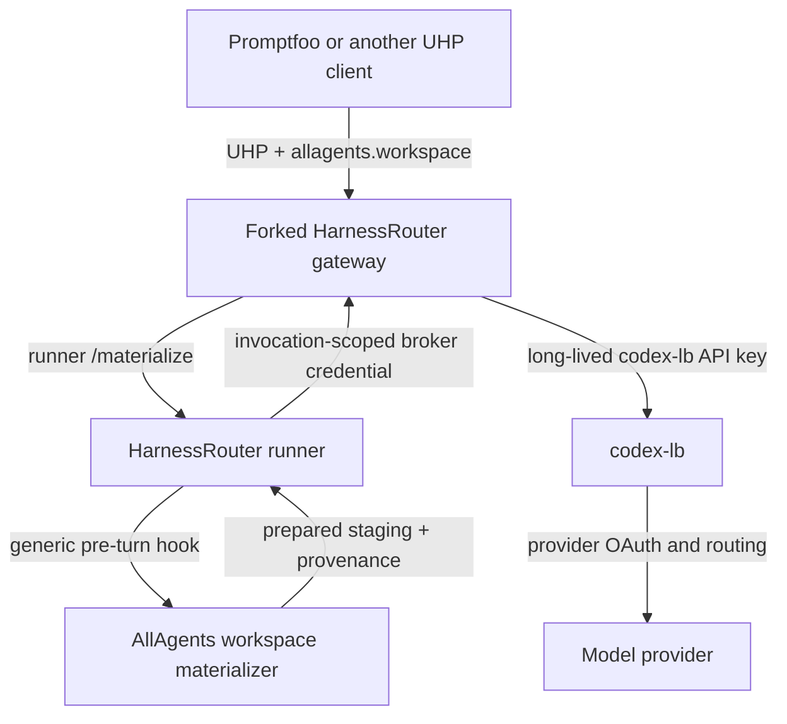

# ADR 0002: Adopt UHP through HarnessRouter with an AllAgents workspace materializer

- Status: Accepted; implementation pending
- Date: 2026-09-21

## Decision

AllAgents will use the Unified Harness Protocol (UHP) `2026-09-12` through a
pinned HarnessRouter Community Edition deployment for remote Codex execution.
Pi remains capability-gated until a real probe proves a HarnessRouter-supported
custom-provider format against `codex-lb`.

HarnessRouter owns authentication, UHP request and response semantics, streaming,
cancellation, idempotency, session continuity, per-session workspaces, agent
execution, usage, and artifacts. AllAgents owns the workspace descriptor,
deterministic source materialization, and provenance returned through the
HarnessRouter response.

The initial deployment will use a narrow AllAgents-maintained HarnessRouter fork.
The fork adds a generic pre-turn workspace-materializer hook. An AllAgents
materializer behind that hook interprets a namespaced workspace descriptor,
acquires the configured Git repository set or an immutable OCI workspace
snapshot, and returns normalized provenance before HarnessRouter launches the
agent.

The fork is a delivery mechanism, not a new protocol. All fork changes must be
structured for a later upstream contribution. Delivery does not depend on
upstream acceptance or timing.

Implementation details live in the
[coding-agent execution gateway plan](../plans/2026-09-18-0837-feat-coding-execution-gateway-plan.md).

## Topology



Promptfoo authenticates to HarnessRouter with a HarnessRouter API key.
HarnessRouter runs in brokered sandbox-auth mode: the gateway holds a separate
`codex-lb` API key and gives the agent only an invocation-scoped broker
credential. `codex-lb` owns provider OAuth, account selection, continuation
affinity, and provider routing. Neither the `codex-lb` key nor provider OAuth
credentials enter Promptfoo, request metadata, the materializer, or the agent
workspace.

## Protocol boundary

UHP is the sole execution wire contract. Version one uses its Responses-shaped
request, ordered streaming events, `previous_response_id` continuation,
cancellation, files, artifacts, usage, lifecycle, and error semantics.
HarnessRouter's UHP conformance suite is the protocol oracle.

AllAgents adds one namespaced request extension:

```json
{
  "metadata": {
    "allagents.workspace": {
      "version": "1",
      "source": {
        "kind": "repositories",
        "revisions": {
          "api": "main"
        }
      },
      "workingDirectory": {
        "kind": "repository",
        "repository": "api",
        "path": "packages/service"
      }
    }
  }
}
```

The extension identifies configured sources by logical name. Callers cannot
supply repository or registry origins, host paths, credentials, commands,
environment variables, materializer executables, or Docker options.

The materializer returns a strict result containing the resolved source
identity, logical working directory, workspace-manifest digest, and bounded
failure information. HarnessRouter returns that result in namespaced response
metadata. It does not expose configured origins, physical paths, or credentials.

Ordinary UHP input files remain supported. HarnessRouter applies the materialized
workspace first and request input files second, so explicit attachments may
overlay source files deterministically.

## Workspace and session semantics

The workspace descriptor is accepted only when creating the first response in a
session. HarnessRouter binds its canonical digest and resolved provenance to the
session before agent execution.

A continuation uses `previous_response_id` and the same HarnessRouter session
workspace. It must omit the workspace descriptor; the session's pinned
descriptor and provenance remain authoritative. A new source revision or
working directory requires a new session.

The materializer runs before the first agent turn and never depends on the model
reading a prompt, calling an MCP tool, or extracting an archive. Source
acquisition failure starts no agent process and never falls through to another
source mode or credential identity.

Workspaces are writable and private to the HarnessRouter session. Version one
does not provide read-only workspaces or copy-on-write generations. The fork
extends HarnessRouter's existing workspace checkpoint with a durable pre-agent
materialization state and nested-repository collection metadata.

Completed session state survives a HarnessRouter restart when its documented
durable data volume is preserved. An in-flight agent process does not survive
whole-container termination. Interrupted turns fail and are not replayed
automatically; a later continuation is allowed only when HarnessRouter reports
the session resumable.

## Fork boundary

The HarnessRouter fork is limited to the workspace-integration seam and the
custom Codex-provider rendering needed by `codex-lb`. The workspace seam:

1. recognizes one configured, bounded metadata key on the first UHP response;
2. treats its JSON value as opaque, canonicalizes it, and binds it to the session;
3. calls a dedicated runner materialization endpoint once, before provider
   selection or fallback;
4. invokes the configured materializer executable and validates its typed envelope;
5. publishes and checkpoints the prepared workspace before any agent starts;
6. allows a symlink-safe logical working directory beneath the session root while
   preserving session-UID isolation;
7. preserves nested repository Git state and collects their produced files;
8. persists and returns bounded hook metadata through streaming, terminal,
   retrieval, and idempotent-replay response paths;
9. rejects the workspace key on continuations;
10. applies ordinary input files only after successful materialization; and
11. strips every configured materializer-only environment name from agent children.

The generic fork layer does not understand the AllAgents descriptor. It enforces
only the configured key, JSON/size bounds, immutable first-turn binding, hook
envelope, lifecycle, and response namespace. The external AllAgents executable
owns schema/default validation, workspace configuration, Git/OCI acquisition,
credential selection, filesystem policy, and provenance.

The fork must preserve stock behavior for requests without the configured key
and must continue to pass upstream UHP conformance. The separate provider seam
only renders the documented `codex-lb` Codex identity and OpenAI-auth capability
fields. The maintained patch series is pinned to an upstream commit, covered by
focused integration tests, and kept free of unrelated changes. The intended
upstream contributions are these generic integration fixes, not the
AllAgents-specific descriptor schema.

## Source authority and credentials

The project `workspace.yaml` remains the source of truth for logical repository
names, origins, non-root destinations, and default revisions. Repository
execution names are explicit `name` values or the portable basename of `path`;
duplicate names or destinations, root destinations, and local/originless entries
make execution preflight fail. Its schema gains a strict `workspaceSnapshots`
catalog and environment-variable credential references; secret values remain
deployment-only. HarnessRouter owns harness/model/provider configuration. The
user workspace does not become a second source catalog, and no `gateway.yaml` or
caller-controlled registry is introduced.

Repository mode acquires the complete declared repository set, with optional
revision overrides by logical name. It accepts only a bounded ref-name grammar,
rejects option-like or refspec-shaped values, resolves advertised refs to full
commits before agent execution, fetches by verified object ID, and records those
commits in provenance.

Snapshot mode accepts only a configured OCI repository plus immutable manifest
and workspace-manifest digests. It verifies manifest, config, layer sizes and
digests, applies OCI whiteouts, validates the resulting declared workspace
layout, and records the ordered layer digests.

Source credentials are selected server-side and exist only for the
materialization subprocess. The materializer must use hermetic Git/registry
configuration, prevent credentials from being persisted in Git configuration
or remote URLs, remove temporary credential state before returning, and emit no
secret value. The fork removes every configured materializer-only environment
name from every agent child independent of the variable's spelling. The agent
process receives neither the acquisition credential nor the acquisition
environment.

## Trust and deployment

HarnessRouter API authentication is mandatory even on a private network.
Operators should still bind it to loopback or a private network and enforce
Tailscale ACLs, firewall policy, or equivalent controls. Version one is not a
public multi-tenant service.

HarnessRouter CE provides per-session operating-system identities and workspace
directories, not a hostile-code sandbox. Agent tools may access capabilities
available to their runner environment. Operators requiring stronger isolation
must place the complete HarnessRouter deployment inside an ephemeral VM or
equivalent boundary.

The deployment uses a pinned custom HarnessRouter image containing:

- the pinned HarnessRouter CE revision plus the reviewed patch series;
- the AllAgents materializer executable and its pinned runtime;
- the source-acquisition tools required by the accepted Git/OCI contract; and
- pinned HarnessRouter-supported Codex and optional Pi versions.

`codex-lb` remains a separate service with proxy API-key authentication enabled.
The private deployment sets both `HARNESS_PUBLIC_BASE_URL` and the
runner-reachable `HARNESS_GATEWAY_URL` to the same gateway address; “public” here
means the base advertised across the private deployment, not Internet exposure.
Codex uses the `codex-lb` Responses endpoint with the provider identity and
OpenAI-auth capability fields required for `/responses` and
`/responses/compact`; readiness proves both plus a resumed turn through the
exact container network. Pi is advertised only if a release-gating probe proves
a separate HarnessRouter-supported custom format and `codex-lb` endpoint;
failure disables Pi rather than exposing a direct provider credential or adding
another proxy.

## Failure behavior

- **Invalid extension:** the AllAgents hook rejects it before acquisition.
- **Extension on a continuation:** reject without changing session state.
- **Unknown logical source or working directory:** fail before network access.
- **Source authentication or acquisition failure:** remove partial workspace
  state, return a stable materializer failure, and start no agent or provider
  fallback.
- **Materializer timeout or crash:** terminate the hook, remove partial source
  state, return failure, and start no agent.
- **Agent cancellation or timeout:** use HarnessRouter's UHP lifecycle and
  cancellation behavior.
- **HarnessRouter restart:** preserve completed state from the durable volume;
  fail interrupted turns without automatic replay.
- **Provider failure:** return HarnessRouter's normalized UHP failure without
  source fallback or provider-credential leakage.

Failures report only verified provenance. Partial acquisition never appears as a
complete workspace identity.

## Consequences

HarnessRouter is the execution control plane. AllAgents does not add a parallel
task/session store, streaming lifecycle, process supervisor, artifact service,
provider adapter, or Promptfoo-specific runtime.

AllAgents owns workspace selection, deterministic Git/OCI materialization,
source credentials, provenance, the HarnessRouter integration patch, and
deployment documentation.

The integration requires a maintained fork and custom image. The fork must be
rebased and tested against upstream releases until the generic hook is accepted
or an equivalent supported extension exists.

## Alternatives rejected

- **Custom execution gateway:** duplicates mature UHP/HarnessRouter session,
  streaming, cancellation, authentication, artifact, and provider behavior.
- **Thin adapter in front of stock HarnessRouter:** avoids a fork but introduces
  another network service and makes source acquisition a client-side concern.
- **Put the descriptor in the prompt:** lets the model control acquisition and
  is not deterministic or safe.
- **Expose acquisition as an MCP tool:** depends on the model choosing to call it
  and runs too late to define the initial working directory.
- **Upload every source file as UHP input files:** works for small regular-file
  snapshots, but loses exact symlink, mode, and OCI layer semantics and moves
  repository acquisition to every caller.
- **Wait for upstream before delivery:** makes the product schedule depend on a
  project we do not maintain.

## Deliberate limits

Version one does not add evaluation datasets, scoring, assertions, automatic
retries, session branching, concurrent turns within one session, caller-supplied
origins, public multi-tenancy, arbitrary materializer commands, mutable OCI
tags, transparent source-mode fallback, or guaranteed provider prompt-cache
hits.

## Reconsider when

Revisit this decision when:

- upstream HarnessRouter accepts the generic materializer hook or exposes an
  equivalent supported extension;
- the maintained patch grows beyond the narrow integration boundary;
- HarnessRouter changes or removes required UHP/session/provider behavior;
- exact per-turn workspace rollback becomes a product requirement;
- source acquisition must run in a stronger isolation boundary;
- callers require a public multi-tenant authorization model; or
- a second independent UHP implementation offers a materially smaller and more
  stable integration surface.
