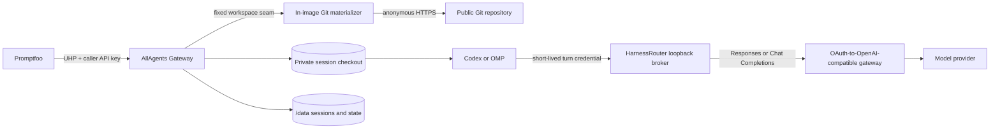

# ADR 0002: Build AllAgents Gateway as a narrow HarnessRouter downstream

- Status: Accepted
- Date: 2026-09-21
- Updated: 2026-09-27

## Context

Promptfoo needs a remote coding-harness endpoint that can prepare a repository before a turn, preserve that checkout across continuations, and expose the result through the Unified Harness Protocol (UHP). HarnessRouter already owns the difficult execution-plane behavior: UHP requests and streams, sessions, cancellation, files, artifacts, caller authentication, harness processes, and custom harness configuration. Replacing that control plane would create a second implementation of behavior we already need.

The examined baseline is UHP [`2026-09-12`](https://github.com/HarnessRouter/harnessrouter/tree/5f82db1d1f13ea25b8ed0893c38b5b7d2e3e57e3/protocol/versions/2026-09-12) at HarnessRouter commit [`5f82db1d1f13ea25b8ed0893c38b5b7d2e3e57e3`](https://github.com/HarnessRouter/harnessrouter/commit/5f82db1d1f13ea25b8ed0893c38b5b7d2e3e57e3), released as [`v0.25.4`](https://github.com/HarnessRouter/harnessrouter/releases/tag/v0.25.4).

UHP already reserves `metadata` for additive extensions. At the pinned commit, the request schema accepts an open metadata object ([UHP schema](https://github.com/HarnessRouter/harnessrouter/blob/5f82db1d1f13ea25b8ed0893c38b5b7d2e3e57e3/protocol/schema/uhp-2026-09-12.openapi.yaml#L1051-L1057)). That is an existing protocol extension point, not an extension framework: stock HarnessRouter gives arbitrary metadata no runner semantics. It extracts only nested `metadata.systemone` ([gateway extraction](https://github.com/HarnessRouter/harnessrouter/blob/5f82db1d1f13ea25b8ed0893c38b5b7d2e3e57e3/gateway/app.py#L7571-L7572)) and forwards only that probe to the runner ([runner handoff](https://github.com/HarnessRouter/harnessrouter/blob/5f82db1d1f13ea25b8ed0893c38b5b7d2e3e57e3/gateway/app.py#L7008-L7011)). Workspace semantics therefore require a downstream change.
The AllAgents key follows the same nested namespace convention as the existing `metadata.systemone.script`: `metadata.allagents.workspace`. The shared convention is the metadata shape, not System One's special forwarding behavior.

## Decision

We will ship **AllAgents Gateway** as a rebase-friendly downstream of HarnessRouter. The existing GitHub fork `allagentsdev/harnessrouter` will be renamed to [`allagentsdev/allagents-gateway`](https://github.com/allagentsdev/allagents-gateway), preserving its fork relationship and history. We will not create a third repository that consumes the fork.

The downstream adds one product feature: on a first turn, recognize the exact `metadata.allagents.workspace` object, validate and materialize one repository into a private session checkout, bind it immutably to the session, and start the selected harness there. A continuation reuses that exact checkout.

The supported v1 harnesses are **Codex** and **OMP**. Provider traffic goes only through an existing, separately operated OAuth-to-OpenAI-compatible gateway. Promptfoo calls AllAgents Gateway directly over UHP.

The downstream is not a general workspace platform. It adds no extension registry, dynamically selected hook, arbitrary materializer command, or second protocol. It invokes exactly one operator-configured materializer that is included in the AllAgents Gateway image.

## System flow and ownership


```mermaid
flowchart LR
  P[Promptfoo] -->|UHP + caller API key| A[AllAgents Gateway]
  A -->|fixed workspace seam| M[In-image Git materializer]
  M -->|anonymous HTTPS| G[Public Git repository]
  A --> C[(Private session checkout)]
  C --> H[Codex or OMP]
  H -->|short-lived turn credential| B[HarnessRouter loopback broker]
  B -->|Responses or Chat Completions| O[OAuth-to-OpenAI-compatible gateway]
  O --> V[Model provider]
  A --> D[(/data sessions and state)]
```

| Component | Owns |
|---|---|
| Promptfoo | Prompt, model, `metadata.harness_id`, first-turn workspace request, continuation ID, and evaluation assertions |
| HarnessRouter gateway and runner | Caller authentication, UHP validation and conformance, idempotency, session hydration, streaming, cancellation, harness execution, files, artifacts, and lifecycle state |
| AllAgents workspace seam | Exact metadata recognition, first-turn binding, continuation lookup, ordering before harness execution, and normalized workspace failures |
| Fixed materializer | URL and ref validation, safe Git resolution and acquisition, exact commit provenance, checkout validation, resource enforcement, cancellation, and cleanup |
| HarnessRouter custom harness definition | Reusable remote harness configuration: Codex or OMP base harness, model defaults, instructions, tools, skills, and server-owned provider route |
| HarnessRouter loopback broker | Per-turn scoped credential minting and exchange; the harness process never receives the long-lived external-gateway API key |
| External OAuth gateway | Provider login, OAuth token storage, refresh, repair, provider API compatibility, and provider authorization |
| Operator | Caller credentials, custom harnesses, provider endpoint and API key, egress policy, limits, TTL, deployment, upgrades, and deletion policy |

The materializer never owns UHP sessions or provider credentials. The external OAuth gateway never owns source acquisition or UHP session state. Promptfoo never receives source or provider credentials.

## Request contract

A workspace-backed first turn uses the normal UHP `POST /v1/responses` request. The exact v1 extension shape is:

```json
{
  "model": "gpt-5.4",
  "input": "Implement the requested change.",
  "metadata": {
    "harness_id": "chrn_…",
    "allagents": {
      "workspace": {
        "version": "1",
        "repository": {
          "url": "https://github.com/example/project.git",
          "ref": "refs/heads/main"
        },
        "workingDirectory": "packages/service"
      }
    }
  }
}
```

`metadata.harness_id` is HarnessRouter's existing harness selector. HarnessRouter documents custom harnesses as reusable configurations with a fixed base harness and selects them through `metadata.harness_id` ([custom harness behavior](https://github.com/HarnessRouter/harnessrouter/blob/5f82db1d1f13ea25b8ed0893c38b5b7d2e3e57e3/README.md#L155-L163), [UHP selection](https://github.com/HarnessRouter/harnessrouter/blob/5f82db1d1f13ea25b8ed0893c38b5b7d2e3e57e3/README.md#L186-L203)). For this product, a custom harness is the remote equivalent of a reusable profile. It is not an AllAgents CLI profile and is not projected from a developer machine.

`metadata.allagents.workspace` has exactly these fields:

| Field | Required | Contract |
|---|---:|---|
| `version` | yes | Exactly `"1"`. Other versions fail before source access. |
| `repository.url` | yes | Anonymous public HTTPS Git URL. No embedded credentials, userinfo, query, fragment, alternate protocol, or local path. |
| `repository.ref` | no | Advertised `refs/heads/*` or `refs/tags/*`, or unambiguous branch/tag shorthand. Omission means the remote default branch. Raw object IDs, other namespaces, ambiguous names, and unfetchable values fail. V1 accepts SHA-1 repositories only and records the resolved 40-hex commit. |
| `workingDirectory` | no | Relative POSIX directory beneath the checkout. Omission means the repository root. Absolute paths, empty components, `.`/`..` traversal, platform-specific separators, and any symlink escape fail. |

No other keys are accepted at any level of this object. The object cannot carry credentials, headers, environment variables, commands, destination paths, Docker settings, materializer selection, resource limits, retention, or provider configuration. Request size, string length, nesting depth, and parsing work are bounded before source access.

A first turn may omit `metadata.allagents.workspace`; stock HarnessRouter behavior then remains available. A session that starts without it cannot add it on a continuation.

After successful binding, public response metadata records the normalized requested URL, optional requested ref, exact resolved commit, and effective working directory under `metadata.allagents.workspace`. Internal checkout IDs and host paths remain private. The resolved commit, not a mutable branch or tag, is the provenance authority for the session.

## First turn and continuation semantics

For a workspace-backed first turn:

1. HarnessRouter authenticates the caller, validates the UHP request, establishes idempotency, and resolves whether the request creates or reuses a session.
2. Any reused session, whether selected by `previous_response_id` or `metadata.session_id`, rejects workspace metadata. If it already has an AllAgents workspace binding, its stored harness and binding win and a caller-supplied harness mismatch fails. An unbound session with no workspace metadata retains upstream routing.
3. For a new workspace-backed session, a workspace-aware hydrate creates an isolated empty session allocation but skips the stock empty Git initialization. It reserves bounded materialization capacity before provider or harness execution.
4. The materializer resolves the optional advertised ref to one exact commit, builds and validates a private checkout in staging, then atomically publishes it into the empty runner-designated checkout root.
5. The runner keeps its control root as a sibling of the checkout, never inside repository content. It derives the execution working directory as a validated descendant of the checkout.
6. HarnessRouter atomically binds the descriptor, resolved commit, checkout root, control root, execution working directory, cleanup deadline, and selected harness to the session.
7. The selected custom harness starts in the execution working directory, while its home, credentials, scratch, skills, and checkpoint control state remain anchored under the runner-owned control root.

A continuation selects an existing session with `previous_response_id` or HarnessRouter's existing `metadata.session_id` recovery path and omits `metadata.allagents.workspace`. For a workspace-bound session, the gateway derives the harness from stored state; if the caller supplies a different harness, the request fails before hydration. The continuation reuses the exact private checkout, including edits from earlier turns, and the original resolved-commit provenance. Supplying workspace metadata on any reused session is invalid, even if byte-for-byte identical. The gateway never resolves the ref again, clones a replacement, changes the working directory, or silently starts a fresh session.

If the bound checkout is expired, missing, corrupt, or cannot be proven to belong to the predecessor, continuation fails closed. There is no rematerialization, source fallback, or checkout substitution. The bounded ephemeral TTL is operator-configured; ordinary completion does not immediately remove a checkout that remains eligible for continuation. Expiry and explicit deletion use the same minimal idempotent cleanup path.

## Materializer and downstream boundary

The only maintained HarnessRouter seam is a workspace validate/materialize call **after session resolution and the workspace-aware hydration step, but before provider or harness execution**. It has two paths:

- first turn: allocate an empty session root without stock Git initialization, validate and materialize into its checkout child, create the separate control child, validate the execution working directory, and commit the binding;
- continuation: hydrate the bound session root, then load and verify the existing checkout, control root, and execution working directory without invoking source acquisition.

The downstream code recognizes only `metadata.allagents.workspace` and calls one configured in-image materializer. The caller cannot name an implementation. There is no registry, plugin lifecycle, generic hook graph, network materializer service, or reusable extension SDK.

The materializer contract is intentionally small: normalized descriptor in; an empty runner-assigned checkout target, cancellation, and fixed resource limits supplied by the runner; either a verified private checkout plus provenance, or a coded failure out. HarnessRouter remains responsible for session, checkpoint, file/artifact, and process lifecycle. Runner control state never lives inside the checkout, and the materializer cannot write it.

Requests without the AllAgents object retain upstream behavior, including routing for reused unbound sessions, and the pinned UHP conformance suite remains the protocol oracle. Each upstream rebase must review the patch against the metadata, session-resolution, hydration, checkpoint, runner-root, and custom-provider paths. If upstream gains an equivalent narrow lifecycle seam, remove the downstream patch rather than retain a compatibility layer.

## Provider authentication and harness configuration

Provider authentication is proxy-only. Each deployment configures one external OAuth-to-OpenAI-compatible gateway base URL and API key server-side. HarnessRouter represents that endpoint with two protocol-specific logical connections using the same secret: Responses for Codex and OpenAI Chat Completions for OMP. Each harness policy contains exactly its matching connection, with no fallback. The UHP caller cannot supply or override the endpoint, key, transport, or route.

The external OAuth gateway owns login, token persistence, refresh, and repair. AllAgents Gateway does not implement provider login, import local credentials, mount developer credential files, or coordinate token refresh. HarnessRouter's caller API key authenticates the UHP caller only and is never reused as a provider credential.

The deployment must use HarnessRouter's brokered sandbox mode, not the self-host image's `HR_SANDBOX_TRUST=owner` pass-through default. The gateway exchanges the long-lived external-gateway key server-side and gives each harness only a short-lived, session-scoped credential plus the loopback broker URL. Readiness fails if the local broker cannot mint and exchange that credential. The long-lived key never enters the harness process environment or session files. Scoped turn credentials may exist only in the active process environment or a per-turn ephemeral config root; the runner deletes them before checkpointing or exposing any file, artifact, log, or response.

Codex requires an OpenAI Responses-compatible endpoint. This matches the pinned runner, which states that current Codex supports Responses rather than Chat Completions ([Codex endpoint behavior](https://github.com/HarnessRouter/harnessrouter/blob/5f82db1d1f13ea25b8ed0893c38b5b7d2e3e57e3/runner/server.py#L1907-L1915)); HarnessRouter supports Codex against custom endpoints that provide the Responses format ([provider compatibility](https://github.com/HarnessRouter/harnessrouter/blob/5f82db1d1f13ea25b8ed0893c38b5b7d2e3e57e3/docs/self-hosting-guide.md#L331-L350)). OMP uses the same external gateway's OpenAI Chat Completions surface in v1, which its pinned builder supports ([OMP endpoint behavior](https://github.com/HarnessRouter/harnessrouter/blob/5f82db1d1f13ea25b8ed0893c38b5b7d2e3e57e3/runner/server.py#L2609-L2644)). An incompatible route fails readiness or the turn; it never changes protocol or provider automatically.

V1 custom harnesses use Codex or ordinary session-local OMP. OMP starts from the container's/session's own configuration. It does not import AllAgents profiles, host profiles, or developer state. There is no profile synchronization, profile projection, or AllAgents CLI integration.

## Source and workspace security invariants

Repository content is untrusted. The implementation must preserve all of these invariants:

- Caller authentication is required before session lookup, source access, continuation, retrieval, streaming, cancellation, file/artifact access, or deletion. Authentication failure does not disclose whether a session exists.
- Source is exactly one anonymous public HTTPS Git repository. URL parsing happens before DNS or process launch. Credentials and caller-controlled proxy settings are rejected and never forwarded.
- Every initial host and redirect target is re-parsed and re-authorized. DNS answers are checked against loopback, link-local, private, reserved, multicast, metadata-service, and otherwise non-public ranges; the approved address is pinned for the connection so DNS rebinding cannot change it. Redirect count, response size, and time are bounded.
- Git runs with a sanitized environment and isolated configuration. Interactive credentials, repository hooks, checkout filters, Git LFS, submodules, alternates, and non-HTTPS helpers or protocols, including `file`, `ssh`, and `ext`, are disabled or rejected. Repository configuration cannot weaken those rules.
- Ref discovery and fetch are bounded. V1 accepts only advertised branch/tag refs in SHA-1 repositories, ties the checkout to the exact resolved 40-hex commit, and records requested URL/ref plus resolved commit as provenance.
- The checkout is private and editable by one session only. No mutable state is shared across sessions. The runner-owned session root has separate checkout and control children; repository content can never overlap the control root.
- All path operations are rooted, no-follow where appropriate, and checked for traversal and symlink escape. The execution working directory must resolve to a real directory inside the checkout. Harness home, credentials, scratch, skills, and control state remain anchored under the sibling control root regardless of that working directory.
- Materialization and cleanup have hard process, descendant, wall-clock, byte, inode, file-count, and concurrency bounds. Cancellation terminates the complete acquisition process tree before cleanup and terminal acknowledgement.
- Partial staging is never attached. Cleanup is deterministic and idempotent after success, failure, cancellation, restart, expiry, and deletion. A path whose deletion failed is not reused or reported as free.
- Long-lived provider and caller credentials never enter Git arguments, the harness process environment, checkout or session files, response metadata, artifacts, logs, or provenance. A short-lived broker token may enter only the active harness environment or per-turn ephemeral config and is removed before checkpointing or public file collection. Source-controlled configuration cannot select the provider endpoint.

HarnessRouter's per-session process isolation remains useful, but this deployment is not represented as a hostile-code sandbox. The service binds to loopback by default and requires an explicit operator decision and network controls before broader exposure.

## Failure behavior

The gateway fails closed without changing source, checkout, harness, model route, or provider protocol as a recovery shortcut.

| Failure | Behavior |
|---|---|
| Malformed, oversized, nested too deeply, or unknown workspace field | Reject as invalid UHP input before source access. |
| Disallowed URL, DNS answer, redirect, protocol, ref, or Git feature | Fail the response before attachment; remove bounded staging; do not start a harness or provider call. |
| Ref does not resolve to one permitted commit | Fail with source-resolution error; do not guess a default or fetch arbitrary objects. |
| Resource or concurrency limit unavailable | Reject or fail with a retryable capacity error before starting unbounded work. |
| Materializer timeout, crash, cancellation, or live descendant | Terminate and reap the process tree, clean staging idempotently, and return a coded failure. |
| Working directory missing, not a directory, or escaping through traversal/symlink | Fail before harness execution. |
| Workspace metadata present on any reused session | Reject the request without changing the existing session or extending its TTL. |
| Bound checkout expired, missing, corrupt, or mismatched | Fail continuation; do not clone, substitute, or resurrect it. |
| External OAuth gateway authentication or provider failure | Return the normalized UHP failure; do not switch endpoint, protocol, credential, or harness. |
| Cleanup failure | Keep the allocation unavailable, report operational failure, and retry the same idempotent cleanup path. |

Promptfoo treats non-success as an evaluation error. It does not turn gateway failures into empty successes or implicit retries.

## Repository, deployment, and release boundary

`allagentsdev/allagents-gateway` is the implementation product. The repository contains the preserved HarnessRouter downstream, narrow workspace patch, materializer, Docker Compose deployment, pinned Promptfoo dependency and scenarios, and image release workflow. `allagentsdev/allagents` remains the local Bun CLI repository and contains only this integration decision and planning material; v1 adds no `allagents gateway start` command or other CLI coupling.

Once the existing fork has been renamed and `allagentsdev/allagents-gateway` exists, that repository's code, lockfiles, Compose file, limits, runbooks, and implementation documentation are authoritative for implementation detail. This ADR remains authoritative for the integration and product boundary. An implementation need that contradicts this boundary requires reconsidering the decision, not silently expanding the downstream.

The supported deployment is one container started by Docker Compose, bound to loopback by default, with durable `/data` and `HR_BACKENDS=codex,omp`. The materializer ships in that image; it is not another service.

The public image is `ghcr.io/allagentsdev/allagents-gateway`. It has its own versions and release cadence, independent of the `allagents` npm CLI. Deployments pin image digests. Releases produce standard SBOM and build-provenance attestations and run upstream UHP conformance against the built image.

Promptfoo is lockfile-pinned in the gateway repository and calls the built image directly over UHP. Release verification exercises both Codex and OMP through the configured external provider gateway. No intermediate evaluation repository or custom green-E2E attestation format is part of the product.

## Alternatives rejected

| Alternative | Why rejected |
|---|---|
| Build a new execution gateway | Duplicates HarnessRouter's UHP, sessions, streaming, cancellation, files, artifacts, and harness supervision. |
| Put a thin service in front of stock HarnessRouter | Splits checkout and session ownership across services and still cannot place the workspace at the correct runner lifecycle point. |
| Create a third repository that consumes the HarnessRouter fork | Loses the clear downstream history and adds a release/rebase boundary without adding product isolation. |
| Wait for stock HarnessRouter | The pinned version accepts arbitrary metadata but forwards only the System One probe; it has no workspace lifecycle semantics. |
| Add a general metadata extension or materializer framework | V1 has one object and one implementation. A framework would enlarge the fork before a second use case exists. |
| Put repository instructions in the prompt or a model tool | Makes acquisition model-dependent, non-deterministic, too late to set the initial working directory, and unsafe for credentials and provenance. |
| Make the local AllAgents CLI or its profiles the remote control plane | Couples a local developer tool to an independently deployed service and duplicates HarnessRouter custom harnesses. |
| Manage provider login inside AllAgents Gateway | Duplicates the external OAuth gateway's ownership of login, refresh, and repair and expands the credential attack surface. |
| Upload every source file through UHP | Pushes acquisition to every caller and loses authoritative Git ref-to-commit provenance and repository behavior. |

## Deliberate v1 limits

V1 supports one anonymous public HTTPS Git repository using SHA-1 object IDs, one private editable checkout per session, an optional advertised branch/tag ref, an optional safe working directory, exact 40-hex commit provenance, and bounded ephemeral retention.

V1 does **not** include raw commit-ID requests, SHA-256 repositories, multiple repositories, private-source credentials, OCI sources, caller-selected runtime images, shared or read-only generations, cross-session caching, persistent workspaces, user-selected TTLs, session branching, checkout migration, or elaborate tombstone and garbage-collection machinery beyond minimal idempotent cleanup. It uses HarnessRouter's existing file and artifact behavior rather than inventing produced-file tracking.

Only Codex and OMP are required and release-validated. Other upstream backends and a future Copilot harness are outside this decision. There is no local-profile import, host-profile projection, provider-route override, automatic provider fallback, public multi-tenant authorization model, scoring service, dataset service, or evaluation task engine.

## Consequences

AllAgents Gateway inherits a mature UHP execution plane and keeps the maintained patch reviewable. The cost is an ongoing rebase obligation against pinned HarnessRouter releases and ownership of a security-sensitive Git materializer.

Each session pays for a private checkout and cannot reuse a shared generation. That is intentionally less efficient than a source platform, but it makes mutability, provenance, continuation, quota, and cleanup ownership understandable for v1.

Provider credential lifecycle stays outside the gateway. This reduces credential code and operational states in the downstream, at the cost of requiring a compatible external OAuth gateway and making its availability part of the service's readiness.

The gateway and CLI can release independently. Promptfoo tests the same image and UHP surface that operators deploy.

## Reconsider when

Revisit this decision if:

- UHP standardizes a workspace attachment with equivalent first-turn and continuation semantics;
- upstream HarnessRouter adds an equivalent narrow post-hydration, pre-execution workspace seam;
- the downstream patch grows beyond metadata recognition, binding, and one fixed materializer invocation;
- a second materializer is approved and proves that a registry is simpler than explicit code;
- private repositories, multiple repositories, OCI sources, persistent workspaces, or shared immutable caching become validated product requirements;
- public multi-tenancy or stronger hostile-code isolation becomes a requirement;
- Codex can no longer use the external gateway's Responses surface, or OMP cannot use its configured compatible surface;
- the external gateway can no longer own provider login, refresh, and repair;
- private editable checkouts cannot meet practical storage and cleanup bounds; or
- another UHP implementation offers a materially smaller and more stable integration surface.
