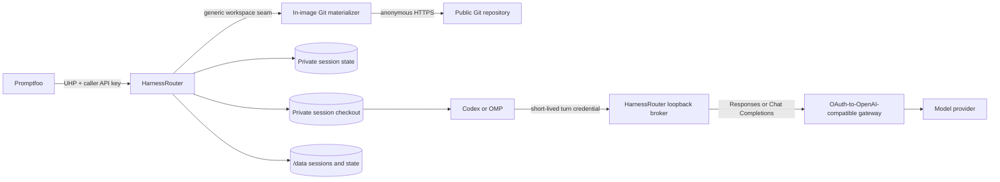

# ADR 0002: Add workspace materialization to HarnessRouter

- Status: Accepted
- Date: 2026-09-21
- Updated: 2026-09-27

## Context

Promptfoo needs a remote coding-harness endpoint that can prepare a repository before a turn, preserve that checkout across continuations, and expose the result through the Unified Harness Protocol (UHP). HarnessRouter already owns the difficult execution-plane behavior: UHP requests and streams, sessions, cancellation, files, artifacts, caller authentication, harness processes, and custom harness configuration. Replacing that control plane would create a second implementation of behavior we already need.

The examined baseline is UHP [`2026-09-12`](https://github.com/HarnessRouter/harnessrouter/tree/5f82db1d1f13ea25b8ed0893c38b5b7d2e3e57e3/protocol/versions/2026-09-12) at HarnessRouter commit [`5f82db1d1f13ea25b8ed0893c38b5b7d2e3e57e3`](https://github.com/HarnessRouter/harnessrouter/commit/5f82db1d1f13ea25b8ed0893c38b5b7d2e3e57e3), released as [`v0.25.4`](https://github.com/HarnessRouter/harnessrouter/releases/tag/v0.25.4).

UHP already reserves `metadata` for additive extensions. At the pinned commit, the request schema accepts an open metadata object ([UHP schema](https://github.com/HarnessRouter/harnessrouter/blob/5f82db1d1f13ea25b8ed0893c38b5b7d2e3e57e3/protocol/schema/uhp-2026-09-12.openapi.yaml#L1051-L1057)). That is an existing protocol extension point, not an extension framework: stock HarnessRouter gives arbitrary metadata no runner semantics. It extracts only nested `metadata.systemone` ([gateway extraction](https://github.com/HarnessRouter/harnessrouter/blob/5f82db1d1f13ea25b8ed0893c38b5b7d2e3e57e3/gateway/app.py#L7571-L7572)) and forwards only that probe to the runner ([runner handoff](https://github.com/HarnessRouter/harnessrouter/blob/5f82db1d1f13ea25b8ed0893c38b5b7d2e3e57e3/gateway/app.py#L7008-L7011)). Workspace semantics therefore require coordinated protocol and implementation changes.

The open metadata object permits implementation-specific extensions, but it does not make their semantics part of UHP. `metadata.workspace` becomes a standard UHP contract only if accepted through upstream governance. Until then, the fork may expose it only as a documented HarnessRouter extension. The protocol or fork release already owns schema evolution, so the workspace object must not introduce a nested version field.

## Decision

We will keep [`allagentsdev/harnessrouter`](https://github.com/allagentsdev/harnessrouter) as the existing GitHub fork of [`HarnessRouter/harnessrouter`](https://github.com/HarnessRouter/harnessrouter), preserving its name, fork relationship, and history. We will not create a replacement repository, rename the fork, or add a new repository or CLI integration.

Workspace materialization is a generic HarnessRouter capability and will be proposed upstream first. Before substantial implementation, we will open an upstream issue describing the use case, security model, request shape, lifecycle semantics, and conformance expectations. We will then follow HarnessRouter and UHP governance, including a UHP Enhancement Proposal (UEP) when required for protocol semantics. An accepted contribution must update the UHP specification, versioned schema, reference implementation, conformance coverage, changelog, and user/operator documentation together. If the issue receives no maintainer decision within 30 calendar days after opening and a follow-up is posted after day 14, the project records the proposal as deferred and may use the documented downstream-extension path.

The proposed first-turn contract is `metadata.workspace`. It validates and materializes one repository into a private session checkout, binds that checkout immutably to the session, and starts the selected harness in the requested directory. A continuation reuses that exact checkout. We will seek upstream ownership first. If upstream rejects or defers the contract, the fork may carry the same bounded behavior as an explicitly documented downstream HarnessRouter extension; it must not describe that extension as standard UHP behavior. If a later UHP release reserves an incompatible `metadata.workspace`, the fork must migrate cleanly rather than preserve conflicting aliases.

The fork remains the AllAgents distribution point. Generic protocol, lifecycle, session-binding, and materializer seams are proposed upstream first and live in the fork only when upstream declines or defers them. Deployment defaults, custom harness definitions, provider wiring, Promptfoo scenarios, and publication of the downstream image remain AllAgents-owned in either path. The supported distribution harnesses are **Codex** and **OMP**. Provider traffic goes only through an existing, separately operated OAuth-to-OpenAI-compatible gateway, and Promptfoo calls HarnessRouter directly over UHP.

This is not a general workspace platform. The proposal adds no extension registry, dynamically selected hook, arbitrary materializer command, or second protocol. It invokes exactly one operator-configured Git materializer included in the HarnessRouter image.

## System flow and ownership


```mermaid
flowchart LR
  P[Promptfoo] -->|UHP + caller API key| H[HarnessRouter]
  H -->|generic workspace seam| M[In-image Git materializer]
  M -->|anonymous HTTPS| G[Public Git repository]
  H --> S[(Private session state)]
  H --> C[(Private session checkout)]
  C --> X[Codex or OMP]
  X -->|short-lived turn credential| B[HarnessRouter loopback broker]
  B -->|Responses or Chat Completions| O[OAuth-to-OpenAI-compatible gateway]
  O --> V[Model provider]
  H --> D[(/data sessions and state)]
```

| Component | Owns |
|---|---|
| Promptfoo | Prompt, model, `metadata.harness_id`, first-turn `metadata.workspace` request, continuation ID, and evaluation assertions |
| UHP specification and governance | When accepted upstream: reservation and versioned meaning of `metadata.workspace`, its schema, lifecycle semantics, error contract, and conformance requirements |
| `allagentsdev/harnessrouter` release | When downstream-only: extension shape and revision, implementation lifecycle, errors, extension tests, changelog, and docs; never UHP conformance ownership |
| HarnessRouter gateway and runner | Caller authentication, UHP validation and conformance, idempotency, session hydration, workspace binding, streaming, cancellation, harness execution, files, artifacts, and lifecycle state |
| Generic workspace seam | Exact metadata recognition, first-turn binding, continuation lookup, ordering before harness execution, and normalized workspace failures |
| Fixed Git materializer | URL and ref validation, safe Git resolution and acquisition, exact commit provenance, checkout validation, resource enforcement, cancellation, and cleanup |
| HarnessRouter custom harness definition | Reusable remote harness configuration: Codex or OMP base harness, model defaults, instructions, tools, skills, and server-owned provider route |
| HarnessRouter loopback broker | Per-turn scoped credential minting and exchange; the harness process never receives the long-lived external-gateway API key |
| External OAuth gateway | Provider login, OAuth token storage, refresh, repair, provider API compatibility, and provider authorization |
| AllAgents distribution configuration | Deployment defaults, Codex and OMP custom harness definitions, provider wiring, Promptfoo scenarios, and image publication |
| Operator | Caller credentials, custom harnesses, provider endpoint and API key, egress policy, limits, TTL, deployment, upgrades, and deletion policy |

The materializer never owns UHP sessions or provider credentials. The external OAuth gateway never owns source acquisition or UHP session state. Promptfoo never receives source or provider credentials. Distribution configuration must not redefine the generic request or lifecycle contract.

## Request contract

A workspace-backed first turn uses the normal UHP `POST /v1/responses` request. The proposed shape is:

```json
{
  "model": "gpt-5.4",
  "input": "Implement the requested change.",
  "metadata": {
    "harness_id": "chrn_…",
    "workspace": {
      "repository": {
        "url": "https://github.com/example/project.git",
        "ref": "refs/heads/main"
      },
      "working_directory": "packages/service"
    }
  }
}
```

`metadata.harness_id` is HarnessRouter's existing harness selector. HarnessRouter documents custom harnesses as reusable configurations with a fixed base harness and selects them through `metadata.harness_id` ([custom harness behavior](https://github.com/HarnessRouter/harnessrouter/blob/5f82db1d1f13ea25b8ed0893c38b5b7d2e3e57e3/README.md#L155-L163), [UHP selection](https://github.com/HarnessRouter/harnessrouter/blob/5f82db1d1f13ea25b8ed0893c38b5b7d2e3e57e3/README.md#L186-L203)). For this distribution, a custom harness is the remote equivalent of a reusable profile. It is not an AllAgents CLI profile and is not projected from a developer machine.

`metadata.workspace` has exactly these fields:

| Field | Required | Contract |
|---|---:|---|
| `repository.url` | yes | Anonymous public HTTPS Git URL. No embedded credentials, userinfo, query, fragment, alternate protocol, or local path. |
| `repository.ref` | no | Advertised `refs/heads/*` or `refs/tags/*`, or unambiguous branch/tag shorthand. Omission means the remote default branch. Raw object IDs, other namespaces, ambiguous names, and unfetchable values fail. V1 accepts SHA-1 repositories only and records the resolved 40-hex commit. |
| `working_directory` | no | Relative POSIX directory beneath the checkout. Omission means the repository root. Absolute paths, empty components, `.`/`..` traversal, platform-specific separators, and any symlink escape fail. |

An accepted UHP protocol version governs the standard schema; otherwise the fork release governs the documented extension shape. The workspace object has no nested schema marker. No other keys are accepted at any level of the object. It cannot carry credentials, headers, environment variables, commands, destination paths, Docker settings, materializer selection, resource limits, retention, or provider configuration. Request size, string length, nesting depth, and parsing work are bounded before source access.

A first turn may omit `metadata.workspace`; stock HarnessRouter behavior then remains available. A session that starts without it cannot add it on a continuation.

After successful binding, public response metadata records the normalized requested URL, optional requested ref, exact resolved commit, and requested `working_directory` when supplied under `metadata.workspace`. Omission means the checkout root and remains omitted in the response. Internal checkout IDs and host paths remain private. The resolved commit, not a mutable branch or tag, is the provenance authority for the session.

## First turn and continuation semantics

For a workspace-backed first turn:

1. HarnessRouter authenticates the caller, validates the UHP request, establishes idempotency, and resolves whether the request creates or reuses a session.
2. Any reused session, whether selected by `previous_response_id` or `metadata.session_id`, rejects workspace metadata. If it already has a workspace binding, its stored harness and binding win and a caller-supplied harness mismatch fails. An unbound session with no workspace metadata retains ordinary routing.
3. For a new workspace-backed session, workspace-aware hydration creates an isolated empty session allocation but skips stock empty Git initialization. It reserves bounded materialization capacity before provider or harness execution.
4. The materializer resolves the optional advertised ref to one exact commit, builds and validates a private checkout in staging, and crash-safely publishes it into the empty runner-designated checkout root. Publication never exposes a partial checkout.
5. The runner keeps four distinct concepts and paths: the session root, the checkout root, the control root, and the execution root. The checkout and control roots are non-overlapping children of the runner-owned session allocation. The execution root is a validated directory within the checkout, never the control root.
6. HarnessRouter crash-safely binds the descriptor, workspace-contract owner and immutable revision, resolved commit, checkout root, control root, execution root, cleanup deadline, and selected harness to the session. The contract revision is the UHP release when standardized or the exact downstream source revision otherwise. A restart observes either the complete binding and published checkout or neither; recovery removes unattached staging.
7. The selected custom harness starts in the execution root, while its home, credentials, scratch, skills, and checkpoint control state remain anchored under the control root.

A continuation selects an existing session with `previous_response_id` or HarnessRouter's existing `metadata.session_id` recovery path and omits `metadata.workspace`. For a workspace-bound session, the gateway derives the harness from stored state; if the caller supplies a different harness, the request fails before hydration. The continuation reuses the exact private checkout, including edits from earlier turns, and the original resolved-commit provenance. Supplying workspace metadata on any reused session is invalid, even if byte-for-byte identical. The gateway never resolves the ref again, clones a replacement, changes the working directory, or silently starts a fresh session.

If the bound checkout is expired, missing, corrupt, belongs to an unsupported workspace-contract revision, or cannot be proven to belong to the predecessor, continuation fails closed. Before activating an incompatible contract, an upgrade must explicitly migrate compatible bindings or drain and delete them; it must not retain conflicting aliases. There is no rematerialization, source fallback, or checkout substitution. The bounded ephemeral TTL is operator-configured; ordinary completion does not immediately remove a checkout that remains eligible for continuation. Expiry and explicit deletion use the same minimal idempotent cleanup path.

## Generic upstream seam and distribution boundary

The proposed generic HarnessRouter seam is a workspace validate/materialize call **after session resolution and workspace-aware hydration, but before provider or harness execution**. It has two paths:

- first turn: allocate an empty session root without stock Git initialization, validate and materialize into its checkout root, create the separate control root, validate the execution root, and commit the binding;
- continuation: hydrate the bound session root, then load and verify the existing checkout, control, and execution roots without invoking source acquisition.

The owning HarnessRouter implementation recognizes only the selected `metadata.workspace` contract and calls one operator-configured in-image materializer. That code lands upstream when accepted and remains an explicit fork patch otherwise. The caller cannot name an implementation. There is no registry, plugin lifecycle, generic hook graph, network materializer service, or reusable extension SDK.

The materializer contract is intentionally small: normalized descriptor in; an empty runner-assigned checkout target, cancellation, and fixed resource limits supplied by the runner; either a verified private checkout plus provenance, or a coded failure out. HarnessRouter remains responsible for session, checkpoint, file/artifact, and process lifecycle. Runner control state never lives inside the checkout, and the materializer cannot write it.

Upstream-first is a contribution sequence, not a downstream namespace claim:

1. Open a HarnessRouter issue before substantial implementation and confirm maintainers' preferred protocol process.
2. Submit a UEP when UHP governance requires one for the generic key and semantics.
3. If accepted, change the UHP specification and versioned schema, reference implementation, conformance suite, changelog, and documentation as one coherent contract.
4. If rejected or deferred, record the upstream decision and carry only the same bounded workspace patch in the fork, labeled and tested as a downstream extension rather than a UHP standard.
5. Keep URL policy, Git acquisition, workspace binding, continuation behavior, root separation, failure normalization, and the lifecycle seam generic in either implementation path.
6. Keep deployment defaults, custom harness definitions, external-provider wiring, Promptfoo scenarios, and downstream image publication in `allagentsdev/harnessrouter`.

Requests without `metadata.workspace` retain upstream behavior, including routing for reused unbound sessions, and the pinned UHP conformance suite remains the base protocol oracle. Each rebase of `allagentsdev/harnessrouter` must review distribution changes against the metadata, session-resolution, hydration, checkpoint, runner-root, and custom-provider paths. When the workspace capability is downstream-only, its tests and release notes identify that status separately from UHP conformance.

## Provider authentication and harness configuration

Provider authentication is proxy-only. Each deployment configures one external OAuth-to-OpenAI-compatible gateway base URL and API key server-side. HarnessRouter represents that endpoint with two protocol-specific logical connections using the same secret: Responses for Codex and OpenAI Chat Completions for OMP. Each harness policy contains exactly its matching connection, with no fallback. The UHP caller cannot supply or override the endpoint, key, transport, or route.

The external OAuth gateway owns login, token persistence, refresh, and repair. HarnessRouter does not implement provider login, import local credentials, mount developer credential files, or coordinate token refresh. HarnessRouter's caller API key authenticates the UHP caller only and is never reused as a provider credential.

The deployment must use HarnessRouter's brokered sandbox mode, not the self-host image's `HR_SANDBOX_TRUST=owner` pass-through default. The broker exchanges the long-lived external-gateway key server-side and gives each harness only a short-lived, session-scoped credential plus the loopback broker URL. Readiness fails if the local broker cannot mint and exchange that credential. The long-lived key never enters the harness process environment or session files. Scoped turn credentials may exist only in the active process environment or a per-turn ephemeral config root; the runner deletes them before checkpointing or exposing any file, artifact, log, or response.

Codex requires an OpenAI Responses-compatible endpoint. This matches the pinned runner, which states that current Codex supports Responses rather than Chat Completions ([Codex endpoint behavior](https://github.com/HarnessRouter/harnessrouter/blob/5f82db1d1f13ea25b8ed0893c38b5b7d2e3e57e3/runner/server.py#L1907-L1915)); HarnessRouter supports Codex against custom endpoints that provide the Responses format ([provider compatibility](https://github.com/HarnessRouter/harnessrouter/blob/5f82db1d1f13ea25b8ed0893c38b5b7d2e3e57e3/docs/self-hosting-guide.md#L331-L350)). OMP uses the same external gateway's OpenAI Chat Completions surface in v1, which its pinned builder supports ([OMP endpoint behavior](https://github.com/HarnessRouter/harnessrouter/blob/5f82db1d1f13ea25b8ed0893c38b5b7d2e3e57e3/runner/server.py#L2609-L2644)). An incompatible route fails readiness or the turn; it never changes protocol or provider automatically.

V1 custom harnesses use Codex or ordinary session-local OMP. OMP starts from the container's/session's own configuration. It does not import AllAgents profiles, host profiles, or developer state. There is no profile synchronization, profile projection, or AllAgents CLI integration.

## Source and workspace security invariants

Repository content is untrusted. The implementation must preserve all of these invariants:

- Caller authentication is required before session lookup, source access, continuation, retrieval, streaming, cancellation, file/artifact access, or deletion. Authentication failure does not disclose whether a session exists.
- Source is exactly one anonymous public HTTPS Git repository. URL parsing happens before DNS or process launch. Credentials and caller-controlled proxy settings are rejected and never forwarded.
- Every initial host and redirect target is re-parsed and re-authorized. DNS answers are checked against loopback, link-local, private, reserved, multicast, metadata-service, and otherwise non-public ranges; the approved address is pinned for the connection so DNS rebinding cannot change it. Redirect count, response size, and time are bounded.
- Git runs with a sanitized environment and isolated configuration. Interactive credentials, repository hooks, checkout filters, Git LFS, submodules, alternates, and non-HTTPS helpers or protocols, including `file`, `ssh`, and `ext`, are disabled or rejected. Repository configuration cannot weaken those rules.
- Ref discovery and fetch are bounded. V1 accepts only advertised branch/tag refs in SHA-1 repositories, ties the checkout to the exact resolved 40-hex commit, and records requested URL/ref plus resolved commit as provenance.
- The checkout is private and editable by one session only. No mutable state is shared across sessions. The runner-owned allocation maintains distinct session, checkout, control, and execution roots; repository content can never overlap the control root.
- All path operations are rooted, no-follow where appropriate, and checked for traversal and symlink escape. The execution root must resolve to a real directory inside the checkout root. Harness home, credentials, scratch, skills, and control state remain anchored under the control root regardless of the execution root.
- Materialization and cleanup have hard process, descendant, wall-clock, byte, inode, file-count, and concurrency bounds. Cancellation terminates the complete acquisition process tree before cleanup and terminal acknowledgement.
- Publication is crash-safe and partial staging is never attached. Cleanup is deterministic and idempotent after success, failure, cancellation, restart, expiry, and deletion. A path whose deletion failed is not reused or reported as free.
- Long-lived provider and caller credentials never enter Git arguments, the harness process environment, checkout or session files, response metadata, artifacts, logs, or provenance. A short-lived broker token may enter only the active harness environment or per-turn ephemeral config and is removed before checkpointing or public file collection. Source-controlled configuration cannot select the provider endpoint.

HarnessRouter's per-session process isolation remains useful, but this deployment is not represented as a hostile-code sandbox. The service binds to loopback by default and requires an explicit operator decision and network controls before broader exposure.

## Failure behavior

HarnessRouter fails closed without changing source, checkout, harness, model route, or provider protocol as a recovery shortcut.

| Failure | Behavior |
|---|---|
| Malformed, oversized, nested too deeply, or unknown workspace field | Reject as invalid request input before source access. |
| Workspace extension not accepted upstream | Ship it only as a documented downstream HarnessRouter extension; never represent it as UHP-standard behavior. |
| Disallowed URL, DNS answer, redirect, protocol, ref, or Git feature | Fail the response before attachment; remove bounded staging; do not start a harness or provider call. |
| Ref does not resolve to one permitted commit | Fail with source-resolution error; do not guess a default or fetch arbitrary objects. |
| Resource or concurrency limit unavailable | Reject or fail with a retryable capacity error before starting unbounded work. |
| Materializer timeout, crash, cancellation, or live descendant | Terminate and reap the process tree, clean staging idempotently, and return a coded failure. |
| Working directory missing, not a directory, or escaping through traversal/symlink | Fail before harness execution. |
| Crash during checkout publication or session binding | Recover to either the complete published checkout and binding or no attachment; never expose partial staging or reuse an uncertain path. |
| Workspace metadata present on any reused session | Reject the request without changing the existing session or extending its TTL. |
| Bound checkout expired, missing, corrupt, mismatched, or owned by an unsupported contract revision | Fail continuation; do not clone, substitute, resurrect, or reinterpret it. |
| External OAuth gateway authentication or provider failure | Return the normalized UHP failure; do not switch endpoint, protocol, credential, or harness. |
| Cleanup failure | Keep the allocation unavailable, report operational failure, and retry the same idempotent cleanup path. |

Promptfoo treats non-success as an evaluation error. It does not turn HarnessRouter failures into empty successes or implicit retries.

## Repository, deployment, and release boundary

`allagentsdev/harnessrouter` remains the implementation and distribution repository and remains a GitHub fork of `HarnessRouter/harnessrouter`. It carries the upstream baseline plus the smallest necessary downstream distribution revision. It does not become a separate product repository. `allagentsdev/allagents` remains the local Bun CLI repository and contains this integration decision and planning material; v1 adds no gateway command or other CLI coupling.

Generic workspace capability is proposed through the upstream contribution process. If accepted, it lands in the UHP specification, schema, reference implementation, conformance suite, changelog, and docs, and the fork consumes that release. If upstream rejects or defers it, the fork may carry the smallest complete workspace patch and identifies that delta in release notes, source metadata, and tests. In either path, deployment defaults, Codex and OMP custom harness definitions, provider wiring, pinned Promptfoo scenarios, and image release automation remain downstream. Generic protocol or lifecycle fixes discovered downstream continue to be proposed upstream rather than hidden behind product-specific seams.

The supported deployment is one container started by Docker Compose, bound to loopback by default, with durable `/data` and `HR_BACKENDS=codex,omp`. The materializer ships in that image; it is not another service.

The public image is `ghcr.io/allagentsdev/harnessrouter`. Tags identify the upstream HarnessRouter baseline plus the downstream AllAgents revision; deployments pin the resulting image digest. Releases produce standard SBOM and build-provenance attestations and run upstream UHP conformance against the built image.

Promptfoo is lockfile-pinned in `allagentsdev/harnessrouter` and calls the built image directly over UHP. Release verification exercises both Codex and OMP through the configured external provider gateway. No intermediate evaluation repository or custom green-E2E attestation format is part of the distribution.

## Alternatives rejected

| Alternative | Why rejected |
|---|---|
| Build a new execution gateway | Duplicates HarnessRouter's UHP, sessions, streaming, cancellation, files, artifacts, and harness supervision. |
| Put a thin service in front of stock HarnessRouter | Splits checkout and session ownership across services and still cannot place the workspace at the correct runner lifecycle point. |
| Rename the existing fork or create a third repository around it | Loses the clear upstream relationship or adds a release/rebase boundary without product isolation. |
| Present a downstream workspace extension as standard UHP behavior | The open metadata object permits an implementation extension, but only upstream governance can standardize its meaning and conformance requirements. |
| Wait without engaging upstream | The pinned version accepts arbitrary metadata but forwards only the System One probe; an issue and, if required, a UEP are the path to obtaining workspace lifecycle semantics. |
| Add a general metadata extension or materializer framework | V1 has one object and one implementation. A framework would enlarge the change before a second use case exists. |
| Put repository instructions in the prompt or a model tool | Makes acquisition model-dependent, non-deterministic, too late to set the initial working directory, and unsafe for credentials and provenance. |
| Make the local AllAgents CLI or its profiles the remote control plane | Couples a local developer tool to an independently deployed service and duplicates HarnessRouter custom harnesses. |
| Manage provider login inside HarnessRouter | Duplicates the external OAuth gateway's ownership of login, refresh, and repair and expands the credential attack surface. |
| Upload every source file through UHP | Pushes acquisition to every caller and loses authoritative Git ref-to-commit provenance and repository behavior. |

## Deliberate v1 limits

V1 supports one anonymous public HTTPS Git repository using SHA-1 object IDs, one private editable checkout per session, an optional advertised branch/tag ref, an optional safe working directory, exact 40-hex commit provenance, and bounded ephemeral retention.

V1 does **not** include raw commit-ID requests, SHA-256 repositories, multiple repositories, private-source credentials, OCI sources, caller-selected runtime images, shared or read-only generations, cross-session caching, persistent workspaces, user-selected TTLs, session branching, checkout migration, or elaborate tombstone and garbage-collection machinery beyond minimal idempotent cleanup. It uses HarnessRouter's existing file and artifact behavior rather than inventing produced-file tracking.

Only Codex and OMP are required and release-validated by the AllAgents distribution. Other upstream backends and a future Copilot harness are outside this decision. There is no local-profile import, host-profile projection, provider-route override, automatic provider fallback, public multi-tenant authorization model, scoring service, dataset service, or evaluation task engine.

## Consequences

HarnessRouter gains a bounded workspace-materialization contract without creating a separate gateway product. The preferred outcome is a governed UHP capability; the fallback is a clearly labeled downstream extension in the existing fork. The contribution cost includes upstream design review, UEP work when required, and coordinated specification/schema/implementation/conformance changes when maintainers accept the contract.

`allagentsdev/harnessrouter` retains a clear fork relationship and a narrow distribution delta. Its image and the `allagents` npm CLI release independently. Promptfoo tests the same digest-pinned image and UHP surface that operators deploy.

Each session pays for a private checkout and cannot reuse a shared generation. That is intentionally less efficient than a source platform, but it makes mutability, provenance, continuation, quota, and cleanup ownership understandable for v1.

Provider credential lifecycle stays outside HarnessRouter. This reduces credential code and operational states in the distribution, at the cost of requiring a compatible external OAuth gateway and making its availability part of service readiness.

Upstream review may accept, reject, defer, or reshape the proposal. Acceptance lets the fork delete generic workspace patches and consume the upstream release. Rejection or deferral leaves those patches visible as a downstream HarnessRouter extension; it does not justify a repository rename or a false claim that UHP conformance covers the extension.

## Reconsider when

Revisit this decision if:

- upstream HarnessRouter or UHP governance materially changes the generic workspace contract or later reserves an incompatible key;
- maintainers require a different lifecycle point, schema, or extension mechanism;
- an accepted upstream path cannot keep the specification, schema, reference implementation, conformance, changelog, and documentation aligned as one coherent versioned contract;
- the generic seam grows beyond metadata recognition, binding, and one fixed materializer invocation;
- a second materializer is approved and proves that a registry is simpler than explicit code;
- private repositories, multiple repositories, OCI sources, persistent workspaces, or shared immutable caching become validated product requirements;
- public multi-tenancy or stronger hostile-code isolation becomes a requirement;
- Codex can no longer use the external gateway's Responses surface, or OMP cannot use its configured compatible surface;
- the external gateway can no longer own provider login, refresh, and repair;
- private editable checkouts cannot meet practical storage and cleanup bounds; or
- another UHP implementation offers a materially smaller and more stable integration surface.
