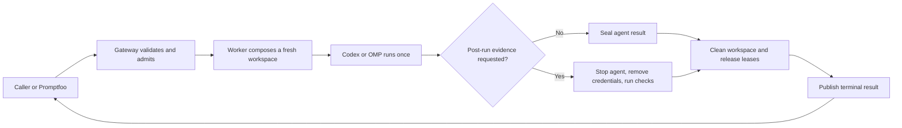
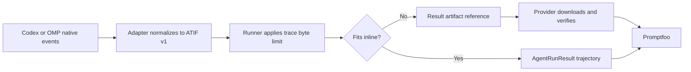

# ADR 0002: Use a one-shot AllAgents Gateway with Promptfoo as the first caller

- Status: Accepted
- Date: 2026-09-21
- Updated: 2026-09-28

## Decision

We will build `allagentsdev/allagents-gateway` as a general service for one-shot coding-agent runs. The API, worker, runner, Promptfoo provider, and Codex and OMP adapters will live in that repository.

Promptfoo will be the first caller. Promptfoo owns evaluation cases, prompt and model matrices, repetitions, grading, pass/fail decisions, rewards, and reports. The gateway runs an agent and returns raw evidence. It does not grade the result.

Each request creates a fresh workspace, runs one agent once, optionally collects evidence, and destroys the workspace. V1 has no reusable session, continuation, checkpoint, generic workspace diff, or implicit rerun.

Promptfoo may render earlier conversational turns into that one instruction. This is transcript replay into a new run, not continuation: previous workspace mutations, tool state, and agent state do not survive. Promptfoo's stateful target mode is outside V1 because it sends only the newest turn and requires the target to own a reusable session.

The public contracts are `AgentRunRequest v1` and `AgentRunResult v1`. They are closed, versioned JSON schemas. Unknown fields are rejected, and incompatible changes require a new version. The detailed fields belong in the gateway schemas and are recorded in the [implementation plan](../plans/2026-09-18-0837-feat-coding-execution-gateway-plan.md).

This decision supersedes the earlier two-repository snapshot design. We keep the `allagentsdev/allagents-gateway` name, but the workspace-builder and snapshot contracts do not remain.

## Why

AllAgents needs remote, isolated coding-agent execution. It does not currently need long-lived interactive sessions.

The earlier design used reusable sessions, published workspace snapshots, checkpoints, filesystem journals, and generic change artifacts. Those features solve continuation and state-transfer problems. A one-shot run only needs a clean workspace, one agent attempt, optional evidence from the final state, and reliable cleanup. Keeping the session design would add protocol, storage, and recovery work without improving that result.

Supporting research is in [One-shot coding-agent gateway boundary](../research/one-shot-coding-agent-gateway-boundary.md).

## Main flow

1. The caller provides one instruction, an ordered list of workspace sources, an agent, an authorized runtime profile, network-policy names, resource limits, and optional post-run evidence requests. Promptfoo gives every evaluation repetition a distinct run identity.
2. The Promptfoo provider packages local sources and optional check content into immutable uploads. Remote requests contain artifact references and digests, never paths on the caller's machine.
3. The gateway authenticates the caller, validates the request, and checks for an existing run with the same identity. It then authorizes a new request and pins the exact runtime profile revision that the worker must use.
4. The worker creates a fresh sandbox. It authorizes and materializes each source at its requested destination. Read-only sources stay read-only. Writable sources receive private copies.
5. The selected Codex or OMP adapter starts the agent once. The runner records bounded final output, usage, timing, and trajectory data.
6. After the agent exits, the runner stops every agent-owned process, destroys the agent network environment, and removes model and source credentials. If the request asks for post-run evidence, the runner then exposes the hidden check bundle, creates a separate post-run network environment, and runs the declared commands in the same retained runtime and final workspace.
7. The worker stores each command result and requested file observation in request order. It then stops remaining processes and services, unmounts the workspace, deletes private files, and releases source-cache leases.
8. Only after cleanup succeeds does the gateway publish `completed`, `cancelled`, or `infrastructure_error`. Promptfoo downloads and verifies referenced artifacts, then applies its own graders.

## Responsibilities

| Component | Owns | Does not own |
|---|---|---|
| Promptfoo | Evaluation cases, prompt rendering, model matrices, repetitions, requested evidence, graders, pass/fail, rewards, and reports | The remote sandbox or gateway lifecycle |
| Promptfoo provider | Stable run and retry identities, local packaging, immutable uploads, submission, cancellation, polling, artifact verification, and exposing evidence to Promptfoo | Grading or remote execution |
| Gateway | Authentication, validation, authorization, duplicate-request handling, cancellation, dispatch, artifact access, and result retrieval | Behavioral pass/fail or reward |
| Worker and runner | One run's sandbox, workspace composition, limits, agent supervision, evidence collection, and cleanup | Evaluation policy |
| Operator configuration | Credentials, source access rules, model routing, runtime profiles, sandbox and network policies, task services, resource ceilings, and retention | Caller-controlled request data |

Callers select authorized logical names. They cannot submit credentials or policy definitions.

## Request boundary

A request includes:

- `run_id` and `idempotency_key`;
- one rendered instruction;
- an ordered workspace and working directory;
- Codex or OMP plus a logical model name;
- a required `runtime_profile_id`;
- an agent network-policy name;
- required time, workspace, output, trace, command-output, and artifact limits; and
- `post_run`, which is either `null` or a closed evidence request.

A workspace contains between 1 and 128 sources. Every source declares a non-overlapping destination and `access: read_only | writable`.

| Source | Caller provides | Gateway resolves |
|---|---|---|
| Git | Canonical HTTPS repository URL, ref, and full or bounded shallow history | One exact commit |
| OCI | Canonical repository and exact image-manifest descriptor | That exact manifest and materialized filesystem |
| Uploaded bundle | Authorized immutable bundle reference | The declared artifact digest |

The caller cannot submit host paths, credentials, internal credential routes, runtime images, executable paths, service definitions, shell commands, raw network destinations, policy bodies, grading rules, patch requests, or workspace-persistence options.

## Source authorization and caching

For Git, the gateway maps the authenticated tenant and canonical repository URL to exactly one internal access and credential route. OCI uses the authenticated tenant and canonical repository in the same way. Zero matches or more than one match reject the request before credentials or network access.

V1 rejects Git and OCI redirects. An OCI route fixes the allowed token service. The worker fetches manifests and blobs through that route and rejects foreign blob locations. Remote content cannot redirect credentials to another target.

The gateway caches immutable source generations:

- Git: canonical repository, resolved commit, history rule, and materializer version;
- OCI: canonical repository, exact descriptor, and materializer version; and
- uploaded bundle: artifact digest and materializer version.

Authorization is not part of the cache key. The gateway checks current authorization before every attachment, including cache hits.

Concurrent requests for the same missing generation share one fetch and materialization. Complete generations are immutable. A run holds an eviction lease until cleanup finishes.

Read-only sources mount the cached generation directly and read-only. Writable sources receive a private filesystem copy-on-write clone when supported, with a full private copy as the fallback. The gateway never uses hardlinks or another shared writable alias.

## Runtime and isolation

`runtime_profile_id` selects an operator-defined profile that the caller is allowed to use. Before dispatch, the gateway resolves it to one immutable `profile_digest` and stores that exact revision with the run. The revision fixes the runtime image, sandbox policy, approved tools, task-service implementations, network brokers, and resource ceilings. The worker refuses to run if the pinned content is missing or its digest changed.

`AgentRunResult v1` reports the profile and immutable runtime, tool, and service identities that actually ran. It does not expose secret arguments, credentials, private endpoints, or host paths.

Every run uses a new Linux sandbox with:

- an unprivileged, non-root user and no Linux capabilities;
- `no_new_privs` and an explicit system-call allowlist;
- private process, mount, inter-process communication, hostname, and network environments;
- a read-only runtime filesystem with only declared workspace and build locations writable;
- no host devices, container socket, control-plane mount, or writable cgroup control; and
- enforced process-count, memory, CPU, disk I/O, time, workspace, file-count, and output limits.

If the worker cannot establish this baseline, it rejects the run rather than weakening isolation.

The agent and post-run commands use separate, deny-by-default network environments. Both external and local traffic must go through operator-managed endpoints allowed for that phase. The worker destroys the agent network environment and its active connections before creating the post-run environment. This prevents the agent from reaching checks or services that are available only after it exits.

Credentials never enter caller JSON, workspace files, logs, trajectories, or returned evidence. Source and model access use worker-owned mechanisms. Evidence commands receive no source or model credentials.

## Post-run evidence

`post_run: null` means the caller wants only the agent result. A non-null value asks the gateway to collect raw evidence; it does not ask the gateway to judge the run.

A post-run request may include:

- an immutable hidden check bundle;
- up to 32 ordered commands;
- up to 128 bounded workspace-relative output files; and
- a separately authorized post-run network policy.

Each command selects either an approved tool from the pinned runtime profile or an executable inside the hidden bundle. Arguments are literal strings. The gateway does not invoke a shell, expand variables or globs, accept a command-specific working directory, or accept a command-specific network policy.

The hidden bundle is absent while the agent runs. The worker may create an empty reserved mount point, but it does not fetch or mount the bundle until the agent and its descendants are gone, the agent network environment is destroyed, and credentials are removed.

Evidence commands run in the same pinned runtime and final workspace so they can use installed dependencies and declared task services. Source access remains unchanged: a command cannot write to a `read_only` source.

A command's nonzero exit or configured timeout is raw evidence in a `completed` run. A failure to create the sandbox, mount the bundle, resolve or start an approved executable, store promised evidence, or clean up is an `infrastructure_error`.

The worker records one observation for every requested command and file, in request order. Cancellation or infrastructure failure preserves observations already stored and marks later work as not run or unavailable. It never silently drops or reorders partial evidence.

## Results and artifacts

`AgentRunResult v1` reports gateway lifecycle, not task quality:

| Status | Meaning |
|---|---|
| `completed` | The agent ran and requested evidence collection finished. A command may still have failed or timed out. |
| `cancelled` | Cancellation won before the terminal result was published. |
| `infrastructure_error` | The gateway could not safely complete the run lifecycle. |

A completed result includes source and runtime provenance, bounded agent output, usage, timing, and a valid bounded trajectory. It includes post-run observations when requested. The gateway never returns behavioral pass/fail or reward.

### Where transcripts and traces come from

While Codex or OMP runs, its adapter reads the structured events emitted by that pinned agent CLI and converts them incrementally to ATIF v1, the public trajectory format for V1. The runner stops recording at `max_trace_bytes` and adds a valid truncation marker rather than producing an invalid or unbounded document.

The agent's final answer is captured separately as bounded final output. V1 returns a trajectory for one run; it does not preserve a resumable session transcript or enough state to continue the conversation. The native vendor event stream is normalized rather than exposed as a second public trace format.

All captured data is bounded. The request reserves enough artifact capacity for the declared output-file maxima. Actual output files use that capacity first, followed by agent output, command output in request order, and trajectory data. If optional artifact storage is exhausted, the gateway returns bounded inline, truncated, or explicitly omitted data rather than storing an unbounded value.

Every upload, run, cancellation target, result, and result artifact belongs to one authenticated tenant. Object lookup always includes that tenant. A cross-tenant identifier is treated like an unknown identifier; UUIDs and digests are not authorization.

Result artifact references include media type, digest, byte size, and expiry. The authenticated artifact endpoint serves only unexpired result artifacts belonging to the caller's run. The Promptfoo provider verifies the returned media type, length, and digest before passing bytes to a grader. Input and hidden-check bundles are never exposed through the result-artifact endpoint.

## Retries, cancellation, and cleanup

After authentication and schema validation, the gateway checks `run_id` and `idempotency_key` before source admission or resource allocation.

- An exact duplicate returns the existing run without starting another agent.
- Reusing either identity for a different request returns a conflict and starts nothing.
- A new request is admitted before a public run is created. A rejected request leaves no public run or job.
- Once the worker may have started the agent, recovery never starts it again. If the worker cannot prove that the agent was never invoked, the run ends with `infrastructure_error`.

Retries of uploads, submission, polling, cancellation, and artifact downloads reuse the same identities. Promptfoo repetitions use new identities because they are intentional new attempts.

Cancellation stops the current agent or evidence process and preserves bounded partial evidence. The worker then performs the same cleanup as any other run. `cancelled` becomes visible only after cleanup succeeds. A cleanup failure changes the eventual result to `infrastructure_error`.

Cleanup is part of terminalization. Before publishing any terminal result, the worker must stop all remaining processes and services, remove mounts and private files, and release cache leases. Cleanup can be retried safely, but the gateway cannot publish a successful result while cleanup remains incomplete.

## V1 scope

V1 supports direct Codex and OMP execution only.

It does not include:

- reusable or interactive sessions;
- continuation, checkpoints, or workspace recovery;
- generic diffs, patches, or modified-workspace export;
- Harbor, Terminal-Bench, or SWE-bench adapters; or
- gateway-owned grading.

A future benchmark adapter or workspace-export feature requires a separate decision and a new closed contract. OCI remains a supported workspace input; it is not a mandatory snapshot handoff between two AllAgents services.

## Consequences

Benefits:

- each run starts clean and cannot inherit another run's mutable state;
- network retries cannot duplicate agent work;
- concurrent runs can reuse exact immutable sources without sharing writable state;
- Promptfoo grading stays separate from gateway lifecycle;
- Codex and OMP share one isolation and result contract; and
- credentials and operator policy remain outside the caller-controlled request.

Costs:

- AllAgents must build and operate strong sandbox, network, credential, artifact, and cleanup controls;
- local inputs and hidden checks must be packaged and uploaded;
- immutable source caching requires storage limits, leases, safe eviction, recovery, and authorization on every attachment;
- callers must choose `read_only` or `writable` correctly; and
- debugging relies on bounded output, trajectory, command results, and requested files because the workspace is destroyed.

We will reconsider this decision if the product needs reusable interactive coding sessions or if direct execution cannot provide the required isolation. More Promptfoo matrices, graders, benchmark formats, or raw evidence do not by themselves justify sessions, snapshots, generic diffs, or gateway-owned grading.
