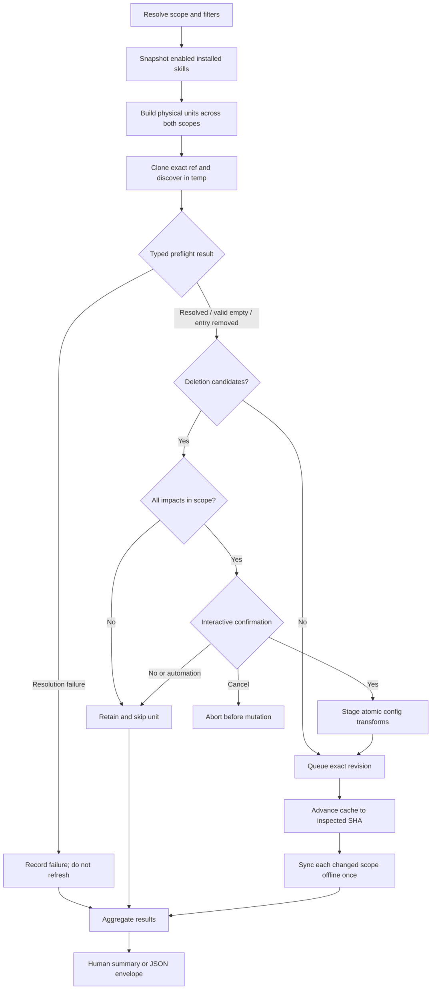

# feat(cli): Update skills with safe upstream-deletion handling

## Goal Capsule

- **Objective:** Add `allagents skill update [skills...]` with project, user, and combined scope support, including a clear confirmation flow when an installed skill disappeared from its upstream source.
- **Authority:** User confirmation controls deletion. AllAgents may mutate only configuration and client artifacts it already owns.
- **Execution profile:** Preflight remote sources without mutating the persistent cache, batch confirmed removals, refresh accepted sources, and sync each affected scope once.
- **Stop conditions:** Do not classify a fetch/discovery failure as deletion. Do not refresh an affected source when deletion is declined or cannot be confirmed safely.
- **Tail ownership:** Complete automated verification, isolated project-scope UAT, and document exact UAT commands/results in the draft PR.

---

## Product Contract

### Summary

AllAgents can add, remove, and list skills, but it has no skill-focused update command. Users currently have to update whole plugins, and a normal sync can silently purge an AllAgents-managed skill after its upstream source removes it. The new command makes that destructive transition visible and consent-driven while retaining scriptable behavior.

### Problem Frame

Skill installations are source-driven: one plugin or repository can provide several enabled skills to several clients. The default symlink mode points client installations into a repository-level cache, so updating the cache before asking about a deleted skill can already break the supposedly retained local copy. Deletion detection therefore has to happen against a temporary upstream checkout before the persistent source cache or managed client paths change.

### Requirements

**Command and scope**

- R1. `allagents skill update [skills...]` updates enabled installed skills in project, user, or both scopes.
- R2. Explicit `--scope project|user|all` wins; interactive invocations without a scope offer Project, User, and All; non-interactive or `--yes` invocations choose project when a project config exists and otherwise user.
- R3. Skill-name filters are case-insensitive and select touched physical refresh units and survivor updates. Once a unit is touched, deletion preflight covers every enabled installed sibling backed by that cache across project and user scope because refreshing the shared checkout can affect them all. If an impacted installation lies outside the selected mutation scope, the unit is retained/skipped with guidance to rerun using `--scope all`.

**Deletion safety**

- R4. Before persistent refresh, AllAgents compares its enabled pre-update skill inventory with full-depth discovery from a temporary checkout of each physical refresh unit. Inventory is derived from raw plugin entries so object-form `ref`, inline refs, marketplace plugin selection, configured selector, scope, and qualified skill subpath are retained. A unit is the connected dependency graph of canonical remote/ref/cache nodes required to resolve its entries: one node for a direct source, a marketplace node for embedded entries, or marketplace plus external-repository nodes for external entries. Shared nodes join aliases, marketplace siblings, and cross-scope installs into one decision boundary.
- R5. Fetch, authentication, malformed manifest, missing declared root, and incomplete discovery are reported as source failures and never interpreted as upstream deletions. An existing resolved root with a valid empty inventory may classify installed skills as deleted. A valid marketplace that no longer declares an installed plugin is a distinct authoritative removal: confirmation explicitly removes that entire config entry and every AllAgents-managed artifact from it, not only its skills; declining retains the old marketplace checkout and local artifacts.
- R6. Interactive deletion candidates are grouped by physical refresh unit, list every affected selected-scope installation, and require one affirmative confirmation per unit. The prompt states that Yes removes the named skills and updates survivors, while No keeps them and skips every update backed by that unit. Marketplace-entry removal uses separate copy naming the whole plugin entry and managed-artifact consequence.
- R7. Confirmed deletions use an atomic per-scope/per-refresh-unit configuration transform, preserving unrelated plugin-entry fields and user-owned client files. All new config bytes are prepared before any rename; on any transform, write, or exact-revision checkout-node update failure, every config and cache node belonging to that unit is restored to its original bytes/revision and the unit is not synced.
- R8. All deletion decisions are collected before mutation. Declining keeps local copies by skipping persistent refresh for that unit. Cancelling any prompt aborts before configuration or persistent caches are mutated.
- R9. `--yes`, JSON, and non-TTY execution never delete implicitly. They report retained deleted-upstream skills, skip affected units, and continue safe updates elsewhere.

**Results and compatibility**

- R10. Preflight records the inspected commit for every checkout node. Accepted units advance external/dependency nodes first and marketplace/root nodes last to those exact commits; rollback metadata retains every previous revision until reconciliation succeeds. After accepted caches/configs are reconciled, each selected scope syncs at most once with `offline: true`, so a declined unit cannot refresh indirectly during whole-scope validation. Removing a confirmed-missing marketplace config entry before sync lets the existing previous sync state purge its owned artifacts even when it was the last plugin.
- R11. Nested skills with duplicate leaf names are addressed by qualified subpath, while existing bare-name configurations remain compatible.
- R12. The command exposes deterministic JSON output without prompts or decorative output. Results use `updated`, `removed`, `retained`, `skipped`, `failed`, or `cancelled`. Complete/no-op/retained-safe runs exit 0 with `success: true`; cancellation exits 0 with `success: false`; operational failures exit 1 with partial results; invalid scope or filters exit 2. Human output follows the same result model.
- R13. Existing `skill add`, `skill remove`, `plugin update`, and workspace sync behavior remains compatible.

### Key Flows

- F1. Interactive update with confirmed deletion
  - **Trigger:** A user runs `allagents skill update` in a project workspace.
  - **Steps:** Select scope, preflight sources, review grouped warnings, confirm deletion, batch-prune owned configuration, refresh accepted sources, sync once, and view separate totals.
  - **Outcome:** Deleted skills are removed and surviving skills are current.
- F2. Interactive retention
  - **Trigger:** The preflight finds one or more deleted-upstream skills and the user answers No.
  - **Steps:** Keep current configuration and cache for that source, report that its update was skipped, and process unrelated sources.
  - **Outcome:** The retained local copies still work and no destructive mutation occurred for the affected source.
- F3. Automated update
  - **Trigger:** The command runs with `--yes`, JSON output, or non-TTY input.
  - **Steps:** Auto-resolve scope, preflight sources, retain any deletion candidates without prompting, skip their sources, update safe sources, and emit structured results.
  - **Outcome:** Automation is deterministic and never authorizes deletion by omission.

### Acceptance Examples

- AE1. Given a project source with seven enabled skills whose upstream now contains five, when the user confirms removal, then two skills are removed, five survivors update, and the summary reports both counts.
- AE2. Given the same source, when the user declines, then neither the persistent cache nor managed copies for that source change and the summary reports two retained skills plus one skipped source.
- AE3. Given a non-interactive invocation and a deletion candidate, when the update runs, then no prompt appears, no deletion occurs, and the affected source is retained/skipped.
- AE4. Given a deeply nested skill that remains at its tracked qualified path and another skill with the same leaf name elsewhere, when full-depth discovery runs, then neither identity is conflated or falsely classified as deleted.
- AE5. Given one failing source and one healthy source, when update runs, then the failure is reported, the healthy source still updates, and the command exits non-zero.
- AE6. Given project and user entries that share one persistent checkout, when only project scope is selected and upstream deleted a user-installed sibling, then the checkout remains unchanged and the user is told to rerun with `--scope all`.

### Scope Boundaries

- The command updates remote GitHub and marketplace-backed sources already supported by AllAgents. Local-path sources are listed as skipped because there is no remote to refresh.
- This work does not introduce a per-skill canonical archive or retain deleted skills while simultaneously refreshing the same repository-level source; safe retention skips that source.
- This work does not change general workspace-sync deletion policy or migrate sync-state to per-skill content hashes.
- TUI plugin-update deduplication is deferred; the new command should reuse core orchestration that a future TUI action can call.

---

## Planning Contract

### Key Technical Decisions

- KTD1. **Preflight in temporary checkouts.** Resolve each unique remote source into a disposable checkout and discover skill paths there before touching persistent caches. This preserves the meaning of a No answer under symlink installs and follows the safety shape of `vercel-labs/skills` without copying its lock-file model.
- KTD2. **Skip an affected source on retention.** AllAgents cannot update surviving skills from a repository-level cache while truthfully retaining a deleted symlinked skill without adding a new archival subsystem. Skipping only that source is the smallest deterministic ownership-safe behavior.
- KTD3. **Treat the connected checkout graph as the transaction boundary.** Build nodes from canonical remote, effective ref, and cache path; connect marketplace manifests to embedded or external plugin checkouts; then attach every project/user/plugin entry consuming any shared node. A retained or out-of-scope impacted entry blocks the entire connected unit.
- KTD4. **Separate orchestration from presentation.** A core/service result describes per-scope, per-refresh-unit, and per-skill outcomes. The cmd-ts handler owns Clack prompts and human/JSON rendering, enabling focused unit tests without terminal coupling.
- KTD5. **Batch through configuration ownership.** Prepare every selector mutation for a refresh unit in memory, validate the complete result, then replace affected config files atomically. Do not recursively invoke `skill remove`, which would repeat scans, prompts, syncs, and outros.
- KTD6. **Safe automation retains.** Match upstream's important safety semantic: `--yes` means no questions, not permission to delete. JSON and non-TTY execution follow the same retention rule.
- KTD7. **Reconcile inspected revisions, then sync offline.** Preflight returns a typed resolution plus immutable SHA for every checkout node. For an accepted unit, stage all config transforms, record original bytes/SHAs, advance leaf/external nodes before their marketplace/root nodes, commit config replacements, and run scope sync offline. On failure, restore config bytes and reset changed nodes in reverse order before unrelated units continue. For an authoritatively removed marketplace entry, the staged transform removes its complete plugin entry so offline sync can purge paths from previous sync state without resolving the missing entry.

### High-Level Technical Design

### System-Wide Impact

- **Configuration:** Allowlist removals can delete a plugin entry when its last enabled skill disappears; blocklist/implicit installations rely on the confirmed sync purge and do not add meaningless exclusions for already-absent upstream content.
- **Cache:** Preflight checkouts are temporary and cleaned safely; persistent caches change only after the source is accepted for refresh.
- **Clients:** Sync retains its existing selective ownership boundary and purges only AllAgents-tracked paths after confirmation.
- **Automation:** JSON and non-TTY output remain prompt-free and deterministic.

### Typed preflight outcomes

| Outcome | Meaning | Deletion classification |
|---|---|---|
| `resolved` | The selected plugin root exists and discovery completed, with zero or more skills. | Missing installed qualified paths are deletion candidates; zero skills is authoritative. |
| `plugin-removed` | A valid marketplace no longer declares the installed plugin entry. | The entire plugin entry is a removal candidate; confirmation names its skills and all managed plugin artifacts. |
| `local` | The entry resolves to a local path with no remote refresh unit. | Never a deletion candidate; report skipped. |
| `failed` | Clone/auth/ref/manifest/root/discovery resolution failed or was incomplete. | Never a deletion candidate; report failed and leave cache/config unchanged. |

### Upstream parity and intentional differences

| Behavior | `vercel-labs/skills` | AllAgents design |
|---|---|---|
| Detect before mutation | Temporary source tree versus lock data. | Temporary exact-ref checkout versus source-derived cross-scope inventory. |
| Interactive deletion | Prompt per source; Yes removes, No keeps. | Prompt per physical refresh unit; Yes atomically removes, No keeps and skips the whole shared unit. |
| `--yes` / non-TTY | Warn and skip deletion. | Retain and skip the affected unit; continue unrelated units. |
| Survivor update after No | Continues because installs are independent copies. | Skips the unit because managed copies may symlink into one shared checkout. |
| Shared cross-scope cache | Not applicable. | Any out-of-scope impacted install blocks refresh and recommends `--scope all`. |

### JSON and exit contract

| Condition | `success` | Exit | Required result detail |
|---|---:|---:|---|
| Updated, no-op, or safe retained/skipped units only | `true` | 0 | Per-unit and per-skill statuses plus totals. |
| User cancels during decision collection | `false` | 0 | `cancelled`; no mutation occurred. |
| One or more operational/preflight/reconciliation failures | `false` | 1 | Failed units and successful partial work remain visible. |
| Invalid scope/filter invocation | `false` | 2 | Validation error; orchestration never starts. |

### Risks and Mitigations

- A marketplace plugin may be embedded or point to an external repository. Resolve the temporary discovery root with the same manifest rules as persistent update and test both shapes.
- External marketplace entries form a compound unit. Record marketplace and external checkout SHAs, advance external nodes before the manifest node, and roll back changed nodes in reverse order on failure.
- Direct GitHub subpaths, marketplace siblings, and project/user entries can share one cache checkout. Canonicalize the physical unit and inventory both scopes before making any decision.
- Object-form and inline `@ref` selectors can choose a different revision than the raw source. Share one effective-source resolver with normal sync and make the ref part of the unit key.
- Snapshot discovery can seed the process-level fetch cache with offline results. Keep preflight cache-independent or reset the fetch cache before persistent refresh.
- A successful fresh clone can currently collapse to a skipped plugin-update result. Decide sync eligibility from successful accepted refresh work, not only `action === updated`.
- Multiple removed siblings can leave an empty allowlist if each helper sees the original snapshot. Compute the whole config transform in memory, write once, and test last-skill removal.
- Qualified nested selectors can be lost if helpers use leaf names. Prefer the configured subpath selector and preserve bare-name fallback.

---

## Implementation Units

### U1. Preflight and update orchestration

- **Goal:** Build a testable, non-mutating preflight and physical-refresh-unit update engine.
- **Requirements:** R1-R6, R8-R10, R13; F1-F3; AE6.
- **Dependencies:** None.
- **Files:** `src/core/skill-update.ts`, `src/core/git.ts`, `src/core/plugin.ts`, `src/core/sync.ts`, `src/core/skills.ts`, `src/models/workspace-config.ts`, `tests/unit/core/skill-update.test.ts`.
- **Approach:** Build inventory from raw project and user plugin entries using a shared effective-source/ref resolver; construct connected units from canonical remote/ref/cache nodes; resolve direct, embedded, and external marketplace discovery roots in temporary checkouts; return typed preflight outcomes and every exact SHA; compare qualified subpaths; collect all decisions; advance accepted dependency nodes leaf-first with reverse rollback; then sync changed scopes once with `offline: true`.
- **Execution note:** Start with failing pure detection/orchestration tests, then add source-resolution integration coverage.
- **Patterns to follow:** `src/core/plugin.ts` update result/dependency injection, `src/core/skills.ts` full-depth discovery, `src/core/git.ts` safe temp lifecycle, and `src/core/sync.ts` scope sync contracts.
- **Test scenarios:**
  - Covers AE1. Two of seven enabled qualified paths disappear; both are candidates and five survivors remain refreshable.
  - Covers AE2. A declined source is never passed to persistent refresh; when a second source triggers the scope-wide sync, the unchanged retained cache keeps the deleted skill intact.
  - Covers AE3. Non-interactive policy retains candidates and marks the source skipped.
  - Covers AE4. Nested duplicate leaf names at different subpaths are compared without collision.
  - Covers AE5. Discovery failure records a failure and cannot generate deletion candidates; another source still completes.
  - Covers AE6. A user-scope impacted sibling blocks a project-only refresh of their shared cache; selecting all scopes permits one grouped decision.
  - Direct repository subpaths, two plugins from one marketplace, and source aliases resolve to one refresh unit when they share cache/ref.
  - Inline refs and object-form pins inspect and refresh the same immutable revision; different refs remain separate units.
  - Valid empty discovery and an authoritatively removed marketplace entry produce deletion candidates; missing roots, malformed manifests, and fetch failures do not.
  - An external marketplace survivor update advances both inspected checkout nodes in dependency order; injected second-node failure restores both original SHAs.
  - Disabled skills and local-path sources are excluded from deletion prompts and remote refresh respectively.
  - Temporary checkout cleanup runs on success and thrown discovery errors.
- **Verification:** Focused tests prove no persistent refresh occurs before every unit decision is known, and declined cache SHAs remain byte-for-byte unchanged after another unit triggers offline scope sync.

### U2. Ownership-aware batch removal

- **Goal:** Remove confirmed deleted skills coherently without repeated command/sync UX.
- **Requirements:** R7, R10-R11, R13; AE1.
- **Dependencies:** U1.
- **Files:** `src/cli/skill-removal.ts`, `src/core/workspace-modify.ts`, `src/core/user-workspace.ts`, `tests/unit/cli/skill-removal.test.ts`, `tests/unit/core/workspace-modify-skills.test.ts`, `tests/unit/core/user-workspace-skills.test.ts`.
- **Approach:** Add a pure batch transform over parsed project/user configuration keyed by the exact plugin entry and qualified selector; preserve object-entry fields; keep an empty allowlist when the source still owns non-skill artifacts, and remove the source only when it is demonstrably a standalone skill source; treat none/blocklist entries as confirmed artifact purges without writing stale exclusions. Serialize and validate every affected config before temp-file-plus-rename replacement; retain original bytes for unit rollback.
- **Execution note:** Characterize existing single-skill behavior before extending it.
- **Patterns to follow:** Existing `removeInstalledSkill`, plugin-entry mutation helpers, and marketplace cascade ownership tests.
- **Test scenarios:**
  - Multiple allowlisted deletions remove selectors sequentially; the last deletion preserves a source with commands/hooks/MCP through an empty allowlist and removes only a standalone skill source.
  - A qualified nested selector is removed without affecting another skill with the same leaf name.
  - Object fields for clients, install mode, artifact exclusions, and ref survive partial pruning.
  - A blocklist/implicit source does not gain an exclusion for an upstream-absent skill.
  - A confirmed marketplace-entry removal deletes the complete plugin config entry, preserves unrelated entries, and lets an empty-plan offline sync purge its previously tracked artifacts.
  - A validation/write failure in the second deletion leaves all config files in that refresh unit unchanged and prevents cache refresh, while unrelated units continue.
- **Verification:** Project and user configuration fixtures show only the intended owned fields changed, and fault-injection tests prove per-unit all-or-nothing replacement.

### U3. CLI UX, metadata, and structured output

- **Goal:** Expose the orchestration as a predictable interactive and scriptable command.
- **Requirements:** R1-R3, R6, R8-R12; F1-F3.
- **Dependencies:** U1, U2.
- **Files:** `src/cli/commands/plugin-skills.ts`, `src/cli/metadata/plugin-skills.ts`, `src/cli/skill-arg-normalizer.ts`, `tests/unit/cli/skill-update.test.ts`, `tests/unit/cli/structured-help.test.ts`.
- **Approach:** Register `update`; validate scope/filter values; use Clack for scope and confirmation prompts; group warnings once per physical refresh unit with every impacted scope/plugin listed; collect all decisions before execution; interpret No as retain/skip and cancel as pre-mutation abort; render one concise summary; produce the same result model and exit contract through JSON without UI noise.
- **Patterns to follow:** Existing skill search scope picker, global JSON envelope helpers, and enriched command metadata.
- **Test scenarios:**
  - Interactive scope picker offers Project, User, and All and cancellation exits without orchestration.
  - Explicit scope and skill filters reach only matching candidates.
  - One warning and one confirmation cover multiple deletions and aliases sharing a checkout; an out-of-scope impacted installation blocks the unit instead of receiving an independent unsafe decision.
  - No retains and skips; cancel aborts; Yes calls one batch removal.
  - `--yes`, JSON, and non-TTY modes do not prompt or delete.
  - Summaries distinguish removed, updated, retained, skipped, and failed counts; partial failure exits non-zero.
  - Cancellation returns `success: false`/exit 0 with no mutation; retained-only automation returns `success: true`/exit 0; operational failure returns exit 1; invalid scope/filter returns exit 2.
  - Help metadata and singular/plural command normalization recognize the new command.
- **Verification:** Captured stdout/stderr and JSON snapshots contain no nested removal-command noise and no prompt escape sequences in JSON.

### U4. End-to-end safety and user documentation

- **Goal:** Prove the feature through the built CLI without touching the developer's real environment.
- **Requirements:** R1-R13; AE1-AE3, AE5-AE6.
- **Dependencies:** U3.
- **Files:** `tests/e2e/skill-update.test.ts`, `docs/src/content/docs/docs/reference/cli.mdx`.
- **Approach:** Use a temporary project, `ALLAGENTS_TEST_HOME`, and a disposable Git remote/cache fixture with two skills; establish a red behavior check before implementation, then verify Yes, No, non-interactive, failure, and surviving update paths through real CLI processes. Document command, scope, safety, and retention semantics.
- **Execution note:** Prefer a project-scope runtime smoke test over tests that use the real home directory.
- **Patterns to follow:** `tests/e2e/plugin-update.test.ts`, `tests/e2e/plugin-skills.test.ts`, and test environment helpers under `tests/helpers/`.
- **Test scenarios:**
  - Covers AE1. Delete one upstream skill and modify a survivor; Yes removes the deleted artifact/config selector and updates the survivor.
  - Covers AE2. No preserves the deleted skill and unchanged source cache while another source can update.
  - Covers AE3. Non-TTY retains and reports without prompting.
  - Covers AE5. One unavailable source yields a non-zero result while the healthy source still updates and is reported in the result.
  - Covers AE6. Shared project/user cache remains at the original SHA for project-only execution; `--scope all` permits the grouped update.
  - A sole implicit/blocklist marketplace plugin removed from its manifest is explicitly confirmed, removed from config, and purged from sync state without validation failure.
  - An external marketplace plugin updates both its manifest checkout and changed survivor checkout to their preflighted revisions.
  - Declining one source while accepting another leaves the declined cache SHA and managed artifact unchanged after the accepted source's offline scope sync.
  - Project config, client artifacts, and sync-state remain isolated under temporary directories.
- **Verification:** The built `dist/index.js` passes isolated UAT, and the PR body or comment records exact setup, commands, observed prompt choices, filesystem assertions, and results.

---

## Verification Contract

| Gate | Coverage | Done signal |
|---|---|---|
| Focused unit tests | U1-U3 | Skill-update, removal, workspace mutation, and help tests pass. |
| Focused E2E | U4 | The disposable project/remote fixture passes Yes, No, and non-interactive paths. |
| Static quality | All | `bun run typecheck` and `bun run lint` pass. |
| Build | All | `bun run build` produces a runnable CLI. |
| Full unit suite | All | `bun test` passes. |
| Full E2E suite | All | `bun run test:e2e` passes. |
| Manual UAT | U3-U4 | Built CLI behavior and filesystem results are recorded on the draft PR; the real home and current repository configuration are untouched. |

---

## Definition of Done

- `allagents skill update` supports documented scope and filtering behavior.
- Upstream deletion is detected before persistent cache mutation and cannot be inferred from a failed source check.
- Interactive Yes removes confirmed owned copies/configuration; No retains them by skipping the affected source; cancellation mutates nothing.
- `--yes`, JSON, and non-TTY modes never remove deleted-upstream skills implicitly.
- Qualified nested identities, pins/refs, shared-cache aliases/scopes, multi-delete batching, last-skill source removal, and atomic failure rollback have automated coverage.
- Human and JSON summaries distinguish updates, removals, retentions, skips, and failures.
- Build, typecheck, lint, unit tests, E2E tests, and isolated manual UAT pass.
- Exact UAT steps and observed results are present in the draft PR body or a PR comment.

---

## Appendix

### Sources and research

- `vercel-labs/skills` current implementation at commit `941a7bcfeca4bf07913b9fb6f8ed81f20ff5297c`: <https://github.com/vercel-labs/skills/blob/941a7bcfeca4bf07913b9fb6f8ed81f20ff5297c/src/update.ts>
- Upstream deleted-skill change, PR #1218 / commit `6b29809b7c438f1e3142f7de76572bacb0e72b72`: <https://github.com/vercel-labs/skills/pull/1218>
- Upstream update tests: <https://github.com/vercel-labs/skills/blob/941a7bcfeca4bf07913b9fb6f8ed81f20ff5297c/tests/update.test.ts>
- Existing AllAgents source refresh and sync patterns: `src/core/plugin.ts`, `src/core/skills.ts`, `src/core/sync.ts`, `src/cli/skill-removal.ts`, and `src/cli/commands/plugin.ts`.
