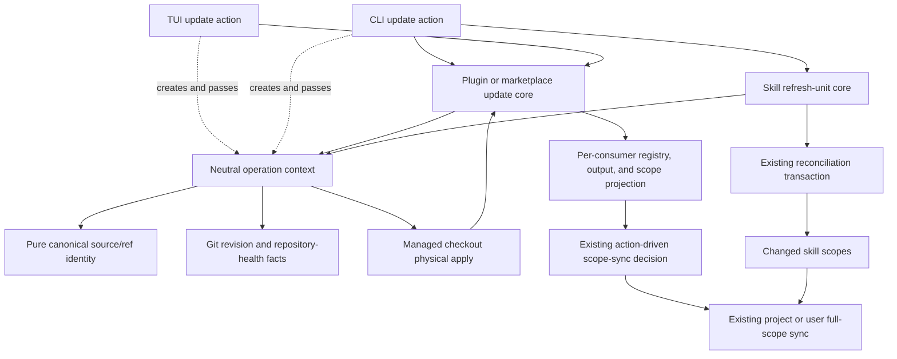
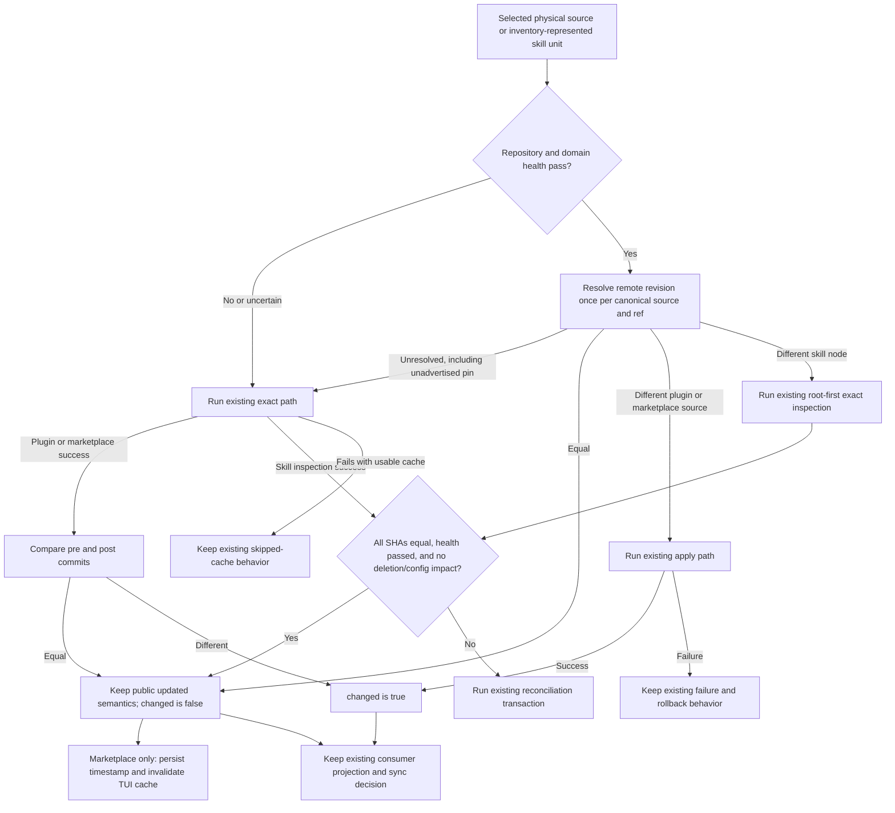
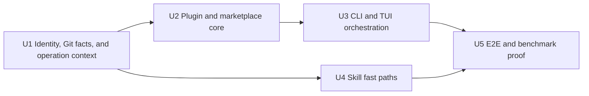

# Plugin and Skill Update No-Op Performance - Plan

## Goal Capsule

- **Objective:** Repeated plugin, marketplace, and skill updates complete materially faster without changing established success reporting or weakening deletion, rollback, ownership, and offline guarantees.
- **Means:** Add canonical source identity, non-mutating remote revision checks, strict managed-checkout health gates, operation-scoped deduplication, and internal change facts that avoid unnecessary mutation without changing public update labels or existing scope synchronization (KTD1-KTD10).
- **Authority:** Session-settled compatibility decisions and this Product Contract override conflicting recommendations in the origin research note. Product Requirements override implementation detail; KTDs govern implementation mechanism.
- **Execution profile:** Code change across shared Git helpers, plugin and marketplace update cores, skill update orchestration, CLI/TUI callers, tests, and a deterministic benchmark.
- **Stop conditions:** Stop and escalate before adding a new public status, removing or renaming a JSON field, changing successful exit behavior, narrowing named-selection deployment effects, or broadening the delivery into deferred work.
- **Tail ownership:** Implementation owns focused tests, deterministic runtime evidence, user-facing compatibility checks, cleanup of discarded approaches, and the repository's normal build/typecheck/lint gates.

---

## Product Contract

### Summary

Optimize the common unchanged-source path while preserving existing command output and behavior. Remote work is deduplicated by physical source and ref, but each managed checkout remains its own apply and ownership boundary. Scope synchronization retains its existing action-driven eligibility.

### Problem Frame

Current plugin and marketplace updates pull managed checkouts before they know whether a remote revision changed. Successful checks are treated as updates, failed checks against usable caches are treated as skipped success, marketplaces rewrite registries, and plugin CLI sync can run for every requested scope after one changed result.

Skill updates already group installations by physical checkout graph and protect deletion, cancellation, rollback, and offline sync. They still clone and discover every selected source, then reconcile, advance, commit, and sync even when inspected revisions match the installed revisions.

The origin research proposed new public outcomes and zero-write marketplace no-ops. The user chose compatibility instead: successful checks continue to report `updated`, marketplace timestamps continue to record successful checks, scope synchronization retains its existing action-driven behavior, and existing failure/exit behavior remains. This plan removes expensive Git and reconciliation work behind those stable interfaces.

### Key Decisions

- **Core performance delivery:** Implement remote revision gating, deduplicated checks, and internal change tracking without changing current scope-sync eligibility. (session-settled: user-directed — chosen over changed-scope gating and a durable pending-sync marker: preserving retry semantics avoids adding cross-invocation state to a performance change.) Governs R1-R13.
- **Preserve successful update reporting:** A verified unchanged source still reports the existing `updated` action/status, and a marketplace still advances its successful-check timestamp. (session-settled: user-directed — chosen over a new `up-to-date` outcome: compatibility is more important than distinguishing content changes in the public contract.) Governs R5-R8 and R13.
- **Fallback before degraded cached success:** An unavailable or ambiguous cheap check falls back to the existing exact update or inspection path. (session-settled: user-directed — chosen over immediately failing the command: the check is an optimization and must not become a new availability dependency.) Governs R3, R7, and R10.
- **Gate exact Git work; report timing:** Permanent E2E and the manually dispatched benchmark gate exact no-op Git operations plus normalized public output and filesystem compatibility. All 0 ms, 50 ms, and 200 ms timing ratios remain report-only because measured fresh-process startup dominates the eliminated local Git work. (session-settled: user-directed — chosen over retaining an unattainable wall-clock ratio or amplifying an artificial workload.) Governs R12.

### Requirements

**Remote work and mutation**

- R1. A plugin or marketplace operation checks each canonical remote source and requested ref at most once per CLI invocation or TUI action before deciding whether a managed checkout needs a pull.
- R2. A skill refresh unit bypasses temporary clone, discovery, reconciliation, checkout advancement, and commit only when every connected node is remotely equal and its managed checkout is healthy; existing action-driven scope sync remains unchanged.
- R3. An ambiguous or failed cheap revision check falls back to the existing exact pull or temporary-inspection path; inability to optimize must never be interpreted as equality.
- R4. One remote check may feed several consumers and scopes, but each distinct managed checkout produces its own apply result and ownership-preserving domain projection.

**Compatibility and output**

- R5. Existing human labels, JSON field names, action/status values, aggregate meanings, and successful exit behavior remain unchanged.
- R6. A successful unchanged check continues to report `updated`; a remote marketplace continues to update `lastUpdated` and its owning registry after that successful check.
- R7. When the cheap check and fallback both fail but the existing cache remains usable, preserve the current non-fatal skipped-cache behavior and do not sync that consumer.
- R8. Preserve existing action-driven scope-sync eligibility, including later-invocation retry behavior after a prior sync failure. Internal content-change facts remain private physical results and do not alter public labels or synchronization decisions.

**Safety and coverage**

- R9. Preserve skill deletion preflight, interactive and non-interactive retention, cancellation-before-mutation, rollback order, out-of-scope shared-cache blocking, exact inspected revision advancement, and offline sync.
- R10. A fast path requires a valid managed Git checkout with the canonical expected origin/ref, expected HEAD, clean tracked and untracked state, and all domain-owned readable roots represented by the current inventory. Uncertain health selects the existing exact behavior without introducing repair, reset, or failure semantics.
- R11. Apply the optimization consistently to direct plugin update, direct marketplace update, embedded marketplace plugin update, CLI project/user/all scopes, TUI single/update-all/status entry points, and skill update; non-update install and resolution callers retain their legacy path when no operation context is supplied.
- R12. Prove exact operation counts with controlled local bare remotes and permanent built-CLI E2E coverage. Provide a manually dispatched benchmark with pinned baseline/candidate builds, at least 100 timed samples per scenario/profile, raw samples, and 0 ms, 50 ms, and 200 ms controlled Git-command cost profiles; gate exact candidate Git work plus normalized output/filesystem compatibility and report every timing ratio without pass/fail.
- R13. After any successful marketplace registry write, invalidate the long-lived TUI cache even when content is unchanged.

### Success Criteria

- An unchanged cached direct plugin performs one remote revision check and no pull or clone while retaining its current public `updated` result and existing action-driven sync behavior.
- An unchanged remote marketplace performs one remote revision check and no checkout/pull; it still writes the successful-check timestamp to the owning registry.
- An all-equal healthy skill unit performs one check per physical node and no temporary clone, discovery, reconciliation, checkout advance, or commit while retaining its current public result and action-driven sync behavior.
- A changed plugin, marketplace, or skill source follows the existing apply, deletion, rollback, and full-scope sync behavior.
- Public human and JSON output remains schema-compatible; internal change facts never leak into serialized output unless the user approves that contract separately.
- The manually dispatched benchmark uses at least 100 post-warmup samples per scenario/profile, gates one remote check with no clone/pull/fetch/checkout/reset plus normalized output/filesystem compatibility, and reports 0 ms, 50 ms, and 200 ms timing ratios without timing-based pass/fail.

### Acceptance Examples

- AE1. **Direct plugin already current.** Given a healthy cached plugin at the advertised commit, when update runs, then one remote check occurs, no pull occurs, output remains `updated`, and existing action-driven scope sync remains unchanged. Covers R1, R5, R6, R8, R10.
- AE2. **Embedded marketplace shared across consumers.** Given several selected plugins backed by the same marketplace source, when update runs, then the source is checked once, each managed checkout is evaluated once, timestamps retain current semantics, the TUI cache is invalidated after the registry write, and existing action-driven scope sync remains unchanged. Covers R1, R4, R6, R8, R13.
- AE3. **Skill graph already current.** Given a healthy multi-node skill graph whose advertised commits equal every current commit, when update runs, then the whole connected unit skips exact inspection and mutation. Covers R2, R9, R10.
- AE4. **Remote check is ambiguous.** Given a ref that the cheap resolver cannot classify, when update runs, then the existing exact path determines the outcome and public behavior remains unchanged. Covers R3, R5.
- AE5. **All checks fail with a usable cache.** Given an inaccessible remote and a usable managed cache, when both the cheap check and compatibility fallback fail, then the consumer keeps the current non-fatal skipped-cache behavior and does not sync. Covers R7, R8.
- AE6. **One scope changes.** Given project and user consumers in one operation and only a user checkout changes, when updates finish, then each successful `updated` scope retains its existing sync behavior; this delivery does not add changed-only gating. Covers R4, R8.
- AE7. **Dirty equal-revision cache.** Given matching commits but tracked or untracked local changes, when update runs, then neither equality gate fires and the established exact path—not a new repair or reset branch—determines the result. Covers R3, R10.
- AE8. **Named embedded plugin update.** Given a named plugin backed by a marketplace root, when that root changes, then current source-wide/full-scope deployment semantics remain unchanged. Covers R5, R8.

### Scope Boundaries

#### Deferred to Follow-Up Work

- Exact changed-skill subset attribution and per-skill content fingerprints.
- New public outcomes, renamed totals, or a replacement human/JSON result model.
- External marketplace manifest/source-graph transactions and repository-authority transitions.
- `--check`, `--force`, or new repair workflows.
- Filtered per-plugin sync for named embedded marketplace updates.
- Missing marketplace recreation and changes to direct-plugin missing-cache recovery behavior.
- Bounded concurrency, background jobs, auto-update scheduling, and persisted lifecycle state.

#### Outside This Delivery

- New agent, MCP, or TUI skill-update capabilities.
- Changes to installation, uninstall, workspace sync, or plugin staging behavior except where existing update callers consume the shared Git helpers.

### Origin Reconciliation

The origin research remains the evidence source. This Product Contract supersedes its proposed `up-to-date` public outcome, exhaustive result-model redesign, no-timestamp marketplace no-op, and check/repair mode requirements. Its deletion, rollback, source-identity, cross-scope ownership, and benchmark findings remain authoritative inputs.

---

## Planning Contract

### Key Technical Decisions

- KTD1. **Own canonical source identity in a pure leaf module.** Add `src/utils/git-source.ts` with no core/domain imports. It normalizes remote identity and refs for `src/core/git.ts`, `src/utils/plugin-path.ts`, marketplace, plugin, and skill callers, eliminating the existing duplicate normalizers without creating a `git.ts` ↔ `plugin-path.ts` cycle. Governs R1, R4, R10.
- KTD2. **Put remote revision resolution and repository health in the Git module.** `src/core/git.ts` resolves default HEAD, branches, lightweight tags, and peeled annotated tags with the existing non-interactive environment. An immutable commit pin is considered resolved only when advertised; otherwise it is explicitly unresolved and falls back. Repository health covers Git facts—identity, origin/ref, HEAD, and tracked/untracked cleanliness—while each domain validates its own required roots. Governs R1-R3, R10.
- KTD3. **Separate internal change facts from public update labels.** Production update results carry an internal `changed` fact for physical aggregation and testing, while serializers and human formatters continue to emit the existing fields and values. The fact does not change current scope-sync eligibility. (session-settled: user-directed — chosen over adding `up-to-date` to existing enums or changed-only sync: strict consumers and retry behavior retain their current contract.) Governs R5-R8.
- KTD4. **Use one opt-in operation context per update action.** Add `src/core/update-context.ts`, a neutral module owned by no updater domain. A CLI invocation or TUI action passes one context to update entry points; install and resolution callers that omit it retain legacy behavior. The context stores promises so concurrent consumers coalesce, bypasses the process-global plugin fetch cache for update actions, and is discarded after the action. Governs R1, R4, R11.
- KTD5. **Key physical effects by full checkout identity.** Remote facts are keyed by canonical source/ref. Apply facts are keyed by managed path plus canonical expected remote plus normalized ref; conflicting identities for one path never reuse an apply result. The context caches only immutable physical outcomes—pre/post commit, health, and changed—not public/domain results, registry writes, output, or sync eligibility. Each consumer independently projects and persists its result. Governs R1, R4, R6, R8.
- KTD6. **Use fallback-first compatibility.** Unresolved cheap checks invoke the current exact path. If that path succeeds, pre/post commits determine the internal change fact; if it fails with a usable cache, existing non-fatal behavior remains. (session-settled: user-directed — chosen over making the optimization check a new command failure: update availability must not regress.) Governs R3, R7.
- KTD7. **Treat a skill graph as all-equal or exact-inspect.** Every inventory-represented node in a connected refresh unit must be equal, repository-healthy, and domain-root-healthy before clone/discovery is skipped. Any changed, dirty, missing-from-health, or unresolved represented node sends the entire unit through existing root-first inspection. Existing inventory failures remain unchanged. Governs R2, R9, R10.
- KTD8. **Gate post-inspection bypass on safety, not SHA alone.** Reconciliation may be skipped only when every inspected SHA equals its current SHA, every managed checkout passed the non-mutating health evaluation, and deletion/removal/configuration impact is empty. Approved deletion, dirty equal-SHA state, or any uncertain safety fact continues through the existing transaction. Governs R2, R9, R10.
- KTD9. **Preserve marketplace timestamp and TUI cache semantics.** Successful remote verification advances `lastUpdated` and saves only the owning registry even when content is unchanged. After that write, invalidate the TUI cache. Governs R6, R13.
- KTD10. **Retain current changed-source apply behavior behind a narrow physical result.** Plugin/marketplace Git apply returns pre/post commit and `changed`; domain modules retain timestamp, external-plugin aggregation, ownership, public result, and scope-sync decisions. Skill exact-SHA apply remains in its transaction. Do not add staged source replacement, external graph rollback, or durable pending-sync state. Deterministic tests count operations; a separate manual benchmark measures runtime. Governs R4, R5, R8, R9, R12.

### High-Level Technical Design

#### Module topology

#### Update decision flow

### Sequencing

### System-Wide Impact

- **CLI and agents:** Human output, `--json`, exit codes, and structured-help schemas stay stable. Automation still sees successful no-op checks as existing update outcomes.
- **Filesystem state:** Direct plugin and skill no-ops avoid persistent checkout work while retaining existing scope synchronization. Marketplace no-ops retain the registry timestamp write required by compatibility.
- **Dependency direction:** CLI/TUI callers create a neutral context and pass it into domain updaters; domain updaters consume context/Git/identity helpers. The leaf identity helper and Git module never import plugin, marketplace, skill, or CLI/TUI modules.
- **Scope ownership:** Remote and physical checkout facts can be shared, but each consumer independently derives public output and writes only its owning registry. External-plugin `changed` is the OR of successful marketplace and external-checkout physical changes without changing current public precedence or sync eligibility.
- **TUI lifecycle:** Each single, update-all, and status-triggered action gets a fresh operation context, bypasses stale process-global fetch entries, invalidates its data cache after any marketplace registry write, and releases context maps at action completion.
- **Performance:** Unchanged sources save pull/clone/reconciliation work. Repository/domain health is evaluated once per checkout/action, not once per consumer. Controlled latency profiles expose negotiation cost without treating local delay injection as network fidelity.
### Risks and Mitigations

- **Strict health checks reduce fast-path hits.** Dirty, corrupt, or ambiguous caches use the established path instead of receiving new repair behavior. Domain roots remain domain-owned so the shared Git helper does not encode plugin/skill policy.
- **Remote resolution differs across hosts and refs.** Centralize parsing in KTD2 and cover default HEAD, branch, lightweight tag, peeled annotated tag, pin, collision, auth, and malformed output cases. Unadvertised pins never count as equality.
- **One remote can back several managed paths.** Share remote resolution only by source/ref; key physical apply by path plus expected source/ref. A key conflict cannot fabricate success or leak one consumer's persistence into another.
- **Long-lived caches can become stale.** Update operations bypass the process-global plugin fetch cache, contexts are action-scoped, and a sequential-action test advances the remote between actions.
- **A registry-only no-op still changes TUI-visible data.** Invalidate TUI cache after the write even though `changed` is false.
- **Public `updated` no longer implies content changed.** That is existing semantics and a user-directed compatibility decision. Keep existing action-driven scope sync rather than introducing brittle cross-invocation pending-sync state in this delivery.
- **Fresh-process startup dominates local no-op timing.** Keep the long-running benchmark under manual dispatch. Gate deterministic Git work and normalized compatibility; report all timing ratios as evidence without gaming the workload to meet an arbitrary wall-clock threshold.
- **Health scanning can replace one bottleneck with another.** Memoize one repository/domain health result per checkout/action and include fanout/scaling metadata so work grows with physical checkouts, not consumer count.
- **Git-module mock shape can break indirectly.** Keep fact logic behind an unmocked injected seam, preserve the `src/core/git.ts` facade, and ensure full-module mocks expose imports required by their consumers.
- **Origin research and this plan intentionally differ.** Executors must follow this Product Contract's compatibility decisions rather than reintroducing the deferred result redesign.
### Sources and Research

- `docs/plans/2026-09-16-plugin-skill-update-performance-research.md` — baseline behavior, comparator evidence, source-graph findings, and original benchmark hypotheses.
- `src/core/git.ts` — existing non-interactive Git environment and `listRemote` precedent.
- `src/core/plugin.ts` — fetch promise cache, plugin update mapping, and direct/embedded/external update branches.
- `src/core/marketplace.ts` — registry ownership, branch detection, pull, timestamp, and save behavior.
- `src/core/skill-update.ts` and `src/cli/skill-update.ts` — physical refresh units, exact inspection, transaction, rollback, and offline sync.
- `src/cli/commands/plugin.ts` and `src/cli/tui/actions/plugins.ts` — CLI/TUI consumer deduplication and existing action-driven sync behavior.
- No institutional solution corpus exists under `docs/solutions/`; this plan relies on current code, repository guidance, and the origin research.

---

## Implementation Units

### U1. Canonical Git identity, revision facts, and operation context

- **Goal:** Provide dependency-safe identity, one reusable non-mutating Git decision seam, and action-scoped promise coalescing without caching domain behavior.
- **Requirements:** R1-R4, R10-R12.
- **Dependencies:** None.
- **Files:**
  - Create `src/utils/git-source.ts`.
  - Modify `src/utils/plugin-path.ts`.
  - Modify `src/core/git.ts`.
  - Create `src/core/update-context.ts`.
  - Create `tests/unit/utils/git-source.test.ts`.
  - Modify `tests/unit/utils/plugin-path.test.ts`.
  - Modify `tests/unit/core/git.test.ts`.
  - Create `tests/unit/core/update-context.test.ts`.
- **Approach:**
  1. Move canonical remote/ref normalization into the pure KTD1 leaf and migrate plugin-path, marketplace, and skill normalizers to it; do not create a reverse dependency from the leaf into core code.
  2. Extend the Git module with KTD2 revision and repository-health facts using the existing `createGitEnv` timeout/error classification. Return equal/different/unresolved data, never guessed equality.
  3. Treat arbitrary or unadvertised commit pins as unresolved so the exact existing path proves reachability and behavior.
  4. Add the opt-in KTD4 context with promise-valued remote, health, and apply entries. Remote keys use canonical source/ref; apply keys use path plus expected source/ref and reject reuse on a conflict.
  5. Cache immutable physical results only. Callers remain responsible for domain roots, registry persistence, public results, and domain projection.
- **Patterns to follow:** `createGit`, `createGitEnv`, and error classification behind the `src/core/git.ts` facade; promise coalescing in `fetchCache`; existing plugin-path canonicalization; dependency injection and observable result assertions in `tests/unit/core/git.test.ts`.
- **Test scenarios:**
  - Canonically equivalent SSH/HTTPS/trailing-`.git` sources and normalized refs share identity; distinct hosts, owners, repos, or refs do not.
  - Default HEAD resolves its symbolic branch and advertised commit.
  - Explicit branch and lightweight tag resolve their direct commits; annotated tag resolves its peeled commit.
  - Branch/tag collision, malformed advertisement, or unadvertised immutable pin returns unresolved instead of guessing.
  - Authentication and transport failures preserve classified failure details for fallback.
  - Repository health passes only with expected canonical origin/ref/HEAD and clean tracked and untracked state; dirty, wrong-origin, missing-Git, or wrong-HEAD state fails without mutation.
  - Concurrent consumers share one remote/health promise, while distinct managed paths receive distinct applies.
  - The same managed path with conflicting expected source/ref does not reuse an apply result.
  - Context disposal releases its maps; a second context performs fresh checks.
- **Verification:** Callers can distinguish equal, different, and unresolved state through one interface; dependency direction is acyclic; context work scales with physical identities rather than consumer count.
### U2. Plugin and marketplace internal change detection

- **Goal:** Avoid plugin and marketplace pulls when managed checkout content is already current while preserving public results, timestamps, and registry ownership.
- **Requirements:** R1, R3-R8, R10-R11, R13.
- **Dependencies:** U1.
- **Files:**
  - Modify `src/core/plugin.ts`.
  - Modify `src/core/marketplace.ts`.
  - Modify `tests/unit/core/plugin.test.ts`.
  - Modify `tests/unit/core/marketplace-update.test.ts`.
  - Modify `src/core/__tests__/plugin-seed-cache.test.ts` only if the internal fetch result gains an optional change fact.
  - Update Git mocks in `tests/unit/core/marketplace-add-branch.test.ts`, `tests/unit/core/marketplace-auto-update.test.ts`, `tests/unit/core/marketplace-branch-separation.test.ts`, `tests/unit/core/marketplace-dedup.test.ts`, `tests/unit/core/marketplace-refresh.test.ts`, `tests/unit/core/marketplace-scope.test.ts`, and `tests/unit/core/native/native-marketplace-registration.test.ts`.
- **Approach:**
  1. Accept the optional operation context only in update entry points. When present, bypass the process-global `fetchCache`; callers without it keep the current install/resolve behavior.
  2. Use the context's remote and checkout facts, but independently derive each plugin/marketplace consumer's result and registry write.
  3. For a healthy equal checkout, skip pull/checkout; preserve `updated`, success, marketplace timestamp, owning-registry save, and internal `changed: false`.
  4. For unresolved checks, use KTD6 fallback and derive changed from pre/post commits after success.
  5. For external plugins, define internal `changed` as the OR of successful marketplace-root and external-checkout changes while retaining current public success/error precedence.
  6. Preserve current local, offline, missing-cache, missing-directory, unsafe-registration, and failed-usable-cache behavior.
- **Execution note:** Add characterization coverage for current public actions, timestamp writes, missing-cache handling, external result precedence, and failed-cache fallback before changing branch structure.
- **Patterns to follow:** Promise coalescing in `fetchCache`; registry ownership and blocked-save handling in `updateMarketplace`; marketplace dependency injection in plugin tests; result-derived counts rather than mutable counters.
- **Test scenarios:**
  - Covers AE1. Healthy equal direct plugin performs one remote check, no pull, and returns existing `updated` semantics with internal change false.
  - Changed direct plugin performs one check and existing pull/apply, returns existing `updated` semantics, and marks change true.
  - Two consumers sharing a source/ref receive one remote result; distinct paths apply independently; path/identity conflict never reuses apply.
  - Unresolved precheck falls back; equal and changed fallback commits derive the correct internal change fact.
  - Failed fallback with usable direct cache retains current non-fatal skipped behavior and change false.
  - Covers AE2. Equal remote marketplace skips checkout/pull, advances `lastUpdated`, saves only its owning registry, and reports change false.
  - Changed marketplace pulls once, advances timestamp, and reports change true.
  - External-plugin mixed cases OR marketplace/external physical changes while preserving current public error/success precedence.
  - Local marketplace, missing directory, unsafe registration, external failure, and missing direct cache preserve existing behavior.
  - Seeded fetch results remain reusable outside update actions without claiming a content change; update actions do not reuse stale global fetch entries.
  - Every affected full-module Git mock exposes the new dependency shape and retains its existing test behavior.
- **Verification:** Core update callers receive stable public fields plus a reliable internal change fact; equal remote content never triggers pull/checkout, and no physical cache entry owns consumer persistence.
### U3. Operation-scoped plugin orchestration

- **Goal:** Share authoritative source checks across CLI/TUI consumers, keep long-lived TUI state fresh, and preserve existing action-driven scope-sync behavior.
- **Requirements:** R1, R4-R8, R11, R13.
- **Dependencies:** U2.
- **Files:**
  - Modify `src/cli/commands/plugin.ts`.
  - Modify `src/cli/tui/actions/plugins.ts`.
  - Modify `src/cli/skill-update.ts`.
  - Modify `tests/e2e/plugin-update.test.ts`.
  - Modify `tests/unit/cli/tui-plugin-update.test.ts`.
  - Modify `tests/unit/core/plugin.test.ts` when orchestration dependencies are exercised there.
- **Approach:**
  1. Create one KTD4 context per CLI invocation and per TUI single/update-all/status action; share it across project, user, plugin, marketplace, and standalone-skill adapters and dispose it at action completion.
  2. Replace per-scope synthetic marketplace success with each consumer's projection of the shared physical result.
  3. Preserve action-driven project/user sync decisions, including no-op `updated` results and later-invocation retry behavior.
  4. Invalidate the TUI data cache after any successful marketplace registry write.
  5. Preserve human labels, totals, exit behavior, named-selection effects, and JSON fields. Explicitly map internal fields out of direct marketplace and plugin JSON results.
- **Patterns to follow:** TUI's separate project/user sync booleans and cache invalidation hook; explicit JSON mapping in `pluginUpdateCmd`; the production skill-node precheck used by CLI skill update.
- **Test scenarios:**
  - Covers AE2. Duplicate embedded marketplace consumers share one remote check and do not receive fabricated success.
  - Covers AE6. Project and user consumers retain their existing action-driven sync behavior under `--scope all`.
  - Equal plugin/marketplace checks retain existing `updated` output, totals, and scope sync.
  - A marketplace no-op persists its timestamp and invalidates TUI cache.
  - Direct marketplace and plugin JSON exclude internal context/change fields and preserve current schema, actions, counts, success, and errors.
  - TUI single-plugin, update-all, status-routed, and direct-marketplace paths use one fresh context per action.
  - A sequential TUI test advances the remote between actions; the second action performs a fresh check and applies the change.
  - Sync failure preserves the existing source result and command exit behavior.
  - Covers AE8. Named embedded update retains current source-wide/full-scope deployment behavior.
- **Verification:** Every CLI/TUI entry point uses a fresh operation context, shares checks only inside that action, refreshes written registry state, and preserves current public and synchronization contracts.
### U4. Skill pre-inspection and post-inspection equality gates

- **Goal:** Remove clone/discovery and transaction work from unchanged skill refresh units without weakening current safety transitions.
- **Requirements:** R2-R5, R8-R11.
- **Dependencies:** U1.
- **Files:**
  - Modify `src/core/skill-update.ts`.
  - Modify `src/cli/skill-update.ts`.
  - Modify `tests/unit/core/skill-update.test.ts`.
  - Modify `tests/unit/cli/skill-update-command.test.ts`.
  - Modify `tests/unit/cli/skill-update-reconciliation.test.ts` only for regression coverage of bypass conditions.
- **Approach:**
  1. Use the canonical identity helper and operation context for every inventory-represented node in a physical refresh unit before creating temporary checkouts.
  2. Evaluate repository health once per checkout and domain-root health once per node. Short-circuit preflight only for all-equal/all-healthy units per KTD7; otherwise run current marketplace-root-first exact inspection unchanged.
  3. Carry the preflight health fact into post-inspection planning. Bypass reconciliation only when every `CheckoutNode.currentSha` equals its inspected SHA, all managed checkouts passed health, and deletion/removal/configuration impact is empty per KTD8.
  4. Preserve current inventory-time missing/unreadable behavior; do not claim fallback for states that never produce a refresh node.
  5. Preserve cancellation, retained deletion, failed/local/out-of-scope, rollback, ordering, and offline sync branches around the gates.
- **Execution note:** Add failing operation-count and safety tests at both gates before moving the transaction boundary.
- **Patterns to follow:** `buildPhysicalRefreshUnits`, root-first `inspectSkillUpdateUnit`, `revisionByNode`, reverse checkout restoration, and `scopesToSync` in the existing skill pipeline.
- **Test scenarios:**
  - Covers AE3. All represented nodes remotely equal and healthy skip clone/discovery and every checkout/configuration mutation dependency while retaining selected-scope sync.
  - One changed, dirty, repository-unhealthy, domain-root-unhealthy, or unresolved represented node sends the entire connected unit through exact inspection.
  - Covers AE4. Ambiguous remote resolution and unadvertised pins fall back to current exact inspection.
  - Exact inspection returning equal SHAs skips reconcile, advance, and commit only when preflight health passed and no deletion/configuration impact exists; selected scopes retain their existing offline sync behavior.
  - Dirty equal-SHA post-inspection state continues through the established transaction.
  - Equal SHAs plus an approved upstream deletion still reconcile and commit that deletion.
  - Changed revision still reconciles before checkout advancement, commits, and syncs each changed selected scope once offline.
  - Upstream deletion still prompts interactively, retains under non-interactive/`--yes`, cancels globally before mutation, and removes only after approval.
  - Out-of-scope shared consumers still block mutation.
  - Apply failure still rolls back configuration before reversing checkout changes and never queues sync.
  - Existing inventory behavior for missing or unreadable checkouts remains characterized and unchanged.
- **Verification:** Unchanged safe units bypass both expensive stages while dirty/deletion/configuration states retain current exact transaction behavior and public skill output.
### U5. Deterministic end-to-end and benchmark proof

- **Goal:** Prove compatibility, operation scaling, and performance across real built CLI processes and controlled Git latency.
- **Requirements:** R1-R13.
- **Dependencies:** U3, U4.
- **Files:**
  - Modify `tests/e2e/plugin-update.test.ts`.
  - Modify `tests/e2e/skill-update.test.ts`.
  - Create `scripts/benchmark-update-noop.ts`.
  - Modify `package.json` to expose the benchmark command.
- **Approach:**
  1. Make plugin E2E invoke `dist/index.js`, matching skill E2E, and extend local-bare-remote fixtures so operation counts and filesystem outcomes are deterministic.
  2. Make the benchmark accept already-built baseline and candidate CLI paths plus optional explicit commit IDs. Record Bun, Git, OS, build mode, source graph, warmup, percentile algorithm, failure/outlier policy, and raw samples.
  3. Run at least 100 timed post-warmup samples per scenario/profile in fresh CLI processes. Re-arm each fixture outside the timed interval.
  4. Report representative plugin-marketplace and skill no-op fanout scenarios with explicit physical-source, checkout, consumer, and scope metadata.
  5. Run 0 ms, 50 ms, and 200 ms controlled Git-command delay profiles. Gate exact candidate no-op Git operations and normalized public output/filesystem compatibility at every profile; report all runtime ratios without timing-based failure.
  6. Keep the long-running benchmark under manual dispatch outside the unit/CI test suite; keep exact operation-count and compatibility assertions in permanent E2E coverage.
- **Patterns to follow:** Existing E2E temporary workspace setup, local Git identity scoped to fixtures, built CLI invocation, filesystem outcome assertions, and raw-data-first benchmark reporting.
- **Test scenarios:**
  - Marketplace no-op fanout retains human/JSON results and timestamp semantics, performs one source check, and performs no pull.
  - Skill precheck no-op avoids temporary checkout/discovery; fallback equal inspection avoids persistent mutation only under the KTD8 safety predicate.
  - Existing changed plugin, marketplace, and skill fixtures retain output, deletion, rollback, and scope-sync behavior.
  - Remote failure with a usable cache retains current non-fatal output/exit behavior.
  - Public JSON fixtures contain no new fields or enum values.
  - No-op scenarios meet exact Git-work and normalized compatibility gates; 0 ms, 50 ms, and 200 ms runtime ratios remain raw report-only evidence.
- **Verification:** Built baseline and candidate CLIs produce compatible observable results, exact candidate no-op Git work, deterministic operation counts, and raw reproducible timing samples for representative scenarios.
## Verification Contract

| Gate | Command or evidence | Proves |
|---|---|---|
| Identity and operation context | `bun test tests/unit/utils/git-source.test.ts tests/unit/utils/plugin-path.test.ts tests/unit/core/update-context.test.ts` | Canonical keys, acyclic ownership, conflict handling, promise coalescing, and action lifetime are correct. |
| Shared Git helpers | `bun test tests/unit/core/git.test.ts` | Ref resolution, unadvertised-pin fallback, and repository health are correct and non-mutating. |
| Plugin and marketplace core | `bun test tests/unit/core/plugin.test.ts src/core/__tests__/plugin-seed-cache.test.ts tests/unit/core/marketplace-update.test.ts tests/unit/core/marketplace-*.test.ts tests/unit/core/native/native-marketplace-registration.test.ts` | Internal change facts, fallback, deduplication, external aggregation, timestamps, legacy callers, and mock compatibility. |
| Plugin CLI/TUI | `bun test tests/unit/cli/tui-plugin-update.test.ts tests/e2e/plugin-update.test.ts` | Single/update-all/status/direct-marketplace action lifetime, TUI invalidation, public serialization, and preserved action-driven sync behavior. |
| Skill core/adapters | `bun test tests/unit/core/skill-update.test.ts tests/unit/cli/skill-update-command.test.ts tests/unit/cli/skill-update-reconciliation.test.ts` | Both equality gates preserve health, deletion, rollback, and offline sync. |
| Build | `bun run build` | Production CLI bundles successfully before E2E invocation. |
| End-to-end | `bun test tests/e2e/plugin-update.test.ts tests/e2e/skill-update.test.ts` | Built command behavior, JSON compatibility, filesystem results, scopes, and local Git integration. |
| Types | `bun run typecheck` | Internal result/context additions and every caller migrate cleanly. |
| Lint | `bun run lint` | Repository style and static checks pass. |
| Runtime evidence | Manually dispatch `bun run bench:update -- --baseline <built-cli> --candidate <built-cli>` | At least 100 samples per scenario/profile, raw samples, source/consumer metadata, exact candidate Git-work and normalized compatibility gates, and report-only timing ratios. |
| Manual E2E | Run the built `plugin update --scope all` and `skill update --scope all --yes` commands in a temporary workspace with local bare remotes. | Human output, timestamps, no-op work elimination, existing action-driven sync behavior, and non-interactive deletion retention match the contract. |

Implementation starts from a fresh worktree based on the then-current `origin/main`. Record baseline and candidate commits and use the same machine, fixture, process model, build mode, source graph, warmup, percentile algorithm, and failure policy. Local bare-remotes prove deterministic process/filesystem work; injected latency profiles make the added remote negotiation visible rather than claiming internet RTT fidelity.

---

## Definition of Done

### Global

- R1-R13 and AE1-AE8 are satisfied without adding a public status, changing JSON field names, changing existing action/status values, or changing successful exit semantics.
- Every production update caller identified in R11 uses the canonical identity and opt-in operation-context modules; non-update callers retain legacy behavior, and no CLI/TUI call site fabricates duplicate success.
- Equal plugin and skill paths skip the intended expensive work; marketplace equality retains only the user-directed timestamp/registry write and required TUI cache invalidation.
- Physical outcomes are cached only by complete identity and never own consumer output, registry persistence, or sync projection.
- Changed, dirty, ambiguous, local, offline, missing-cache, deletion, cancellation, out-of-scope, rollback, and sync-failure paths preserve their documented behavior.
- Focused unit tests, E2E tests, build, typecheck, lint, benchmark, and manual built-CLI scenarios satisfy the Verification Contract.
- Runtime evidence meets R12 and includes raw samples, pinned baseline/candidate provenance, source/consumer metadata, exact candidate Git-work and normalized compatibility results, and report-only timing ratios.
- No experimental helper, duplicate normalizer/result model, dead branch, compatibility shim outside approved internal fields, stale operation cache, or throwaway fixture remains.
- Any unavoidable additional observable compatibility change is escalated to the user and incorporated into this Product Contract before implementation continues.

### Per Unit

- **U1:** One pure identity module, one tested Git fact interface, and one neutral action context own reusable physical facts without domain imports.
- **U2:** Plugin/marketplace cores avoid equal-source pulls and expose reliable internal change facts without serialized or persistence contract drift.
- **U3:** CLI/TUI actions share checks within one action, invalidate written TUI state, and preserve existing action-driven scope sync and public output.
- **U4:** Skill units bypass both unchanged stages only under the complete safety predicate and preserve every existing transaction transition.
- **U5:** Built-CLI E2E, deterministic operation counts, and reproducible manually dispatched multi-profile timing evidence prove compatibility and the exact no-op work target.
