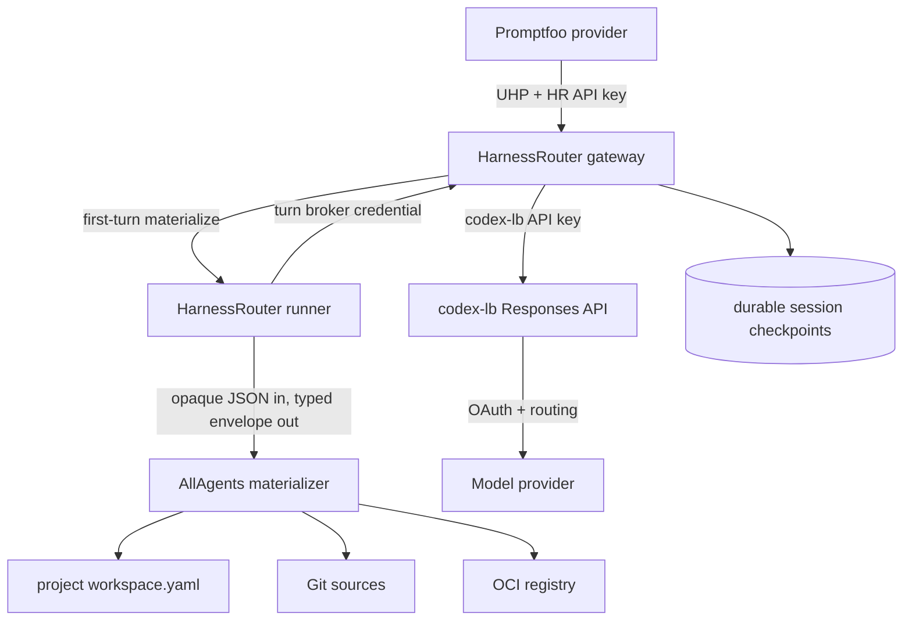

# UHP Coding-Agent Execution through HarnessRouter - Plan

## Goal Capsule

- **Objective:** Let Promptfoo and other authenticated UHP clients run Codex
  against a configured AllAgents Git workspace or immutable OCI workspace
  snapshot, continue the same conversation and writable workspace with
  `previous_response_id`, and receive source provenance, output, usage, and
  artifacts. Pi is optional and advertised only after its `codex-lb` route
  passes a release-gating probe.
- **Means:** Deploy a pinned HarnessRouter CE fork. Preserve HarnessRouter's UHP,
  authentication, session, streaming, cancellation, artifact, and agent-runner
  behavior. Add a generic first-turn materializer boundary, nested working
  directory support, durable materialization state, and nested-repository
  checkpoint/collection support. Implement Git/OCI semantics in a separate
  AllAgents executable. Route Codex through HarnessRouter's credential broker to
  `codex-lb`; keep the long-lived `codex-lb` key in the gateway and provider OAuth
  in `codex-lb`.
- **Authority:** [ADR 0002](../decisions/0002-adopt-uhp-through-harnessrouter.md)
  owns the protocol, fork, trust, workspace, and provider-routing decisions.
  UHP `2026-09-12` and HarnessRouter's conformance suite own execution-wire
  behavior. The project `workspace.yaml` owns logical Git/OCI sources and
  environment-variable credential references; deployment secrets provide the
  values; HarnessRouter configuration owns harness/model/provider targets. The
  namespaced AllAgents extension owns acquisition and provenance semantics.
- **Execution order:** Prove the fork seam, brokered Codex route, materialization
  state machine, checkpoint integration, and optional Pi route against a real
  HarnessRouter runner; freeze the generic hook and AllAgents contracts;
  implement Git then OCI acquisition; run Promptfoo one-shot and continuation
  E2E; complete release, fork-maintenance, and upstream-ready documentation.
- **Stop conditions:** Stop before production implementation if materialization
  cannot complete and durably checkpoint before provider dispatch, if nested Git
  workspaces cannot be collected without corrupting HarnessRouter checkpoints,
  if either source credentials or the long-lived `codex-lb` key reach the agent,
  or if the fork cannot preserve stock UHP behavior and conformance. Do not fall
  back to prompt instructions, an MCP acquisition tool, client-side repository
  upload, owner-trust provider keys, a second execution protocol, or a parallel
  task/session engine.
- **Tail ownership:** Implementation owns focused tests in both repositories,
  upstream UHP conformance, built-image smoke tests, exact Git/OCI E2E,
  two-turn Promptfoo success and failure verification, credential leak checks,
  documentation, and a clean upstreamable HarnessRouter patch series.

---

## Product Contract

### Summary

AllAgents uses HarnessRouter as the execution gateway.
HarnessRouter exposes UHP, authenticates callers, creates and persists sessions,
streams events, runs Codex and capability-gated Pi, handles cancellation and
idempotency, and returns output, usage, and artifacts.

The missing product-specific capability is deterministic workspace acquisition
before the first agent turn. A focused HarnessRouter fork calls a generic
materializer boundary after allocating the session workspace but before provider
selection. The AllAgents executable validates the product-specific descriptor,
writes and validates staging, and returns path-free provenance. The runner
publishes staging, initializes HarnessRouter and nested-repository checkpoints,
persists a pre-agent checkpoint, and only then permits provider dispatch.

A continuation supplies `previous_response_id`, omits the workspace extension,
and uses HarnessRouter's current native conversation and writable session
workspace. A different revision, snapshot, or working directory requires a new
session. AllAgents does not add stricter predecessor-head or branching semantics
beyond HarnessRouter's UHP behavior.

### Problem Frame

HarnessRouter already implements the generic execution concerns. Reimplementing
them in AllAgents would add a second protocol, lifecycle, session store, process
supervisor, artifact model, provider integration, and conformance burden without
differentiating the product.

Stock HarnessRouter does not expose a documented generic pre-turn seam for a
server-side Git/OCI descriptor. It does not copy arbitrary request metadata into
response metadata or forward it to ordinary Codex/Pi runners. Input files are
written before the agent and support nested paths, but client-side expansion
loses exact symlink, mode, Git-history, and OCI layer semantics and makes every
caller responsible for acquisition. The temporary fork closes those seams.

### Actors

- **A1. UHP caller:** Promptfoo or another application holding a HarnessRouter
  API key. It chooses a configured HarnessRouter harness ID and model, prompt,
  initial workspace descriptor, and optional continuation predecessor.
- **A2. HarnessRouter gateway:** Authenticates and validates UHP, owns response
  and session identity, treats the configured workspace metadata value as
  bounded opaque JSON, drives materialization before provider fallback, and
  returns hook metadata on every response path.
- **A3. AllAgents materializer:** A non-network executable invoked before the
  first turn. It validates the AllAgents descriptor, reads the mounted project
  workspace configuration, acquires Git or OCI sources into staging, validates
  the tree, and returns provenance.
- **A4. HarnessRouter runner:** Owns the per-session operating-system identity,
  publication, checkpoints, nested-repository collection, input files, safe
  nested cwd, and Codex/Pi process.
- **A5. `codex-lb`:** Exposes the Codex Responses endpoint, accepts the
  gateway-held API key through HarnessRouter's broker, owns provider OAuth and
  account routing, and preserves continuation affinity.
- **A6. Operator:** Pins and deploys the custom image, mounts durable data and
  project workspace configuration, supplies deployment-only source credential
  values through the allowlisted environment, and controls private-network access.

### Key Decisions

- **Use UHP as the northbound contract.** UHP `2026-09-12` is the only
  northbound execution contract. HarnessRouter conformance is authoritative.
- **Fork narrowly and upstream later.** Delivery uses an AllAgents-maintained
  fork. The upstreamable layer is a configured opaque-metadata key, immutable
  first-turn binding, typed command envelope, durable pre-provider lifecycle,
  safe nested cwd, and checkpoint/collection integration. It contains no
  AllAgents Git/OCI schema logic. Upstream acceptance is not critical-path.
- **Run the AllAgents component behind HarnessRouter.** The materializer is a
  subprocess hook, not another HTTP gateway and not a custom agent backend.
- **Materialize once per extension-bearing session.** An extension-bearing
  initial request creates and checkpoints the workspace. Continuations must omit
  the extension and reuse the session through `previous_response_id`.
- **Keep source authority server-side.** Callers select logical source names and
  revisions but cannot send origins, credentials, host paths, commands, or
  Docker options.
- **Broker provider access.** Promptfoo uses a HarnessRouter API key. The gateway
  keeps the `codex-lb` key and mints an invocation-scoped broker credential for
  the agent. Only `codex-lb` handles provider OAuth.
- **Preserve stock UHP requests.** Requests without the configured metadata key
  behave exactly as upstream.
- **Use a custom HarnessRouter image.** The image combines a pinned HarnessRouter
  revision, reviewed patch series, pinned agent runtimes, and the AllAgents
  materializer executable.

### Requirements

#### UHP, authentication, and routing

- **R1.** Pin HarnessRouter CE to a reviewed upstream commit and UHP version
  `2026-09-12`. The deployment must pass the applicable upstream conformance
  suite without weakening, replacing, or reinterpreting stock UHP behavior.
- **R2.** Require a HarnessRouter API key for every execution endpoint. Bind the
  service to loopback or a private interface and document the remaining need for
  Tailscale ACLs, firewall policy, or equivalent network controls.
- **R3.** HarnessRouter deployment configuration owns stable harness IDs and
  their backend, model allowlist, and provider integration. Requests select a
  harness with stock `metadata.harness_id` and a model with `model`; AllAgents
  profiles are not projected into this catalog. Codex uses a custom
  `api_format: "responses"` integration pointed at the `codex-lb`
  `/backend-api/codex` base. Its generated provider block must use
  `name = "openai"` and `requires_openai_auth = true`, including remote
  compaction. Pi is advertised only when a separate real probe proves a
  HarnessRouter-supported Pi custom format against a documented `codex-lb`
  endpoint; otherwise Pi is unavailable without fallback.
- **R4.** Set `HR_SANDBOX_TRUST` to a non-owner broker mode and configure both
  `HARNESS_PUBLIC_BASE_URL` and runner-reachable `HARNESS_GATEWAY_URL` to the same
  private gateway address so stock broker eligibility and runner routing agree.
  The gateway holds the long-lived `codex-lb` key; the runner receives only a
  turn credential and broker URL. Preserve HarnessRouter streaming,
  cancellation, idempotency, files, artifacts, usage, errors, completed-session
  persistence, and per-session workspace/UID isolation. Do not duplicate those
  capabilities in AllAgents.

#### Workspace extension and hook

- **R5.** On an initial response request, accept one optional JSON object of at
  most 64 KiB and 32 levels at `metadata["allagents.workspace"]`.
  HarnessRouter checks only those generic bounds, canonicalizes the opaque value
  with RFC 8785, and binds its digest to the new session. A continuation must
  omit this key. The AllAgents hook validates the exact v1 object
  `{ version: "1", source, workingDirectory? }`; `source` is exactly
  `{ kind: "repositories", revisions?: Record<ConfigName, RevisionText> }` or
  `{ kind: "workspaceSnapshot", snapshot: ConfigName, digest: Digest,
  workspaceManifestDigest: Digest }`; `workingDirectory` is exactly
  `{ kind: "workspaceRoot" }` or
  `{ kind: "repository", repository: ConfigName, path?: RelativeDirectory }`.
- **R6.** The AllAgents hook expands omitted `revisions` to `{}` and omitted
  `workingDirectory` to `{ kind: "workspaceRoot" }`; an omitted repository
  `path` remains absent and an empty path is invalid. It NFC-normalizes strings,
  sorts maps, rejects unknown fields, and hashes RFC 8785 bytes as the effective
  descriptor digest. Project-config default refs affect resolved provenance, not
  this request digest. Accepted/rejected fixtures prove omitted and
  explicit-default forms canonicalize identically.
- **R7.** Add one runner-side `/materialize` operation outside the provider
  candidate loop. It invokes a configured executable directly without a shell
  after fresh-session hydrate and before `/turn`. Pass at most 128 KiB on stdin,
  accept at most 1 MiB on stdout and 64 KiB on stderr, and use the smaller of
  900 seconds or the remaining UHP deadline. The generic request contains the
  opaque metadata value, session workspace and fixed sibling staging roots,
  project configuration root, and deadline. Source secret values arrive only in
  a configured allowlisted child environment; the runner subtracts every name
  in that allowlist from all agent child environments regardless of its spelling.
  The typed result is `completed` with effective relative cwd and bounded public
  metadata or `failed` with stable code, safe message, and retryability. A
  materializer failure terminalizes the UHP response and never enters provider
  fallback.
- **R8.** Persist a CAS-protected session materialization state:
  `unbound -> materializing -> ready` or `failed`. The runner validates successful
  staging, publishes it with a recoverable same-filesystem rename protocol,
  writes a descriptor/provenance marker, initializes the HarnessRouter root
  checkpoint and nested-repository collection baselines, and returns
  `published` with the checkpoint digest. Before provider dispatch, the gateway
  stores that digest and public metadata and CASes the session to `ready`. On
  restart in `materializing`, reconcile to `ready` only when the workspace
  marker and durable checkpoint match the bound descriptor; otherwise mark the
  session non-resumable, remove or quarantine the workspace, and never replay
  acquisition. Provider fallback sees `ready` state only and cannot invoke the
  hook. Ordinary input files are applied only afterward.
  A validated logical cwd may be the root or a symlink-safe descendant; the
  runner derives UID isolation from the session root and rejects cross-session
  or escaping paths.

#### Source acquisition and provenance

- **R9.** Parse the project `workspace.yaml` through its authoritative schema.
  Add strict project-only `workspaceSnapshots` entries:
  `{ name: ConfigName, repository: OciRepository,
  workspaceManifestMediaType: MediaType, executionCredential?: "${ENV_VAR}" }`.
  `OciRepository` is a normalized `registry-host/repository-path` with no scheme,
  tag, digest, userinfo, query, or fragment. Reject unknown fields, literal
  secrets, and duplicate snapshot names; snapshot entries do not merge with user
  configuration. Add the same optional environment-reference field to
  execution-eligible repositories. Secret values remain deployment-only. A
  repository's logical name is explicit `name` or the portable basename of
  normalized `path`. Execution-eligible Git destinations must be unique,
  non-empty, non-root relative child paths so their `.git` directories cannot
  collide with HarnessRouter's root checkpoint repository. Reuse one shared
  source resolver: `source` as a supported HTTPS URL is complete when `repo` is
  absent; otherwise `source` names the supported host/provider and `repo` names
  its repository. Conflicting forms, local/originless entries, duplicate
  repository names, escaping destinations, and unsupported schemes make
  materializer preflight fail. HarnessRouter owns harness/model/provider targets,
  and the user workspace is not a materialization catalog.
- **R10.** Repository mode materializes every execution-eligible declared
  repository. Optional revisions override only matching logical names; otherwise
  use configured `branch`, then the remote symbolic HEAD. `RevisionText` is at
  most 255 ASCII bytes and is either a full 40-hex object ID or a
  `git-check-ref-format`-equivalent ref name. Reject leading dashes, whitespace
  and controls, refspec colons, glob metacharacters, traversal-like components,
  `@{`, and `.lock` components. Resolve a validated full ref, or an unambiguous
  shorthand under `refs/heads/` or `refs/tags/`, with `ls-remote`; accept object
  IDs only when advertised. Subsequent fetch/checkout commands receive only the
  verified object ID with explicit end-of-options handling, never caller text.
  Allow only argument-vector HTTPS Git operations to exact configured hosts, with
  no URL credentials, query, fragment, or redirects. Use an isolated HOME plus
  `GIT_CONFIG_NOSYSTEM=1`, no global config, empty credential helper, disabled
  hooks, `protocol.file.allow=never`, `protocol.ext.allow=never`, and no
  submodule recursion, Git LFS hydration, or configured clean/smudge filters.
  Preserve each repository's `.git` directory for the coding agent. Failure never
  falls through to snapshot mode or another credential identity.
- **R11.** Snapshot mode constructs a server-side immutable OCI reference from
  the selected snapshot's configured repository and caller-provided digest.
  Accept only a direct OCI image manifest with at most 64 distributable
  tar/gzip/zstd layers and the entry's configured workspace-manifest media type;
  redirects may not change registry authority. Verify manifest, config, layer
  size and digest before use; apply OCI whiteouts; limit manifest and config to
  4 MiB each, total compressed layers to 8 GiB, expanded bytes to 32 GiB,
  entries to 500,000, one regular file to 4 GiB, paths to 4096 UTF-8 bytes and
  128 components, and one PAX/extended header to 1 MiB. Reject devices, sockets,
  traversal, escaping links, sparse files, unknown or foreign layers, mutable
  tags, and undeclared output. Validate the final logical repository catalog and
  workspace-manifest digest in staging. Snapshot repository roots need not
  contain `.git`; after publication the runner creates private collection
  baselines from the verified trees so later produced-file reporting remains
  truthful.
- **R12.** Extend HarnessRouter's response translator and stored-response paths
  so streaming events, terminal responses, GET, background completion, and
  idempotent replay return the same bounded
  `response.metadata["allagents.workspace"]`. It contains extension version,
  effective descriptor digest, logical cwd, source mode, completeness, resolved
  commits or OCI manifest/config/layer digests, and workspace-manifest digest.
  It never contains origins, physical paths, credentials, or unverified facts.
- **R13.** The materializer resolves `${ENV_VAR}` references from its allowlisted
  child environment, uses hermetic Git/registry configuration, removes temporary
  auth files before returning, and emits no secret. The fork removes every
  configured materializer-only name from `_child_env` and every other agent
  subprocess environment independent of name patterns. Prove with a deliberately
  innocuous variable name that acquisition secrets and the long-lived
  `codex-lb` key are absent from the agent environment, workspace, nested Git
  remotes/config, generated CLI configuration, logs, checkpoints, and response
  metadata. Provider OAuth remains only in `codex-lb`.
- **R14.** Build one pinned custom HarnessRouter image. Record the upstream
  commit, patch-series digest, AllAgents package/version, materializer-contract
  version, Codex version, optional verified Pi version/format, image digest, and
  supported architecture. Requests without the configured metadata key remain
  stock-compatible. CI rebases selected upgrades and runs upstream plus
  AllAgents integration tests.
- **R15.** AI Evals owns its Promptfoo provider. It sends the UHP request directly
  to HarnessRouter, maps Promptfoo variables to the closed extension, and maps
  terminal output, usage, artifacts, provenance, and failures to
  `ProviderResponse`. Multi-turn cases retain the prior response ID and send it
  as `previous_response_id`. AllAgents documents the contract and examples but
  does not depend on Promptfoo at runtime.

### Key Flows

#### F1. Start the deployment

1. Start `codex-lb` with provider OAuth, proxy API-key authentication enabled,
   and an API key held only by the HarnessRouter gateway. Validate that the
   key/model combination authorizes each configured Codex model.
2. Run the AllAgents materializer's bounded `preflight` mode. It validates the
   project catalog, snapshot and credential-reference schemas, referenced secret
   presence, required Git/OCI tools, hook contract version, and staging/workspace
   filesystem relationship without contacting sources.
3. Start the pinned custom HarnessRouter image with durable `/data`, private
   listener, HarnessRouter client key, broker mode, matching private
   `HARNESS_PUBLIC_BASE_URL` and runner-reachable `HARNESS_GATEWAY_URL`, Codex
   `openai`/OpenAI-auth provider fields, materializer command, project
   configuration, and allowlisted source secret environment.
4. From the exact container network, verify configured harness IDs/model
   allowlists, broker credential minting, authenticated `codex-lb` `/responses`
   and `/responses/compact`, a resumed Codex turn, safe roots, and materializer
   version. Advertise Pi only if its separate live format/endpoint probe passed.
   Any required preflight failure prevents readiness.

#### F2. Execute the first repository-backed turn

1. Promptfoo sends one authenticated UHP request with `model`, stock
   `metadata.harness_id`, idempotency input, and the AllAgents workspace object.
2. HarnessRouter validates UHP plus generic metadata bounds, creates the
   response/session, CASes materialization from `unbound` to `materializing`, and
   hydrates a fresh session workspace.
3. Before provider selection, the gateway calls runner `/materialize`. The
   AllAgents child validates the descriptor and catalog, resolves exact commits
   and source credentials, writes and validates staging, removes credential
   state, and returns provenance without publishing.
4. The runner independently validates the result/tree, publishes staging,
   writes its marker, initializes the root checkpoint plus each declared
   repository's collection cursor, and returns `published`. The gateway stores a
   durable checkpoint and CASes the session to `ready`.
5. HarnessRouter applies ordinary input files, resolves the safe nested cwd, and
   enters its provider loop. Codex receives only a turn broker credential and
   reaches `codex-lb` through HarnessRouter; materialization cannot rerun during
   provider fallback.
6. Normal UHP events and every stored/retrieved terminal response include the
   same namespaced provenance. Produced-file collection walks the HarnessRouter
   root plus each declared nested repository without reporting initial source
   files as agent output.

#### F3. Continue the session

1. The caller sends `previous_response_id` and omits
   `metadata["allagents.workspace"]`.
2. HarnessRouter resolves its current session state and writable workspace,
   requires materialization `ready`, and does not invoke the hook again. An
   extension-bearing continuation, concurrent active turn, or non-resumable
   session fails before runner work.
3. HarnessRouter follows its stock predecessor/session semantics, resumes the
   native conversation, and returns pinned provenance plus new output, usage,
   and artifacts. AllAgents does not add a stricter head CAS.

#### F4. Execute an OCI-backed first turn

1. The caller selects one configured snapshot and immutable manifest/workspace
   digests; it never sends the registry origin or credential.
2. The materializer fetches and verifies the direct manifest, config, and layers,
   applies changesets under fixed limits, validates the declared repository
   layout in staging, and returns exact provenance.
3. The runner publishes and checkpoints through the same state machine as F2.
   Any registry, digest, media, path, limit, or layout failure removes staging,
   terminalizes the response, and enters neither Git nor provider fallback.

#### F5. Cancel, fail, or restart

1. Materializer cancellation or deadline terminates the child and removes
   staging. The session becomes `failed` and non-resumable; no provider starts.
2. Agent cancellation and deadline use HarnessRouter's normal UHP lifecycle.
3. Startup reconciles a `materializing` session to `ready` only when the bound
   descriptor, published workspace marker, and durable checkpoint all match.
   Otherwise it marks the session failed/non-resumable and removes or quarantines
   the workspace. It never replays acquisition. A completed `ready` session
   rehydrates from its durable checkpoint.
4. Whole-container termination does not preserve the in-flight agent process.
   Interrupted agent turns fail according to HarnessRouter behavior.

### Acceptance Examples

- **AE1.** A stock UHP request without the configured metadata key produces the
  same response and conformance result on upstream HarnessRouter and the fork.
- **AE2.** An unauthenticated request is rejected. An authenticated Codex turn
  reaches `codex-lb` while the literal HarnessRouter client key and long-lived
  `codex-lb` key are absent from the agent environment and filesystem.
- **AE3.** Repository mode resolves configured branch/default/HEAD refs to full
  commits, prepares every execution-eligible repository, preserves nested Git
  history, starts in a validated nested cwd, and returns path-free provenance.
- **AE4.** HarnessRouter rejects non-object/oversized metadata and an extension
  on continuation before the hook. The hook rejects unknown logical names,
  caller-provided URLs, absolute/traversal paths, commands, environment fields,
  credentials, originless/local repositories, and duplicate names/destinations
  before source network access or agent launch.
- **AE5.** Two turns linked by `previous_response_id` preserve a file and native
  conversation context. The hook runs once; produced-file collection reports
  modifications inside every nested repository but not the initial source tree.
- **AE6.** A continuation omitting the extension succeeds. Any continuation
  containing the configured workspace key is rejected without changing the
  workspace. A new revision uses a new session.
- **AE7.** Explicit UHP input files overlay materialized paths after the
  pre-agent checkpoint and before agent launch.
- **AE8.** A materializer crash, timeout, cancellation, malformed result,
  publication crash, checkpoint failure, or Git failure starts no provider,
  leaks no credential, and leaves the session failed/non-resumable rather than
  partially ready. Provider fallback never reruns materialization.
- **AE9.** OCI mode accepts a valid digest-pinned fixture with gzip/zstd layers
  and whiteouts and rejects mutable tags, indexes, mismatched digests/sizes,
  traversal, escaping links, devices, sparse files, unknown media types, and
  declared-limit overflow.
- **AE10.** Codex uses HarnessRouter's custom Responses integration and broker.
  Pi is advertised only if its separate live custom-format probe passes. Failure
  disables Pi without owner trust, direct-provider fallback, or another proxy.
- **AE11.** Restart after a completed first turn preserves the session and allows
  continuation. Restart during materialization recovers only from a matching
  published marker and durable checkpoint; otherwise it fails without automatic
  replay. Restart during an agent turn follows HarnessRouter's interrupted-turn
  failure behavior.
- **AE12.** The custom image records exact upstream, patch, materializer, Codex,
  optional Pi, and image versions; rebuilding locked inputs produces equivalent
  contract and conformance results.
- **AE13.** Promptfoo maps one stable materializer failure and one HarnessRouter
  execution failure to failed `ProviderResponse` results with code, safe message,
  and metadata; neither becomes a successful empty response.

### Scope Boundaries

**In scope**

- HarnessRouter workspace-integration patch and generic materializer boundary.
- Versioned AllAgents workspace descriptor, hook request/result, and provenance.
- Project workspace schema additions and catalog projection.
- Deterministic Git and immutable OCI acquisition.
- Root/nested-repository checkpoint and produced-file integration.
- Source and provider credential containment with leak verification.
- Custom image build and pinned release metadata.
- HarnessRouter broker plus `codex-lb` Codex Responses configuration.
- Promptfoo contract examples and one-shot/two-turn success/failure E2E.
- Upstream-ready generic hook patch and maintenance procedure.

**Out of scope**

- A second northbound execution protocol or parallel task/session control plane.
- A separate AllAgents network gateway, process supervisor, provider adapter, or
  artifact service.
- Promptfoo runtime code inside AllAgents.
- Provider OAuth handling outside `codex-lb`.
- Caller-provided origins, credentials, commands, host paths, materializers, or
  Docker options.
- Public multi-tenancy, per-caller authorization, Kubernetes workers, session
  branching, concurrent turns in one session, or guaranteed prompt-cache hits.
- Exact rollback of workspace mutations between successful session turns.

### Sources

- [ADR 0002](../decisions/0002-adopt-uhp-through-harnessrouter.md)
- [HarnessRouter repository](https://github.com/HarnessRouter/harnessrouter)
- [HarnessRouter self-hosting guide](https://github.com/HarnessRouter/harnessrouter/blob/main/docs/self-hosting-guide.md)
- [UHP 2026-09-12 architecture](https://github.com/HarnessRouter/harnessrouter/blob/main/protocol/versions/2026-09-12/architecture.md)
- [UHP sessions](https://github.com/HarnessRouter/harnessrouter/blob/main/protocol/versions/2026-09-12/sessions.md)
- [UHP lifecycle](https://github.com/HarnessRouter/harnessrouter/blob/main/protocol/versions/2026-09-12/lifecycle.md)
- [UHP files](https://github.com/HarnessRouter/harnessrouter/blob/main/protocol/versions/2026-09-12/files.md)
- [`codex-lb` repository](https://github.com/Soju06/codex-lb)
- [`codex-lb` client setup](https://github.com/Soju06/codex-lb/blob/main/docs/client-setup.md)
- [`codex-lb` API keys](https://github.com/Soju06/codex-lb/blob/main/docs/api-keys.md)
- [`codex-lb` routing](https://github.com/Soju06/codex-lb/blob/main/docs/routing.md)
- [Harbor repository materialization lessons](../research/harbor-repository-materialization.md)
- [Source credential broker precedents](../research/source-credential-broker-precedents.md)

---

## Planning Contract

### High-Level Technical Design



The gateway owns generic metadata bounds, session materialization state,
provider-loop ordering, checkpoint persistence, and response metadata. The
runner owns hook invocation, staged publication, checkpoint/collection setup,
safe nested cwd, and agent launch. The materializer owns only AllAgents schema,
catalog, acquisition, credential selection, staging validation, and provenance;
it never speaks UHP or publishes the live workspace.

### Extension Contract

Initial UHP request fragment:

```json
{
  "model": "gpt-5.6-sol",
  "input": "Review the service",
  "metadata": {
    "harness_id": "codex-review",
    "allagents.workspace": {
      "version": "1",
      "source": {
        "kind": "repositories",
        "revisions": {
          "api": "refs/pull/123/head"
        }
      },
      "workingDirectory": {
        "kind": "repository",
        "repository": "api",
        "path": "packages/service"
      }
    }
  }
}
```

Continuation fragment:

```json
{
  "model": "gpt-5.6-sol",
  "previous_response_id": "resp_previous",
  "input": "Now fix the highest-severity finding"
}
```

Successful response metadata fragment:

```json
{
  "allagents.workspace": {
    "version": "1",
    "descriptorDigest": "sha256:...",
    "workingDirectory": {
      "kind": "repository",
      "repository": "api",
      "path": "packages/service"
    },
    "sourceIdentity": {
      "kind": "repositories",
      "complete": true,
      "repositories": [
        {
          "name": "api",
          "requestedRevision": "refs/pull/123/head",
          "resolvedCommit": "0123456789abcdef0123456789abcdef01234567"
        }
      ]
    },
    "workspaceManifestDigest": "sha256:..."
  }
}
```

### Materializer Hook Contract

HarnessRouter configuration names one metadata key, absolute executable path,
maximum runtime, request/result byte limits, and allowlisted environment names.
The runner launches the executable directly without a shell. Standard error is
diagnostic-only, bounded, secret-checked, and never copied verbatim to callers.

The hook supports two operations:

- `preflight`: validate contract version, project catalog, credential-reference
  syntax and presence, required binaries, and filesystem assumptions without
  source network access; and
- `materialize`: validate the opaque descriptor, write only to the supplied
  sibling staging root, and return without publishing.

The materialize request contains the generic contract version, opaque metadata
value, session workspace and fixed staging roots, project configuration root,
and deadline. Secret values are injected only through the configured allowlisted
child environment; credential identifiers and values are absent from JSON.

The generic result is either:

- `completed`, effective relative cwd, effective descriptor digest,
  workspace-manifest digest, complete path-free public metadata, and declared
  nested-repository roots; or
- `failed`, stable code, safe message, retryability, and any verified incomplete
  public metadata.

The runner validates the result and staged tree independently. It rejects an
unknown envelope field/version, digest mismatch, physical path in public
metadata, incomplete success, undeclared repository root, escaping cwd, or tree
that does not match the manifest. The runner then owns publication, marker and
checkpoint setup; a valid result never means the live workspace is already
published.

### Fork Maintenance Contract

- Keep the fork in a dedicated repository/branch with the upstream remote intact.
- Pin production images to an upstream commit, never a moving branch.
- Keep the materializer changes as a small ordered patch series with focused
  commits and no formatting churn.
- For every selected upstream upgrade: rebase the patch series, inspect upstream
  changes in touched gateway/runner/session code, run upstream tests and UHP
  conformance, run AllAgents hook/session E2E, rebuild the image, and record the
  new inputs and digest.
- Prepare the upstream proposal as a generic command/plugin seam. Do not require
  upstream to understand AllAgents metadata, Git catalogs, OCI manifests, or
  Promptfoo.
- If upstream accepts an equivalent seam, delete the patch rather than retaining
  a compatibility layer.

### Risks and Mitigations

- **Fork drift:** Keep the patch ordered and narrow, pin commits, rebase only
  selected releases, and run both upstream and integration suites.
- **Gateway/runner durability split:** Use the explicit materialization CAS plus
  workspace marker and pre-agent checkpoint. Fault every boundary and fail
  incomplete sessions closed rather than attempting replay.
- **Nested Git versus HarnessRouter root Git:** Keep repository `.git` state,
  ignore declared roots in HarnessRouter's root index, and extend produced/list/
  file/ack/checkpoint/hydrate behavior to validate and walk every declared root.
- **Provider fallback:** Run materialization before the provider candidate loop
  and surface a typed non-provider failure; a ready marker prevents reruns.
- **Credential leakage:** Broker the `codex-lb` key and use subprocess-only source
  credentials, hermetic configuration, leak scans, and hostile fixtures.
- **Partial publication:** The materializer writes staging only. The runner
  validates and publishes with recovery markers; no agent runs until the gateway
  durably stores the resulting checkpoint and marks the session ready.
- **Descriptor/session drift:** Accept the key only on the initial request and
  persist the hook's effective digest/provenance for every later response.
- **OCI attack surface:** Use a closed media profile, streaming digest checks,
  fixed limits, strict path/link/type validation, and exact-host redirect policy.
- **Pi incompatibility:** Keep Pi capability-gated; a failed format/endpoint probe
  removes it from advertised harnesses without fallback.
- **HarnessRouter restart semantics:** Claim persistence only for completed state
  on durable storage; interrupted work fails and is not replayed.
- **Provider cache assumptions:** Report native cached-input usage when available;
  never promise a cache hit.
- **Upstream rejection:** The pinned fork remains supported; upstream delivery is
  maintenance reduction, not a launch dependency.

### Phased Delivery

1. Red E2E against stock HarnessRouter: prove arbitrary metadata is neither
   forwarded to Codex/Pi nor returned as workspace provenance.
2. Fork spike: prove a fake hook runs through a dedicated pre-provider operation,
   publishes/checkpoints once, survives two-turn reuse, supports a safe nested
   cwd, reports nested-repository files, and cannot rerun under provider fallback.
3. Prove brokered Codex through `codex-lb`; probe Pi's separate supported format
   and mark it available or unavailable without changing the architecture.
4. Freeze generic hook envelope/state fixtures and AllAgents descriptor,
   configuration, provenance, and failure fixtures.
5. Implement project schema projection, preflight, Git materialization,
   credential containment, and checkpoint/collection integration.
6. Implement OCI materialization and its archive/registry security profile.
7. Run Promptfoo one-shot, continuation, cancellation, restart, and failure
   mappings; review both repositories; build the exact image; run green E2E and
   conformance; document operations; prepare the generic upstream patch.

---

## Implementation Units

### U0. HarnessRouter fork and hook feasibility

- **Goal:** Prove the smallest production-direction fork can materialize and
  durably checkpoint one workspace before provider dispatch while preserving
  stock UHP requests.
- **Repositories/files:** HarnessRouter fork `gateway/app.py`,
  `runner/server.py`, response/session persistence, checkpoint/produced-file
  helpers, runner/gateway tests, image entrypoint/Dockerfile, and fake hook.
- **Approach:** Pin upstream. Add configured opaque metadata extraction and
  bounds, generic result envelope, materialization CAS, dedicated runner
  operation before the provider loop, response-translator persistence, safe
  nested cwd, staged publication, pre-agent checkpoint, and nested-repository
  collection. Add startup preflight. Configure broker mode and probe Codex plus
  optional Pi route separately.
- **Verification:** Upstream UHP conformance stays green. Stock requests are
  unchanged. Faults at every state/publication/checkpoint boundary fail closed.
  Provider fallback cannot rerun the hook. A second turn reuses workspace and
  provenance without the extension. Root and nested repository files collect
  correctly, escaping cwd fails, broker secrets stay outside the agent, and Pi
  advertisement exactly matches its probe.

### U1. AllAgents workspace contracts and Git materializer

- **Goal:** Implement the versioned schemas, authoritative catalog projection,
  deterministic Git acquisition, logical cwd resolution, and provenance.
- **Files:** `src/models/workspace-config.ts`,
  `src/models/execution-workspace.ts`, `src/core/execution-workspace.ts`,
  `src/core/workspace-repo.ts`, `src/cli/commands/workspace.ts` or one narrowly
  registered integration command, generated workspace schemas, build packaging,
  configuration documentation, unit fixtures, and Git E2E fixtures.
- **Approach:** Reuse authoritative workspace parsing and source normalization.
  Extend the project schema with strict snapshot and environment credential
  references; add descriptor/hook/result schemas, defaults, canonicalization,
  and a `preflight` mode. Expose a direct no-shell materializer entrypoint.
  Resolve the complete execution-eligible catalog to exact commits in staging,
  preserve nested `.git`, enforce the closed Git policy, validate destinations
  and cwd, compute the workspace manifest, and return without publishing.
- **Verification:** Local HTTPS fixtures cover branches, tags, commits, PR refs,
  configured defaults and symbolic HEAD, multiple repositories, optional-name
  fallback, conflicting/originless/local sources, root/duplicate destinations,
  unknown names, missing directories, traversal, leading-dash/control/refspec
  revisions, ambiguous shorthand, hooks/helpers/filters, submodules, LFS,
  file/ext protocols, redirects, cancellation, timeout, partial cleanup,
  canonical defaults, preflight failures, and exact provenance.

### U2. Session binding, failures, and credential containment

- **Goal:** Make the fork/materializer boundary durable, fail-closed, and safe for
  continued sessions.
- **Repositories/files:** HarnessRouter session/response persistence and tests;
  AllAgents credential-selection/environment code and hostile fixtures.
- **Approach:** Persist `unbound/materializing/ready/failed`, opaque request
  digest, effective descriptor digest, public provenance, workspace marker, and
  checkpoint digest through compare-and-set transitions. Extend every response
  construction/retrieval/replay path with identical public metadata. Resolve
  source `${ENV_VAR}` references only in the child, remove the complete
  materializer-only name set from agent children, broker the provider key, and
  scan workspace, nested Git, CLI state, checkpoint, logs, and responses.
- **Verification:** Initial idempotent replay preserves one result; continuation
  omits the extension and reuses ready state; extension-bearing continuation
  fails. Crashes around hook/publication/checkpoint/CAS reconcile to ready only
  when the bound descriptor, published marker, and durable checkpoint all match;
  missing/corrupt markers, descriptor mismatch, and checkpoint mismatch become
  failed/non-resumable. Acquisition secrets, including a non-secret-looking
  configured variable name, and the long-lived `codex-lb` key are absent
  everywhere the shell-enabled agent can read.

### U3. Immutable OCI workspace materialization

- **Goal:** Add the second closed source mode without weakening Git behavior or
  allowing fallback.
- **Files:** AllAgents OCI client, manifest/archive validator, workspace-manifest
  types, deterministic snapshot producer fixture, local registry E2E, and
  security fixtures.
- **Approach:** Resolve only configured registries, implement bounded
  Basic/Bearer authentication and exact-host redirect policy, verify direct
  manifest/config/layers while streaming, apply changesets in staging, validate
  paths/types/limits/catalog, and return through the same hook envelope as Git.
  The HarnessRouter runner remains the sole publisher.
- **Verification:** Local Distribution fixtures cover anonymous and authenticated
  pulls, private CA, gzip/zstd, whiteouts, digest/size mismatch, redirects,
  rebinding policy, indexes, unknown/foreign media, traversal, escaping links,
  devices, sparse files, limit overflow, cancellation, cleanup, and no Git
  fallback.

### U4. Codex, optional Pi, `codex-lb`, and Promptfoo E2E

- **Goal:** Prove the real execution path, broker boundary, session continuity,
  and consumer success/failure mapping.
- **Repositories/files:** custom image/configuration, HarnessRouter integration
  fixtures, AI Evals Promptfoo provider/configuration in its owning repository,
  and deployment examples in AllAgents docs.
- **Approach:** Configure Codex with HarnessRouter's custom Responses integration,
  the `codex-lb` base, provider `name = "openai"`, and
  `requires_openai_auth = true`. Enable private broker mode and `codex-lb` proxy
  API-key authentication so only a turn credential enters the runner. Probe Pi
  separately with a supported custom format and documented `codex-lb` endpoint;
  advertise it only on success. Run Promptfoo Git/OCI one-shot and two-turn cases
  plus materializer and agent failures.
- **Verification:** Through the exact container network, `/responses`,
  `/responses/compact`, and a resumed turn authenticate and use an allowed model.
  Turn two sees turn one's conversation and file mutation; `codex-lb`
  continuation affinity holds; cancellation terminates the real turn; hop keys
  and OAuth stay in their owning services; Pi capability is truthful; Promptfoo
  returns successful output/usage/artifacts/provenance and maps both failure
  classes to failed, coded responses rather than empty success.

### U5. Release, operations, review, and upstream preparation

- **Goal:** Produce a reproducible supported image and an upstream-ready generic
  hook proposal.
- **Repositories/files:** image build/release workflow, dependency lock and
  provenance record, fork-maintenance guide, deployment/reference docs,
  changelog, PR descriptions, and upstream patch series.
- **Approach:** Build from exact upstream/fork/AllAgents/agent inputs, emit image
  digest and SBOM, run all conformance and E2E gates against that image, document
  durable volumes, keys, private networking, upgrades, rollback, backup, failure
  recovery, and the CE isolation boundary. Review both codebases before the final
  green E2E. Split and explain the generic HarnessRouter patch for upstream.
- **Verification:** A clean host can deploy the recorded image and reproduce Git,
  OCI, one-shot, continuation, cancellation, restart, and failure scenarios from
  documented commands. Rebase rehearsal against the selected next upstream
  commit either passes or reports an explicit incompatibility before release.

---

## Verification Contract

| Gate | Required evidence |
|---|---|
| Stock compatibility | Upstream HarnessRouter tests and UHP conformance pass; requests without the configured metadata key are unchanged. |
| Hook ordering | Dedicated materialization finishes, publishes, and checkpoints before provider selection; fallback never reruns it. |
| Durable state | Fault injection proves only sessions with matching bound descriptor, published marker, and durable checkpoint become ready; missing/corrupt/mismatched evidence fails non-resumable without replay. |
| Session continuity | Two real turns share native conversation and writable workspace; continuation omits the extension and invocation count is one. |
| Workspace integration | Safe nested cwd, repository-mode root/nested Git checkpoints, snapshot private tree baselines, produced list/file/ack, hydrate, and initial-source suppression pass. |
| Git acquisition | Closed transport/config policy, constrained revisions, exact commits, non-root destinations, catalog validation, and partial cleanup pass against local HTTPS remotes. |
| OCI acquisition | Digest/media/path/link/type/limit matrix passes against a real local registry. |
| Credential boundary | Every configured materializer-only environment name, all source secrets, and the long-lived `codex-lb` key are absent from every agent-readable environment/file/checkpoint and public output. |
| Provider boundary | Private broker minting works with the configured private public-base/gateway URL; Codex uses authenticated brokered `/responses` and `/responses/compact` with required provider fields; Pi is advertised only after its separate route probe; OAuth remains solely in `codex-lb`. |
| Lifecycle | Streaming, cancellation, idempotency, artifacts, usage, response metadata, completed restart, and interrupted-work failure match the contract. |
| Packaging | Exact image digest records upstream commit, patch digest, materializer contract, agent versions, and SBOM. |
| Consumer | Promptfoo one-shot/two-turn Git/OCI success and materializer/agent failure mappings pass. |
| Review | Final review findings in both repositories are resolved before the final built-image E2E. |

## Definition of Done

- ADR 0002, this plan, implementation, deployment topology, and request examples
  agree on UHP, the fork, the behind-router materializer, and `codex-lb`.
- No second execution protocol, parallel task/session control plane, separate
  AllAgents gateway, direct provider adapter, or client-side workspace expansion
  remains in implementation scope.
- R1-R15 and AE1-AE13 are implemented and verified against the exact released
  image.
- Stock UHP requests and upstream conformance remain green.
- Git and OCI materialization publish and checkpoint before provider dispatch and
  happen exactly once per extension-bearing session.
- Continuation preserves native conversation/workspace state, omits the
  extension, and follows HarnessRouter's predecessor semantics.
- Repository-mode roots preserve usable Git state. Every source mode preserves
  truthful root/nested produced files across checkpoint/hydrate.
- Acquisition credentials and provider OAuth respect their separate boundaries.
- The image, patch series, materializer contract, operational docs, and rollback
  procedure are reproducible from pinned inputs.
- The generic HarnessRouter hook patch is ready to propose upstream, but the
  shipped system remains operable from the maintained fork if it is not accepted.
