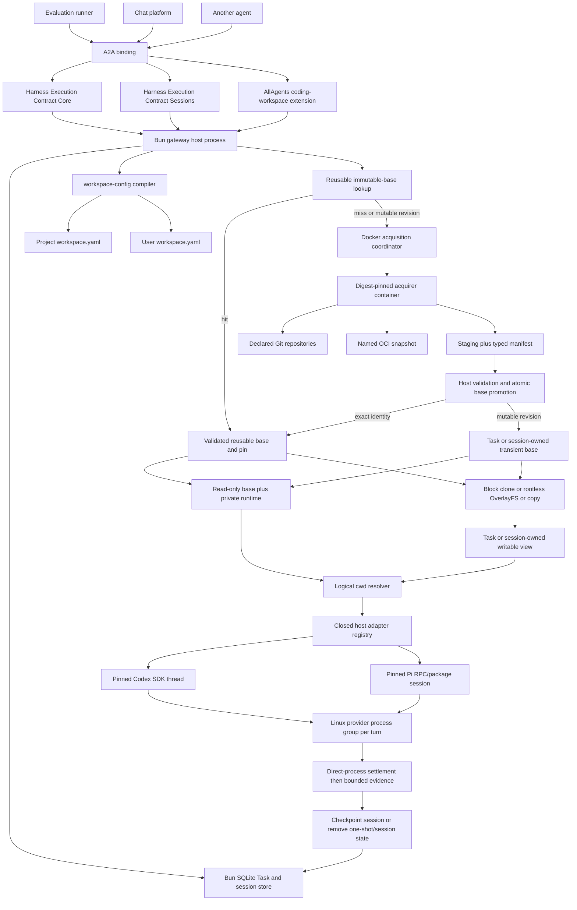

# Coding-Agent Execution Gateway - Plan

## Goal Capsule

- **Objective:** A developer can install and run one trusted-network A2A
  endpoint for one AllAgents workspace and invoke built-in or explicitly
  gateway-enabled profile targets against either the complete configured Git
  repository set, with optional named revision overrides, or a digest-pinned
  OCI workspace snapshot. AI Evals can configure either source mode in
  Promptfoo YAML through a custom provider without sending origins.
- **Means:** Convert the repository to a private Bun workspace monorepo with
  independently released `allagents` and `allagents-gateway` applications,
  versioned workspace/execution/acquisition contract packages, generated
  portable fixtures under `contracts/`, a bounded SQLite Task/session store,
  direct Codex and Pi host-process adapters, and one digest-pinned acquisition
  image used only when no reusable validated base exists. One-shot read-only
  Tasks share a reusable base or own a non-reusable base for mutable revisions;
  sessions pin a base and retain private runtime/workspace state; one-shot
  read-write Tasks receive disposable writable views through an automatic
  block-clone/OverlayFS materializer with an explicit portable copy backend.
  Providers still run bare metal on the trusted Linux CI runner.
- **Authority:** [ADR 0002](../decisions/0002-serve-coding-agent-execution-through-an-a2a-gateway.md)
  owns the wire, trust, runtime, and packaging boundaries. Project and user
  `workspace.yaml` files own source and profile declarations. The
  transport-neutral Harness Execution Contract (HEC) Core and Sessions own
  deterministic per-turn and continuation semantics; their A2A binding owns the
  version-one wire mapping; the AllAgents coding-workspace extension owns
  Git/OCI workspace semantics.
  The CI job, VM, or deployment container is the only operational execution
  and isolation boundary. AllAgents does not claim that boundary contains
  hostile code or hides job secrets from model-invoked tools; it owns process
  lifecycle and truthful evidence only.
- **Execution order:** Capture red CLI-only and standalone-gateway package
  smokes; complete the Bun monorepo, A2A SDK, provider-surface, process-group,
  Docker-acquirer, package, and release feasibility gate; freeze schemas,
  generated fixtures, configuration projection, SQLite ownership, and release
  binding; implement the Task/session store and A2A server, host supervisor,
  Docker-only acquisition, Codex, and Pi; run final review; then run green packed-
  package, exact-image, registry-conformance, repository, and documentation
  gates.
- **Stop conditions:** Stop dependent production work if the pinned A2A surface
  cannot implement the required private-network protocol or if the acquisition-
  container boundary and exact image/package release binding are infeasible.
  A missing Codex or Pi capability makes that target unavailable rather than
  changing the A2A, trust, source, or Task/session contracts. Do not add
  application authentication, deployment YAML, remote workers, caller-supplied
  origins/commands, mutable OCI
  tags, provider fallback, evaluation behavior, automatic retries, per-provider
  Docker, or containment claims.
- **Tail ownership:** The implementing workflow runs focused contract,
  lifecycle, provider-environment, process-group, acquisition-boundary, and
  release-binding tests; repository quality gates; packed CLI/gateway and exact
  acquisition-image smoke tests; registry conformance; and documentation
  validation.

---

## Product Contract

### Summary

AllAgents gains a single-workspace coding-execution service without becoming an
evaluation framework or multi-tenant platform. A transport-neutral Harness
Execution Contract defines one turn's invocation, ordered tool trajectory,
results, usage, cancellation, failures, and artifacts plus durable resumable
Sessions for evaluation runners, chat platforms, applications, and other agents.
The gateway exposes its first binding through A2A Tasks and one required
AllAgents coding-execution Profile Extension. That profile composes the A2A
binding, Sessions, and the AllAgents-specific coding-workspace extension while
preserving separate schemas and conformance groups.
Network reachability is authorization. The service resolves configured targets
and sources from existing workspace files, acquires or reuses an immutable base,
shares it for read-only Tasks, creates an independent disposable view for
read-write Tasks, invokes Codex or Pi through a typed adapter, and retains
bounded terminal evidence. AI Evals consumes that boundary through its own
Promptfoo custom provider: evaluation YAML supplies named revision overrides
for the configured repository set, or one snapshot handle and immutable
digests, while AllAgents retains origin and credential authority.

### Problem Frame

AllAgents configures and launches coding clients but has no service boundary for
trusted tools such as AI Evals. Those tools would otherwise import AllAgents
internals, drive interactive CLIs, or duplicate profile resolution, repository
acquisition, credential handling, cancellation, evidence capture, and cleanup.

Developers expect a process they can start in a workspace and expose on
loopback or a trusted private network such as Tailscale. Remote access uses
either a loopback backend behind a private TLS terminator or one specific private
TLS listener; wildcard/public listeners are rejected. Version one is never a
public-Internet service. They do not need an application
authentication stack, Kubernetes control plane, remote worker registry, or
another profile configuration file for the initial use case.

### Actors

- A1. **Trusted-network caller:** An evaluation runner, chat platform,
  application, or agent able to reach the endpoint. All callers have the same
  authority and Task visibility. The first caller is an AI Evals-owned
  Promptfoo custom provider that maps one `callApi` to one execution.
- A2. **Execution gateway:** The A2A binding and invocation supervisor. It owns
  deployment-wide Task identity, acquisition, routing, status, cancellation,
  evidence, retention, and cleanup.
- A3. **Backend adapter:** The Codex or Pi implementation translating native
  automation events and cancellation into the common contract.
- A4. **Operator/developer:** The person who selects the project workspace,
  gateway-enables profile launchers, supplies process flags and credential
  handles, and controls network access.
- A5. **GitHub/OCI source:** The remote content service used only during the
  acquisition phase.

### Key Decisions

- **Define one harness contract with A2A as its first binding.** The
  transport-neutral Harness Execution Contract Core owns one turn's invocation,
  idempotency, ordered progress and tool trajectory, cancellation, result,
  usage, stable failures, and artifacts. The version-one Sessions extension owns
  durable linear conversation identity, provider-native resumption, retained
  workspace state, expiry, and close-after-turn cleanup. Standard A2A Agent
  Cards, Messages, Tasks, context IDs, task references, Artifacts, errors,
  streaming, and cancellation carry those semantics. An evaluation runner, chat
  platform, application, or agent uses the same contracts; Promptfoo does not
  masquerade as an autonomous agent. Governs R1-R3.
- **Treat the private network as the trust boundary.** The initial service has
  no application authentication or caller ownership. Remote access requires a
  loopback backend behind private TLS ingress or a specific private-address TLS
  listener; wildcard/public listeners and public exposure are prohibited.
  Governs R4-R5.
- **Reuse workspace configuration.** Project `workspace.yaml` owns sources;
  user `workspace.yaml` owns profiles, launchers, and gateway enablement. There
  is no `gateway.yaml`. (session-settled: user-directed.) Governs R6-R8, R18.
- **Support two acquisition modes.** Direct declared repositories and named,
  digest-pinned OCI workspace snapshots converge on one manifest and evidence
  contract. (session-settled: user-directed.) Governs R9-R11.
- **Share immutable bases; isolate writes.** `workspaceAccess` defaults to
  `readWrite`. One-shot read-only Tasks and read-only sessions may reuse one
  validated physical base; each receives private runtime state. One-shot
  read-write Tasks receive disposable writable views. A read-write session
  retains an immutable committed generation and runs each turn in a private
  candidate that becomes the next generation only at atomic settlement.
  Reflink/block clone is preferred, rootless OverlayFS is the Linux fallback,
  and an explicit copy backend preserves portability. Governs R2-R3, R5,
  R8-R11, R15-R16, R18-R19.
- **Use App-first GitHub credential eligibility.** Prefer an applicable GitHub
  App; use a configured `gh` account only when no App installation applies;
  never fall back after selected-App failure. (session-settled: user-directed.)
  Governs R12.
- **Keep a narrow typed backend seam.** Pinned supported Codex and Pi package or
  RPC surfaces are the complete initial backend set. Launcher-backed profiles
  resolve through AllAgents-owned adapters and execute on the gateway host
  rather than through generated wrapper files or the acquisition container.
  Governs R7-R8, R13-R15.
- **Persist Task truth and resumable session checkpoints.** Restart settles an
  interrupted turn failed and never replays it. An idle session resumes only
  from its last committed provider/workspace checkpoint; an uncertain checkpoint
  is non-resumable pending cleanup. Governs R3, R5, R8, R13-R16.
- **Keep evaluation outside AllAgents.** Consumers own datasets, repetitions,
  scoring, assertions, and evaluation Runs. Governs R17.
- **Bridge Promptfoo at the consumer boundary.** AI Evals owns a custom provider
  that maps Promptfoo YAML and test variables to closed A2A source/session modes
  and maps terminal Tasks plus session/cache metadata back to
  `ProviderResponse`. AllAgents owns no Promptfoo runtime behavior. Governs R19.

### Requirements

**Private-network protocol**

- R1. Implement A2A 1.0 HTTP+JSON for Agent Card discovery, `SendMessage`,
  `GetTask`, `ListTasks`, `CancelTask`, streaming send, and active Task
  subscription. Every A2A request carries `A2A-Version: 1.0`; another version
  receives `VersionNotSupportedError`. The Agent Card advertises exactly one
  absolute private interface URL with `protocolBinding: "HTTP+JSON"`,
  `protocolVersion: "1.0"`, and `capabilities.streaming: true`. It declares the
  coding-execution Profile Extension identifier
  `urn:allagents:a2a:profile:coding-execution:v1` with `required: true`. Strict
  `params` contains a sorted `targets` array whose entries have
  `id: TargetId` and
  `sessionModes: ("oneShot" | "start" | "resume")[]`. `oneShot` is always
  present; `start` and `resume` are advertised together only when the target's
  adapter supports native durable continuation. Targets and modes outside these
  entries fail before admission. The Agent Card uses
  `defaultInputModes: ["text/plain"]`, `defaultOutputModes: ["text/plain",
  "application/json", "application/octet-stream"]`, and exactly one stable
  skill: `id: "coding-execution"`, `name: "Coding execution"`, a
  profile-defined description, tags `["coding", "harness-execution"]`, and an
  example that produces a profile-shaped Task. Extension params advertise ready
  targets and their usable continuation modes only.
  V1 callers obtain configured logical repository and snapshot selectors
  from their workspace or consumer configuration; the Agent Card does not
  publish origins, credentials, destinations, physical paths, or snapshot
  selection state.

  Remote interface URLs use HTTPS and resolve only to loopback, RFC 1918,
  RFC 4193, link-local, or RFC 6598 addresses such as Tailscale's
  `100.64.0.0/10`; direct HTTP is limited to a loopback listener. Startup rejects
  wildcard/public listener addresses, public URL literals, advertised hostnames
  with any public address, and a private direct listener without TLS key/cert.
  Every operation that creates, returns, lists, subscribes to, or
  mutates profiled Tasks or Artifacts includes the Profile URN in
  `A2A-Extensions`; missing activation receives
  `ExtensionSupportRequiredError`.

  Check the transport-neutral Harness Execution Contract Core and Sessions
  specifications into `docs/contracts/harness-execution-v1.md` with identifiers
  `urn:allagents:harness-execution:core:v1` and
  `urn:allagents:harness-execution:sessions:v1`. Core defines one turn's
  invocation, target selection, idempotency, deadline, ordered progress and
  normalized tool-call/result trajectory, cancellation, terminal result, usage,
  portable failures, and artifacts without importing A2A or UHP types. Sessions
  defines linear continuation and durable provider/workspace checkpoints without
  importing A2A types. The required Profile URN identifies the normative A2A
  binding plus Sessions and the AllAgents coding-workspace extension, not an
  undocumented metadata convention. These URNs are non-dereferenceable contract
  identifiers, never gateway or public documentation endpoints. The binding
  defines permitted A2A values, one-Message/one-Task-per-turn constraints,
  schemas, context/task-reference mapping, state and event mapping, errors,
  examples, versioning, and executable conformance cases. V1 uses one required
  A2A Profile URN because this gateway requires Core, Sessions capability, and
  the workspace extension; it exposes no second wire protocol.

  Honor both `SendMessageConfiguration.returnImmediately` modes. `ListTasks`
  implements every standard filter, cursor pagination, `pageSize` 1-100 with a
  default no greater than 50, descending status-timestamp order, and required
  `tasks`, `nextPageToken`, `pageSize`, and `totalSize` fields.
  `nextPageToken` is present and empty on the final page. With the default
  `includeArtifacts: false`, each returned Task omits `artifacts`; `true`
  includes the field. A response never exceeds the configured serialized-byte
  limit. `ListTasks` may return fewer Tasks than `pageSize` when the next whole
  Task would cross that limit; it never splits a Task, and its cursor resumes at
  the first omitted Task. The validated per-Task/response invariant guarantees
  one complete Task fits `GetTask` and a nonempty list page.
- R2. Define the exact transport-neutral `HarnessInvocationV1` DTO as
  `{ version: "1", invocationKey, target, prompt, deadlineSeconds,
  resultSchema? }`. The prompt is part of Core even though a binding may carry it
  outside its control object. Define the separate Sessions input as exactly one
  of `{ mode: "oneShot" }`, `{ mode: "start", closeAfterTurn }`, or
  `{ mode: "resume", sessionId, previousTaskId, closeAfterTurn }`; both booleans
  default to false. Its terminal turn projection is exactly one of
  `{ mode: "oneShot", state: "none" }`,
  `{ mode: "start" | "resume", sessionId, state: "idle", headTaskId }`,
  `{ mode: "start" | "resume", sessionId, state: "closed" }`, or
  `{ mode: "start" | "resume", sessionId, state: "notResumable" }`. An idle
  `headTaskId` is the just-terminal Task and the only Task valid for the next
  resume. Provider-checkpoint/workspace generation may independently remain the
  prior committed pair after a safely failed or canceled turn.
  Define the separate AllAgents workspace input as
  `{ source, workingDirectory, workspaceAccess }`. Core imports neither
  Sessions nor workspace types.

  The A2A binding projects exactly one Message text Part to Core `prompt`; maps
  the remaining Core fields, Sessions `mode` as `sessionMode`,
  `closeAfterTurn`, and the workspace fields to the flat object at
  `Message.metadata[profileUri]`; and maps Sessions `sessionId` to
  `Message.contextId` plus `previousTaskId` to the sole
  `Message.referenceTaskIds` member. Each contract module owns a disjoint named
  property set and its module-local required members but does not close the
  shared metadata object. On a terminal Task, the binding writes the exact
  Sessions terminal projection to strict `Task.metadata[profileUri].session`;
  it is absent from nonterminal Tasks and events. `sessionId` equals the Task
  context ID, and any idle `headTaskId` names the exact terminal Task accepted
  for the next resume.
  The composed A2A schema alone declares the complete
  flat property set, unions required members, materializes cross-module
  defaults, and sets `additionalProperties: false`; duplicate property ownership
  or incompatible constraints fail generation. Strict nested objects reject
  every unlisted member. V1 uses these wire scalars:
  - `InvocationKey` matches `^[A-Za-z0-9][A-Za-z0-9._:-]{0,127}$`.
  - `ContextId` is NFC UTF-8 of 1-256 bytes with no U+0000-U+001F or U+007F;
    gateway-generated session IDs are lowercase canonical UUIDv7 values.
  - `TaskId` is the gateway-generated lowercase canonical UUIDv7 Task ID.
  - `ConfigName` and `TargetId` match
    `^[A-Za-z0-9][A-Za-z0-9._-]{0,63}$`.
  - `RevisionText` is NFC UTF-8, 1-255 bytes, with no U+0000-U+001F or U+007F.
  - `Digest` matches `^sha256:[0-9a-f]{64}$`.
  - `RelativeDirectory` is NFC UTF-8 of 1-1024 bytes containing 1-32
    slash-separated segments. Each segment is 1-255 bytes, is neither `.` nor
    `..`, and contains no slash, backslash, U+0000-U+001F, or U+007F.
  The A2A profile metadata object is exactly:
  `version: "1"`; `invocationKey: InvocationKey`; `target: TargetId`;
  optional `sessionMode: "oneShot" | "start" | "resume"` defaulting to
  `"oneShot"`; optional `closeAfterTurn: boolean` defaulting to false and
  forbidden for `oneShot`; `source`, one of `{ kind: "repositories",
  revisions?: Record<ConfigName, RevisionText> }` or
  `{ kind: "workspaceSnapshot", snapshot: ConfigName, digest: Digest,
  workspaceManifestDigest: Digest }`; optional `workingDirectory`, one of
  `{ kind: "workspaceRoot" }` or `{ kind: "repository",
  repository: ConfigName, path?: RelativeDirectory }`, defaulting to
  `{ kind: "workspaceRoot" }`; optional `workspaceAccess`, one of
  `"readOnly" | "readWrite"`, defaulting to `"readWrite"`; optional
  `deadlineSeconds` (integer 1-3600, default 1800); and optional
  `resultSchema: { version: "1", schema: SchemaNode }`.

  A `SchemaNode` is exactly one branch below. `description` is optional NFC
  UTF-8 of at most 1024 bytes. Scalar `enum` arrays contain 1-128 canonically
  distinct values of the node's type; string enum values are at most 4096 UTF-8
  bytes, numbers are finite, integers are JSON safe integers, and null permits
  only `[null]`.
  - null or boolean: `{ type, description?, enum? }`;
  - string: `{ type: "string", description?, enum?, minLength?, maxLength? }`,
    where lengths are integers 0-1,048,576 Unicode scalar values and minimum
    does not exceed maximum;
  - number or integer:
    `{ type, description?, enum?, minimum?, maximum? }`, where number bounds
    are finite, integer bounds are JSON safe integers, and minimum does not
    exceed maximum;
  - array:
    `{ type: "array", description?, items: SchemaNode, minItems?, maxItems? }`,
    where item bounds are integers 0-4096 and minimum does not exceed maximum;
  - object:
    `{ type: "object", description?, properties, required?,
    additionalProperties: false, minProperties?, maxProperties? }`, where
    `properties` is a strict record of 0-256 `ConfigName` keys,
    `required` is a unique subset of those keys, property bounds are integers
    0-256, and minimum does not exceed maximum.
  No pattern dialect exists in v1. References, unions/combinators, conditionals,
  formats, defaults, coercion, non-finite numbers, duplicate canonical enum
  values, and unknown keywords are rejected. The canonical result schema is at
  most 64 KiB, 256 nodes, and 32 levels deep. Repository revision count cannot exceed declared repositories.
  The Message contains exactly one `Part` with `text` set to a UTF-8 Core
  `prompt` of 1 byte to 1 MiB; other Part content fields are rejected. Only the
  profile-owned metadata object is strict; unrelated A2A metadata and other
  activated-extension keys are preserved or ignored according to A2A.
  `oneShot` and `start` forbid client `contextId` and `referenceTaskIds`;
  `resume` requires a `ContextId` and exactly one `TaskId` reference.
  Canonicalization materializes defaults, normalizes profile strings to UTF-8
  NFC, sorts record keys, and hashes the Core Invocation excluding
  `invocationKey`, the Sessions and workspace inputs, and the complete A2A
  session projection: mode, close-after-turn value, supplied context
  presence/value, and ordered task references. Generated context IDs are not
  hashed. Do not add `Task.extensions` or backend-specific public fields.

  A client generates an opaque invocation key with at least 128 bits of
  randomness once per logical turn, durably reuses that key and identical
  canonical request after an ambiguous transport failure, and creates a new key
  only for an intentionally new turn. A replay with any changed session
  projection conflicts. A2A `messageId` remains Message identity and does not
  replace the profile idempotency key.
- R3. One valid new turn creates one addressable immutable Task. `oneShot` and
  `start` atomically generate and persist a lowercase canonical UUIDv7 context
  ID with the absent-context invocation claim; only `start` creates a durable
  session under that ID. Replays return the persisted generated value. `resume`
  requires an idle, unexpired, resumable session at `Message.contextId`, the
  session's exact current head Task as its sole `referenceTaskIds` member, and
  the same target, canonical source, logical cwd, access mode, provider identity,
  and configuration digest. A stale head, changed pinned input, active turn,
  expired session, or poisoned checkpoint fails respectively with
  `session_head_mismatch`, `session_configuration_mismatch`, `session_busy`,
  `session_expired`, or `session_not_resumable`, and creates no Task.

  Every session turn and event uses the session context ID. Terminal Tasks remain
  immutable; continuation always creates a new Task in the same context. V1
  serializes a linear session history and rejects branching or concurrent turns.

  HEC Core defines seven execution states: `submitted`, `working`, `completed`,
  `failed`, `timedOut`, `canceled`, and `rejected`. A cancellation command
  returns the neutral disposition `accepted | alreadyTerminal`; the latter never
  changes the outcome. The A2A binding maps `submitted` and `working` to
  `TASK_STATE_SUBMITTED` and `TASK_STATE_WORKING`; `completed`, `canceled`, and
  `rejected` to their same-named A2A states; and both `failed` and `timedOut` to
  `TASK_STATE_FAILED`. A2A maps `alreadyTerminal` to
  `TaskNotCancelableError`. A Message addressed to an existing Task ID returns
  `UnsupportedOperationError` whether that Task is active or terminal; a session
  continuation instead creates a new Task using the same context ID and the
  prior Task as a reference. The binding never emits
  `TASK_STATE_INPUT_REQUIRED`, `TASK_STATE_AUTH_REQUIRED`, or
  `TASK_STATE_UNSPECIFIED`.

  Core owns one durable ordered execution-event stream. `SafeUInt` is an integer
  0-9,007,199,254,740,991; `ShortText` is valid UTF-8 of at most 4096 bytes;
  `TrajectoryText` is valid UTF-8 of at most 65,536 bytes; `ArtifactId` matches
  `^[A-Za-z0-9][A-Za-z0-9._:-]{0,127}$`; and `MediaType` is a valid RFC 6838
  media type of at most 255 ASCII bytes. `TrajectoryPayload` is exactly
  `{ kind: "json", value }` or `{ kind: "text", text: TrajectoryText }`.
  JSON `value` has at most 32 levels, contains no non-finite number, and its
  RFC 8785 encoding is at most 65,536 bytes. Native structured values use the
  JSON branch; native strings or values without a lossless JSON representation
  use the text branch. Equivalent structured values therefore normalize to the
  same bytes.

  `HarnessExecutionEventV1` is exactly one gapless `sequence` from zero plus:
  - `{ type: "progress", phase, message?: ShortText }`, where `phase` is
    `accepted | acquiring | preparing | executing | collecting | cleaning`;
  - `{ type: "toolCall", callId: ArtifactId, name: ShortText,
    arguments: TrajectoryPayload }`; or
  - `{ type: "toolResult", callId: ArtifactId,
    status: "completed" | "failed" | "canceled", output: TrajectoryPayload }`.

  Tool-call IDs are unique. A result follows exactly one matching call, and a
  call has at most one result. A normally completed execution with a complete
  trajectory has exactly one result for every call. An interrupted call emits a
  `canceled` result when the adapter observed that outcome; otherwise it remains
  unmatched and forces `complete: false`. Duplicate event delivery is
  idempotent only when its sequence and canonical payload are identical;
  divergence fails `provider_protocol_invalid`.

  Each Core event is transactionally appended before publication. The gateway
  computes `terminalTailReserveBytes` from the generated maximum compact
  encodings of every non-droppable terminal field: a 1 MiB valid result, maximal
  bounded Core/composed failure records, maximal required source/provenance
  identity, the three reserved Artifact envelopes, all terminal events, and
  response envelopes. Truncatable output/evidence and optional produced
  Artifacts are excluded. Every nonterminal append projects both the durable
  event record and its duplicate in the terminal trajectory plus that reserve;
  it commits only when the projected footprint remains within
  `max-task-bytes`. Otherwise the gateway atomically
  records trajectory truncation and publishes neither that event nor later
  nonterminal events; provider execution continues. The A2A binding emits one
  nonterminal `TaskStatusUpdateEvent` per committed event, stores the exact Core
  event at `event.metadata[profileUri].executionEvent`, uses
  `TASK_STATE_SUBMITTED` only for `phase: "accepted"` and
  `TASK_STATE_WORKING` otherwise, and preserves the Task context ID. Replay and
  resubscription emit only committed events in sequence. Tool events are live
  progress and also form the terminal normalized trajectory.

  Every terminal Task has exactly one Core outcome Artifact, one Core execution-
  trajectory Artifact, one AllAgents workspace-integrity Artifact, and zero or
  more produced Artifacts. Atomic settlement commits the terminal Task, every
  terminal `TaskArtifactUpdateEvent`, and the terminal
  `TaskStatusUpdateEvent` in the same transaction as those Artifacts. Publishers
  emit only committed events: every Artifact update precedes the terminal
  status update, whose terminal `TaskState` makes it the final stream item, and
  the stream then closes.

  The Core outcome Artifact has `artifactId` and `name` equal to
  `harness.execution-outcome`, lists `profileUri` in `Artifact.extensions`, and
  has one `Part` with `data` set to the strict
  `harness-execution-outcome/v1` object and media type
  `application/vnd.allagents.harness-outcome+json`. The payload is a strict
  discriminated union on terminal `state`; every branch also contains
  `version: "1"`, `target: TargetId`,
  `terminalOutput: { text, truncated }`, optional `usage`,
  `executionTrajectory`, and `result`. Terminal output is UTF-8 at most 1 MiB.
  Usage is a strict object with optional `inputTokens`, `outputTokens`,
  `cachedInputTokens`, and `totalTokens` `SafeUInt` fields plus optional
  `provider` containing 0-64 `ConfigName: SafeUInt` counters.
  `executionTrajectory` is
  `{ artifactId: "harness.execution-trajectory", eventCount: SafeUInt,
  complete, truncated, digest: Digest }`.

  The state branches are closed:
  - `completed` forbids `failure` and permits only valid result or
    `notProduced` with `notRequested | providerDidNotReturn`;
  - `canceled` requires `execution_canceled`/`cancellation` and
    `notProduced: canceled`;
  - `timedOut` requires `execution_deadline_exceeded`/`deadline` and
    `notProduced: deadlineExceeded`;
  - `rejected` requires `execution_permission_denied`/`permission` and
    `notProduced: rejected`; and
  - `failed` requires one other Core failure/result pair from the normative
    `core-outcome-matrix/v1`.

  Core-only `failure` is `{ code, message, retryable, cause }`; codes are
  HEC-owned error-table rows or `execution_extension_failed`; causes are
  `validation | capacity | deadline | permission | providerProtocol |
  cancellation | termination | stateStore | restart | extension`; `message` is
  `ShortText`. Retryability matches the Core matrix row except
  `execution_extension_failed`, whose Core schema admits either boolean.
  `result` is exactly `{ status: "valid", value }`,
  `{ status: "invalid", errors }`, or
  `{ status: "notProduced", reason }`. `value` validates against the requested
  `SchemaNode`, serializes to at most 1 MiB, and appears only when requested.
  `errors` contains 1-64 strict `{ path, keyword, message }` entries; `path` is
  an RFC 6901 JSON Pointer at most 1024 bytes, `keyword` is a v1 `SchemaNode`
  member, and `message` is `ShortText`. Reasons are
  `notRequested | providerDidNotReturn | providerFailed | extensionFailed |
  rejected | canceled | deadlineExceeded | invalidProviderPayload |
  retentionLimitExceeded`.

  The checked-in, hand-authored matrix has rows for every Core failure/result
  combination and explicitly enumerates terminal state, result status/reason,
  and retryability. Its `execution_extension_failed` rows admit both retryability
  values; the composed profile requires equality with the selected workspace
  failure row. Generated JSON Schema is a `oneOf` over the matrix. An extension
  failure before a Core execution result is determined requires
  `notProduced: extensionFailed`; a later extension settlement failure preserves
  the already determined result,
  including a valid result or cancellation/deadline reason. Every unlisted
  combination is rejected, including completed+failure, canceled+provider
  failure, or timedOut without deadline failure.

  The Core trajectory Artifact has `artifactId` and `name` equal to
  `harness.execution-trajectory`, lists `profileUri` in `Artifact.extensions`,
  and has exactly one `Part` with `data` set to the strict
  `harness-execution-trajectory/v1` object and media type
  `application/vnd.allagents.harness-trajectory+json`. Its payload is
  `{ version: "1", eventCount, complete, truncated, digest, events }`.
  `events` is the longest whole-event prefix, at most 4096 events, that fits the
  retained-byte bound; middle or earlier events are never sampled or dropped.
  `eventCount` equals its length. `truncated` is true exactly when an observed
  event was omitted by a count or byte bound. `complete` is true only when the
  adapter asserts full event observability, no event was omitted, and every
  interrupted call is represented as above. `digest` is SHA-256 over RFC 8785
  bytes of the same payload with `digest` omitted. The A2A binding requires the
  Core outcome's `executionTrajectory` fields to equal the unique trajectory
  Artifact's `artifactId`, `eventCount`, `complete`, `truncated`, and `digest`
  exactly; any mismatch fails composed validation. Native provider traces remain
  optional evidence and never replace this Core record.

  The AllAgents workspace-integrity Artifact has `artifactId` and `name` equal
  to `allagents.workspace-integrity`, lists `profileUri` in
  `Artifact.extensions`, and has one `Part` with `data` set to the strict
  `allagents.workspace-integrity/v1` object and media type
  `application/vnd.allagents.workspace-integrity+json`. Its `taskId` equals the
  enclosing A2A Task ID. The payload owns:
  - `version: "1"` and `taskId`;
  - effective logical `workingDirectory`, exactly `{ kind: "workspaceRoot" }` or
    `{ kind: "repository", repository: ConfigName,
    path?: RelativeDirectory }`, and effective
    `workspaceAccess: "readOnly" | "readWrite"`. No physical or configured
    destination path is present. `readOnly` is cooperative best-effort provider
    policy, not hostile-code containment;
  - `sourceIdentity`, either
    `{ kind: "repositories", complete, repositories }` or
    `{ kind: "workspaceSnapshot", snapshot: ConfigName, digest: Digest,
    workspaceManifestDigest: Digest, layerDigests, complete, repositories }`.
    `layerDigests` has 0-64 `Digest` values in manifest order.
    `repositories` has 0-64 unique strict entries
    `{ name: ConfigName, requestedRevision?: RevisionText,
    resolvedCommit: string, verification:
    "independentlyVerified" | "snapshotAttested" }`; `resolvedCommit` matches
    `^[0-9a-f]{40}$`. Before provider execution, `complete` is true, repositories
    exactly match the configured catalog, and snapshot identities include every
    layer digest. Failed acquisition records only verified members and sets
    `complete: false`;
  - optional `workspaceManifestDigest: Digest`;
  - `producedArtifacts`, 0-128 strict entries
    `{ artifactId: ArtifactId, name?: ShortText, mediaType?: MediaType,
    size: SafeUInt, digest: Digest }`. IDs are unique, entries sort by ID, and
    their ID set exactly equals `Task.artifacts` minus the three reserved
    Artifacts. Each referenced produced Artifact lists `profileUri`, mirrors the
    optional name and media type, and has exactly one `Part.raw` containing the
    base64 file bytes; other Part content and metadata are absent. `size` and
    SHA-256 `digest` cover the exact decoded bytes;
  - `evidence: { items, complete, truncated }`, whose 0-256 strict items are
    `{ kind, artifactId?, digest?, summary? }` with kind
    `gitState | providerTrace | fileChanges | usage | cancellation |
    termination | cleanup`, at least one optional member present, and aliases as
    above. `complete` means each configured bounded category was attempted after
    the direct provider settled, never that every descendant was quiescent;
  - `termination: { status: "clean" | "failed" | "unknown",
    reason?: ShortText }`, reporting only direct provider/process-group
    observation;
  - `cleanup: { workspace: "shared" | "removed" | "retained" | "failed",
    reason?: ShortText }`. `shared` retains only a reusable base after removing
    private runtime; `removed` means all Task/session-owned runtime, writable
    view, and non-reusable base state is gone; and
  - optional workspace-only `failure: { code, message, retryable, cause }`,
    whose code/cause is one AllAgents workspace-extension row in the error table.
    It never admits a HEC-owned failure code.

  The module-local workspace payload contains no Core Artifact reference. The
  composed profile alone requires the three reserved Artifacts and, for a
  workspace failure, pairs exact workspace `failure` with Core
  `execution_extension_failed`, cause `extension`, and the same retryability.
  A non-extension Core-origin failure leaves workspace `failure` absent.

  Gateway-generated source identity, workspace-manifest fields, evidence
  metadata, and provider-added metadata never contain Git URLs, OCI repository
  origins, or destination paths. This does not inspect or sanitize opaque
  prompts, output, result values, trajectory text, native evidence, or produced
  bytes.

  Failure, rejection, and cancellation retain every available bounded field
  without implying a valid result. A Task's retained footprint is the maximum
  of: (a) the sum of exact UTF-8 bytes of compact canonical JSON for its claim,
  Task, event, and Artifact payloads, counting raw Artifact data at its base64
  wire size; (b) its exact serialized `GetTask` HTTP+JSON response; and (c) its
  exact serialized one-Task `ListTasks(includeArtifacts: true)` response. The
  production serializer computes those values after JSON escaping and envelope
  fields, before every commit.

  Collectors retain the longest event prefix, truncate stream-like fields, or
  omit a whole produced Artifact to remain within `max-task-bytes`; they never
  retain a partial produced file. An otherwise valid structured result that
  cannot fit becomes `result.status: "notProduced"`, reason
  `retentionLimitExceeded`, and terminal failure
  `execution_result_too_large`. Reconciled terminal Task records, Artifacts,
  events, and claims expire atomically after their configured TTL, releasing the
  actual retained charge. A poisoned/unreconciled Task is ineligible for expiry,
  is charged only by its active `max-task-bytes` reservation, and starts its TTL
  only when reconciliation atomically replaces that reservation with its exact
  footprint.

**Trust, identity, and Task storage**

- R4. Do not authenticate application callers because version one is restricted
  to one trusted private network. Allow exactly: loopback HTTP, optionally
  exposed through a private HTTPS terminator; or native HTTPS bound to one
  specific loopback/RFC 1918/RFC 4193/link-local/RFC 6598 address. Native
  off-loopback TLS requires configured certificate/key files. Wildcard and
  public listeners are rejected before binding. The advertised URL is loopback
  HTTP only for local use and otherwise private HTTPS. Tailscale ACLs, private
  firewall rules, or equivalent controls remain required. Every reachable caller
  may create, list, retrieve, subscribe to, resume, and cancel every Task/session.
  Artifacts are retrieved only inside Tasks through `GetTask` or
  `ListTasks(includeArtifacts: true)`; v1 adds no separate Artifact endpoint.
  Startup/docs state that reachability is authorization and public exposure
  requires application authentication, authorization, and an amended ADR.
- R5. Idempotency, Task visibility, and session visibility are deployment-wide.
  One transactional `createOrReplay` operation validates and locks the selected
  session state, then atomically writes the invocation claim, Task, initial
  `accepted` event, effective context ID, and byte reservation. A `start` also
  creates the session row; a `resume` compare-and-sets the exact idle head to the
  new active Task. The claim binds the key to the canonical Core request,
  Sessions input, workspace input, full A2A session projection, selected
  target/source/cwd/access, optional result-schema digest, deadline, and
  effective configuration digest before acknowledging Task creation. The Task
  reservation is exactly `max-task-bytes`.
  Admission succeeds only when retained Task count,
  `settledFootprints + activeReservations + maxTaskBytes`, retained session count,
  and prior-plus-candidate session byte reservations fit. Replay returns the
  existing Task/reservations; a changed request conflicts. Settlement uses the
  R16 prepared record, then atomically replaces the Task reservation with its
  footprint and either sets the idle lineage head to the current terminal Task
  plus the selected committed provider-checkpoint/workspace-generation pair, or
  records close/poison state. Task expiry releases only its footprint and never
  a live session pair. Status, terminal
  settlement, and head/pointer advancement are monotonic. The project state root
  persists canonical workspace identity and holds one process lock.

  The Bun gateway privately owns one SQLite database through `bun:sqlite`.
  Ordinary tables hold claims, Tasks, events, Sessions, ordered turns, opaque
  provider checkpoints, committed/candidate/superseded workspace-generation
  identities, prepared settlement/cleanup records, pinned configuration/source/
  workspace digests, session byte reservations/charges, retained Task charges,
  bounded Artifact bytes, the execution lease, outcome intent, acquisition-
  container/staging/transient-base identity, provider process-group identity,
  observed outliving-descendant identity, and expiry.
  Enable foreign keys, use WAL where supported, set `synchronous=FULL`, and
  acknowledge only committed transactions. The current user owns the state root
  and database with `0700`/`0600`-equivalent permissions; the root is disjoint
  from project, staging, publication, profile, and provider-auth roots. No custom SQLite VFS
  or native file primitive is introduced. Startup verifies the root, lock,
  schema/integrity, and workspace identity; terminalizes interrupted Tasks
  failed; removes recorded acquisition containers and orphan staging; and
  attempts to terminate recorded provider process groups. An unresolved App mint
  intent or revocation-pending token requires recorded container/local-secret
  absence and an atomically durable expiry-backed tombstone before the
  interrupted Task terminalizes.
  The gateway releases a stale/poisoned lease only after the container and
  recorded process group are gone, every observed outliving descendant is gone,
  candidate/committed/superseded workspace and other owned state reconcile to the
  database pointer, and any revocation tombstone is durable. Otherwise readiness
  remains false. An interrupted turn is never resumed/replayed; an idle session
  may resume only from its last committed provider-checkpoint/workspace-
  generation pair. Store open/corruption/write/synchronization failure stops
  admission and prevents terminal success.

**Workspace and target configuration**

- R6. One gateway process serves one project workspace selected by `--workspace`
  or cwd. Parse its `.allagents/workspace.yaml` through the authoritative project
  schema, then compile a gateway-only repository catalog without tightening
  ordinary workspace parsing. Derive each logical name from `name` or the
  existing path-basename fallback; require 1-64 unique `ConfigName` values,
  collision-free normalized destinations, and one supported canonical GitHub
  origin resolved through existing `source`/`repo` semantics. Repository names,
  origins, destinations, default revisions, workspace projection, plugins, and
  named OCI snapshot repositories come only from that declaration. A catalog
  failure makes the gateway not ready.
- R7. Parse `~/.allagents/workspace.yaml` through the authoritative user schema.
  Built-in `codex` and `pi` targets are available when ready. A launcher-bearing
  profile client adds a target only when `gateway.enabled: true`. Its public ID
  is the globally collision-checked launcher basename and resolves to exactly
  one `(profile, client)` pair. Built-in IDs are reserved under the same portable
  collision key; colliding enablement is a configuration error. Initially only
  Codex and Pi profile clients are executable.
- R8. A request selects a declared target, may select one logical
  `workingDirectory`, may select `workspaceAccess`, may set the bounded
  `deadlineSeconds`, may provide one bounded result schema, and chooses
  `oneShot | start | resume`. `workspaceAccess` defaults to `readWrite`; it is
  never inferred from prompt text. A session start pins target, canonical
  source, logical cwd, access mode, provider identity, and effective
  configuration. Resume must repeat those values exactly.

  A one-shot read-only Task resolves its cwd directly inside its validated base.
  An exact immutable request may share a reusable cached base; a mutable branch
  or tag request owns a non-reusable base for the Task lifetime. The Task
  receives a private `<invocation-root>/tasks/<task-id>/runtime` for temporary,
  home, provider-state, and evidence files. A read-only session instead pins its
  base and retains private `<invocation-root>/sessions/<session-id>/runtime`
  state between turns. Provider environments disable optional Git locks, and
  adapters request native read-only policy when available. The gateway does not
  inspect prompts or add a mount, chmod pass, or full-tree verification. The
  consumer remains responsible for assigning read-only work that does not
  require project mutation.

  A one-shot read-write Task receives a unique writable view at
  `<invocation-root>/tasks/<task-id>/workspace`. A read-write session never
  mutates its last committed view in place. Each turn materializes
  `<invocation-root>/sessions/<session-id>/candidates/<task-id>` from the pinned
  base (start) or committed view (resume), runs the provider only in that
  candidate, and keeps the prior view until settlement. Committed immutable
  generations live under
  `<invocation-root>/sessions/<session-id>/workspaces/<generation>`, with the
  current generation named only by the SQLite session row. The materializer
  prefers a filesystem block clone, falls back to rootless OverlayFS on
  supported Linux, and supports ordinary copy; writable files never use hard
  links. Admission reserves both prior and candidate charges against per-session
  and aggregate limits. Successful continuing settlement atomically advances
  the provider checkpoint, workspace-generation pointer, and head before
  removing the prior generation. Crash before that commit discards the
  candidate and leaves the prior pair; crash after it keeps the new pair and
  reconciles the recorded old generation. One-shot settlement removes its view.
  Session `closeAfterTurn` or idle expiry removes all generations, candidates,
  provider state, and non-reusable base only after no active turn remains, then
  releases the session charge. Uncertain cleanup poisons and retains the session.

  `{ kind: "workspaceRoot" }` selects the effective base, Task view, or session
  view. A
  repository selector maps its declared name through the compiled catalog,
  appends only the validated `RelativeDirectory`, resolves links without escape,
  and must name an existing directory beneath that repository. Absolute paths,
  configured destinations, undeclared repositories, non-directories, and
  escaping resolutions fail before provider start. Gateway-generated requests,
  structured Task/Artifact metadata, and operational logs never contain the
  physical path. Opaque terminal output, native evidence, and produced-Artifact
  payloads are not sanitized and may contain it.

  The gateway owns one durable execution lease covering base acquisition or
  lookup through final evidence/cleanup. Admission claims it transactionally
  before starting a container or provider; at most one gateway-controlled Task
  may hold it. A second valid request settles failed with
  `execution_capacity_unavailable` without creating a container/process. Lease
  identity survives restart. Normal settlement releases it only after the
  recorded process group is absent, no observed escaped/outliving descendant
  remains, and required cleanup/checkpoint reconciliation succeeds. Failure
  retains the lease and readiness stays false.

  The overall deadline covers cache lookup, Docker acquisition on miss,
  publication, optional materialization, typed preparation, bare-metal provider
  execution, and evidence collection. Acquisition receives
  `min(900 seconds, remaining overall deadline)`; exceeding that sub-budget
  removes the acquisition container and fails before provider execution.
  Overall expiry initiates adapter abort and Linux process-group escalation.
  Cleanup then uses its own fixed bounded budget. A request cannot provide or
  override backend, executable path, command, argv, environment, provider home,
  profile settings, plugins, MCP servers, repository URLs, destination paths,
  credential provider, setup behavior, provider permission policy, materializer,
  cache key, Docker options, image reference, or mounts. Readiness rejects
  missing, partial, drifted, unsupported, or declaration-missing gateway-enabled
  profiles.

**Workspace acquisition**

- R9. Use exactly one closed source union:
  - `{ kind: "repositories", revisions?: Record<repositoryName, revision> }`; or
  - `{ kind: "workspaceSnapshot", snapshot, digest, workspaceManifestDigest }`.
  Unknown variants, cross-variant fields, undeclared names, mutable snapshot
  references, malformed digests, and destination overrides fail admission.
  Source-mode failure never falls through to the other mode.
- R10. Repository mode materializes every entry in the compiled gateway catalog.
  Caller revisions may override only a declared repository's default revision.
  Canonicalize HTTPS GitHub origins, resolve and record full commits before
  provider execution, use hermetic Git configuration, disable redirects and
  repository-controlled secondary fetch/exec features, verify checkout
  identities, and reject path collisions or escapes.
- R11. Snapshot mode maps `snapshot` to a declared OCI repository and constructs
  `<repository>@<digest>` server-side. The same digest-pull contract must
  interoperate with Docker Hub, GHCR, JFrog Artifactory/JFrog Container
  Registry, and compatible private OCI Distribution registries; registry choice
  does not alter the accepted snapshot format. V1 accepts only
  `application/vnd.oci.image.manifest.v1+json` with `schemaVersion: 2` directly
  at the requested digest. Reject image indexes, nested indexes, descriptor
  `urls` or embedded `data`, non-distributable layers, unknown media types, and
  more than 64 layers. The config descriptor must use
  `application/vnd.allagents.workspace-manifest.v1+json`; its digest must equal
  `workspaceManifestDigest`, and its bytes are RFC 8785 canonical JSON. Accepted
  layer media types are the OCI distributable tar, gzip, and zstd variants.
  Verify the raw manifest body and every config/layer descriptor size and digest
  while streaming, before decoding. Apply layers base-to-top with OCI whiteout
  and opaque-whiteout semantics.

  The wire-visible workspace manifest contains every compiled project
  repository exactly once by logical name and omits destination paths. After
  applying layers, the gateway uses the compiled operator catalog to verify that
  each listed repository exists at its configured destination and that no
  repository is missing, extra, renamed, misplaced, duplicated, or accompanied
  by undeclared generated content. Apply these fixed v1 ceilings across all
  processed layers, including overwritten or whiteouted content: 4 MiB manifest,
  4 MiB config, 8 GiB total compressed layer bytes, 32 GiB total expanded bytes,
  500,000 entries, 4 GiB per regular file, 4096 UTF-8 bytes and 128 components
  per path, and 1 MiB per PAX or other extended header. Abort before crossing a
  limit. Validate paths, collisions, file types, modes, links, and the compiled
  filesystem layout in staging before atomic publication. Reject absolute or
  traversing paths, devices, sockets, sparse files, escaping links, credentials
  in redirect URLs, unapproved cross-origin redirects, and external layers.
  Cross-origin redirects are limited to layer-blob `GET`/`HEAD` requests and
  exact operator-declared `layerRedirectHosts`; token, manifest, and config
  requests remain same-origin. Private or otherwise non-global destinations are
  permitted only when the exact host is the source's declared repository host
  or a declared layer-redirect host, with per-hop rebinding checks. The common
  path-free workspace manifest distinguishes independently verified Git facts
  from snapshot-attested facts; compiled destinations remain private validation
  inputs.

  After host validation, atomically promote staging to a validated base. An OCI
  identity is reusable under a gateway-owned cache key containing its manifest
  and workspace-manifest digests. A repository identity is reusable only when
  every effective revision is a full commit ID. Its cache key also binds the
  acquisition-contract version, compiled catalog/layout digest, and every
  commit. Branch and tag requests instead receive a non-reusable Task- or
  session-owned base and never populate or reuse a cache entry. A valid cache hit
  starts no acquisition container and resolves no source credential. Active
  Tasks/sessions pin a reusable base; bounded eviction removes only unpinned
  cache entries.

**Credential selection and containment**

- R12. Repository requests never carry credentials or select providers. For
  `github.com`, a configured App lookup returning installation coverage is
  `eligible`. A 404 is `ineligible` only after the repository's existence is
  independently proven through the configured GitHub CLI identity; an
  uncorroborated 404, 401, 403, 429, timeout, or 5xx is `unknown`. An explicit
  installation ID is eligible only after positive repository-coverage
  verification. For `eligible`, the host gateway creates the App JWT and
  verifies installation coverage. Before the external mint request, it durably
  records a non-secret mint intent with conservative possible-token expiry
  `now + mintRequestTimeout + 1 hour + 60 seconds`. The gateway enforces and
  aborts the external request at `mintRequestTimeout`; the bound covers a token
  minted at the last permitted instant, GitHub.com's one-hour lifetime, and
  clock skew. It then mints one repository-scoped read-only installation token
  for the cache-miss acquisition and atomically replaces the intent with the
  returned non-secret issue time, expiry, and `revocationPending: true`. A
  definitive no-token response may clear the intent; any crash or ambiguous
  mint outcome leaves it for reconciliation. Credentials are never cached.
  Validate a returned token's repository selection, permissions, creation time,
  and expiry, and require remaining lifetime greater than the R8 acquisition
  sub-budget plus a 60-second clock-skew margin. Only the installation token
  enters the acquisition container; the App private key remains on the host.

  Use the configured GitHub CLI account only when the App is absent or
  applicability is positively `ineligible`. An `unknown` result or any
  selected-App configuration, authentication, minting, permission, repository,
  rate-limit, or service failure terminates acquisition without `gh` fallback.
  Resolve `gh auth token --hostname github.com --user <account>` on the host
  with ambient token variables removed, then inject only the selected
  invocation-scoped source credential into the acquisition container. Every
  non-crash exit after an App token is minted—including cancellation, deadline,
  shutdown, validation failure, and successful acquisition—runs one idempotent
  revoke-and-confirm path; the Task does not terminally settle or report source
  cleanup complete until that path finishes. A revocation failure becomes
  `source_auth_failed` and prevents provider execution.

  A persisted unresolved mint intent or revocation-pending token is reconciled
  before Task terminalization. Startup removes any recorded container and local
  credential state, atomically persists an expiry-backed tombstone through the
  conservative or actual expiry, and settles the interrupted Task
  `TASK_STATE_FAILED` with `gateway_restarted` plus evidence that revocation is
  unconfirmed. The tombstone is not cascade-deleted with Task expiry and is
  removed only after its own recorded expiry. Once the container and local
  secret are confirmed absent and the tombstone is durable, the stale execution
  lease may be released and fresh App-backed acquisition may proceed with a new
  token; the gateway never claims the possible or known old token was revoked.
  OCI acquisition accepts anonymous pulls or exact-
  registry credentials from the strict Docker-auth/helper boundary and supports
  same-origin Basic and Distribution Bearer challenges, the documented Docker
  Hub token service, and an operator-supplied exact-host CA-bundle map. The
  acquisition container receives source-only credentials and trust material;
  they are destroyed with the container before provider preparation.

**Execution, evidence, and cleanup**

- R13. Keep one closed `codex | pi` backend registry behind a narrow
  AllAgents-owned TypeScript interface covering availability, per-mode
  capability advertisement, start/resume/checkpoint/dispose, invocation,
  ordered normalized events, deterministic permission handling, abort, process
  settlement, output/structured result, native usage/cache counters, evidence,
  and disposal. Provider session handles are opaque, private, and accepted only
  from their creating adapter. Each adapter preserves native event order,
  reports observability gaps, supplies native call identity when available, and
  directs all mutable conversation/runtime state to the Task/session-private
  root. It may reference host authentication only through a pinned,
  provider-supported auth input distinct from that mutable state root. U0 proves
  this split for every advertised auth/mode combination; otherwise the target or
  session modes remain unavailable. The gateway never copies, mounts, parses, or
  imports provider auth files to synthesize the split.

  The gateway derives stable invocation-local call IDs when needed, normalizes
  payloads, chooses the retained prefix, and computes trajectory `complete`,
  `truncated`, and digest. Neither layer invents events or cache hits. Profile
  targets resolve through adapter-owned configuration; never discover arbitrary
  executables from `PATH`, scrape a TUI, append public input to argv, or download
  a provider runtime per request. A global binary override is eligible only
  after an exact version/protocol probe.
- R14. Codex uses pinned `@openai/codex-sdk` directly. Start uses
  `startThread()`, resume uses `resumeThread()` with the last committed opaque
  thread ID, and each Task is one SDK `run()` turn. App-server is allowed only
  when U0 proves a named SDK gap and records the tested protocol. Each Task gets
  streamed events, native cancellation, an explicit environment, and a private
  state home under its Task/session runtime. API credentials may pass through
  the explicit auth allowlist. Existing ChatGPT login is supported only if the
  pinned public integration can reference its host auth location separately
  while keeping thread/session writes in the private state home; otherwise that
  auth/target combination is not ready. Pass native `outputSchema` only when the
  public schema has an object root, every object's `required` set equals its
  property set, nesting is at most 10 levels, and every keyword is supported by
  the pinned SDK/model. Other valid schemas use JSON guidance plus gateway
  validation.

  Pi uses a pinned supported package/RPC surface under the same auth/state split,
  with explicit create/resume/checkpoint/dispose, invocation-owned
  configuration, and one restricted policy extension. If its pinned public
  surface cannot separately reference host auth, root mutable state privately,
  and durably resume by opaque stable handle, only the modes that pass those
  probes are advertised; transcript replay is never a substitute. Repository
  extensions and unrestricted built-ins do not auto-load.

  Both adapters preserve only required auth references, executable lookup,
  locale, certificates, and proxy settings in an explicit environment allowlist.
  This reduces accidental leakage; it is not secret isolation because model
  tools retain CI-job authority. A resumed session appends to provider-native
  history with pinned target/model/tool configuration, preserving the longest
  eligible prompt prefix. This improves cache eligibility but never guarantees a
  hit: routing, model rules, prefix length, and TTL remain external. Report only
  native `cachedInputTokens`; never infer savings.
- R15. Start a fresh Docker container only when a request has no reusable
  validated base, including a cache miss or a non-reusable branch/tag request.
  Probe Docker and the exact digest-pinned `apps/acquirer` image at that point.
  A repository-mode probe failure is `source_git_unavailable`; a snapshot-mode
  probe failure is `source_snapshot_unavailable`. The gateway creates private
  staging and starts the image with that directory as its only writable bind
  mount. The container receives the canonical acquisition request, compiled
  catalog, strict network/size/archive policy, source-only GitHub or OCI
  credentials, and only required exact-host CA material. It receives no GitHub
  App private key, host home, provider home, Docker socket, gateway database,
  published base, unrelated credential, Codex, Pi, or other coding harness. It
  never downloads a coding harness. Docker network access is limited to source
  endpoints required by the selected Git or OCI mode.

  The acquirer writes content beneath staging and emits one typed manifest
  through the bind mount, then exits. The host gateway waits for exit, removes
  the container, destroys source credentials, validates the manifest and tree
  against the compiled catalog and fixed limits, and atomically promotes staging
  to a reusable cache entry or non-reusable Task/session-owned base. Every
  cancellation, deadline, validation failure, or other non-publication path
  removes staging idempotently. Cleanup uncertainty writes
  `source_cleanup_failed` and terminal Artifacts/events within the active
  reservation, but retains the acquisition identity, staging, reservation,
  reconciliation record, and lease; disables expiry/readiness; and stops
  admission. Verified startup/operator cleanup uses the same atomic
  reservation-to-footprint, lease-release, and TTL-start rule as other poisoned
  turns. Source-mode failure never falls through.

  A read-only one-shot uses the base plus Task-private runtime; a read-only
  session uses the base plus session-private runtime. Adapter preparation keeps
  project files unchanged and places invocation config outside the base. A
  read-write one-shot receives a unique view; each read-write session turn
  receives its R8 candidate from the committed generation. Typed preparation may
  project validated project/profile settings, plugins, and MCP declarations into
  that writable view/candidate. Project/user `setup` entries and other shell
  commands never run automatically.

  Codex and Pi execute as direct host processes on the same trusted Linux CI
  runner as the gateway. The adapter receives resolved cwd, effective access,
  Task/session-private runtime and mutable state, plus only a supported separate
  host-auth reference; it never receives a caller-supplied physical path or
  materializer choice. Provider execution never
  reuses the acquisition
  container and never creates a per-invocation provider container. The CI job,
  VM, or deployment container is the isolation boundary. AllAgents does not
  claim containment of hostile repository code, network access by model tools,
  or provider/MCP/operator secrets from those tools. Capture bounded provider
  events while the direct provider process is live. Collect filesystem/Git
  evidence only after that direct process settles and process-group termination
  attempts finish; phrase the evidence as observed after direct-process
  settlement, never as proof that every descendant is quiescent. Run Git
  inspection with hermetic configuration that disables hooks, filters, drivers,
  fsmonitor, pagers, helpers, optional locks, and external commands.
- R16. On trusted Linux runners, start each direct provider in a new process
  group and persist its leader PID plus Linux process-start marker with the Task
  and execution lease before recording provider execution as started. One
  durable compare-and-set arbitrates provider terminal outcome, caller
  cancellation, overall deadline, and shutdown as an internal `outcomeIntent`
  while the external Task remains nonterminal. The winning intent owns the
  execution-result facts and drives one idempotent abort path: request graceful
  adapter abort, wait the configured grace period, send `SIGTERM` to the process
  group, then `SIGKILL` after the forced-termination period.
  After the direct provider process has settled and bounded evidence collection
  finishes, a one-shot or `closeAfterTurn` path removes private runtime state,
  all applicable workspace views, any non-reusable base, and the provider
  checkpoint. A continuing read-only session verifies its provider checkpoint;
  a continuing read-write session additionally verifies the completed candidate
  view and its measured charge while the prior committed generation remains
  untouched.

  Settlement persists a prepared record naming the exact prior/candidate
  workspace generations and provider checkpoint. One SQLite commit writes the
  terminal Task, three reserved Artifacts, produced Artifacts, bounded evidence,
  observed termination, Task footprint, terminal events, and either session
  removal or an idle lineage head naming the current Task plus the selected
  committed provider checkpoint/workspace-generation pointer. The pair may be
  newly committed or the provably unchanged prior pair. It also records any
  superseded generation for cleanup. The gateway removes that recorded state
  and releases the lease only in a final transaction after cleanup succeeds.
  Startup deterministically completes a committed cleanup
  intent or discards an uncommitted candidate; it never pairs a prior provider
  checkpoint with candidate workspace bytes.

  Settlement failure overrides the external execution outcome. If required
  Task/session cleanup, provider checkpointing, candidate verification, or
  pointer advancement fails or remains uncertain, the failed Task records Core
  `execution_extension_failed`, the truthful execution result, exact workspace/
  session failure, cleanup evidence, all three reserved Artifacts, and terminal
  events. The session becomes non-resumable unless the adapter proves the prior
  provider checkpoint unchanged and the database still points at the untouched
  prior workspace generation. When that proof succeeds, the session is idle
  with this failed Task as lineage head and the prior checkpoint/workspace pair.
  Unreconciled reservations, cleanup record, lease,
  and affected Task/session state remain non-expiring while readiness is false.

  If the direct process does not settle after `SIGKILL`, the failed Task records
  `execution_termination_failed`, incomplete trajectory, and live-provider/
  termination evidence, but no filesystem/Git or produced-Artifact evidence.
  It retains all prior/candidate state, reservation, reconciliation record, and
  lease with expiry/readiness disabled.

  Startup/operator repair releases the lease only after the recorded process
  group is absent, every observed outliving descendant is gone, and all
  retained state is reconciled. It may restore only a provably unchanged
  provider checkpoint plus the database-selected committed workspace
  generation; otherwise it cleans up and closes the session. Repeated
  cancellation does not re-signal work. A canceled continuing session remains
  open only when `closeAfterTurn` is false and that same checkpoint/workspace
  proof succeeds; its lineage head still advances to the canceled Task. Startup
  never resumes an interrupted turn. Gateway shutdown
  stops admission, commits shutdown intent, performs the same escalation and
  settlement, and exits.

  CI runner teardown is the final orphan boundary. AllAgents does not use
  cgroups, pidfds, namespaces, nftables, `openat2`, a native platform layer, or
  non-bypassable spawn mediation. It admits only one gateway-controlled turn at
  a time but does not claim complete descendant enumeration: any observed
  escaped/outliving descendant retains the lease and readiness remains false
  until runner teardown or verified disappearance.

**Scope and configuration**

- R17. Do not add evaluation commands, datasets, assertions, scoring,
  repetitions, experiment scheduling, or automatic Task retry.
- R18. Do not add `gateway.yaml` or `worker.yaml`. Process configuration uses
  the exact CLI flags and environment variables in the Configuration Contract
  for listener, advertised interface URL, workspace, state/retention,
  immutable-base cache, workspace materializer, acquisition image and Docker
  access, GitHub/OCI source credentials, provider executable overrides, provider
  home/auth paths, and process-group timeouts. The listener also exposes
  unauthenticated metadata-only `/healthz` and `/readyz` endpoints outside A2A:
  liveness returns 200 while the process can serve; readiness returns 200 only
  while new admission is safe and otherwise 503. They reveal no targets,
  sources, paths, or failure details and do not require A2A headers. Gateway code
  never copies acquisition credential values into generated workspace files,
  requests, logs, Task/Artifact metadata, retained Task/session views, cache
  entries, or provider environments. This is not a redaction or isolation
  guarantee for
  opaque prompts, provider/tool output, structured results, inherited host
  authentication, native evidence, or produced-Artifact payloads.
- R19. Document AI Evals consumption through a Promptfoo custom
  JavaScript/TypeScript provider implementing Promptfoo's `ApiProvider`.
  `constructor(options: ProviderOptions)` requires and retains a nonempty
  `options.id`, validates `options.config`, and `id()` returns that ID. Static
  config contains the private gateway endpoint, target ID, optional default
  logical `workingDirectory`, optional `workspaceAccess` defaulting to
  `readWrite`, and exactly one closed source mode: repository mode materializes
  the complete configured repository set and carries only an optional revision
  map keyed by declared repository name; snapshot mode carries one declared
  snapshot name with OCI and workspace-manifest digests.
  `callApi(prompt, context?, options?)` may apply the exact
  `context?.vars?.allagentsSource` leaf overrides, may replace the default
  selector through `context?.vars?.allagentsWorkingDirectory`, may replace
  access through `context?.vars?.allagentsWorkspaceAccess`, and may select
  `{ mode: "oneShot" }`, `{ mode: "start", closeAfterTurn? }`, or
  `{ mode: "resume", sessionId, previousTaskId, closeAfterTurn? }` through
  `context?.vars?.allagentsSession`. An absent session value means `oneShot`;
  missing context otherwise retains static values.
  For executable Promptfoo multi-turn tests, the provider also accepts
  `allagentsConversation: { id: ConfigName, action: "start" | "continue" |
  "close" }`, mutually exclusive with `allagentsSession`. It keeps an
  instance-local map from conversation ID to the last terminal projection.
  `start` requires no entry; `continue` and `close` require an idle entry and
  send its exact `sessionId`/`headTaskId`, with `close` setting
  `closeAfterTurn`. An idle terminal projection atomically replaces the map
  entry; `closed` or `notResumable` removes it. Interleaved IDs remain isolated,
  and a second in-flight call for one ID fails locally. Explicit
  `allagentsSession` remains the crash-recovery/manual handoff using IDs stored
  by the evaluator.
  Dynamic source values remain limited as defined below. The working-directory
  variable is exactly `{ kind: "workspaceRoot" }` or
  `{ kind: "repository", repository: ConfigName,
  path?: RelativeDirectory }`; access is exactly `readOnly` or `readWrite`.
  Unknown members, invalid relative paths, URLs, physical or configured
  destination paths, credentials, commands, Docker options, materializer
  choices, and provider permission policy fail before provider execution.

  The provider sends `SendMessage` with `configuration.returnImmediately: true`,
  captures the accepted Task and context IDs, and calls `SubscribeToTask`; a
  terminal-before-subscribe race or broken stream falls back to `GetTask` and
  resubscription within the same deadline. A resume sends the retained context
  ID and head Task as its sole task reference. A deadline or
  `options?.abortSignal` issues exactly one `CancelTask` with a fresh bounded
  cleanup signal rather than the aborted request signal. One `callApi` creates
  one A2A Task and maps terminal output, usage, Task/Artifact IDs, structured
  result, logical provenance, and provider-reported cached input tokens into
  `ProviderResponse`; the validated
  `Task.metadata[profileUri].session` projection is copied unchanged to
  `ProviderResponse.metadata.session`. Admission/terminal failure maps a safe
  human message, stable `code`, `retryable`, accepted `taskId`, and any terminal
  session projection. AI Evals owns chaining/provider code. AllAgents publishes
  the protocol and YAML examples without importing Promptfoo provider code or
  Promptfoo as a runtime dependency.

### Key Flows

- F1. **Start and advertise**
  1. Resolve cwd or `--workspace`, user workspace, project-specific state root,
     disjoint immutable-base cache and invocation roots, cache/task retention,
     workspace materializer, listener, advertised URL, digest-pinned acquisition
     image, Docker endpoint, source credentials, provider auth locations, and
     configured provider executable overrides.
  2. Validate the SQLite state root, cache/invocation roots, workspace identity,
     materializer policy, and static acquisition-image reference; compile
     repository, snapshot, and target catalogs; verify Codex SDK and Pi RPC/
     package compatibility; and check any global binary override exactly. Do not
     contact Docker or the acquisition registry at startup.
  3. Reconcile interrupted turns by removing any recorded acquisition container
     and orphan staging, terminating any recorded Linux provider process group,
     and reconciling recorded Task/session-owned runtime, view, non-reusable
     base, and provider checkpoint state. When an App mint intent is unresolved
     or token revocation was pending, confirm the container and local secret are
     absent and atomically persist the conservative- or exact-expiry tombstone.
     Terminalize the Task failed and release the durable lease only after those
     conditions hold; restore only a provably unchanged committed session
     checkpoint, otherwise poison the session. Keep readiness false while
     uncertainty remains.
  4. Bind loopback HTTP or one specific private address with native TLS; reject
     wildcard/public binds, invalid TLS files, and public advertised resolution
     before listening. Serve metadata-only probes and publish one Agent Card
     whose absolute interface URL, Profile URN, and target/mode allowlist match
     the validated direct-listener or loopback-plus-private-proxy topology.

- F2. **Acquire or reuse repositories and execute one turn**
  1. Negotiate A2A version and the required extension, then validate the strict
     request, one text Part, target, session mode/context/head reference,
     repository-name/revision map, logical working-directory selector, workspace
     access, result schema, deadline, and deployment-wide idempotency claim.
  2. In one SQLite transaction, create or replay the claim/Task, create or lock
     the session/head when selected, reserve bytes, and acquire the execution
     lease before starting work. Capacity failure settles the Task; `start`
     closes its new session, while `resume` advances the lineage head to this
     failed Task but preserves the prior committed checkpoint/workspace pair.
     The matching terminal projection is reported; no Docker/provider launches.
  3. For a session resume, use its pinned base/runtime, committed workspace
     generation when writable, and provider checkpoint. Otherwise, when every
     effective revision is a full commit, derive the immutable-base key and pin
     a matching validated cache entry. On a miss or for mutable branch/tag
     revisions, select source credentials, probe Docker and the exact
     digest-pinned acquisition image, and run acquisition with only private
     staging, compiled request/policy, and selected credential.
  4. On acquisition, revoke any App token, destroy source credentials, validate
     the manifest/staging on the host, and atomically promote it to a reusable
     cache entry or non-reusable Task/session-owned base. A cache hit performs no
     acquisition, Docker, or credential operation.
  5. For read-write sessions, reserve/materialize a per-turn candidate from the
     base or committed generation. Resolve logical cwd in the read-only base,
     one-shot view, or candidate; create Task/session-private runtime; run typed
     preparation; and start/resume the adapter as a direct host process group
     with an explicit environment and supported separated auth/state paths.
     Validate structured results while capturing bounded live events.
  6. After direct-process settlement and cancellation escalation, collect
     bounded truthful evidence. For a continuing session, verify/checkpoint the
     provider handle and retain measured private state; otherwise remove private
     runtime/view/non-reusable base and dispose the handle. Atomically settle the
     Task, Artifacts, observed termination, cleanup/checkpoint, session head/
     close state, charges, and lease. A nonsettling process or uncertain
     checkpoint/cleanup retains owned state and the lease, poisons the session,
     makes readiness false, and stops admission pending verified reconciliation.

- F3. **Acquire or reuse an OCI snapshot and execute one turn**
  1. Perform the same version/extension/session validation and atomic
     claim+Task+session-head+lease transaction as F2.
  2. For a resume, use the pinned session base/runtime/view. Otherwise pin a
     cache entry matching the named snapshot, manifest digest, workspace-manifest
     digest, catalog/layout digest, and acquisition-contract version. On a miss,
     probe Docker and the exact digest-pinned acquisition image, then start it
     with the digest-pinned reference, staging mount, exact-host registry
     credentials/CA material, and frozen network/archive policy. Pull and verify
     the direct image manifest, workspace-manifest config, and distributable
     layers; apply changesets in order; enforce all limits; and emit the typed
     manifest.
  3. On a miss, remove the container and registry material, validate and publish
     the immutable base on the host, or remove staging on every non-publication
     path. Then select the one-shot or session-owned read-only/private writable
     state and settle/checkpoint through the same bare-metal path as F2. Provider
     execution never occurs in the acquisition container.

- F4. **Cancel**
  1. Atomically persist cancellation intent if the Task remains cancelable.
  2. For acquisition, stop/remove the Docker container, source material, and
     unpublished staging. For provider work, request graceful adapter abort,
     then escalate to process-group `SIGTERM`/`SIGKILL` within bounded periods.
     Preserve only observed bounded evidence; settle the Task according to the
     winning intent; retain the session only if the adapter proves a consistent
     checkpoint, otherwise poison it pending verified cleanup.
  3. Repeated cancellation while intent is pending does not re-signal work.
     Cancellation after any terminal state returns A2A
     `TaskNotCancelableError`.

- F5. **Shut down**
  1. Stop new admission before signaling active work.
  2. Persist shutdown intent, remove active acquisition Docker work or escalate
     the direct provider process group, collect evidence only after the direct
     provider settles, and settle the accepted Task once.
  3. Exit after the bounded settlement and cleanup path. Document that CI runner
     teardown is the final orphan boundary and that gateway shutdown does not
     prove every model-tool descendant is gone.

- F6. **Invoke from Promptfoo**
  1. Promptfoo constructs the AI Evals-owned TypeScript provider with
     `ProviderOptions`; the provider retains the ID and validates
     `options.config` containing the private endpoint, target, optional default
     logical working directory/access, and one closed source-mode object.
  2. `callApi(prompt, context?, options?)` applies only valid source/cwd/access
     replacements and either strict `allagentsSession` or
     `allagentsConversation`. The latter resolves start/continue/close through
     the provider's conversation-ID map. The call creates and retains one
     high-entropy invocation key per turn and sends one A2A Message with
     `configuration.returnImmediately: true`; resume carries the stored context
     ID and exact prior head Task reference.
  3. After receiving the Task/context IDs, subscribe to terminal updates.
     Resolve a terminal-before-subscribe or disconnected-stream race through
     `GetTask` and bounded resubscription. Deadline/abort sends `CancelTask` once
     with a fresh cleanup signal.
  4. Validate the terminal Sessions projection and update/remove the selected
     conversation-map entry before returning. Put terminal text or structured
     output in `ProviderResponse.output`; map `inputTokens -> prompt`,
     `outputTokens -> completion`, `cachedInputTokens -> cached`, and
     `totalTokens -> total`; and put other usage plus Task/session, Artifact,
     logical source, termination, cleanup, and stable failure facts in
     `metadata`. Admission/terminal failure returns a safe `error`.
  5. A two-turn fixture uses one explicit conversation ID with `start`, then
     `close`; the provider turns the second call into resume with the first
     terminal projection's exact context/head. Interleaved fixtures use distinct
     IDs. Explicit session IDs support recovery across provider-process loss.
     Cached-token usage is observation, never a guaranteed hit.

### Acceptance Examples

- AE1. A caller on permitted Tailscale/private routing discovers either a native
  specific-private-address TLS listener or a private HTTPS terminator whose
  backend is loopback-only, selects `codex-review`, and receives one durable Task
  without an application credential. Startup fixtures reject wildcard/public
  binds, a private direct bind without TLS key/cert, a public URL literal, a DNS
  name with any public address, and an `http:` remote advertised URL before
  listening. Contract URNs are never fetched as endpoints.
- AE2. Any reachable caller can list, retrieve, and cancel a Task created by
  another reachable caller and inspect its embedded Artifacts through `GetTask`
  or `ListTasks(includeArtifacts: true)`; documentation states this shared trust
  model without implying tenant privacy.
- AE3. A launcher-bearing Codex profile without `gateway.enabled: true` is
  absent from discovery and rejected when selected. An enabled but drifted
  profile fails readiness/new admission.
- AE4. A multi-client profile gateway-enables `codex-review` and `pi-review` as
  distinct targets. Both resolve through adapters; neither generated wrapper is
  executed.
- AE5. Repository mode accepts declared names and revision overrides, rejects an
  undeclared name or URL override, and records the resolved full commits.
- AE6. On a base-acquisition miss, including a mutable branch/tag request, an
  applicable GitHub App bypasses its token cache, persists a conservative-expiry
  pre-mint intent, mints a repository-scoped read-only token with adequate
  lifetime, replaces the intent with the exact expiry, validates the token, and
  revokes it after acquisition. A cache hit resolves no source credential.
  A corroborated existing repository with no applicable installation uses the
  configured `gh` account. An uncorroborated 404, unknown applicability, auth,
  mint, validation, or revocation failure does not fall through to `gh` or start
  the provider. Process-kill barriers before the mint request, after an
  ambiguous/successful mint response, and before revocation confirmation remove
  the acquisition container and local secret on restart, fail the Task with
  `gateway_restarted`, persist the conservative- or exact-expiry tombstone, and
  never report confirmed revocation.
- AE7. Snapshot mode accepts a direct image manifest with matching manifest,
  config/workspace, and layer digests; applies gzip/zstd layers and whiteouts in
  order; and enforces every fixed limit. Same-origin metadata redirects work;
  only layer requests may cross origin to an exact declared host, with
  credentials stripped and every resolved address checked. Mutable tags,
  indexes, unknown/non-distributable media, descriptor URLs/data, traversal,
  foreign layers, digest/size mismatch, malformed whiteouts, undeclared
  repositories, redirect loops/rebinding, non-global destinations not declared
  for that source, and unapproved origins fail.
- AE8. Repository and snapshot modes produce the same path-free wire-visible
  workspace-manifest shape and logical repository set. The gateway separately
  validates the acquired base against the exact compiled private destinations.
  OCI-contained commit identities are snapshot-attested unless independently
  verified; source identity includes completeness and ordered layer digests
  without origins. One hundred Tasks using the same immutable identity perform
  one full acquisition while the entry remains cached and pinned correctly.
  A branch or tag request acquires a non-reusable Task/session-owned base, never
  enters the reusable cache, and removes that base during one-shot/closing
  settlement or reconciliation.
- AE9. Identical invocation-key replay, including after a lost response, returns
  the original Task. Reusing the key with changed target, source, prompt, logical
  working directory, workspace access, result schema, session mode, context ID,
  prior Task, or close-after-turn value conflicts. Separate one-shot read-only
  Tasks may share one physical base while keeping private runtime. Separate
  one-shot read-write Tasks receive independent views. A resumed read-write
  session pins the same base/prior committed generation and exact head while
  creating a new Task-specific candidate.
- AE10. Cancellation during Git/OCI acquisition stops and removes the container
  and unpublished staging. Cancellation during Codex/Pi requests graceful abort,
  then process-group `SIGTERM` and `SIGKILL` on schedule. The Task records
  observed termination/cleanup without claiming descendant quiescence. Any
  observed escaped/outliving descendant retains the lease until verified gone
  or runner teardown. Cancellation leaves a non-closing session open only when
  the adapter proves a consistent provider checkpoint paired with the unchanged
  committed workspace generation; a closing session is removed after verified
  cleanup. Otherwise it poisons the session. Uncertain acquisition cleanup,
  checkpointing, candidate cleanup, or provider settlement retains the active
  reservation, reconciliation record, affected Task/session state, and lease;
  stops admission; stays unready/non-expiring across configured TTLs; and
  reconciles before releasing the lease or restoring/closing the session.
- AE11. Kill fixtures before/after Task/session-head/lease creation, mutable
  workspace candidate creation, durable pre-mint App intent, token response,
  exact-expiry replacement, revocation confirmation, acquisition-container
  start, provider process-group recording, provider checkpoint, prepared
  settlement, workspace-generation pointer commit, old-generation cleanup,
  terminal transaction, and response acknowledgment leave one recoverable
  SQLite truth. Restart removes recorded containers/staging, terminates the
  recorded process group, waits on any observed outliving descendant, persists
  required revocation tombstones, and terminalizes the interrupted Task without
  replay. It discards an uncommitted candidate or retains the database-selected
  committed generation and restores only its provably unchanged provider
  checkpoint; otherwise it poisons/retains the session. Lease/readiness remain
  held/false until provider/observed-descendant absence, credential destruction,
  tombstone durability, and owned-state reconciliation are confirmed.
  Terminal Tasks/Artifacts remain until Task expiry independently of a live
  session.
- AE12. A valid structured result survives later check or evidence failure as a
  valid result with an overall failed Task; invalid or absent results are never
  published as valid.
- AE13. A gateway-enabled launcher named `codex`, `pi`, or a portable case-
  equivalent fails configuration compilation instead of shadowing a built-in
  target.
- AE14. Two gateways for different workspaces use distinct private state roots;
  a second process for the same root fails the exclusive lock. Wrong-owner,
  permissive, linked, or overlapping roots fail startup. Ordinary Bun SQLite
  transactions with foreign keys and `synchronous=FULL` recover a committed
  Task/claim/lease generation after process-kill fixtures and never acknowledge
  an uncommitted Task or publish false success; no custom VFS is required.
- AE15. Barrier-controlled provider-terminal, caller-cancel, deadline, and
  shutdown races durably select one internal intent and one abort path during
  Docker acquisition, preparation, Codex, Pi, or evidence. Normal settlement
  writes the Task, three reserved Artifacts, produced Artifacts, bounded
  evidence, result/failure, observed termination, cleanup, exact footprint,
  terminal Artifact events, terminal status event, and lease release in one
  transaction; replay after a crash includes that terminal event sequence.
  Nonsettling-provider and uncertain cleanup/checkpoint cases retain the
  reservation, reconciliation record, Task/session-owned state, and poisoned
  lease; crossing configured Task/session TTL cannot delete either before
  reconciliation. Verified repair atomically replaces the reservation with the
  exact footprint, releases the lease, and restores a provable checkpoint or
  closes the session.
- AE16. Repeated cancel while cancellation is pending is idempotent; cancel
  after canceled, completed, failed, timed out, or rejected returns
  `TaskNotCancelableError` without changing the Core `alreadyTerminal` outcome.
- AE17. A workspace containing `setup` shell entries never executes them during
  acquisition or startup. The acquisition image receives only staging,
  source-only credentials, exact source network policy, and archive limits; it
  receives no host home, Docker socket, gateway state, provider auth, Codex, Pi,
  or coding harness. Codex and Pi run afterward as direct host processes with
  explicit environments that preserve required host identity/auth paths and
  omit unrelated ambient values.
- AE18. Evidence collection starts only after the direct provider process has
  settled and process-group escalation has completed. Git inspection disables
  repository-controlled execution, and the workspace-integrity Artifact
  distinguishes observed direct-process termination and cleanup from full
  quiescence. Documentation explicitly states that AllAgents provides no
  hostile-code or model-tool secret-isolation guarantee.
- AE19. The 1001st unexpired retained Task and any admission for which
  `settledFootprints + activeReservations + maxTaskBytes` exceeds the aggregate
  limit are rejected with `retention_capacity_exhausted`; no retained Task is
  evicted before TTL. Boundary fixtures grow an accepted Task until its projected
  event-plus-trajectory bytes reach the terminal-tail reserve, prove the next
  event is not committed or published, then settle a maximal 1 MiB valid result
  followed by workspace-cleanup failure without dropping that result or
  exceeding the reservation. The transaction replaces the reservation with a
  measured terminal footprint containing all mandatory Artifacts/events.
  `ListTasks` stops before its exact serialized response budget, returns a cursor
  to the first omitted Task, and never splits a Task. Invalid budget
  relationships fail startup. While one Task holds the execution lease, a
  barrier-controlled second request settles `execution_capacity_unavailable`
  and launches no acquisition or provider child; races and restart never produce two lease holders.
- AE20. Official HTTP+JSON client fixtures send `A2A-Version: 1.0`, exercise
  required-extension activation and both `SendMessage` modes, preserve unrelated
  metadata, verify standard `google.rpc.Status` errors, and cover every
  `ListTasks` filter, cursor, order, byte-budget, response-field, and artifact-
  inclusion rule. They exercise oneShot/start/resume projection, server-generated
  context IDs, exact prior-Task references, and immutable Task-per-turn behavior.
  A terminal Task contains one Core outcome, one ordered Core execution
  trajectory, one AllAgents workspace-integrity Artifact, and referenced
  produced Artifacts using unified Parts.
- AE21. The AI Evals Promptfoo fixture has a top-level prompt and disables
  sharing, Promptfoo result caching, result writes, and concurrency above one.
  It loads both source modes, sends only closed logical inputs, retains one
  invocation key across ambiguous retries, and cancels an accepted Task on
  abort. One-shot read-only trials share a base; read-write trials use disposable
  views. Two interleaved explicit conversation IDs each complete start then
  close: the provider stores each terminal projection, sends that ID's exact
  returned context/head on turn two, observes turn-one conversation/workspace
  changes, and removes the map entry/session after close. A provider restart
  resumes once through explicit `allagentsSession` IDs stored by the evaluator.
  Native cached-input tokens are reported when present; no cache hit is required.
  Safe failure metadata includes code, retryability, accepted Task ID, and
  session state. Calls with
  omitted context work; unknown variables, stale heads, changed pinned inputs,
  invalid or escaping relative directories, physical paths, mutable revisions,
  origins, destinations, materializer choices, or undeclared names fail before
  provider execution.

### Success Criteria

- `allagents-gateway serve` starts from a real workspace with no deployment YAML.
- Loopback HTTP, loopback behind private HTTPS ingress, and native
  specific-private-address TLS listeners work with the matching advertised URL;
  wildcard/public binds and public URL resolution fail startup; probes reflect
  admission.
- The official A2A client exercises version and required-profile negotiation,
  both send modes, stream, get, complete list/pagination semantics, subscribe,
  replay, cancel, terminal cancel errors, Task-embedded Artifacts, standard
  HTTP+JSON errors, and expiry. Hand-authored HEC Core vectors independently
  exercise the complete invocation DTO, neutral states and cancel dispositions,
  the closed state/failure/result/retryability outcome matrix and negative
  combinations, including retryable and non-retryable extension failures,
  ordered progress/tool events, canonical structured payloads, deterministic
  prefix truncation, exact outcome/trajectory descriptor linkage,
  result/usage/outcome settlement, idempotency, deadlines,
  cancellation/provider/deadline races, and portable failure retryability
  through a transport-neutral test adapter and the A2A binding. Sessions vectors
  independently exercise oneShot/start/resume/close, exact predecessor,
  linearization, pinning, expiry, capacity, restart/poison handling, immutable
  committed workspace generations, per-turn candidates, crash before/after
  provider/workspace pointer commit, and truthful cache usage. Binding vectors
  exercise session/context ID, prior-Task and terminal-session projection, Core-
  to-A2A state/cancel/event/Artifact/error mapping, list/response budgets, replay,
  and unknown-field rejection. Workspace/composed-profile vectors exercise
  module composition, produced-Artifact bytes, integrity, and cleanup.
- An AI Evals-style Promptfoo custom-provider fixture consumes secure-default
  YAML for both source modes, applies logical cwd/access per trial, proves
  one-shot base/view behavior, isolates two interleaved explicit conversation
  IDs, uses each stored terminal projection for exact resume, closes both,
  recovers once through explicit evaluator-stored session IDs after provider
  restart, propagates post-acceptance cancellation, reports provider-native
  cached-input usage without guaranteeing a hit, and maps each terminal Task to
  `ProviderResponse` without adding Promptfoo to the AllAgents runtime.
- Built-in Codex/Pi and gateway-enabled profile targets pass one backend
  conformance suite, including reserved-ID collisions, host-auth/private-state
  separation, explicit environments, per-mode advertisement, one-shot and
  start/resume/checkpoint/dispose, cancellation escalation, native cache-usage
  truthfulness, and Codex native-schema gating.
- Direct Git and OCI snapshot acquisition in the exact digest-pinned image
  produces equivalent typed manifests and truthful provenance; repeated
  immutable requests reuse one validated base and the image is removed before
  provider execution. GitHub App eligibility, 404 ambiguity, unknown failure,
  no-installation `gh` fallback, base-acquisition token validation/revocation, OCI
  authentication/challenge handling, staging validation, and pre-provider
  credential teardown are proven end to end.
- No request can supply a command, executable, URL, physical cwd, configured
  destination, credential, mutable OCI tag, backend or materializer override,
  arbitrary environment value, Docker option, image reference, or mount.
- SQLite crash/race/restart, acquisition-container cleanup, host provider
  process-group cancellation, and truthful post-settlement evidence scenarios
  pass without claiming complete descendant containment.
- The independently packaged Bun gateway passes a trusted-network smoke against
  project and user workspaces under `/tmp/`; a CLI-only install fetches neither
  the gateway package nor the acquisition image.

### Scope Boundaries

**In scope**

- The transport-neutral Harness Execution Contract Core and Sessions, their A2A
  1.0 HTTP+JSON binding, the AllAgents coding-workspace extension, and their one
  required composed coding-execution Profile Extension.
- One gateway process and one active gateway-controlled turn at a time initially.
- Built-in and gateway-enabled profile-backed Codex/Pi host execution.
- Docker-only acquisition of direct declared Git repositories and named OCI
  workspace snapshots when no reusable validated base exists.
- Reusable immutable bases with Task/session-private runtime state for read-only
  execution; non-reusable Task/session-owned bases for mutable revisions;
  disposable one-shot writable views and retained session-private writable
  views for read-write execution.
- Logical workspace-root or declared-repository-relative provider cwd plus
  explicit `readOnly | readWrite` access selected at runtime.
- GitHub App and configured GitHub CLI acquisition credentials.
- Local durable Task/session/evidence storage, bounded base caching,
  process-group cancellation, checkpoint/workspace cleanup, and provenance.
- Loopback and trusted-private-network access through either loopback/private-TLS
  ingress or a native specific-private-address TLS listener.

**Out of scope**

- Application authentication, tenant isolation, caller-private Tasks, and all
  public-Internet exposure.
- `gateway.yaml`, `worker.yaml`, remote workers, mTLS worker links, Kubernetes
  routing, autoscaling, and multiple gateway replicas.
- Caller-provided physical workspaces/cwds, repository or registry origins,
  mutable OCI tags, custom materializers, Dockerfiles, Compose files, or
  acquisition commands.
- GitHub Enterprise Server and multiple ordered Apps/accounts in the initial
  delivery.
- OpenCode, Claude, Copilot, OMP, arbitrary CLI, and TUI adapters.
- A Responses/UHP binding, session branching, and concurrent turns; version one
  implements only linear resumable Sessions through A2A, while any second
  transport or fork semantics remain future independently versioned work.
- Evaluation orchestration and automatic retries.
- Per-provider containers; cgroups, pidfds, namespaces, nftables, `openat2`, a
  native platform layer, non-bypassable spawn mediation, hostile-code
  containment, and secret isolation from model-invoked tools.
- Non-Linux gateway execution in v1; ordinary `allagents` CLI behavior remains
  cross-platform.

### Sources

- [ADR 0002](../decisions/0002-serve-coding-agent-execution-through-an-a2a-gateway.md)
- [AHP decision inputs](../research/agent-host-protocol-decision-inputs.md)
- [Harbor repository materialization lessons](../research/harbor-repository-materialization.md)
- [Source credential broker precedents](../research/source-credential-broker-precedents.md)
- [A2A 1.0 specification](https://a2a-protocol.org/v1.0.0/specification/)
- [A2A life of a Task and multi-turn contexts](https://a2a-protocol.org/v1.0.0/topics/life-of-a-task/)
- [A2A extension guide](https://a2a-protocol.org/latest/topics/extensions/)
- [Official A2A JavaScript SDK](https://github.com/a2aproject/a2a-js)
- [Unified Harness Protocol](https://unifiedharnessprotocol.org/)
- [UHP Sessions](https://github.com/HarnessRouter/harnessrouter/blob/main/protocol/versions/2026-09-12/sessions.md)
- [UHP governance](https://github.com/HarnessRouter/harnessrouter/blob/76c0d0a55682f953ca10c44bdd0645a4475a4ebd/protocol/GOVERNANCE.md)
- [UHP implementations](https://github.com/HarnessRouter/harnessrouter/blob/76c0d0a55682f953ca10c44bdd0645a4475a4ebd/protocol/IMPLEMENTATIONS.md)
- [Bun workspaces](https://bun.sh/docs/install/workspaces)
- [Bun SQLite](https://bun.sh/docs/api/sqlite)
- [Promptfoo custom providers](https://www.promptfoo.dev/docs/providers/custom-api/)
- [Promptfoo configuration reference](https://github.com/promptfoo/promptfoo/blob/main/site/docs/configuration/reference.md)
- [OpenAI Codex SDK thread continuation](https://developers.openai.com/codex/codex-sdk)
- [OpenAI Codex app-server thread/turn model](https://developers.openai.com/codex/app-server)
- [OpenAI conversation state](https://developers.openai.com/api/docs/guides/conversation-state)
- [OpenAI prompt caching](https://developers.openai.com/api/docs/guides/prompt-caching)
- [OpenAI structured outputs](https://developers.openai.com/api/docs/guides/structured-outputs/)
- [GitHub App installation tokens](https://docs.github.com/en/apps/creating-github-apps/authenticating-with-a-github-app/generating-an-installation-access-token-for-a-github-app)
- [Git credential helpers](https://git-scm.com/docs/gitcredentials)
- [Docker credential stores](https://docs.docker.com/reference/cli/docker/login/#credential-stores)
- [OCI Image Specification](https://github.com/opencontainers/image-spec)
- [OCI Distribution Specification](https://github.com/opencontainers/distribution-spec)
- [GitHub Container registry](https://docs.github.com/en/packages/working-with-a-github-packages-registry/working-with-the-container-registry)
- [JFrog Artifactory Docker repositories](https://jfrog.com/help/r/jfrog-artifactory-documentation/docker-repositories)
- [JFrog Container Registry image](https://hub.docker.com/r/jfrog/artifactory-jcr)
- [Docker OverlayFS storage driver](https://docs.docker.com/engine/storage/drivers/overlayfs-driver/)
- [Docker VFS copy fallback](https://docs.docker.com/engine/storage/drivers/vfs-driver/)
- [Windows ReFS block cloning](https://learn.microsoft.com/en-us/windows-server/storage/refs/block-cloning)
- [GitHub-hosted runners](https://docs.github.com/en/actions/reference/runners/github-hosted-runners)

---

## Planning Contract

### Key Technical Decisions

- KTD1. **Gate the official A2A JavaScript SDK and the first Harness Execution
  Contract binding in the shipped Bun server direction.** Pin the exact SDK
  version and prove Agent Card discovery, both send modes, streaming, Task
  get/list/cancel, resubscription, required-profile negotiation, metadata
  preservation, and HTTP error envelopes by driving the production gateway
  server with an independent official client fixture. Run the transport-neutral
  Core semantic vectors against the A2A binding, then run binding-specific
  one-Message/one-Task, state/event, schema, context-ID, Artifact, and standard
  error conformance. Implement the SDK's public request-handler seam while
  AllAgents owns UUIDv7 creation, atomic `createOrReplay`, monotonic settlement,
  listing, retention, expiry, and HTTP+JSON error details. Do not use an SDK
  default store as the transaction boundary, fork A2A core types, or expose a
  second version-one wire protocol.
- KTD2. **Keep the harness contract transport-neutral inside one narrow
  TypeScript package.** `packages/workspace-config` owns project/user parsing and
  compiled catalogs. `packages/execution-contracts` owns the transport-neutral
  Harness Execution Contract Core and Sessions types/semantic vectors, the A2A
  binding, the AllAgents coding-workspace extension, composed request/Task/
  Artifact schemas, adapter contracts, and evidence schemas. Core types import
  no Sessions, A2A, UHP, workspace, provider, or evaluator types. Sessions imports
  Core identity/outcome types but no A2A types. The binding, Sessions, and
  workspace groups compose one required v1 A2A Profile URN because the gateway
  supports one-shot and resumable execution. A future binding must pass the same
  Core and Sessions semantic vectors plus its own wire suite.
  `packages/acquisition-contracts` owns acquisition requests, typed manifests,
  OCI snapshot rules, and fixed limits. Check the normative Core, Sessions,
  A2A-binding, and workspace-extension text, generated JSON Schemas,
  hand-authored conformance vectors, and golden accepted/rejected examples into
  `contracts/` for the host gateway, acquirer image, public docs, and consumer
  fixtures. Do not create a generic `core`/`common` package, a second v1 wire
  endpoint, or a speculative shared package.
- KTD3. **Use one gateway supervisor, not a remote worker protocol.** The Bun
  gateway owns Task state, immutable-base caching, Task runtime/view
  materialization, provider child processes, evidence, termination, and cleanup.
  It creates an ephemeral Docker container only when no reusable validated base
  exists, removes it before provider execution, and launches Codex/Pi directly
  on the trusted host in Linux process groups.
- KTD4. **Make application authentication intentionally absent.** All Tasks,
  sessions, and Artifacts share one deployment namespace. Remote service uses
  loopback behind private TLS ingress or native TLS on one specific private
  address; wildcard/public listeners and public exposure are prohibited. Bind
  and advertised interface URL remain distinct. (session-settled: user-directed.)
- KTD5. **Compile gateway configuration from existing workspace files.** Add
  `workspaceSnapshots` to the project schema and `gateway.enabled` to strict
  profile-client schemas. A gateway-only compiler normalizes the project
  repository catalog and resolves each public launcher ID to one profile/client.
  Add no deployment YAML. (session-settled: user-directed.)
- KTD6. **Keep source, cwd, and access input logical and closed.** Repository
  requests carry only declared-name revisions; snapshot requests carry only a
  declared snapshot name and immutable digests. Working-directory requests
  select only the effective workspace root or a declared repository plus a
  bounded relative directory. `workspaceAccess` is exactly `readOnly` or
  `readWrite`. One-shot read-only Tasks may share the immutable base and one-shot
  read-write Tasks receive Task-ID-derived views; sessions pin the base and
  retain session-private runtime/view state between turns. The gateway never
  accepts or returns a caller path or materializer choice. Include canonical
  source identity, logical cwd, access, and session projection in idempotency and
  provenance.
- KTD7. **Freeze Docker-only base acquisition.** Build `apps/acquirer` once as a
  multi-architecture GHCR image and select it by manifest digest. Each request
  without a reusable validated base starts a fresh container with one staging
  bind mount, a typed acquisition request, source-only credentials, strict
  source network policy, fixed size/archive limits, no host home, and no Docker
  socket.
  The image owns hermetic Git plus the minimal OCI Distribution client
  and implements only the v1 direct-image manifest/config/layer profile,
  RFC 8785 workspace-manifest config, explicit authentication/redirect rules,
  streaming digest checks, and changeset application. It emits a typed manifest,
  exits, and is removed before host validation/publication. It contains and
  downloads no Codex, Pi, or other coding harness. A deterministic producer
  fixture freezes the format.
- KTD8. **Select GitHub credentials by provable three-way eligibility.** On a
  base-acquisition miss, App lookup 200 is eligible; 404 is ineligible only with
  independent repository-existence proof; all ambiguous outcomes are unknown.
  Fresh App tokens bypass credential cache, are validated and revoked, and only
  positive ineligibility permits the configured `gh` account. The selected token
  enters only the acquisition container; base-cache hits resolve no credential.
  (session-settled: user-directed.)
- KTD9. **Keep one behavior-focused `codex | pi` adapter registry.** Direct
  targets and gateway-enabled profile targets resolve to the same narrow
  AllAgents-owned TypeScript adapter and one-shot/Session conformance suite;
  profile context modifies server-owned configuration, never public argv. Codex
  uses pinned `@openai/codex-sdk` `startThread`/`resumeThread` first; app-server
  is allowed only for a proven required SDK gap. Pi uses a pinned supported
  package/RPC surface and advertises Session capability only after exact
  create/resume/checkpoint/dispose probes. Neither adapter downloads runtimes per
  request, replays transcript text as fake resumption, or adopts AI SDK
  Harnesses. A global binary override requires an exact compatibility probe.
- KTD10. **Keep durable Task and Session truth inside ordinary Bun SQLite
  ownership.** The gateway holds the process-lifetime `bun:sqlite` connection,
  private state root, and exclusive lock. SQLite uses foreign keys,
  transactional `createOrReplay`/session-head/lease/settlement/checkpoint/expiry
  operations, WAL where supported, and `synchronous=FULL`; acknowledge only
  committed state. Claims, Tasks, Sessions, turns, events, opaque provider
  checkpoint handles, pinned workspace/config digests, session charges, bounded
  Artifact bytes, execution lease, acquisition-container/staging/transient-base
  identity, provider process-group identity, internal outcome intent, and expiry
  live in tables. Startup integrity or durability failure stops admission and
  prevents false success. Do not build a custom VFS or native file layer.
- KTD11. **Treat the trusted Linux CI job as the provider isolation boundary.**
  The gateway uses Docker only when no reusable validated base exists. Codex and
  Pi run bare metal with the same CI-job authority as the gateway and existing
  host
  auth. Read-only is a consumer-selected cooperative contract with private
  runtime state, optional-lock suppression, and native provider policy where
  available; it is not hostile-code containment.
  Construct provider environments explicitly to preserve required identity/auth
  paths while omitting unrelated ambient values, but do not claim this protects
  secrets from model-invoked tools. Linux cancellation is adapter abort, then
  process-group `SIGTERM`, then `SIGKILL`; runner teardown is the final orphan
  boundary. Do not add cgroups, pidfds, `openat2`, namespaces, nftables, native
  containment packages, per-provider Docker, or spawn mediation.
- KTD12. **Capture live events, then collect bounded evidence after the direct
  provider settles.** Evidence retains bounded source, Git, provider, result,
  Artifact, observed termination, and cleanup facts. Git inspection disables
  repository-controlled execution. Evidence and docs must not turn process-
  group termination into a claim that all descendants are quiescent or that
  model-tool output is redacted.
- KTD13. **Use one private Bun workspace without coupling releases.** The root
  package is private orchestration. `apps/cli` publishes `allagents`;
  `apps/gateway` publishes `allagents-gateway`; `apps/acquirer` is never
  published to npm and ships only as a digest-pinned multi-architecture GHCR
  image. Shared packages are limited to `packages/workspace-config`,
  `packages/execution-contracts`, and `packages/acquisition-contracts`;
  generated portable fixtures live under `contracts/`.

  CLI and gateway have independent versions, tags, changelogs, triggers, npm
  tarballs, and release jobs. A CLI-only install resolves neither the gateway nor
  the acquisition image. A gateway release first builds the acquisition image
  once for the exact commit, resolves and records its multi-architecture
  manifest plus supported platform digests, runs package and registry checks
  against those exact immutable artifacts, and only then publishes the exact
  `allagents-gateway` npm tarball. A gateway-only release never publishes
  `allagents`; no Rust, Cargo, native binary, or platform npm package exists.
- KTD14. **Use tiered OCI registry conformance bound to exact release
  artifacts.** Every pull request runs a local Distribution fixture and a live
  public digest-pinned GHCR snapshot pull through the exact acquirer image. A
  reusable release workflow adds authenticated least-privilege GHCR and pinned
  private-CA JFrog Artifactory/JCR coverage.

  The callable workflow receives the exact gateway npm tarball, acquisition
  multi-architecture manifest digest, per-platform image digests where the
  registry supports them, build commit, and expected compatibility output; it
  never rebuilds either artifact. Reports record the tested commit, npm tarball
  digest, acquisition manifest/platform digests, architecture, image/registry
  identity, auth mode, snapshot descriptor digests, and compatibility output,
  including partial evidence on red paths. They cover valid anonymous and
  authenticated pulls plus wrong credentials, insufficient permissions, digest
  mismatch, missing/wrong CA, invalid media, and repository-path failures. The
  gateway release must verify GHCR and JFrog against those exact artifacts
  before npm publication; the JFrog target need not run on every pull request.

### Package compatibility contract

`allagents-gateway compatibility --format json` emits one strict, versioned
object containing `product: "allagents-gateway"`, `gatewayVersion`,
`buildCommit`, `runtime: "bun"`, the pinned acquisition image repository and
multi-architecture manifest digest, supported acquisition platforms/digests,
and supported Harness Execution Contract Core, Sessions, A2A binding/profile,
coding-workspace extension, workspace, execution-contract,
acquisition-contract, and snapshot versions. The packed npm tarball,
clean-install smoke, registry workflow, and release workflow consume this same
object.

An optional `allagents gateway ...` dispatcher locates but never installs the
separate gateway. It accepts independent CLI and gateway versions only when the
product identity and required contract-version ranges intersect; otherwise it
prints a clear install/upgrade error and does not start the service. The gateway
rejects an acquisition image whose manifest digest, platform digest, build
identity, or acquisition-contract version differs from its release metadata.
Golden fixtures cover exact matches, supported CLI/gateway version skew,
unsupported contract versions, wrong image manifests/platforms, divergent npm
tarball or image build identities, and newest/oldest supported pairs. There are
no platform npm packages or native-binary compatibility checks.

### High-Level Technical Design



### Configuration Contract

No `gateway.yaml` or `worker.yaml` is introduced.

**CLI flags and environment**

| Concern | CLI | Environment | Default |
|---|---|---|---|
| Listener | `--listen` | `ALLAGENTS_GATEWAY_LISTEN` | `127.0.0.1:4732`; IP literal only; no wildcard |
| Advertised interface URL | `--advertise-url` | `ALLAGENTS_GATEWAY_ADVERTISE_URL` | `http://127.0.0.1:4732` only with the default listener; otherwise required |
| Native TLS certificate | `--tls-cert-file` | `ALLAGENTS_GATEWAY_TLS_CERT_FILE` | unset; required with key for a specific non-loopback listener |
| Native TLS private key | `--tls-key-file` | `ALLAGENTS_GATEWAY_TLS_KEY_FILE` | unset; required with certificate for a specific non-loopback listener |
| Project workspace | `--workspace` | `ALLAGENTS_GATEWAY_WORKSPACE` | cwd |
| State directory | `--state-dir` | `ALLAGENTS_GATEWAY_STATE_DIR` | `~/.allagents/gateway/<workspace-id>` |
| Invocation workspace root | `--invocation-root` | `ALLAGENTS_GATEWAY_INVOCATION_ROOT` | `~/.allagents/gateway-workspaces/<workspace-id>` |
| Immutable-base cache root | `--base-cache-dir` | `ALLAGENTS_GATEWAY_BASE_CACHE_DIR` | `~/.allagents/gateway-cache/<workspace-id>` |
| Immutable-base cache budget | `--base-cache-max-bytes` | `ALLAGENTS_GATEWAY_BASE_CACHE_MAX_BYTES` | `64GiB` |
| Workspace materializer | `--workspace-materializer` | `ALLAGENTS_GATEWAY_WORKSPACE_MATERIALIZER` | `auto` (`auto | cow | copy`) |
| Automatic copy ceiling | `--max-auto-copy-bytes` | `ALLAGENTS_GATEWAY_MAX_AUTO_COPY_BYTES` | `1GiB` |
| Terminal Task TTL | `--task-ttl` | `ALLAGENTS_GATEWAY_TASK_TTL` | `24h` |
| Retained Task limit | `--max-retained-tasks` | `ALLAGENTS_GATEWAY_MAX_RETAINED_TASKS` | `1000` |
| Idle session TTL | `--session-ttl` | `ALLAGENTS_GATEWAY_SESSION_TTL` | `24h`, refreshed after each committed turn |
| Retained session limit | `--max-retained-sessions` | `ALLAGENTS_GATEWAY_MAX_RETAINED_SESSIONS` | `100` |
| Per-session live bytes | `--max-session-bytes` | `ALLAGENTS_GATEWAY_MAX_SESSION_BYTES` | `10GiB` |
| Aggregate retained session bytes | `--max-retained-session-bytes` | `ALLAGENTS_GATEWAY_MAX_RETAINED_SESSION_BYTES` | `100GiB` |
| Per-Task retained bytes | `--max-task-bytes` | `ALLAGENTS_GATEWAY_MAX_TASK_BYTES` | `64MiB` |
| Aggregate retained bytes | `--max-retained-bytes` | `ALLAGENTS_GATEWAY_MAX_RETAINED_BYTES` | `1GiB` |
| Serialized response bytes | `--max-response-bytes` | `ALLAGENTS_GATEWAY_MAX_RESPONSE_BYTES` | `96MiB` |
| Acquisition image | `--acquisition-image` | `ALLAGENTS_GATEWAY_ACQUISITION_IMAGE` | release-embedded `ghcr.io/.../allagents-acquirer@sha256:<manifest>` |
| Docker endpoint | `--docker-host` | `ALLAGENTS_GATEWAY_DOCKER_HOST` | existing local Docker context/socket |
| Docker acquisition network | `--acquisition-network` | `ALLAGENTS_GATEWAY_ACQUISITION_NETWORK` | release-documented acquisition-only network |
| Acquisition timeout | `--acquisition-timeout` | `ALLAGENTS_GATEWAY_ACQUISITION_TIMEOUT` | `900s`, capped by remaining Task deadline |
| GitHub App ID | `--github-app-id` | `ALLAGENTS_GATEWAY_GITHUB_APP_ID` | unset |
| App private key file | `--github-app-private-key-file` | `ALLAGENTS_GATEWAY_GITHUB_APP_PRIVATE_KEY_FILE` | unset |
| App installation ID | `--github-app-installation-id` | `ALLAGENTS_GATEWAY_GITHUB_APP_INSTALLATION_ID` | discovered/unset |
| GitHub App mint request timeout | `--github-app-mint-timeout` | `ALLAGENTS_GATEWAY_GITHUB_APP_MINT_TIMEOUT` | `30s` |
| GitHub CLI account | `--github-cli-account` | `ALLAGENTS_GATEWAY_GITHUB_CLI_ACCOUNT` | unset |
| OCI auth file | `--oci-auth-file` | `ALLAGENTS_GATEWAY_OCI_AUTH_FILE` | unset |
| OCI credential helper | `--oci-credential-helper` | `ALLAGENTS_GATEWAY_OCI_CREDENTIAL_HELPER` | unset |
| OCI CA bundle map | `--oci-ca-bundle-map` | `ALLAGENTS_GATEWAY_OCI_CA_BUNDLE_MAP` | system roots only |
| Codex host auth location | `--codex-auth-home` | `ALLAGENTS_GATEWAY_CODEX_AUTH_HOME`, then `CODEX_HOME` | existing host location; usable only through a proven separate auth input |
| Codex binary override | `--codex-bin` | `ALLAGENTS_GATEWAY_CODEX_BIN` | pinned SDK-managed surface; unset |
| Pi host auth location | `--pi-auth-home` | `ALLAGENTS_GATEWAY_PI_AUTH_HOME` | unset; usable only through a proven separate auth input |
| Pi binary override | `--pi-bin` | `ALLAGENTS_GATEWAY_PI_BIN` | pinned package/RPC surface; unset |
| Graceful abort period | `--abort-grace` | `ALLAGENTS_GATEWAY_ABORT_GRACE` | `10s` |
| SIGTERM period | `--term-grace` | `ALLAGENTS_GATEWAY_TERM_GRACE` | `10s` |
| Final cleanup period | `--cleanup-timeout` | `ALLAGENTS_GATEWAY_CLEANUP_TIMEOUT` | `30s` |

`--max-task-bytes` is valid from `8MiB` through `512MiB` and must exceed the
generated `terminalTailReserveBytes`. `--max-retained-bytes` must be at least
`--max-task-bytes`, and `--max-response-bytes` must be at least
`--max-task-bytes`; startup rejects any other relationship. The per-Task
footprint measures the exact serialized one-Task response including its
envelope, base64, and JSON escaping. A page adds Tasks only while exact
production serialization remains within `--max-response-bytes`.
`--max-session-bytes` measures provider state, private runtime, pinned
non-reusable base, committed workspace generation, and any reserved candidate/
superseded generation. Admission reserves the projected candidate before
materialization; an over-limit turn creates no provider process.
`--max-retained-session-bytes` is at least `--max-session-bytes`. Session expiry
uses the same verified cleanup/poison rule as `closeAfterTurn`; it never silently
abandons retained state.
The GitHub App mint request timeout is 1-120 seconds and is part of the pre-mint
conservative-expiry calculation.

Precedence is CLI over gateway-specific environment over provider-standard
environment over default. `--codex-auth-home`,
`ALLAGENTS_GATEWAY_CODEX_AUTH_HOME`, then ordinary `CODEX_HOME` select only the
host auth source; the child process receives a Task/session-private mutable state
home, never that auth path as its writable provider home. The advertised value
is the absolute URL placed in `AgentCard.supportedInterfaces`. `--listen` accepts
one IP literal plus port and rejects `0.0.0.0`, `::`, and public addresses.
Specific non-loopback listeners require both readable TLS files and private
HTTPS advertised resolution; the gateway itself serves TLS. A loopback listener
may advertise matching loopback HTTP or private HTTPS through an operator TLS
terminator whose only backend is that loopback socket. Startup rejects public
URL literals, any public DNS answer, unresolved hosts, mismatched TLS options,
and remote `http:` URLs. TLS inputs must be readable regular PEM files; the
private key is current-user owned and not group/world accessible, the certificate
and key must match, and both parse before binding. The acquisition image must be
a full
`repository@sha256:<manifest>` reference; tags are rejected.
The gateway verifies that the local platform resolves to the release-recorded
platform digest before starting acquisition.

Docker is a base-acquisition dependency only when no reusable validated base
exists. The configured endpoint must support creating, waiting for, stopping,
and removing a container plus bind-mounting gateway-created staging. A validated
cache hit does not contact Docker or resolve a source credential. The gateway
never passes the
Docker socket into the container. The acquisition network is preconfigured by
the operator to reach only declared Git/OCI source hosts and required auth/
redirect hosts; the gateway supplies the stricter per-request host policy to the
acquirer. No Docker flag, mount, network, image, or environment override is
accepted from A2A.

Credential and CA paths are resolved on the trusted host, must be current-user
owned regular files with private permissions, and are read only for acquisition.
Setting both OCI credential options is a startup error. `--oci-auth-file`
accepts at most 1 MiB of strict UTF-8 Docker-config JSON containing only
`auths`; each exact registry key contains one bounded `auth` or
`identitytoken`. `credsStore`, `credHelpers`, proxy/plugin fields, commands,
duplicate keys, and unknown members are rejected.

The fixed OCI helper receives argv `[helperPath, "get"]` without a shell and the
raw exact Docker lookup key on stdin. Exit-zero stdout is one bounded strict JSON
object with nonempty `Username` and `Secret` plus optional matching `ServerURL`.
Timeout, nonzero exit, signal, malformed output, mismatch, or empty credentials
fails with `source_auth_oci_failed`; stderr is secret-bearing and never logged.

`--oci-ca-bundle-map` names a bounded strict JSON file mapping exact normalized
`host[:port]` keys to private PEM CA files. Only the bundle for the exact
registry, token service, or declared layer-redirect host augments system roots;
there is no insecure-TLS switch. Registry access begins anonymously and accepts
only bounded same-origin Basic or Distribution Bearer behavior plus the
documented Docker Hub token service. Cross-origin redirects remain limited to
layer `GET`/`HEAD` requests for exact declared hosts, with credentials stripped
and every hop checked. The gateway passes only the selected source credential
and exact CA material into the acquisition container and destroys both before
provider execution.

Provider auth locations are never copied, mounted into Docker, parsed by
AllAgents, imported into another store, or used as the mutable provider-state
home. The direct Codex/Pi process receives a private state root and only the
pinned adapter's supported separate auth reference. Binary overrides are
absolute host paths and must pass the pinned adapter's
exact version/protocol probe at readiness; they are not request-selectable.
The explicit provider environment starts from an allowlist rather than the
gateway's complete environment, but this is leakage reduction, not isolation.

The immutable-base cache and invocation roots are current-user owned, private,
and disjoint from state, project, profile, provider-auth, and each other.
Acquisition writes a unique directory under `<base-cache-dir>/.staging`; host
validation completes before an atomic same-filesystem rename to the final
cache-key directory, `<base-cache-dir>/transient/tasks/<task-id>`, or
`<base-cache-dir>/transient/sessions/<session-id>`. Active Task/session
references pin reusable entries. Least-recently-used eviction enforces the byte
budget and removes only unpinned reusable bases. Every non-publication path
removes its staging directory, and startup reconciles orphan staging and
recorded transient bases before readiness.

One-shot state lives only at
`<invocation-root>/tasks/<task-id>/{runtime,workspace?}`. Retained session state
lives only at
`<invocation-root>/sessions/<session-id>/{runtime,workspaces,candidates}`.
Read-only cwd resolves in the pinned
reusable or non-reusable base. `auto` probes same-filesystem block clone first,
then rootless OverlayFS on Linux, then ordinary copy only when the base does not
exceed `--max-auto-copy-bytes`. `cow` requires block clone or rootless OverlayFS
and fails readiness when neither is available. `copy` is the explicit portable,
higher-I/O backend and may exceed the automatic copy ceiling. It does not by
itself make the v1 gateway available on Windows; process lifecycle
and cancellation remain Linux-only in this plan. Startup logs the selected
capabilities without paths. No mode uses writable hard links. Startup rejects
overlapping roots and stale mounts it cannot safely reconcile.

The derived workspace ID is a stable digest of the canonical project-workspace
path and is verified against SQLite metadata. Retention includes Task records,
Artifact bytes, events, and invocation-key claims; expiry is transactional. Task
expiry does not evict a pinned base, and base eviction does not remove retained
Task metadata. When the unexpired Task-count limit is reached, new admission
fails rather than evicting retained Tasks.

**Project workspace additions**

```yaml
repositories:
  - name: allagents
    source: https://github.com/EntityProcess/allagents.git
    path: allagents
    branch: main

workspaceSnapshots:
  evaluation:
    repository: ghcr.io/entityprocess/allagents-workspaces
    layerRedirectHosts:
      - pkg-containers.githubusercontent.com
  enterprise:
    repository: company.jfrog.io/docker-local/allagents-workspaces
```

Snapshot names use the portable profile-name vocabulary. Repositories must have
unique stable names for remote acquisition. Non-Docker-Hub repository values
contain only an exact registry `host[:port]/repository-path` identity and an
optional exact `layerRedirectHosts` allowlist; never tags, digests, credentials,
or extraction paths.

Docker Hub uses only the canonical declaration
`docker.io/<namespace>/<repository>` with an explicit namespace. The gateway
maps that declaration to API origin `https://registry-1.docker.io`, Docker
credential lookup key `https://index.docker.io/v1/`, Bearer service
`registry.docker.io`, and token realm `https://auth.docker.io/token`;
`index.docker.io` and `registry-1.docker.io` declarations are rejected as
aliases. GHCR, JFrog Artifactory/JCR, and compatible private OCI registries keep
their declared exact host. An absent allowlist rejects cross-origin layer
redirects.

**User workspace additions**

```yaml
profiles:
  review:
    clients:
      - name: codex
        launcher: codex-review
        gateway:
          enabled: true
```

The nested object is strict and initially contains only `enabled: true`.
Absence or `false` keeps the client unavailable through the gateway. Enablement
requires a launcher, an initial supported backend, and a healthy installed
profile with matching declaration digest.

**Promptfoo custom-provider consumption**

AI Evals implements Promptfoo's
[`ApiProvider`](https://www.promptfoo.dev/docs/providers/custom-api/) in
TypeScript. Its `constructor(options: ProviderOptions)` requires and stores a
nonempty `options.id`, validates `options.config`, and `id()` returns that
stored value.
`callApi(prompt, context?, options?)` reads
`context?.vars?.allagentsSource`,
`context?.vars?.allagentsWorkingDirectory`,
`context?.vars?.allagentsWorkspaceAccess`,
`context?.vars?.allagentsSession`, and
`context?.vars?.allagentsConversation` when present, plus
`options?.abortSignal` for cancellation.

Static YAML defines the source mode, logical names, and optional default logical
working directory and workspace access:

```yaml
prompts:
  - file://./prompts/coding-task.txt

sharing: false
evaluateOptions:
  maxConcurrency: 1
  cache: false
commandLineOptions:
  write: false
  share: false

providers:
  - id: file://./providers/allagents-a2a.ts
    label: codex-direct
    config:
      endpoint: https://allagents-gateway.example.internal
      target: codex
      workingDirectory:
        kind: repository
        repository: allagents
      workspaceAccess: readOnly
      source:
        kind: repositories
        revisions:
          allagents: 0123456789abcdef0123456789abcdef01234567

  - id: file://./providers/allagents-a2a.ts
    label: codex-evaluation-snapshot
    config:
      endpoint: https://allagents-gateway.example.internal
      target: codex
      workingDirectory:
        kind: repository
        repository: allagents
      workspaceAccess: readWrite
      source:
        kind: workspaceSnapshot
        snapshot: evaluation
        digest: sha256:0123456789abcdef0123456789abcdef0123456789abcdef0123456789abcdef
        workspaceManifestDigest: sha256:abcdef0123456789abcdef0123456789abcdef0123456789abcdef0123456789

tests:
  - description: direct repositories at an exact commit
    providers: [codex-direct]
    vars:
      allagentsSource:
        revisions:
          allagents: fedcba9876543210fedcba9876543210fedcba98
      allagentsWorkingDirectory:
        kind: repository
        repository: allagents
        path: apps/gateway
      allagentsWorkspaceAccess: readOnly

  - description: immutable prebuilt workspace
    providers: [codex-evaluation-snapshot]
    vars:
      allagentsSource:
        digest: sha256:fedcba9876543210fedcba9876543210fedcba9876543210fedcba9876543210
        workspaceManifestDigest: sha256:6789abcdef0123456789abcdef0123456789abcdef0123456789abcdef012345
      allagentsWorkingDirectory:
        kind: repository
        repository: allagents
        path: apps/gateway
      allagentsWorkspaceAccess: readWrite
```

The gateway admits one active gateway-controlled invocation transactionally.
Promptfoo keeps `maxConcurrency: 1` to avoid predictably creating failed
capacity Tasks; other trusted callers need no external queue for admission
correctness. Disabling cache, local
result writes, and sharing is the safe baseline for confidential prompts and
opaque provider output. Consumers may enable persistence or sharing only after
defining their own access, retention, destination, and redaction policy.

`allagents` is a declared repository name used only as a revision-override key;
repository mode still materializes the complete configured set. `evaluation` is
the logical snapshot handle. The provider sends the source mode, optional named
revisions, and immutable digests, not
`https://github.com/EntityProcess/allagents.git` or
`ghcr.io/entityprocess/allagents-workspaces`. The gateway resolves origins and
credentials server-side and omits them from A2A source-identity responses.

`context?.vars?.allagentsSource` remains limited to source leaves. In repository
mode it may contain exactly `revisions`, whose keys must already exist in static
`config.source.revisions` and whose values are full lowercase 40-hex commits. In
snapshot mode it may contain exactly `digest` and/or
`workspaceManifestDigest`, both full lowercase `sha256:` digests. Present leaves
replace static leaves; absent leaves retain static values. Source kind,
repository-name allowlist, and snapshot name remain static.

`context?.vars?.allagentsWorkingDirectory` replaces the complete static
selector for that trial. It is exactly `workspaceRoot` or a declared repository
name plus an optional `RelativeDirectory`; the gateway performs catalog and
post-acquisition directory validation. `allagentsWorkspaceAccess` replaces the
static access value with exactly `readOnly` or `readWrite`. Missing access
defaults to `readWrite`. Neither variable accepts an absolute path, configured
destination, materializer, cache key, `.` or `..` segment, backslash, symlink
escape, or non-directory. Unknown members, mutable revisions, origins,
destinations, credentials, and commands fail before provider execution.

Each `callApi` creates one high-entropy invocation key and sends `SendMessage`
with `returnImmediately: true`, then follows the accepted Task through
`SubscribeToTask`, `GetTask`, and bounded resubscription. `oneShot` receives
Task-private runtime and a disposable writable view when needed. `start` stores
the returned context/head; `resume` sends that exact context/head and receives a
new Task while retaining the session's provider/workspace state. The final
configured turn sets `closeAfterTurn`. The caller chooses neither physical path
nor materializer. An abort/deadline sends one `CancelTask` with a fresh cleanup
signal. Ambiguous submission retry reuses the same key, canonical request, Task,
base/view, cwd, access, and session projection.
The provider returns terminal text or validated structured result as
`ProviderResponse.output`. It maps gateway usage exactly as
`inputTokens -> tokenUsage.prompt`, `outputTokens -> tokenUsage.completion`,
`cachedInputTokens -> tokenUsage.cached`, and
`totalTokens -> tokenUsage.total`; provider-specific counters remain in
`metadata`. Task ID, session context/head, Artifact references, logical source
identity, logical working directory, workspace access, termination, cleanup,
and stable failure `code`/`retryable`/accepted `taskId` also remain in metadata,
without origins, configured destinations, or physical paths. Admission and
terminal failures use a safe `ProviderResponse.error`. This provider is AI Evals
code; AllAgents has no Promptfoo runtime dependency.

### Error and Status Mapping

Every unsuccessful HTTP response has `Content-Type: application/json` and the
A2A 1.0 `google.rpc.Status` JSON shape under `error`. Standard A2A errors include
`google.rpc.ErrorInfo` with domain `a2a-protocol.org` and the specified uppercase
reason. Custom admission errors include `google.rpc.ErrorInfo` with domain
`allagents.dev`, uppercase stable-code reason, and string metadata `code`,
`retryable`, and optional `taskId`; field validation also includes
`google.rpc.BadRequest`. No HTTP+JSON response uses JSON-RPC `.data`.

| Condition | Stable code and A2A/HTTP+JSON outcome | Fresh-invocation retryable |
|---|---|---|
| Unsupported A2A version | HTTP 400 A2A `VersionNotSupportedError`; no Task | No |
| Missing required extension | HTTP 400 A2A `ExtensionSupportRequiredError`; no Task | No |
| Malformed request, context ID, source, working-directory selector, workspace access, digest, schema, prompt, or unknown target/source/repository | HTTP 400 `INVALID_ARGUMENT`; `invalid_execution_request`; no Task | No |
| Invocation-key conflict | HTTP 409 `ALREADY_EXISTS`; `invocation_key_conflict`; no new Task | No |
| Identical retained invocation replay | Existing Task with embedded Artifacts | N/A |
| Follow-up Message to an active or terminal Task | HTTP 400 A2A `UnsupportedOperationError`; existing Task unchanged | No |
| Resume names an unknown or expired session | HTTP 404 `NOT_FOUND`; `session_expired`; no Task | No; start a new session |
| Resume names a stale/non-head prior Task or changes pinned target/source/cwd/access/provider configuration | HTTP 409 `FAILED_PRECONDITION`; `session_head_mismatch` or `session_configuration_mismatch`; no Task | No; refresh head or start a new session |
| Resume targets an active session turn | HTTP 409 `FAILED_PRECONDITION`; `session_busy`; no Task | Yes, after the active turn settles |
| Session checkpoint is poisoned or cleanup is unresolved | HTTP 409 `FAILED_PRECONDITION`; `session_not_resumable`; no Task | No, until verified operator reconciliation |
| Cancel after terminal state | HTTP 400 A2A `TaskNotCancelableError` | No |
| Retained Task/session count or aggregate byte capacity exhausted | HTTP 429 `RESOURCE_EXHAUSTED`; `retention_capacity_exhausted`; `Retry-After`; no Task | Yes, after Task/session expiry |
| Runtime capacity unavailable after acceptance | `execution_capacity_unavailable`; failed Task | Yes |
| A composed extension reports failure | Core `execution_extension_failed`; failed Task; exact extension failure remains in its Artifact | Per paired extension row |
| Valid logical cwd resolves to a missing, non-directory, or escaping path after acquisition | `execution_working_directory_invalid`; failed Task; no provider start; no physical path returned | No |
| Required copy-on-write materializer unavailable, or `auto` would copy above its ceiling | `workspace_materialization_unavailable`; failed Task; no provider start | No |
| Task/session-private runtime, non-reusable base, provider checkpoint, or writable-view creation/removal fails | Workspace/session `workspace_cleanup_failed`; Core `execution_extension_failed`; failed non-expiring Task; poison the session and retain reservation, cleanup record, owned state, and lease until verified repair | Yes only as a fresh invocation after operator repair |
| App absent/ineligible and configured `gh` succeeds | Continue with recorded provider class | N/A |
| App applicability unknown | `source_auth_applicability_unknown`; failed Task; no fallback | Yes for rate-limit/service causes only |
| Selected App config/auth/mint/validation/revocation failure | `source_auth_failed`; failed Task; no fallback | No |
| Selected App permission/repository denial | `source_auth_denied`; failed Task; no fallback | No |
| Selected App rate limit | `source_auth_rate_limited`; failed Task; no fallback | Yes |
| Selected App service failure | `source_auth_unavailable`; failed Task; no fallback | Yes |
| `gh` account missing or token resolution fails | `source_auth_unavailable`; failed Task | No |
| Git revision/identity failure | `source_git_identity_invalid`; failed Task | No |
| Git transport failure | `source_git_unavailable`; failed Task | Yes |
| OCI helper timeout, process, protocol, or credential failure | `source_auth_oci_failed`; failed Task; no fallback | No |
| OCI auth/challenge/digest/manifest/extraction validation failure | `source_snapshot_invalid`; failed Task; no Git fallback | No |
| OCI registry service failure | `source_snapshot_unavailable`; failed Task; no Git fallback | Yes |
| Deadline expires | Core `timedOut`; `execution_deadline_exceeded`; abort/terminate; A2A failed Task | Yes |
| Known provider permission denial | `execution_permission_denied`; rejected Task | No |
| Unknown provider protocol or result shape | `provider_protocol_invalid`; failed Task | No |
| Valid structured result exceeds retained footprint after optional evidence truncation | `execution_result_too_large`; failed Task; `result.reason: "retentionLimitExceeded"` | No |
| Cancellation after acquisition removal or direct provider settlement, with successful termination and cleanup | Core `canceled`; `execution_canceled`; A2A canceled Task | No |
| Acquisition container or unpublished staging cannot be removed | Workspace `source_cleanup_failed`; Core `execution_extension_failed`; failed non-expiring Task; retain reservation/reconciliation record/lease; stop admission until verified repair | No |
| Direct provider does not settle after abort/`SIGTERM`/`SIGKILL` | `execution_termination_failed`; failed non-expiring Task; no filesystem/Git evidence; retain reservation, Task/session-owned state, reconciliation record, and lease until post-teardown verification | No |
| State store durability/integrity failure | `state_store_failed`; stop admission; request active-work abort; no success | No |
| Restart finds interrupted Task | `gateway_restarted`; failed Task; persist any required App-token revocation tombstone before releasing the lease; never replay the turn; restore only a provably unchanged prior session checkpoint, otherwise poison the session | Yes as a new turn only when the session remains resumable |
| Task retention expiry | HTTP 404 A2A `TaskNotFoundError`; does not delete a live session checkpoint | Yes as a new invocation |
| Session idle expiry | Verified provider/workspace cleanup, then `session_expired` on resume; cleanup uncertainty poisons and retains the session | No; start a new session |

Accepted-Task Core-origin failures use the Core outcome Artifact's strict
`failure` and HEC-only cause union. Accepted workspace/source failures instead
pair Core `execution_extension_failed`/`extension` with the workspace-integrity
Artifact's exact code, safe message, retryability, and one closed cause from
`sourceAuth | sourceGit | sourceSnapshot | sourceCleanup | workingDirectory |
workspaceMaterialization | workspaceCleanup`. The composed schema and
conformance matrix own this pairing; neither module imports the other's codes.
Retryability says whether a caller may create a fresh invocation; it never
enables automatic Task retry or provider/source fallback. Promptfoo copies the
workspace failure when present, otherwise the Core failure, plus retryability
and accepted Task ID. Provider identifiers, credentials, paths, and raw upstream
messages enter neither Artifact nor Promptfoo metadata.

### Phased Delivery

1. In a clean `/tmp/` npm prefix, install the current `allagents` package and
   record the red E2E showing that `allagents-gateway serve` is unavailable and
   that no acquisition image is fetched.
2. Execute U0 as a bounded feasibility gate: establish the private Bun
   workspace layout; prove Harness Execution Contract Core and Sessions
   semantics, the shipped A2A binding and required coding-workspace extension,
   and anonymous trusted-network conformance direction with the official
   JavaScript client; prove a minimal Promptfoo custom provider can activate the
   profile, consume a terminal Task, and resume a second turn; pin and probe
   Codex SDK and Pi RPC/package one-shot/session surfaces; characterize explicit
   provider environments and Linux process groups; build/run the digest-pinned
   acquisition image for both supported architectures; and prove independent
   CLI/gateway packaging plus exact release binding.
3. Freeze the normative Harness Execution Contract Core and Sessions, A2A
   binding, AllAgents coding-workspace extension, their composed v1 Profile URN
   and wire schema, independent module/binding/extension conformance vectors,
   workspace additions, snapshot format, execution/acquisition contracts, error
   vocabulary, SQLite schema/transactions, compatibility output, and release
   manifest.
4. Build the Bun SQLite Task/session store, AllAgents A2A request handler,
   HTTP+JSON/SSE server, minimal backend interface/registry, and fake adapter.
5. Add direct host-process supervision, explicit environment construction,
   read-only runtime separation, read-write materialization, process-group
   cancellation, typed preparation, bounded evidence, terminal arbitration,
   restart handling, and cleanup around the fake adapter.
6. Add Docker-only Git and OCI acquisition for requests without reusable bases,
   with source-only credentials, strict mount/network/archive limits, typed
   manifest emission, host validation, reusable-cache or non-reusable-base
   publication, pinning, cleanup, reuse, and eviction.
7. Add Codex through the pinned SDK, then Pi through the pinned supported
   package/RPC surface, against the same conformance suite.
8. Run final implementation review and fix important correctness, security,
   contract, reliability, DRY, and coverage findings.
9. Run green packed CLI/gateway `/tmp/` smokes, exact multi-architecture
   acquirer-image tests, public GHCR conformance, exact-release authenticated
   GHCR/JFrog conformance, repository quality gates, user documentation, and
   release evidence.

### System-Wide Impact

- **Package surface:** Convert the root to private Bun workspace orchestration.
  `apps/cli` publishes `allagents`; `apps/gateway` publishes
  `allagents-gateway`; `apps/acquirer` publishes no npm package and builds only
  the digest-pinned GHCR image. The ordinary CLI has no gateway dependency.
  GitHub Actions has independent CLI and gateway release triggers. Gateway
  release builds and verifies the acquisition image first, then publishes the
  exact npm tarball; a gateway-only run never publishes the CLI.
- **Runtime surface:** `apps/gateway` owns gateway behavior end to end. Docker
  exists only at the base-acquisition boundary when no reusable validated base
  exists. Codex and Pi execute directly on the trusted Linux runner with
  existing host
  authentication. Packages share contracts and configuration, not generic
  implementation helpers; do not add `core`, `common`, native IPC, or dual
  implementations.
- **Schema surface:** `packages/workspace-config` extends project schemas with
  named snapshots/exact redirect hosts and user profile-client schemas with
  gateway enablement. `packages/execution-contracts` and
  `packages/acquisition-contracts` generate versioned JSON Schemas and fixtures
  under `contracts/`; update extension, snapshot-format, and configuration docs.
- **Dependency surface:** Pin Bun, the official A2A JavaScript SDK,
  `@openai/codex-sdk`, the supported Pi package/RPC dependency, and the minimal
  Git/OCI/archive dependencies used by `apps/acquirer` in the Bun lockfile.
  Minimize dependencies per workspace and scan both the npm tarball and image.
- **State surface:** Add one bounded private Bun SQLite state root, one bounded
  immutable-base cache, and Task/session-private runtime plus optional writable
  view roots. Do not alter provider profile or authentication state.
- **Security surface:** Network reachability authorizes callers. The acquisition
  container has staging, source-only credentials, and strict source policy but
  no host home or Docker socket. Provider execution has trusted CI-job
  authority; explicit environments reduce accidental leakage but do not isolate
  secrets or hostile code from model tools.
- **Compatibility:** Existing workspace files remain valid because new fields
  are optional; request access defaults to `readWrite`. Gateway startup applies
  stricter catalog, cache-root, materializer, and provider-readiness rules.
  CLI/gateway version skew is governed by contract ranges; gateway/image
  compatibility is exact by manifest digest and acquisition-contract version.

### Risks and Mitigations

- **A2A, binding, or provider-surface immaturity:** Pin exact JavaScript package
  versions and run U0 wire/provider probes before production units. The gate
  must prove that applications, agents, and evaluation runners can use the same
  Harness Execution Contract semantics through the A2A binding, and that
  trusted-network anonymous operation can make an accurate A2A 1.0 conformance
  claim. If authentication semantics make that impossible, amend the ADR before
  production work; do not silently add identity or weaken the claim. If the
  Codex SDK lacks a required capability, document proof before selecting pinned
  app-server; if neither works, the target is unavailable rather than silently
  scraped.
- **Harness-contract fragmentation:** Publish one normative Core with schemas,
  examples, and executable semantic vectors; keep the A2A binding and AllAgents
  coding-workspace extension separate, then expose only their one composed v1
  URI. Add no UHP/Responses or bespoke fallback wire in v1. Future bindings must
  pass the same Core vectors rather than redefine lifecycle semantics.
- **Premature standard claim:** Describe HEC as a contract and standard
  candidate until multiple independent implementations, multiple bindings,
  neutral governance, and cross-binding conformance exist.
- **Contract drift:** Generate binding, extension, and composed schemas plus
  accepted/rejected fixtures from the three narrow packages and run drift
  checks in the gateway, acquirer, docs, and consumer fixtures. Keep Core
  semantic vectors hand-authored and independent from generated types.
- **Install-size regression:** Keep CLI and gateway workspace dependency graphs
  separate, report packed/installed sizes, enforce budgets, and fail CLI-only
  smoke if it resolves the gateway or acquisition image.
- **Accidental network exposure:** Reject wildcard/public binds. Require either a
  loopback-only backend behind private HTTPS ingress or a native TLS listener on
  one specific private address, plus private advertised resolution and external
  ACLs. Startup/docs state that every reachable peer has full authority. Public
  exposure requires application authentication and an amended ADR first.
- **Profile identity drift:** Derive targets only from current validated user
  declarations and matching installed state; never resurrect declaration-missing
  launchers from retained profile state.
- **Working-directory escape or mutable cross-trial reuse:** Accept only the
  closed logical selector and `RelativeDirectory` grammar, resolve through the
  compiled catalog, and require an existing directory beneath the selected
  repository. Read-only Tasks share only the gateway-managed immutable base and
  keep private runtime state; read-write views derive from Task IDs. Never expose
  or accept a resolved host path.
- **Read-only contract violated by the prompt or provider:** Do not inspect
  prompts or claim a sandbox. Disable optional Git locks, request native provider
  read-only policy when available, isolate runtime writes, and document that
  consumers must choose `readWrite` when project mutation is required. Do not
  add a per-Task mount, chmod traversal, or full-tree verification in v1. A
  violating provider can contaminate the base and later Tasks; the operator must
  evict that entry before reuse.
- **Large workspace duplication or unsupported copy-on-write:** Acquire each
  immutable identity once, pin shared bases, prefer block clone, fall back to
  rootless OverlayFS, and retain explicit `copy` for portability. `auto` refuses
  a full copy above its byte ceiling; startup reports capabilities, and CI users
  provision enough disk or choose a larger/self-hosted runner.
- **Base-cache corruption or unbounded growth:** Bind keys to immutable source,
  catalog/layout, and acquisition-contract identity; publish atomically; keep
  roots private; pin active entries; evict only unpinned least-recently-used
  entries under a byte budget; and stop admission on detected metadata or
  filesystem inconsistency. This is trusted-runner state, not a hostile-process
  integrity boundary.
- **Acquisition credential leakage:** Mount only staging, inject only the
  selected source credential and exact-host CA material, never mount host home
  or Docker socket, remove the container before provider execution, and scan
  the manifest/staging/logs for gateway-managed credential values.
- **Identity-changing fallback:** Classify App applicability as eligible,
  ineligible, or unknown; require repository-existence proof for 404
  ineligibility; only positive ineligibility permits `gh`.
- **OCI registry/archive abuse:** Require immutable digests, a closed
  manifest/config/layer profile, exact host/redirect policy, changeset
  semantics, fixed extraction limits, safe paths/types/links, and exact catalog
  validation inside the image and again at the host publication boundary.
- **Untrusted provider execution:** The acquired workspace and model tools run
  with the same authority as the trusted CI job. Mitigate by using ephemeral
  runners or an operator-managed VM/container boundary, least-privilege CI
  credentials, explicit provider environments, no automatic setup commands,
  and clear documentation. Do not describe AllAgents as a sandbox.
- **Evidence overclaim:** Collect only after the direct provider process settles,
  keep evidence bounded, record process-group signals and observed cleanup, and
  explicitly avoid claiming full descendant quiescence or output redaction.
- **Provider/API churn:** Pin SDK/package/protocol/model compatibility, require
  exact probes for binary overrides, retain native fixtures, and share one
  adapter conformance suite. Never download a provider runtime per request.
- **Orphaned processes:** Use a new Linux process group per provider, persist its
  leader identity, escalate abort to `SIGTERM`/`SIGKILL`, and retain lease/unready
  state for any observed escaped/outliving descendant until verified gone or
  runner teardown. An unobserved descendant may overlap a later admitted turn;
  operators requiring OS-wide exclusivity must use an ephemeral runner boundary.
- **Store corruption or disclosure:** Use a current-user private state root,
  exclusive gateway lock, ordinary Bun SQLite transactions, foreign keys,
  `synchronous=FULL`, integrity checks, and bounded data. Integrity/durability
  failure stops admission and prevents false success.
- **Artifact mismatch:** Bind every release report to the exact gateway npm
  tarball digest and acquisition manifest/platform digests. Reject rebuilt,
  mutable-tagged, wrong-commit, or contract-incompatible substitutes.

### Assumptions

- The initial deployment is one gateway process and one transactionally enforced
  active invocation on a trusted Linux CI runner.
- Every external network peer able to connect is trusted with all available
  targets and retained Tasks.
- The CI job, VM, or deployment container is the isolation boundary. AllAgents
  does not isolate hostile repository code, provider credentials, MCP secrets,
  or host network access from model-invoked tools.
- The selected project workspace is operator-controlled and compiles to 1-64
  uniquely named GitHub repositories with collision-free destinations.
- GitHub.com is the only authenticated Git host in the initial delivery.
- OCI snapshots use HTTPS Docker Hub, GHCR, JFrog Artifactory/JCR, or compatible
  private OCI registries and the frozen v1 direct-image format.
- Docker is available solely for base-acquisition containers when no reusable
  validated base exists, and the operator-provided acquisition network enforces
  the deployment's source egress boundary. Immutable repository cache reuse
  requires full commit IDs.
- Codex and Pi are installed or provided by pinned workspace dependencies before
  gateway start. Existing host authentication is reusable only when the pinned
  adapter proves a public auth reference separate from private mutable state.
- The implementation units after U0 assume the Bun/A2A/provider/process/acquirer
  feasibility gates passed. A failed provider probe disables that target; a
  failed architecture or release-binding gate stops the affected release rather
  than introducing Rust, native platform packages, or a split runtime.

---

## Implementation Units

### U0. Harness-contract, Bun, provider, process, and acquirer feasibility

- **Goal:** Prove the settled Bun architecture can preserve the
  transport-neutral Harness Execution Contract Core and Sessions semantics
  through their first A2A binding, independent distribution, supported provider
  create/resume/checkpoint control, Linux cancellation, read-only shared-base
  execution, retained session workspace, read-write materialization, and exact
  acquisition-image release binding before production implementation.
- **Requirements:** R1-R3, R8, R13-R16, R18; AE8-AE11, AE17-AE18, AE20-AE21;
  KTD1-KTD3, KTD6-KTD7, KTD9, KTD11-KTD14.
- **Files:** private root `package.json`/`bun.lock`, `apps/cli`,
  `apps/gateway`, `apps/acquirer`, the three named `packages/` workspaces,
  representative generated fixtures under `contracts/`, acquisition Dockerfile/
  image metadata, provider and workspace-materializer feasibility probes,
  process-group probe, independent CLI/gateway pack scripts, and gateway release
  workflow skeleton.
- **Approach:** Move the existing CLI into `apps/cli` without changing its
  public package or behavior. Establish `apps/gateway` as the separately packed
  Bun executable package and `apps/acquirer` as image-only code. Pin the
  official A2A JavaScript SDK and drive a minimal production-direction server
  through every required operation. Add a small transport-neutral in-memory
  adapter and representative Core, Sessions, A2A-binding, workspace-extension,
  and composed-profile schemas. Run the same hand-authored Core vectors through
  the in-memory adapter and A2A binding to prove per-turn lifecycle, ordered
  progress/tool trajectory, result/usage/failure settlement, cancellation, and
  artifacts are binding-independent. Prove Sessions start/resume/close, exact
  predecessor chaining, linearization, pinned configuration, restart handling,
  and workspace continuity independently, then prove the A2A context/task-
  reference mapping. Separately prove required profile activation,
  one-Message/one-Task-per-turn behavior, A2A state/event/Artifact mapping, and
  standard errors. Drive two turns through the same server via a throwaway
  Promptfoo custom provider to prove an application can resume context and
  observe provider-reported cache usage without a second server protocol.
  Resolve whether anonymous trusted-private-network operation can claim A2A 1.0
  conformance before dependent work.
  Probe `@openai/codex-sdk` for start/continue/resume, opaque thread identity,
  events, native abort, usage/cache reporting, structured-output support, and
  private state-home/host-auth separation; consider app-server only when a named
  required capability is proven absent. Probe the supported Pi package/RPC
  surface for equivalent create/resume/checkpoint/dispose, events, abort, usage,
  and auth/state separation. Prove exact compatibility rejection for global
  binary overrides.

  Run a real Linux child in a new process group and demonstrate graceful abort,
  `SIGTERM`, and `SIGKILL`; an escaped/outliving fixture must retain the lease
  and readiness=false until verified disappearance. Also prove the explicit
  limit that unobserved descendants are not contained. Prove one immutable base
  can serve repeated read-only Tasks with private runtime state; probe block
  cloning and rootless OverlayFS; verify independent writable changes/removal;
  and prove explicit copy behavior plus the automatic copy ceiling. Build the
  acquirer image for
  every supported architecture, run it with only a staging mount and synthetic
  source secret, verify typed manifest output and container removal, and prove
  the image has no provider runtime or Docker socket. Pack CLI and gateway
  separately, prove a CLI-only install fetches neither gateway nor image, and
  define the immutable gateway-tarball/acquisition-manifest release record.
- **Execution note:** U0 is a feasibility gate, not partial production
  scaffolding. Do not paper over missing SDK/RPC behavior with TUI scraping,
  AI SDK Harnesses, per-request downloads, per-provider Docker, or native
  containment machinery. A missing provider capability disables that provider;
  failed A2A, process, acquisition, or release-binding feasibility returns the
  affected design for revision before dependent units.
- **Verification:** Hand-authored Core and Sessions semantic vectors pass
  unchanged through the in-memory adapter and A2A binding; official JavaScript
  client and representative binding/workspace/composed-profile conformance
  fixtures pass against the Bun server. The Promptfoo probe completes two
  terminal Tasks under one conversation ID: turn two sends turn one's returned
  context ID and exact head reference and proves conversation/workspace
  continuity before close. The A2A authentication conformance result is
  recorded; provider probes record exact pinned versions and auth/state-path
  behavior; shared read-only base, private runtime, reflink, rootless-overlay,
  explicit copy, cleanup, environment, and process-group probes pass on Linux;
  multi-architecture image manifests/digests are recorded and the image boundary
  rejects extra mounts/credentials/network; independent packed CLI/gateway
  installs and compatibility fixtures pass; CLI-only installation fetches
  neither gateway nor acquisition image.

### U1. Workspace packages, contracts, SQLite, and release foundation

- **Goal:** Freeze the monorepo ownership, workspace configuration, Harness
  Execution Contract Core, Sessions, and first binding, acquisition contracts,
  ordinary SQLite transactions, and exact release artifact binding before
  runtime implementation.
- **Requirements:** R1-R3, R5-R9, R11-R12, R18; AE3-AE9, AE13-AE14, AE16,
  AE20-AE21; KTD1-KTD2, KTD5-KTD8, KTD10, KTD13-KTD14.
- **Files:** `packages/workspace-config`, `packages/execution-contracts`,
  `packages/acquisition-contracts`, normative Core/binding/extension text,
  generated `contracts/` schemas/conformance vectors/golden examples, gateway
  SQLite schema/migrations, release scripts/workflows, deterministic snapshot
  producer/conformance fixture, snapshot-format assets, and configuration docs.
- **Approach:** Move authoritative project/user parsing and gateway catalog
  compilation into `workspace-config`; add strict named `workspaceSnapshots`,
  exact redirect hosts, and nested `gateway.enabled` without changing ordinary
  CLI behavior. Define four separately versioned contract modules in
  `execution-contracts`: the transport-neutral Harness Execution Contract Core,
  its Sessions extension, its A2A binding, and the AllAgents coding-workspace
  extension; compose binding, Sessions, and workspace extension into one
  required v1 A2A Profile URN and request. Core owns one turn's invocation,
  target, deadline, idempotency/replay, ordered progress and tool-call/result
  trajectory, cancellation, result, usage, portable failure codes, and artifacts
  without importing Sessions, A2A, UHP, workspace, provider, or evaluator types.
  Sessions owns oneShot/start/resume, durable identity, ordered linear turns,
  exact predecessor, checkpoint/expiry/close states, and portable session errors.
  The A2A binding owns Agent Card parameters and skill semantics, version/header
  activation, Message/Task/state/event/Artifact mapping, context-ID and prior-
  Task mapping, and standard error mapping. The coding-workspace extension owns
  source, logical working directory and relative-path grammar, workspace access/
  default, workspace failure codes, provenance, produced files, integrity, and
  cleanup evidence. Each module exposes an independently validatable schema and
  conformance group; only the composed v1 profile owns cross-module pinning, the
  merged failure union, and simultaneous Core outcome/trajectory plus AllAgents
  workspace-integrity Artifact requirements.

  Generate strict binding, extension, and composed wire schemas from canonical
  types. Keep Core semantic vectors and normative prose hand-authored as an
  independent oracle; run the same vectors through an abstract in-memory adapter
  and the A2A binding. Check the Core, binding, extension, schemas, vectors, and
  accepted/rejected fixtures beneath `contracts/`, and include a deliberate
  contract-perturbation fixture that proves drift between generated types and
  the normative contract turns CI red.

  Define acquisition contracts for the closed request, path-free typed manifest,
  immutable-base cache key, private compiled-layout checks, OCI media/change-set
  profile, fixed limits, and canonical digests.

  Add private `bun:sqlite` ownership with foreign keys, WAL where supported,
  `synchronous=FULL`, migrations, one execution lease, `createOrReplay`,
  immutable-base metadata and active pins, internal outcome intent, atomic
  settlement, transactional expiry, and recorded acquisition-container/provider-
  process identities. Establish independent CLI/gateway versions and release
  triggers. The gateway release record binds the exact npm tarball digest to the
  acquirer multi-architecture manifest and supported platform digests; the image
  is verified before npm publication.
- **Execution note:** Do not add catch-all `core` or `common` packages, a custom
  VFS, native file primitives, native/platform npm packages, or runtime
  compatibility shims. Start with external wire/manifest fixtures and stable
  rejection codes. Fault
  SQLite transactions and process exit around commit/acknowledgment boundaries,
  not filesystem attacks the ordinary SQLite contract does not claim to defeat.
- **Verification:** Workspace parsing/catalog fixtures; Core and Sessions
  semantic vectors through both the in-memory adapter and A2A binding; binding-
  specific context/session ID generation, exact prior-Task projection,
  state/cancel/event/Artifact mapping, and byte budgets; binding/extension/
  composed-schema drift; hand-authored lifecycle/composition conformance; full
  Core outcome matrix, extension retryability pairings, and rejected cross-
  products; Sessions start/resume/close, head linearization, pinning, expiry,
  capacity, and poison/reconciliation; canonical ordered execution trajectories
  plus negative descriptor-linkage cases; ambiguous/identical/divergent replay;
  deadline/cancellation/race/expiry behavior; produced-Artifact bytes and
  descriptor linkage; wire/manifest accepted/rejected examples; deliberate
  contract perturbation; canonicalization; Artifact cardinality; SQLite Task/
  session commit/replay/head/lease/settlement/expiry/crash and revocation-
  tombstone fixtures; independent package versions; CLI-only and gateway clean-
  registry installs; compatibility skew/image-mismatch matrix; exact tarball/
  image release record; and idempotent absent/identical/divergent publication
  fixtures pass.

### U2. Deployment-wide Task/session store and A2A server

- **Goal:** Serve the A2A lifecycle without application authentication and keep
  durable deployment-wide Task, idempotency, and linear session truth behind a
  fake backend.
- **Requirements:** R1-R5, R8, R13, R16-R18; AE1-AE2, AE9, AE11-AE16,
  AE19-AE21; KTD1-KTD4, KTD9-KTD10.
- **Files:** `apps/gateway` Task/session-store module, Agent Card, A2A request
  handler, HTTP+JSON/SSE server, pagination/retention, backend registry/fake
  adapter, health/readiness, `allagents-gateway` command, and focused integration
  tests.
- **Approach:** Implement flags/environment precedence, private bind/advertised-
  URL validation, private state/lock, SQLite transactions, startup integrity and
  interrupted-turn reconciliation, A2A version/profile negotiation, exact
  `SendMessage` modes and `ListTasks` semantics, one immutable Task per turn,
  Sessions start/resume/close and exact-head linearization, lifecycle/state/event
  constraints, standard/custom `google.rpc.Status` errors, durable
  `createOrReplay`, one execution lease, internal outcome intent plus atomic
  terminal/checkpoint settlement, bounded events/Artifact/session-workspace
  bytes, no early eviction, transactional Task/session expiry, deployment-wide
  listing/cancellation, deadline handling, and graceful shutdown against a fake
  adapter.
- **Execution note:** Use an independent official JavaScript A2A client to prove
  one external caller can read and cancel another caller's Task; that is expected
  trusted-network behavior. Kill gateway subprocesses around SQLite transaction,
  commit, acknowledgment, cancellation-intent, Artifact, and settlement
  boundaries. Do not add caller ownership or an application credential.
- **Verification:** Discovery, both send modes, stream/get/full list/subscribe/
  cancel/replay/Task expiry, start/resume/close/session expiry, stale-head and
  concurrent-turn rejection, HTTP errors, loopback/direct-private-TLS/
  loopback-proxy advertised URL combinations, wildcard/public listener and URL
  rejection, TLS-file validation, probes, retained/active capacity, competing
  lock, SQLite crash/fault, deadline, shutdown, restart, and fake-backend tests
  pass.

### U3. Host process supervisor and backend contract

- **Goal:** Run fake-backed direct host turns through shared read-only,
  one-shot/private read-write, and session candidate/committed workspace
  selection, logical cwd resolution, typed preparation, explicit environment
  construction, provider checkpointing, process-group cancellation, evidence,
  arbitration, and cleanup with truthful limits before real adapters.
- **Requirements:** R3, R5, R8, R13-R16, R18; AE8-AE12, AE14-AE21;
  KTD3, KTD6, KTD9-KTD12.
- **Files:** `apps/gateway` backend types/registry, immutable-base manager,
  workspace/session materializer, provider environment builder, Linux process-
  group supervisor, invocation/session state machines, typed preparation,
  evidence collector, result validator, cleanup/restart reconciliation, fake
  process fixtures, and lifecycle tests.
- **Approach:** Define the minimal adapter contract for availability,
  one-shot/session capabilities, start/resume/checkpoint/dispose, access-aware
  invoke/events, graceful abort, direct-process settlement, result/usage/cache
  evidence, and disposal. Resolve fake targets without executing generated
  launchers or setup commands. For read-only, resolve cwd in the immutable base
  and allocate Task- or session-private runtime state. For read-write,
  materialize a Task- or session-ID-derived view via block clone, rootless
  OverlayFS, or explicit copy. Resolve workspace-root and repository-relative
  selectors, reject missing/non-directory/escaping paths, and pass only the
  effective cwd, runtime paths, and access mode to the adapter. Start each turn's
  direct provider in a new process group, persist its leader PID/process-start
  marker before marking execution started, and build its environment from a
  reviewed allowlist preserving required host identity/auth paths. Commit one
  internal intent across provider terminal, cancel, deadline, and shutdown.
  Escalate adapter abort to process-group `SIGTERM`/`SIGKILL`; capture bounded
  live events; collect filesystem/Git evidence only after direct-process
  settlement; then checkpoint a retained session or remove one-shot/closing
  state using the R16 prepared-settlement/cleanup protocol. A non-settling,
  observed-outliving, or uncertain checkpoint/candidate path emits truthful
  failure/evidence, retains the lease, and blocks admission until reconciliation.
- **Execution note:** Fixtures distinguish observation from guarantee. Exercise
  child/grandchild processes, including one that escapes/outlives the direct
  process; it must retain lease/readiness state until the fixture exits. The
  gateway never labels process-group cleanup as complete descendant quiescence;
  an unobserved escape remains outside the v1 guarantee. CI runner teardown is
  the final orphan boundary. No cgroups, pidfds, namespaces, nftables, `openat2`,
  spawn broker, provider container, or isolation claim.
- **Verification:** Deterministic per-turn/session lifecycle; shared-base reuse
  without shared runtime; one-shot views and read-write session prior/candidate/
  committed generations across reflink/rootless-overlay/copy; candidate byte
  reservations; crash before/after workspace-pointer commit; adapter-native
  read-only policy where available; cwd/escape rejection; exact session head and
  provider/workspace checkpoint pair; one gateway-controlled lease/turn;
  auth/private-state environment separation; binary-override compatibility;
  abort/TERM/KILL timing; cancellation/deadline/shutdown races; observed
  escaped-descendant lease retention; poisoned Task/session behavior;
  post-teardown reconciliation; evidence ordering; result states; cleanup
  outcomes; and truthful unobserved-orphan/cache-limit fixtures pass on Linux.

### U4. Docker-only Git and OCI immutable-base acquisition

- **Goal:** Materialize declared repository sets and named OCI snapshots when no
  reusable validated base exists, validate and promote bases on the host, and
  prove reuse and non-reusable cleanup without placing providers in Docker.
- **Requirements:** R6, R8-R12, R15-R16, R18; AE5-AE11, AE15, AE17-AE19;
  KTD3, KTD6-KTD8, KTD10-KTD14.
- **Files:** `apps/acquirer` Git/OCI implementations and entrypoint,
  `packages/acquisition-contracts`, `apps/gateway` Docker coordinator,
  immutable-base cache/pin/eviction manager and host staging/manifest validator,
  deterministic producer fixture, local/GHCR/JFrog fixtures, reusable registry-
  conformance workflow, and focused tests.
- **Approach:** Derive cacheability and keys from the compiled catalog,
  acquisition-contract version, layout digest, and immutable source identity.
  A valid hit pins the base and starts no container or credential flow. On a
  miss, the host creates private staging, resolves only the selected source
  credential, and starts the exact digest-pinned image with staging as its sole
  writable bind, no host home, no Docker socket, and per-request source policy.
  In repository mode the host coordinator implements the App eligibility table,
  mints and injects only the fresh repository-scoped token, validates/revokes it,
  selects `gh` only for positive ineligibility, and never falls back after
  selected-provider failure. Branch/tag requests bypass reusable bases. In
  snapshot mode implement anonymous-first bounded Basic/Bearer authentication,
  canonical Docker Hub normalization, exact-host CA/realm/redirect rules,
  direct-image media profile, streaming digest verification, gzip/zstd
  changesets/whiteouts, fixed limits, and path-free manifest/private layout
  checks.

  The acquirer emits only typed manifest and staging content, then exits. The
  gateway removes it, destroys source material, validates manifest, limits, and
  exact catalog again on the host, and atomically publishes the base. Private-
  root, pinning, budgeted unpinned-LRU eviction, and
  restart fixtures cover cache lifecycle. Image probes prove no Codex/Pi/harness,
  provider auth, host home, gateway state, or Docker control reaches acquisition.
  Snapshot failure never invokes Git fallback.
- **Execution note:** Every PR runs local Git, local Distribution, and live
  public digest-pinned GHCR against the exact built image. Release conformance
  reuses the exact gateway npm tarball plus multi-architecture acquisition
  manifest/platform digests without rebuilding. Authenticated GHCR uses least-
  privilege pull credentials; pinned JFrog JCR uses HTTPS/private CA/private
  repository/pull-only identity. Run platform-specific cases only where the
  registry/runner supports that architecture and record coverage explicitly.
- **Verification:** App three-way selection, base-acquisition token lifetime/
  validation/revocation, cache-hit no-credential/no-container behavior, `gh`
  fallback, Git revisions, immutable key invalidation, pin/eviction/restart,
  non-reusable branch/tag base cleanup, Docker mount/env/network/credential/limit
  enforcement, container and orphan-staging removal,
  host revalidation/atomic publication, OCI auth/realm/redirect/CA/media/digest/
  size/whiteout/path/catalog cases, clean leak scans, equivalent typed manifests,
  and exact local/public GHCR/authenticated GHCR/private-CA JFrog reports pass.

### U5. Codex SDK adapter

- **Goal:** Run built-in and profile-backed Codex targets on the trusted host
  through the pinned SDK while preserving one-shot and resumable thread
  semantics, progress, result, usage/cache reporting, cancellation, existing
  authentication, and truthful evidence.
- **Requirements:** R7-R8, R13-R16, R18; AE1, AE3-AE4, AE10-AE12,
  AE15, AE17-AE21; KTD9, KTD11-KTD12.
- **Files:** `apps/gateway` Codex adapter, typed profile projection, environment
  policy, SDK thread/checkpoint fixtures, shared conformance tests, and optional
  credentialed smoke tests.
- **Approach:** Use pinned `@openai/codex-sdk` first. Call `startThread()` for a
  session start, `resumeThread(threadId)` for each later turn, and a fresh thread
  for one-shot execution; pass resolved cwd, access mode, Task/session-private
  runtime/state home, and typed profile settings. Persist only the opaque thread
  ID after successful turn settlement. For `readOnly`, request native read-only
  policy when supported and keep preparation outside the base. Pass API
  credentials through the explicit allowlist, or reference an existing ChatGPT
  login only through the U0-proven separate auth mechanism; never point mutable
  SDK thread state at the host auth home. Stream/normalize events and native
  usage including cached input; connect abort to U3; bound evidence; and dispose
  private state on close. Use app-server only if U0 recorded a specific required
  SDK gap and pin/probe its protocol. Pass native `outputSchema` only for the
  supported Structured Outputs subset; otherwise add JSON guidance and use the
  common terminal validator.
- **Execution note:** Characterize pinned SDK/model auth, abort, event, tool, and
  schema behavior before normalization. Provider and model tools retain trusted
  CI-job authority; tests inspect the explicit environment but make no hostile-
  code, network, or secret-isolation claim. Do not import Promptfoo or AI SDK
  Harnesses and do not download Codex per request.
- **Verification:** Shared adapter conformance; built-in/profile targets; API
  credentials and any advertised ChatGPT-login path each prove host-auth/private-
  state separation; start/two-turn resume/close, exact opaque checkpoint,
  conversation/workspace continuity, close cleanup, native cached-input
  reporting without a required hit, environment allowlist, exact override probe,
  event/usage/result normalization, graceful/TERM/KILL cancellation, native-
  schema and validated-fallback paths, deadline, malformed provider payload, and
  opt-in credentialed smoke pass outside Docker.

### U6. Pi RPC adapter

- **Goal:** Run built-in and profile-backed Pi targets on the trusted host through
  the pinned supported package/RPC surface with the same one-shot/session
  lifecycle and honest capability/cache reporting.
- **Requirements:** R7-R8, R13-R16, R18; AE3-AE4, AE10-AE12, AE15,
  AE17-AE21; KTD9, KTD11-KTD12.
- **Files:** `apps/gateway` Pi adapter/RPC parser, restricted policy extension,
  typed profile projection, environment policy, session checkpoint fixtures,
  shared conformance tests, and optional credentialed smoke tests.
- **Approach:** Launch Pi directly in resolved cwd with access mode,
  Task/session-private runtime/state paths, typed invocation configuration,
  strict RPC, explicit supported tools/extensions, deterministic permissions,
  validated events, bounded evidence, and U3 cancellation escalation. Reference
  a host Pi auth location only through the U0-proven separate mechanism. Use the
  pinned native create/resume/checkpoint/dispose surface for Sessions; advertise
  only modes whose auth/state/checkpoint combination passes. Request native
  read-only policy when supported. Never copy, mount, parse, or import Pi auth.
  Repository extensions and unrestricted built-ins remain disabled. A global Pi
  binary override must pass the exact pinned version/protocol probe.
- **Execution note:** Characterize and pin Pi's RPC/auth/session/abort/event
  contract. Pi-specific facts remain bounded native evidence rather than public
  schema branches. Model tools retain trusted CI-job authority; do not claim the
  explicit environment isolates provider/MCP/operator secrets.
- **Verification:** Shared adapter conformance; built-in/profile targets;
  host-auth/private-state separation; advertised modes match one-shot/create/
  resume/checkpoint/dispose probes; two-turn continuity and close when available;
  native cache usage only; environment allowlist; exact override probe; strict
  malformed/unknown RPC rejection; event/usage/result normalization; graceful/
  TERM/KILL cancellation; deadline; and opt-in credentialed smoke outside
  Docker. Malformed RPC can never produce success.

### U7. End-to-end delivery and documentation

- **Goal:** Prove independently released Bun CLI/gateway packages and the exact
  acquisition image, then document the trusted-network and trusted-runner model,
  workspace/source configuration, host auth, registry coverage, Promptfoo
  consumption, installation, release ordering, and limits.
- **Requirements:** R1-R19; F1-F6; AE1-AE21; KTD1-KTD14.
- **Files:** published profile/snapshot-format pages, gateway guide/reference,
  configuration reference, README, CHANGELOGs, real project/user workspaces,
  AI Evals-style Promptfoo YAML/provider contract fixture, E2E fixtures,
  CLI-only and gateway packed-install smokes, acquisition-image release record,
  GHCR/JFrog reports, size/SBOM evidence, and independent release evidence.
- **Approach:** After final review, pack `apps/cli` and `apps/gateway`
  independently without publishing. Prove CLI-only installation resolves
  neither gateway nor image; install the gateway tarball in a clean trusted
  Linux environment with Docker and pre-existing supported Codex/Pi host auth.
  Create project/user workspaces under `/tmp/`; serve on loopback and a specific
  private TLS address, plus a loopback-only fake private-TLS proxy; reject
  wildcard/public listeners; test probes and the complete A2A lifecycle; acquire
  local Git/OCI plus live registry fixtures through the exact image; and run
  Promptfoo consumer fixture in both source modes with per-trial logical cwd and
  workspace access. Prove read-only Tasks reuse one immutable base without
  shared runtime state, read-write Tasks receive independent disposable views,
  and requests carry only logical source, cwd, and access data.

  Run registry workflows with the exact gateway tarball, acquisition manifest,
  supported platform digests, and build commit. Gateway publication is blocked
  until the image has passed required GHCR/JFrog conformance. Publish the
  transport-neutral HEC Core and Sessions contracts, A2A binding,
  coding-workspace extension, composed Profile URN, and conformance entry points
  without claiming a neutral standard or Responses/UHP binding. Document that
  network peers have full Task/session authority, providers/model tools have
  CI-job authority, explicit environments are not isolation, evidence follows
  only direct-process settlement, Docker is acquisition-only, and ephemeral
  runner teardown is the final orphan boundary.
- **Execution note:** Green smoke uses the release-candidate npm tarball and
  exact acquisition image artifacts, never a checkout rebuild. The consumer
  fixture is AI Evals-owned test/documentation code; AllAgents runtime does not
  import Promptfoo.
- **Verification:** CLI-only/gateway clean installs and sizes, independent
  release dry runs, compatibility/image mismatch fixtures, local Distribution
  and public digest-pinned GHCR on every PR, authenticated GHCR and private-CA
  JFrog release conformance against exact artifacts, complete A2A/Task/provider/
  acquisition E2E, Promptfoo contract fixture, Bun typecheck/lint/test/build,
  dependency/image scans, generated contract/docs drift, docs build, and exact
  red/green commands/results in the PR description.

---

## Verification Contract

| Gate | Applies to | Required evidence |
|---|---|---|
| Bun architecture feasibility | U0 | Exact A2A SDK pin and official-client operations; HEC Core/Sessions vectors through an in-memory adapter/A2A binding; two-turn Promptfoo context/head handoff; pinned Codex/Pi mode, checkpoint, auth/private-state, and cache probes; shared read-only base/private runtime; read-write prior/candidate/commit/crash probes across materializers; abort/TERM/KILL plus observed-outliving lease retention and truthful unobserved-descendant limit; multi-architecture acquirer image; independent packed installs; immutable tarball/image binding |
| Bun repository quality | U0-U7 | One lockfile; private root orchestration; workspace-scoped typecheck/lint/test/build; dependency and image scans; generated-contract drift; minimized runtime dependencies; packed and installed size budgets |
| Package and release separation | U0-U1, U7 | Independent `allagents` and `allagents-gateway` versions/tags/triggers/tarballs; image-first gateway release; exact npm tarball plus acquisition manifest/platform digests; idempotent publication; CLI-only install fetches neither gateway nor image; gateway-only release never publishes the CLI |
| Workspace and contract packages | U0-U1 | Only `workspace-config`, `execution-contracts`, and `acquisition-contracts` shared packages; separately versioned HEC Core, Sessions, A2A binding, and coding-workspace extension inside `execution-contracts`; generated portable `contracts/` fixtures; normalized catalogs/defaults/order/collision keys/stable errors; project/user parsing; schema/spec drift; no catch-all `core`/`common` package |
| Wire contract | U0-U2 | Official JavaScript client against the Bun gateway; normative transport-neutral HEC Core per-turn Invocation, Sessions start/resume/close/checkpoint semantics, neutral state/cancel outcomes, ordered execution-event stream, Core outcome/trajectory, A2A binding, coding-workspace extension/integrity, and one composed Profile URN; shared Core/Sessions vectors plus binding/extension/composed conformance; A2A card/version/profile, context/session and prior-Task mapping, one-Message/one-Task-per-turn, unified Parts, three reserved Artifacts, both send modes, exact byte-bounded listing, state/cancel/event/Artifact/error projection, metadata, and request/result fixtures |
| Trusted-network and runner model | U2-U7 | Loopback HTTP, loopback behind private HTTPS ingress, and native TLS on a specific private address; wildcard/public listener and public advertised-address rejection; TLS file and topology validation; external ACL enforcement; shared external Task/session visibility and cancellation; trusted Linux CI job/VM/deployment container as provider isolation boundary; one gateway-controlled turn with truthful escaped-descendant limit; read-only cooperative best-effort; explicit no-hostile-code/no-secret-isolation wording; metadata-only probes |
| Durable Task and session lifecycle | U1-U3 | Private gateway-owned `bun:sqlite`; foreign keys and `synchronous=FULL`; transactions for create/replay, exact head compare-and-set, Task/session and prior/candidate byte reservations, base pins, lease, intent, prepared settlement, terminal Task/Artifacts/events, provider-checkpoint plus workspace-generation advancement, superseded-generation cleanup, close, and expiry; crash before/after pointer commit; poisoned state retains resources until reconciliation; no early eviction; process/store faults and restart/tombstone reconciliation |
| Acquisition-container boundary | U0, U4, U7 | One fresh container when no reusable validated base exists and none on cache hit; exact digest-pinned image; staging-only writable bind; selected repository/registry credentials and CA material only; no App private key, host home, Docker socket, gateway state, provider auth, Codex, Pi, or harness downloads; strict source network/size/archive policy; typed manifest; exit/removal before host validation and provider execution; orphan-staging cleanup |
| Immutable-base cache | U0-U4, U7 | Key binds acquisition contract, compiled catalog/layout, and immutable source; exact commit/digest reuse; branch/tag bypass into non-reusable Task/session-owned bases; atomic promotion; active Task/session pins; unpinned LRU byte-budget eviction; one acquisition across repeated immutable read-only trials/turns; no cached credentials; transient-base cleanup |
| Repository acquisition | U0, U4 | Compiled-name resolution; hermetic Git/full commits; App 200/404/ambiguous eligibility; durable conservative-expiry pre-mint intent; exact-expiry token validation/revocation; crash or ambiguous response at every mint/revocation boundary; cache-hit no credential; `gh` only after positive ineligibility; acquisition sub-budget; no provider start on failure |
| OCI acquisition | U4 | Canonical Docker Hub plus GHCR/JFrog/private-registry matrix; exact-key auth/helper/CA; bounded Basic/Bearer; redirect/rebinding policy; direct-image/config/layer media; descriptor verification; path-free manifest/private layout; changesets/whiteouts; fixed limits; no fallback |
| Registry and exact-artifact conformance | U4, U7 | Local Distribution and public digest-pinned GHCR on every PR; authenticated GHCR and private-CA JFrog release targets; exact gateway npm tarball plus acquisition multi-architecture manifest/platform digests without rebuild; positive/negative auth/permission/CA/media/path cases; explicit architecture coverage |
| Host supervisor lifecycle | U3 | One active gateway-controlled lease/turn; reusable-base read-only/private-runtime and non-reusable-base paths; one-shot views versus immutable committed session generations plus per-turn candidates; provider PID/start identity before started state; explicit environment and separated host-auth/private-state paths; cancel/deadline/shutdown races; abort then TERM/KILL; prepared settlement and checkpoint/workspace-pointer commit; cleanup before lease release; non-settling or observed-outliving failure retains Task/session state, lease, and unready status; truthful unobserved-descendant limit |
| Truthful bounded evidence | U3-U6 | Durable live ordered Core progress/tool events; canonical JSON/text payloads; deterministic prefix truncation; one result per call and interrupted-call rules; truthful complete/truncated markers; collection only after direct provider settlement/escalation; hermetic Git inspection; observed termination/cleanup; no claim of full descendant quiescence, hostile-code containment, secret isolation, opaque-output redaction, unobserved events, or inferred cache hits |
| Backend conformance | U0, U2-U3, U5-U6 | Narrow access-aware adapter contract; HEC lifecycle/event/trajectory and Sessions create/resume/checkpoint/dispose suites for fake/Codex/Pi; per-target mode advertisement; private mutable state with proven separate host-auth reference; read-only bases/private runtime, one-shot views, and session candidate/committed generations; resolved cwd/access; native cached-token reporting only; exact binary probes; host execution outside acquisition Docker; no transcript replay, AI SDK Harnesses, or per-request download |
| Structured result | U1, U3, U5-U6 | Public grammar; Codex native-subset gate and validated fallback; valid/invalid/not-produced/retention-limit states; three reserved Artifact cardinalities; oversized or malformed provider/RPC result cannot publish success |
| Repository quality | All | Bun install/typecheck/lint/test/build; focused and full suites; clean-registry packed installs; dependency/image audit; generated schema/spec checks; docs build |
| Packaged gateway E2E | U7 | Recorded red/green `/tmp/` commands; exact gateway/image artifacts; Git/local OCI/GHCR/JFrog; one-shot reuse/cleanup; read-write candidate commit/crash recovery; two-turn session continuity/close/expiry; direct-private TLS and loopback/private-proxy topology plus wildcard/public rejection; capacity/replay/cancel/deadline/shutdown/restart; separated Codex/Pi auth/private state; truthful trust/cache docs |
| Promptfoo consumption | U7 | Secure-default AI Evals YAML for both source modes; optional context; strict logical override/session inputs; provider-managed `allagentsConversation` map keyed by explicit ID with isolated interleaving and start/continue/close; manual `allagentsSession` crash recovery; two terminal Tasks with exact returned context/head; one-shot base/view behavior; nonblocking subscribe/cancel; provenance and output/usage/native-cache/error metadata; no AllAgents Promptfoo dependency |

## Definition of Done

### Global

- Every R1-R19 requirement is implemented or explicitly demonstrated by a
  passing acceptance scenario; F1-F6 and AE1-AE21 agree with the implementation
  and error table.
- U0's HEC Core/Sessions/A2A-binding, Bun, provider, process, acquirer, and
  package gates
  pass before dependent units. The private root, three apps, three named
  packages, and generated `contracts/` fixtures are the complete shared layout;
  no speculative shared package, native sidecar, or split runtime remains.
- `allagents` and `allagents-gateway` remain independently versioned and
  released. A CLI-only install fetches neither gateway nor acquisition image.
  Gateway release builds/verifies the exact acquisition image and registry
  reports before publishing the bound npm tarball.
- The gateway starts without `gateway.yaml` or `worker.yaml` and defaults to
  loopback HTTP. Remote service is loopback-only behind private HTTPS ingress or
  native TLS on one specific private address. Startup rejects wildcard/public
  binds, missing/mismatched TLS inputs, public advertised resolution, and remote
  HTTP; health/readiness remain metadata-only.
- Network reachability within that private boundary authorizes callers; Task and
  session visibility/idempotency are deployment-wide. Provider execution uses
  the trusted Linux CI job/VM/deployment-container boundary. Host authentication
  is referenced only through an adapter-proven path separate from private
  mutable provider state. Documentation says AllAgents does not contain hostile
  repository code or isolate provider/MCP/operator secrets from model tools.
- Project workspace declarations compile to the exact repository/snapshot
  catalog; user declarations own profile launcher gateway enablement; built-in
  IDs cannot be shadowed. Requests may select only the effective workspace root
  or a declared repository plus a bounded relative directory and may select only
  `readOnly | readWrite` access. They cannot supply physical/configured
  destination paths, origins, credentials, commands, provider environments,
  materializers, cache keys, Docker images/options/mounts, or provider permission
  policy.
- The published transport-neutral HEC Core Invocation, neutral state/cancel
  outcomes, ordered canonical progress/tool events, deterministic trajectory,
  outcome schema, Sessions extension, A2A binding, AllAgents coding-workspace
  extension, and composed v1 Profile URN pass common Core/Session suites plus
  official-client, binding-specific, extension, and composed-profile suites.
  Binding tests own Agent Card/version/activation, context-ID/session and prior-
  Task mapping, one-Message/one-Task-per-turn, Core-to-A2A state/cancel/event/
  Artifact/error mapping, unified Parts, three reserved Artifacts, both send
  modes, exact byte-bounded `ListTasks`, metadata, canonicalization, retention,
  and cancellation. Sessions tests own start/resume/close, exact head,
  linearization, pinned configuration, expiry, restart/poison handling, and
  cache-usage truthfulness. Workspace tests own logical cwd/access, source/
  provenance, candidate/committed session generations, produced bytes,
  integrity, and cleanup.
  The release calls HEC a contract/standard candidate, not a neutral standard,
  and exposes no Responses/UHP binding in v1.
- Secure-default AI Evals Promptfoo YAML selects repository mode with optional
  named revisions or snapshot mode with immutable digests, can replace logical
  cwd/access per trial, and can start/resume/close a linear session. Each
  `callApi` maps to one nonblocking Task; resumed Tasks retain provider context
  and the session workspace. Ambiguous retries retain the same invocation key,
  context/head, base/view, cwd, and access. The provider propagates cancellation,
  normalizes usage including native cached-input tokens, and returns safe
  failure/logical provenance without origins, configured destinations, physical
  paths, or an AllAgents Promptfoo dependency.
- Every request without a reusable validated base starts the exact digest-pinned
  image with staging as its only writable bind plus source-only credentials and
  strict policy. A valid cache hit starts no container and resolves no
  credential. The image has
  no host home, Docker socket, gateway state, provider auth, Codex, Pi, or
  harness download path. It emits a typed manifest, exits, and is removed before
  host validation, immutable-base publication, typed preparation, or provider
  execution. Git and OCI modes produce one path-free manifest contract while the
  host validates exact private destinations. OCI v1 remains registry-neutral
  across Docker Hub, GHCR, JFrog, and compatible private registries with
  immutable digests, descriptor verification, exact redirect/auth/CA rules,
  changesets, fixed limits, no cross-mode fallback, and truthful source
  verification.
- App eligibility/ambiguous 404 handling, durable pre-mint intent,
  exact-expiry token validation/revocation, ambiguous-response and crash
  tombstones through every mint/revocation boundary, cache-hit credential
  avoidance, positive-ineligibility selection, OCI auth/challenges, exact-host
  CA, and acquisition credential teardown pass. Local Distribution and public
  digest-pinned GHCR run on every PR; authenticated GHCR and private-CA JFrog
  release reports match the exact gateway tarball, acquisition manifest,
  supported platform digests, commit, and compatibility output.
- Codex uses pinned `@openai/codex-sdk` first; app-server is used only for a
  recorded SDK capability gap. Codex/Pi advertise only auth/mode combinations
  that prove host-auth references are separate from Task/session-private mutable
  state. Auth files are never copied, mounted, parsed, or imported, and provider
  runtimes are never downloaded per request.
- Direct providers start in Linux process groups with explicit environments and
  separated auth/private-state paths. One-shot read-only Tasks and read-only
  sessions use shared immutable bases with private runtime; one-shot read-write
  Tasks use disposable views; read-write sessions use immutable committed
  generations plus per-turn candidates. Cancellation escalates adapter abort to
  `SIGTERM`/`SIGKILL`. Evidence starts only after the direct provider settles. A
  non-settling provider or observed outliving descendant publishes no
  filesystem/Git evidence, retains Task/session state plus the lease, and blocks
  readiness until verified disappearance/reconciliation or runner teardown.
  Evidence reports observed cleanup, not descendant containment.
- Private Bun SQLite ownership, foreign keys, and full synchronization cover
  create/replay, base pins, one lease, outcome races, prepared Task/Artifact/
  event settlement, provider-checkpoint/workspace-generation advancement,
  old-generation cleanup, terminal-tail/aggregate reservations, immutable Tasks,
  poison-exempt expiry, crash around every pointer/cleanup boundary, restart,
  mint/revocation tombstones, retained-count/per-Task/aggregate/response/session
  byte limits, cache eviction, and cleanup fault tests without a custom VFS or
  native file layer.
- Evaluation orchestration, public-Internet authentication/exposure, remote
  workers, Responses/UHP binding, session branching/concurrent turns,
  caller-selected custom materializers, per-provider Docker, native containment
  primitives, non-Linux gateway execution, and multi-tenant policy remain absent.

### Per unit

- U0: HEC Core/Sessions vectors pass through an in-memory adapter/A2A binding;
  official-client, composed-profile, and two-turn Promptfoo context/head probes
  pass; anonymous-conformance is recorded; pinned Codex/Pi mode/checkpoint,
  auth/private-state, and native-cache probes pass; read-only/private-runtime and
  read-write prior/candidate/commit/crash materializer probes pass; process-group
  escalation plus observed-outliving lease retention and truthful unobserved-
  descendant limits pass; multi-architecture image, independent packed installs,
  and exact tarball/image release binding pass.
- U1: Three narrow packages and generated fixtures, workspace additions,
  normative HEC Core/Sessions/A2A-binding/coding-workspace-extension text and
  separate conformance groups, composed v1 wire contract, Core Invocation/state/
  cancel/event/outcome/trajectory semantics, Sessions identity/head/checkpoint/
  expiry/close semantics, binding-owned context IDs and prior-Task references,
  three reserved Artifacts, execution/acquisition contracts including logical
  cwd, workspace access, relative-path grammar, base-cache identity, and
  materialization errors, Bun SQLite Task/session transactions/reservations and
  byte budgets, published contract/snapshot format, independent versions,
  compatibility matrix, and image-first release fixtures agree.
- U2: Official-client operations, version/profile/error/list and response-budget
  semantics, Core/Sessions-to-A2A state/cancel/event/context/head/Artifact
  mapping, logical cwd/access defaults/canonicalization/workspace integrity,
  deployment-wide replay/visibility, linear start/resume/close/expiry and
  stale-head/busy rejection, SQLite lock/crash/lease/reservation behavior,
  listeners/advertised URL/probes, deadline/shutdown/restart/retention, and fake
  backend pass.
- U3: The fake lifecycle proves shared immutable-base read-only/private-runtime
  execution, one-shot views, and read-write session prior/candidate/committed
  generations across every materializer; candidate reservations; cwd/escape
  rejection; separated auth/private-state environments; durable events/
  trajectory; process-group escalation and observed-outliving lease retention;
  outcome races; prepared Task/Artifact/event settlement plus atomic provider-
  checkpoint/workspace-pointer advancement; crashes before/after pointer commit;
  cleanup/poison/restart behavior; byte bounds; and truthful orphan limits.
- U4: Git/OCI fixtures, App/`gh` selection, pre-mint intent and mint/revocation
  tombstone reconciliation, cache hit/miss/key/pin/eviction, exact acquisition
  image boundary, staging-only mount, source credentials/network/limits, typed
  manifest, host revalidation/publication, local/public/authenticated GHCR,
  private-CA JFrog, exact manifest/platform digests, no fallback, and leak scans
  pass.
- U5: Codex passes shared one-shot/session, access, event, cancellation,
  checkpoint, cache-reporting, and private-state/host-auth separation conformance
  through the pinned SDK or documented app-server fallback, receives resolved
  cwd/runtime/access, runs outside Docker, and records optional credentialed
  smoke evidence.
- U6: Pi passes the same host-process/auth-state conformance through the pinned
  RPC/package surface and cannot publish success from malformed RPC. Each mode is
  advertised only when its one-shot/create/resume/checkpoint/dispose probes pass.
- U7: Final review is resolved; packed smokes and `/tmp/` E2E, independent
  release/size/SBOM evidence, public GHCR, authenticated GHCR/private-CA JFrog
  exact-artifact reports, Promptfoo one-shot and isolated/interleaved two-turn
  conversation-map plus explicit-session recovery fixtures, logical cwd/access,
  truthful cached-input usage, repository gates, published schemas/specs,
  threat-model docs, and reproducible PR instructions are complete.
