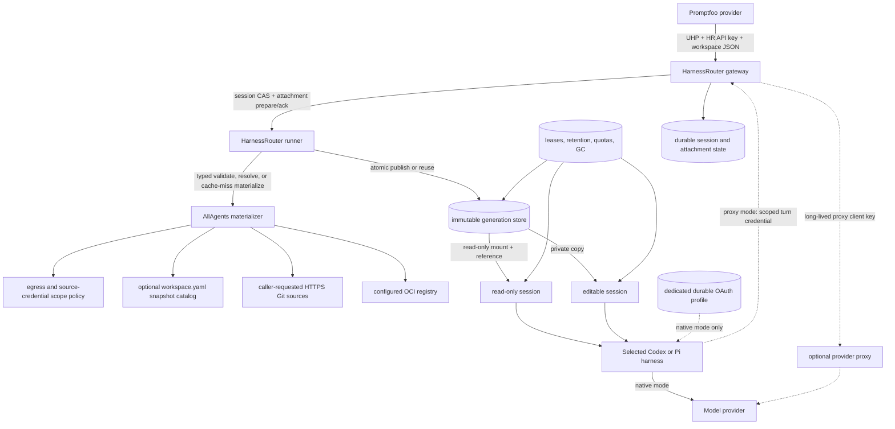

# UHP Coding-Agent Execution through HarnessRouter - Plan

## Goal Capsule

- **Objective:** Let Promptfoo and other authenticated UHP clients run a
  configured Codex or Pi harness against a verified AllAgents Git or OCI
  workspace generation. Concurrent read-only trials may share that immutable
  generation across harnesses and profiles; each editable trial receives a
  private writable workspace. A continuation reuses the same session attachment
  through `previous_response_id`. Default sessions expire under bounded policy;
  explicitly authorized persistent sessions remain pinned until deletion.
- **Means:** Deploy a pinned HarnessRouter CE fork. Preserve HarnessRouter's UHP,
  caller authentication, session, streaming, cancellation, artifact, and
  agent-runner behavior. Add a generic generation resolve/build/attach boundary,
  immutable generation store, read-only mounts, private editable copies, durable
  leases, retention and quota state, garbage collection, nested logical working
  directories, mode-specific checkpoint/collection behavior, and separation
  between session state and durable harness-native OAuth state. Implement
  Git/OCI semantics in a separate AllAgents executable. Codex authenticates
  through `codex login`; Pi
  authenticates through its `/login` flow for the selected provider. An
  API-key-authenticated proxy is an explicit last-resort target mode. Optional
  describes deployment configuration, not release scope: version one implements
  and verifies it for operators that reject the native owner-trust boundary.
- **Authority:** [ADR 0002](../decisions/0002-adopt-uhp-through-harnessrouter.md)
  owns the protocol, fork, trust, generation, attachment, retention,
  harness-authentication, and provider-routing decisions. UHP `2026-09-12` and
  HarnessRouter's conformance suite own execution-wire behavior. The namespaced
  UHP JSON extension owns caller-supplied HTTPS Git URLs, refs, destinations,
  per-session source selection, access, retention request, workspace-relative
  working directory, and provenance semantics. Project `workspace.yaml` remains
  ordinary local workspace configuration plus the optional operator-owned OCI
  snapshot catalog;
  it is not a Git origin catalog for UHP. HarnessRouter deployment configuration
  owns egress policy, source-credential scope mappings, harness IDs, model
  allowlists, authentication bindings, persistence authorization, finite TTLs,
  quotas, and garbage-collection policy.
- **Execution order:** First build the minimal custom image and pass the blocking
  native-auth adapter gate for both Codex and Pi without implementing the
  AllAgents materializer. Then prove the generation claim/publication seam,
  shared read-only attachment, private editable derivation, lease fencing, and
  retention state against the real runner. Freeze the generic hook and
  AllAgents contracts; implement Git then OCI generation construction; implement
  TTL/pinning, quotas, deletion, and garbage collection; prove explicit proxy
  mode separately; run concurrent read-only, editable, continuation, expiry, and
  Promptfoo E2E; complete release, fork-maintenance, and upstream documentation.
- **Stop conditions:** Stop before production workspace implementation if either
  required native target cannot pass the phase-zero gate: real login, first turn,
  continuation, binding persistence, profile isolation, mutually exclusive
  overlapping turns, refresh fault behavior, and passive-persistence checks.
  Also stop if the host cannot enforce immutable multi-session read-only mounts;
  concurrent identical requests can publish more than one generation; editable
  sessions can alias writable state; continuation, lease, expiry, deletion, and
  GC cannot be fenced crash-safely; protected state can be evicted; retained
  storage cannot be bounded; nested Git workspaces cannot be collected without
  corrupting HarnessRouter checkpoints; source credentials enter a generation or
  harness; the gateway/runner serializes harness OAuth files into source,
  checkpoints, produced records, passive logs, or public metadata; or the fork
  cannot preserve stock UHP behavior. Do not fall back to prompt instructions,
  an MCP acquisition tool, client-side repository upload, another generation,
  access or retention mode, OAuth profile, implicit API-key route, second
  execution protocol, or parallel task/session engine.
- **Tail ownership:** Implementation owns focused tests in both repositories,
  upstream UHP conformance, built-image smoke tests, exact Git/OCI E2E, native
  Codex/Pi OAuth and explicit proxy-mode E2E, two-turn Promptfoo success and
  failure verification, credential boundary checks, documentation, and a clean
  upstreamable HarnessRouter patch series.

---

## Product Contract

### Summary

AllAgents uses HarnessRouter as the execution gateway.
HarnessRouter exposes UHP, authenticates callers, creates and persists sessions,
streams events, runs configured Codex and Pi harnesses, handles cancellation and
idempotency, and returns output, usage, and artifacts.

The missing product-specific capability is deterministic source-generation
resolution before the first agent turn. A focused HarnessRouter fork calls a
generic hook after allocating the UHP session but before provider selection. The
Promptfoo request names the HTTPS Git repositories to load; the AllAgents
executable validates those URLs against deployment egress policy, resolves an
immutable source plan, and builds verified staging only on a generation cache
miss. The runner atomically publishes or reuses the generation, records the
session attachment and retention state, then mounts it read-only or creates a
private editable copy before provider dispatch.

A continuation supplies `previous_response_id`, omits the workspace extension,
and uses HarnessRouter's current native conversation plus the bound attachment.
Read-only sessions see the same immutable generation; editable sessions see the
same private mutations. A different source ref, working directory, access mode,
retention class, harness, or authentication binding requires a new session.
An expired or deleted session is never silently rematerialized.

### Problem Frame

HarnessRouter already implements the generic execution concerns. Reimplementing
them in AllAgents would add a second protocol, lifecycle, session store, process
supervisor, artifact model, provider integration, and conformance burden without
differentiating the product.

Stock HarnessRouter does not expose a documented generic pre-turn seam for a
server-side Git/OCI descriptor. It does not copy arbitrary request metadata into
response metadata or forward it to ordinary Codex/Pi runners. Input files are
written before the agent and support nested paths, but client-side expansion
loses exact symlink, mode, Git-history, and OCI layer semantics and makes every
caller responsible for acquisition. The temporary fork closes those seams.

### Actors

- **A1. UHP caller:** Promptfoo or another application holding a HarnessRouter
  API key. It chooses a configured HarnessRouter harness ID and model, prompt,
  caller-supplied HTTPS Git repositories or configured OCI snapshot, initial
  workspace policy, and optional continuation predecessor.
- **A2. HarnessRouter gateway:** Authenticates and validates UHP; owns response
  and session identity; is the sole writer of session attachment, expiry, and
  tombstone state; treats the configured workspace metadata value as bounded
  opaque JSON; drives prepare/ack before provider fallback; and returns hook
  metadata on every response path.
- **A3. AllAgents materializer:** A subprocess executable that exposes no
  listening service. It validates the AllAgents descriptor and caller Git URLs,
  reads deployment acquisition policy and the optional project OCI snapshot
  catalog, resolves immutable Git/OCI source plans, builds private staging on
  cache misses, validates the tree, and returns generation identity and
  provenance. It never authorizes persistence or publishes live state.
- **A4. HarnessRouter runner:** Owns generation claims/publication and the
  resource journal: provisional pins, durable references, read-only mounts,
  private editable copies and quotas, per-session operating-system identity and
  runtime state, mode-specific checkpoints and produced files, safe nested cwd,
  selected Codex/Pi process, conversation state, active-turn auth projection,
  cleanup, and garbage collection. It prepares attachment evidence but never
  writes gateway session attachment/expiry/tombstone transitions.
- **A5. Harness-native auth profile:** One dedicated durable credential root for
  one Codex or Pi harness target. The harness owns login and token refresh. The
  runner projects it only for an active turn and verifies teardown before
  acknowledgement; checkpoints, backups, and public metadata never copy it.
  Active harness access is part of the owner-trust boundary.
- **A6. Optional authenticated proxy:** A last-resort, explicitly configured
  target mode. The gateway keeps the long-lived proxy client key, the proxy owns
  upstream provider authentication, and the harness receives only a
  non-refreshable, scoped turn credential that the HarnessRouter broker validates.
- **A7. Operator:** Pins and deploys the custom image, mounts durable generation,
  session, editable-workspace, and auth storage, completes each native harness
  login, configures HTTPS egress and optional source-credential scopes,
  authorizes persistent sessions, configures finite TTL/byte/inode/count/
  tombstone quotas, operates deletion and GC, selects explicit proxy targets,
  and controls private-network access.

### Key Decisions

- **Use UHP as the northbound contract.** UHP `2026-09-12` is the only
  northbound execution contract. HarnessRouter conformance is authoritative.
- **Fork narrowly and upstream later.** Delivery uses an AllAgents-maintained
  fork. The upstreamable layer is a configured opaque-metadata key, immutable
  first-turn binding, typed validate/resolve/materialize envelopes, generation
  claim/publication, attachment prepare/ack and lease lifecycle, safe nested cwd,
  mode-specific checkpoint/collection integration, bounded retention/GC, and
  separation of durable harness-auth state from session state. It contains no
  AllAgents Git/OCI schema logic. Upstream acceptance is not critical-path.
- **Run the AllAgents component behind HarnessRouter.** The materializer is a
  subprocess hook, not another HTTP gateway and not a custom agent backend.
- **Publish once per generation; attach once per session.** Concurrent requests
  for one immutable source plan share one claim and verified publication.
  Read-only sessions share that generation; editable sessions receive private
  writable copies. Continuations omit the extension and reuse the original
  attachment through `previous_response_id`.
- **Separate access from retention.** `readOnly` versus `editable` controls
  mutability. Default `session` versus authorized `persistent` controls
  lifetime. Neither axis changes the other, and continuation can change neither.
- **Bound retained state.** Active leases, durable references, provisional pins,
  and persistent sessions are protected. Expired state and bounded tombstones are
  purged before deterministic eviction of unreferenced/unpinned generations.
  Admission fails when protected state consumes finite quota.
- **Let authenticated callers select Git origins.** Promptfoo supplies canonical
  HTTPS Git URLs, optional refs, and unique destinations. The same URL may appear
  more than once at different refs or destinations. The service accepts any
  repository reachable through safe public egress; callers cannot supply
  credentials, non-HTTPS transports, host paths, commands, or Docker options.
- **Use one canonical workspace vocabulary.** The execution descriptor keeps
  `url`, optional `ref`, `destination`, and logical `workingDirectory`; response
  provenance keeps `requestedRef` separate from `resolvedCommit`. Local
  `workspace.yaml` repository entries keep `path` and replace the provider-
  specific `source` plus `repo` pair with one canonical `url`. Benchmark-specific
  aliases are accepted only by future adapters, never by the canonical schema.
- **Keep benchmark task/environment identity separate from workspace source.**
  Harbor task repositories and `environment.docker_image`, and SWE-bench/Hugging
  Face `repo`, `base_commit`, and instance images, are adapter inputs. A runnable
  benchmark image is not an AllAgents source-only `workspaceSnapshot`; direct
  task packages, environment images, and verifiers need a separate versioned
  boundary if added later.
- **Prefer harness-native OAuth.** Promptfoo's HarnessRouter API key authenticates
  the UHP caller only. Codex and Pi use their own login, token storage, refresh,
  and provider request path; native mode has no provider-route API key.
- **Make proxy auth explicit.** `proxyApiKey` is a last-resort target mode for a
  compatibility or stronger-isolation requirement. It is optional to configure
  but remains required version-one implementation and verification scope. OAuth
  failure never activates it, and a session never changes its persisted
  authentication binding.
- **Preserve stock UHP requests.** Requests without the configured metadata key
  behave exactly as upstream.
- **Use a custom HarnessRouter image.** The image combines a pinned HarnessRouter
  revision, reviewed patch series, pinned agent runtimes, and the AllAgents
  materializer executable.
- **Publish from an AllAgents-owned registry.** Release the public image as
  `ghcr.io/allagentsdev/harnessrouter`; tags identify releases, but deployment
  and E2E pin the published manifest digest.

### Requirements

#### UHP, authentication, and routing

- **R1.** Pin HarnessRouter CE to a reviewed upstream commit and UHP version
  `2026-09-12`. The deployment must pass the applicable upstream conformance
  suite without weakening, replacing, or reinterpreting stock UHP behavior.
- **R2.** Require a HarnessRouter API key for every externally reachable UHP,
  response/session retrieval, stream, cancellation, file, artifact, persistence,
  deletion, and lifecycle-administration endpoint. Reject unauthenticated
  requests before disclosing resource existence, expiry, retention, or metadata.
  Gateway-to-runner operations are not externally routable and are
  mutually authenticated. Bind the service to loopback or a private interface
  and document the remaining need for Tailscale ACLs, firewall policy, or
  equivalent network controls.
- **R3.** HarnessRouter deployment configuration owns stable harness IDs,
  backend, model allowlist, and exactly one auth binding:
  `{ mode: "nativeOAuth", profile: ConfigName }` or
  `{ mode: "proxyApiKey", connection: ConfigName }`. A proxy connection is a
  closed server-side record containing private HTTPS base URL, expected TLS
  identity/CA, HarnessRouter-supported API format and endpoint set, gateway-only
  proxy-client-key secret handle, broker audience, and requested-to-proxy model
  map. Callers cannot override any field. Requests select a harness with stock
  `metadata.harness_id` and a model with `model`; AllAgents profiles are not
  projected into this catalog. Codex and Pi targets default to `nativeOAuth`.
  A target is advertised only after its selected auth binding passes: profile
  login/refresh/live-turn checks for native OAuth, or schema, TLS, broker,
  model-map, endpoint, and live compatibility checks for `proxyApiKey`. On the
  first turn, the gateway persists the harness target, auth mode, binding
  identity, and canonical binding-config digest in the session. Continuations
  require that exact binding; deployment config changes never switch it.
- **R4.** Add a durable auth root outside session workspaces with one
  least-access profile directory per harness target. Controlled setup runs
  `CODEX_HOME=<profile> codex login` with file credential storage for Codex or
  runs Pi `/login` in an isolated Pi home for the configured provider. The
  runner projects only the selected profile's exact auth files into the
  session-specific CLI home and keeps conversation/rollout state session-scoped.
  The projection exists only for the active turn. It uses a directory-level
  mount namespace or an equivalently isolated same-filesystem view that preserves
  the harness's credential-file write and atomic-replacement behavior; it never
  copies credentials into durable session state.

  A locally committed refresh uses a same-filesystem temporary file, file
  `fsync`, atomic rename, parent-directory `fsync`, and validation. A crash after
  the provider rotates credentials but before local commit can leave the profile
  stale; restart then marks it `repair-required` and requires native login
  instead of changing profile or auth mode. After the harness and descendants
  stop, but before terminal acknowledgement or profile-lock release, the runner
  commits or rejects refresh state, unmounts and removes the projection, and
  verifies that credential paths are absent from the retained CLI home. Startup
  removes or quarantines stale projections before readiness or profile
  reacquisition. Success, failure, cancellation, crash repair, expiry, deletion,
  checkpoint, backup, and produced-file paths all preserve this boundary.

  The gateway/runner must not automatically serialize auth files into root or
  nested checkpoints, produced-file records, passive logs/traces, materializer
  input, backup, or response metadata. Native mode sets explicit owner trust
  because the harness and tool subprocesses sharing its operating-system
  identity may read or emit that credential. In `nativeOAuth`, version one
  supports exactly one active refresh-capable turn per profile and holds that
  profile lock for every turn and every login, logout, or repair operation.
  Admission preserves UHP precedence with an atomic `Idempotency-Key` claim
  around lookup and admission. The single claim owner proceeds; simultaneous
  same-key arrivals wait on that claim and receive the owner's result without a
  second profile-lock attempt. If the owner fails before response allocation,
  the gateway publishes that same request error to current waiters and removes
  the claim so a later retry can try again. A new turn in an already-active
  session returns `session_busy`; only then does a genuinely new executable turn
  try the native profile lock. Cross-session collision returns HTTP 503
  `harness_unavailable` with
  `detail.reason: "allagents_auth_profile_busy"` before response allocation,
  runner work, or materialization. No per-profile waiter queue exists; the UHP
  idempotency claim wait is part of one logical request, not such a queue.

  For a continuation, the gateway's one session CAS checks `session_busy`,
  attachment/binding evidence, and expiry/deletion together. On success it
  records the original idle deadline in a provisional turn-admission fence,
  clears that deadline, and marks the session admission-pending before the runner
  tries the zero-waiter profile lock. A same-session collision changes nothing.
  If profile admission fails before response allocation, the gateway rolls the
  fence back: it restores the exact original deadline when still future, or
  tombstones the session when that deadline has elapsed. Only a returned profile
  admission token commits the fence to active.

  Admission is a private runner operation: the runner turn supervisor persists
  an active-profile admission record, takes the operating-system advisory lock,
  and returns an opaque admission token before the gateway allocates a response.
  The runner—not the gateway—owns that lock through descendant termination,
  refresh commit, and projection teardown. A gateway-only crash therefore leaves
  the lock held; restart reconciles the token and active runner before admitting
  another turn. The runner releases only after the gateway acknowledges durable
  terminal response/state, and after the runner has committed native refresh
  state or marked the profile `repair-required` and proved the projection absent.
  If the runner process dies, the OS releases the lock, but its durable admission
  record keeps readiness/admission closed until startup proves all descendant
  boundaries empty, removes stale projections, and validates or repairs the
  profile. Ordinary and administrative paths use one `finally` release/ack
  protocol. `proxyApiKey` uses no native profile lock. Operators provision
  distinct native profiles when they require parallel turn capacity. Preserve
  HarnessRouter streaming, cancellation, idempotency, files, artifacts,
  retention-bounded completed session persistence, per-session UID/runtime
  isolation, and immutable generation sharing.

#### Workspace extension and hook

- **R5.** On an initial response request, accept one optional JSON object of at
  most 64 KiB and 32 levels at `metadata["allagents.workspace"]`.
  HarnessRouter checks only generic bounds, canonicalizes the opaque value with
  RFC 8785, records the raw request descriptor digest, and binds it to the new
  session. A continuation must omit this key; generic gateway validation rejects
  an extension-bearing continuation before session lookup/CAS and changes no
  session state or deadline. The AllAgents hook's source-free `validate`
  operation validates and defaults the exact v1 object
  `{ version: "1", access, retention?, source, workingDirectory? }`.
  `access` is exactly `readOnly | editable`; omitted `retention` means `session`,
  otherwise it is exactly `session | persistent`.

  `source` is exactly one of:
  - `{ kind: "repositories", repositories: NonEmptyArray<{
    url: HttpsGitUrl, ref?: RefText, destination: RelativeDirectory }> }`; or
  - `{ kind: "workspaceSnapshot", snapshotName: ConfigName,
    imageManifestDigest: Digest, workspaceManifestDigest: Digest }`.

  `workingDirectory` is exactly `{ kind: "workspaceRoot" }` or
  `{ kind: "workspacePath", path: RelativeDirectory }`. The workspace path is
  relative to the mounted workspace and must name a directory in the resolved
  source manifest. It works for both repository and snapshot sources. The hook
  validates and reports requested retention but never authorizes it.
  The runner is the sole persistence authority: before source resolution or byte
  acquisition it authorizes `persistent`, reserves the session and persistence
  slots, or fails `allagents_workspace_persistence_forbidden`.
- **R6.** The AllAgents hook expands omitted `retention` to `session` and omitted
  `workingDirectory` to `{ kind: "workspaceRoot" }`; an omitted repository `ref`
  remains absent and means the remote symbolic HEAD. It canonicalizes each HTTPS
  URL, NFC-normalizes strings, sorts repository entries by destination, rejects
  unknown fields, and hashes RFC 8785 bytes as the effective descriptor digest.
  A separate canonical generation key covers only inputs that can affect source-
  visible bytes, declared agent-visible filesystem semantics, or sharing
  authorization: hook/schema versions, deployment authorization scope, normalized
  caller Git URLs, bounded selected credential-reference identities, resolved
  commits or the exact OCI `imageManifestDigest` and
  `workspaceManifestDigest`, normalized destinations, `snapshotName` when
  applicable, and acquisition/egress policy version. Access, retention, logical
  cwd, harness/profile, session identity, physical paths, credential values, and
  volatile Git administrative representation do not fragment that key.
  Publication binds it to the independently verified workspace-manifest digest
  and semantic Git record when applicable.
  Omitted and explicit default values have the same effective descriptor digest.
  The raw request descriptor digest records the exact initial JSON only in
  private session state; public response metadata names and returns only
  `effectiveDescriptorDigest`.
- **R7.** Replace the one-shot session materialization call with one private
  runner `/workspace/prepare` operation outside the provider candidate loop. It
  invokes a configured executable directly without a shell using typed
  `validate`, `resolve`, and `materialize` commands. `validate` performs only
  source-free schema/default/URL/destination/policy checks and returns a private
  normalized descriptor reference/digest plus effective access, requested
  retention, logical cwd, effective descriptor digest, and the bounded sorted
  credential-reference names/opaque IDs selected by deployment policy for the
  requested URLs—not values. The runner verifies those references were
  declared by preflight and that their handles exist, then maps only that selected
  set into source-access child environments. After runner authorization and
  admission, `resolve` consumes that exact validated descriptor and selected set,
  resolves exact Git commits or OCI identity, and returns a private canonical
  resolved-plan path/digest, generation key, effective cwd, and bounded public
  provenance. `materialize` receives that exact resolved-plan path/digest and
  selected set and never re-resolves source.

  For each ready lookup or completed build, the runner validates ready evidence
  and acquires a durable provisional attachment pin under the same generation
  lock before returning it to one session. A miss creates one runner-owned keyed
  build claim with a configured maximum lifetime of at most 900 seconds,
  independent of any one UHP request deadline. The claim atomically takes
  ownership of the validated source-only resolved-plan bytes and selected
  credential-reference identities in its private durable root and binds their
  digest to the key before acquisition.
  Concurrent sessions attach as waiters to that claim. Each waiter applies its own
  cancellation and deadline; cancellation detaches only that waiter, the build
  continues while any live waiter remains, and the runner cancels and cleans the
  build when none remain. All live waiters receive the one publication or build
  failure without making one request's shorter deadline authoritative for the
  others.

  The validate request carries the bounded ordinary workspace-input-file count
  so `readOnly` fails before source access. Before response allocation, the
  idempotent admission transaction reserves one generic workspace-session slot
  and one fixed-size tombstone slot; it publishes neither token nor response
  unless both are durable. These reservations remain through post-allocation
  validation failure, failed-response retention, tombstoning, and purge. After
  validate but before resolve, the runner authorizes and reserves any
  persistence slot and, for `editable`, creates one stable private-reservation ID
  for the full configured per-session byte/inode allowance.

  Before a miss claim acquires source bytes, its owner reserves the full
  configured staging and prospective-generation byte/count allowance. After
  materialization, the runner's independent no-follow full-tree walk, including
  separately validated Git administrative state, computes physical retained
  byte/inode usage. Under the generation lock, successful publication atomically
  converts the prospective generation reservation to actual usage, releases its
  excess and the staging reservation, and persists that accounting transition
  before ready state or waiter pins become visible. Private copy-fit is not a
  shared-build condition: after publication, each editable waiter compares total
  physical generation bytes/inodes with its own hard allowance. A waiter that
  cannot fit fails `allagents_workspace_private_quota_exceeded` and releases only
  its access-specific reservations/pin; read-only and fitting editable waiters
  continue. If none remain, the valid ready generation has zero pins and is GC
  eligible. Build failure occurs before publication or attachment and before
  agent launch; unpublished staging and access/build-specific reservations/pins
  release exactly once, while generic session/tombstone reservations follow
  failed-response lifecycle.

  Hook stdin is at most 128 KiB, stdout 1 MiB, and stderr 64 KiB. Source values
  come from an owner-only runner secret mount or credential-store handle, never
  the gateway/runner base environment. Preflight returns bounded configured
  credential-reference identities but receives no values; the runner verifies
  handle presence itself. For each source-access operation it resolves only the
  selected validated references and constructs the allowlisted child
  environment. Startup and per-request rechecks reject configured secret names
  or values in the service or agent environment.

  Before injecting secrets, the runner creates a per-hook cgroup v2 leaf under a
  delegated subtree and starts the child inside it atomically with
  `clone3(CLONE_INTO_CGROUP)` or a stopped, secret-free pre-exec
  move-and-verify handshake. On every outcome it closes streams, uses
  `cgroup.kill` when needed, and proves `cgroup.events` reports `populated 0`
  before accepting success, reading private results, publishing a generation,
  releasing secrets, or cleaning roots. A completed parent with a live
  descendant fails `allagents_workspace_containment_breach`. An unquiescent leaf
  enters internal `containment_pending`; the runner exits, restart keeps
  readiness false, and no terminal result becomes public until the old boundary
  is proven empty.

  A completed materialize result contains only generation-scoped data: the
  generation key, private `workspace-manifest.json` reference/digest, declared
  repository roots, semantic Git validation records when applicable, and bounded
  verified source identity. Each waiter retains its own effective descriptor
  digest, logical cwd, access/retention, and requested-source provenance from
  validate/resolve; a shared build result never overwrites them. The runner
  independently validates the result, staged tree, manifest, and key, then makes
  the generation backing tree owner-writable only and atomically publishes it. A
  hook failure never enters provider fallback.
- **R8.** Persist separate CAS-protected state machines. A generation epoch is
  `absent -> building -> ready`, `quarantined`, or `deleting`; it stores its key,
  unique internal epoch ID, `publishedAt`, nullable `lastUsedAt`, manifest digest,
  publication/accounting marker, physical byte/inode counts, durable reference
  count, provisional attachment pins, and build waiters. There is at most one
  live publication per key/epoch and one result per concurrent claim. A new epoch
  for the same key may begin only after the prior epoch's durable logical and
  physical eviction completes; it serves new sessions only. Attachments bind key
  plus epoch, so an existing session never substitutes a rebuilt epoch.

  A gateway-owned session attachment is
  `unbound -> validating -> resolving -> attaching -> ready`,
  `containment_pending`, `expired`, `deleting`, `deleted`, `purged`, or `failed`;
  it stores raw/effective descriptor digests, generation key/epoch, access,
  retention, logical cwd, expiry, harness/auth binding, runner-supplied
  attachment evidence, and any provisional turn-admission fence with its original
  deadline. The gateway is the sole writer of session attachment, expiry, turn-
  admission-fence, and tombstone transitions. The runner alone writes its
  generation and resource journal.

  Before provider dispatch, the runner prepares resources and durably returns an
  opaque attachment token and evidence; it does not bind the gateway session.
  The gateway CASes `attaching -> ready`, persists that evidence, and
  acknowledges the token. For `readOnly`, the runner holds the provisional pin
  while it acquires a session-long generation-epoch reference and verifies a
  read-only mount with no writable alias; after the ready acknowledgement it
  releases the provisional pin exactly once. For `editable`, it requires the
  stable private-reservation ID admitted before resolve and compares the
  generation's independently measured total physical bytes/inodes with that
  allowance. Failure detaches only that waiter. A fitting waiter creates and
  validates a unique writable copy with no mutable inode shared with the
  generation and initializes root/nested checkpoints and collection baselines.
  Its attachment evidence contains the epoch and opaque reservation ID. Ready
  acknowledgement transfers the reservation from admission to the private
  workspace without a second debit, then releases the provisional pin exactly
  once. Failure before acknowledgement releases the reservation and prepared
  resources once unless reconciliation proves that the gateway committed ready.
  Expiry or deletion releases the ready workspace's reservation once. Startup
  reconciles both halves of this prepare/ack and quota-transfer protocol.

  The editable hard quota covers the private tree, UHP input overlays,
  root/nested checkpoints, and produced-file state for every turn and
  continuation. The filesystem quota backend must deny writes beyond either
  byte or inode allowance and surface exhaustion to the runner; the runner
  terminates that turn as failed `allagents_workspace_private_quota_exceeded`
  without changing access or retention. Actual usage and reserved allowance are
  persisted and reconciled before readiness. Only editable state receives
  ordinary UHP input files, mutation checkpoints, and produced-file collection.
  A `readOnly` request containing workspace input files fails before source
  acquisition.

  `lastUsedAt` remains null until the gateway commits an attachment `ready`.
  After acknowledgement, the runner updates it under the generation lock to
  `max(existing, readyCommitTimestamp)`; startup can replay a missed update
  idempotently from committed gateway evidence. GC orders null `lastUsedAt`
  epochs first by `publishedAt`, generation-key bytes, and epoch-ID bytes; then
  non-null epochs by `lastUsedAt`, `publishedAt`, key bytes, and epoch-ID bytes.
  Publication or failed prepare does not count as use.

  A continuation requires attachment `ready`, the exact generation key/epoch,
  access, retention, harness, and auth binding, and either persistent retention
  or a `session` idle deadline strictly later than the admission instant. One CAS
  also rejects `session_busy`, saves and clears that deadline in a provisional
  admission fence, and marks admission pending. Profile success commits active;
  pre-allocation profile failure restores the saved future deadline or tombstones
  the session if it elapsed. Only durable terminal acknowledgement starts a new
  idle deadline. GET, stream polling, and idempotent replay do not renew it.
  Missing or corrupt attachment evidence fails non-resumable without acquisition
  replay or replacement. Provider fallback sees only `ready` state and cannot
  resolve, build, attach, or change policy.
  The runner resolves a symlink-safe logical cwd
  beneath the mounted generation or private workspace and rejects cross-session
  or escaping paths.

#### Source acquisition and provenance

- **R9.** Make one clean public `workspace.yaml` repository-schema cutover:
  retain `repositories[].path` as the existing or managed local checkout
  location; replace the provider-specific `source` plus `repo` pair with one
  optional canonical credential-free HTTPS `url`; retain `branch` because
  managed synchronization implements branch checkout and pull rather than
  arbitrary detached refs. Path-only unmanaged entries may omit `url`; any
  truthy `managed` entry requires it. `workspace repo add` records a normalized
  URL, converting recognized SSH provider remotes to canonical HTTPS without
  persisting userinfo. An explicit one-time migration rewrites unambiguous
  legacy provider/identifier pairs and rejects unknown or credential-bearing
  forms with repair guidance. The normal parser and generated v2 schema accept
  only the new shape; there is no dual-field compatibility path.

  The execution materializer parses the project `workspace.yaml` through that
  authoritative schema only for optional strict project-owned
  `workspaceSnapshots` entries:
  `{ name: ConfigName, repository: OciRepository,
  workspaceManifestMediaType: MediaType, executionCredential?: "${ENV_VAR}" }`.
  Reject unknown fields, literal secrets, and duplicate snapshot names; snapshot
  entries do not merge with user configuration. Local `repositories[].url`
  entries never form an execution allowlist and are not copied into a UHP
  request.

  Repository mode takes one through 128 request entries. Each has a canonical
  absolute `https` `url`, optional `ref`, and unique, pairwise non-overlapping
  `destination`. URLs need not be unique. Before parsing, reject ASCII controls,
  whitespace, and backslashes. Parse once with the WHATWG URL Standard and
  require the input bytes to equal its serialized URL exactly. The serialization
  must have an ASCII lowercase IDNA A-label DNS hostname without a trailing dot,
  no userinfo/query/fragment or IP literal, no explicit default port, a non-empty
  repository path, and no percent-encoded control, slash, backslash, or dot
  segment. The same serialization and structured `(scheme, host, effectivePort)`
  origin are used for policy, credentials, redirects, DNS, provenance,
  generation identity, and the exact Git/libcurl request. Local paths and non-
  HTTPS schemes fail source-free validation. Destinations are non-empty,
  non-root relative child paths and cannot collide with HarnessRouter's root
  checkpoint repository. Duplicate or ancestor/descendant destinations, escaping
  destinations, and unsupported URL forms also fail.

  HarnessRouter deployment configuration owns harness/model/provider targets,
  persistence authorization, TTLs, quotas, GC, outbound egress policy, and
  optional source-credential scope mappings. A scope is either an exact
  structured origin or an origin plus canonical repository-path segment prefix;
  path prefixes match only complete segments, never raw strings. The matching
  rule with the most path segments selects one secret reference; callers never
  select the reference or supply its value. No match means anonymous acquisition.
  Deployment policy may narrow public egress but does not require every
  repository URL to be predeclared. Project `workspace.yaml` never contains
  session access, retention, lease, or eviction state.
- **R10.** Repository mode materializes exactly the caller-declared repository
  set. Use the requested `ref`, or the remote symbolic HEAD when omitted.
  `RefText` is at most 255 ASCII bytes and is either a full 40-hex object ID or a
  `git-check-ref-format`-equivalent ref name. Reject leading dashes, whitespace
  and controls, refspec colons, glob metacharacters, traversal-like components,
  `@{`, and `.lock` components. Resolve a validated full ref, or an unambiguous
  shorthand under `refs/heads/` or `refs/tags/`, with `ls-remote`; accept object
  IDs only when advertised. Subsequent fetch/checkout commands receive only the
  verified object ID with explicit end-of-options handling, never caller ref text.

  Allow only argument-vector HTTPS Git operations through the deployment's
  acquisition egress connector. The child cannot bypass it: clear every proxy/
  `NO_PROXY` environment variable, disable Git `http.proxy` and remote proxy
  configuration, and permit no direct network path. Before every connection and
  each of at most five HTTPS redirects, resolve the canonical hostname and reject
  the entire answer set if any address is loopback, link-local, private, reserved,
  metadata, or otherwise non-public; pin one approved address for that connection
  so DNS rebinding cannot escape the check. Parse and serialize every redirect by
  the same URL rules and compare structured origins. Re-evaluate the originally
  selected credential scope at every hop, strip its credential whenever the
  target leaves that scope—including a same-origin path-prefix escape—and never
  select a new credential because of a redirect.

  Use an isolated HOME plus `GIT_CONFIG_NOSYSTEM=1`, no global config,
  `credential.useHttpPath=true`, and an explicit ephemeral credential helper
  bound to the selected structured origin/path scope. The helper independently
  rejects any protocol, host, effective port, or canonical repository path
  outside that rule. Disable hooks, `protocol.file`, `protocol.ext`, submodule
  recursion, Git LFS hydration, and configured clean/smudge filters.
  Preserve each repository's `.git` directory for the coding agent, but do not
  treat volatile Git administrative bytes as generation identity. The
  materializer constructs a hermetic detached-HEAD repository at the resolved
  commit, removes reflogs, `FETCH_HEAD`, lock/shallow/replace/graft state, hooks,
  worktree links, alternates, extra refs, unreachable objects, and
  credential-bearing configuration, and normalizes the allowed config/ref set
  and index. The workspace manifest excludes declared repository `.git`
  administrative subtrees. The runner separately proves each allowed `.git`
  path belongs to its declared root; HEAD resolves to the recorded commit; the
  index equals that commit tree with no staged delta; configuration and refs are
  closed; and the object database equals the complete transitive object closure
  of the commit with no missing, corrupt, or extra objects. It records a canonical
  sorted object-ID/type/size-set digest as part of semantic Git state.

  The runner independently reads each resolved commit tree, prefixes it with that
  repository's destination, and requires the complete source-visible manifest to
  equal exactly the union of those trees plus only the destination ancestor
  directories needed to connect them. Undeclared files, links, or directories
  outside that union fail integrity validation. Publication records the semantic
  Git validation alongside the manifest digest. Pack compression/layout and
  index stat-cache data may vary physically but cannot change the semantic
  Git-state record, generation key, or source-visible manifest digest. Failure
  never falls through to snapshot mode or another credential identity.
  Limit one materialization to 128 repositories, 500,000 filesystem entries, and
  32 GiB across the staged workspace. A count or byte violation returns failed
  `allagents_workspace_limit_exceeded`. Exhausting the declared UHP time budget
  returns `incomplete` with `error: null`; only an unexpected execution timeout
  before that budget returns failed `timeout`. Every outcome proves the cgroup
  empty before removing staging and starts no provider.
- **R11.** Snapshot mode constructs a server-side immutable OCI reference from
  the repository configured by `snapshotName` and the caller-provided
  `imageManifestDigest`. Accept only a direct OCI image manifest with at most 64
  distributable tar/gzip/zstd layers. Its config descriptor must use the catalog
  entry's configured workspace-manifest media type and address the canonical
  bytes selected by `workspaceManifestDigest`; redirects may not change registry
  authority. Verify both named manifests plus every layer size and digest before
  use; apply OCI whiteouts;
  limit the image manifest to 4 MiB, the workspace-manifest blob to 128 MiB,
  its `repositories` array to 128 items, total compressed layers to 8 GiB,
  expanded bytes to 32 GiB, entries to 500,000, one regular file to 4 GiB, paths
  to 4096 UTF-8 bytes and 128 components, and one PAX/extended header to 1 MiB.
  The runner independently rejects a 129th repository root even when the archive
  and fetched manifest otherwise agree. Reject devices,
  sockets, traversal, escaping links, sparse files, unknown or foreign layers,
  mutable tags, and undeclared output. Recompute the canonical workspace
  manifest from staging and require it to match both the fetched manifest bytes
  and `workspaceManifestDigest`. Snapshot mode rejects `.git` administrative
  subtrees; snapshots that require Git history use repository mode. After
  publication the runner creates private collection baselines from the verified
  trees so later produced-file reporting remains truthful.

  Both source modes produce the same reusable immutable-generation abstraction.
  Repository `.git` state is readable but immutable in `readOnly` attachments and
  independently writable only in private `editable` copies. Generation
  acquisition limits apply per build; retained-generation and private-workspace
  quotas apply independently.
- **R12.** Extend HarnessRouter's response translator and stored-response paths
  with a stage-dependent contract. Before attachment `ready`, non-2xx request
  errors and allocated terminal failures omit
  `response.metadata["allagents.workspace"]`; error codes identify the failed
  stage, and no placeholder or partial/unverified generation identity is emitted.
  Once attachment commits `ready`, streaming events, provider terminal responses,
  GET, background completion, and idempotent replay return the same immutable
  bounded fields: extension version, `effectiveDescriptorDigest`, public
  `generationId`, canonical workspace-manifest digest, logical cwd, access,
  resolved retention, source completeness, and resolved Git/OCI provenance.
  `generationId` is the SHA-256 digest of versioned RFC 8785 bytes containing
  only the returned normalized source provenance, normalized destinations, and
  workspace-manifest digest. It is metadata-only and is never a cache,
  authorization, attachment, or lookup key. Active streaming metadata has
  `expiresAt: null`. For `session` retention, durable terminal acknowledgement
  atomically sets `expiresAt`; the terminal event, stored response, GET,
  background completion, and idempotent replay then return that same timestamp.
  `persistent` always returns `expiresAt: null`. Metadata may return normalized
  caller-supplied repository URLs as provenance but never contains the private
  generation key, raw request digest, generation epoch, redirect-chain URLs,
  resolved network addresses, deployment credential-scope mappings or selected
  references, physical paths, credential values, lease/attachment/reservation
  tokens, counts, authorization rules, or other sessions' quota state.
- **R13.** The materializer resolves `${ENV_VAR}` references from its allowlisted
  child environment, uses hermetic Git/registry configuration, removes temporary
  auth files before returning, and emits no secret. Prove with a deliberately
  innocuous variable name and value that source credentials and the HarnessRouter
  caller API key are absent from the gateway/runner base environment, every
  staging tree, published generation, private editable workspace, agent
  environment, nested Git remote/config, generated CLI configuration, log,
  checkpoint, and response. In native mode there is no provider-route API key.
  The selected OAuth profile is intentionally readable by the harness trust
  boundary only through its active-turn projection; the gateway/runner never
  copies it into staging, generations, durable session homes, private workspace
  checkpoints, produced-file records, backups, passive logs, materializer input,
  or public metadata. Finalization and restart reconciliation verify projection
  absence. An active same-identity harness or tool can exfiltrate it; that risk
  is explicit in owner-trust mode.

  In proxy mode, the long-lived proxy client key and upstream provider
  credentials stay in their owning services. The non-refreshable broker token is
  bound to one proxy audience, harness target, model allowlist, response/turn ID,
  and the UHP deadline plus minimal clock skew. It may authorize the bounded
  provider requests, compaction, and retries required during that active turn;
  cancellation or terminal completion revokes it. Passive persistence never
  stores it. The HarnessRouter broker rejects wrong-audience, wrong-model,
  wrong-turn, expired, or revoked tokens.
- **R14.** Configure finite, nonzero limits for session idle TTL, staging bytes
  and concurrent builds, published-generation bytes/count, per-editable-session
  hard bytes/inodes, total private reserved bytes/inodes, total sessions,
  authorized persistent sessions, and tombstone bytes/count/TTL. Workspace
  response admission reserves one generic session slot and one fixed-size
  tombstone slot before making the response/session visible, so semantic
  validation failure and later expiry/deletion cannot escape capacity accounting.
  Those slots remain through failed-response retention and eventual
  tombstone/purge. Readiness is false when required policy is absent or lifecycle
  reconciliation is incomplete. Active work holds a durable lease and has no idle
  deadline. For `session` retention, one provisional continuation-admission CAS
  saves and clears a valid prior deadline; profile success commits active, while
  pre-allocation profile failure restores that deadline if future or tombstones
  if elapsed. Durable terminal acknowledgement starts a new deadline.
  `persistent` bypasses idle expiry only after the runner authorizes it and
  reserves its slot before source resolution. A post-allocation failure before
  valid retention exists uses the deployment's finite failed-response retention,
  then consumes its reserved tombstone slot and purges through the same bounded
  lifecycle.

  Collection atomically tombstones an expired or operator-deleted session before
  cleanup, fences new turns, waits for active processes and mounts to quiesce,
  deletes private state, releases each generation reference and quota reservation
  exactly once, and transitions `deleted -> purged` only after durable physical
  cleanup and tombstone retention. Tombstones contain only bounded identifiers
  and terminal lifecycle facts. Their TTL is at least the maximum response and
  idempotency retention; compaction has deterministic age/key order and durable
  accounting. While retained, continuation returns HTTP 410
  `allagents_workspace_expired`. After both tombstone and matching response/
  idempotency retention expire, the predecessor is indistinguishable from an
  unknown ID and receives the stock non-disclosing error; neither path resolves
  or materializes source.

  Generation GC evicts only ready epochs with zero durable references and zero
  provisional pins. Null `lastUsedAt` epochs sort first by `publishedAt`,
  generation-key bytes, and epoch-ID bytes; non-null epochs then sort by
  `lastUsedAt`, `publishedAt`, key bytes, and epoch-ID bytes. It rechecks both
  protections under the generation lock, durably records logical eviction, and
  completes physical deletion before permitting a new epoch for that key. Failed
  deletion stays quarantined and counted against quota. Startup reconciles
  generic admission slots, active leases, build/staging/prospective-generation
  reservations, publication/accounting markers, build waiters, provisional pins,
  references, mounts, private reservation transfers and actual usage, copies,
  tombstones, compaction, and deletion before readiness or GC. If only protected
  state remains, new admission fails
  `allagents_workspace_capacity_exceeded`; no protected state is deleted and no
  access, retention, source, profile, or provider route changes.
- **R15.** Build and publish a pinned `linux/amd64` custom HarnessRouter image as
  the public package `ghcr.io/allagentsdev/harnessrouter`. Replace or disable the
  inherited Docker Hub release path. The Dockerfile pins every base image by
  digest; runtime lockfiles and version-locked OS packages, Git/OCI tools, Codex,
  and Pi define the remaining build inputs. The build fails on any unpinned
  input. A no-write job builds, tests, and exports the identified image artifact
  using commit-pinned third-party actions. A separate protected,
  environment-approved publish job accepts only an approved release/tag ref and
  uses `GITHUB_TOKEN` with `contents: read`, `packages: write`,
  `attestations: write`, and `id-token: write`. It publishes unique version and
  commit tags as mutable discovery labels, reads back the registry manifest, and
  creates GitHub/Sigstore build-provenance and SBOM attestations whose subject is
  the final manifest digest. Package visibility is public and verified with an
  anonymous digest pull. Deployment fails unless both attestations verify the
  expected owner, repository, workflow, approved ref, subject digest, predicates,
  base-image digest, runtime lockfiles, OS package set, Git/OCI tool versions, and
  Codex/Pi versions. Release E2E uses that digest, never `latest`. Requests
  without the configured metadata key remain stock-compatible. CI rebases
  selected upgrades and runs upstream plus AllAgents integration tests.
- **R16.** AI Evals owns its Promptfoo provider. It sends the UHP request directly
  to HarnessRouter, maps Promptfoo variables to the closed extension, and maps
  terminal output, usage, artifacts, provenance, and failures to
  `ProviderResponse`. Every non-success follows the Failure Contract's exact
  status/error/retryability/metadata mapping; none becomes empty success or an
  automatic retry. Multi-turn cases retain the prior response ID and send it as
  `previous_response_id`. AllAgents documents the contract and examples but does
  not depend on Promptfoo at runtime.

### Key Flows

#### F1. Start the deployment

1. Launch the attestation-verified image in non-serving initialization mode with
   durable session, generation, editable-workspace, and auth volumes; finite
   idle TTL and staging/generation/private/session/persistence/tombstone quotas;
   caller key; materializer command; project snapshot configuration; public-
   egress enforcement; optional origin-to-secret-reference mappings; owner-only
   source-secret handle; native or proxy trust mode; delegated cgroup v2 subtree;
   and `on-failure` restart policy. Verify the image and mounted inputs before
   running checks that depend on them.
2. The runner validates read-only mount enforcement, private-copy isolation,
   finite lifecycle policy, storage relationships, and cgroup delegation. It
   reconciles incomplete generation claims/publications, build waiters,
   provisional pins, durable session references, mounts, private editable
   workspaces and quota usage, auth projections, tombstones/compaction, and
   interrupted deletions. Sweep orphaned cgroups and credential projections only
   after proving each old process boundary empty. Do not start GC or serving.
3. Run the mounted AllAgents hook's bounded `preflight` mode. It validates hook,
   egress-policy, optional snapshot-catalog, origin-mapping, credential-reference,
   and required Git/OCI tool syntax without repository URLs, source network
   access, or secret values. It returns the bounded configured credential-
   reference identities; the runner verifies their credential-store handles.
4. In a controlled operator context, initialize each dedicated auth profile:
   run Codex login with that target's `CODEX_HOME`, or run Pi `/login` with that
   target's isolated Pi home and configured provider. Persist only the selected
   harness profile. If native OAuth cannot satisfy the deployment's trust or
   compatibility requirement, deliberately select and validate a separately
   configured `proxyApiKey` deployment profile; never make it automatic failover.
5. Start the private listener in probe-only, not-ready mode after reconciliation,
   preflight, auth validation, and lifecycle-policy validation succeed. External
   traffic and GC remain disabled.
6. From the exact container network, use the deployment probe identity to verify
   each advertised harness/model, selected auth binding, safe roots, materializer
   version, generation store, mount enforcement, lifecycle policy, and a live
   turn. Native targets exercise login, active-turn-only projection, refresh,
   teardown, same-binding continuation, and fail-fast overlapping turns. Proxy
   targets exercise schema/TLS/model-map/endpoint compatibility and scoped broker
   use. Only after every probe succeeds does the deployment atomically enable
   external serving, GC, and readiness. Any preflight, containment, auth, mount,
   probe, or lifecycle failure keeps readiness false.

#### F2. Execute the first repository-backed turn

1. Promptfoo sends one authenticated UHP request with `model`, stock
   `metadata.harness_id`, idempotency input, and the
   `metadata["allagents.workspace"]` JSON descriptor containing the HTTPS Git
   repositories to load. The descriptor explicitly selects `readOnly` or
   `editable`; omitted retention means `session`.
2. HarnessRouter validates UHP and generic metadata bounds and atomically claims
   the `Idempotency-Key`. The private runner admission transaction resolves the
   selected target/auth-binding digest, applies existing profile admission, and
   durably reserves one generic workspace-session slot plus one fixed-size
   tombstone slot before response allocation. The admission token owns all three;
   any pre-allocation failure rolls them back exactly once. Duplicate same-key
   arrivals share one admission/result; new same-session overlap returns
   `session_busy`; a genuinely new cross-session turn colliding on one native
   profile fails cataloged `harness_unavailable`; unavailable generic lifecycle
   capacity fails `allagents_workspace_capacity_exceeded`. Both occur before
   response allocation. Distinct profiles may proceed concurrently.
3. The gateway consumes that token, creates the response/session in `validating`,
   and persists the opaque descriptor, raw request digest, generic reservation
   IDs, and harness/auth binding before making it visible. It then invokes the
   hook's source-free `validate` operation. The runner consumes typed access,
   requested retention, effective descriptor digest, logical cwd, normalized
   caller repository entries, descriptor reference, and bounded credential-
   reference identities selected by credential-scope policy. It proves the selected
   set is a subset of preflight declarations, verifies only those handles, rejects
   unsafe URLs/destinations and read-only input files, rechecks the secret
   boundary, authorizes persistence, and reserves any persistence slot plus one
   stable full-hard-private-allowance ID for editable access. Failure releases
   access-specific reservations once, persists the terminal failed response under
   finite failed-response retention, and retains its generic session/tombstone
   slots through tombstoning and purge; no source is resolved or acquired.
4. The gateway CASes `validating -> resolving`. `resolve` consumes the exact
   validated caller repositories and selected credential set, safely resolves
   them to immutable commits, and returns the generation key, private source-only
   resolved-plan path/digest, effective cwd, and request provenance. Under the
   generation lock, a valid ready epoch hit acquires a durable provisional pin
   and skips acquisition. A miss joins the current build epoch or, only after an
   evicted prior epoch is durably gone, creates a new runner-owned epoch/claim.
   Before first byte acquisition, its owner stores the exact resolved plan and
   selected credential-reference identities in claim-owned durable private state
   and reserves the full staging and prospective-generation byte/count
   allowance. Each request waits only to its own deadline; cancellation detaches
   only that waiter.
5. Only a live miss claim invokes `materialize` with the exact resolved-plan
   path/digest and fixed private staging/result roots. The child writes and
   validates staging, removes credential state, and returns the manifest. The
   runner proves the cgroup empty and independently validates the tree, semantic
   Git state, result, and key. The runner's independent full-tree accounting,
   including validated Git administrative state, supplies physical retained
   byte/inode usage. Under the generation lock, one atomic publication/accounting
   transition converts prospective generation capacity to actual usage, releases
   excess and the staging reservation, records epoch/publishedAt, and persists
   ready state before giving each live waiter a provisional pin. Build failure
   removes unpublished staging and releases access/build-specific reservations;
   generic session/tombstone reservations remain with their failed responses.
6. For each pinned waiter independently, the runner first validates its logical
   cwd against the independently verified manifest. A missing or non-directory
   `workspacePath` releases only that waiter's pin and access-specific
   reservations and persists its terminal failed response; no attachment is
   prepared. The runner then rejects an editable attachment whose full physical
   generation bytes/inodes exceed its hard allowance, again releasing only that
   waiter's pin and access-specific reservations. Other waiters continue against
   the valid ready epoch. Otherwise the gateway CASes that session
   `resolving -> attaching`, and the runner prepares either a durable read-only
   epoch reference plus verified mount or a unique private copy plus checkpoints
   and collection baselines. It returns an opaque token/evidence. The gateway
   alone CASes `attaching -> ready`, stores key/epoch evidence, and acknowledges
   the token. Under the generation lock, the runner releases that provisional pin
   exactly once and advances `lastUsedAt` to at least the ready-commit timestamp.
   Prepare/ack recovery preserves the committed attachment or rolls that waiter's
   resources/reservations back once.
7. Only after attachment `ready` do response events include the complete
   workspace metadata; active streaming uses `expiresAt: null`. Only editable
   sessions accept ordinary UHP input-file overlays. HarnessRouter uses the
   already validated logical cwd, creates the active-turn-only native credential
   projection or scoped proxy credential, and dispatches the harness. Provider
   retry/fallback
   cannot validate, resolve, build, attach, or change any binding.
8. Read-only collection reports no workspace mutation; editable collection walks
   the private root and declared repositories without reporting initial source
   files. After descendants stop, native finalization commits refresh state or
   marks `repair-required`, removes the credential projection, and proves retained
   homes/checkpoints clean. The gateway then durably stores the terminal response
   and, for `session`, sets one expiry timestamp used by the terminal event, GET,
   background completion, and replay. Only after that acknowledgement may the
   runner release the profile lock.

#### F3. Continue the session

1. The caller sends `previous_response_id` and omits
   `metadata["allagents.workspace"]`.
2. HarnessRouter atomically claims the `Idempotency-Key`. For a new request,
   generic continuation validation first rejects an extension-bearing request
   without session lookup/CAS or deadline change. It then resolves the gateway-
   owned attachment and enters one session CAS whose predicates include
   `session_busy`, exact attachment/binding, and expiry/deletion. Busy or binding-
   mismatch rejection changes no deadline. A retained expired or deleted session
   returns HTTP 410 `allagents_workspace_expired` before profile or runner work.
   After tombstone plus response/idempotency retention has been purged, the
   predecessor receives the stock non-disclosing unknown-ID error. None resolves
   source.
3. Only when every predicate succeeds does that CAS require attachment `ready`
   plus persistent retention or an idle deadline later than admission, then save
   and clear that deadline in a provisional turn-admission fence. The runner
   verifies the exact epoch reference/mount or editable private checkpoint before
   profile admission. Missing/corrupt evidence returns HTTP 409
   `allagents_workspace_non_resumable` and rolls the fence back by restoring the
   original future deadline or tombstoning if elapsed, without source resolution,
   acquisition, or rematerialization.
4. A native turn then tries the existing zero-waiter profile lock. Same-profile
   cross-session saturation returns cataloged `harness_unavailable`; proxy mode
   has no native lock. On any pre-allocation profile failure, the gateway rolls
   back the provisional fence, restoring the exact original deadline if it
   remains future or tombstoning the session if it elapsed. A returned admission
   token commits the fence to active and exposes `expiresAt: null`. Sessions using
   different profiles may execute concurrently against the same generation
   epoch; polling and replay change no deadline or admission state.
5. HarnessRouter resumes the native conversation and original attachment.
   Read-only source remains immutable; editable prior mutations remain visible.
   Output, usage, artifacts, and pinned provenance return without changing any
   binding. The same refresh/projection teardown and terminal-ack protocol as the
   first turn sets the next expiry and releases the profile lock on every
   terminal outcome.

#### F4. Execute an OCI-backed first turn

1. The caller selects one configured snapshot and immutable manifest/workspace
   digests; it never sends the registry origin or credential.
2. Resolve computes the OCI generation key. A ready epoch is reused. Otherwise a
   current claim is joined or, after completed eviction, a new epoch owner
   fetches and verifies the direct manifest, config, workspace manifest, and
   layers; applies changesets under fixed limits; and returns verified staging
   and provenance.
3. The runner publishes the same immutable-generation-epoch abstraction as Git,
   then follows the same per-waiter read-only or editable attachment path.
   Registry, digest, media, path, limit, or layout failure removes only
   unpublished staging and enters neither Git nor provider fallback.

#### F5. Cancel, fail, or restart

1. On every hook outcome, the runner proves the cgroup empty before exposing a
   terminal result, reading a manifest, publishing a generation, releasing
   secrets, or cleanup. Completed-parent/live-descendant returns
   `allagents_workspace_containment_breach`; an unquiescent leaf remains internal
   `containment_pending`, exits/restarts the runner, withholds readiness and
   terminal visibility, and reconciles only after proving the old boundary empty.
2. Cancellation before attachment detaches only that request from a shared build;
   the build continues for other live waiters and stops only when none remain or
   its runner-owned deadline expires. Agent cancellation and deadline after
   dispatch use HarnessRouter's normal UHP lifecycle. Whole-container termination
   does not preserve an in-flight agent; interrupted turns fail without replay.
3. Startup reconciles generation-epoch
   `building/ready/quarantined/deleting` evidence separately from session
   `validating/resolving/attaching/ready/containment_pending/expired/deleting/
   deleted/purged/failed` evidence. `containment_pending` stays non-terminal and
   blocks readiness until the recorded cgroup is empty; it then transitions once
   to the preserved `failed`, `cancelled`, or `incomplete` outcome. A ready
   read-only session requires its exact generation key/epoch marker, reference,
   and mount. A ready editable session requires its private publication marker,
   reserved quota, actual-usage accounting, and matching checkpoint. Missing or
   mismatched state becomes non-resumable; a later epoch is never substituted.
4. Every terminal outcome after native admission persists refresh disposition,
   removes the active credential projection, verifies retained homes clean, and
   stores terminal response/expiry before acknowledging the admission token.
   Gateway or runner crashes retain the durable admission fence until descendant,
   projection, and profile reconciliation; only then can another turn acquire the
   profile.
5. Restart reconciles all lifecycle state before GC or readiness. It completes or
   rolls back interrupted provisional turn admission against any runner profile
   token, then reconciles generic admission, active leases, staging/prospective-
   generation reservation, publication/accounting conversion, provisional-pin/
   reference acquisition, attachment prepare/ack and private-reservation transfer,
   mount/copy creation, private usage accounting, tombstoning, unmount, release,
   compaction, and physical deletion without duplicating a debit/reference,
   leaking a pin, extending an original deadline, or exposing a partially deleted
   resource.
6. A completed session resumes only with attachment `ready` and valid evidence,
   and when retention is persistent or its session idle deadline is unexpired.
   Known invalid evidence returns `allagents_workspace_non_resumable`; it never
   rematerializes or substitutes a later generation epoch.

#### F6. Expire, delete, and collect workspace state

1. An accepted turn holds an active lease and no idle expiry. Idle expiry or
   authenticated operator deletion CASes the session to a bounded tombstone
   first; a racing continuation either wins admission and clears the old deadline
   or observes the tombstone.
2. The collector fences new work, waits for process, credential-projection, and
   mount quiescence, removes editable private state, releases each generation
   reference and private quota reservation exactly once, and durably records
   deletion. Persistent sessions skip idle expiry but use the same explicit-delete
   path.
3. Under storage pressure, GC selects only ready generation epochs with zero
   references and zero provisional pins. Null `lastUsedAt` epochs order first by
   `publishedAt`, generation-key bytes, and epoch-ID bytes; non-null epochs then
   order by `lastUsedAt`, `publishedAt`, key bytes, and epoch-ID bytes. It
   rechecks protection under lock, records durable logical eviction, removes
   physical state, and only after both complete permits a new epoch for that key.
4. Tombstone compaction runs in age/key order only after the maximum response and
   idempotency retention has elapsed, durably transitions `deleted -> purged`,
   and releases the reserved tombstone slot. A later predecessor lookup uses the
   stock non-disclosing unknown-ID error and never rematerializes.
5. Failed deletion remains quarantined and counted. If high-water quota cannot be
   reduced because all state is active or pinned, new admission fails
   `allagents_workspace_capacity_exceeded`; no protected workspace is removed.

### Acceptance Examples

- **AE1.** A stock UHP request without the configured metadata key produces the
  same response and conformance result on upstream HarnessRouter and the fork.
- **AE2.** Every unauthenticated external create, continuation, GET, stream,
  cancel, file, artifact, and lifecycle request fails before resource existence
  or metadata is disclosed. An authenticated native Codex or Pi turn sees only
  the selected active-turn OAuth projection; the HarnessRouter caller key is
  absent from the agent environment and filesystem, no provider-route API key
  exists in that mode, and the projection is absent from retained homes,
  checkpoints, backups, and mounts after every terminal or recovered outcome.
- **AE3.** Repository mode resolves Promptfoo-supplied HTTPS URLs and refs to
  exact commits and publishes one verified immutable generation. Two
  simultaneous `readOnly` sessions using different harness/profile bindings and
  the same normalized request share one generation build, see identical bytes
  and nested Git history, start in their own validated logical cwd, and cannot
  write the generation or observe each other's home, conversation, temporary
  files, logs, or outputs.
- **AE4.** HarnessRouter maps a non-object extension to HTTP 400 `invalid_input`,
  an oversized extension to HTTP 413 `allagents_workspace_too_large`, an
  extension on continuation to HTTP 409 `allagents_workspace_immutable`, and a
  retained expired/tombstoned continuation to HTTP 410
  `allagents_workspace_expired`. Source-free validation rejects unknown access/
  retention, malformed refs/destinations/working-directory shapes, escaping
  workspace paths, userinfo or secrets in URLs, non-HTTPS transports, IP
  literals, and duplicate/overlapping destinations. An unknown or unadvertised
  ref fails during bounded resolution without source-byte acquisition. After a
  cache hit or verified build, the runner rejects a `workspacePath` that is
  missing or not a directory before attachment or agent launch. Acquisition
  rejects loopback/link-local/private/reserved/metadata
  destinations, DNS rebinding, unsafe redirects, and out-of-scope credential
  forwarding before source bytes reach staging. Preflight receives no request URL
  or secret value;
  the runner alone verifies selected credential handles, storage relationships,
  persistence authorization, and session/persistence/build reservations. Exact
  source byte admission may fail only after bounded staging reveals size, but
  before publication, attachment, or agent launch.
- **AE5.** Two `editable` turns linked by `previous_response_id` preserve native
  conversation and a private file mutation. A separate editable trial from the
  same generation receives a unique clean copy and cannot observe or mutate the
  first. An editable waiter whose initial copy cannot fit fails its own
  `allagents_workspace_private_quota_exceeded` response without invalidating the
  ready epoch or a concurrent read-only/fitting waiter. Produced-file collection
  reports only private changes. Growth across turns cannot exceed the session's
  reserved hard quota. Two read-only turns preserve conversation but have no
  workspace mutation checkpoint or produced-file delta.
- **AE6.** Continuation omits the extension and preserves the exact generation
  epoch, access, retention, cwd, harness, and profile. Any attempted rebinding is
  rejected. One CAS rejects same-session overlap without changing expiry and
  provisionally saves/clears an unexpired idle deadline. Profile success commits
  active; pre-allocation profile failure restores that deadline when future or
  tombstones if elapsed. Only terminal acknowledgement sets the next expiry.
  Polling and replay do neither. A retained expired/deleted predecessor returns
  HTTP 410; a known corrupt attachment returns HTTP 409
  `allagents_workspace_non_resumable`; a fully purged predecessor returns the
  stock unknown-ID error. None rematerializes or substitutes an epoch.
- **AE7.** Explicit UHP input files overlay only an editable private workspace
  after its initial checkpoint and before agent launch. A read-only request with
  workspace input files fails `allagents_workspace_read_only`; a runtime write
  receives a filesystem read-only error with no copy-up or mode change.
- **AE8.** Faults at pre-allocation generic session/tombstone admission,
  validate, selected-credential verification, resolve, keyed epoch claim/waiter
  cancellation, staging/generation reservation and publication-accounting
  conversion, containment, provisional pin, attachment prepare/ack, read-only
  epoch reference/mount, editable reservation-transfer/copy/checkpoint, expiry,
  unmount, release, tombstone compaction, and deletion either reconcile to one
  complete protected resource or fail closed. No agent sees staging, duplicate
  live epoch publication, partial private state, or a generation without required
  protection. Every reservation, pin, and reference debits and releases exactly
  once. Provider fallback never reruns the hook.
- **AE9.** OCI mode accepts a valid digest-pinned fixture with gzip/zstd layers
  and whiteouts and rejects mutable tags, indexes, mismatched digests/sizes,
  traversal, escaping links, devices, sparse files, unknown media types, and
  declared-limit overflow. Repeated Git and OCI requests with identical resolved
  plan, sharing authorization, and selected credential-reference identities reuse
  their matching epoch regardless of access, retention, cwd, harness, profile, or
  session.
- **AE10.** Codex and Pi own login and refresh. Missing, revoked, expired,
  unrefreshable, or stale-after-crash OAuth affects only that profile and never
  selects another profile or proxy. Same-key arrivals share one admission and
  result; same-session overlap returns `session_busy`; new cross-session turns on
  the same profile fail immediately with cataloged `harness_unavailable`.
  Sessions using different profiles can run concurrently on one read-only
  generation. Success, failure, cancellation, and crash recovery all commit or
  reject refresh and remove the active credential projection before the next
  profile admission. Proxy mode enforces audience, target, model, turn, expiry,
  and revocation.
- **AE11.** Restart preserves an unexpired or persistent session, exact
  attachment, and auth binding after lifecycle reconciliation. Missing or
  changed auth fails before runner work. Missing generation/reference or private
  checkpoint returns the cataloged non-resumable error without replay. A
  `containment_pending` session remains non-terminal until its cgroup is empty;
  interrupted builds, pins, copies, quota records, auth projections, tombstones,
  compaction, and deletions reconcile without resurrection or double release.
- **AE12.** The protected publish job releases the public `linux/amd64` GHCR
  package without Docker Hub credentials. Anonymous verification covers the
  expected build-provenance/SBOM identity, subject digest, and pinned inputs.
- **AE13.** Promptfoo maps every cataloged request, generation, attachment,
  persistence, read-only, capacity, expiry, materializer, auth, provider, and UHP
  terminal failure to the exact `ProviderResponse.error` and metadata. Failures
  before attachment `ready` omit workspace metadata; later terminal failures
  include its complete public metadata. None becomes empty success or an
  automatic retry.
- **AE14.** With tiny deterministic quotas and a fake clock, invalid descriptors
  cannot create unaccounted response/session records; active and persistent
  sessions survive collection; terminal acknowledgement starts idle expiry;
  expired editable state and its one private reservation are deleted; repeated
  successful unique publications return staging capacity to baseline; read-only
  references and provisional pins release exactly once; never-attached epochs
  with null `lastUsedAt` evict first by `publishedAt`, then used epochs by
  `lastUsedAt` and `publishedAt`, with generation-key/epoch ties; a new epoch
  cannot publish until prior logical and physical eviction completes; tombstones
  remain byte/count
  bounded and purge only after response/idempotency retention; failed deletion
  stays quarantined/accounted; and all-protected capacity returns
  `allagents_workspace_capacity_exceeded`.

### Scope Boundaries

**In scope**

- HarnessRouter generation, attachment, lease, retention, quota, GC,
  workspace-integration, and harness-auth-state patches.
- Versioned AllAgents JSON workspace descriptor with caller-supplied HTTPS Git
  repositories, validate/resolve/materialize hook contracts, generation identity,
  and provenance.
- Safe public egress enforcement, source-credential scope mapping, and optional
  project `workspace.yaml` snapshot-catalog additions.
- Deterministic Git and immutable OCI generation construction.
- Shared read-only mounts, private editable copies, mode-specific
  root/nested-repository checkpoint and produced-file integration.
- Session idle expiry, persistent authorization, operator deletion, bounded
  storage admission, restart reconciliation, and generation eviction.
- Source credential isolation and native-OAuth trust-boundary verification.
- Native Codex and Pi auth-profile bootstrap, refresh, readiness, and continuity.
- Explicit authenticated-proxy deployment mode.
- Public GHCR publishing, digest-pinned release metadata, SBOM, and provenance.
- Promptfoo concurrent/one-shot/two-turn/lifecycle success and failure E2E.
- Upstream-ready generic hook, lifecycle, and auth-state patches.

**Out of scope**

- A second northbound execution protocol or parallel task/session control plane.
- A separate AllAgents network gateway, process supervisor, provider adapter, or
  artifact service.
- Promptfoo runtime code inside AllAgents.
- A custom OAuth broker, token translation layer, or automatic native-to-proxy
  credential fallback.
- Caller-provided credentials, non-HTTPS/private-network origins, commands, host
  paths, materializers, or Docker options.
- Direct Harbor task-package ingestion, SWE-bench/Hugging Face dataset ingestion,
  caller-selected runtime images, benchmark verifiers, or compatibility aliases
  inside `allagents.workspace`.
- Public multi-tenancy, per-caller authorization, Kubernetes workers, session
  branching, concurrent turns in one session, or guaranteed prompt-cache hits.
- Exact rollback of workspace mutations between successful session turns.

### Sources

- [ADR 0002](../decisions/0002-adopt-uhp-through-harnessrouter.md)
- [HarnessRouter repository](https://github.com/HarnessRouter/harnessrouter)
- [HarnessRouter self-hosting guide](https://github.com/HarnessRouter/harnessrouter/blob/main/docs/self-hosting-guide.md)
- [UHP 2026-09-12 architecture](https://github.com/HarnessRouter/harnessrouter/blob/main/protocol/versions/2026-09-12/architecture.md)
- [UHP sessions](https://github.com/HarnessRouter/harnessrouter/blob/main/protocol/versions/2026-09-12/sessions.md)
- [UHP lifecycle](https://github.com/HarnessRouter/harnessrouter/blob/main/protocol/versions/2026-09-12/lifecycle.md)
- [UHP files](https://github.com/HarnessRouter/harnessrouter/blob/main/protocol/versions/2026-09-12/files.md)
- [Codex authentication](https://developers.openai.com/codex/auth)
- [Pi model providers and OAuth](https://pi.dev/docs/latest/providers)
- [GitHub Container Registry](https://docs.github.com/en/packages/working-with-a-github-packages-registry/working-with-the-container-registry)
- [`codex-lb` optional proxy](https://github.com/Soju06/codex-lb)
- [Harbor repository materialization lessons](../research/harbor-repository-materialization.md)
- [Workspace contract incumbent comparison](../research/workspace-contract-incumbents.md)
- [Source credential broker precedents](../research/source-credential-broker-precedents.md)

---

## Planning Contract

### High-Level Technical Design



The gateway is the sole writer of session attachment, expiry, and tombstone
state; it also owns generic metadata bounds, provider-loop ordering, response
metadata, and optional proxy brokering. The runner owns keyed generation claims,
the resource journal, hook invocation, independent verification, atomic
publication, provisional pins, durable references, read-only mounts, private
editable copies, mode-specific checkpoints, quota admission, deletion, GC, safe
cwd, and agent launch. Attachment uses a durable prepare/evidence/ack protocol:
the runner prepares resources, the gateway alone commits `ready`, and the runner
finalizes or rolls back from that acknowledgement. The selected harness owns
native OAuth login and refresh; its auth root is outside every generation and
session checkpoint. The materializer owns only the AllAgents JSON schema, caller
Git URL validation, optional `workspace.yaml` snapshot catalog, source resolution,
acquisition, staging validation, and provenance. It never speaks UHP, authorizes
persistence, owns leases, publishes live state, or writes the gateway session
state machine.

### Extension Contract

Initial UHP request fragment:

```json
{
  "model": "gpt-5.6-sol",
  "input": "Review the service",
  "metadata": {
    "harness_id": "codex-review",
    "allagents.workspace": {
      "version": "1",
      "access": "readOnly",
      "retention": "session",
      "source": {
        "kind": "repositories",
        "repositories": [
          {
            "url": "https://github.com/acme/api.git",
            "ref": "refs/pull/123/head",
            "destination": "api"
          }
        ]
      },
      "workingDirectory": {
        "kind": "workspacePath",
        "path": "api/packages/service"
      }
    }
  }
}
```

Workspace-snapshot source fragment:

```json
{
  "kind": "workspaceSnapshot",
  "snapshotName": "benchmark-fixture",
  "imageManifestDigest": "sha256:...",
  "workspaceManifestDigest": "sha256:..."
}
```

Continuation fragment:

```json
{
  "model": "gpt-5.6-sol",
  "previous_response_id": "resp_previous",
  "input": "Now fix the highest-severity finding"
}
```

Successful terminal response metadata fragment:

```json
{
  "allagents.workspace": {
    "version": "1",
    "effectiveDescriptorDigest": "sha256:...",
    "generationId": "sha256:...",
    "access": "readOnly",
    "retention": "session",
    "expiresAt": "2026-09-24T12:00:00Z",
    "workingDirectory": {
      "kind": "workspacePath",
      "path": "api/packages/service"
    },
    "sourceIdentity": {
      "kind": "repositories",
      "complete": true,
      "repositories": [
        {
          "url": "https://github.com/acme/api.git",
          "destination": "api",
          "requestedRef": "refs/pull/123/head",
          "resolvedCommit": "0123456789abcdef0123456789abcdef01234567"
        }
      ]
    },
    "workspaceManifestDigest": "sha256:..."
  }
}
```

### Materializer Hook Contract

HarnessRouter configuration names one metadata key, absolute executable path,
maximum runtime, request/result byte limits, and allowlisted environment names.
The runner launches the executable directly without a shell. Standard error is
diagnostic-only, bounded, secret-checked, and never copied verbatim to callers.

The hook supports four operations:

- `preflight`: validate contract, acquisition/egress policy, optional snapshot
  catalog, credential-scope mapping, credential-reference syntax, and required
  binaries without request repository URLs, source network access, or secret
  values, then return the bounded configured credential-reference names/opaque
  IDs. The runner verifies the corresponding store handles and all staging/result
  filesystem relationships itself;
- `validate`: validate and default the opaque JSON descriptor, caller repository
  URLs/refs/destinations, `snapshotName`, `imageManifestDigest`, and
  `workspaceManifestDigest` when applicable, and the syntax and lexical safety
  of the workspace-relative working directory without source access; select the
  bounded credential-reference subset from deployment credential-scope mappings;
  then return a private normalized-descriptor path/digest, effective descriptor
  digest, effective access, requested retention, logical cwd, and that selected
  set;
- `resolve`: consume that exact normalized descriptor and selected reference set,
  safely resolve immutable source identity, and return a private canonical
  source-only resolved-plan path/digest, generation key, effective cwd, and
  bounded request provenance without writing source bytes. The plan contains
  only generation-key inputs—normalized caller URLs, resolved commits or exact
  OCI image/workspace-manifest digests and layers, normalized destinations,
  snapshot/acquisition/egress and sharing-authorization identity, and selected
  credential-reference identities—and omits credential values, access,
  retention, cwd, requested-ref spelling, harness/profile, and session; equal
  generation keys therefore require identical plan bytes; and
- `materialize`: consume those exact resolved-plan bytes and selected reference
  set at the supplied private path, verify their supplied digest, write source
  content only to supplied generation staging, write the canonical manifest only
  to the private result root, and return without publishing or re-resolving
  source.

After a ready-generation cache hit or a successful materialization, the runner
checks the logical cwd against the independently verified manifest before it
creates an attachment or launches an agent.

Preflight runs once per deployment and receives no credential values. Validate
and resolve run once for a new session. Materialize runs only for a runner-owned
cache-miss generation claim; concurrent waiters consume the same ready
publication or failure. Validate receives opaque metadata and bounded
workspace-input-file count. Resolve receives the validated-descriptor path and
digest plus the exact selected credential-reference identities. Materialize
receives the resolved-plan path and digest, that same set, and fixed generation
staging/result roots. All operations receive the generic contract version,
project snapshot-configuration root, and deployment acquisition-policy version.
Validate/resolve use the request's bounded remaining deadline; shared materialize
uses the runner-owned build deadline and is cancelled only when no live waiter
remains. The runner resolves values for only the validated selected set and
injects them only into source-access operations through the allowlisted child
environment; values never appear in JSON, generation keys, or persisted plans.

Validate returns effective access, requested retention, effective descriptor
digest/cwd, selected credential-reference identities, and its private normalized-
descriptor path/digest. Resolve repeats those request-bound values and adds the
generation key, private source-only resolved-plan path/digest, and bounded
request provenance. Materialize returns that same generation key plus
`workspaceManifest: { path: "workspace-manifest.json", digest }`, declared
repository roots, semantic Git validation records when applicable, and bounded
generation-scoped verified source identity. It does not return or choose a
waiter's descriptor digest, cwd, access, retention, or requested-source
provenance. Any operation may return the cataloged `failed` envelope.

The runner checks that every private path is relative to its operation-specific
result root, opens it without symlink traversal, validates size and digest, and
passes the exact bytes/reference to the next operation. It rejects unknown
fields/versions, plan or generation-key drift, physical paths in public
metadata, incomplete success, forged manifests, undeclared roots, escaping cwd,
or staging that differs from the manifest. It then owns immutable publication
and resource preparation; the gateway remains the only session-attachment
writer. Valid hook output never means live state is published or attached.

### Workspace Manifest Contract

The source tree includes one generated normative
`workspace-manifest.schema.json`, imported unchanged by the Git materializer,
OCI producer/materializer, runner validator, and their contract fixtures. The
document is at most 128 MiB and is an object with `additionalProperties: false`,
required string `version` fixed to `"1"`, required `repositories`, and required
`entries`.

`repositories` is an array with at most 128 items. Every item is an object with
`additionalProperties: false` and exactly one required string field,
`destination`, validated as a non-root `RelativeDirectory`. Destinations are
unique and items are sorted by the UTF-8 bytes of the NFC-normalized destination.
Every destination must exactly equal the `path` of a directory entry in the same
manifest. Duplicate destinations, missing destination entries, and destinations
naming files or symbolic links are invalid even when the manifest digest is
correct. Repository roots are identified by destination in the generation-scoped
manifest and semantic Git-state record.

`entries` is an array with at most 500,000 items. Every item has
`additionalProperties: false` and is exactly one of:

- directory: required string fields `path`, `type: "directory"`, and
  `mode: "040755"`;
- regular file: required string fields `path`, `type: "file"`,
  `mode: "100644" | "100755"`, and
  `sha256: "sha256:<64 lowercase hex>"`, plus integer `size` from zero through
  4 GiB; or
- symbolic link: required string fields `path`, `type: "symlink"`,
  `mode: "120000"`, and `target`.

Paths are unique, non-empty, relative POSIX paths sorted by their NFC-normalized
UTF-8 bytes. Every path component and symlink target must already be valid UTF-8
and NFC; implementations reject rather than normalize non-UTF-8 or non-NFC
values. Paths and targets containing NUL, absolute paths, missing parents, or
links escaping the workspace are invalid. The root is implicit and has no entry.
Hard links are expanded to regular-file entries. Entries enumerate every
source-visible path. In repository mode only, each declared repository's
separately validated `.git` directory and descendants are omitted because
volatile pack/index layout is not source identity; no other path may be omitted.

The digest is `sha256:` plus the lowercase SHA-256 of the RFC 8785 bytes. Git
mode computes those bytes after completing staging and performs the separate
semantic `.git` validation required by R10. OCI mode rejects `.git`
administrative subtrees, requires its configured workspace-manifest blob to
contain the same canonical bytes, and copies them to the private result root.
The runner resolves only the fixed `workspace-manifest.json` relative path,
validates it against the shared schema, verifies its size and digest, walks
staging without following links, reconstructs the same catalog and entries while
skipping only approved Git administrative roots, and requires byte-for-byte
canonical equality before publication. It separately revalidates every skipped
Git root against the resolved commit and safe-state rules. The private result
root is never published or exposed through UHP.

The immutable generation key is not the workspace-manifest digest: it is the
pre-build digest of the resolved source plan used for keyed reuse. Atomic
publication binds that key to exactly one verified source-visible manifest
digest and, in repository mode, one semantic Git-state record for the resolved
commits. Access, retention, cwd, harness/profile, and session identity are not
manifest fields and cannot fragment or mutate generation content. The backing
tree, including validated `.git` state, becomes owner-writable only and is
exposed to sessions solely through verified read-only mounts or independent
private editable copies.

The frozen cross-repository fixture is:

```json
{"entries":[{"mode":"040755","path":"services","type":"directory"},{"mode":"040755","path":"services/api","type":"directory"},{"mode":"100644","path":"services/api/README.md","sha256":"sha256:98ea6e4f216f2fb4b69fff9b3a44842c38686ca685f3f55dc48c5d3fb1107be4","size":3,"type":"file"},{"mode":"120000","path":"services/api/current","target":"README.md","type":"symlink"}],"repositories":[{"destination":"services/api"}],"version":"1"}
```

Those exact bytes digest to
`sha256:658d89a3127eb79b1479960d3f264456c42c170920cac79e0a6e1837db60d543`.
The file bytes are `hi\n`. A change to the schema, fixture bytes, or digest is a
versioned contract change, not an implementation detail.

### Failure Contract

Failures before response allocation use the UHP non-2xx error envelope. Failures
after allocation return HTTP 200 with terminal `status: "failed"` and the same
error object in `response.error`; workspace failures use
`type: "harness_error"`, a safe message, `param: null`, and
`detail: { "retryable": <boolean> }`. Stock cancellation remains terminal
`status: "cancelled"`. The hook's `retryable` field must equal this catalog:

| Code | UHP placement | Retryable |
|---|---|---|
| `invalid_input` | HTTP 400 `invalid_request_error` before response allocation for a non-object workspace extension; `param` is `metadata.allagents.workspace` | no |
| `allagents_workspace_too_large` | HTTP 413 `invalid_request_error` before response allocation for the 64-KiB/depth bound; `param` is `metadata.allagents.workspace`; `detail.max_bytes` is 65536 for the byte bound | no |
| `allagents_workspace_immutable` | HTTP 409 `invalid_request_error` before response allocation when a continuation contains the workspace extension; `param` is `metadata.allagents.workspace` | no |
| `allagents_workspace_expired` | HTTP 410 `invalid_request_error` before runner/profile work while a continuation's expired or deleted session tombstone remains retained; `param` is `previous_response_id` | no |
| `allagents_workspace_non_resumable` | HTTP 409 `invalid_request_error` before profile admission when a known attached session's bound generation key/epoch/reference/publication/private/checkpoint evidence is missing or corrupt; `param` is `previous_response_id`; because the attachment previously reached `ready`, include its committed complete public workspace metadata | no |
| `harness_unavailable` / `detail.reason: "allagents_auth_profile_busy"` | HTTP 503 `server_error` before response allocation for a saturated auth profile; `param` is null | yes |
| `harness_unavailable` / `detail.reason: "allagents_auth_profile_unavailable"` | HTTP 503 `server_error` before response allocation for an unavailable or repair-required auth binding; `param` is null | yes |
| `allagents_workspace_invalid` | failed response for post-allocation caller repository descriptor, URL/egress-policy, snapshot catalog, path, layout, access/retention value, OCI shape/index, or unsupported media rejection that is not a numeric limit | no |
| `allagents_workspace_persistence_forbidden` | failed response when `persistent` retention is not authorized for the selected deployment target | no |
| `allagents_workspace_read_only` | failed response when a read-only initial request contains workspace input files or attachment policy would create writable shadow state | no |
| `allagents_workspace_capacity_exceeded` | HTTP 503 `server_error` before response allocation when generic session/tombstone admission cannot reserve capacity; otherwise a failed response when finite staging, generation, private, session, or persistence capacity cannot be reserved after safe eviction | yes |
| `allagents_workspace_private_quota_exceeded` | failed response when an editable waiter's initial generation copy cannot fit or an attached editable turn exhausts its fixed per-session byte or inode allowance; access and retention remain unchanged | no |
| `allagents_workspace_source_auth_failed` | failed response for Git or registry credential rejection | no |
| `allagents_workspace_acquisition_failed` | failed response when Git, registry, HTTP, or transport I/O prevents complete byte acquisition; excludes digest, schema, and limit failures | no |
| `allagents_workspace_limit_exceeded` | failed response for source/archive/manifest repository, entry, byte, layer, file, path, or header limits | no |
| `timeout` | failed response only for an unexpected execution timeout before the declared task budget; declared budget exhaustion remains UHP `incomplete` | no |
| `allagents_materializer_failed` | failed response for validate/resolve/materialize spawn, nonzero, crash, or malformed/oversized hook output | no |
| `allagents_secret_boundary_violation` | failed response when a post-allocation recheck finds a configured source-secret name or value in service or agent state | no |
| `allagents_workspace_manifest_invalid` | failed response for workspace-manifest media type, schema, canonical bytes, or declared digest | no |
| `allagents_workspace_integrity_mismatch` | failed response for source descriptor digest/size mismatch, validated/resolved-plan or generation-key drift, staging/manifest mismatch, semantic Git-state failure, or corrupt ready generation | no |
| `allagents_workspace_publication_failed` | failed response for generation claim/publication/marker failure | no |
| `allagents_workspace_attachment_failed` | failed response for read-only mount/reference or private editable copy/publication failure | no |
| `allagents_workspace_checkpoint_failed` | failed response for editable root/nested checkpoint or collection-baseline failure | no |
| `allagents_workspace_state_failed` | failed response for generation/session/pin/reference/quota/expiry/tombstone/purge persistence or CAS failure | no |
| `allagents_workspace_containment_breach` | failed response for completed-parent/live-descendant even if forced kill succeeds; an unquiescent leaf remains internal until restart proves it empty | no |

Classification order is normative. For continuation, generic validation rejects
an extension-bearing request before session lookup/CAS. The session CAS then
linearizes busy, exact binding, and expiry/deletion predicates without mutating
state on rejection; a known attached but corrupt physical attachment returns
non-resumable and rolls back its provisional admission before profile admission.
For an initial request, generic metadata errors precede the idempotency claim;
stock `session_busy`, then native-profile availability, then generic session/
tombstone capacity determine
pre-allocation admission. After allocation, source-free descriptor validation
and selected-reference verification precede secret-boundary recheck, persistence
authorization, read-only conflict, access-specific capacity reservations, source
resolution, build/staging/prospective-generation capacity, acquisition I/O,
post-build full-tree accounting, numeric limits, source semantic validation,
hook envelope, manifest, cryptographic/tree/Git/generation integrity,
publication, per-waiter manifest-cwd validation, private fit, attachment,
editable checkpoint, private runtime quota, then durable state failure. A
completed-parent/live-descendant
violation is failed
containment; other containment failure supersedes hook state but never overwrites
UHP-mandated `cancelled` or `incomplete`. Declared budget exhaustion produces
`incomplete`; an unexpected earlier timeout produces `timeout`.

One terminal outcome carries exactly one code. Capacity is retryable because
expiry or operator deletion may free protected space, but no retry delay is
guessed and Promptfoo does not retry automatically. A failed physical GC deletion
is quarantined/accounted operational state; it becomes a task error only when
admission cannot reserve capacity.

Deployment `preflight` runs before readiness and allocates no UHP response. Its
failure stays operational: readiness is false and the safe operator diagnostic
uses the same classification vocabulary without pretending a task failed.

Vendor codes and vendor detail reasons use the required `allagents_` prefix. A
request failure includes `detail.retryable`; the busy-profile reason omits
`retry_after_ms` rather than guessing. Promptfoo maps a non-2xx or `failed`
response to `ProviderResponse.error = "<error.code>: <error.message>"`. It maps
`incomplete` to `ProviderResponse.error = "incomplete: task stopped at a budget"`
and `cancelled` to
`ProviderResponse.error = "cancelled: task cancelled by client"`; both have
`code: null` and `retryable: false`. Every failure includes
`metadata.uhp = { httpStatus, responseStatus, code, reason, retryable }`.
`responseStatus` is null for a pre-allocation non-2xx request error and is the
actual terminal status for an HTTP-200 response. Before attachment reaches
`ready`, failures omit `metadata.allagentsWorkspace` entirely. After `ready`,
terminal failures include the same complete verified workspace metadata as
success, with the actual terminal expiry value. Internal epoch, reservation,
claim, pin, and physical-path identifiers are never public. `reason` is the error
detail reason or the incomplete detail reason when present, otherwise null.
Promptfoo never converts a non-2xx, failed, incomplete, or cancelled UHP result
into successful empty output and performs no automatic retry.

### Fork Maintenance Contract

- Keep the fork in a dedicated repository/branch with the upstream remote intact.
- Pin production images to an upstream commit, never a moving branch.
- Keep the materializer changes as a small ordered patch series with focused
  commits and no formatting churn.
- For every selected upstream upgrade: rebase the patch series, inspect upstream
  changes in touched gateway/runner/session code, run upstream tests and UHP
  conformance, run AllAgents hook/session E2E, rebuild the image, and record the
  new inputs and digest.
- Publish releases to `ghcr.io/allagentsdev/harnessrouter`, record the manifest
  digest, and rehearse deployment from that digest rather than a local build or
  mutable tag.
- Prepare upstream proposals as generic command/plugin and harness-auth-state
  seams. Do not require upstream to understand AllAgents metadata, Git URL
  semantics, OCI manifests, Promptfoo, or a specific OAuth provider.
- If upstream accepts an equivalent seam, delete the patch rather than retaining
  a compatibility layer.

### Risks and Mitigations

- **Fork drift:** Keep the patch ordered and narrow, pin commits, rebase only
  selected releases, and run upstream conformance plus lifecycle E2E.
- **Gateway/runner durability split:** Make the gateway the sole session-state
  writer and the runner the sole resource-journal writer. Fault every
  claim/publication/pin/prepare/evidence/ready-ack/reference/expiry/deletion CAS;
  reconciliation preserves a gateway-committed attachment or rolls resources
  back once without replaying acquisition.
- **Generation-key collision or incomplete identity:** Generate the key from a
  versioned canonical resolved plan containing every source-visible
  byte/layout-affecting input, bind it to one manifest digest and semantic Git
  record, and reject drift before reuse. Exclude volatile `.git` representation
  only after closed semantic validation.
- **Caller-controlled Git URL SSRF or credential forwarding:** Use one strict
  canonical URL serialization across validation, policy, credentials, DNS, and
  Git. Force every connection and bounded redirect through the public-address
  acquisition connector, reject mixed answer sets, and pin the approved address
  against DNS rebinding. Bind the helper to a structured credential scope and
  strip the credential on any scope escape, including same-origin redirects.
  Clear inherited proxies and deny a direct network path.
- **Concurrent build and publication race:** Use one runner-owned keyed claim,
  private staging, independent reconstruction, atomic publication, and one
  shared result. Each request detaches on its own cancellation/deadline; one
  waiter cannot cancel another, and the build stops when no live waiter remains.
  Never attach `building`, quarantined, or deleting state.
- **Read-only escape or writable alias:** Keep the generation backing store
  owner-writable only, verify mount flags and mount topology, forbid writable
  bind aliases and hard-linked private copies, and probe writes through root,
  nested repositories, symlinks, and alternate paths.
- **Editable cross-session leakage or growth:** Create a unique private tree and
  checkpoint namespace per fitting session, verify inode separation, reject only
  a waiter whose initial copy cannot fit, reserve its full byte/inode allowance
  from global capacity, enforce that hard quota through every continuation, and
  scan produced files against only its private baseline.
- **Nested Git versus mode-specific checkpoints:** Preserve repository `.git`
  state inside the generation. Read-only sessions do not mutate or checkpoint
  it; editable copies ignore declared roots in the HarnessRouter root index and
  extend list/file/ack/checkpoint/hydrate across private nested repositories.
- **Lease, expiry, and deletion races:** Linearize unexpired-idle or persistent
  turn admission against tombstoning; hold a provisional pin through attachment
  prepare/ack; persist exact epoch references before mount exposure; recheck
  reference/pin protection under lock; release exactly once; and reconcile leaked
  or under-counted state before readiness or GC.
- **Pinned capacity starvation and tombstone growth:** Configure finite staging,
  generation, per-private-session and total private byte/inode, session,
  persistent, and tombstone limits plus high/low watermarks. Reserve a tombstone
  slot at session admission, compact only after response/idempotency retention,
  expire ordinary state, and evict only zero-reference/zero-pin epochs with null
  `lastUsedAt` first by `publishedAt`, then used epochs by `lastUsedAt`,
  `publishedAt`, key, and epoch. Reject admission when protected state consumes
  capacity.
- **Failed deletion or corrupt generation:** Quarantine and continue accounting
  for it. Never advertise freed bytes, resurrect physical state, or substitute a
  rebuilt generation inside an existing session.
- **Provider retry/fallback:** Complete one attachment before the provider loop
  and persist a ready marker; retry cannot resolve, build, attach, or change
  source/access/retention/auth mode.
- **Source credential leakage:** Use subprocess-only source credentials,
  hermetic configuration, leak scans across staging/generations/private copies,
  and a non-escapable cgroup boundary proven empty before result handling.
- **Native OAuth exposure:** Treat the selected profile as available to its
  harness and same-identity tools only during an active turn. Use a
  same-filesystem namespace projection, mount no other profile, never copy it to
  durable session state, and verify teardown before terminal acknowledgement.
- **OAuth refresh loss or concurrency:** Retain the runner-owned zero-waiter
  per-profile lock through descendant termination, refresh disposition,
  credential-projection teardown, and terminal acknowledgement. Distinct
  profiles provide parallelism on one generation; same-profile cross-session
  overlap remains fail-fast. Reconcile stale projections and profile state before
  reacquisition and mark stale remote rotation `repair-required`.
- **Descriptor/session drift:** Accept the JSON key only initially and persist
  descriptor, generation, access, retention, cwd, harness, and auth identity for
  every later response. Continuation never re-resolves.
- **OCI attack surface:** Use a closed media profile, streaming digest checks,
  fixed limits, strict path/link/type validation, and exact-host redirects.
- **HarnessRouter restart semantics:** Promise continuation only for completed,
  unexpired or persistent state with valid attachment evidence. Interrupted
  turns fail and are not replayed.
- **Registry/tag or publisher compromise:** Use protected publication with pinned
  actions and verify attested owner/repository/workflow/ref/subject digest.
- **Upstream rejection:** The pinned fork remains supported; upstream delivery
  reduces maintenance but is not a launch dependency.

### Phased Delivery

1. Build the pinned minimal image and pass the blocking Codex/Pi native-auth gate
   without workspace code.
2. Red E2E against stock HarnessRouter: arbitrary metadata is neither forwarded
   to Codex/Pi nor returned as workspace provenance.
3. Workspace lifecycle fork spike: a fake `preflight/validate/resolve/materialize`
   hook, concurrent identical epoch claims, independently cancelled waiters, one
   immutable publication, provisional pins, two read-only mounts, one quota-
   bounded private editable copy, per-waiter copy-fit failure, attachment
   prepare/ack, epoch eviction/republication, and restart reconciliation.
4. Prove read-only enforcement, writable-copy isolation and growth limits,
   mode-specific checkpoint/collection, nested cwd, provider-fallback non-reentry,
   and unexpired/persistent continuation reuse. Stop if any invariant needs prompt
   or client cooperation.
5. Freeze hook/state, generation-key, manifest, semantic Git, descriptor,
   response/expiry, retention, failure, and lifecycle fixtures.
6. Implement caller-repository JSON validation, acquisition egress enforcement,
   credential-scope mapping, Git validate/resolve/materialize, credential
   containment, bounded acquisition, and generation publication.
7. Implement configured `workspace.yaml` OCI snapshot construction through the
   same publication and attachment path.
8. Implement terminal-time TTL, persistent authorization, operator deletion,
   hard private quotas, bounded tombstones, provisional-pin-aware deterministic
   LRU eviction, and crash recovery.
9. Prove explicit proxy mode and run Promptfoo concurrent read-only, isolated
   editable, continuation, expiry/deletion, capacity, cancellation, restart, and
   failure mappings.
10. Review both repositories; publish and attest the GHCR digest; run green E2E
    and conformance; document lifecycle operations; prepare upstream patches.

---

## Implementation Units

### U0. Harness-native auth adapter feasibility gate

- **Goal:** Prove the native Codex and Pi authentication architecture before any
  production workspace-materializer implementation.
- **Repositories/files:** Minimal pinned HarnessRouter fork image,
  `runner/server.py`, Codex/Pi launch and home setup, auth-profile projection,
  session auth-binding persistence, checkpoint exclusions, fault fixtures, and
  focused runner/gateway tests. Do not add the AllAgents materializer or Git/OCI
  acquisition in this unit.
- **Approach:** Initialize dedicated profiles only through `codex login` and Pi
  `/login`. Use an active-turn-only directory-level mount namespace or equivalent
  same-filesystem credential view while keeping conversation state
  session-scoped. Persist binding identity/digest, serialize every
  refresh-capable turn per profile, preserve atomic local writes, mark invalid
  post-rotation state `repair-required`, tear down and verify the projection
  before terminal acknowledgement, mount no other profile, and prevent passive
  checkpoint/backup/log/output serialization. Use the actual pinned harness
  versions and real provider traffic. Freeze and record the HarnessRouter commit,
  base-image digest, Codex version, Pi version, and auth-adapter patch digest used
  by the gate.
- **Verification:** For both Codex and Pi, complete login, a real first turn,
  continuation, and restart without a provider-route API key. Change or remove
  the binding and prove continuation fails before runner work. Use a barrier to
  make two first arrivals atomically contend for the same new `Idempotency-Key`
  and prove one admission/one result; prove a new same-session continuation
  returns `session_busy`; and prove genuinely new cross-session turns fail
  immediately with cataloged `harness_unavailable` before allocation. Same-key
  waiters receive any pre-allocation owner error before claim removal; no rejected
  cross-session request can acquire later. Record representative turn duration
  and the one-active-turn-per-profile, zero-waiter operator capacity rule. Inject
  provider, cancellation, gateway-only crash, runner crash, and
  whole-process-death faults; after each, prove descendants are empty, stale
  projections are removed or quarantined, retained CLI homes contain no
  credential path, and reconciliation completes before the next new turn
  acquires the runner-owned fenced profile lock. Terminate before, during, and
  after local refresh persistence; restart must see a complete file that
  validates or becomes `repair-required`. Prove unselected profiles and other
  sessions' conversation state are inaccessible. With an inert agent, scan
  checkpoints, produced-file records, backups, passive logs, and response
  metadata for automatic credential serialization. Record that an active
  same-identity tool can still read or emit the selected credential. Preserve
  those exact input identities with the evidence.
- **Gate:** U1-U6 must not begin until both required native targets pass. Failure
  stops dependent work and reopens ADR 0002; proxy-only scope requires an
  explicit decision change and cannot count as a passing native gate. Any change
  to a frozen input invalidates the gate and stops dependent work until both
  native targets pass again on the new input set.

### U1. HarnessRouter fork and hook feasibility

- **Goal:** Prove the smallest production-direction fork can atomically publish
  one immutable generation, attach it in both access modes, and reconcile its
  lifecycle before provider dispatch while preserving stock UHP.
- **Repositories/files:** HarnessRouter fork `gateway/app.py`,
  `runner/server.py`, generation/session persistence, mount/copy and
  checkpoint/produced-file helpers, runner/gateway tests, and a fake
  preflight/validate/resolve/materialize hook.
- **Approach:** Add opaque metadata bounds, typed operation envelopes,
  runner-owned authorization/admission, generation-key/epoch claims with
  independent waiter cancellation, separate generation/resource and gateway
  session CAS state, canonical manifest fixtures, atomic publication,
  provisional pins, attachment prepare/ack, durable epoch references, verified
  read-only mounts, per-waiter copy-fit and unique hard-quota-bounded editable
  copies, mode-specific checkpoint/collection, safe nested cwd, stage-dependent
  response metadata, and cgroup containment. Add fake finite TTL, persistence,
  tombstone, quota, deletion, and epoch-republication state sufficient to prove
  restart ordering; U3 completes production policy and GC.
- **Verification:** Upstream UHP conformance stays green. Two concurrent
  identical read-only initial requests execute fake materialize once, attach the
  same generation under separate UIDs and harness/profile bindings, deny writes
  through root/nested/symlink/alternate paths, and isolate runtime state. Two
  editable sessions receive inode-independent private trees; one mutation and
  checkpoint never appears in the other or generation. Continuation reuses its
  original mode and state without the extension.

  Fault every validate/resolve/claim/waiter/containment/publication/pin/
  prepare/ready-ack/reference/mount/copy/quota/checkpoint/CAS boundary. The runner
  rejects forged manifests, changed staging, escaping links, invalid repository
  destinations, writable aliases, and generation-key drift. Restart exposes only
  a complete publication plus valid attachment evidence; provider fallback never
  invokes the hook again.

### U2. AllAgents workspace contracts and Git materializer

- **Goal:** Implement the caller-repository JSON descriptor, the clean
  `workspace.yaml` repository-URL migration and optional snapshot catalog,
  canonical generation identity, deterministic Git construction, logical cwd,
  and provenance.
- **Files:** `src/models/workspace-config.ts`,
  `src/models/execution-workspace.ts`, `src/core/execution-workspace.ts`,
  `src/core/workspace-repo.ts`, `src/core/managed-repos.ts`, workspace CLI and
  migration metadata, acquisition egress integration, generated v2 schemas,
  build packaging, configuration docs, and Git E2E fixtures.
- **Approach:** Reuse authoritative URL/path normalization and workspace snapshot
  parsing. Cut local repository configuration from `source` plus `repo` to
  `url`, preserving `path` and branch-specific managed semantics; provide the
  explicit one-time migration and remove legacy fields from ordinary parsing,
  output, docs, and schemas. Keep caller Git URLs plus access/retention in the
  JSON execution descriptor; keep only operator-owned snapshot catalog entries
  relevant to execution in `workspace.yaml`. Generate the manifest schema and
  add descriptor/preflight/validate/resolve/materialize/result schemas, defaults,
  canonicalization, generation-key construction, credential-scope selection,
  and public-egress enforcement. Preflight returns configured reference
  identities without request URLs or values; validate checks URLs, refs,
  destinations, and the syntax and lexical safety of the workspace path, then
  selects a bounded mapped subset
  without source access. The runner verifies their handles and injects only that
  selected set into source-access children. Resolve exactly the caller-declared
  repositories to commits without writing source bytes, and materialize only the
  exact cache-miss resolved plan into staging. Preserve nested `.git` while
  excluding volatile administrative bytes from the source-visible manifest,
  enforce closed semantic Git validation, and prove the manifest equals the
  union of resolved commit trees at pairwise non-overlapping destinations plus
  necessary ancestor directories. Validate destinations, compute the manifest,
  and return without publishing. The runner validates each waiter's logical cwd
  against that verified manifest before attachment.
- **Verification:** Schema/CLI fixtures migrate every supported legacy provider
  pair to a credential-free canonical URL, preserve `path`, `branch`, skills,
  descriptions, and managed mode, require `url` for managed entries, retain
  path-only unmanaged entries, and reject ambiguous, credential-bearing, mixed
  old/new, or legacy shapes in the normal parser and v2 schema. Local public-
  address HTTPS fixtures cover caller URLs, refs/defaults/HEAD, the same URL at
  different refs/destinations, multiple repositories, duplicate and ancestor/
  descendant destinations, undeclared root/side files, ref grammar, helpers,
  submodules/LFS/file/ext/ssh protocols, bounded safe redirects, cancellation,
  partial cleanup, descriptor defaults, access/retention validation,
  `workspaceRoot` and valid/invalid `workspacePath` for Git and snapshots,
  anonymous and scope-mapped credential identity, private generation-key/public
  generation-ID separation, exact URL provenance, schema fixtures, commit-tree/
  manifest reconstruction, concurrent identical resolve identity, and
  repository/entry/byte/deadline boundaries. Network fixtures
  reject userinfo, IP literals, controls, whitespace, backslashes, noncanonical
  IDNA, explicit-default-port, and trailing-dot forms, encoded separators/dot
  segments, loopback, link-local,
  private, reserved, metadata, mixed public/private DNS answers, DNS rebinding,
  unsafe redirects, raw-prefix lexical siblings, same-origin scope escapes,
  redirect-selected credentials, inherited proxy bypass, and other out-of-scope
  credential forwarding. Requests whose different ref spellings resolve to the
  same URL, commit, destination, sharing scope, egress-policy version, and
  selected credential-reference identities share one private generation key.
  Different working directories, access, retention, harness/profile, and session
  inputs also preserve that key.

### U3. Session binding, failures, and credential containment

- **Goal:** Complete crash-safe attachment retention, bounded disposal, exact
  failures, and credential containment for continued sessions.
- **Repositories/files:** HarnessRouter generation/session/reference persistence,
  lifecycle scheduler and operator deletion path, quota/GC configuration and
  tests; AllAgents credential environment and hostile fixtures.
- **Approach:** Persist runner generation/resource state separately from the
  gateway-owned session state; use attachment prepare/evidence/ready-ack and
  reconcile both halves. Persist raw/effective descriptor digests, generation
  key/epoch/manifest/semantic-Git/provenance, published/last-used timestamps,
  access, retention, expiry, attachment evidence, and auth binding. Implement
  active leases, terminal-time idle expiry, bounded tombstones and purge,
  authorized persistent pins, provisional attachment pins, fixed private
  byte/inode reservations and runtime enforcement, per-waiter initial copy fit,
  editable cleanup, read-only epoch-reference release, deterministic eviction of
  ready zero-reference/zero-pin epochs, completed-eviction fencing before
  republication, deletion quarantine, and startup reconciliation. Extend every
  response/replay path and Promptfoo mapping with the exact failure catalog and
  stage-dependent public metadata.

  Resolve source secrets only in the selected hook child, prove its cgroup empty
  before results/publication/cleanup, project only the selected native OAuth
  profile during the active turn, tear down and verify it before terminal
  acknowledgement, and broker proxy mode separately. Scan staging, generations,
  private workspaces, retained homes, mounts, checkpoints, backups, logs, and
  responses.
- **Verification:** Fake-clock and tiny-quota fixtures prove generic
  session/tombstone admission precedes visible response creation, invalid
  descriptors remain accounted through failed-response purge, and one CAS
  rejects busy/expired continuation admission while saving and clearing an
  unexpired idle deadline. Profile admission either commits active or restores
  the future deadline/tombstones an elapsed one; only terminal acknowledgement
  sets the next deadline. Polling/replay do not; expiry races linearize;
  persistent requests authorize before source access; explicit deletion is
  idempotent; active, referenced, and pinned state is never evicted; one
  editable session produces exactly one private reservation debit across success
  and every crash point;
  one non-fitting editable waiter fails without affecting a read-only or fitting
  sibling; byte/inode growth fails at that allowance across continuations;
  expired private workspaces release it; references and provisional pins release
  exactly once; repeated successful publications return staging reservation to
  baseline; null-last-used epochs sort first by publication time, then used
  epochs by last-used time, with key/epoch tie-breaks; a new epoch waits for
  complete prior eviction; bounded tombstones purge only after response/
  idempotency retention; failed deletion stays quarantined; and all-protected
  capacity returns the cataloged retryable failure.

  Crash every generation-epoch/session/build-waiter/pin/prepare/ready-ack/
  reference/mount/copy/quota/tombstone/unmount/purge/delete transition and require
  reconciliation before readiness or GC. Continuation succeeds only for valid
  exact-epoch evidence whose retention is persistent or session idle deadline is
  unexpired; retained expiry returns 410, corrupt evidence returns 409
  non-resumable, and purged identity returns stock unknown, all without
  rematerialization or epoch substitution. Credential fixtures prove source
  secrets and caller keys absent everywhere agent-readable; the selected OAuth
  credential is visible only through the active-turn owner-trust projection and
  is absent after teardown. Proxy tokens reject every invalid scope or lifetime.

### U4. Immutable OCI workspace materialization

- **Goal:** Add OCI as the second immutable generation source without weakening
  Git reuse, attachment, retention, or failure behavior.
- **Files:** AllAgents OCI client, manifest/archive validator,
  workspace-manifest types, deterministic producer fixture, local registry E2E,
  generation fixtures, and security fixtures.
- **Approach:** Resolve only configured registries; treat `snapshotName` as the
  operator catalog selector and `imageManifestDigest` as the required direct OCI
  image-manifest identity; implement bounded Basic/Bearer auth and exact-host
  redirects; compute the immutable resolved plan; on a generation miss verify
  the image manifest, config, `workspaceManifestDigest`, and layers while
  streaming; reject `.git` administrative subtrees; apply staging changesets;
  validate paths/types/limits/catalog; and return through the same envelope as
  Git. A runnable Harbor or SWE-bench instance image requires an explicit
  adapter/transform and is never relabeled as a source-only snapshot. The runner
  remains the sole publisher/resource preparer and the gateway the sole session-
  attachment writer.
- **Verification:** Distribution fixtures cover exact request-field naming,
  `snapshotName` lookup, direct `imageManifestDigest` enforcement, workspace-
  manifest equality, auth, private CA, compression, whiteouts, redirects,
  rebinding, indexes, foreign media, traversal, links, devices, sparse files,
  cancellation, cleanup, no Git fallback, and exact error precedence.
  Concurrent identical OCI requests produce one publication; read-only sessions
  share it; editable sessions get private copies; access, retention, cwd,
  harness/profile, and session do not fragment its generation key.

### U5. Harness-native OAuth, optional proxy, and Promptfoo E2E

- **Goal:** Carry auth invariants into the complete image and prove concurrent
  generation sharing, editable isolation, lifecycle policy, proxy isolation, and
  consumer mappings.
- **Repositories/files:** custom image/configuration, auth-profile setup,
  HarnessRouter lifecycle/integration fixtures, AI Evals Promptfoo provider
  configuration, and deployment examples.
- **Approach:** Reuse the accepted U0 auth adapter. Configure dedicated Codex and
  Pi profiles; exercise login, live turns, atomic refresh, active-turn projection
  teardown, stale repair, same-binding continuation, same-profile fail-fast
  exclusion, different-profile concurrency, and profile isolation. Separately
  validate proxy broker scope. Run Promptfoo requests that select anonymous public
  and origin-mapped private HTTPS Git repositories, Git/OCI read-only concurrency,
  independently cancelled shared-build waiters, editable two-turn growth and
  cross-trial isolation, persistence, expiry/deletion/purge, capacity, restart,
  cancellation, unsafe-URL/egress rejection, and every failure mapping.
- **Verification:** Codex and Pi use native OAuth without a provider-route key.
  Concurrent sessions with different profiles and harnesses share one read-only
  generation while conversation/home/log/output state remains isolated.
  Same-profile cross-session overlap retains the cataloged fail-fast result;
  same-session overlap returns `session_busy`; idempotent duplicates share one
  admission/result. Editable turn two sees turn one's mutation; a different trial
  sees a clean private copy.

  Real-image lifecycle probes cover terminal-time TTL, retained-expiry HTTP 410,
  purged-predecessor stock failure, HTTP 409 non-resumable, authorized
  persistence before acquisition, operator deletion, provisional-pin protection,
  hard private byte/inode enforcement across continuations, deterministic
  generation eviction, bounded tombstones, deletion quarantine, and restart
  reconciliation. Read-only write/input probes cannot copy up. Success, failure,
  cancellation, and crash probes find no credential projection after terminal
  acknowledgement. All generation, attachment, lifecycle, materializer, provider,
  cancellation, and crash failures reconcile before the next profile admission.
  Promptfoo returns exact coded errors and metadata, never empty success or
  automatic retry.

### U6. Release, operations, review, and upstream preparation

- **Goal:** Produce a reproducible, registry-published supported image and
  upstream-ready generic hook and auth-state proposals.
- **Repositories/files:** GHCR image build/release workflow, dependency lock and
  provenance record, fork-maintenance guide, deployment/reference docs,
  changelog, PR descriptions, and upstream patch series.
- **Approach:** Build from exact upstream/fork/AllAgents/agent inputs. Pin base
  images, lockfiles, OS packages, Git/OCI tools, Codex, and Pi. U6 uses the
  identities frozen by current U0 evidence; changing one stops release and
  reruns U0. Replace inherited Docker Hub publication with separated no-write
  build/test and protected GHCR publish jobs using commit-pinned actions. Publish
  `linux/amd64`, read back the manifest, and attach verified build-provenance and
  SBOM attestations before E2E.

  Document durable generation/session/private/auth volumes; caller-supplied Git
  URLs in the JSON descriptor versus the optional operator-owned
  `workspace.yaml` snapshot catalog; public-egress and source-credential scope
  policy; native login/repair and active-turn projection teardown; proxy mode;
  terminal-time TTL, hard private quotas, provisional pins, watermark,
  persistence authorization, deletion, bounded tombstone compaction, quarantine,
  deterministic GC, capacity, metrics, backup, upgrade, and rollback procedures;
  and the owner-trust boundary. Review both repositories before
  final green E2E and prepare generic generation/attachment/lifecycle and
  auth-state patches for upstream.
- **Verification:** A clean `linux/amd64` host verifies attestations and pinned
  inputs, anonymously pulls by digest, configures finite lifecycle policy, and
  reproduces Git/OCI generation reuse, cross-harness/profile read-only
  concurrency, editable isolation, continuation, persistence, expiry/deletion,
  capacity pressure, GC, cancellation, restart, native auth, proxy, and every
  documented failure. No Docker Hub credential is required. Wrong provenance,
  build input, lifecycle configuration, or unverified generation store prevents
  readiness or release. Rebase rehearsal reports incompatibility before release.

---

## Verification Contract

| Gate | Required evidence |
|---|---|
| Native-auth feasibility | Before workspace work, the minimal image proves real Codex and Pi login, continuation, binding persistence, profile isolation, mutually exclusive same-profile turns, refresh repair, active-turn projection teardown on success/cancel/crash, and passive exclusion from checkpoints/backups/logs. Recorded pinned inputs invalidate the gate when changed. |
| Stock compatibility | Upstream HarnessRouter tests and UHP conformance pass; requests without the metadata key are unchanged. |
| Caller authentication | Every external create, continuation, retrieval, stream, cancellation, file, artifact, and lifecycle administration path authenticates before existence or metadata disclosure. |
| Generation ordering | Generic session/tombstone admission precedes response visibility; secret-free preflight/validate and selected-reference verification plus access-specific authorization/reservation precede resolve. A miss reserves staging/prospective generation before acquisition; containment, full-tree accounting, commit-tree/Git/manifest verification, and atomic accounting conversion precede ready state/pins. Runner prepare plus gateway ready-ack precede provider dispatch; fallback never reenters. |
| Shared-build cancellation | One request cancellation/deadline detaches only that waiter. A build continues for remaining live waiters, stops when none remain or its runner-owned deadline expires, and produces at most one publication/failure for its epoch. |
| Manifest integrity | Git and OCI share the normative source-visible schema and fixture. Git administrative bytes are omitted only after exact semantic validation, and repository-mode content must equal the union of resolved commit trees at non-overlapping destinations plus necessary ancestors; OCI rejects `.git`. Plan/key drift, undeclared paths, forged manifests, changed staging, invalid paths/types/links/destinations, and digest mismatches fail before publication. |
| Shared read-only generation | Concurrent sessions using different harnesses/profiles share one exact generation epoch. Root, nested, symlink, and alternate-path writes fail; runtime/session/auth/output state remains isolated. |
| Editable isolation | Every fitting editable trial receives an inode-independent private tree and reserved hard byte/inode allowance covering overlays/checkpoints/produced state. A non-fitting waiter fails alone; continuation preserves a fitting trial's mutations but cannot grow past its envelope; siblings and the generation remain unchanged. |
| Materializer containment | Fork/double-fork/cancellation/deadline fixtures prove `populated 0` before result read, publication, secret release, or cleanup. `containment_pending` blocks terminal visibility/readiness through restart and resolves once after quiescence. |
| Capacity envelope | Native profiles retain one active turn and zero waiters. Source build limits and finite staging/generation/private-byte/private-inode/session/persistence/tombstone quotas reject overflow. Invalid descriptors cannot bypass generic admission; one editable session creates one private debit; successful publication releases staging capacity. References and provisional pins prevent eviction; all-protected capacity returns the cataloged retryable failure. |
| Durable lifecycle | Fault injection covers generic and provisional turn admission, active leases, generation epochs, build/staging/generation reservations, publication/accounting conversion, build waiters, provisional pins, attachment prepare/ready-ack and private-reservation transfer, references, mounts, private usage, expiry, tombstones/purge, unmount, deletion, quarantine, and GC. Startup reconciles before readiness; no deadline extends, no debit duplicates/leaks, no second epoch appears before prior eviction completes, and no session silently rematerializes. |
| Retention and disposal | Fake-clock evidence proves one session CAS rejects busy/expired continuation admission, provisionally saves/clears a valid deadline, and either commits active after profile admission or restores the exact future deadline/tombstones an elapsed one after pre-allocation profile failure. Terminal acknowledgement alone sets the next `expiresAt`; polls/replays do not renew. Invalid failed responses stay accounted through purge; retained expiry returns HTTP 410; purge returns stock unknown; persistence authorizes before source access; operator deletion is idempotent. Null `lastUsedAt` epochs evict first by `publishedAt`; used epochs order by `lastUsedAt`, then `publishedAt`, generation key, and epoch. |
| Session continuity | Both modes preserve conversation and fixed generation key/epoch/access/retention/cwd/harness/auth binding while persistent or unexpired; editable preserves private files; read-only remains immutable. Corrupt known evidence returns HTTP 409 non-resumable with no source access or later-epoch substitution. |
| Git acquisition | Caller-supplied canonical HTTPS URLs, public-address egress enforcement, DNS-rebinding and redirect defense, structured-scope credential isolation, constrained refs, exact commits, closed transport/config, exact object closure/index semantics, generation reuse, and partial cleanup pass against local network fixtures. |
| OCI acquisition | Digest/media/path/link/type/limit, `.git` rejection, generation reuse, and attachment matrix pass against a local registry. |
| Credential boundary | Preflight sees no secret values and returns bounded configured reference identities; validate selects a bounded subset; the runner verifies handles and injects only that selected set into source-access children. Source secrets and caller keys are absent from staging, generations, private trees, base environments, checkpoints, backups, logs, and output. The selected OAuth profile is visible only through its active-turn projection, which is absent before acknowledgement and after restart reconciliation. |
| Provider boundary | Codex/Pi native OAuth, refresh repair, projection teardown, idempotency/session/profile admission, different-profile concurrency, same-profile fail-fast exclusion, and explicit proxy scope all pass without implicit switching. |
| Packaging | The public GHCR digest and provenance/SBOM attestations verify exact inputs; deployment uses that digest and finite lifecycle configuration. |
| Consumer | Promptfoo concurrent/one-shot/two-turn/lifecycle success and every cataloged or UHP terminal failure map exactly. Active streams expose null expiry; terminal/GET/replay expose one stable expiry. Failures before attachment ready omit workspace metadata; later terminal failures include the complete public object. None becomes empty success or automatic retry. |
| Review | Final review findings in both repositories are resolved before final built-image E2E. |

## Definition of Done

- ADR 0002, this plan, implementation, generated schemas, configuration docs,
  topology, and request examples agree on canonical `url` vocabulary; local
  `workspace.yaml` uses `path` plus optional `url` with no ordinary
  `source`/`repo` compatibility fields; the UHP descriptor uses `url`, optional
  `ref`, and `destination`; snapshot requests use `snapshotName`,
  `imageManifestDigest`, and `workspaceManifestDigest`; runtime environment and
  benchmark task identity remain separate; and immutable generations, read-only
  and editable attachments, bounded retention, native OAuth, explicit proxy
  mode, and GHCR digest-pinned distribution remain consistent.
- The U0 evidence predates U1-U6 and both native targets pass on the recorded
  inputs; changed inputs have replacement evidence before dependent work resumes.
- No second execution protocol/control plane, separate AllAgents gateway, direct
  provider adapter, custom OAuth broker, automatic fallback, or client-side
  source expansion remains.
- R1-R16 and AE1-AE14 pass against the exact released image; stock UHP requests
  and conformance remain green.
- One canonical resolved source plan produces at most one live verified immutable
  publication per generation epoch and one result per concurrent claim. A later
  epoch begins only after prior logical and physical eviction completes. Build
  waiters retain independent deadlines and cancellation. Access, retention, cwd,
  harness/profile, and session identity do not fragment the key.
- Concurrent read-only sessions with different harness/profile bindings share
  generation bytes but no mutable runtime, auth, conversation, output, or
  lifecycle state. Filesystem probes prove no writable path or copy-up.
- Each fitting editable trial has a private writable tree with no mutable inode
  shared with the generation or another session. Its reserved hard byte/inode
  allowance covers every turn, overlay, checkpoint, and produced-file record.
  Non-fitting waiters fail independently. Continuation preserves only its own
  mutations and produced-file history.
- Generation publication and every validate/resolve/materialize result remain
  behind cgroup quiescence, exact commit-tree/source-visible manifest and semantic
  Git validation, full physical accounting, atomic reservation conversion,
  provisional pins, and attachment prepare/ready-ack evidence before provider
  dispatch. Successful publication releases staging reservation before ready.
- Finite TTL and quotas cover builds/staging, generations, per-session hard
  private bytes/inodes, total private reservations, sessions, persistence, and
  tombstones. Generic session/tombstone admission precedes response visibility
  and covers invalid failed responses through purge. One stable editable
  reservation transfers to ready state without a second debit. One session CAS
  rejects busy/expired continuation admission and provisionally saves/clears its
  valid deadline; profile success commits active, while pre-allocation failure
  restores the exact future deadline or tombstones an elapsed one. Terminal
  acknowledgement sets the next expiry; polls/replays do not. Persistent
  retention requires authorization and reservation before source access.
- Expiry and deletion tombstone first, fence work, quiesce projections/mounts,
  delete private state, and release reservations/references exactly once.
  Tombstones compact only after response/idempotency retention. GC evicts only
  ready zero-reference/zero-pin epochs: null `lastUsedAt` first by `publishedAt`,
  then non-null `lastUsedAt`, `publishedAt`, generation key, and epoch ID.
  Failures stay quarantined/accounted, block same-key republication, and
  protected-capacity exhaustion rejects admission.
- Restart reconciles generic admission, active leases, build waiters, staging/
  prospective-generation reservations, publication/accounting, provisional pins,
  prepare/ready-ack and private-reservation transfer, references, mounts, private
  usage/copies, `containment_pending`, credential projections, tombstones/purge,
  deletion, and profile fences before readiness or GC. Existing sessions never
  silently reacquire source or change binding.
- Continuation omits the extension and preserves exact generation key/epoch,
  access, retention, cwd, harness, auth, and conversation while persistent or
  unexpired. Read-only remains immutable; editable retains private files;
  retained expiry/deletion returns HTTP 410, corrupt known evidence returns HTTP
  409 non-resumable, and purged identity returns stock unknown, all without source
  access, rematerialization, or later-epoch substitution.
- Native auth retains atomic idempotency and same-session precedence, one active
  refresh-capable turn and zero waiters per profile, different-profile
  concurrency on one generation, fail-closed refresh repair, active-turn-only
  credential projection with verified teardown before terminal acknowledgement,
  and no implicit profile or proxy switching.
- Preflight receives no secret values; validate returns a bounded selected
  credential-reference set, and the runner injects only that exact set into
  source-access hook children. Source credentials never enter staging,
  generations, private session state, or harnesses. OAuth is visible only within
  the accepted active-turn selected-profile owner-trust boundary and is absent
  from retained homes, checkpoints, backups, logs, and mounts after teardown;
  proxy credentials remain scoped and brokered.
- The public `linux/amd64` image, attestations, pinned inputs, lifecycle
  configuration, patch series, materializer contract, operational deletion/GC
  docs, and rollback procedure reproduce from pinned inputs.
- Generic generation/attachment/lifecycle and auth-state patches are ready for
  upstream proposal; the maintained fork remains operable if not accepted.
