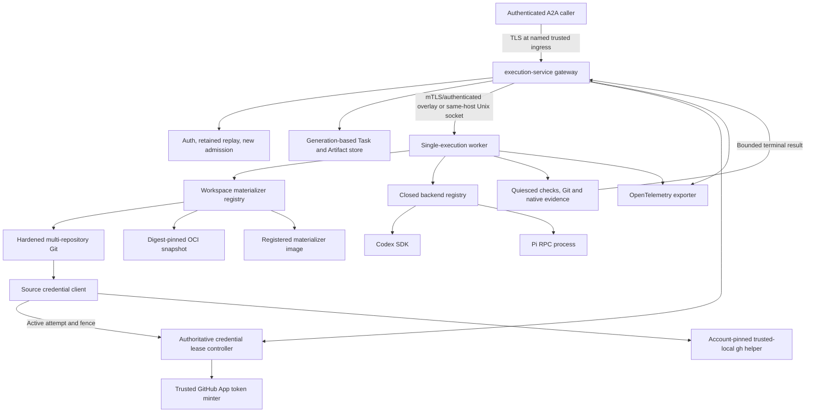
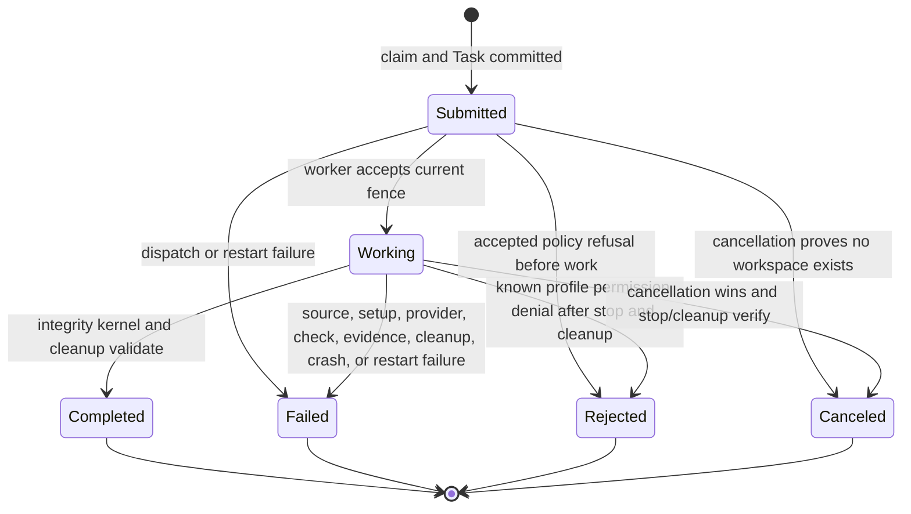
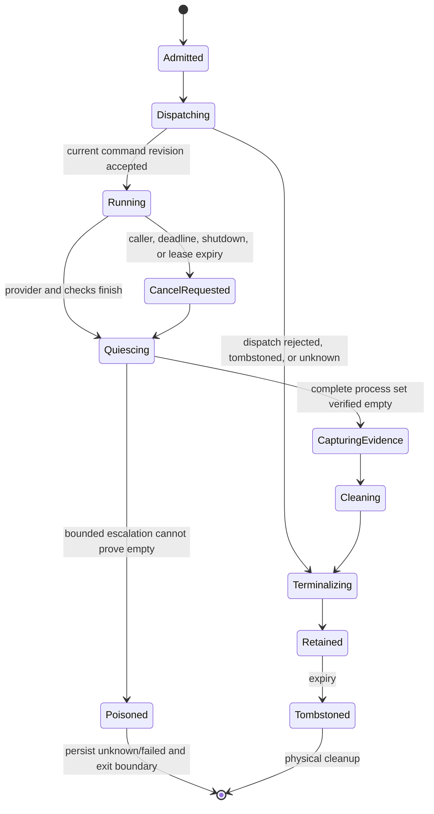

# Coding-Agent Execution Gateway - Plan

## Goal Capsule

- **Objective:** External systems can run Codex or Pi against an immutable,
  provenance-bearing workspace assembled from exact Git repositories, a
  digest-pinned OCI snapshot, or an operator-registered materializer through
  one authenticated, cancellable, evidence-preserving remote contract.
- **Means:** Add a separately deployable A2A 1.0 gateway, a private worker protocol, and backend-neutral workers with two direct provider adapters (KTD1, KTD5, KTD7-KTD8).
- **Authority:** [ADR 0002](../decisions/0002-serve-coding-agent-execution-through-an-a2a-gateway.md) owns the public boundary. The A2A 1.0 specification owns core wire semantics. The versioned AllAgents extension owns coding-execution semantics.
- **Execution profile:** Build contract-first, then durable Task/evidence state, worker lifecycle, Codex, Pi, packaging, and cross-backend conformance. Preserve the existing local CLI and Node 18 package compatibility.
- **Stop conditions:** Do not execute agents or materializers in the gateway
  process, accept mutable source identity, accept caller-supplied acquisition
  code or credentials, put deployment credentials in requests, treat streams
  or telemetry as terminal evidence, treat provider sessions as recovery
  checkpoints, vendor an evaluator's provider implementation, or add
  evaluation behavior.
- **Tail ownership:** The implementing workflow runs focused contract and lifecycle tests, the complete repository quality gates, isolated gateway/worker smoke tests, provider-specific credentialed smoke tests where credentials are available, and documentation validation.

---

## Product Contract

### Summary

AllAgents gains a remote coding-execution service without becoming an evaluation framework. Callers use A2A Tasks and one required AllAgents extension. The gateway owns caller identity, idempotency, routing, status, cancellation, evidence normalization, and bounded retention. Separate workers own repository materialization, provider processes, mutable workspaces, evidence capture, termination, and cleanup.

### Problem Frame

AllAgents currently configures and launches coding clients but has no service boundary for external callers. AI Evals and future consumers would otherwise need to import AllAgents internals, drive interactive CLIs, or independently reimplement repository acquisition, permissions, cancellation, evidence, and cleanup.

The two initial runtimes expose different programmatic contracts. Codex provides a TypeScript SDK over structured JSONL events and native per-turn `outputSchema`; Pi provides a strict JSONL RPC mode and invocation-scoped custom tools. The public service must preserve one stable lifecycle and structured-result contract without flattening provider-specific facts into false equivalence.

### Actors

- A1. **Gateway caller:** An authenticated service such as AI Evals that creates, observes, lists, cancels, and retrieves coding-execution Tasks.
- A2. **Execution gateway:** The A2A server that owns caller scope, Task identity, idempotency, routing, retention, and normalized results.
- A3. **Execution worker:** A separately deployed process that owns registered
  workspace materialization, one mutable workspace per invocation, provider
  execution, evidence capture, and cleanup.
- A4. **Backend adapter:** The Codex or Pi integration that translates native
  events, structured results, cancellation, usage, failures, and evidence into
  the worker contract.
- A5. **Operator:** The person or deployment system that defines profiles,
  materializer registrations, credentials, limits, retention, worker
  endpoints, and observability policy.

### Key Decisions

- **Profile A2A rather than creating a public invocation API.** The service keeps standard Agent Cards, Tasks, Artifacts, operations, errors, and capability negotiation. Governs R1-R4.
- **Keep execution outside the gateway process.** Mutable repositories and provider processes belong to workers. Governs R10-R16, R21-R22.
- **Persist Task truth, not live executions.** Accepted Task identity and terminal evidence survive restart; provider sessions do not resume or replay. Governs R7, R14, R16-R18.
- **Keep evaluation outside AllAgents.** Dataset expansion, repetitions, assertions, scoring, retries, and durable evaluation Runs remain caller concerns. Governs R20.
- **Make workspace acquisition explicit but extensible.** Requests select one
  versioned workspace source mode; custom acquisition uses only
  operator-registered, digest-pinned materializers allowed by the profile.
  Governs R6, R11-R13, R16-R18, R21-R22.
- **Resolve source credentials from trusted host and profile policy.** Callers
  never select a credential provider. For GitHub, prefer an applicable GitHub
  App installation and permit GitHub CLI only as an explicit trusted-local
  fallback when no installation applies; never fall back after a selected App
  provider fails. When AllAgents owns App token minting, use
  `@octokit/auth-app` rather than a custom minter. (session-settled:
  user-directed.) Governs R6, R12-R13, R16, R21-R22.

### Requirements

**Public protocol and compatibility**

- R1. The gateway implements A2A 1.0 HTTP+JSON for Agent Card discovery, `SendMessage`, `GetTask`, `ListTasks`, and `CancelTask`; it implements streaming send and task subscription when the card advertises streaming.
- R2. Every valid new request returns exactly one addressable Task. Direct-Message completion and follow-up messages to an existing Task are unsupported. Non-streaming send honors A2A `returnImmediately`; streaming always emits the durable Task first.
- R3. The public extension URI is `https://allagents.dev/a2a/extensions/coding-execution/v1`. The Agent Card advertises it as required; HTTP clients opt in with `A2A-Extensions`; each request sets `Message.extensions` to include the URI and puts the schema-defined request only at `Message.metadata[uri]`. Every terminal Task contains exactly one fixed-name `allagents.execution-integrity` Artifact whose `extensions` includes the URI and whose single `Part` contains the schema-defined integrity envelope in `data` with `mediaType: application/json`. The Task uses only the standard A2A fields and never adds `Task.extensions`. Unsupported or missing required extension versions fail without fallback.
- R4. Terminal output and execution evidence are retrievable as Task Artifacts for the configured retention window even when the original stream disconnects. Active subscription emits the current Task snapshot then future events without promising replay of missed progress; terminal subscription returns the standard unsupported-operation error and callers use `GetTask`.

**Caller identity, Task identity, and retention**

- R5. Every protocol operation authenticates the caller and scopes Task lookup, listing, subscription, cancellation, and artifact retrieval to that caller's tenant and principal before storage access can reveal resource existence. Production public ingress reaches the gateway through TLS terminated at the configured named trusted boundary; an unauthenticated loopback-only development listener is the sole plaintext exception. Remote gateway-worker links use mTLS or an explicitly configured equivalent authenticated encrypted overlay, while a same-host Unix socket is acceptable. The authenticated worker identity is bound to its route, capabilities, and attempt fence, and readiness fails for plaintext or identity-mismatched remote endpoints.
- R6. After authentication, required-extension checks, and bounded canonical parsing, the gateway first resolves the owner-scoped invocation claim. A retained claim compares the canonical caller request and result-schema digest against the originals and returns its existing Task only while its stored original effective-profile and schema bindings remain intact; a mismatch conflicts without dispatch. Current source/profile authorization, profile resolution/readiness, quota, and deadline checks apply only when atomically creating a new claim that binds the authenticated owner, canonical caller request digest, original effective-profile digest, original result-schema digest, and submitted Task.
- R7. Public Task state uses only A2A states and each Task has one immutable terminal transition. Acceptance of the current worker fence moves a submitted Task to working before source materialization or setup, so a subsequent source/setup failure transitions from working to failed. Task state and terminal Artifact metadata survive gateway restart. Every nonterminal Task present at startup settles failed once, its old attempt fence is invalidated, and stale worker events cannot overwrite it; the initial service never resumes or automatically replays interrupted provider work.
- R8. List operations implement all A2A filters, history bounds, page-size bounds, owner/query-bound cursor pagination, and descending status-update time. One immutable expiry logically hides the Task, claim, events, and artifacts before best-effort physical deletion; expired and unauthorized IDs are indistinguishable.
- R9. Small deployments work without an external database. The built-in durable store supports one gateway replica, enforces per-owner/global admission and storage quotas, and reserves capacity for cancellation and terminal settlement; multi-replica storage is outside this delivery.

**Execution and policy**

- R10. Codex and Pi are the complete initial backend set behind one conformance contract, delivered Codex first and Pi second. OpenCode is deferred. (session-settled: user-directed.)
- R11. A request selects a server-defined execution profile and may include one `allagents.result-schema/v1` schema for the terminal result: a bounded JSON Schema Draft 2020-12 subset with an object root, every object schema setting `additionalProperties: false`, every declared property listed in `required`, optional values represented by `null` unions, and only `type`, `properties`, `required`, `additionalProperties` with the value `false`, `items`, `enum`, `const`, `anyOf`, `$defs`, local `$ref`, `title`, and `description`. The extension version fixes byte, depth, property, and enum limits; admission rejects remote references, format-dependent validation, and unknown keywords; one shared validator governs schema admission and returned values. The profile fixes backend, model/runtime settings, source policy, setup and check commands, permissions, environment allowlists, artifact paths, resource budgets, deadline ceiling, trust class, and evidence limits. Requests cannot supply raw provider configuration.
- R12. One request defines one workspace using exactly one closed source union:
  `{ kind: "repositories", repositories: [...] }`,
  `{ kind: "workspaceSnapshot", reference, workspaceManifestDigest }`, or
  `{ kind: "materializer", materializerId,
  expectedWorkspaceManifestDigest, inputs }`. Unknown kinds, fields from
  another variant, and omitted variant fields fail admission. Repository
  entries contain a canonical credential-free HTTPS Git URL, full commit object
  ID, collision-free relative destination, and optional repository-relative
  subdirectory. Snapshot references are digest-pinned OCI artifacts containing
  the versioned workspace manifest. Materializer inputs are bounded by the
  registered schema. Profiles explicitly allow source modes and materializer
  IDs and authorize exact canonical Git repositories or namespaces, OCI
  namespaces, and resource selectors inside materializer inputs. Callers cannot
  supply builder images, Dockerfiles, Compose files, shell commands,
  credentials, mutable image tags, network policy, or output contracts. Direct
  Git revalidates destination policy for every connection, disables redirects
  and repository-controlled secondary fetch/exec features, uses hermetic Git
  configuration, fetches into an isolated object database from the approved
  remote, and verifies that the checked-out commit equals the requested full
  object ID. OCI acquisition rejects external or foreign layer URLs by default,
  revalidates scheme, normalized host, resolved address, port, and redirects
  for registry, authentication, manifest, and blob connections, never forwards
  credentials across origins, and verifies every manifest and layer digest. A
  materializer output must match the request's expected workspace-manifest
  digest before publication.
- R13. Requests never contain deployment credentials or arbitrary secret values. Profiles name environment variables whose values are scoped to the required worker phase and excluded from repository configuration, process arguments, logs, errors, evidence, retained workspaces, structured logs/spans before processing or export, and every model-initiated command or tool environment. Credentialed profiles additionally require an OS-enforced provider/tool credential boundary: the credential-bearing provider runtime and model-invoked tools use distinct UID/process/mount policy that prevents tool access to provider processes, procfs entries, and backend config/data roots, or an equivalent credential broker keeps reusable credentials out of the agent runtime. Worker readiness fails when the declared boundary cannot be proved; environment filtering alone is not credential isolation.
  Source credential selection is server-side deployment policy, not caller
  input. The acquisition boundary maps normalized repository hosts to source
  backends; `github.com` selects the built-in GitHub backend, while GitHub
  Enterprise Server hosts require explicit operator host/API mappings. Profiles
  name an ordered provider policy and authorize its non-secret entitlement
  before cache lookup. An App provider is applicable only when trusted operator
  configuration maps the repository to an installation ID; auth-app does not
  discover installations. Authenticated lifecycle webhooks plus bounded
  reconciliation advance an installation-entitlement generation on uninstall,
  suspension, or repository-selection change. Unknown or stale installation
  state fails cache authorization. Cache metadata preserves the original
  acquisition-provider metadata, while hit provenance separately records
  `cache_hit`, that original provider, and current policy selection/entitlement.
  Secret lookup and token minting remain cache-miss-only.
  For a cache-miss GitHub acquisition, an applicable configured App installation
  is preferred. Focused `@octokit/auth-app` minting uses `refresh: true` to
  produce a fresh token scoped only to the authorized repository, read-only
  contents permission, and GitHub expiry. Remaining lifetime must be strictly
  greater than the acquisition deadline plus clock-skew margin, and the
  credential lease cannot outlive the token. Readiness rejects an acquisition
  ceiling that can exceed a fresh token's safe lifetime. A trusted-local
  `github-cli` provider may run only when no App installation mapping applies;
  it is pinned to a configured non-secret account included in entitlement and
  effective-profile digests, invokes
  `gh auth token --hostname <host> --user <account>` without `GH_TOKEN`,
  `GITHUB_TOKEN`, `GH_ENTERPRISE_TOKEN`, or `GITHUB_ENTERPRISE_TOKEN`, and
  fails if that account cannot be resolved. After App selection, no failure
  falls through to `gh`.
  The initial remote path requires a trusted central token minter and
  authoritative gateway/control-plane credential-lease controller. The
  authenticated worker requests only by active attempt and fence. From durable
  dispatch and policy state, the controller rechecks active command revision,
  lease epoch, tombstone, and fence, then derives the effective-profile digest,
  selected provider, host/API-mapping digest, installation ID, canonical
  repository, operation, worker route and identity, and expiry. It issues and
  atomically consumes a single-use non-durable grant/response; a separately
  deployed minter must agree with the selected configuration digest. Replay,
  substitution, stale state, and controller/minter digest disagreement fail
  closed. The authenticated lease/channel binds the derived repository and
  provider state to worker identity, attempt, lease epoch, command revision,
  fence, operation, and expiry; those are not token claims. The remote worker
  never receives the App private key. Readiness fails without this complete
  path. Versioned central snapshot delivery is deferred and is not an initial
  readiness alternative.
  Public failures expose only deterministic coarse code, safe reason, and
  retryability; provider, installation, and account identifiers remain
  operator-only. `source_auth_unavailable/no_eligible_provider`,
  `source_auth_denied/installation_repository_denied`,
  `source_auth_failed/app_configuration_invalid`,
  `source_auth_failed/app_authentication_failed`,
  `source_auth_failed/app_mint_failed`, and
  `source_auth_failed/trusted_local_cli_failed` are not retryable.
  `source_auth_failed/provider_rate_limited` and
  `source_auth_failed/provider_unavailable` are retryable.
  Materializer IDs are defined in an operator-owned deployment registry. The
  gateway holds only the non-secret ID, bounded input schema, expected
  definition digest, expected output-manifest version, and required worker
  capabilities; the worker holds the runtime definition with the digest-pinned
  image, credential handle names or mount identities, network destinations,
  resource/deadline ceilings, cache policy, output-manifest version, and OCI
  runner or sandbox capability. Credential values are excluded. The worker
  derives an algorithm-qualified `sha256:<64 lowercase hex>` definition digest
  from a versioned, domain-separated canonical serialization of every
  non-secret behavior-affecting field and advertises it at readiness; the
  gateway treats its copy only as the expected digest. The expected workspace
  manifest and canonical materializer-input digests use the same
  algorithm-qualified format with distinct domain separators and exact
  versioned canonical JSON preimages. Readiness fails when computed and expected
  descriptors differ across the authenticated route. Materialization
  credentials exist only in that isolated phase and are not supplied to setup,
  provider execution, or model tools. The registered image is operator-trusted
  deployment code: phase isolation protects later phases but cannot make a
  malicious registered image safe from credentials deliberately given to it.
  Deployments requiring that stronger claim are deferred pending a separately
  versioned broker or central snapshot-delivery protocol.
- R14. The effective deadline is the earlier of the caller deadline and profile ceiling and is persisted before dispatch. The first durable terminal-or-cancel-intent write wins; cancellation is idempotent, reaches the worker and provider once, suppresses late success, and records termination and cleanup before publishing canceled. Stream or HTTP disconnect alone does not cancel a Task.
- R15. Initial profiles are unattended. Known provider permission requests are deterministically approved or denied by profile policy for one invocation; unknown permission types fail as adapter incompatibility. The gateway never emits `INPUT_REQUIRED` or `AUTH_REQUIRED` for these profiles and never depends on a live client.
- R16. A worker creates a fresh invocation directory, fresh provider session, and isolated backend configuration/data roots, runs setup, captures a post-setup baseline, invokes the provider, validates any requested structured result, and runs configured checks. It then proves the complete invocation process set quiescent before final evidence/artifact capture and cleanup or explicit retention. No workspace or provider session is reused after interruption. If bounded termination escalation cannot prove quiescence, the worker persists termination as unknown/failed, poisons admission, and exits so the external supervisor destroys the complete process boundary; replacement readiness performs orphan recovery before accepting work. The same supervisor boundary handles a worker crash.
  Every source mode materializes into a worker-owned staging directory under
  the same filesystem publication root as the final workspace and produces the
  same versioned workspace manifest. Readiness rejects cross-filesystem roots
  and publication has no copy-then-delete fallback. The worker validates
  repository or snapshot identities, destinations, paths, file types, limits,
  materializer definition and image digests, output digest, provenance method,
  and completeness. It then terminates the supervisor-owned acquisition
  process, mount, runner, and credential boundary while preserving the
  host-owned validated staging tree, proves that boundary gone, atomically
  renames the tree into its final location, and only then starts setup.

**Evidence and observability**

- R17. Every terminal Task contains the required `allagents.execution-integrity` Artifact carrying an integrity kernel: Task/source/profile/backend identities, action outcome, a structured-result state of `not_requested`, `not_produced`, `valid`, or `invalid` plus reason and schema digest when requested, cancellation or failure classification, separate termination and filesystem-cleanup outcomes including explicit unknown, Artifact index metadata, per-dimension completeness, and provenance. A valid structured result is exactly one additional `allagents.structured-result` Artifact with one A2A `Part` whose `data` field contains the validated result object and whose `mediaType` is `application/json`; missing or invalid result data never publishes that Artifact. `not_produced` is legal only before a result candidate is produced. Once validation selects `valid` or `invalid`, later check, evidence, cleanup, infrastructure, or crash failure preserves that state and, for `valid`, the fixed structured-result Artifact while the later phase remains the primary Task failure classification. Missing or invalid integrity data fails the Task; predictable bounded omission of optional evidence may complete with an explicit gap.
  Workspace provenance includes the source mode, requested and resolved
  repository commits or OCI digests, destination map, workspace-manifest
  digest, and, when applicable, materializer ID, computed definition digest,
  image digest, canonical input digest, and output digest. It labels each field
  as a worker-verified observation, trusted-service verification, or
  materializer-attested claim and records the verification method; a custom
  image's assertion is never reported as independently verified merely because
  its output digest matched.
- R18. Normalized file evidence distinguishes create, edit, delete, and rename where truthful. It preserves bounded provider-native diffs, events, or trajectories when normalization loses information and separately records truncation, redaction, attribution, original/captured size, and digest semantics.
- R19. Gateway and worker calls propagate W3C Trace Context and export metadata-only OpenTelemetry data. One explicit pre-processor allowlist admits only bounded non-content operational metadata; OpenInference and backend-native attributes pass the same allowlist and bounded filtering/redaction before any structured log or span processor. Prompts, model outputs, tool arguments/results, file bodies, source fragments, and secret-bearing attributes are prohibited before export. Owner correlation uses only an opaque identifier appropriate to telemetry-operator access, never caller identity or Task/Artifact authorization. Telemetry access and retention are configured separately from Task and Artifact access and retention, and telemetry is neither durable result truth nor required for terminal lookup.

**Ownership and safety boundary**

- R20. The gateway executes one coding request. It does not own eval configuration, datasets, repetition, scoring, retry policy, experiment scheduling, or a durable evaluation Run ledger.
- R21. The initial worker topology is one execution at a time for reviewed repositories inside one configured mutual-trust domain. R13's narrow OS-enforced provider/tool credential boundary is required for credentialed profiles but does not claim hostile-source or cross-tenant isolation. Profiles making either stronger claim are rejected until a full per-invocation UID, mount, PID, network, and credential isolation boundary is configured.
- R22. Gateway admission and worker execution enforce profile limits for request rate, active/retained Tasks, subscriptions, stored bytes, source transfer/expansion, files/inodes, workspace bytes, CPU, memory, PIDs, network, phase deadlines, events, logs, and artifacts. Exhaustion is scoped to one invocation or owner and leaves capacity for terminalization and cleanup.
  Materializer CPU, memory, PIDs, network, time, transfer, expansion, file,
  inode, and workspace output count against the invocation's limits. New-claim
  source authorization precedes every cache lookup. Cached outputs are reusable
  only after manifest and content revalidation for the same canonical source,
  materializer-definition digest, expected and actual output-manifest digests,
  authorization-scope digest, source-authorization revocation epoch, and trust
  domain. Revocation advances the epoch and makes the prior namespace
  ineligible; the conservative default namespaces cache entries by owner.

### Key Flows

- F1. **Admit, create, and stream an execution**
  - **Actors:** A1, A2, A3, A4.
  - **Trigger:** A caller opts into `https://allagents.dev/a2a/extensions/coding-execution/v1` and sends a text Message whose `extensions` includes that URI and whose `metadata[uri]` contains the immutable source, profile, invocation key, deadline, and optional bounded result schema.
  - **Steps:** Authenticate, check extension negotiation, and bounded-canonicalize the request; resolve an owner-scoped retained claim and return or conflict against its original request/profile/schema bindings before mutable admission checks. For a new claim only, validate current source/profile authorization, profile/readiness, quota, and deadline; atomically create the claim and submitted Task; dispatch a fenced worker attempt; accept the current fence and move the Task to working; materialize and verify source; execute the selected backend; validate structured output with the shared validator when requested; persist progress before emission; and terminalize with the required integrity Artifact plus the fixed-name structured-result Artifact only for a valid result after quiescence and cleanup.
  - **Outcome:** `returnImmediately: true` returns the durable current Task, false/unset waits for terminal state, and streaming starts with that Task before ordered updates.
  - **Covered by:** R1-R22.
- F2. **Replay or reconnect to an invocation**
  - **Actors:** A1, A2.
  - **Trigger:** The owner repeats an invocation key or subscribes after a stream disconnect.
  - **Steps:** After authentication and bounded canonical parsing, resolve the owner-scoped claim; compare the request and schema digest with the stored originals and verify the retained Task's original effective-profile/schema bindings without resolving the current profile. Reject a mismatch; otherwise return the existing Task before current authorization, quota, readiness, profile, or deadline checks. For active streaming replay/subscription emit its current snapshot then future events; for a terminal Task return it through send replay or `GetTask` without dispatch.
  - **Outcome:** Retries do not multiply agent work, and reconnect never promises transient event replay.
  - **Covered by:** R4, R6-R8.
- F3. **Cancel or time out an execution**
  - **Actors:** A1, A2, A3, A4.
  - **Trigger:** The caller invokes `CancelTask`, the effective deadline expires, or gateway shutdown claims cancellation.
  - **Steps:** Atomically record the first cancellation source; send one revisioned fenced worker cancel even when dispatch delivery is unconfirmed, so an unseen attempt is tombstoned before any delayed dispatch can create a workspace. If work exists, invoke native abort, terminate descendants, capture termination-safe evidence, clean, and publish canceled only after verification.
  - **Outcome:** Completion that wins first remains terminal and later cancel returns `TaskNotCancelableError`; cancellation that wins suppresses stale dispatch and late provider success. If bounded escalation cannot prove the complete invocation process set empty, the Task fails rather than claiming canceled, the worker poisons admission and exits, and its supervisor destroys the boundary.
  - **Covered by:** R7, R14, R16-R18.
- F4. **Settle after gateway or worker loss**
  - **Actors:** A2, A3.
  - **Trigger:** The gateway restarts with nonterminal Tasks, an acknowledgement is lost, a live worker loses its lease, or a worker process crashes.
  - **Steps:** Invalidate the attempt fence and settle every affected Task failed once without provider-session reattachment or automatic replay. A live worker that loses its lease self-aborts and cleans. On worker-process crash or unproved quiescence after bounded escalation, poison admission and exit the worker so the external supervisor terminates the complete execution boundary; the replacement worker proves termination, then reaps or quarantines orphaned roots before readiness. Reject late events/results and record termination and filesystem cleanup separately as complete only when the responsible boundary proves each outcome.
  - **Outcome:** One Task has one terminal result, interrupted work is never presented as resumed, no stale worker can overwrite durable truth, and a failed quiescence proof cannot leave the poisoned worker available for another reservation.
  - **Covered by:** R7, R9, R14, R16-R18, R21-R22.
- F5. **Expire retained execution data**
  - **Actors:** A1, A2.
  - **Trigger:** The immutable Task expiry is reached.
  - **Steps:** Atomically tombstone the complete ownership aggregate; stop authorizing Task and Artifact access; retry physical cleanup independently; permit the old invocation key to create a new Task only after logical expiry.
  - **Outcome:** Expired, unknown, and unauthorized identifiers are indistinguishable and no Artifact outlives Task authorization.
  - **Covered by:** R5-R9.

### Acceptance Examples

- AE1. **Covers R1-R4, R10-R18.** Given an authorized Codex profile, one valid
  immutable workspace source, and an optional result schema, when the caller
  streams a request, then one Task moves from submitted to working to completed
  and later `GetTask` returns the same validated output, workspace provenance,
  and evidence Artifacts.
- AE2. **Covers R6.** Given a retained Task whose original absolute deadline has passed or whose profile is now disabled, changed, or no longer authorized for new work, when its owner reuses the invocation key with the same canonical request and result schema, then the gateway returns the original Task from its stored original bindings before mutable admission checks and makes no second worker dispatch.
- AE3. **Covers R6.** Given a retained Task, when its owner reuses the invocation key with a different prompt, source, profile ID, deadline, or result schema, or the stored original profile/schema binding is inconsistent, then the gateway rejects the request and leaves the original Task unchanged.
- AE4. **Covers R5.** Given a Task owned by caller A, when caller B lists Tasks, gets the Task, cancels it, subscribes, or requests an Artifact, then the gateway reveals no resource existence or content.
- AE5. **Covers R12, R16-R18.** Given a wrong or missing Git commit,
  conflicting repository destination, OCI digest or manifest mismatch, unknown
  or profile-disallowed materializer, materializer definition/image drift,
  produced workspace-manifest digest that differs from the request, malformed
  materializer output, direct known-secret disclosure, or setup failure, when
  the worker has already accepted the current fence, then provider execution
  never starts, the selected public trace is
  `Submitted -> Working -> Failed`, and the Task retains bounded
  materialization/setup-failure and cleanup evidence.
- AE6. **Covers R7, R14.** Given cancellation races worker acceptance or completion, when the first durable outcome is chosen, then exactly one abort occurs when needed, late success cannot overwrite cancellation, and terminal cancellation appears only after termination and cleanup are verified. Given cancel reaches a worker before its delayed dispatch, the worker tombstones the unseen attempt and the stale dispatch creates no workspace or provider process.
- AE7. **Covers R3, R10-R11, R17.** Given equivalent profiles, one accepted `allagents.result-schema/v1` schema, and fixture runtime events for Codex and Pi, when each completes the same repository mutation, then both publish the required fixed-name integrity Artifact at the schema-defined extension carrier, validate with the same schema and validator, publish the same fixed-name structured-result Artifact containing one A2A `Part` with the validated `data` and `mediaType: application/json`, record the same integrity state, and produce the required normalized evidence fields while retaining distinct native evidence.
- AE8. **Covers R4, R7, R19.** Given canary secrets and cross-owner content fragments in prompts, model output, tool arguments/results, source files, stale events, and errors, when agent, model, tool, stale-event, and error telemetry is processed, then the exporter receives only allowlisted bounded metadata plus the correct opaque owner correlation and receives none of those canaries, fragments, or raw caller identities. Given a caller or exporter disconnects during work, reconnect still returns the current Task and future updates without duplicate dispatch, and telemetry loss does not affect terminal lookup.
- AE9. **Covers R15.** Given a known capability denied by profile, the accepted Task becomes rejected after stop and cleanup; given an unknown permission type, it becomes failed as an adapter incompatibility without waiting for a client.
- AE10. **Covers R17-R18.** Given optional logs/diffs/native events exceed configured budgets, the Task may complete with explicit truncation metadata; given capture cannot establish the integrity kernel, it fails in the evidence phase. Given output validation has already selected `valid` or `invalid` and a later check or mandatory-evidence phase fails, the failed Task preserves that result state and a valid result preserves its one fixed structured-result Artifact; only a failure before candidate production records `not_produced`.
- AE11. **Covers R6, R11-R12, R22.** Given invalid input, an unknown or
  profile-disallowed source mode/materializer, or exhausted admission quota,
  the gateway returns a request/resource error and creates no Task; given
  materializer availability or worker capacity disappears after durable
  acceptance, the retained Task fails at dispatch or materialization and replay
  returns it without retry.
- AE12. **Covers R7, R14, R16.** Given a duplicate, out-of-order, or stale-fence worker event arrives after restart or terminal settlement, the gateway ignores it for Task state and records only allowlisted metadata-only operator telemetry. Given bounded escalation cannot stop a descendant that starts a new session and ignores graceful signals, the worker persists termination unknown/failed, refuses another reservation, exits, and its supervisor destroys the boundary; replacement readiness performs orphan recovery without changing the failed Task.
- AE13. **Covers R8.** Given a Task reaches expiry while physical deletion fails, all Task and Artifact operations return the same not-found response and the invocation key can create a new Task.
- AE14. **Covers R5, R13, R21-R22.** Given a production public listener or
  remote worker route lacks its configured trusted transport or authenticated
  peer identity, readiness fails; a same-host Unix worker socket is accepted.
  Given a credentialed reviewed-domain profile, model tools cannot inspect
  provider process environments, process listings, backend config/data roots,
  or exfiltrate provider/control credentials across the configured OS boundary.
  Given a GitHub repository, a trusted operator repository-to-installation
  mapping wins over GitHub CLI; auth-app never discovers the installation.
  Without a mapping, only an explicitly enabled trusted-local provider may
  invoke the configured account through
  `gh auth token --hostname <host> --user <account>` with all four ambient
  GitHub token variables absent. Any selected-App failure never invokes `gh`.
  A remote worker requests a credential only by its active attempt/fence; the
  controller derives all provider/repository/route bindings, rechecks current
  command state, consumes one single-use grant, and rejects replay,
  substitution, stale state, or minter configuration-digest disagreement.
  The fresh token has repository/read-only/expiry scope only; the authenticated
  lease carries worker, attempt, lease epoch, command revision, fence,
  operation, and expiry bindings. Near-expiry cached auth-app output is bypassed
  with `refresh: true`, lease expiry never exceeds token expiry, and an unsafe
  acquisition ceiling fails readiness without CLI fallback. Authenticated App
  lifecycle webhooks and bounded reconciliation invalidate old entitlement
  generations; unknown or stale state cannot authorize a cache hit. Cache-hit
  provenance distinguishes the original acquisition provider from current
  policy selection. Every source-auth failure maps to the specified safe
  code/reason/retryability, while provider, installation, and account identities
  remain operator-only. Given a registered materializer with source credentials,
  setup, provider processes, and model tools have no access to its process,
  runner control socket, credential environment/mounts, or staging root after
  materialization, and direct known-secret canaries are absent from retained
  logs, evidence, and published workspace files. The registered materializer
  remains operator-trusted code; hostile-materializer, hostile-source, and
  cross-tenant claims remain rejected without a stronger broker or sandbox.

### Success Criteria

- The official A2A JavaScript client can discover the required extension, negotiate it through `A2A-Extensions`, use the standard Message and Artifact extension carriers, and exercise create, immediate/waiting send, stream, reconnect, get, list, subscribe, retained replay, cancel, and expiry behavior against the built service without `Task.extensions`.
- One conformance fixture passes unchanged through the Codex and Pi adapters.
- Admission, retained replay, monotonic worker commands, fencing, acceptance-before-materialization source/setup failure, cancellation races, trace-order/fence/multiplicity constraints, failed-quiescence recycling, restart terminalization without resume, supervised worker-crash cleanup, trusted transports, authorization isolation, metadata-only telemetry export, OS-enforced provider/tool credential separation, source hardening, portable structured-result validation, quotas, and evidence integrity have deterministic integration coverage.
- Direct multi-repository Git, digest-pinned OCI snapshots, and a fake
  digest-pinned registered materializer all produce the same validated
  workspace manifest and terminal provenance contract before either backend
  starts.
- The gateway image contains no coding-agent runtime and cannot access worker workspace roots.
- The initial worker runs one reviewed-trust-domain execution at a time, model-initiated tools are OS-isolated from provider/control credentials, repository Pi extensions cannot auto-load, and no live descendant or reusable workspace survives a completed, failed-quiescence, or crashed attempt.

### Scope Boundaries

**In scope**

- A2A 1.0 HTTP+JSON and SSE streaming.
- One versioned AllAgents coding-execution extension and one versioned private worker protocol.
- Codex and Pi backends.
- Built-in bearer authentication with OIDC/JWT and static service-token modes behind the named production TLS boundary.
- Single-replica durable file storage, authenticated Artifact retrieval, authenticated encrypted remote worker transport or same-host Unix sockets, OpenTelemetry, admission/resource limits, container images, configuration examples, and operator documentation.
- Reviewed repositories in one configured mutual-trust domain per worker deployment, with the narrow OS-enforced provider/tool credential boundary required for credentialed profiles.
- Direct multi-repository Git acquisition, digest-pinned OCI workspace
  snapshots, and operator-registered digest-pinned materializers with
  phase-scoped credentials and one standard workspace manifest.

**Deferred to follow-up work**

- Multi-replica database-backed Task and idempotency storage.
- Durable provider execution, checkpointing, provider-session restoration, and automatic replay after gateway or worker restart.
- OpenCode and additional coding backends.
- Kubernetes Job dispatch, queue brokers, autoscaling controllers, and stronger hostile-source or cross-tenant sandbox providers.
- Push-notification configuration, gRPC, JSON-RPC transport, and A2A extended Agent Cards.
- AHP server/client surfaces, long-lived interactive sessions, and client-contributed tools.
- Optional ATIF conversion after the format and tooling mature.
- Versioned central source-snapshot acquisition and delivery; the initial
  remote GitHub path is central token minting plus an authenticated non-durable
  delivery lease.

**Outside this product's identity**

- Evaluation authoring, datasets, assertions, grading, repetitions, experiment scheduling, and durable evaluation Runs.
- Caller-specific result projections such as Promptfoo `ProviderResponse` mapping.

### Sources

- [ADR 0002](../decisions/0002-serve-coding-agent-execution-through-an-a2a-gateway.md)
- [AHP decision inputs](../research/agent-host-protocol-decision-inputs.md)
- [Harbor repository materialization lessons](../research/harbor-repository-materialization.md)
- [GitHub source credential broker precedents](../research/source-credential-broker-precedents.md)
- [GitHub App installation access tokens](https://docs.github.com/en/apps/creating-github-apps/authenticating-with-a-github-app/generating-an-installation-access-token-for-a-github-app)
- [`@octokit/auth-app`](https://github.com/octokit/auth-app.js)
- [AI Evals ADR 0036](https://github.com/WiseTechGlobal/ai-evals/blob/main/docs/adr/0036-remove-the-ai-evals-workspace-runtime.md)
- [A2A 1.0 specification](https://a2a-protocol.org/v1.0.0/specification/)
- [Official A2A JavaScript SDK](https://github.com/a2aproject/a2a-js)
- [Codex TypeScript SDK](https://github.com/openai/codex/tree/main/sdk/typescript)
- [Codex configuration reference](https://developers.openai.com/codex/config-reference)
- [Promptfoo Codex provider documentation](https://github.com/promptfoo/promptfoo/blob/main/site/docs/providers/openai-codex-sdk.md)
- [Promptfoo Codex provider implementation](https://github.com/promptfoo/promptfoo/blob/main/src/providers/openai/codex-sdk.ts)
- [Promptfoo Codex provider tests](https://github.com/promptfoo/promptfoo/blob/main/test/providers/openai-codex-sdk.test.ts)
- [Pi RPC protocol](https://github.com/badlogic/pi-mono/blob/main/packages/coding-agent/docs/rpc.md)
- [Pi CLI reference](https://github.com/badlogic/pi-mono/blob/main/packages/coding-agent/README.md#cli-reference)
- [Pi extension API](https://github.com/badlogic/pi-mono/blob/main/packages/coding-agent/docs/extensions.md)
- [Pi provider credentials](https://github.com/badlogic/pi-mono/blob/main/packages/coding-agent/docs/providers.md)
- [Buzz pure Kubernetes state classifier](https://github.com/block/buzz/blob/779af8886caae1317b4de962082429867ab61503/crates/buzz-backend-kubernetes/src/classify.rs)
- [Buzz non-secret intent fingerprint](https://github.com/block/buzz/blob/779af8886caae1317b4de962082429867ab61503/crates/buzz-backend-kubernetes/src/intent.rs)
- [Buzz conformance coverage checker](https://github.com/block/buzz/blob/779af8886caae1317b4de962082429867ab61503/crates/buzz-conformance/src/checker.rs)
- [Buzz bounded process-tree cancellation](https://github.com/block/buzz/blob/779af8886caae1317b4de962082429867ab61503/crates/buzz-dev-mcp/src/shell.rs)

---

## Planning Contract

### Key Technical Decisions

- KTD1. **Use the official A2A JavaScript SDK behind an AllAgents request-handler decorator.** Pin a compatible A2A 1.x SDK. After authentication, required-extension checks, and bounded canonical parsing, the decorator resolves an owner-scoped retained claim before mutable admission; identical replay bypasses current profile/deadline/quota/readiness checks and any new SDK Task/bus allocation. New requests then pass mutable admission and canonical Task reservation. The decorator also owns stream snapshot selection and cancellation routing before `DefaultRequestHandler` can allocate another Task or terminalize cancellation prematurely; the SDK retains standard transport/event mechanics. Governs R1-R8, R14.
- KTD2. **Define the public extension and private worker protocol from canonical Zod schemas.** U1 freezes `https://allagents.dev/a2a/extensions/coding-execution/v1`, its standard Agent Card/header/Message/Artifact negotiation, `Message.metadata[uri]` request location, and the single-Part `allagents.execution-integrity` Artifact data location; no schema or implementation adds `Task.extensions`. The public contract also carries the `allagents.result-schema/v1` closed subset, its canonical digest, four structured-result states, and the separate fixed `allagents.structured-result` Artifact. The worker protocol carries worker identity, attempt identity, profile digest, monotonic command revision and tombstone state, dispatch acceptance, event sequence, lease fence/expiry, renew/cancel, terminal acknowledgement, and error mapping. Governs R3, R6-R7, R11-R18, R22.
- KTD3. **Commit each Task ownership aggregate through generations and one manifest.** The built-in repository creates a new invocation claim and submitted Task together after mutable admission, storing the canonical caller request and the original effective-profile and result-schema digests needed for retained replay. It stores immutable Artifact blobs before atomically switching the manifest to a new generation, tombstones the aggregate before physical retention cleanup, and garbage-collects unreachable generations on startup. A revision/fence compare-and-swap makes terminal settlement immutable. Governs R4-R9, R14, R17-R18.
- KTD4. **Authenticate at a named trusted HTTP ingress before A2A storage or dispatch.** Production traffic reaches the gateway through TLS terminated by the configured gateway or named trusted reverse-proxy boundary; plaintext is allowed only for an unauthenticated loopback development listener. Production OIDC mode verifies JWT issuer, audience, signature, expiry, and required execution scope. Static token mode uses constant-time comparison for local or service deployments. A canonical length-delimited issuer/tenant/subject tuple is hashed into an opaque owner key; raw claims and caller IDs never become paths. Readiness rejects a production public URL whose trusted TLS boundary is absent or inconsistent. Governs R5-R6, R13.
- KTD5. **Use fenced, separately deployable gateway and worker services.** Remote gateway-worker routes use mTLS or an explicitly equivalent authenticated encrypted overlay; a same-host Unix socket is acceptable. The authenticated worker identity is pinned to the configured route/capability set, and every short-lived attempt capability is bound to that identity, attempt ID, lease ID/epoch, and fence. Each worker keeps one minimal durable monotonic command record scoped to its worker identity and lease: `Cancel(attempt, fence, revision)` tombstones even an unseen attempt, and `Dispatch` for a tombstoned or lower-revision attempt is rejected before workspace creation. Dispatch/cancel I/O conditionally verifies the persisted command/outbox revision immediately before any mutating or terminating effect. Duplicate delivery is idempotent; conflicting, stale, out-of-order, or identity-mismatched commands/events are rejected. Gateway and worker transition selectors remain pure and executors re-enter from persisted or freshly observed state. This record is worker-local fence state, not a new durable execution subsystem. Governs R5, R7, R10-R16, R21-R22.
- KTD6. **Make worker leases and the execution supervisor orphan fail-safes, not replay mechanisms.** Gateway cancellation is explicit. Lost acknowledgement or ambiguous dispatch settles `dispatch_unknown` without automatic redelivery; lease expiry makes a live worker abort and clean. Gateway restart terminalizes every nonterminal Task and invalidates old fences. Every external materializer launch creates a supervisor-owned runner resource labeled by worker, attempt, lease, and fence; worker-process exit makes the external supervisor terminate that resource and the complete execution boundary. If bounded escalation cannot prove the complete invocation process set empty, the worker records termination unknown/failed, poisons admission, and exits rather than accepting another reservation; its supervisor destroys the boundary. Before readiness the replacement proves termination and enumerates, destroys, or quarantines orphaned invocation roots, runner resources, credential mounts, and staging mounts; an unresolved resource keeps readiness false. Production readiness accepts a dedicated worker container process namespace under a minimal init/reaper as the baseline; a non-container deployment must prove an equivalent systemd/cgroup boundary. The gateway never reattaches to or resumes a provider session. Governs R7, R14, R16-R18.
- KTD7. **Keep one behavior-focused backend interface and explicit registry.** Adapters implement availability/capabilities, invoke, progress, deterministic permission response, abort, terminal output, optional structured result, usage, native evidence, and disposal. Shared worker code owns source, setup, checks, schema validation, Git evidence, artifacts, process-tree cleanup, limits, and isolated backend roots. A closed `codex | pi` registry is the only production dispatch point. Governs R10-R11, R14-R18, R21-R22.
- KTD8. **Use each provider's supported automation surface directly behind the credential boundary.** Codex depends directly on pinned `@openai/codex-sdk`, creates one fresh thread per Task, passes `AbortSignal` and optional per-turn `outputSchema`, and consumes streamed events. Pi uses strict RPC with an invocation-local credential store and one explicitly loaded worker-owned policy extension; repository extensions and unrestricted built-ins never load. For either adapter, a credentialed provider runtime is separated from every model-invoked tool by the R13 OS-enforced UID/process/mount boundary or an equivalent credential broker; shell-environment filtering is defense in depth, not the boundary. Promptfoo's Codex provider and tests are characterization references only; AllAgents neither vendors them nor inherits their config, cache, pricing, retry, thread-pool, or `ProviderResponse` concerns. Governs R10-R18.
- KTD9. **Make profiles the new-admission policy boundary.** Requests select a
  profile ID, one schema-defined workspace source mode, and optionally one
  `allagents.result-schema/v1` schema. They cannot override backend or source
  credentials, materializer definitions or images, executable paths, provider
  config, setup/check commands, environment allowlists, permission rules,
  trust class, resource limits, workspace retention, or evidence budgets. A
  profile allowlists source modes and materializer IDs plus exact canonical Git
  repository/namespace rules, OCI namespaces/signature rules, and resource
  selectors for structured materializer inputs. New admission authorizes the
  fully canonicalized resource and credential entitlement before cache lookup.
  Resolve a versioned canonical `EffectiveProfileIntent` containing the
  selected materializer definition digest, authorization-scope digest,
  source-authorization revocation epoch, provider policy and pinned CLI account,
  and current GitHub App entitlement generation when applicable; compute its
  digest without resolved secrets or per-attempt state and persist it with the
  canonical caller request and result-schema digest. Unknown or stale App
  entitlement state fails cache authorization. Cache metadata retains original
  acquisition-provider metadata, while cache-hit provenance records `cache_hit`
  plus current policy selection separately. Retained replay compares stored
  original bindings and never substitutes or re-resolves current policy.
  Governs R6, R11-R16, R21-R22.
- KTD10. **Keep durable evidence and operational telemetry as separate bounded layers.** The worker verifies source, runs setup, records a post-setup Git tree, invokes the adapter, runs checks, and stops every invocation process before final Git/artifact capture. Provider-native events remain a distinct bounded evidence layer; neither Git nor provider evidence is promoted as exact causality when incomplete. Telemetry is a third, non-durable metadata-only channel: one small shared pre-export sanitizer applies an explicit operational-metadata allowlist plus bounded filtering/redaction before every structured log or span processor, and only opaque owner correlation may cross the separately governed operator boundary. OpenInference and backend-native attributes receive no bypass. This is an export guard, not a telemetry framework or alternate evidence store. Governs R13, R16-R19.
- KTD11. **Treat Codex and Pi as the complete initial backend set.** Codex lands first; Pi lands second against the established contract; OpenCode is deferred. (session-settled: user-directed.) Governs R10.
- KTD12. **Separate terminal integrity from optional evidence bodies.** The fixed `allagents.execution-integrity` Artifact validates identity, action outcome, the four-state structured-result record, failure/cancellation, separate termination and filesystem cleanup, Artifact index, completeness, and provenance before terminal publication. `not_produced` applies only before result-candidate production. Once validation selects `valid` or `invalid`, a later check, evidence, cleanup, infrastructure, or crash failure preserves that state and, for `valid`, the separate fixed structured-result Artifact while retaining the later phase as the primary Task failure. Predictable optional-body truncation/redaction may preserve completion; failure that breaks the integrity kernel fails in the evidence phase. Governs R3-R4, R17-R18.
- KTD13. **Standardize and harden workspace materialization.** Define one
  closed `kind`-discriminated workspace-source union and one output manifest;
  reject unknown kinds and cross-variant fields. The built-in Git path accepts
  canonical HTTPS repository identities and full commit IDs only, uses
  hermetic Git configuration; disables inherited redirects, proxies,
  credential helpers, hooks, filters, LFS smudge, submodule recursion,
  alternates, and non-HTTPS protocols; injects only the KTD16-selected
  one-shot credential channel; revalidates normalized host/address policy for
  every connection; fetches into an isolated object database from the
  authorized remote; and verifies the checked-out commit and resulting tree.
  The OCI path accepts
  manifest digests, not tags; rejects foreign/external URLs by default;
  revalidates scheme, host, resolved address, port, redirect, and credential
  origin for every registry/auth/manifest/blob request; and verifies every
  manifest/layer plus the embedded workspace manifest. The custom path accepts
  a registered ID, expected workspace-manifest digest, and schema-validated,
  resource-authorized inputs.

  The operator-owned registry splits a non-secret gateway descriptor from the
  worker-only runtime definition. The worker computes a
  `sha256:<64 lowercase hex>` digest over the versioned, domain-separated
  canonical non-secret runtime definition; readiness compares that value with
  the gateway's expected digest and capabilities. Distinct domain-separated
  canonical JSON preimages define materializer input and workspace-manifest
  digests. All paths stage in a worker-owned directory on the final
  publication filesystem, validate destinations, links, file types, bounds,
  identities, content, and manifest, then terminate the supervisor-owned
  acquisition process/mount/credential/runner boundary while retaining the
  validated host-owned tree. Only after proving the boundary gone does the
  worker atomically rename the tree; no copy fallback exists. Provenance
  distinguishes worker-verified observations, trusted-service verification,
  and materializer-attested claims. The caller digest covers source kind,
  expected output identity, and inputs; the effective-profile digest covers
  materializer and authorization bindings; terminal provenance covers both and
  the validated output. Governs R6, R11-R13, R16-R18, R21-R22.
- KTD14. **Limit the initial worker to one reviewed trust domain and one execution.** The worker rejects hostile-source or cross-tenant claims and runs with concurrency one. Deployment-level CPU/memory/PID/network/filesystem limits become per-invocation limits. Credentialed profiles still require R13's narrower OS-enforced provider/tool separation: model tools cannot inspect provider processes, procfs entries, or backend config/data roots, and readiness fails without that capability. Provider/source credentials are absent from setup/check phases and child-visible worker control state. Pi disables repository extensions and built-in tools; only the worker-owned policy extension may load. This credential boundary does not imply hostile-source or cross-tenant isolation; that stronger sandbox-driver capability remains deferred. Governs R13, R16, R21-R22.
  An external materializer image is reviewed operator code in the deployment's
  trusted computing base, not hostile caller code. Its runner or sandbox
  control plane is never mounted into the workspace or exposed to setup,
  providers, or model tools. A deployment that does not trust the registered
  image with source credentials is outside the initial trust model and must not
  enable that registered materializer. Support requires the separately
  versioned broker or central snapshot-delivery protocol deferred by R13.
- KTD15. **Keep service dependencies out of the Node 18 CLI package.** Add a private `packages/execution-service` workspace requiring Node 22.19+ for the A2A SDK, Codex SDK, current Pi, gateway, and worker. The published root `allagents` CLI keeps its Node 18 engine and does not import service-only dependencies. Governs R1, R10, R16.
- KTD16. **Resolve GitHub credentials through an authoritative ordered provider
  registry and lease controller.** The caller supplies only a canonical
  credential-free repository URL. The acquisition boundary maps `github.com`
  to the built-in GitHub backend and requires explicit host/API mappings for
  GitHub Enterprise Server. The profile supplies provider eligibility and
  order, not secrets. A configured App provider is applicable only when trusted
  operator configuration maps the authorized repository to an installation ID;
  auth-app does not discover installations. A `github-cli` provider may follow
  only in a trusted-local profile, only when no App mapping applies, and only
  for its configured non-secret account. That account participates in
  entitlement and effective-profile digests. Invoke
  `gh auth token --hostname <host> --user <account>` with `GH_TOKEN`,
  `GITHUB_TOKEN`, `GH_ENTERPRISE_TOKEN`, and `GITHUB_ENTERPRISE_TOKEN` removed,
  and fail when the configured account cannot be resolved. Selection is sticky:
  App configuration, authentication, minting, authorization, rate-limit, or
  service failure never falls through to the broader user identity.

  When AllAgents owns minting, its trusted central minter depends on focused
  `@octokit/auth-app` rather than implementing App JWT, clock-skew, expiry, and
  renewal; Git remains the transport and the full Octokit client is not added.
  Every cache-miss acquisition uses `refresh: true` and accepts only a fresh
  token whose remaining lifetime is strictly greater than the acquisition
  deadline plus clock-skew margin. The token is scoped only to the repository,
  read-only contents permission, and GitHub expiry. Lease expiry cannot exceed
  token expiry, and readiness rejects an acquisition ceiling that can exceed a
  fresh token's safe lifetime.

  The gateway/control-plane credential-lease controller, not the worker, is
  authoritative. An authenticated worker request supplies only active attempt
  and fence. The controller rechecks durable command revision, lease epoch,
  tombstone, and fence and derives effective-profile digest, selected provider,
  host/API-mapping digest, installation ID, canonical repository, operation,
  worker route/identity, and expiry from durable dispatch and policy state. It
  issues a single-use non-durable grant/response; a separate minter atomically
  consumes the grant and must agree with the selected configuration digest.
  Replay, substitution, stale command state, and digest disagreement fail
  closed. The authenticated lease/channel binds the derived state to worker
  identity, attempt, lease epoch, command revision, fence, operation, and
  expiry. A remote worker never receives the App private key. Remote App
  profiles fail readiness without that complete central path. A trusted
  co-located deployment may keep the controller and minter in its control
  plane. Versioned central snapshot delivery is deferred.

  Authenticated App lifecycle webhooks and bounded reconciliation advance an
  installation-entitlement generation on uninstall, suspension, or
  repository-selection change; unknown or stale state fails cache
  authorization. Minting remains miss-only. Provenance distinguishes
  `cache_hit`, original acquisition-provider metadata, and current policy
  selection/entitlement. Public source-auth details contain only the specified
  safe code, reason, and retryability; provider, installation, and account
  identifiers are operator-only. Governs R6, R12-R13, R16, R21-R22.

### High-Level Technical Design

#### Component topology



#### Admission, dispatch, and settlement sequence

```mermaid
sequenceDiagram
  participant C as Caller
  participant G as Gateway decorator
  participant S as Durable aggregate store
  participant W as Worker
  participant B as Backend adapter
  participant L as Credential lease controller
  participant M as App token minter

  C->>G: SendMessage + header/Message extension + metadata[uri]
  G->>G: Authenticate, check extension, canonicalize within bounds
  G->>S: Resolve owner-scoped invocation claim
  alt retained identical replay
    S-->>G: Existing Task + original request/profile/schema bindings
    G-->>C: Existing Task before current admission checks
  else conflicting retained claim
    G-->>C: Conflict; existing Task unchanged
  else no retained claim
    G->>G: Current authorization, profile/readiness, quota, deadline
    G->>S: Atomic new claim + submitted Task + original digests
    S-->>G: Task + attempt/lease fence
    G->>W: Dispatch(attempt, fence, command revision)
    W->>W: Verify command record before workspace creation
    W-->>G: Accepted(attempt, fence)
    opt private GitHub cache miss
      W->>L: Request(active attempt, fence)
      L->>S: Recheck command revision, lease epoch, tombstone, fence
      L->>L: Derive profile/provider/mapping/install/repository/operation/route
      L->>M: Single-use non-durable grant + configuration digest
      M-->>L: Fresh repository/read-only token + GitHub expiry
      L-->>W: Authenticated lease response bound to current command
    end
    W->>W: Materialize into staging and validate workspace manifest
    W->>W: Destroy acquisition boundary, publish atomically, setup, baseline
    W->>B: Invoke with isolated roots and credential boundary
    B-->>W: Progress, usage, native evidence
    W-->>G: Sequenced fenced progress
    G->>S: Compare-and-swap Task generation
    opt cancellation or deadline wins
      C->>G: CancelTask
      G->>S: Persist cancellation intent once
      G->>W: Cancel(attempt, fence, newer command revision)
      W->>W: Persist tombstone before effects
      W->>B: Native abort
    end
    W->>W: Stop descendants, capture evidence, cleanup
    W-->>G: Fenced terminal result
    G->>S: Store blobs then atomically commit terminal manifest
    G-->>C: Terminal status and extension Artifacts
  end
```

#### Public A2A Task state



Terminal states are immutable. Cancellation intent, termination, evidence capture, cleanup, and retention expiry are private record phases, not A2A Task states.

#### Private execution-record phases



### Output Structure

```text
packages/execution-service/
  package.json
  tsconfig.json
  src/
    execution/
      contract.ts
      extension-v1.ts
      result-schema-v1.ts
      worker-protocol-v1.ts
      errors.ts
      profiles.ts
      telemetry.ts
    source-credentials/
      contract.ts
      registry.ts
      github.ts
      github-app-minter.ts
      github-app-client.ts
      github-cli.ts
    gateway/
      index.ts
      config.ts
      auth.ts
      agent-card.ts
      request-handler.ts
      executor.ts
      server.ts
      worker-client.ts
      store/
        gateway-repository.ts
        file-gateway-repository.ts
    worker/
      index.ts
      config.ts
      server.ts
      supervisor.ts
      reaper.ts
      lease.ts
      workspace.ts
      materializers/
        types.ts
        registry.ts
        git.ts
        oci.ts
        external.ts
      evidence.ts
      adapters/
        types.ts
        registry.ts
        codex.ts
        pi.ts
        pi-rpc.ts
        pi-policy-extension.ts
  tests/
    fixtures/execution/
    unit/execution/
    unit/gateway/
    unit/worker/
    unit/source-credentials/
    e2e/execution-gateway.test.ts
containers/
  gateway.Dockerfile
  worker.Dockerfile
examples/gateway/
  gateway.yaml
  worker.yaml
docs/src/content/docs/
  guides/execution-gateway.mdx
  reference/execution-gateway-configuration.mdx
```

### Configuration Contract

- Gateway configuration defines the listener/public URL, a named trusted TLS
  termination boundary for production ingress, auth and canonical owner
  mapping, store/retention, admission and subscription quotas, low-space
  watermarks, Artifact limits, worker routes, internal capability secrets,
  non-secret materializer descriptors, and profiles. A descriptor contains the
  materializer ID, bounded input schema, expected definition digest, expected
  output-manifest version, and required worker capabilities. Each remote worker
  route declares mTLS or an explicitly equivalent authenticated encrypted
  overlay, pinned worker identity/capabilities, source modes and matching
  materializer definition digests, and trust material; a same-host route may
  declare a Unix socket. Plaintext remote URLs are invalid.
- Each profile defines backend, worker route, allowed workspace source modes,
  allowed materializer IDs, exact Git repository or namespace rules, allowed
  Git origins/addresses, OCI namespace/registry/signature policy, structured
  materializer-input resource selectors, authorization-scope derivation,
  source-authorization revocation epoch, and applicable GitHub App
  entitlement-generation authority, provider/model settings, phase-specific
  environment allowlists, deterministic permissions, setup/check commands,
  artifact globs, acquisition and effective deadline ceilings, clock-skew
  margin, trust class, resource limits, cleanup policy, evidence budgets, and
  required acquisition/provider/tool isolation capabilities.
- Source-credential configuration defines normalized-host backend mappings and
  ordered provider entries. `github.com` has a built-in GitHub mapping; every
  GitHub Enterprise Server hostname and API base URL is explicit. A
  control-plane `github-app` entry references an App ID, private-key secret
  handle, installation ID or deterministic repository-to-installation mapping,
  requested read-only contents permission, entitlement-generation store,
  authenticated lifecycle-webhook configuration, bounded reconciliation
  interval and stale-state limit, fresh-token lifetime policy, and a
  versioned non-secret provider/host/API-mapping configuration digest. The
  worker receives no App private-key handle. A worker-local `github-cli` entry
  contains no token, names one non-secret account/login included in entitlement
  and effective-profile digests, and is valid only for an explicitly
  trusted-local profile. It invokes the configured `gh` binary with
  `auth token --hostname <host> --user <account>` after removing `GH_TOKEN`,
  `GITHUB_TOKEN`, `GH_ENTERPRISE_TOKEN`, and `GITHUB_ENTERPRISE_TOKEN`.
- Every remote route using a GitHub App declares the authenticated central
  token minter, authoritative credential-lease controller, and single-use
  non-durable grant/response protocol. Startup rejects remote App profiles
  without that complete path, `github-cli` on remote or multi-tenant routes,
  missing central App secret handles, unsupported hosts, ambiguous
  equal-priority providers, policies that allow runtime failure to trigger
  identity fallback, or acquisition ceilings that can exceed a fresh token's
  safe lifetime. Configuration and effective-profile digests include provider
  IDs, order, host/API mappings, route capability, pinned CLI account,
  non-secret entitlement policy, and mapping/configuration digest, but exclude
  private keys, resolved tokens, lease payloads, and per-attempt state.
- Worker configuration fixes a private listener, worker identity,
  one-execution concurrency, one same-filesystem publication root containing
  private staging and final workspace directories, a closed materializer
  runtime registry, minimal worker-local command-record location,
  execution-supervisor mechanism, pre-readiness orphan policy, lease grace,
  backend runtime constraints, trust domain, resource-control and
  credential-boundary capabilities, and request/result limits. Each external
  materializer runtime entry matches the gateway descriptor's ID and expected
  definition digest and additionally fixes a digest-pinned image, credential
  handle names or mount identities, network destinations, resource/deadline
  limits, cache policy, output version, and OCI runner or sandbox; it contains
  no credential values. The worker derives, rather than trusts, the definition
  digest from that complete non-secret runtime entry.
- Production worker readiness requires authenticated route identity, protected
  remote transport or a same-host Unix socket, exact agreement between the
  gateway's expected descriptor digest and the worker's computed runtime
  definition digest, a same-filesystem staging/publication root with atomic
  rename and no copy fallback, and an OCI materializer runner or sandbox that
  assigns supervisor-owned attempt/lease/fence labels without exposing its
  control plane to the workspace. It also requires an enforceable credential
  boundary for every credentialed phase and a supervisor that proves complete
  descendant termination and enumerates or destroys orphan runner resources,
  credential mounts, staging mounts, and roots before readiness. The supported
  worker baseline is a dedicated process namespace under a minimal init/reaper;
  bare-host deployment requires an equivalent systemd/cgroup mechanism.
- Remote App readiness additionally proves that the configured central minter
  and gateway/control-plane lease controller authenticate the selected worker
  route, agree on the selected provider/host/API-mapping configuration digest,
  and support fresh `refresh: true` minting plus a single-use non-durable
  grant/response. The controller must derive profile/provider/mapping/
  installation/repository/operation/route/identity/expiry from durable state,
  recheck current command revision, lease epoch, tombstone, and fence, reject
  replay or substitution, and bind delivery to worker identity, attempt, lease
  epoch, command revision, fence, operation, and expiry. Readiness also proves
  the acquisition ceiling plus clock-skew margin fits within a fresh token's
  safe lifetime, lease expiry cannot exceed token expiry, token payloads never
  persist in Task or command records, and delivery reaches only the acquisition
  phase. The worker image and configuration contain no App private-key handle.
- Telemetry configuration defines the OTLP destination, filtering/redaction bounds, opaque owner-correlation derivation, and telemetry-specific operator access and retention. The service version fixes the metadata allowlist; configuration cannot extend it to prompt/output/tool/source/file-body attributes, secret-bearing fields, raw caller identity, or unfiltered backend-native/OpenInference attribute passthrough.
- Configuration contains environment-variable names but never secret values. Startup resolves the complete graph and becomes ready only when trusted ingress, worker transports/identities, store, runtimes, quotas, free-space reserves, supervisor/orphan recovery, and declared profile capabilities pass. Any unprotected remote endpoint or unproved credential/supervisor boundary fails readiness.

### Error and Status Mapping

| Condition | A2A result | Required extension detail |
|---|---|---|
| New-admission authentication, malformed/unsupported extension carrier, invalid workspace source/profile, unknown or profile-disallowed materializer, unauthorized policy, expired deadline, current-profile/readiness failure, or pre-claim quota failure | Operation error; no Task | Safe standard/extension code and field; no invocation claim |
| Identical retained invocation replay | Existing Task | Returned from stored original request/profile/schema bindings before current deadline, quota, authorization, readiness, or profile checks; no new Task, worker attempt, or quota reservation |
| Conflicting invocation key or inconsistent stored binding | Operation error; no new Task | Conflict code; existing Task unchanged |
| Worker capacity loss after acceptance | `TASK_STATE_FAILED` | `dispatch/capacity_exhausted`, retriable fact, no workspace created; gateway does not retry |
| Lost acknowledgement or ambiguous dispatch | `TASK_STATE_FAILED` | `dispatch/dispatch_unknown`; old fence invalidated and cleanup unknown until proven |
| Known profile permission denial after acceptance | `TASK_STATE_REJECTED` | Policy decision plus provider stop and cleanup outcomes |
| Unknown permission or provider protocol shape | `TASK_STATE_FAILED` | Adapter incompatibility, never mislabeled as policy |
| No eligible GitHub provider after acceptance | `TASK_STATE_FAILED` | `materialization/source_auth_unavailable`; safe reason `no_eligible_provider`; `retriable: false`; no provider identity in public detail |
| Selected installation does not cover the repository | `TASK_STATE_FAILED` | `materialization/source_auth_denied`; safe reason `installation_repository_denied`; `retriable: false`; installation identity is operator-only; no `gh` fallback |
| Selected App configuration is invalid | `TASK_STATE_FAILED` | `materialization/source_auth_failed`; safe reason `app_configuration_invalid`; `retriable: false`; operator-only provider detail; no `gh` fallback |
| Selected App authentication fails | `TASK_STATE_FAILED` | `materialization/source_auth_failed`; safe reason `app_authentication_failed`; `retriable: false`; operator-only provider detail; no `gh` fallback |
| Selected App token mint or fresh-lifetime validation fails | `TASK_STATE_FAILED` | `materialization/source_auth_failed`; safe reason `app_mint_failed`; `retriable: false`; operator-only provider detail; no `gh` fallback |
| Selected App provider is rate limited | `TASK_STATE_FAILED` | `materialization/source_auth_failed`; safe reason `provider_rate_limited`; `retriable: true`; no provider identity in public detail; no `gh` fallback |
| Selected App provider service is unavailable | `TASK_STATE_FAILED` | `materialization/source_auth_failed`; safe reason `provider_unavailable`; `retriable: true`; no provider identity in public detail; no `gh` fallback |
| Eligible trusted-local GitHub CLI provider fails | `TASK_STATE_FAILED` | `materialization/source_auth_failed`; safe reason `trusted_local_cli_failed`; `retriable: false`; configured account identity is operator-only |
| Failure before result-candidate production | `TASK_STATE_FAILED` | Typed primary dispatch/materialization/setup/provider/crash/infrastructure phase, including manifest or materializer failure; safe message, retriable fact, requested structured result `not_produced`, separate termination/cleanup/completeness, and bounded workspace provenance |
| Check, mandatory-evidence, cleanup, crash, or infrastructure failure after result validation | `TASK_STATE_FAILED` | Preserve selected `valid` or `invalid`; preserve exactly one fixed structured-result Artifact for `valid`; later phase remains primary failure |
| Requested structured result is missing or invalid after an otherwise successful action | `TASK_STATE_FAILED` | Typed `structured_result/missing` with `not_produced`, or `structured_result/invalid` with `invalid`; no structured-result Artifact |
| Cancellation/deadline wins and stop/cleanup verify | `TASK_STATE_CANCELED` | First source plus contributors and native abort; use `not_produced` only before a candidate, otherwise preserve `valid`/`invalid` and the valid Artifact; record termination and cleanup |
| Cancellation loses to terminal completion | Existing terminal Task / `TaskNotCancelableError` | No state mutation or second abort |
| Successful action with valid integrity kernel and complete evidence | `TASK_STATE_COMPLETED` | Required extension integrity Artifact plus complete evidence; a requested valid result uses the separate fixed-name Artifact with one A2A `Part` containing `data` and `mediaType: application/json` |
| Successful action with allowed bounded optional-evidence gap | `TASK_STATE_COMPLETED` | Per-dimension incomplete flag, reason, original/captured size, digest and redaction/truncation flags |
| Restart cannot reattach active work | `TASK_STATE_FAILED` | `gateway_restart`; old fence invalid; use `not_produced` only before a candidate, otherwise preserve selected state and valid Artifact; cleanup unknown unless proven |
| Retention expiry | Not found | Aggregate logically hidden before physical deletion; Artifact URL also invalid |

### Phased Delivery

1. Create the private Node 22 service package and freeze the public extension URI and standard carriers, integrity and structured-result Artifacts, portable result-schema subset, worker protocol including command revisions/tombstones, profiles, fixtures, and error vocabulary.
2. Build authenticated durable A2A Task handling, retained-claim-first replay, and trusted fenced worker dispatch against a fake worker; startup terminalizes interrupted Tasks without attempting provider reattachment.
3. Build the supervised single-execution worker lifecycle, monotonic command
   record, failed-quiescence boundary recycling, pre-readiness orphan reaper,
   OS credential boundaries, the direct Git/OCI/registered-materializer
   registry, the central GitHub App minter/client and trusted-local GitHub CLI
   source-credential registry using `@octokit/auth-app`, and hardened
   workspace/evidence handling against fake materializers and a fake backend.
4. Add the direct Codex SDK adapter and prove structured output, cancellation, OS-enforced provider/tool credential separation, and native evidence.
5. Add the Pi RPC adapter against the same contract, with repository extensions and built-in tools disabled and one worker-owned policy extension providing OS-confined tools plus the terminating result tool.
6. Package the services and run cross-backend, transport, security, process, and A2A conformance before enabling a consumer.

### System-Wide Impact

- **Package surface:** A private Node 22 execution-service workspace and two container entrypoints are added. The published root `allagents` CLI package, Node 18 engine, command surface, and imports remain unchanged.
- **Dependency surface:** `@octokit/auth-app` is private to the Node 22
  execution-service package and used only by the trusted control-plane GitHub
  App minter. The root Node 18 CLI, remote worker, and acquisition subprocess
  do not import the full Octokit client or hold App private-key material.
- **Runtime support:** Gateway and worker require Node 22.19+; startup checks SDK/CLI versions. The Linux worker is one execution per instance and scales by adding instances, not concurrent work inside one trust domain.
- **Filesystem:** The gateway owns a generation-based private Task/Artifact store. Workers own isolated invocation and backend roots. Existing workspace/profile paths are never execution workspaces.
- **Security:** New review-critical surfaces are trusted public/private
  transports, auth, owner-key derivation, retained-replay ordering, Git and OCI
  source SSRF, materializer image supply chain, materializer input schemas,
  phase-scoped source credentials and egress, workspace manifest validation,
  admission/resource quotas, setup/check policy, OS-enforced provider/tool
  credential separation, Pi extension/tool replacement, metadata-only
  telemetry filtering and operator boundaries, internal fences and monotonic
  command records, Artifact capture/serving, and reviewed-source trust
  enforcement.
- **Operations:** Gateway and worker health, readiness, transport/peer identity, quotas, low-space state, allowlisted metadata-only structured logs/traces, telemetry-specific access/retention, command tombstones, lease expiry, poisoned-worker exit, supervisor boundary health, orphan-root quarantine/reaping, stale event rejection, and graceful shutdown need independent signals.
- **Consumers:** AI Evals can build its runner provider only after the Agent Card, extension schemas, and conformance fixtures are versioned and published.

### Risks and Mitigations

- **Provider API churn:** Pin exact compatible SDK/CLI versions in the service lockfile and worker image. Gate capabilities at startup, keep captured provider fixtures versioned, and use Promptfoo's Codex tests as characterization input rather than vendored implementation.
- **False idempotency or stale settlement:** Resolve owner-scoped retained claims before mutable admission and compare stored original request/profile/schema bindings. For new work, claim Task/idempotency in one aggregate, use revision/fence compare-and-swap, sequence events, and fault-test conflicts, cancellation races, restart, and late results.
- **Task/store corruption:** Publish immutable blobs and generations before one manifest switch; tombstone before deletion; validate owner tuples/manifests at startup; garbage-collect unreachable generations; document the one-replica limit.
- **Owner collision or path injection:** Hash a bounded canonical issuer/tenant/subject tuple, store and verify the tuple inside the owner aggregate, and use only server-generated opaque IDs in paths.
- **Bearer interception or worker impersonation:** Require TLS at the named public ingress boundary and mTLS/equivalent authenticated encryption for remote worker routes, pin worker identity/capabilities, bind attempt capabilities to that identity and fence, and reject plaintext or wrong-peer readiness.
- **Orphan processes and roots:** Combine explicit cancel, native abort, process-set verification, one-execution supervisor/container death, lease expiry, and pre-readiness orphan reaping or quarantine. Failed quiescence poisons admission and exits the worker so the supervisor destroys the boundary; termination/filesystem outcomes remain separate.
- **False recovery claims:** Persist Task and evidence truth only. Startup fails active Tasks, invalidates fences, and relies on lease expiry or supervisor-boundary proof instead of resuming provider sessions.
- **Structured-output drift:** Admit only the versioned closed schema subset, include its canonical digest in provenance and original claim bindings, pass the exact accepted schema through each adapter, validate with one shared validator, preserve an already selected result across later failures, and enforce the two fixed Artifact shapes.
- **Source SSRF, materializer compromise, or credential leakage:** Enforce
  KTD13 for every source mode, connection, and phase. Pin external
  materializer images and OCI snapshots by digest, validate their manifests,
  isolate staging and acquisition processes, apply explicit egress and limits,
  and atomically publish only validated outputs. Source credentials are
  ephemeral, origin-bound, and removed before setup. Credentialed profiles also
  enforce the R13 OS provider/tool boundary or broker; environment filtering
  remains defense in depth. Pi repository extensions and unrestricted built-in
  tools never load.
- **Credential fallback, stale entitlement, or issuer-key escalation:** Treat
  provider order as eligibility, not retry. Prefer only the operator-mapped
  GitHub App installation, permit an account-pinned GitHub CLI provider only in
  trusted-local profiles when no mapping applies, and fail closed after every
  selected-App failure. Keep App private keys in the central minter. Make the
  lease controller derive provider/repository/route state from the current
  durable command, use one single-use grant, and reject replay, substitution,
  stale fences, or controller/minter configuration-digest disagreement. Use a
  fresh `refresh: true` token per cache-miss acquisition, bound its lifetime to
  the acquisition deadline plus skew, and reject unsafe ceilings at readiness.
  Authenticated lifecycle webhooks plus reconciliation advance entitlement
  generations so stale/unknown App state cannot authorize cache reuse. Keep
  tokens out of arguments, Git configuration, durable records, logs, evidence,
  and later phases; public failures remain coarse and identities operator-only.
- **Telemetry disclosure:** Apply KTD10's pre-export guard before every structured log/span processor and reject content or secret-bearing attributes rather than relying on exporter policy. Canary-secret and cross-owner-fragment tests cover agent, model, tool, stale-event, and error paths; telemetry operators receive only bounded metadata and opaque owner correlation under separate access and retention.
- **Resource exhaustion:** Reserve per-owner/global gateway quota only for new claims, enforce store watermarks and stream limits, and require one-execution deployment CPU/memory/PID/network/filesystem controls before accepting a profile.
- **Artifact race or disclosure:** Stop all invocation processes first; accept only stable regular files under the repository subdirectory; reject links, special files, mount crossings, unstable metadata, and unsafe sparse files; stage bounded bytes privately, hash once, and verify size/digest at gateway publication.
- **Evidence overclaim:** Enforce KTD12's integrity kernel and per-dimension completeness. Truncation and redaction remain independent facts.
- **Permission deadlock:** Initial profiles never prompt. Known requests resolve for one isolated invocation; unknown shapes fail closed as adapter incompatibility.
- **Trust-boundary overclaim:** Enforce the narrow provider/tool credential boundary for credentialed profiles while rejecting pooled hostile-source/cross-tenant claims; state plainly that the former does not provide the latter.
- **Cross-platform drift:** Keep gateway/store tests cross-platform. State that worker execution and hardened evidence/source controls are Linux-only.

### Assumptions

- The first production deployment runs one gateway replica with persistent storage. Multi-replica transactional storage is deferred.
- The initial public extension supports direct multi-repository Git,
  digest-pinned OCI workspace snapshots, and operator-registered materializers.
  A deployment may enable only the source modes its worker route advertises;
  direct hardened Git remains the required baseline.
- Setup and check commands are operator-controlled profile policy, not caller-supplied shell text.
- Initial repositories are reviewed inside one configured mutual-trust domain. Credentialed profiles still enforce provider/tool credential separation, but that narrower boundary does not make hostile-code or cross-tenant execution available; those claims require a stronger sandbox driver.
- Current implementation baselines are A2A SDK 1.x on Node 20+, Codex SDK 0.154.x, and Pi 0.85.x on Node 22.19+. The private service standardizes on Node 22.19+ and rechecks exact pins before lockfile changes.

---

## Implementation Units

### U1. Versioned public and worker contracts

- **Goal:** Freeze the standard public extension carriers, versioned workspace
  source and manifest contracts, materializer/profile vocabulary, integrity and
  structured-result Artifacts, private worker protocol including monotonic
  command state, original idempotency bindings, typed failures, and conformance
  fixtures before either service endpoint.
- **Requirements:** R2-R3, R6-R7, R10-R22; AE2-AE3, AE6-AE12, AE14; KTD2, KTD5-KTD12, KTD16.
- **Dependencies:** None.
- **Files:** `packages/execution-service/package.json`, `packages/execution-service/tsconfig.json`, `packages/execution-service/src/execution/contract.ts`, `packages/execution-service/src/execution/extension-v1.ts`, `packages/execution-service/src/execution/result-schema-v1.ts`, `packages/execution-service/src/execution/worker-protocol-v1.ts`, `packages/execution-service/src/execution/errors.ts`, `packages/execution-service/src/execution/profiles.ts`, `packages/execution-service/tests/unit/execution/contracts.test.ts`, `packages/execution-service/tests/fixtures/execution/*.json`, `scripts/generate-execution-schemas.ts`, `package.json`, `bun.lock`.
- **Approach:** Create the private Node 22 workspace package. Define strict Zod request/result/profile schemas and freeze `https://allagents.dev/a2a/extensions/coding-execution/v1`: required Agent Card advertisement, `A2A-Extensions` negotiation, `Message.extensions`, request data only at `Message.metadata[uri]`, and terminal integrity data only in the single Part of the fixed-name `allagents.execution-integrity` Artifact whose `extensions` contains the URI. Explicitly forbid `Task.extensions`. Define the portable result-schema subset, canonical caller/schema/profile digests, four result states, separate fixed `allagents.structured-result` Artifact, and shared validator. Define original claim bindings independently from mutable current policy. Add worker identity, attempt/fence/lease identity, monotonic command revision, unseen-attempt cancel tombstone, conditional effect revision, event sequence, terminal acknowledgement, and integrity rules. Generate checked-in schemas and fixtures from one source.
  The source contract is a strict `kind`-discriminated union for direct
  repository lists, digest-pinned OCI snapshots, or a registered materializer
  ID with an expected workspace-manifest digest and schema-validated structured
  inputs; cross-variant fields are unrepresentable. Define the standard
  workspace manifest, verification-method vocabulary, authorization scope and
  revocation epoch, collision-safe destinations, and split gateway/worker
  materializer descriptors. Define algorithm-qualified digest formats and
  versioned, domain-separated canonical preimages for materializer definitions,
  inputs, manifests, profiles, and caller requests; no public field can carry
  acquisition code, image references, commands, credentials, or policy.
  Define normalized source-host/API mappings and ordered source-credential
  provider policy as trusted profile/configuration fields. Public schemas cannot
  select a provider. Effective-profile canonicalization includes provider IDs,
  order, host/API mappings, mapping/configuration digest, pinned CLI account,
  non-secret entitlement policy, and current App entitlement generation while
  excluding App private keys, resolved tokens, local account tokens, and
  per-attempt provider state. Define cache metadata that preserves original
  acquisition-provider metadata and cache-hit provenance that separately names
  `cache_hit` and current policy selection.
  Define the private source-credential protocol separately from the durable
  worker command record. A worker request contains only active attempt and
  fence under its authenticated route. The controller response carries its
  authoritative derivation of effective-profile digest, selected provider,
  host/API-mapping digest, installation ID, repository, operation, worker
  route/identity, lease epoch, command revision, and expiry, plus a single-use
  non-durable grant/response state. The lease/channel binds all derived fields
  and cannot outlive the token; the token schema expresses only repository,
  read-only contents permission, and GitHub expiry. Define deterministic
  source-auth code/reason/retryability enums and operator-only identity detail.
  Token payloads are secret transport data: they are never part of public
  schemas, canonical digests, Task storage, command records, events, logs,
  errors, evidence, or provenance.
- **Execution note:** Start with fixture-driven schema, framing, and digest
  tests. Observe failures for unknown versions, credential-bearing sources,
  mutable revisions or image tags, duplicate/unsafe destinations, unknown or
  disallowed materializers, invalid structured inputs or workspace manifests,
  unsafe paths, invalid public states, stale fences, oversized records, and
  conflicting canonical inputs before implementing schemas.
- **Patterns to follow:** `src/models/workspace-config.ts` for strict schemas, `scripts/generate-workspace-schemas.ts` for generated-schema drift checks, `src/core/native/types.ts` for safe error/provenance normalization, and Buzz's structurally non-secret intent template for the narrow digest-input pattern.
- **Test scenarios:**
  - A minimal valid Message negotiates the exact URI in `A2A-Extensions`, includes it in `Message.extensions`, puts the bounded request only at `Message.metadata[uri]`, and produces a stable digest across object-key ordering; missing/mismatched carriers and any `Task.extensions` field are rejected. Every terminal fixture has exactly one `allagents.execution-integrity` Artifact with the URI in `Artifact.extensions` and the schema-defined envelope in its single `data` Part.
  - Changing prompt, source object ID, profile ID, result schema, artifact selection, or deadline changes the canonical caller digest; trace IDs and transport metadata do not. The original effective-profile and result-schema digests are stored separately for retained replay.
  - Direct repositories are order-canonicalized without erasing destination
    identity; duplicate destinations, mutable refs, unsafe subdirectories, and
    ambiguous URL forms fail. The checked-out commit and tree match the
    requested object from the authorized remote. OCI tags and external layer
    URLs fail while allowed manifest digests pass.
  - The source discriminator rejects unknown `kind` values, cross-variant
    fields, and missing variant fields. Registered materializer inputs validate
    against the operator schema and resource selectors, the request pins the
    expected workspace-manifest digest, the worker-derived definition digest
    changes the effective-profile digest, gateway and worker descriptors agree,
    and caller-supplied image/command/credential fields are unrepresentable.
    Fixed cross-language vectors prove algorithm-qualified, domain-separated
    canonical digests and every non-secret runtime-field mutation changes the
    definition digest while secret-value rotation does not.
  - Rotating a resolved secret value, changing attempt/lease/trace identity, or
    changing a per-run path leaves the profile digest unchanged; changing a
    provider policy field, pinned CLI account, host/API mapping or mapping
    digest, environment-variable name, authorization scope, revocation epoch,
    or App entitlement generation changes it, and the digest serializer cannot
    accept secret-bearing runtime state.
  - Provider policy fixtures accept GitHub App followed by account-pinned
    trusted-local GitHub CLI, reject CLI on remote or multi-tenant routes,
    require explicit GitHub Enterprise Server host/API mappings, and reject
    every public credential-provider field. Fixtures encode
    `gh auth token --hostname <host> --user <account>` and removal of all four
    ambient GitHub token variables. Provider order, ID, host/API mapping,
    pinned account, entitlement, or non-secret configuration digest changes
    the effective-profile digest; private-key or token rotation does not.
  - Private credential-request fixtures accept only active attempt and fence.
    Controller-response fixtures carry worker identity/route, attempt, lease
    epoch, command revision, fence, effective-profile/provider/mapping/
    installation/repository/operation bindings, and expiry; reject replay,
    substitution, stale state, duplicate grant consumption, expiry after token
    expiry, or controller/minter configuration-digest disagreement; and cannot
    round-trip through durable command/Task serializers. Token fixtures contain
    only repository/read-only/expiry scope. Remote App profile fixtures require
    the complete central minter/controller capability, safe lifetime policy,
    entitlement-generation authority, and no worker-side private-key handle.
  - Cache metadata fixtures distinguish original acquisition-provider metadata,
    `cache_hit`, and current policy selection/entitlement. Unknown or stale App
    generations reject cache authorization.
  - Exact source-auth fixtures cover every safe code/reason/retryability tuple
    from the error table and prove provider, installation, and account
    identifiers are absent from public detail but available to operators.
  - Unsupported keywords, remote references, non-object roots, object schemas that omit `additionalProperties: false`, undeclared optional properties, format-dependent validation, or schemas over byte/depth/property/enum limits are rejected before Task creation; every accepted schema validates identically in admission, worker, Codex forwarding, and Pi tool generation.
  - Public Task fixtures accept only A2A states; cancellation, cleanup, evidence, and tombstone phases exist only in private records.
  - Worker fixtures reject missing/mismatched worker identities, attempt IDs, lease epochs, profile digests, command revisions, conditional-effect revisions, event sequences, bounds, and terminal acknowledgements. Cancel for an unseen attempt persists a tombstone; tombstoned or lower-revision dispatch is invalid before workspace creation.
  - `not_requested`, `not_produced`, `valid`, and `invalid` cover success and failure without replacing the primary Task classification. `not_produced` is accepted only before candidate production; a selected `valid` or `invalid` survives later check/evidence/infrastructure failure, and only `valid` permits exactly one separate `allagents.structured-result` Artifact with the matching schema digest.
  - File evidence accepts create/edit/delete/rename and rejects unsafe paths, duplicate identities, oversized inline content, and inconsistent before/after forms.
- **Verification:** Generated schemas are stable, public/private fixtures round-trip, digest vectors are cross-platform deterministic, and the private client/server fixture suite agrees before gateway or worker implementation.

### U2. Authentication and durable gateway repository

- **Goal:** Provide caller-scoped authentication, trusted-ingress configuration, retained-claim-first idempotency aggregates with original bindings, Artifact storage, new-claim quota admission, pagination, restart fencing, logical expiry, and cleanup.
- **Requirements:** R4-R9, R13-R14, R17-R18, R22; AE2-AE4, AE6, AE8, AE10-AE13; KTD1, KTD3-KTD4, KTD12.
- **Dependencies:** U1.
- **Files:** `packages/execution-service/src/gateway/config.ts`, `packages/execution-service/src/gateway/auth.ts`, `packages/execution-service/src/gateway/store/gateway-repository.ts`, `packages/execution-service/src/gateway/store/file-gateway-repository.ts`, `packages/execution-service/tests/unit/gateway/auth.test.ts`, `packages/execution-service/tests/unit/gateway/file-gateway-repository.test.ts`.
- **Approach:** Adapt one owner-scoped repository to the A2A SDK `TaskStore`. Derive an opaque owner key from a bounded canonical issuer/tenant/subject tuple. Resolve a retained claim after authentication and bounded parsing, and compare its stored canonical caller request plus original effective-profile/result-schema digests without consulting mutable current policy. For new work only, reserve owner/global quota and commit the claim, original bindings, and submitted Task in one manifest generation. Publish immutable Artifact blobs before one manifest switch; compare-and-swap revisions/fences; tombstone before physical expiry cleanup; recover unreachable generations; and complete startup recovery before serving. Verify OIDC/static tokens before repository access and validate the configured named TLS ingress boundary before readiness.
- **Execution note:** Implement concurrent-claim, transition-race, and crash-publication tests before request handling. Inject faults between blob, generation, manifest, tombstone, and cleanup operations.
- **Patterns to follow:** `src/core/marketplace.ts` and `src/core/profile/files.ts` for atomic publication/recovery, `src/core/mcp-http-stdio-proxy.ts` for private files and loopback safety, and the official A2A `TaskStore` owner-scoping contract.
- **Test scenarios:**
  - Covers AE2-AE3. Concurrent identical new claims create one aggregate; a conflicting original request/schema binding returns conflict without dispatch permission. Identical retained replay still returns the existing Task after its deadline, quota, authorization, readiness, or current profile changes, while an inconsistent stored binding fails closed.
  - Covers AE4. Load/list/cancel/subscribe/Artifact lookup scopes before path/database access and gives unknown, unauthorized, and expired IDs indistinguishable behavior.
  - Hostile/ambiguous issuer, tenant, subject, invocation key, Task ID, Artifact name, Unicode, case, delimiter, traversal, and Windows-reserved values cannot collide or become paths.
  - All standard list filters, `historyLength`, page size 1-100, omitted Artifacts, ordering, total size, and always-present next token match A2A semantics. Tokens are owner/query-bound and reject malformed, swapped, or stale filters.
  - Covers AE12. Terminal compare-and-swap wins once; stale fence, duplicate, and out-of-order updates cannot mutate the Task.
  - Restart, including repeated failure during startup recovery, completes the recovery barrier before serving: it fails every nonterminal Task once, invalidates fences, never renews an old lease or requests provider reattachment/replay, preserves terminal Tasks, and records cleanup unknown unless proven.
  - Covers AE13. Exact expiry tombstones the aggregate before cleanup; failed deletion never restores visibility; same-key replay before expiry returns the old Task and after expiry creates a new Task.
  - A crash between every aggregate publication step leaves either the prior or next valid manifest, never claim-without-Task or Task-with-missing-Artifact state.
  - OIDC rejects wrong issuer, audience, signature, expiry, scope, tenant, and subject; static tokens and internal capabilities never appear in logs/errors. Production readiness rejects missing/mismatched named TLS termination, while unauthenticated plaintext remains loopback-only.
  - Quota-boundary races admit exactly the allowed new claims and preserve reserved capacity for cancel/terminal writes; low-space mode stops new claims without blocking retained replay or settlement.
  - Unauthenticated mode starts only on loopback and refuses wildcard or non-loopback listeners.
- **Verification:** A fresh process retrieves prior records, fault recovery finds one valid aggregate generation, authorization cannot reveal neighboring owners, and expiry/quota behavior remains deterministic under concurrency.

### U3. A2A gateway server and fenced worker client

- **Goal:** Expose the accepted A2A profile while making extension negotiation, retained replay, new admission, streaming, lookup, authenticated worker routing, monotonic worker commands, failure, and cancellation use one durable state machine.
- **Requirements:** R1-R9, R11, R14-R15, R17-R22; F1-F5; AE1-AE4, AE6, AE8-AE13; KTD1-KTD7, KTD9, KTD12.
- **Dependencies:** U1, U2.
- **Files:** `packages/execution-service/src/gateway/agent-card.ts`, `packages/execution-service/src/gateway/request-handler.ts`, `packages/execution-service/src/gateway/executor.ts`, `packages/execution-service/src/gateway/server.ts`, `packages/execution-service/src/gateway/worker-client.ts`, `packages/execution-service/tests/unit/gateway/agent-card.test.ts`, `packages/execution-service/tests/unit/gateway/request-handler.test.ts`, `packages/execution-service/tests/unit/gateway/executor.test.ts`, `packages/execution-service/tests/e2e/gateway-fake-worker.test.ts`.
- **Approach:** Mount the official HTTP+JSON and Agent Card handlers behind trusted ingress and auth. Advertise the exact required URI; validate `A2A-Extensions`, `Message.extensions`, and `Message.metadata[uri]`; and publish the integrity envelope only through the standard Artifact carrier, never `Task.extensions`. The `A2ARequestHandler` decorator authenticates and bounded-canonicalizes, resolves the owner-scoped retained claim, and returns or conflicts against stored original bindings before current profile/deadline/quota/readiness checks. New requests then pass mutable admission and canonical Task reservation. Keep transition selection pure and execute fenced I/O outside it. Dispatch revisioned commands over mTLS/equivalent authenticated encryption or a same-host Unix socket, binding worker identity/capability/fence; atomically publish Artifact blobs plus the terminal manifest.
- **Execution note:** Begin with an in-process fake worker and official A2A client. Prove operation errors versus accepted-Task failures, replay/subscribe behavior, fencing, cancellation races, and restart before adding providers.
- **Patterns to follow:** Official A2A sample `AgentExecutor`, `A2ARequestHandler`, `DefaultRequestHandler`, Express handlers, and cancellable-agent flow; `src/core/mcp-http-stdio-proxy.ts` for HTTP shutdown and loopback tests; and Buzz's pure classifier/I/O reconciler split for transition selection without adopting its Kubernetes model.
- **Test scenarios:**
  - Covers AE1. Agent Card negotiation, `A2A-Extensions`, `Message.extensions`, `Message.metadata[uri]`, and the fixed integrity Artifact pass through the official client; missing/mismatched carriers and `Task.extensions` fail. `returnImmediately` and streaming expose the same durable Task.
  - New-admission authentication, invalid extension/source/profile, expired deadline, current-profile/readiness failure, and pre-claim quota failure return operation errors with no Task or worker request.
  - Covers AE11. Capacity loss after acceptance fails the retained Task at `dispatch/capacity_exhausted`; ambiguous dispatch fails `dispatch_unknown`; neither is retried.
  - Covers AE2-AE3. Identical send/stream replay returns the existing Task before mutable checks even after the stored deadline or current profile changes; changed request/schema or inconsistent original binding conflicts.
  - Covers AE8. Active subscribe emits current snapshot then future events without missed-event replay; terminal subscribe errors and `GetTask` returns terminal truth.
  - Covers AE4. Get/list/subscribe/cancel/Artifact endpoints apply owner authorization consistently.
  - Covers AE6. Cancel in submitted/working, cancel versus accept/completion, caller versus deadline, duplicate cancel, and terminal cancel each produce one linearized outcome and at most one worker abort. If dispatch send is paused after selection and a newer cancel completes first, releasing the stale dispatch cannot create a workspace or provider process.
  - Covers AE12. Duplicate, out-of-order, malformed, wrong-identity, wrong-revision, wrong-fence, and late terminal events cannot overwrite Task state; stale facts go only to allowlisted metadata-only telemetry with opaque owner correlation.
  - A failed fenced effect or changed observation causes a durable re-read and reclassification; the executor never substitutes a fresher fence or revision into an effect selected from stale state.
  - Plaintext remote workers, wrong certificates, wrong configured worker identity/capability, and replayed attempt capabilities fail before dispatch; mTLS/equivalent protected routes and same-host Unix sockets succeed.
  - Known policy denial rejects only after stop/cleanup; unknown permission shape fails as adapter incompatibility.
  - Caller SSE disconnect and telemetry exporter failure leave execution and terminal lookup intact.
  - Graceful shutdown stops admission, claims cancellation for bounded active work, persists honest terminal state, and closes listeners.
- **Verification:** The official SDK client exercises every advertised operation against the built gateway and fake worker; persisted snapshots match streams while aggregate/fence invariants remain intact under races.

### U4. Worker protocol and safe workspace lifecycle

- **Goal:** Implement the supervised single-execution worker with authenticated
  transport, a minimal monotonic command record, a closed workspace
  materializer registry for hardened multi-repository Git, digest-pinned OCI,
  and operator-registered images, trusted source-credential resolution,
  standard manifest validation, OS-enforced credential separation, leases,
  isolated roots, resource controls, race-resistant evidence,
  failed-quiescence recycling, and cleanup independent of any provider.
- **Requirements:** R10-R22; F1, F3-F4; AE5-AE6, AE8-AE10, AE12, AE14; KTD2, KTD5-KTD7, KTD9-KTD10, KTD12-KTD14, KTD16.
- **Dependencies:** U1.
- **Files:** `packages/execution-service/src/source-credentials/contract.ts`, `packages/execution-service/src/source-credentials/registry.ts`, `packages/execution-service/src/source-credentials/github.ts`, `packages/execution-service/src/source-credentials/github-app-minter.ts`, `packages/execution-service/src/source-credentials/github-app-client.ts`, `packages/execution-service/src/source-credentials/github-cli.ts`, `packages/execution-service/src/source-credentials/lease-controller.ts`, `packages/execution-service/src/source-credentials/github-app-entitlements.ts`, `packages/execution-service/src/worker/config.ts`, `packages/execution-service/src/worker/supervisor.ts`, `packages/execution-service/src/worker/reaper.ts`, `packages/execution-service/src/worker/server.ts`, `packages/execution-service/src/worker/lease.ts`, `packages/execution-service/src/worker/workspace.ts`, `packages/execution-service/src/worker/materializers/types.ts`, `packages/execution-service/src/worker/materializers/registry.ts`, `packages/execution-service/src/worker/materializers/git.ts`, `packages/execution-service/src/worker/materializers/oci.ts`, `packages/execution-service/src/worker/materializers/external.ts`, `packages/execution-service/src/worker/evidence.ts`, `packages/execution-service/src/worker/adapters/types.ts`, `packages/execution-service/src/worker/adapters/registry.ts`, `packages/execution-service/tests/unit/source-credentials/registry.test.ts`, `packages/execution-service/tests/unit/source-credentials/github-app-minter.test.ts`, `packages/execution-service/tests/unit/source-credentials/github-app-client.test.ts`, `packages/execution-service/tests/unit/source-credentials/github-cli.test.ts`, `packages/execution-service/tests/unit/source-credentials/lease-controller.test.ts`, `packages/execution-service/tests/unit/source-credentials/github-app-entitlements.test.ts`, `packages/execution-service/tests/unit/worker/supervisor.test.ts`, `packages/execution-service/tests/unit/worker/reaper.test.ts`, `packages/execution-service/tests/unit/worker/server.test.ts`, `packages/execution-service/tests/unit/worker/lease.test.ts`, `packages/execution-service/tests/unit/worker/workspace.test.ts`, `packages/execution-service/tests/unit/worker/materializers.test.ts`, `packages/execution-service/tests/unit/worker/evidence.test.ts`, `packages/execution-service/tests/fixtures/execution/fake-backend.ts`, `packages/execution-service/tests/fixtures/execution/fake-materializer.ts`.
- **Approach:** Authenticate the configured worker identity and fence every
  private command. Persist one minimal monotonic command record scoped to worker
  identity/lease before workspace creation: unseen-attempt cancel writes a
  tombstone, stale/lower-revision dispatch is rejected, and each dispatch/cancel
  effect conditionally rechecks the stored revision immediately before
  mutation. Reserve one execution only after that check. Validate the fully
  canonicalized source against profile resource policy before cache lookup.
  Bind cache entries to owner or authorization-scope digest, revocation epoch,
  current GitHub App entitlement generation when applicable, canonical source,
  definition digest, expected/actual manifest digests, and original
  acquisition-provider metadata. Authenticated App lifecycle webhooks plus a
  bounded reconciler advance entitlement generation on uninstall, suspension,
  and repository-selection changes; unknown or stale state fails cache
  authorization. A hit revalidates current authorization and records
  `cache_hit`, original acquisition provider, and current policy selection/
  entitlement separately. A hit never mints a token.
  Validate deployment, worker-computed materializer definition digest, and
  acquisition plus provider/tool credential-boundary capabilities, then emit
  sequenced NDJSON. Keep transition selection pure. Run inside a dedicated
  container process namespace under init/reaper or an equivalent systemd/cgroup
  boundary. Resolve only the closed KTD13 materializer registry.

  Resolve direct-Git credentials through the closed source-credential registry
  only after source authorization and a cache miss. Normalize the host, select
  the configured backend, and evaluate providers in policy order. For GitHub,
  trusted operator configuration resolves the installation ID; auth-app never
  discovers it. The authenticated worker asks the gateway/control-plane
  credential-lease controller only for its active attempt and fence. The
  controller rechecks durable command revision, lease epoch, tombstone, and
  fence; derives effective-profile digest, selected provider, host/API-mapping
  digest, installation ID, canonical repository, operation, worker route/
  identity, and expiry; and issues a single-use non-durable grant/response.
  A separate minter atomically consumes that grant and rejects a mismatched
  configuration digest. Replay, field or provider substitution, and stale
  state fail before minting.

  The control-plane minter uses focused `@octokit/auth-app` with
  `refresh: true` for every acquisition. Accept only a fresh token scoped to the
  authorized repository, read-only contents permission, and GitHub expiry,
  with remaining lifetime strictly greater than the acquisition deadline plus
  clock-skew margin; expire the lease no later than the token. The delivery
  lease/channel—not the bearer token—binds worker identity, attempt, lease
  epoch, command revision, fence, repository, operation, and expiry. The remote
  worker never receives the App private key.

  Invoke `gh auth token --hostname <host> --user <account>` only through the
  account-pinned trusted-local provider when no App installation mapping
  applies, after removing `GH_TOKEN`, `GITHUB_TOKEN`, `GH_ENTERPRISE_TOKEN`,
  and `GITHUB_ENTERPRISE_TOKEN`; fail if the configured account cannot be
  resolved. Once App selection begins, every configuration, minting, access,
  rate-limit, or service failure is terminal and never retries as the user.
  Deliver the selected token through an ephemeral helper channel to the
  one-shot Git acquisition process, never a URL, argument, repository config,
  durable Task or command record, or later-phase environment. Tear down the
  helper and release token references before publishing the workspace.

  Launch an external materializer through the configured OCI runner or sandbox
  as a supervisor-owned resource labeled by worker, attempt, lease, and fence,
  with only schema-validated and resource-authorized inputs, its source
  credentials, allowed egress, and a private host-owned staging mount under the
  final publication root. Never expose gateway, provider, backend,
  final-workspace roots, or the runner control socket. Treat the digest-pinned
  image as operator-trusted deployment code. Verify the versioned output
  manifest, request-pinned digest, content, immutable identities, and
  verification-method labels. Terminate the acquisition process, credential
  scope, mounts, and runner resource while retaining the validated host-owned
  tree; prove that boundary gone before an atomic same-filesystem rename,
  setup, and baseline. No copy fallback exists. After bounded termination
  escalation, prove the complete invocation process set empty; if proof fails,
  persist termination unknown/failed, poison admission, and exit so the
  supervisor destroys the boundary. Replacement readiness enumerates and
  destroys or quarantines orphan runner resources, credential/staging mounts,
  and roots. Use separate phase environments, budgets, and descriptor-safe
  evidence; clean in `finally`.
- **Execution note:** Characterize every phase with a fake adapter, fake
  registered materializer, local OCI registry, malicious fixtures, and
  disposable Git servers before real providers or private artifact systems.
  Fault-inject dispatch acknowledgement, events, leases, every acquisition
  mode, manifest publication, processes, evidence publication, and cleanup.
- **Patterns to follow:** `src/core/managed-repos.ts` and `src/core/git.ts` for Git execution shape, `src/core/native/types.ts` for child-process results and redaction, `src/core/profile/files.ts` for filesystem ownership, profile adapter context isolation under `src/core/profile/adapters/`, `tests/helpers/env.ts` for isolated state, and Buzz's bounded process-group/job-object cancellation as a lifecycle characterization checklist rather than copied code.
- **Test scenarios:**
  - Covers AE5. Every repository checkout matches its requested full object ID
    and tree and destinations are disjoint; wrong/missing objects, disallowed
    repository/namespace/URL/host/address/port, credential-bearing URLs,
    redirects, DNS rebinding, unsafe subdirectories, fetch failure, and setup
    failure stop before adapter invocation. After worker acceptance each
    materialization/setup failure emits the selected
    `Submitted -> Working -> Failed` public trace.
  - Repositories with LFS configuration/pointers, submodules, hooks, filters,
    alternates, proxy/helper config, or non-HTTPS secondary protocols cause no
    secondary connection or execution of repository, user, or system helpers;
    only the KTD16-selected one-shot credential channel can run.
  - Source credentials leave no repository config, process argument, child
    phase environment, log, error, evidence, or retained workspace trace.
  - GitHub credential resolution uses only the trusted operator
    repository-to-installation mapping and never auth-app discovery. A remote
    worker request contains only active attempt/fence; the fake controller
    derives profile/provider/mapping/installation/repository/operation/route,
    rechecks command revision, lease epoch, tombstone, and fence, and returns
    one authenticated single-use non-durable lease response. Wrong worker,
    replay, duplicate consumption, substituted repository/provider/operation,
    stale command state, or controller/minter configuration-digest disagreement
    fails before token delivery. The token carries only repository,
    read-only-contents, and GitHub-expiry scope; the lease carries worker,
    attempt, lease epoch, command revision, fence, operation, and delivery
    expiry. The worker never receives the App private key.
  - Auth-app is called with `refresh: true` for each acquisition. A cached
    near-expiry token is bypassed, remaining lifetime must exceed acquisition
    deadline plus clock-skew margin, lease expiry is capped by token expiry, and
    an acquisition ceiling that can exceed a fresh token's safe lifetime fails
    readiness. Every boundary failure remains terminal without invoking `gh`.
  - A trusted-local profile invokes its fake CLI only when no installation
    mapping applies, pins `--hostname <host> --user <account>`, removes all four
    ambient GitHub token variables, and fails on account mismatch. Remote
    profiles cannot select it. GitHub Enterprise Server works only through an
    explicit host/API mapping. Provider ID, host, installation/account, and
    selection reason appear only in operator provenance, never public detail.
  - Table-driven failures assert the exact public safe code, reason, and
    retryability for no provider, installation/repository denial, App
    configuration/authentication/mint failure, rate limit, service outage, and
    trusted-local CLI failure. No selected-App case invokes the CLI.
  - OCI tags, foreign/external URLs, cross-origin credential forwarding,
    disallowed registry/auth/blob host/address/port, redirects, DNS rebinding,
    manifest/layer mismatches, unsafe layers, missing workspace manifests, and
    expansion-limit violations fail before publication. A valid digest-pinned
    snapshot produces the same manifest contract as direct Git.
  - Unknown, profile-disallowed, unpinned, or definition-drifted materializers;
    unauthorized structured-input resources; gateway/worker descriptor
    mismatch; missing expected workspace-manifest digest; schema-invalid
    inputs; undeclared egress; malformed output manifests; and mismatched
    expected/reported repository or output identities fail before setup. The
    request cannot select an image or command.
  - Materializer credential environments/mounts, process state, runner control
    plane, and staging mounts are inaccessible to later phases. Literal secret
    canaries in output or retained logs fail publication. This verifies phase
    teardown, not safety from a malicious operator-registered image that
    intentionally transforms a credential. Provenance labels its unverified
    source assertions as materializer-attested.
  - A cache hit occurs only after current authorization and revalidates content
    plus the same owner or authorization scope, revocation epoch, canonical
    source, materializer-definition, expected-output, actual output-manifest,
    trust domain, and current App entitlement generation. Authenticated webhook
    events and bounded reconciliation for uninstall, suspension, and repository
    selection advance the generation; unknown, stale, or mismatched state
    rejects reuse. Hit provenance records `cache_hit`, original acquisition
    provider metadata, and current policy selection/entitlement separately,
    including a hit after provider-policy change, and performs no mint.
  - Setup changes establish the baseline; setup and checks receive no provider/control secrets. Credentialed provider runtimes and model tools run across the declared OS UID/process/mount boundary or broker, with disjoint config/data roots and ambient selectors removed.
  - Covers AE6. Cancel, deadline in every phase, lease expiry, worker shutdown, and adapter failure terminate/clean once; late adapter completion cannot change the result.
  - Block dispatch after effect selection, complete a newer cancel for the unseen attempt, then release dispatch: the command tombstone/revision check rejects it before workspace or provider creation. Duplicate commands remain idempotent and all effects stay fence-bound.
  - Covers AE12. A descendant calls `setsid`, ignores graceful signals, and survives per-process-group escalation during cancellation and normal completion; the worker records termination unknown/failed, refuses another reservation, exits, and replacement readiness reaps or quarantines the orphaned root after supervisor boundary destruction.
  - Covers AE14. Concurrency above one and hostile/cross-tenant trust claims are rejected. Credentialed readiness fails without the narrow OS provider/tool boundary, and model tools cannot inspect provider/control process environments, procfs/process listings, or configured backend roots.
  - Source pack/tree/file/inode/path/sparse-file/disk limits and setup/provider/check CPU, memory, PID, network, phase-time, and workspace limits stop only the invocation; failed quiescence recycles the worker rather than claiming it remains healthy.
  - Covers AE9. Known permissions receive one-invocation decisions; prompt-required profiles fail startup; unknown permission types fail the adapter.
  - Covers AE10. Predictable evidence limits retain the integrity kernel and explicit gaps. A valid or invalid result selected before a later check/evidence failure is preserved, including the valid Artifact; only a pre-candidate failure records `not_produced`.
  - Background swap attacks, links, mount crossings, FIFOs/devices/sockets, unstable files, and tampering between worker staging and gateway publication never expose external bytes or partial Artifacts.
  - SIGKILL during materialization and before or after provider spawn proves
    supervisor-owned runner/process death, credential/staging mount removal,
    and replacement root recovery before readiness; unresolved resources keep
    readiness false, and the gateway retains one failed Task with separate
    termination and cleanup outcomes.
  - Cross-filesystem staging/publication configuration fails readiness. Faults
    around the final rename expose either no final workspace or the complete
    validated tree, never a copy fallback or partial publication.
- **Verification:** A built supervised worker, authoritative fake lease
  controller, and fake central minter materialize equivalent workspaces through
  disposable exact-SHA repositories, a local digest-pinned OCI snapshot, and a
  fake registered materializer; validate one standard manifest; mutate each
  through the fake adapter; and prove authenticated revisioned dispatch,
  unseen-cancel tombstones, deterministic App-before-account-pinned-CLI
  eligibility, remote App private-key exclusion, controller-derived single-use
  lease delivery, repository/read/expiry-only token scope, replay/substitution/
  stale-state/config-digest rejection, fresh-token lifetime boundaries,
  entitlement-generation cache revocation and truthful hit provenance, exact
  source-auth mappings, no fallback after selected-App failure, acquisition
  hardening and credential teardown, budgets, result preservation, quiescence
  or poisoned-boundary exit, evidence integrity, worker-crash containment,
  orphan-root handling, and cleanup.

### U5. Codex backend adapter

- **Goal:** Run Codex directly through its supported TypeScript SDK while preserving structured progress, validated output, usage, file-change evidence, cancellation, and runtime identity.
- **Requirements:** R10-R22; AE1, AE6-AE10, AE12, AE14; KTD7-KTD12, KTD14-KTD15.
- **Dependencies:** U4.
- **Files:** `packages/execution-service/src/worker/adapters/codex.ts`, `packages/execution-service/tests/unit/worker/adapters/codex.test.ts`, `packages/execution-service/tests/fixtures/execution/codex-events.jsonl`.
- **Approach:** Depend directly on pinned `@openai/codex-sdk` and fail readiness when the runtime or configured credential boundary is unavailable. Create one fresh SDK thread with isolated `CODEX_HOME`. The credential-bearing Codex runtime runs on the provider side of the declared UID/process/mount boundary or obtains credentials through the configured broker; model-invoked commands run on the tool side and cannot inspect provider procfs/process entries or config/data roots. A minimal allowlisted environment and pinned `shell_environment_policy` remain defense in depth. Apply profile model/sandbox/network/approval/path policy, pass `AbortSignal` and exact `outputSchema`, validate final JSON with the shared validator, normalize bounded events/evidence, and never resume or pool threads. Once validation selects `valid` or `invalid`, later check/evidence/infrastructure failure preserves that state and the valid Artifact.
- **Execution note:** Wrap the SDK behind an injectable factory and drive it through fixture events and its executable override before any credentialed smoke test. Use Promptfoo's provider and tests to enumerate observable edge cases, not as copied code or a runtime dependency.
- **Patterns to follow:** `src/core/profile/adapters/codex.ts` for root/environment isolation, `src/core/native/codex.ts` for version checks, the SDK's `startThread`/`runStreamed`/`AbortSignal`/`outputSchema` and shell-environment policy contracts, and Promptfoo's Codex provider tests for characterization of option forwarding, environment isolation, cancellation, structured output, and cleanup.
- **Test scenarios:**
  - A successful stream exposes thread ID, progress, final response, token usage, native file-change items, and terminal completion.
  - A structured request forwards the exact accepted schema to `outputSchema`; valid JSON selects `valid` and produces the fixed-name `allagents.structured-result` Artifact with one A2A `Part` containing the validated object in `data` and `mediaType: application/json`; malformed or schema-invalid output selects `invalid` without the Artifact and reports the typed validation error; missing output selects `not_produced` and reports the typed missing-output error.
  - Empty final response, turn failure, malformed JSONL, non-zero exit, unavailable runtime, and usage omission map to typed result/completeness fields.
  - Covers AE6/AE12. A pre-aborted signal prevents start; in-flight cancellation aborts the SDK once; worker escalation proves descendant termination; completion after cancel or stale fence cannot alter the selected terminal outcome.
  - The credential-bearing Codex runtime receives only its scoped credential and minimal environment. Adversarial model commands probing parent/sibling environments, `/proc` and process listings, known or discovered `CODEX_HOME`/backend roots, and outbound secret exfiltration cannot recover provider/control credentials; readiness fails when this OS boundary or broker is unavailable.
  - Two sequential invocations create fresh threads with disjoint `CODEX_HOME`, session state, and writable roots; no resume or thread-persistence API is called.
  - Native diffs and shared Git evidence coexist without claiming identical attribution.
- **Verification:** Fixture-driven tests cover every supported event/failure shape, SDK option/schema/signal forwarding, OS-enforced provider/tool separation plus environment defense in depth, fresh-thread behavior, result-state preservation, and cleanup escalation, followed by an isolated credentialed repository smoke test when prerequisites are available.

### U6. Pi backend adapter

- **Goal:** Run Pi through strict RPC mode while preserving settled completion, schema-backed terminal output, usage/cost, tool progress, cancellation, and process cleanup.
- **Requirements:** R10-R22; AE6-AE10, AE12, AE14; KTD7-KTD12, KTD14-KTD15.
- **Dependencies:** U4, U5.
- **Files:** `packages/execution-service/src/worker/adapters/pi.ts`, `packages/execution-service/src/worker/adapters/pi-rpc.ts`, `packages/execution-service/src/worker/adapters/pi-policy-extension.ts`, `packages/execution-service/tests/unit/worker/adapters/pi.test.ts`, `packages/execution-service/tests/unit/worker/adapters/pi-rpc.test.ts`, `packages/execution-service/tests/unit/worker/adapters/pi-policy-extension.test.ts`, `packages/execution-service/tests/fixtures/execution/pi-events.jsonl`.
- **Approach:** Spawn supported Pi 0.85.x in strict RPC mode with an invocation-local `PI_CODING_AGENT_DIR`, no sessions/extensions/built-ins, and one explicit worker-owned policy extension. The credential store and provider runtime stay on the provider side of the configured UID/process/mount boundary or credential broker; policy/command tools run on the tool side and cannot inspect the provider process, procfs entries, or Pi config/data roots. Verify exact tool inventory before work. Implement bounded LF JSONL, correlation, settlement/stats, abort and escalation. For a structured request, generate the terminating tool from the accepted schema; the first call atomically claims and validates the candidate, later calls cannot replace it, and later checks/evidence failures preserve its `valid` or `invalid` state and valid Artifact.
- **Execution note:** Build parser, extension/tool-inventory, terminating-tool, policy-tool, and state-machine tests from captured RPC fixtures before process integration. Reuse the contract established by U5 rather than adding Pi-shaped public fields.
- **Patterns to follow:** `src/core/native/pi.ts` for version/trust checks, `src/core/profile/adapters/pi.ts` for root isolation, and the official Pi RPC framing, `--no-extensions` plus explicit `--extension`, `--no-builtin-tools`, custom-tool, credential-store, and cancellation contracts.
- **Test scenarios:**
  - Successful prompt acceptance streams message/tool events, stops on `agent_settled`, retrieves final messages/stats, and reports session ID, usage, and cost.
  - A structured request exposes only the invocation-scoped terminating tool in addition to the policy tools. The first observed call claims the candidate; valid arguments select `valid` and produce the fixed-name `allagents.structured-result` Artifact with one A2A `Part` containing the validated object in `data` and `mediaType: application/json`; an invalid first call selects `invalid` without replacement or an Artifact; a later duplicate cannot replace the result; later check/evidence/infrastructure failure preserves the selected state and valid Artifact; a cancel/deadline/fence that wins first suppresses the call; and settled completion without a call selects `not_produced` as missing output.
  - LF framing preserves `U+2028`/`U+2029` inside JSON strings, accepts CRLF by stripping trailing CR, handles partial/multiple chunks, and rejects oversized/malformed records.
  - Covers AE6/AE12. Cancellation sends RPC abort once, waits for idle, then terminates the process group only after grace; late settled or terminating-tool events cannot overwrite the terminal fence.
  - Prompt rejection, agent error, aborted stop reason, retry/compaction sequence, premature exit, stderr overflow, and stats failure map truthfully.
  - Sequential invocations have disjoint `PI_CODING_AGENT_DIR`, tool registration, and session state. Adversarial policy/command tools probing parent/sibling environments, procfs/process listings, known or discovered Pi/backend roots, and outbound secret exfiltration cannot recover provider/control credentials; readiness fails without the OS boundary or broker. Repository `.pi/extensions` and unrestricted built-ins do not load, and caller input cannot override provider/model or issue arbitrary RPC/extension commands.
- **Verification:** Fixture and fake-process tests prove framing, correlation, terminating-tool selection, shared validation, exact tool inventory, OS-enforced provider/tool separation plus environment defense in depth, result-state preservation, settlement, stats, isolation, and abort, followed by an isolated credentialed repository smoke test when prerequisites are available.

### U7. Production registry, service packaging, and observability

- **Goal:** Compose exactly two production adapters and package independently runnable gateway and supervised worker services with trusted transports, peer identity, credential-boundary and supervisor readiness, safe startup/shutdown, tracing, and reproducible containers.
- **Requirements:** R1, R5, R7-R22; AE7-AE8, AE12, AE14; KTD4-KTD8, KTD10-KTD16.
- **Dependencies:** U3-U6.
- **Files:** `packages/execution-service/src/worker/adapters/registry.ts`, `packages/execution-service/src/worker/materializers/registry.ts`, `packages/execution-service/src/gateway/index.ts`, `packages/execution-service/src/gateway/github-app-webhook.ts`, `packages/execution-service/src/gateway/github-app-reconciler.ts`, `packages/execution-service/src/worker/index.ts`, `packages/execution-service/src/worker/supervisor.ts`, `packages/execution-service/src/worker/reaper.ts`, `packages/execution-service/src/execution/telemetry.ts`, `packages/execution-service/package.json`, `packages/execution-service/tsconfig.json`, `package.json`, `bun.lock`, `containers/gateway.Dockerfile`, `containers/worker.Dockerfile`, `.dockerignore`, `.github/workflows/ci.yml`, `.github/workflows/publish.yml`, `packages/execution-service/tests/unit/gateway/github-app-webhook.test.ts`, `packages/execution-service/tests/unit/gateway/github-app-reconciler.test.ts`, `packages/execution-service/tests/unit/worker/adapters/registry.test.ts`, `packages/execution-service/tests/unit/worker/materializers/registry.test.ts`, `packages/execution-service/tests/e2e/service-lifecycle.test.ts`.
- **Approach:** Register only Codex and Pi as backend adapters and register the
  built-in Git/OCI materializers plus configured external materializers through
  a separate closed registry. Add gateway and supervised worker entrypoints
  inside the private Node 22 workspace. Register source credentials separately:
  an authoritative gateway/control-plane lease controller, a trusted GitHub App
  minter using focused `@octokit/auth-app`, its authenticated single-use
  non-durable worker client, and an account-pinned GitHub CLI provider only on
  trusted-local acquisition hosts. Wire authenticated GitHub App lifecycle
  webhooks and bounded reconciliation to the durable entitlement-generation
  store. Reject duplicate or ambiguous provider IDs, implicit enterprise host
  detection, unpinned CLI accounts, ambient GitHub token variables, remote CLI
  fallback, worker-side App private-key handles, fallback-on-error policy, and
  provider/mapping configuration-digest disagreement.
  Before readiness, validate named public TLS termination, every remote
  worker's mTLS/equivalent transport and pinned identity/capabilities, the
  complete central lease-controller/minter path for every remote App profile,
  single-use grant consumption, fresh-token lifetime versus acquisition ceiling
  and clock skew, current entitlement-generation authority, Unix-socket
  locality, store, runtimes, matching gateway/worker materializer definition
  digests, image digests, schemas, credential names, egress, limits, OCI
  runner/sandbox isolation, monotonic command storage, acquisition and
  provider/tool credential-boundary capabilities, supervisor boundary, orphan
  roots, trust, quotas, and resource controls. Propagate `traceparent`, then
  apply KTD10's small shared metadata allowlist and bounded filtering/redaction
  before any structured log/span processor or OTLP exporter; neither
  OpenInference nor backend-native attributes bypass it. Build a minimal
  gateway/control-plane image with the lease controller and App minter but no
  provider runtime, writable repository, or baked-in private key, and a
  one-execution worker image whose init kills the complete boundary when the
  worker server exits, including poisoned failed-quiescence exit.
- **Execution note:** Treat this as integration and packaging work; prove it with built-process and container smoke tests rather than source-shape assertions.
- **Patterns to follow:** `src/core/profile/adapters/registry.ts` for explicit adapter composition, root package scripts for workspace delegation, `src/core/mcp-http-stdio-proxy.ts` for server lifecycle, `.github/workflows/ci.yml` for quality gates, and `.github/workflows/publish.yml` for immutable releases.
- **Test scenarios:**
  - Registry exposes exactly Codex and Pi, reports their capabilities/versions, accepts an injected fake registry in tests, and rejects OpenCode or unknown backend IDs before workspace creation.
  - Materializer registry exposes built-in Git and OCI plus only configured
    external IDs, resolves every external image to the configured digest,
    rejects duplicates/tags/unknown IDs, and cannot be influenced by request
    image, command, credential, or policy fields.
  - Source-credential registry maps `github.com` and explicit enterprise
    host/API pairs, selects only an operator-mapped App installation, and
    permits GitHub CLI only for an account-pinned trusted-local no-mapping case.
    The CLI invocation includes `--user` and no ambient GitHub token variables.
    No request field can alter provider selection. Public output contains only
    safe code/reason/retryability; operator provenance contains the non-secret
    provider and installation/account identity.
  - Remote App profiles fail readiness without the central minter and
    authoritative lease controller, entitlement-generation webhook/
    reconciliation authority, safe fresh-token lifetime policy, single-use
    grant support, matching provider/mapping configuration digest, or with an
    App private-key handle in worker configuration. Runtime requests by active
    attempt/fence derive every provider/repository/route field from current
    durable state and reject replay, substitution, stale state, and duplicate
    consumption. The same-host trusted case and a separately deployed minter
    pass the same contract; neither uses snapshot delivery.
  - Readiness rejects an acquisition ceiling that can exceed a fresh token's
    safe lifetime. Near-expiry auth-app cache output is bypassed with
    `refresh: true`, lease expiry is capped by token expiry, and failure never
    falls through to the CLI.
  - Gateway and supervised worker start from built outputs, become ready only after trusted transport/identity, credential and supervisor boundaries, dependencies, and orphan recovery pass, and stop gracefully on SIGTERM.
  - Gateway readiness fails for malformed auth, missing/mismatched named TLS termination, plaintext production public ingress, invalid aggregate store, unavailable required worker, quota/free-space failure, or non-loopback unauthenticated bind.
  - Worker-route readiness fails for plaintext remote URL, wrong/untrusted certificate, worker identity/capability mismatch, or replayed capability; mTLS/equivalent authenticated encryption and same-host Unix sockets pass.
  - Worker readiness fails for concurrency above one, unsupported trust claim, unavailable OS credential/supervisor/resource enforcement, unproved or unrecoverable orphan roots, or unavailable/incompatible Codex or Pi runtime.
  - Worker readiness fails when a profile allows a materializer absent from its
    route, gateway and worker definition digests differ, an external image is
    not digest-pinned, an input schema or output manifest version is
    unsupported, named credentials or the OCI runner/sandbox are unavailable,
    the runner control plane would be visible to the workspace, or configured
    egress and resource enforcement cannot be provided.
  - Killing or poisoning the worker server while an adapter child and invocation root exist makes the supervisor destroy the boundary; replacement readiness waits for root deletion/quarantine and never reuses it.
  - Trace context crosses the authenticated private call and correlates result identities using only opaque owner correlation. Exporter probes for agent, model, tool, stale-event, and error spans contain allowlisted bounded metadata but no canary secret, prompt/output, tool argument/result, file body/source fragment, raw caller identity, or cross-owner fragment; exporter failure cannot change Task status.
  - Gateway/control-plane images contain no Codex, Pi, Git workspace, coding
    provider credentials, or baked-in GitHub App private key; the App key enters
    only through its configured secret handle. Worker images and configuration
    contain neither App issuer material nor user credential stores, pin both
    coding runtimes, enforce provider/tool UID/process/mount separation or the
    credential broker, confine one workspace/config root, disable repository Pi
    extensions and unrestricted built-ins, enforce deployment limits, and
    complete fake-provider security probes.
  - Installing the root npm package on Node 18 does not load service dependencies; the private service workspace and containers enforce Node 22.19+.
- **Verification:** The registries dispatch both adapters and
  source-credential providers through their respective contracts; built
  services and images prove controller-authorized fresh App minting without
  worker issuer material, single-use lease replay/staleness/config-digest
  rejection, entitlement-generation webhook/reconciliation behavior,
  account-pinned sanitized CLI eligibility, deterministic public failure
  mapping with operator-only identities, and lifecycle/security behavior;
  exporter-capture tests prove pre-processor metadata allowlisting, bounded
  redaction, opaque owner correlation, and canary/cross-owner exclusion across
  agent, model, tool, stale-event, and error spans; CI and publication bind
  immutable image tags to the release commit.

### U8. Cross-backend conformance, documentation, and release evidence

- **Goal:** Prove standard A2A extension carriers, retained replay, trusted transport, monotonic cancellation, truthful result preservation, credential separation, metadata-only telemetry, worker recycling, trace-order conformance, and the shared backend contract end to end without leaking backend details into callers.
- **Requirements:** R1-R22; F1-F5; AE1-AE14.
- **Dependencies:** U1-U7.
- **Files:** `packages/execution-service/tests/e2e/execution-gateway.test.ts`, `packages/execution-service/tests/fixtures/execution/conformance-cases.ts`, `examples/gateway/gateway.yaml`, `examples/gateway/worker.yaml`, `docs/src/content/docs/guides/execution-gateway.mdx`, `docs/src/content/docs/reference/execution-gateway-configuration.mdx`, `README.md`, `CHANGELOG.md`.
- **Approach:** Run one conformance suite against the fake backend and each provider fixture, plus opt-in credentialed smoke cases, with gateway and supervised worker as separate processes. Each race fixture declares attempt/fence correlation, required durable transitions and observed effects, required happens-before edges, maximum occurrence counts, and effects forbidden after terminalization. A deliberately small test-side checker evaluates those constraints against durable records plus observed worker/process outcomes without calling the production selector. It remains coverage protection—not TLA+, a model checker, event sourcing, or a second lifecycle implementation. Document the exact extension URI and legal Agent Card/header/Message/Artifact carriers, both fixed Artifacts and four result states, retained-replay ordering, worker transport/identity, monotonic command tombstones, failed-quiescence recycling, the narrow OS credential boundary, reviewed-domain limitation, metadata-only telemetry and its separate operator access/retention, storage/HA limits, lack of execution resume, source hardening, quotas, retention, and operations.
  Document all three source modes, the exact source discriminator, canonical
  repository/namespace and materializer-input authorization, multi-repository
  destinations, the standard workspace manifest and verification-method
  labels, materializer registration, worker-derived definition digests,
  profile allowlisting, digest/profile/idempotency boundaries, same-filesystem
  publication, supervisor-owned runner cleanup, acquisition credential
  teardown, authorization-scoped cache reuse/revocation, source-mode
  capabilities, and the prohibition on caller-supplied acquisition code.
  Document normalized host/API mapping, operator-owned
  repository-to-installation mapping, GitHub App precedence and
  repository/read/expiry token scope, account-pinned sanitized trusted-local
  CLI eligibility, fail-closed selected-App behavior, focused
  `@octokit/auth-app` ownership and `refresh: true`, central App private-key
  custody, controller-derived single-use remote lease bindings, token/lease
  lifetime rules, entitlement-generation webhooks/reconciliation and
  cache-hit provenance, deterministic public source-auth mapping with
  operator-only identities, remote readiness requirements, the one initial
  token-minter path, and deferred versioned snapshot delivery.
- **Execution note:** Use a disposable local Git HTTP server, temporary gateway store, temporary worker root, and loopback ports. Never read the developer's real home, sessions, or credentials in deterministic tests.
- **Patterns to follow:** Existing `tests/e2e/*` built-process style, `tests/helpers/env.ts` home isolation, Starlight guide/reference organization under `docs/src/content/docs/`, and Buzz's required-critical-action coverage rule without importing its TLA+ model or production implementation.
- **Test scenarios:**
  - Covers AE1-AE14 through built services with a fake backend and official A2A client.
  - Agent Card required-extension advertisement, `A2A-Extensions`, `Message.extensions`, request `Message.metadata[uri]`, and the single fixed integrity Artifact carrier interoperate; missing/mismatched carriers and `Task.extensions` fail.
  - Identical retained replay after deadline expiry, quota exhaustion, readiness loss, authorization change, or profile replacement returns the original Task; changed request/schema or inconsistent original bindings conflict.
  - The same accepted schema, valid result, invalid result, missing result, and pre-output failure pass through Codex and Pi with identical decisions. A valid-result-then-check-failure and invalid-result-then-evidence-failure preserve the selected state and only the valid Artifact; `not_produced` remains pre-candidate only.
  - Direct Git object/destination/authorization mismatch, OCI
    digest/manifest/namespace mismatch, registered materializer
    descriptor/input/resource/expected-output mismatch, direct known-secret
    disclosure, and setup failure after worker acceptance produce the selected
    `Submitted -> Working -> Failed` trace; provider invocation never begins,
    and durable snapshots, streams, and conformance records agree. A policy
    revocation, webhook-advanced entitlement generation, reconciliation result,
    or unknown/stale App state before lookup cannot consume a previously
    populated cache entry. A valid hit after provider-policy change records
    `cache_hit`, original acquisition provider, and current selection separately
    without minting.
  - GitHub source cases prove operator-mapped App selection, account-pinned
    sanitized trusted-local CLI selection only when no mapping applies, no CLI
    invocation after any selected-App failure, explicit enterprise host/API
    mapping, repository/read-only/expiry-only token narrowing, and an
    authenticated controller-derived single-use lease carrying worker identity,
    attempt, lease epoch, command revision, fence, repository, operation, and
    expiry without worker issuer material. They reject replay, substitution,
    stale state, duplicate grant consumption, and controller/minter
    configuration-digest disagreement; bypass near-expiry auth-app cache output
    with `refresh: true`; cap lease expiry by token expiry; fail readiness for an
    unsafe acquisition ceiling; assert every safe source-auth
    code/reason/retryability tuple and operator-only identity detail; and
    publish a credential-free workspace.
  - Pause dispatch after selection, complete unseen-attempt cancel, then release dispatch; the stale command creates no workspace/process. The small independent checker enforces each fixture's attempt/fence correlation, happens-before edges, maximum counts, and forbidden post-terminal effects. Deliberately bad traces that still contain every required action name fail for wrong order, wrong fence, duplicate-over-maximum effects, and an extra stale dispatch after terminalization.
  - Concurrent callers cannot observe each other's Tasks, streams, cancellations, page tokens, quotas, or Artifacts; one worker serializes admitted work.
  - Gateway restart, reconnect, ambiguous dispatch, duplicate/out-of-order
    commands/events, worker crash, lease expiry, cancellation, provider failure,
    evidence truncation, logical expiry, and cleanup failure preserve one
    truthful terminal outcome without provider reattachment or replay.
  - SIGKILL during external materialization and before or after provider spawn
    forces supervisor-owned runner/process death, credential/staging mount
    removal, and replacement orphan recovery before readiness. A child that
    calls `setsid` and ignores graceful signals forces termination
    unknown/failed, poisoned-worker exit, supervisor boundary destruction, and
    replacement orphan recovery; no poisoned worker accepts a next reservation.
  - Public plaintext, wrong TLS boundary, private plaintext, wrong certificate/worker identity, and capability replay fail readiness/dispatch; configured TLS, mTLS/equivalent overlay, and same-host Unix socket cases pass.
  - Both adapters block model-tool probes of parent/sibling environments, procfs/process listings, known/discovered backend roots, and network secret exfiltration under the OS credential boundary. Environment filtering alone is never accepted as proof, and hostile-source/cross-tenant claims remain rejected.
  - End-to-end exporter capture repeats the agent/model/tool/stale-event/error canary and cross-owner probes, proving only bounded allowlisted metadata and opaque owner correlation cross the telemetry boundary while Task/Artifact access and retention remain independent.
  - Redirect/DNS-rebinding and unauthorized-resource cases cover every Git and
    OCI registry/auth/manifest/blob connection. Secondary Git fetch, OCI tag,
    foreign/external layer URL, cross-origin credential forwarding,
    layer/manifest mismatch, unregistered or unpinned materializer, undeclared
    materializer egress, malicious output manifest, resource exhaustion,
    malicious file types/link swaps, repository Pi extensions, and unrestricted
    built-ins remain blocked within the documented reviewed-source boundary.
  - Same-filesystem publication succeeds by atomic rename; a cross-filesystem
    staging root fails readiness and fault injection never observes a partial
    final tree or copy fallback. Provenance distinguishes worker-verified and
    trusted-service identities from materializer-attested claims.
  - Examples validate with production schemas and use only secret variable
    names. Docs state the three source modes and exact discriminator, standard
    workspace manifest and provenance labels, materializer registry/profile
    boundary, worker-derived definition digest, resource authorization and
    entitlement-generation cache-revocation boundary, cache-hit/original/current
    provider provenance, prohibition on caller-supplied acquisition code,
    one selected remote token-minter/lease path with deferred snapshot delivery,
    account-pinned sanitized CLI invocation, token versus lease scope, fresh
    token and readiness lifetime rules, deterministic source-auth mapping,
    same-filesystem publication, supervisor-owned runner cleanup, acquisition
    credential teardown, two transport boundaries, one gateway replica, one
    execution per worker, reviewed trust domain, narrow credential isolation
    versus deferred hostile-code isolation, metadata-only telemetry with its
    fixed pre-processor allowlist and separate operator access/retention,
    runtime floors, and ephemeral provider sessions.
  - Opt-in real-provider smoke tests record backend/runtime and credential-boundary prerequisites, skipping only when a named prerequisite is absent.
- **Verification:** A clean install builds root CLI and private service without raising the CLI engine floor; full suites and docs pass; the official A2A client exercises every advertised operation including the `Submitted -> Working -> Failed` source/setup path; exporter capture proves the telemetry canary/cross-owner contract; the independent checker rejects all-name-present traces with wrong order/fence/multiplicity or forbidden stale dispatch; and release evidence records each available real backend plus explicit skipped prerequisites.

---

## Verification Contract

| Gate | Applies to | Required evidence |
|---|---|---|
| Contract generation | U1 | Exact extension URI/carriers, closed workspace source discriminator and manifest, algorithm-qualified materializer/profile/input/output digest preimages and vectors, verification-method vocabulary, authorization-scope/revocation/App-entitlement fields, cache-hit/original/current-provider provenance, worker request limited to active attempt/fence, controller-derived single-use non-durable lease fields and token-versus-lease scope, exact source-auth code/reason/retryability tuples, both fixed Artifact schemas, original replay bindings, command revisions/tombstones, result-state preservation, and positive/negative fixtures report no drift. |
| Focused unit tests | U1-U7 | Active-unit tests pass with replay ordering, fault injection, state races, unseen cancel, limits, result preservation, failed-quiescence exit, credential probes, account-pinned sanitized CLI execution, fresh-token lifetime boundaries, entitlement-generation authorization/cache revocation, provenance states, exact source-auth failures, and cleanup. |
| Gateway/worker integration | U3-U4, U7-U8 | Built processes agree on authenticated revisioned dispatch, worker identity, command tombstones, leases, direct Git/OCI/registered materialization, deterministic operator-mapped-App-before-account-pinned-CLI eligibility, central fresh App minting without worker issuer material, controller-derived single-use non-durable lease delivery, repository/read/expiry-only token scope, replay/substitution/stale/config-digest rejection, entitlement-generation cache revocation and hit provenance, exact failure mapping, fail-closed selected-App behavior, worker-derived registry digests, acquisition credential teardown, supervisor-owned materializer runners, same-filesystem atomic publication, workspace-manifest provenance labels, Task/Artifact persistence, poisoned exit, orphan recovery, and cleanup. |
| Backend conformance | U5-U8 | One shared suite passes against Codex and Pi, including the versioned schema subset, four result states, valid/invalid preservation across later failure, integrity Artifact carrier, and structured-result Artifact rule. |
| Credentialed provider smoke | U4-U6, U8 | An available centrally held GitHub App, account-pinned trusted-local `gh` login, operator-trusted registered materializer, and each available coding provider mutate disposable immutable workspaces while provider selection follows policy. App acquisition proves `refresh: true`, minimum remaining lifetime, lease-at-or-before-token expiry, repository/read-only/expiry token scope, and no worker issuer material; local CLI smoke proves `--user` and sanitized ambient token variables. Adversarial later-phase probes cannot directly access acquisition/provider credential environments, mounts, processes, roots, or runner control planes and literal canaries remain absent; missing credentials/runtime/boundary capability are recorded as skipped prerequisites. |
| A2A interoperability | U3, U8 | Official `@a2a-js/sdk` client passes required-extension negotiation and legal carriers, immediate/waiting send, stream, reconnect, get, list/filter/page, subscribe, retained replay, cancel races, expiry, and owner isolation without `Task.extensions`. |
| Security and abuse | U2-U4, U7-U8 | Fixtures prove trusted public/private transport and peer identity, auth-before-lookup, retained-claim-first replay, opaque owners, exact source-resource authorization, per-connection Git/OCI SSRF and credential-origin controls, operator-mapped GitHub provider eligibility without identity escalation, central issuer-key custody, worker request limited to active attempt/fence, authoritative current-state derivation, single-use lease replay/substitution/staleness/config-digest rejection, repository/read/expiry-only token scope, fresh-token lifetime safety, fail-closed selected-App errors, account-pinned sanitized CLI use, exact public failure mappings with operator-only identities, webhook/reconciliation-driven entitlement cache revocation, truthful cache-hit provenance, digest-pinned registered materializers, schema/manifest validation, acquisition and provider/tool credential separation, quotas, monotonic cancel/dispatch, failed-quiescence recycling, race-resistant capture, and trust-topology rejection. |
| Lifecycle trace conformance | U8 | The small test-side checker, independently of production selectors, validates attempt/fence correlation, required happens-before edges, maximum occurrence counts, and forbidden post-terminal effects against durable records plus observed worker/process outcomes; all-name-present bad traces fail for wrong order/fence/multiplicity and stale post-terminal dispatch. |
| Telemetry safety | U7-U8 | Exporter capture across agent, model, tool, stale-event, and error spans proves the pre-processor allowlist and bounded redaction exclude prompt/output/tool/source/file content, canary secrets, raw identities, and cross-owner fragments while retaining only bounded operational metadata and opaque owner correlation. |
| Service packaging | U7-U8 | Root Node 18 install, private Node 22 build with focused `@octokit/auth-app` and no full Octokit client, gateway/control-plane lease controller and minter plus supervised-worker smoke, entitlement webhook/reconciler, worker issuer-key exclusion, backend/materializer/source-credential registry readiness, transport and credential readiness, poisoned/crashed worker containment, orphan recovery, and both service container builds pass. |
| Repository quality | All | `bun run schema:check`, `bun run typecheck`, `bun run lint`, and `bun test` pass. |
| Documentation | U8 | `bun run docs:build` passes and examples validate against current schemas. |

The authoritative behavioral proof is the built-process E2E path with the official A2A client and a separately started worker. Unit tests alone do not prove extension carriers, retained-replay ordering, trusted transport, durable aggregation, monotonic worker commands, credential/process isolation, cancellation, boundary recycling, cleanup integration, or telemetry export safety. The deliberately small independent trace checker supplements that path only by rejecting ordering, fence, multiplicity, and post-terminal-effect violations; it is not a production lifecycle model.

---

## Definition of Done

### Global

- Every R1-R22 requirement is implemented or explicitly shown in a passing conformance scenario.
- The exact required extension is advertised and negotiated through standard Agent Card/header/Message/Artifact surfaces; requests live only at `Message.metadata[uri]`, terminal integrity lives only in the fixed integrity Artifact, and no `Task.extensions` exists.
- Codex and Pi pass the same backend conformance suite, schema subset, and validator. Every terminal Task publishes the integrity Artifact; selected `valid`/`invalid` states survive later failures, and only `valid` publishes the separate fixed structured-result Artifact.
- Gateway and supervised worker run as separate Node 22 processes/images; the Node 18 root CLI does not import service dependencies, and the gateway has no provider runtime or writable repository.
- Authentication and bounded parsing precede owner-scoped retained lookup; identical replay uses stored original bindings before mutable admission, while current authorization/profile/readiness/deadline and quota apply only to atomic new claims.
- Production public ingress uses its named TLS boundary, remote worker routes authenticate and encrypt peers with worker identity/capability binding, and same-host Unix sockets are the only non-network alternative; unprotected remote endpoints fail readiness.
- Cancellation/deadlines use monotonic worker command tombstones and one native abort. Stale dispatch cannot create work, and failed quiescence poisons and exits the worker so supervisor destruction and replacement orphan recovery precede new admission.
- Workspace source validation and exact resource authorization,
  per-connection direct Git/OCI controls, trusted-policy GitHub provider
  resolution with operator-mapped App precedence, account-pinned sanitized
  local-only CLI eligibility, no selected-App failure fallback, central App
  private-key custody, controller-derived single-use authenticated lease
  delivery, repository/read-only/expiry-only token scope, current-command
  recheck and replay/substitution/stale/config-digest rejection, fresh-token and
  readiness lifetime bounds, deterministic public source-auth mapping with
  operator-only identities, authenticated webhook/reconciliation-driven App
  entitlement generations, fail-closed unknown/stale cache authorization, and
  separate cache-hit/original-acquisition/current-selection provenance are
  enforced end to end. The initial remote path is central token minting and
  non-durable lease delivery; versioned snapshot delivery remains deferred.
  Worker-derived registered-materializer digests, the standard workspace
  manifest and truthful provenance labels, same-filesystem atomic publication,
  supervisor-owned runner cleanup, acquisition credential teardown,
  OS-enforced provider/tool credential boundary, phase-scoped secrets, disabled
  repository Pi extensions/unrestricted built-ins, one-execution
  reviewed-domain policy, resource limits, Artifact race defenses,
  completeness, provenance, and authenticated expiry are enforced without
  accepting caller acquisition code or claiming hostile-source or cross-tenant
  isolation.
- Metadata-only telemetry is filtered through the fixed allowlist and bounded redaction before processing/export; canary secrets, content, raw caller identities, and cross-owner fragments never reach exporters, and only opaque owner correlation crosses the separately governed operator boundary.
- Required source/setup and race traces satisfy attempt/fence, happens-before, maximum-count, and forbidden-post-terminal constraints in the independent test-side checker; all-name-present malformed traces fail without introducing a parallel lifecycle implementation.
- Focused tests, full repository gates, built-process smoke, container builds, docs build, and applicable credentialed backend smoke tests have recorded outcomes.
- Public documentation states extension carriers, retained replay, trusted transports, credential versus hostile-code boundaries, metadata-only telemetry and its separate operator access/retention, topology, storage/HA limitation, runtime pins, result preservation, poisoned/crashed-worker recovery, and deferred capabilities.
- Abandoned experiments, unused adapters, compatibility shims, generated scratch files, retained test workspaces, and stale documentation are removed.

### Per unit

- U1: Standard extension carriers, closed workspace source/manifest contracts,
  algorithm-qualified materializer/profile/input/output digest preimages,
  verification and authorization vocabulary, App entitlement generation and
  cache provenance states, active-attempt/fence-only credential requests,
  controller-derived single-use non-durable lease bindings, token-versus-lease
  scope, exact source-auth code/reason/retryability tuples,
  integrity/structured-result Artifact schemas, four result states, original
  claim digests, command revisions/tombstones, fence rules, typed failures, and
  fixtures are generated and stable.
- U2: Trusted ingress, auth, opaque owner isolation, retained-claim-first replay, original bindings, atomic new admission, CAS settlement, pagination, startup recovery, quotas, Artifact access, tombstones, and cleanup pass fault injection.
- U3: Every advertised A2A operation agrees across stream and lookup while extension negotiation, replay ordering, authenticated worker routes, fencing, monotonic cancellation, and races preserve one Task.
- U4: Worker command state, exact source authorization, direct
  Git/OCI/registered materialization, operator-mapped GitHub
  App-before-account-pinned-CLI eligibility with sanitized invocation and
  fail-closed selected-App errors, central fresh App minting without worker
  issuer material, authoritative single-use lease delivery with
  replay/substitution/stale/config-digest rejection,
  repository/read-only/expiry-only token scope and safe lifetime boundaries,
  deterministic public failure mapping with operator-only identities,
  webhook/reconciliation-driven entitlement cache revocation and truthful hit
  provenance, workspace-manifest validation and provenance classification,
  same-filesystem atomic publication, acquisition and provider credential
  separation, supervisor-owned runner cleanup, poisoned-exit/orphan recovery,
  and dispatch/materialization/setup/action/check/quiescence/evidence/cleanup
  pass malicious, crashed, and faulted scenarios.
- U5: Codex direct-SDK streaming, schema/signal forwarding, validated output, result preservation, OS credential separation, native evidence, fresh threads, cancellation, and failure mapping pass adapter and applicable smoke verification.
- U6: Pi strict RPC/framing, terminating result, exact policy tools, disabled repository extensions/built-ins, OS-isolated credential store/provider runtime, result preservation, settlement, stats, abort, and process cleanup pass verification.
- U7: Closed backend, materializer, and source-credential registries, focused
  `@octokit/auth-app` packaging without a full Octokit or root-CLI dependency,
  authoritative lease controller, central App private-key custody and fresh
  minter readiness, entitlement webhook/reconciler, account-pinned sanitized
  local CLI, trusted transport/identity/readiness, acquisition/provider
  credential and supervisor capability gating, poisoned-worker recycling,
  metadata-only pre-export telemetry controls, Node-version separation,
  tracing, shutdown, containers, and release artifacts work from built outputs.
- U8: Cross-backend E2E, all three workspace source modes, central GitHub App
  and account-pinned trusted-local CLI credential-selection cases, remote
  issuer-key exclusion, controller-derived single-use lease delivery,
  fresh-token lifetime, token-versus-lease scope, exact failure mappings,
  entitlement-driven cache invalidation and hit provenance, standard manifest
  provenance, acquisition credential teardown, standard A2A carriers, retained
  replay, selected materialization/setup transitions, independent race-trace
  constraints, telemetry canary/cross-owner probes, transport and credential
  abuse cases, command/quiescence races, examples, operator docs, changelog,
  and release evidence are complete.
