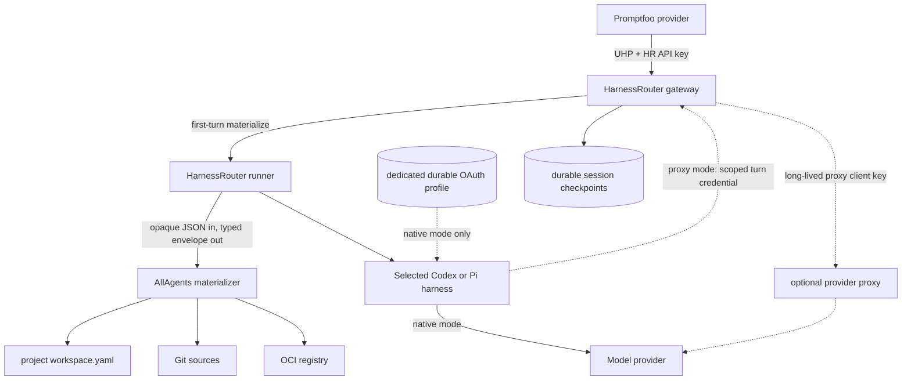

# UHP Coding-Agent Execution through HarnessRouter - Plan

## Goal Capsule

- **Objective:** Let Promptfoo and other authenticated UHP clients run a
  configured Codex or Pi harness against an AllAgents Git workspace or immutable
  OCI workspace snapshot, continue the same conversation and writable workspace
  with `previous_response_id`, and receive source provenance, output, usage, and
  artifacts.
- **Means:** Deploy a pinned HarnessRouter CE fork. Preserve HarnessRouter's UHP,
  caller authentication, session, streaming, cancellation, artifact, and
  agent-runner behavior. Add a generic first-turn materializer boundary, nested
  working-directory support, durable materialization state, nested-repository
  checkpoint/collection support, and a separation between session state and
  durable harness-native OAuth state. Implement Git/OCI semantics in a separate
  AllAgents executable. Codex authenticates through `codex login`; Pi
  authenticates through its `/login` flow for the selected provider. An
  API-key-authenticated proxy is an explicit last-resort target mode. Optional
  describes deployment configuration, not release scope: version one implements
  and verifies it for operators that reject the native owner-trust boundary.
- **Authority:** [ADR 0002](../decisions/0002-adopt-uhp-through-harnessrouter.md)
  owns the protocol, fork, trust, workspace, harness-authentication, and
  provider-routing decisions. UHP `2026-09-12` and HarnessRouter's conformance
  suite own execution-wire behavior. The project `workspace.yaml` owns logical
  Git/OCI sources and environment-variable credential references; deployment
  secrets provide the values. HarnessRouter configuration owns harness IDs,
  model allowlists, and authentication bindings. The namespaced
  AllAgents extension owns acquisition and provenance semantics.
- **Execution order:** First build the minimal custom image and pass the blocking
  native-auth adapter gate for both Codex and Pi without implementing the
  AllAgents materializer. Only then prove the workspace fork seam,
  materialization state machine, and checkpoint integration against the real
  runner; freeze the generic hook and AllAgents contracts; implement Git then
  OCI acquisition; prove an explicit proxy mode separately; run Promptfoo
  one-shot and continuation E2E; complete release, fork-maintenance, and
  upstream-ready documentation.
- **Stop conditions:** Stop before production workspace implementation if either
  required native target cannot pass the phase-zero gate: real login, first turn,
  continuation, binding persistence, profile isolation, serialized overlapping
  turns, refresh fault behavior, and passive-persistence checks. Also stop if
  materialization cannot complete and durably checkpoint before provider
  dispatch, nested Git workspaces cannot be collected without corrupting
  HarnessRouter checkpoints, source credentials enter the harness, the
  gateway/runner automatically copies harness OAuth files into a materialized
  source tree, checkpoint, produced-file record, passive log, or public metadata,
  local OAuth state cannot be persisted atomically and validated fail-closed
  while conversation state remains session-scoped, or the fork cannot preserve
  stock UHP behavior and conformance. Do not fall back to prompt instructions,
  an MCP acquisition tool, client-side repository upload, another OAuth profile,
  an implicit API-key route, a second execution protocol, or a parallel
  task/session engine.
- **Tail ownership:** Implementation owns focused tests in both repositories,
  upstream UHP conformance, built-image smoke tests, exact Git/OCI E2E, native
  Codex/Pi OAuth and explicit proxy-mode E2E, two-turn Promptfoo success and
  failure verification, credential boundary checks, documentation, and a clean
  upstreamable HarnessRouter patch series.

---

## Product Contract

### Summary

AllAgents uses HarnessRouter as the execution gateway.
HarnessRouter exposes UHP, authenticates callers, creates and persists sessions,
streams events, runs configured Codex and Pi harnesses, handles cancellation and
idempotency, and returns output, usage, and artifacts.

The missing product-specific capability is deterministic workspace acquisition
before the first agent turn. A focused HarnessRouter fork calls a generic
materializer boundary after allocating the session workspace but before provider
selection. The AllAgents executable validates the product-specific descriptor,
writes and validates staging, and returns path-free provenance. The runner
publishes staging, initializes HarnessRouter and nested-repository checkpoints,
persists a pre-agent checkpoint, and only then permits provider dispatch.

A continuation supplies `previous_response_id`, omits the workspace extension,
and uses HarnessRouter's current native conversation and writable session
workspace. A different revision, snapshot, or working directory requires a new
session. AllAgents does not add stricter predecessor-head or branching semantics
beyond HarnessRouter's UHP behavior.

### Problem Frame

HarnessRouter already implements the generic execution concerns. Reimplementing
them in AllAgents would add a second protocol, lifecycle, session store, process
supervisor, artifact model, provider integration, and conformance burden without
differentiating the product.

Stock HarnessRouter does not expose a documented generic pre-turn seam for a
server-side Git/OCI descriptor. It does not copy arbitrary request metadata into
response metadata or forward it to ordinary Codex/Pi runners. Input files are
written before the agent and support nested paths, but client-side expansion
loses exact symlink, mode, Git-history, and OCI layer semantics and makes every
caller responsible for acquisition. The temporary fork closes those seams.

### Actors

- **A1. UHP caller:** Promptfoo or another application holding a HarnessRouter
  API key. It chooses a configured HarnessRouter harness ID and model, prompt,
  initial workspace descriptor, and optional continuation predecessor.
- **A2. HarnessRouter gateway:** Authenticates and validates UHP, owns response
  and session identity, treats the configured workspace metadata value as
  bounded opaque JSON, drives materialization before provider fallback, and
  returns hook metadata on every response path.
- **A3. AllAgents materializer:** A subprocess executable that exposes no
  listening service, invoked before the first turn. It validates the AllAgents
  descriptor, reads the mounted project workspace configuration, acquires Git or
  OCI sources into staging, validates the tree, and returns provenance.
- **A4. HarnessRouter runner:** Owns the per-session operating-system identity,
  publication, checkpoints, nested-repository collection, input files, safe
  nested cwd, selected Codex/Pi process, session conversation state, and
  projection of the selected durable auth profile.
- **A5. Harness-native auth profile:** One dedicated durable credential root for
  one Codex or Pi harness target. The harness owns login and token refresh. The
  gateway lifecycle never copies its files into workspace checkpoints or public
  metadata; active harness access is part of the owner-trust boundary.
- **A6. Optional authenticated proxy:** A last-resort, explicitly configured
  target mode. The gateway keeps the long-lived proxy client key, the proxy owns
  upstream provider authentication, and the harness receives only a
  non-refreshable, scoped turn credential that the HarnessRouter broker validates.
- **A7. Operator:** Pins and deploys the custom image, mounts durable data and
  project workspace configuration, completes each native harness login, supplies
  deployment-only source credential values, selects any explicit proxy targets,
  and controls private-network access.

### Key Decisions

- **Use UHP as the northbound contract.** UHP `2026-09-12` is the only
  northbound execution contract. HarnessRouter conformance is authoritative.
- **Fork narrowly and upstream later.** Delivery uses an AllAgents-maintained
  fork. The upstreamable layer is a configured opaque-metadata key, immutable
  first-turn binding, typed command envelope, durable pre-provider lifecycle,
  safe nested cwd, checkpoint/collection integration, and separation of durable
  harness-auth state from session state. It contains no AllAgents Git/OCI schema
  logic. Upstream acceptance is not critical-path.
- **Run the AllAgents component behind HarnessRouter.** The materializer is a
  subprocess hook, not another HTTP gateway and not a custom agent backend.
- **Materialize once per extension-bearing session.** An extension-bearing
  initial request creates and checkpoints the workspace. Continuations must omit
  the extension and reuse the session through `previous_response_id`.
- **Keep source authority server-side.** Callers select logical source names and
  revisions but cannot send origins, credentials, host paths, commands, or
  Docker options.
- **Prefer harness-native OAuth.** Promptfoo's HarnessRouter API key authenticates
  the UHP caller only. Codex and Pi use their own login, token storage, refresh,
  and provider request path; native mode has no provider-route API key.
- **Make proxy auth explicit.** `proxyApiKey` is a last-resort target mode for a
  compatibility or stronger-isolation requirement. It is optional to configure
  but remains required version-one implementation and verification scope. OAuth
  failure never activates it, and a session never changes its persisted
  authentication binding.
- **Preserve stock UHP requests.** Requests without the configured metadata key
  behave exactly as upstream.
- **Use a custom HarnessRouter image.** The image combines a pinned HarnessRouter
  revision, reviewed patch series, pinned agent runtimes, and the AllAgents
  materializer executable.
- **Publish from an AllAgents-owned registry.** Release the public image as
  `ghcr.io/allagentsdev/harnessrouter`; tags identify releases, but deployment
  and E2E pin the published manifest digest.

### Requirements

#### UHP, authentication, and routing

- **R1.** Pin HarnessRouter CE to a reviewed upstream commit and UHP version
  `2026-09-12`. The deployment must pass the applicable upstream conformance
  suite without weakening, replacing, or reinterpreting stock UHP behavior.
- **R2.** Require a HarnessRouter API key for every externally reachable UHP,
  response/session retrieval, stream, cancellation, file, and artifact endpoint.
  Reject unauthenticated requests before disclosing resource existence or
  metadata. Gateway-to-runner operations are not externally routable and are
  mutually authenticated. Bind the service to loopback or a private interface
  and document the remaining need for Tailscale ACLs, firewall policy, or
  equivalent network controls.
- **R3.** HarnessRouter deployment configuration owns stable harness IDs,
  backend, model allowlist, and exactly one auth binding:
  `{ mode: "nativeOAuth", profile: ConfigName }` or
  `{ mode: "proxyApiKey", connection: ConfigName }`. A proxy connection is a
  closed server-side record containing private HTTPS base URL, expected TLS
  identity/CA, HarnessRouter-supported API format and endpoint set, gateway-only
  proxy-client-key secret handle, broker audience, and requested-to-proxy model
  map. Callers cannot override any field. Requests select a harness with stock
  `metadata.harness_id` and a model with `model`; AllAgents profiles are not
  projected into this catalog. Codex and Pi targets default to `nativeOAuth`.
  A target is advertised only after its selected auth binding passes: profile
  login/refresh/live-turn checks for native OAuth, or schema, TLS, broker,
  model-map, endpoint, and live compatibility checks for `proxyApiKey`. On the
  first turn, the gateway persists the harness target, auth mode, binding
  identity, and canonical binding-config digest in the session. Continuations
  require that exact binding; deployment config changes never switch it.
- **R4.** Add a durable auth root outside session workspaces with one
  least-access profile directory per harness target. Controlled setup runs
  `CODEX_HOME=<profile> codex login` with file credential storage for Codex or
  runs Pi `/login` in an isolated Pi home for the configured provider. The
  runner projects only the selected profile's exact auth files into the
  session-specific CLI home and keeps conversation/rollout state session-scoped.
  The projection must preserve the harness's credential-file write and
  atomic-replacement behavior. A locally committed refresh uses a same-filesystem
  temporary file, file `fsync`, atomic rename, parent-directory `fsync`, and
  validation. A crash after the provider rotates credentials but before local
  commit can leave the profile stale; restart then marks it `repair-required`
  and requires native login instead of changing profile or auth mode. The
  gateway/runner must not automatically serialize auth files into root or nested
  checkpoints, produced-file records, passive logs/traces, materializer input,
  or response metadata. Native mode sets explicit owner trust because the
  harness and tool subprocesses sharing its operating-system identity may read
  or emit that credential. In `nativeOAuth`, version one supports exactly one
  active refresh-capable turn per profile and holds that profile lock for every
  turn and every login, logout, or repair operation. Admission preserves UHP
  precedence with an atomic `Idempotency-Key` claim around lookup and admission.
  The single claim owner proceeds; simultaneous same-key arrivals wait on that
  claim and receive the owner's result without a second profile-lock attempt. If
  the owner fails before response allocation, the gateway publishes that same
  request error to current waiters and removes the claim so a later retry can try
  again. A new turn in an already-active session returns `session_busy`; only
  then does a genuinely new executable turn try the native profile lock.
  Cross-session collision returns HTTP 503 `harness_unavailable` with
  `detail.reason: "allagents_auth_profile_busy"` before response allocation,
  runner work, or materialization. No per-profile waiter queue exists; the UHP
  idempotency claim wait is part of one logical request, not such a queue.

  Admission is a private runner operation: the runner turn supervisor persists an
  active-profile admission record, takes the operating-system advisory lock, and
  returns an opaque admission token before the gateway allocates a response. The
  runner—not the gateway—owns that lock through descendant termination and
  refresh commit. A gateway-only crash therefore leaves the lock held; restart
  reconciles the token and active runner before admitting another turn. The
  runner releases only after the gateway acknowledges durable terminal
  response/state and the runner has either durably committed native refresh state
  or marked the profile `repair-required`. If the runner process dies, the OS
  releases the lock, but its durable admission record keeps readiness/admission
  closed until startup proves all descendant boundaries empty and validates or
  repairs the profile. Ordinary and administrative paths use one `finally`
  release/ack protocol. `proxyApiKey` uses no native profile lock.
  Operators provision distinct native profiles when they require parallel turn
  capacity. Preserve HarnessRouter streaming,
  cancellation, idempotency, files, artifacts, completed-session persistence,
  and per-session workspace/UID isolation.

#### Workspace extension and hook

- **R5.** On an initial response request, accept one optional JSON object of at
  most 64 KiB and 32 levels at `metadata["allagents.workspace"]`.
  HarnessRouter checks only those generic bounds, canonicalizes the opaque value
  with RFC 8785, and binds its digest to the new session. A continuation must
  omit this key. The AllAgents hook validates the exact v1 object
  `{ version: "1", source, workingDirectory? }`; `source` is exactly
  `{ kind: "repositories", revisions?: Record<ConfigName, RevisionText> }` or
  `{ kind: "workspaceSnapshot", snapshot: ConfigName, digest: Digest,
  workspaceManifestDigest: Digest }`; `workingDirectory` is exactly
  `{ kind: "workspaceRoot" }` or
  `{ kind: "repository", repository: ConfigName, path?: RelativeDirectory }`.
- **R6.** The AllAgents hook expands omitted `revisions` to `{}` and omitted
  `workingDirectory` to `{ kind: "workspaceRoot" }`; an omitted repository
  `path` remains absent and an empty path is invalid. It NFC-normalizes strings,
  sorts maps, rejects unknown fields, and hashes RFC 8785 bytes as the effective
  descriptor digest. Project-config default refs affect resolved provenance, not
  this request digest. Accepted/rejected fixtures prove omitted and
  explicit-default forms canonicalize identically.
- **R7.** Add one runner-side `/materialize` operation outside the provider
  candidate loop. It invokes a configured executable directly without a shell
  after fresh-session hydrate and before `/turn`. Pass at most 128 KiB on stdin,
  accept at most 1 MiB on stdout and 64 KiB on stderr, and use the smaller of
  900 seconds or the remaining UHP deadline. The generic request contains the
  opaque metadata value, session workspace, fixed sibling staging and private
  result roots, project configuration root, and deadline. Source values come
  from an owner-only runner secret mount or credential-store handle, never the
  gateway/runner base environment. The runner resolves only the selected handle
  and constructs the allowlisted materializer child environment. Startup
  preflight blocks readiness if a configured secret name or value appears in the
  service or agent environment. The per-request recheck, after allocation but
  before child or agent launch, returns failed
  `allagents_secret_boundary_violation` on the same condition. Before injecting
  secrets, the runner creates a
  per-materialization cgroup v2 leaf under a runner-owned delegated subtree and
  starts the child inside it atomically with `clone3(CLONE_INTO_CGROUP)`. Where
  that primitive is unavailable, it forks a child with no secret material and
  holds it at a pre-exec handshake; the parent moves it to the leaf, verifies the
  exact membership through `/proc/<pid>/cgroup`, then delivers the one-shot secret
  bundle and releases the child to construct its environment and `exec`. The
  stopped child cannot execute user code or fork before verified membership. The
  child cannot write the parent `cgroup.procs` or administer the subtree; a
  process group or post-exec PID migration is insufficient.
  On every outcome, including a parent that returns `completed`, the runner
  closes the hook streams, checks
  `cgroup.events`, uses `cgroup.kill` when membership remains, and waits a bounded
  interval for `populated 0`. It does not accept success, read the private
  manifest, validate or publish staging, release the secret environment, or
  remove roots before the cgroup is empty. Membership remaining after a parent
  reports `completed` is itself failed
  `allagents_workspace_containment_breach`, even when `cgroup.kill` subsequently
  reaches `populated 0`; that recovered violation does not require runner exit.
  If the cgroup cannot become empty, the runner reports an internal
  `containment_pending` reason. The gateway CASes only the internal session state
  to `containment_pending`/non-resumable and acknowledges that receipt; it emits
  no terminal stream event and GET continues to show non-terminal `in_progress`.
  The runner exits nonzero after that acknowledgement or a bounded
  acknowledgement deadline. The required `on-failure` restart policy destroys
  the old container boundary; startup keeps readiness false, removes or
  quarantines orphaned cgroups, and reports `containment_reconciled` only after
  the old boundary is proven empty. Only then may the gateway terminalize and
  expose the response: client cancellation becomes `cancelled`, declared-budget
  exhaustion becomes `incomplete`, and every other case becomes failed
  `allagents_workspace_containment_breach`. No terminal response/state, terminal
  event, result read, publication, secret release, or cleanup becomes observable
  before that proof. The typed hook result is `completed` with effective relative
  cwd, a private workspace-manifest reference and digest, and bounded public
  metadata, or `failed` with a cataloged code, safe message, and retryability.
  Materializer failure never enters provider fallback.
- **R8.** Persist a CAS-protected session materialization state:
  `unbound -> materializing -> ready`, `failed`, or internal
  `containment_pending -> failed`, plus the resolved harness target, auth mode,
  native-profile or proxy-connection identity, and canonical
  binding-config digest. The runner validates the private workspace manifest and
  successful staging independently, publishes staging with a recoverable
  same-filesystem rename protocol, removes the private result root, writes a
  descriptor/provenance marker, initializes the HarnessRouter root checkpoint
  and nested-repository collection baselines, and returns `published` with the
  checkpoint digest. Before provider dispatch, the gateway stores that digest
  and public metadata and CASes the session to `ready`.
  On restart in `materializing`, reconcile to `ready` only when the workspace
  marker and durable checkpoint match the bound descriptor; otherwise mark the
  session non-resumable, remove or quarantine the workspace, and never replay
  acquisition.
  Every continuation resolves the persisted auth binding by identity and digest;
  if unavailable or changed, it fails before runner work instead of selecting a
  replacement. Provider fallback sees `ready` state only and cannot invoke the
  hook. Ordinary input files are applied only afterward. A validated logical cwd
  may be the root or a symlink-safe descendant; the runner derives UID isolation
  from the session root and rejects cross-session or escaping paths.

#### Source acquisition and provenance

- **R9.** Parse the project `workspace.yaml` through its authoritative schema.
  Add strict project-only `workspaceSnapshots` entries:
  `{ name: ConfigName, repository: OciRepository,
  workspaceManifestMediaType: MediaType, executionCredential?: "${ENV_VAR}" }`.
  `OciRepository` is a normalized `registry-host/repository-path` with no scheme,
  tag, digest, userinfo, query, or fragment. Reject unknown fields, literal
  secrets, and duplicate snapshot names; snapshot entries do not merge with user
  configuration. Add the same optional environment-reference field to
  execution-eligible repositories. Secret values remain deployment-only. A
  repository's logical name is explicit `name` or the portable basename of
  normalized `path`. Execution-eligible Git destinations must be unique,
  non-empty, non-root relative child paths so their `.git` directories cannot
  collide with HarnessRouter's root checkpoint repository. Reuse one shared
  source resolver: `source` as a supported HTTPS URL is complete when `repo` is
  absent; otherwise `source` names the supported host/provider and `repo` names
  its repository. Conflicting forms, local/originless entries, duplicate
  repository names, escaping destinations, and unsupported schemes make
  materializer preflight fail. HarnessRouter owns harness/model/provider targets,
  and the user workspace is not a materialization catalog.
- **R10.** Repository mode materializes every execution-eligible declared
  repository. Optional revisions override only matching logical names; otherwise
  use configured `branch`, then the remote symbolic HEAD. `RevisionText` is at
  most 255 ASCII bytes and is either a full 40-hex object ID or a
  `git-check-ref-format`-equivalent ref name. Reject leading dashes, whitespace
  and controls, refspec colons, glob metacharacters, traversal-like components,
  `@{`, and `.lock` components. Resolve a validated full ref, or an unambiguous
  shorthand under `refs/heads/` or `refs/tags/`, with `ls-remote`; accept object
  IDs only when advertised. Subsequent fetch/checkout commands receive only the
  verified object ID with explicit end-of-options handling, never caller text.
  Allow only argument-vector HTTPS Git operations to exact configured hosts, with
  no URL credentials, query, fragment, or redirects. Use an isolated HOME plus
  `GIT_CONFIG_NOSYSTEM=1`, no global config, empty credential helper, disabled
  hooks, `protocol.file.allow=never`, `protocol.ext.allow=never`, and no
  submodule recursion, Git LFS hydration, or configured clean/smudge filters.
  Preserve each repository's `.git` directory for the coding agent. Failure never
  falls through to snapshot mode or another credential identity.
  Limit one materialization to 128 repositories, 500,000 filesystem entries, and
  32 GiB across the staged workspace. A count or byte violation returns failed
  `allagents_workspace_limit_exceeded`. Exhausting the declared UHP time budget
  returns `incomplete` with `error: null`; only an unexpected execution timeout
  before that budget returns failed `timeout`. Every outcome proves the cgroup
  empty before removing staging and starts no provider.
- **R11.** Snapshot mode constructs a server-side immutable OCI reference from
  the selected snapshot's configured repository and caller-provided digest.
  Accept only a direct OCI image manifest with at most 64 distributable
  tar/gzip/zstd layers. Its config descriptor must use the entry's configured
  workspace-manifest media type and address canonical workspace-manifest bytes;
  redirects may not change registry authority. Verify the image manifest,
  workspace manifest, layer size, and digest before use; apply OCI whiteouts;
  limit the image manifest to 4 MiB, the workspace-manifest blob to 128 MiB,
  its `repositories` array to 128 items, total compressed layers to 8 GiB,
  expanded bytes to 32 GiB, entries to 500,000, one regular file to 4 GiB, paths
  to 4096 UTF-8 bytes and 128 components, and one PAX/extended header to 1 MiB.
  The runner independently rejects a 129th repository root even when the archive
  and fetched manifest otherwise agree. Reject devices,
  sockets, traversal, escaping links, sparse files, unknown or foreign layers,
  mutable tags, and undeclared output. Recompute the canonical workspace
  manifest from staging and require it to match both the fetched manifest bytes
  and caller-provided digest. Snapshot repository roots need not contain `.git`;
  after publication the runner creates private collection
  baselines from the verified trees so later produced-file reporting remains
  truthful.
- **R12.** Extend HarnessRouter's response translator and stored-response paths
  so streaming events, terminal responses, GET, background completion, and
  idempotent replay return the same bounded
  `response.metadata["allagents.workspace"]`. It contains extension version,
  effective descriptor digest, logical cwd, source mode, completeness, resolved
  commits or OCI image/workspace-manifest/layer digests, and the canonical
  workspace-manifest digest. It never contains origins, physical paths,
  credentials, or unverified facts.
- **R13.** The materializer resolves `${ENV_VAR}` references from its allowlisted
  child environment, uses hermetic Git/registry configuration, removes temporary
  auth files before returning, and emits no secret. Prove with a deliberately
  innocuous variable name and value that source credentials and the HarnessRouter
  caller API key are absent from the gateway/runner base environment, every agent
  environment, workspace, nested Git remotes/config, generated CLI configuration,
  logs, checkpoints, and response metadata. In native mode there is no
  provider-route API key. The selected OAuth profile is intentionally readable by
  the harness trust boundary; the gateway/runner never automatically copies it
  into materialized source trees, checkpoints, produced-file records, passive
  logs, materializer input, or public metadata. An active same-identity harness
  or tool can exfiltrate it; that risk is explicit in owner-trust mode.

  In proxy mode, the long-lived proxy client key and upstream provider
  credentials stay in their owning services. The non-refreshable broker token is
  bound to one proxy audience, harness target, model allowlist, response/turn ID,
  and the UHP deadline plus minimal clock skew. It may authorize the bounded
  provider requests, compaction, and retries required during that active turn;
  cancellation or terminal completion revokes it. Passive persistence never
  stores it. The HarnessRouter broker rejects wrong-audience, wrong-model,
  wrong-turn, expired, or revoked tokens.
- **R14.** Build and publish a pinned `linux/amd64` custom HarnessRouter image as
  the public package `ghcr.io/allagentsdev/harnessrouter`. Replace or disable the
  inherited Docker Hub release path. The Dockerfile pins every base image by
  digest; runtime lockfiles and version-locked OS packages, Git/OCI tools, Codex,
  and Pi define the remaining build inputs. The build fails on any unpinned
  input. A no-write job builds, tests, and exports the identified image artifact
  using commit-pinned third-party actions. A separate protected,
  environment-approved publish job accepts only an approved release/tag ref and
  uses `GITHUB_TOKEN` with `contents: read`, `packages: write`,
  `attestations: write`, and `id-token: write`. It publishes unique version and
  commit tags as mutable discovery labels, reads back the registry manifest, and
  creates GitHub/Sigstore build-provenance and SBOM attestations whose subject is
  the final manifest digest. Package visibility is public and verified with an
  anonymous digest pull. Deployment fails unless both attestations verify the
  expected owner, repository, workflow, approved ref, subject digest, predicates,
  base-image digest, runtime lockfiles, OS package set, Git/OCI tool versions, and
  Codex/Pi versions. Release E2E uses that digest, never `latest`. Requests
  without the configured metadata key remain stock-compatible. CI rebases
  selected upgrades and runs upstream plus AllAgents integration tests.
- **R15.** AI Evals owns its Promptfoo provider. It sends the UHP request directly
  to HarnessRouter, maps Promptfoo variables to the closed extension, and maps
  terminal output, usage, artifacts, provenance, and failures to
  `ProviderResponse`. Every non-success follows the Failure Contract's exact
  status/error/retryability/metadata mapping; none becomes empty success or an
  automatic retry. Multi-turn cases retain the prior response ID and send it as
  `previous_response_id`. AllAgents documents the contract and examples but does
  not depend on Promptfoo at runtime.

### Key Flows

#### F1. Start the deployment

1. Run the AllAgents materializer's bounded `preflight` mode. It validates the
   project catalog, snapshot and credential-reference schemas, referenced secret
   presence, required Git/OCI tools, hook contract version, and staging/workspace
   filesystem relationship without contacting sources.
2. In a controlled operator context, initialize each dedicated auth profile:
   run Codex login with that target's `CODEX_HOME`, or run Pi `/login` with that
   target's isolated Pi home and configured provider. Persist only the selected
   harness profile; do not copy a general developer home into the service.
3. If native OAuth cannot satisfy the deployment's trust or compatibility
   requirement, deliberately select a separately configured `proxyApiKey`
   deployment profile. Validate its closed proxy connection, start the tested
   proxy, keep its client key and upstream credentials outside the runner, and
   enable HarnessRouter broker mode. Never configure it as automatic failover
   for a native target.
4. Start the attestation-verified, digest-pinned custom HarnessRouter image with
   durable session data, durable harness auth roots, a private listener,
   HarnessRouter caller key, materializer command, project configuration,
   owner-only source-secret mount/credential-store handle, the configured native
   or proxy trust mode, a runner-owned delegated cgroup v2 subtree, and required
   `on-failure` restart policy. Startup sweeps or quarantines orphaned
   materializer cgroups and withholds readiness unless delegation is usable and
   every prior boundary is empty.
5. From the exact container network, verify each advertised harness ID and model
   allowlist, safe roots, materializer version, selected auth binding, and a live
   turn. Native targets exercise login status, atomic local refresh persistence,
   stale-profile repair, same-binding continuation, and fail-fast overlapping
   turns. An explicit proxy deployment exercises
   schema/TLS/model-map/endpoint compatibility plus bounded in-turn use and
   wrong-scope/expired/revoked rejection. Any required preflight, containment,
   or auth failure prevents readiness.

#### F2. Execute the first repository-backed turn

1. Promptfoo sends one authenticated UHP request with `model`, stock
   `metadata.harness_id`, idempotency input, and the AllAgents workspace object.
2. HarnessRouter validates UHP plus generic metadata bounds and atomically claims
   the `Idempotency-Key` around lookup and admission. One owner proceeds;
   simultaneous same-key arrivals wait on the claim and receive the owner's
   result without another admission attempt. For a genuinely new turn, the owner
   resolves the selected target and canonical auth-binding identity/config
   digest. In `nativeOAuth` it asks the runner supervisor to persist an admission
   record and acquire the profile's zero-waiter try-lock; a cross-session
   collision publishes the cataloged HTTP 503 to current same-key waiters, then
   removes the pre-allocation claim so a later retry can try again. The runner
   returns an opaque admission token and retains the lock. `proxyApiKey` acquires
   no native profile lock. Once admitted, HarnessRouter binds the idempotency
   claim to the response, persists the binding, creates the response/session,
   CASes materialization from `unbound` to `materializing`, and hydrates a fresh
   session workspace.
3. Before provider selection, the gateway calls runner `/materialize`. The
   AllAgents child validates the descriptor and catalog, resolves exact commits
   and source credentials, writes and validates staging, removes credential
   state, and returns provenance without publishing.
4. The runner independently validates the result/tree, publishes staging,
   writes its marker, initializes the root checkpoint plus each declared
   repository's collection cursor, and returns `published`. The gateway stores a
   durable checkpoint and CASes the session to `ready`.
5. HarnessRouter applies ordinary input files and resolves the safe nested cwd.
   In `nativeOAuth`, it projects only the persisted Codex or Pi profile and the
   harness calls its provider directly. In `proxyApiKey`, it projects no native
   profile and supplies only the scoped turn credential and broker base URL for
   the persisted proxy connection. Materialization cannot rerun during provider
   retry/fallback, and failure never changes auth mode.
6. Normal UHP events and every stored/retrieved terminal response include the
   same namespaced provenance. Produced-file collection walks the HarnessRouter
   root plus each declared nested repository without reporting initial source
   files as agent output. A single native-mode `finally` path covers completion,
   cancellation, and every post-admission failure: it persists terminal state,
   durably commits refresh state or marks the profile `repair-required`, and
   acknowledges the admission token. Only then may the runner release the
   profile lock.

#### F3. Continue the session

1. The caller sends `previous_response_id` and omits
   `metadata["allagents.workspace"]`.
2. HarnessRouter atomically claims the `Idempotency-Key` around lookup and
   admission. A simultaneous duplicate waits for or returns the owner's result
   without another admission attempt. For a new request it resolves the current
   session state and writable workspace, requires materialization `ready`, and
   resolves the persisted auth-binding identity and config digest. An
   extension-bearing continuation, changed or unavailable binding, or
   non-resumable session fails before runner work. Same-session concurrency
   returns stock `session_busy` before profile admission. Only then does
   `nativeOAuth` acquire the runner-owned zero-waiter profile lock; cross-session
   saturation returns cataloged `harness_unavailable`. A pre-allocation error is
   delivered to claim waiters before claim removal. Proxy mode acquires no native
   profile lock.
3. HarnessRouter follows its stock predecessor/session semantics. Native mode
   projects the persisted profile; proxy mode mints a new scoped turn token for
   the persisted connection. It resumes the native conversation and returns
   pinned provenance plus new output, usage, and artifacts without changing auth
   mode or binding. The native `finally` boundary releases the profile lock on
   every terminal outcome.

#### F4. Execute an OCI-backed first turn

1. The caller selects one configured snapshot and immutable manifest/workspace
   digests; it never sends the registry origin or credential.
2. The materializer fetches and verifies the direct manifest, config, and layers,
   applies changesets under fixed limits, validates the declared repository
   layout in staging, and returns exact provenance.
3. The runner publishes and checkpoints through the same state machine as F2.
   Any registry, digest, media, path, limit, or layout failure removes staging,
   terminalizes the response, and enters neither Git nor provider fallback.

#### F5. Cancel, fail, or restart

1. On every materializer outcome, including a parent that returns `completed`,
   the runner proves the cgroup empty before exposing any terminal result,
   reading the manifest, publishing, releasing secrets, or cleanup. Membership
   after a parent
   reports `completed` produces failed
   `allagents_workspace_containment_breach` even if `cgroup.kill` empties the
   leaf; the runner may remain ready after cleanup in that recovered case. If
   `populated 0` cannot be proved, the runner reports internal
   `containment_pending`; the gateway persists and acknowledges only that
   non-terminal state, withholding terminal GET/stream visibility. The runner
   exits nonzero after acknowledgement or its bounded deadline. Restart destroys
   the old boundary and keeps readiness false until it proves the old cgroup
   empty, then reports reconciliation. Only after that proof does the gateway
   expose `cancelled` for client cancellation, `incomplete` for declared-budget
   stop, or failed `allagents_workspace_containment_breach` otherwise. No provider
   starts.
2. Agent cancellation and deadline use HarnessRouter's normal UHP lifecycle.
3. Startup reconciles a `materializing` session to `ready` only when the bound
   descriptor, published workspace marker, and durable checkpoint all match.
   Otherwise it marks the session failed/non-resumable and removes or quarantines
   the workspace. It never replays acquisition. A completed `ready` session
   rehydrates from its durable checkpoint.
4. Whole-container termination does not preserve the in-flight agent process.
   Interrupted agent turns fail according to HarnessRouter behavior.
5. Every failure after native admission persists terminal state and valid or
   `repair-required` refresh state before acknowledging the runner's admission
   token. A gateway-only crash leaves the runner-held lock intact until restart
   reconciliation; a runner crash leaves a durable admission record that blocks
   readiness until descendant/profile reconciliation. Only then can a new turn
   acquire the profile; a failed request is never retained as a waiter.

### Acceptance Examples

- **AE1.** A stock UHP request without the configured metadata key produces the
  same response and conformance result on upstream HarnessRouter and the fork.
- **AE2.** Every unauthenticated external create, continuation, GET, stream,
  cancel, file, and artifact request fails before resource existence or metadata
  is disclosed. An authenticated native Codex or Pi turn uses the selected OAuth
  profile; the HarnessRouter caller key is absent from the agent environment and
  filesystem, and no provider-route API key exists in that mode.
- **AE3.** Repository mode resolves configured branch/default/HEAD refs to full
  commits, prepares every execution-eligible repository, preserves nested Git
  history, starts in a validated nested cwd, and returns path-free provenance.
- **AE4.** HarnessRouter maps a non-object extension to HTTP 400 `invalid_input`,
  an oversized extension to HTTP 413 `allagents_workspace_too_large`, and an
  extension on continuation to HTTP 409 `allagents_workspace_immutable`; each is
  an `invalid_request_error` with `param: "metadata.allagents.workspace"` and
  `detail.retryable: false`, before the hook or response allocation. The hook
  rejects unknown logical names, caller-provided URLs, absolute/traversal paths,
  commands, environment fields, credentials, originless/local repositories, and
  duplicate names/destinations
  before source network access or agent launch.
- **AE5.** Two turns linked by `previous_response_id` preserve a file and native
  conversation context. The hook runs once; produced-file collection reports
  modifications inside every nested repository but not the initial source tree.
- **AE6.** A continuation omitting the extension succeeds. Any continuation
  containing the configured workspace key is rejected without changing the
  workspace. A new revision uses a new session.
- **AE7.** Explicit UHP input files overlay materialized paths after the
  pre-agent checkpoint and before agent launch.
- **AE8.** A materializer spawn/nonzero/crash or malformed/oversized result maps
  to `allagents_materializer_failed`; publication/marker, checkpoint/baseline, and
  materialization-state/CAS failures map respectively to
  `allagents_workspace_publication_failed`,
  `allagents_workspace_checkpoint_failed`, and
  `allagents_workspace_state_failed`. A post-allocation secret-boundary recheck
  maps to `allagents_secret_boundary_violation`. Each starts no provider, leaks
  no credential, and leaves the session failed/non-resumable rather than
  partially ready. Atomic-placement, `setsid()`, and double-fork fixtures include
  a parent that returns `completed` while a descendant attempts a delayed write;
  that case returns `allagents_workspace_containment_breach` even when forced
  kill empties the cgroup. An unquiescent leaf preserves public cancellation/
  budget status when mandated, records the containment reason, and exits the
  runner nonzero. Provider fallback never reruns materialization. After every
  fault, a new native turn proves profile admission was safely reconciled.
- **AE9.** OCI mode accepts a valid digest-pinned fixture with gzip/zstd layers
  and whiteouts and rejects mutable tags, indexes, mismatched digests/sizes,
  traversal, escaping links, devices, sparse files, unknown media types, and
  declared-limit overflow.
- **AE10.** Codex signs in and refreshes through Codex CLI; Pi signs in and
  refreshes through Pi for its configured provider. Missing, revoked, expired,
  unrefreshable, or locally stale-after-crash OAuth marks only that profile
  unavailable or `repair-required`; it never selects another profile or proxy.
  A barriered pair of simultaneous first arrivals with one `Idempotency-Key`
  produces one admission and one result; a new continuation in that active
  session returns `session_busy`; and genuinely new turns in other sessions
  sharing the profile fail immediately with cataloged `harness_unavailable`
  before allocation. Same-key waiters receive a pre-allocation error before its
  claim is removed; they never fall through to a second execution. Cross-session
  callers are never queued and cannot acquire later. A separately configured
  `proxyApiKey` deployment's broker permits bounded multi-request provider flow
  and rejects wrong-audience, wrong-model, wrong-turn, expired, or revoked
  credentials.
- **AE11.** Restart after a completed first turn preserves the session and exact
  persisted auth binding. Removing or changing that binding makes continuation
  fail before runner work; restoring the matching identity and config digest
  restores eligibility. Restart during materialization recovers only from a
  matching published marker and durable checkpoint; otherwise it fails without
  automatic replay. Restart during an agent turn follows HarnessRouter's
  interrupted-turn failure behavior.
- **AE12.** The protected publish job releases the public `linux/amd64` GHCR
  package without Docker Hub credentials. An anonymous client reads the manifest,
  verifies the GitHub/Sigstore build-provenance and SBOM attestations' expected
  owner, repository, workflow, approved ref, subject digest, and predicate, and
  pulls that digest rather than `latest`. The evidence records upstream, patch,
  materializer, Codex, and Pi inputs; mismatches fail closed.
- **AE13.** Promptfoo maps request-time auth errors, every cataloged materializer
  failure, UHP `failed`/`incomplete`/`cancelled` results, and HarnessRouter
  execution failures to `ProviderResponse.error`. It preserves the wire error
  code when one exists and otherwise uses the exact terminal status, plus
  retryability, safe message, and verified metadata. None becomes successful
  empty output or an automatic retry.

### Scope Boundaries

**In scope**

- HarnessRouter workspace-integration and harness-auth-state patches.
- Versioned AllAgents workspace descriptor, hook request/result, and provenance.
- Project workspace schema additions and catalog projection.
- Deterministic Git and immutable OCI acquisition.
- Root/nested-repository checkpoint and produced-file integration.
- Source credential isolation and native-OAuth trust-boundary verification.
- Native Codex and Pi auth-profile bootstrap, refresh, readiness, and continuity.
- Explicit, separately validated API-key-authenticated proxy deployment mode.
- Public GHCR image publishing, digest-pinned release metadata, SBOM, and
  provenance.
- Promptfoo contract examples and one-shot/two-turn success/failure E2E.
- Upstream-ready generic hook and auth-state patches plus maintenance procedure.

**Out of scope**

- A second northbound execution protocol or parallel task/session control plane.
- A separate AllAgents network gateway, process supervisor, provider adapter, or
  artifact service.
- Promptfoo runtime code inside AllAgents.
- A custom OAuth broker, token translation layer, or automatic native-to-proxy
  credential fallback.
- Caller-provided origins, credentials, commands, host paths, materializers, or
  Docker options.
- Public multi-tenancy, per-caller authorization, Kubernetes workers, session
  branching, concurrent turns in one session, or guaranteed prompt-cache hits.
- Exact rollback of workspace mutations between successful session turns.

### Sources

- [ADR 0002](../decisions/0002-adopt-uhp-through-harnessrouter.md)
- [HarnessRouter repository](https://github.com/HarnessRouter/harnessrouter)
- [HarnessRouter self-hosting guide](https://github.com/HarnessRouter/harnessrouter/blob/main/docs/self-hosting-guide.md)
- [UHP 2026-09-12 architecture](https://github.com/HarnessRouter/harnessrouter/blob/main/protocol/versions/2026-09-12/architecture.md)
- [UHP sessions](https://github.com/HarnessRouter/harnessrouter/blob/main/protocol/versions/2026-09-12/sessions.md)
- [UHP lifecycle](https://github.com/HarnessRouter/harnessrouter/blob/main/protocol/versions/2026-09-12/lifecycle.md)
- [UHP files](https://github.com/HarnessRouter/harnessrouter/blob/main/protocol/versions/2026-09-12/files.md)
- [Codex authentication](https://developers.openai.com/codex/auth)
- [Pi model providers and OAuth](https://pi.dev/docs/latest/providers)
- [GitHub Container Registry](https://docs.github.com/en/packages/working-with-a-github-packages-registry/working-with-the-container-registry)
- [`codex-lb` optional proxy](https://github.com/Soju06/codex-lb)
- [Harbor repository materialization lessons](../research/harbor-repository-materialization.md)
- [Source credential broker precedents](../research/source-credential-broker-precedents.md)

---

## Planning Contract

### High-Level Technical Design



The gateway owns generic metadata bounds, session materialization state,
persisted auth-binding identity, provider-loop ordering, checkpoint persistence,
response metadata, and optional proxy brokering. The runner owns hook invocation,
staged publication, checkpoint/collection setup, safe nested cwd, and agent
launch. In native mode it projects the bound OAuth profile; in proxy mode it
projects no native profile and supplies only the turn broker capability. The
selected harness owns native provider OAuth login and refresh. Its durable auth
root is outside session checkpoints; it is available to the harness trust
boundary but never to the materializer. The materializer owns only AllAgents
schema, catalog, acquisition, source-credential selection, staging validation,
and provenance; it never speaks UHP or publishes the live workspace.

### Extension Contract

Initial UHP request fragment:

```json
{
  "model": "gpt-5.6-sol",
  "input": "Review the service",
  "metadata": {
    "harness_id": "codex-review",
    "allagents.workspace": {
      "version": "1",
      "source": {
        "kind": "repositories",
        "revisions": {
          "api": "refs/pull/123/head"
        }
      },
      "workingDirectory": {
        "kind": "repository",
        "repository": "api",
        "path": "packages/service"
      }
    }
  }
}
```

Continuation fragment:

```json
{
  "model": "gpt-5.6-sol",
  "previous_response_id": "resp_previous",
  "input": "Now fix the highest-severity finding"
}
```

Successful response metadata fragment:

```json
{
  "allagents.workspace": {
    "version": "1",
    "descriptorDigest": "sha256:...",
    "workingDirectory": {
      "kind": "repository",
      "repository": "api",
      "path": "packages/service"
    },
    "sourceIdentity": {
      "kind": "repositories",
      "complete": true,
      "repositories": [
        {
          "name": "api",
          "requestedRevision": "refs/pull/123/head",
          "resolvedCommit": "0123456789abcdef0123456789abcdef01234567"
        }
      ]
    },
    "workspaceManifestDigest": "sha256:..."
  }
}
```

### Materializer Hook Contract

HarnessRouter configuration names one metadata key, absolute executable path,
maximum runtime, request/result byte limits, and allowlisted environment names.
The runner launches the executable directly without a shell. Standard error is
diagnostic-only, bounded, secret-checked, and never copied verbatim to callers.

The hook supports two operations:

- `preflight`: validate contract version, project catalog, credential-reference
  syntax and presence, required binaries, and filesystem assumptions without
  source network access; and
- `materialize`: validate the opaque descriptor, write source content only to the
  supplied sibling staging root, write the canonical manifest only to the
  supplied private result root, and return without publishing.

The materialize request contains the generic contract version, opaque metadata
value, session workspace, fixed staging and private result roots, project
configuration root, and deadline. Secret values are injected only through the
configured allowlisted child environment; credential identifiers and values are
absent from JSON.

The generic result is either:

- `completed`, effective relative cwd, effective descriptor digest,
  `workspaceManifest: { path: "workspace-manifest.json", digest }`, complete
  path-free public metadata, and declared nested-repository roots; or
- `failed`, cataloged code, safe message, retryability, and any verified
  incomplete public metadata.

The runner validates the result and staged tree independently. It rejects an
unknown envelope field/version, digest mismatch, physical path in public
metadata, incomplete success, undeclared repository root, escaping cwd, or tree
that does not match the manifest. The runner then owns publication, marker and
checkpoint setup; a valid result never means the live workspace is already
published.

### Workspace Manifest Contract

The source tree includes one generated normative
`workspace-manifest.schema.json`, imported unchanged by the Git materializer,
OCI producer/materializer, runner validator, and their contract fixtures. The
document is at most 128 MiB and is an object with `additionalProperties: false`,
required string `version` fixed to `"1"`, required `repositories`, and required
`entries`.

`repositories` is an array with at most 128 items. Every item is an object with
`additionalProperties: false` and exactly the required string fields `name` and
`destination`, validated as `ConfigName` and non-root `RelativeDirectory`.
Names and destinations are each unique; items are sorted by the UTF-8 bytes of
the NFC-normalized `name`. Every destination must exactly equal the `path` of a
directory entry in the same manifest. Duplicate destinations, missing
destination entries, and destinations naming files or symbolic links are
invalid even when the manifest digest is correct.

`entries` is an array with at most 500,000 items. Every item has
`additionalProperties: false` and is exactly one of:

- directory: required string fields `path`, `type: "directory"`, and
  `mode: "040755"`;
- regular file: required string fields `path`, `type: "file"`,
  `mode: "100644" | "100755"`, and
  `sha256: "sha256:<64 lowercase hex>"`, plus integer `size` from zero through
  4 GiB; or
- symbolic link: required string fields `path`, `type: "symlink"`,
  `mode: "120000"`, and `target`.

Paths are unique, non-empty, relative POSIX paths sorted by their NFC-normalized
UTF-8 bytes. Every path component and symlink target must already be valid UTF-8
and NFC; implementations reject rather than normalize non-UTF-8 or non-NFC
values. Paths and targets containing NUL, absolute paths, missing parents, or
links escaping the workspace are invalid. The root is implicit and has no entry.
Hard links are expanded to regular-file entries.

The digest is `sha256:` plus the lowercase SHA-256 of the RFC 8785 bytes. Git
mode computes those bytes after completing staging. OCI mode requires its
configured workspace-manifest blob to contain the same canonical bytes and
copies them to the private result root. The runner resolves only the fixed
`workspace-manifest.json` relative path, validates it against the shared schema,
verifies its size and digest, walks staging without following links, reconstructs
the same catalog and entries, and requires byte-for-byte canonical equality
before publication. The private result root is never published or exposed
through UHP.

The frozen cross-repository fixture is:

```json
{"entries":[{"mode":"040755","path":"services","type":"directory"},{"mode":"040755","path":"services/api","type":"directory"},{"mode":"100644","path":"services/api/README.md","sha256":"sha256:98ea6e4f216f2fb4b69fff9b3a44842c38686ca685f3f55dc48c5d3fb1107be4","size":3,"type":"file"},{"mode":"120000","path":"services/api/current","target":"README.md","type":"symlink"}],"repositories":[{"destination":"services/api","name":"api"}],"version":"1"}
```

Those exact bytes digest to
`sha256:667fef29fd8d241818263c5697075ba99eb86331c41eda5a27a812dc8771e4f8`.
The file bytes are `hi\n`. A change to the schema, fixture bytes, or digest is a
versioned contract change, not an implementation detail.

### Failure Contract

Failures before response allocation use the UHP non-2xx error envelope. Failures
after allocation return HTTP 200 with terminal `status: "failed"` and the same
error object in `response.error`; workspace failures use
`type: "harness_error"`, a safe message, `param: null`, and
`detail: { "retryable": <boolean> }`. Stock cancellation remains terminal
`status: "cancelled"`. The hook's `retryable` field must equal this catalog:

| Code | UHP placement | Retryable |
|---|---|---|
| `invalid_input` | HTTP 400 `invalid_request_error` before response allocation for a non-object workspace extension; `param` is `metadata.allagents.workspace` | no |
| `allagents_workspace_too_large` | HTTP 413 `invalid_request_error` before response allocation for the 64-KiB/depth bound; `param` is `metadata.allagents.workspace`; `detail.max_bytes` is 65536 for the byte bound | no |
| `allagents_workspace_immutable` | HTTP 409 `invalid_request_error` before response allocation when a continuation contains the workspace extension; `param` is `metadata.allagents.workspace` | no |
| `harness_unavailable` / `detail.reason: "allagents_auth_profile_busy"` | HTTP 503 `server_error` before response allocation for a saturated auth profile; `param` is null | yes |
| `harness_unavailable` / `detail.reason: "allagents_auth_profile_unavailable"` | HTTP 503 `server_error` before response allocation for an unavailable or repair-required auth binding; `param` is null | yes |
| `allagents_workspace_invalid` | failed response for post-allocation descriptor, catalog, path, layout, OCI image-manifest shape, index, or unsupported/foreign media rejection that is not a numeric limit | no |
| `allagents_workspace_source_auth_failed` | failed response for Git or registry credential rejection | no |
| `allagents_workspace_acquisition_failed` | failed response when Git, registry, HTTP, or transport I/O prevents complete byte acquisition; excludes digest, schema, and limit failures | no |
| `allagents_workspace_limit_exceeded` | failed response for source/workspace/archive/manifest repository, entry, byte, layer, file, path, or header limits; excludes hook request/stdout/stderr envelope limits | no |
| `timeout` | failed response only for an unexpected execution timeout before the declared task budget; a declared time/step budget remains UHP `incomplete` with `error: null` | no |
| `allagents_materializer_failed` | failed response for materializer spawn/nonzero/crash or malformed/oversized hook output | no |
| `allagents_secret_boundary_violation` | failed response when a post-allocation recheck finds a configured source-secret name or value in the service or agent environment | no |
| `allagents_workspace_manifest_invalid` | failed response for the workspace-manifest media type, schema, RFC 8785 bytes, or declared workspace-manifest digest | no |
| `allagents_workspace_integrity_mismatch` | failed response for OCI image/config/layer descriptor digest or size mismatch, or when staging differs from the verified workspace manifest | no |
| `allagents_workspace_publication_failed` | failed response for recoverable staging publication or marker failure | no |
| `allagents_workspace_checkpoint_failed` | failed response for root/nested checkpoint or collection-baseline failure | no |
| `allagents_workspace_state_failed` | failed response for a materialization-state persistence/CAS failure | no |
| `allagents_workspace_containment_breach` | failed response for completed-parent/live-descendant even if forced kill succeeds; an unquiescent leaf first enters internal non-terminal `containment_pending`, exits/restarts, and becomes public only after the old boundary is proven empty, preserving client-cancellation or declared-budget status | no |

Classification order is normative. A completed-parent/live-descendant violation
is the failed containment code. Any other containment breach supersedes the
hook's earlier result for internal session state but never overwrites
UHP-mandated public `cancelled` or `incomplete`; absent either, it becomes the
failed containment code. Otherwise a declared UHP budget produces `incomplete`;
an unexpected execution timeout produces `timeout`; the post-allocation secret
boundary recheck precedes numeric limits; numeric limits are classified before
generic schema validation; and remaining failures use source authentication,
semantic workspace validation, acquisition I/O, materializer process/envelope
validation, workspace-manifest validation, cryptographic/tree integrity,
publication, checkpoint, then durable-state failure in that order.
One terminal outcome carries exactly one code. Thus a 129-item repository array
is `allagents_workspace_limit_exceeded`, malformed canonical workspace-manifest
bytes are `allagents_workspace_manifest_invalid`, registry transport failure is
`allagents_workspace_acquisition_failed`, and an OCI layer digest mismatch is
`allagents_workspace_integrity_mismatch`.

Deployment `preflight` runs before readiness and allocates no UHP response. Its
failure stays operational: readiness is false and the safe operator diagnostic
uses the same classification vocabulary without pretending a task failed.

Vendor codes and vendor detail reasons use the required `allagents_` prefix. A
request failure includes `detail.retryable`; the busy-profile reason omits
`retry_after_ms` rather than guessing. Promptfoo maps a non-2xx or `failed`
response to `ProviderResponse.error = "<error.code>: <error.message>"`. It maps
`incomplete` to `ProviderResponse.error = "incomplete: task stopped at a budget"`
and `cancelled` to
`ProviderResponse.error = "cancelled: task cancelled by client"`; both have
`code: null` and `retryable: false`. Every failure includes
`metadata.uhp = { httpStatus, responseStatus, code, reason, retryable }`.
`responseStatus` is null for a pre-allocation non-2xx request error and is the
actual terminal status for an HTTP-200 response. Verified
`metadata.allagentsWorkspace` is included when available; `reason` is the error
detail reason or the incomplete detail reason when present, otherwise null.
Promptfoo never converts a non-2xx, failed, incomplete, or cancelled UHP result
into successful empty output and performs no automatic retry.

### Fork Maintenance Contract

- Keep the fork in a dedicated repository/branch with the upstream remote intact.
- Pin production images to an upstream commit, never a moving branch.
- Keep the materializer changes as a small ordered patch series with focused
  commits and no formatting churn.
- For every selected upstream upgrade: rebase the patch series, inspect upstream
  changes in touched gateway/runner/session code, run upstream tests and UHP
  conformance, run AllAgents hook/session E2E, rebuild the image, and record the
  new inputs and digest.
- Publish releases to `ghcr.io/allagentsdev/harnessrouter`, record the manifest
  digest, and rehearse deployment from that digest rather than a local build or
  mutable tag.
- Prepare upstream proposals as generic command/plugin and harness-auth-state
  seams. Do not require upstream to understand AllAgents metadata, Git catalogs,
  OCI manifests, Promptfoo, or a specific OAuth provider.
- If upstream accepts an equivalent seam, delete the patch rather than retaining
  a compatibility layer.

### Risks and Mitigations

- **Fork drift:** Keep the patch ordered and narrow, pin commits, rebase only
  selected releases, and run both upstream and integration suites.
- **Gateway/runner durability split:** Use the explicit materialization CAS plus
  workspace marker and pre-agent checkpoint. Fault every boundary and fail
  incomplete sessions closed rather than attempting replay.
- **Nested Git versus HarnessRouter root Git:** Keep repository `.git` state,
  ignore declared roots in HarnessRouter's root index, and extend produced/list/
  file/ack/checkpoint/hydrate behavior to validate and walk every declared root.
- **Provider retry/fallback:** Run materialization before the provider candidate
  loop and surface a typed non-provider failure; a ready marker prevents reruns.
- **Source credential leakage:** Use subprocess-only source credentials,
  hermetic configuration, leak scans, hostile fixtures, and a non-escapable
  cgroup v2 boundary. Prove `populated 0` before interpreting success, reading
  result files, publishing, releasing secrets, or cleanup.
- **Native OAuth exposure:** Treat the selected profile as available to the
  harness and same-identity tools. Mount no other profile and prevent passive
  gateway/runner persistence from serializing the auth file. A malicious harness
  or tool can still emit its contents; use explicit proxy mode when this
  owner-trust boundary is unacceptable.
- **OAuth refresh loss, races, or queue collapse:** Have the runner supervisor
  persist the admission record and hold the zero-waiter per-profile advisory lock
  through descendant termination, terminal-state acknowledgement, and refresh
  commit. Gateway death cannot release it; runner death leaves a durable fence
  that blocks readiness until startup reconciliation. Preserve idempotency and
  same-session precedence before cross-session admission. Cross-session overlap
  returns `harness_unavailable` with
  `detail.reason: "allagents_auth_profile_busy"` before allocation and can never
  acquire later. Provision distinct profiles for parallelism. Persist local
  writes through same-filesystem temp-write, file `fsync`, atomic rename, parent
  `fsync`, and validation. Fault process death around local persistence; if
  remote rotation leaves the committed profile invalid, mark it
  `repair-required`. Never switch profiles or auth mode, and never run
  shared-profile turns concurrently.
- **Partial publication or forged staging:** The materializer writes source
  content only to staging and the canonical manifest only to the private result
  root. The runner reconstructs and compares the tree, then publishes with
  recovery markers; no agent runs until the gateway durably stores the resulting
  checkpoint and marks the session ready.
- **Descriptor/session drift:** Accept the key only on the initial request and
  persist the hook's effective digest/provenance for every later response.
- **OCI attack surface:** Use a closed media profile, streaming digest checks,
  fixed limits, strict path/link/type validation, and exact-host redirect policy.
- **Catalog scale:** Reject more than 128 repositories, 500,000 entries, 32 GiB
  staged content, or work exceeding the request deadline. Exercise the supported
  boundary with representative multi-repository fixtures and publish those
  limits for Promptfoo operators.
- **Harness auth drift:** Pin Codex and Pi versions and require non-secret login,
  live-turn, refresh, and continuation probes before advertising each target.
- **HarnessRouter restart semantics:** Claim persistence only for completed state
  on durable storage; interrupted work fails and is not replayed.
- **Provider cache assumptions:** Report native cached-input usage when available;
  never promise a cache hit.
- **Registry/tag or publisher compromise:** Use a protected, environment-approved
  publish job with pinned actions and no write authority in build/test. Verify
  the attested owner/repository/workflow/ref/subject digest before deployment.
- **Upstream rejection:** The pinned fork remains supported; upstream delivery is
  maintenance reduction, not a launch dependency.

### Phased Delivery

1. Phase-zero native-auth adapter spike: build the pinned minimal image without
   the AllAgents materializer and implement only auth-profile projection,
   persisted binding identity, per-profile serialization, and passive exclusion.
2. Run the blocking Codex and Pi native-auth gate with real provider traffic:
   login, first turn, continuation, restart, changed-binding failure, overlapping
   turns, refresh faults, profile isolation, and checkpoint/log/output scans. If
   either required target fails, stop and revisit ADR 0002 before workspace work.
3. Red E2E against stock HarnessRouter: prove arbitrary metadata is neither
   forwarded to Codex/Pi nor returned as workspace provenance.
4. Workspace fork spike: prove a fake hook runs through a dedicated pre-provider
   operation, publishes/checkpoints once, survives two-turn reuse, supports a
   safe nested cwd, reports nested-repository files, and cannot rerun under
   provider fallback.
5. Freeze generic hook envelope/state/auth fixtures, canonical workspace-manifest
   bytes, and AllAgents descriptor, configuration, provenance, and failure
   fixtures.
6. Implement project schema projection, preflight, Git materialization,
   credential containment, bounded catalog acquisition, and
   checkpoint/collection integration.
7. Implement OCI materialization and its archive/registry security profile.
8. Prove the separately configured authenticated-proxy mode, then run Promptfoo
   one-shot, continuation, cancellation, restart, and failure mappings.
9. Review both repositories; publish the exact GHCR image; verify and deploy its
   attested digest; run green E2E and conformance; document operations; prepare
   the generic upstream patches.

---

## Implementation Units

### U0. Harness-native auth adapter feasibility gate

- **Goal:** Prove the native Codex and Pi authentication architecture before any
  production workspace-materializer implementation.
- **Repositories/files:** Minimal pinned HarnessRouter fork image,
  `runner/server.py`, Codex/Pi launch and home setup, auth-profile projection,
  session auth-binding persistence, checkpoint exclusions, fault fixtures, and
  focused runner/gateway tests. Do not add the AllAgents materializer or Git/OCI
  acquisition in this unit.
- **Approach:** Initialize dedicated profiles only through `codex login` and Pi
  `/login`. Project the selected auth files into session-specific homes while
  keeping conversation state session-scoped. Persist the binding identity/digest,
  serialize every refresh-capable turn per profile, preserve atomic local writes,
  mark invalid post-rotation state `repair-required`, mount no other profile, and
  prevent passive checkpoint/log/output serialization. Use the actual pinned
  harness versions and real provider traffic.
  Freeze and record the HarnessRouter commit, base-image digest, Codex version,
  Pi version, and auth-adapter patch digest used by the gate.
- **Verification:** For both Codex and Pi, complete login, a real first turn,
  continuation, and restart without a provider-route API key. Change or remove
  the binding and prove continuation fails before runner work. Use a barrier to
  make two first arrivals atomically contend for the same new `Idempotency-Key`
  and prove one admission/one result; prove a new same-session continuation
  returns `session_busy`; and prove genuinely new cross-session turns fail
  immediately with cataloged `harness_unavailable` before allocation. Same-key
  waiters receive any pre-allocation owner error before claim removal; no rejected
  cross-session request can acquire later. Record representative turn duration
  and the one-active-turn-per-profile, zero-waiter operator capacity rule. Inject
  materializer, publication, checkpoint, provider, cancellation, gateway-only
  crash, runner crash, and whole-process-death faults; after each, prove
  reconciliation completes before the next new turn acquires the runner-owned
  fenced profile lock.
  Terminate before, during, and after local refresh persistence; restart must see
  a complete file that validates or becomes `repair-required`. Prove unselected
  profiles and other sessions' conversation state are inaccessible. With an
  inert agent, scan checkpoints, produced-file records, passive logs, and response
  metadata for automatic credential serialization. Record that an active
  same-identity tool can still read or emit the selected credential.
  Preserve those exact input identities with the evidence.
- **Gate:** U1-U6 must not begin until both required native targets pass. Failure
  stops dependent work and reopens ADR 0002; proxy-only scope requires an
  explicit decision change and cannot count as a passing native gate. Any change
  to a frozen input invalidates the gate and stops dependent work until both
  native targets pass again on the new input set.

### U1. HarnessRouter fork and hook feasibility

- **Goal:** Prove the smallest production-direction workspace fork can
  materialize and durably checkpoint one workspace before provider dispatch
  while preserving stock UHP requests.
- **Repositories/files:** HarnessRouter fork `gateway/app.py`,
  `runner/server.py`, response/session persistence, checkpoint/produced-file
  helpers, runner/gateway tests, and a fake materializer hook.
- **Approach:** Add configured opaque metadata extraction and bounds, generic
  result envelope, generated workspace-manifest schema and frozen canonical
  fixture, materialization CAS, a dedicated runner operation before the provider
  loop, response-translator persistence, safe nested cwd, staged publication,
  pre-agent checkpoint, runner-owned cgroup v2 containment, and
  nested-repository collection.
- **Verification:** Upstream UHP conformance stays green and stock requests are
  unchanged. Faults at every state/publication/checkpoint boundary fail closed
  with the exact catalog code: materializer process/envelope, publication/marker,
  checkpoint/baseline, state/CAS, and secret-boundary fixtures cover their rows.
  The runner independently rejects a forged manifest, changed staging entry,
  escaping link, undeclared or 129th repository, duplicate/missing repository
  destination, repository destination naming a file or symlink, or invalid
  private manifest path. `clone3(CLONE_INTO_CGROUP)` and stopped pre-exec
  fallback fixtures immediately fork, call `setsid()`, and double-fork; cases
  cover cancellation, deadline, and a `completed` parent whose descendant
  attempts a delayed write. All prove `populated 0` before any terminal result,
  manifest read, publication, secret release, or cleanup. The completed-parent
  violation
  returns the containment code even after successful kill. An unquiescent fixture
  proves internal `containment_pending`, bounded acknowledgement, nonzero runner
  exit, `on-failure` restart, old-boundary emptiness, and readiness held false
  through orphan sweep. GET and stream remain non-terminal until reconciliation,
  after which mandated cancellation/budget or failed-containment status appears.
  Provider fallback cannot rerun the
  hook. A continuation reuses workspace, provenance, and the persisted auth
  binding without the extension. Root and nested repository files collect
  correctly, and an escaping cwd fails.

### U2. AllAgents workspace contracts and Git materializer

- **Goal:** Implement the versioned schemas, authoritative catalog projection,
  deterministic Git acquisition, logical cwd resolution, and provenance.
- **Files:** `src/models/workspace-config.ts`,
  `src/models/execution-workspace.ts`, `src/core/execution-workspace.ts`,
  `src/core/workspace-repo.ts`, `src/cli/commands/workspace.ts` or one narrowly
  registered integration command, generated workspace schemas, build packaging,
  configuration documentation, unit fixtures, and Git E2E fixtures.
- **Approach:** Reuse authoritative workspace parsing and source normalization.
  Extend the project schema with strict snapshot and environment credential
  references; generate the normative workspace-manifest schema; add
  descriptor/hook/result schemas, defaults, canonicalization, and a `preflight`
  mode. Expose a direct no-shell materializer entrypoint. Resolve the complete
  execution-eligible catalog to exact commits in staging, preserve nested
  `.git`, enforce the closed Git policy, validate destinations and cwd, compute
  the workspace manifest, and return without publishing.
- **Verification:** Local HTTPS fixtures cover branches, tags, commits, PR refs,
  configured defaults and symbolic HEAD, multiple repositories, optional-name
  fallback, conflicting/originless/local sources, root/duplicate destinations,
  unknown names, missing directories, traversal, leading-dash/control/refspec
  revisions, ambiguous shorthand, hooks/helpers/filters, submodules, LFS,
  file/ext protocols, redirects, cancellation, timeout, partial cleanup,
  canonical defaults, preflight failures, exact provenance, generated-schema
  validation, frozen canonical fixture bytes/digest, manifest reconstruction,
  and the 128-repository, 500,000-entry, 32-GiB, and deadline boundaries.

### U3. Session binding, failures, and credential containment

- **Goal:** Make the fork/materializer boundary durable, fail-closed, and safe for
  continued sessions.
- **Repositories/files:** HarnessRouter session/response persistence and tests;
  AllAgents credential-selection/environment code and hostile fixtures.
- **Approach:** Persist `unbound/materializing/containment_pending/ready/failed`,
  opaque request
  digest, effective descriptor digest, public provenance, workspace marker,
  checkpoint digest, and canonical auth-binding identity/digest through
  compare-and-set transitions. Extend every response construction/retrieval/
  replay path with identical public metadata and the exact failure catalog.
  Resolve source `${ENV_VAR}` references only when constructing the materializer
  child from an owner-only runner secret source; reject configured names or
  values in the base service or agent environment. Use a delegated,
  child-inaccessible cgroup v2 leaf and prove it empty before accepting any hook
  outcome, reading result files, publishing, releasing secrets, or cleaning
  staging. In native mode, project only the selected harness OAuth profile and
  exclude it from passive session persistence. In explicit proxy mode, broker
  the proxy client key with the required audience, target, model, turn, expiry,
  and revocation constraints. Scan workspace, nested Git, CLI session state,
  checkpoints, logs, and responses.
- **Verification:** Initial idempotent replay preserves one result; continuation
  omits the extension and reuses ready state plus the exact auth binding;
  extension-bearing continuation or changed/unavailable binding fails. Crashes
  around hook/publication/checkpoint/CAS reconcile to ready only when the bound
  descriptor, published marker, and durable checkpoint all match; missing or
  mismatched evidence becomes failed/non-resumable with the exact materializer,
  publication, checkpoint, or state code. Cancellation, deadline, malformed
  output, completed-parent/live-descendant, and runner-shutdown fixtures leave
  the cgroup empty before cleanup. A recovered completed-parent violation returns
  `allagents_workspace_containment_breach`; failure to prove emptiness records
  internal `containment_pending`, completes the internal gateway handshake or
  bounded timeout, exits/restarts the runner, and withholds readiness plus every
  terminal GET/stream result until the old boundary is proven empty. Reconciled
  cancellation/budget retains its mandated public status; other cases become
  failed containment. Startup and post-allocation secret-boundary fixtures
  respectively block readiness with no UHP response and return
  `allagents_secret_boundary_violation`. Source secrets and the HarnessRouter
  caller key are absent from the base service and every shell-enabled agent path.
  The selected OAuth profile is available only through its harness home; other
  profiles are inaccessible. An inert-agent probe confirms no gateway/runner
  path automatically serializes it into checkpoints, produced-file records,
  passive logs, or public metadata; an active tool can still exfiltrate it in
  owner-trust mode. Native mode has no provider-route API key. Proxy tests allow
  bounded in-turn provider calls and reject every out-of-scope, expired, or
  revoked broker token.

### U4. Immutable OCI workspace materialization

- **Goal:** Add the second closed source mode without weakening Git behavior or
  allowing fallback.
- **Files:** AllAgents OCI client, manifest/archive validator, workspace-manifest
  types, deterministic snapshot producer fixture, local registry E2E, and
  security fixtures.
- **Approach:** Resolve only configured registries, implement bounded
  Basic/Bearer authentication and exact-host redirect policy, verify the direct
  manifest, canonical workspace-manifest blob, and layers while streaming, apply
  changesets in staging, validate paths/types/limits/catalog, reconstruct the
  canonical manifest, and return through the same hook envelope as Git. The
  HarnessRouter runner remains the sole publisher.
- **Verification:** Local Distribution fixtures cover anonymous and authenticated
  pulls, private CA, gzip/zstd, whiteouts, redirects, rebinding policy, indexes,
  unknown/foreign media, traversal, escaping links, devices, sparse files,
  cancellation, cleanup, and no Git fallback. They assert exact precedence:
  transport failure is `allagents_workspace_acquisition_failed`; an OCI index,
  malformed image-manifest shape, unknown/foreign media, or
  duplicate/missing/non-directory repository destination is
  `allagents_workspace_invalid`; 129 repositories or any other numeric overflow
  is `allagents_workspace_limit_exceeded`; workspace-manifest media/schema/
  canonical-byte/declared-digest failure is
  `allagents_workspace_manifest_invalid`; and OCI image/config/layer digest/size
  or final staged-tree mismatch is
  `allagents_workspace_integrity_mismatch`.

### U5. Harness-native OAuth, optional proxy, and Promptfoo E2E

- **Goal:** Carry the phase-zero auth invariants unchanged into the complete
  workspace image and prove session continuity, optional proxy isolation, and
  consumer success/failure mapping.
- **Repositories/files:** custom image/configuration, auth-profile setup and
  projection, HarnessRouter integration fixtures, AI Evals Promptfoo
  provider/configuration in its owning repository, and deployment examples in
  AllAgents docs.
- **Approach:** Reuse the accepted U0 adapter and fixtures; do not redesign the
  native credential boundary here. Configure dedicated Codex and Pi auth roots
  and bootstrap them only through each harness's login flow. Exercise login
  status, live turns, atomic local refresh persistence, stale-credential repair
  after remote rotation, same-binding continuation, serialized overlapping
  turns, profile isolation, and missing/revoked credential failure.
  In a separate explicit deployment profile, validate the closed proxy connection
  and broker audience/target/model/turn/expiry/revocation contract. Run Promptfoo
  Git/OCI one-shot and two-turn cases plus materializer, authentication, and
  agent failures.
- **Verification:** Through the exact container network, Codex and Pi authenticate
  through their own OAuth sessions and use allowed models. Turn two sees turn
  one's conversation and file mutation with the same persisted auth binding. A
  barriered pair of simultaneous first arrivals with one `Idempotency-Key`
  produces one admission and one result; a new same-session continuation returns
  `session_busy`; and genuinely new cross-session turns sharing the profile fail
  immediately with cataloged `harness_unavailable` before allocation. Same-key
  waiters receive any pre-allocation owner error before claim removal; none starts
  a second execution. Cross-session callers are not queued. After each
  materializer, publication, checkpoint, provider, cancellation, gateway-only
  crash, runner crash, and whole-process-death fault, prove reconciliation
  completes before the next new turn acquires the runner-owned fenced profile
  lock. A config
  change or unavailable binding fails before runner work. Cancellation terminates
  the real turn. OAuth failure disables the target without selecting another
  profile or proxy. Faults around local refresh persistence leave a complete file
  that either validates or marks the profile `repair-required`; unselected
  profiles remain
  inaccessible. The separately configured proxy permits bounded multi-request
  use inside the active turn and rejects wrong-audience, wrong-target,
  wrong-model, wrong-turn, expired, or revoked credentials. Promptfoo exercises
  every catalog row plus UHP incomplete/cancelled outcomes and returns either
  successful output/usage/artifacts/provenance or the exact
  `ProviderResponse.error`/metadata mapping, preserving the error code when one
  exists and terminal status otherwise, never empty success or automatic retry.

### U6. Release, operations, review, and upstream preparation

- **Goal:** Produce a reproducible, registry-published supported image and
  upstream-ready generic hook and auth-state proposals.
- **Repositories/files:** GHCR image build/release workflow, dependency lock and
  provenance record, fork-maintenance guide, deployment/reference docs,
  changelog, PR descriptions, and upstream patch series.
- **Approach:** Build from exact upstream/fork/AllAgents/agent inputs. Every base
  image is digest-pinned; runtime lockfiles and version-locked OS packages,
  Git/OCI tools, Codex, and Pi close the input set. U6 must use the input
  identities frozen by the current U0 evidence. If any covered input must change,
  stop release work and rerun U0 before resuming. The build fails on unpinned
  input. Replace the inherited Docker Hub path with a no-write build/test job and
  a separate protected, environment-approved GHCR publish job. Pin every
  third-party action by commit. Publish the `linux/amd64` image to
  `ghcr.io/allagentsdev/harnessrouter`, read back its manifest, create
  build-provenance and SBOM attestations for the final digest, and run conformance
  plus E2E only after verifying the expected repository, workflow, approved ref,
  subject digest, predicates, complete build inputs, and anonymous pull. Document
  durable session/auth volumes, native login/repair, optional proxy mode, private
  networking, upgrades, rollback, secret-safe backup, and the CE owner-trust
  boundary. Review both codebases before final green E2E. Split and explain the
  generic HarnessRouter patches for upstream.
- **Verification:** A clean `linux/amd64` host verifies both attestations and the
  pinned base/runtime/OS/Git/OCI/harness input set, then anonymously pulls the
  public package by subject digest and reproduces Git, OCI, native Codex/Pi,
  optional proxy, one-shot, continuation, cancellation, restart, and failure
  scenarios from documented commands. No Docker Hub credential is required. An
  unapproved ref or mismatched owner, repository, workflow, digest, attestation,
  predicate, or build input fails closed. Rebase rehearsal against the selected
  next upstream commit either passes or reports an explicit incompatibility
  before release.

---

## Verification Contract

| Gate | Required evidence |
|---|---|
| Native-auth feasibility | Before workspace-materializer production work, the minimal image proves real Codex and Pi login, first turn, continuation, binding persistence, profile isolation, serialized overlap, refresh-fault repair, and passive exclusion without a provider-route API key. Evidence records the HarnessRouter commit, base-image digest, Codex and Pi versions, and auth-adapter patch digest. Both required targets pass; proxy mode is not substitute evidence, and changing a recorded input invalidates the gate until both pass again. |
| Stock compatibility | Upstream HarnessRouter tests and UHP conformance pass; requests without the configured metadata key are unchanged. |
| Caller authentication | Every unauthenticated external create, continuation, retrieval, stream, cancellation, file, and artifact request fails before resource existence or metadata disclosure; runner operations are private and mutually authenticated. |
| Hook ordering | Dedicated materialization finishes, publishes, and checkpoints before provider selection; fallback never reruns it. |
| Manifest integrity | Git and OCI share the generated normative schema and frozen canonical fixture. The runner rejects forged manifests, changed staging, unsupported modes/types, escaping links, undeclared or 129th repositories, duplicate/missing/non-directory repository destinations, invalid private paths, and digest or byte mismatches before publication. |
| Materializer containment | Atomic-placement, immediate-fork, `setsid()`, and double-fork fixtures prove the delegated cgroup reaches `populated 0` before any terminal result, manifest read, publication, secret release, or cleanup. A completed-parent/live-descendant violation returns the containment code after successful kill. An unquiescent boundary enters internal non-terminal `containment_pending`, exits/restarts the runner, withholds terminal GET/stream results and readiness until old-boundary emptiness, then exposes the mandated cancellation/budget status or failed containment. |
| Capacity envelope | Native profiles admit one active refresh-capable turn and zero cross-session waiters. UHP precedence is atomic: simultaneous duplicate idempotency keys share one claim/admission/result, new same-session overlap returns `session_busy`, and only genuinely new cross-session overlap fails with cataloged `harness_unavailable` before allocation. Pre-allocation claim errors reach current waiters before claim removal. After every post-admission fault, reconciliation precedes reacquisition of the runner-owned fenced lock. Git and OCI reject more than 128 repositories, 500,000 entries, 32 GiB staged content, or work beyond the request deadline. |
| Durable state | Fault injection proves only sessions with matching bound descriptor, published marker, and durable checkpoint become ready; missing/corrupt/mismatched evidence fails non-resumable without replay. |
| Session continuity | Two real turns share native conversation, writable workspace, and the persisted auth-binding identity/digest; continuation omits the extension. A changed or unavailable binding fails before runner work. |
| Workspace integration | Safe nested cwd, repository-mode root/nested Git checkpoints, snapshot private tree baselines, produced list/file/ack, hydrate, and initial-source suppression pass. |
| Git acquisition | Closed transport/config policy, constrained revisions, exact commits, non-root destinations, catalog validation, and partial cleanup pass against local HTTPS remotes. |
| OCI acquisition | Digest/media/path/link/type/limit matrix passes against a real local registry. |
| Credential boundary | Every configured source secret and the HarnessRouter caller key are absent from the base service and every agent-readable source/session path, checkpoint, log, and public output. The selected OAuth profile is available inside the documented harness owner-trust boundary; other profiles are inaccessible, and an inert-agent probe proves the gateway/runner never serializes the auth file automatically. |
| Provider boundary | Codex and Pi login, live-turn, atomic local refresh, crash/stale-profile repair, bound continuation, atomic idempotency/session/profile admission, and failure probes use harness-native OAuth without a provider-route API key. OAuth failure never changes profile or auth mode. Simultaneous duplicate keys share one admission/result, same-session overlap returns `session_busy`, and new cross-session profile overlap returns cataloged `harness_unavailable` before allocation. A separate proxy broker permits bounded in-turn calls and rejects wrong-scope, expired, or revoked tokens. |
| Lifecycle | Streaming, cancellation, idempotency, artifacts, usage, response metadata, completed restart, and interrupted-work failure match the contract. |
| Packaging | The public `linux/amd64` GHCR manifest and GitHub/Sigstore build-provenance and SBOM attestations are verified for expected owner, repository, workflow, approved ref, subject digest, predicates, base-image digest, runtime lockfiles, OS packages, Git/OCI tools, and harness versions. Deployment uses that digest and publishing needs no Docker Hub credential. |
| Consumer | Promptfoo one-shot/two-turn Git/OCI success passes. Every failure-catalog row and UHP failed/incomplete/cancelled result maps to the exact `ProviderResponse.error` and metadata, preserving a wire code when present and terminal status otherwise, never empty success or automatic retry. |
| Review | Final review findings in both repositories are resolved before the final built-image E2E. |

## Definition of Done

- ADR 0002, this plan, implementation, deployment topology, and request examples
  agree on UHP, the fork, the behind-router materializer, harness-native OAuth,
  explicit proxy fallback, and GHCR digest-pinned distribution.
- The recorded U0 gate evidence predates U1-U6 implementation and shows both
  required native targets passed on the recorded input set. Every later change
  to a covered input has replacement passing evidence before dependent work
  resumes. A failed or narrowed target has a superseding explicit ADR rather than
  an implicit proxy or credential workaround.
- No second execution protocol, parallel task/session control plane, separate
  AllAgents gateway, direct provider adapter, custom OAuth broker, automatic
  auth-mode fallback, or client-side workspace expansion remains in
  implementation scope.
- R1-R15 and AE1-AE13 are implemented and verified against the exact released
  image.
- Stock UHP requests and upstream conformance remain green. Every external
  create/read/control/file/artifact path requires the HarnessRouter caller key;
  runner operations remain private and mutually authenticated.
- Git and OCI materialization publish and checkpoint before provider dispatch and
  happen exactly once per extension-bearing session.
- The generated normative workspace-manifest schema, frozen canonical fixture,
  private result-root transport, Git generation, OCI blob, RFC 8785 digest, and
  independent runner reconstruction agree byte-for-byte before publication and
  enforce the same 128-repository/500,000-entry limits.
- Every materializer outcome proves the delegated cgroup reaches `populated 0`
  before any terminal result, result read, publication, secret release, or
  cleanup. A completed-parent/live-descendant violation returns the cataloged
  containment failure after successful kill. An unquiescent boundary stays
  internal/non-terminal through runner exit/restart; deployment
  restart-on-failure destroys the old container, and readiness plus terminal
  GET/stream visibility remain withheld until startup proves the old boundary
  empty.
- Published operator limits state one active turn and zero cross-session profile
  waiters per native auth profile, while UHP idempotency duplicates share one
  atomic claim/result, plus the 128-repository, 500,000-entry, 32-GiB, and
  request-deadline acquisition caps.
- Continuation preserves native conversation/workspace state and the persisted
  auth-binding identity/digest, omits the extension, and follows HarnessRouter's
  predecessor semantics. A changed or unavailable binding fails before runner
  work. Simultaneous duplicate idempotency keys share one atomic claim,
  admission, and result; new same-session overlap returns `session_busy`; and
  genuinely new cross-session profile overlap fails with cataloged
  `harness_unavailable` before response, runner, or materializer allocation.
  Runner-owned durable fencing survives gateway failure, and reconciliation
  precedes lock reacquisition after runner failure. Local refresh writes are
  validated; a stale credential after remote rotation becomes `repair-required`
  rather than changing profile or auth mode.
- Repository-mode roots preserve usable Git state. Every source mode preserves
  truthful root/nested produced files across checkpoint/hydrate.
- Source credential values are read from an owner-only runner secret source and
  injected only into the selected materializer child; they never enter the
  gateway/runner base environment or harness. Provider OAuth is available inside
  the explicitly accepted owner-trust boundary; the gateway/runner never
  automatically persists the auth file in session state or public metadata.
  Long-lived proxy client keys remain brokered, and turn tokens enforce audience,
  target, model, turn, expiry, and revocation while permitting bounded in-turn
  provider calls.
- The public `linux/amd64` GHCR manifest, verified build-provenance and SBOM
  attestations, pinned base/runtime/OS/Git/OCI/harness inputs, patch series,
  materializer contract, operational docs, and rollback procedure are
  reproducible from pinned inputs.
- The generic HarnessRouter hook patch is ready to propose upstream, but the
  shipped system remains operable from the maintained fork if it is not accepted.
