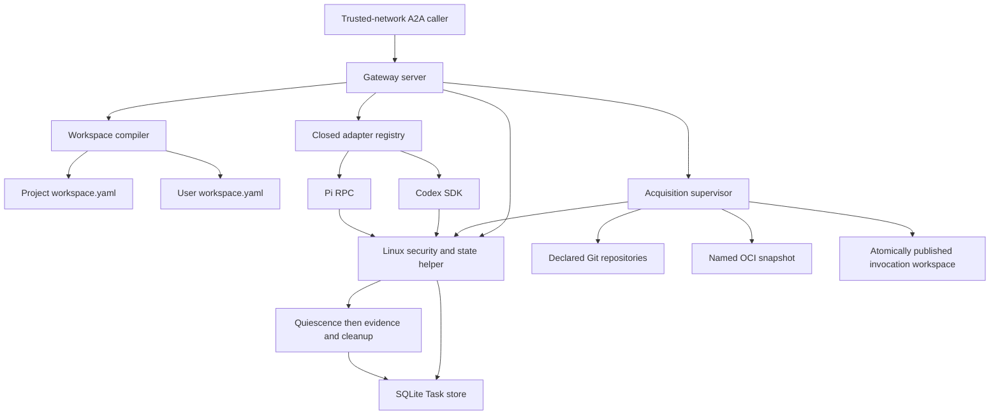

# Coding-Agent Execution Gateway - Plan

## Goal Capsule

- **Objective:** A developer can run one trusted-network A2A endpoint for one
  AllAgents workspace and invoke built-in or explicitly gateway-enabled profile
  targets against either the complete configured Git repository set, with optional
  named revision overrides, or a digest-pinned OCI workspace snapshot. AI Evals
  can configure either source mode in Promptfoo YAML through a custom provider
  without sending origins.
- **Means:** Add `allagents gateway serve`, a private execution-service package,
  a bounded durable Task store, direct Codex and Pi adapters, GitHub App and
  GitHub CLI acquisition providers, OCI snapshot acquisition, one supervised
  invocation lifecycle, and a documented Promptfoo provider contract.
- **Authority:** [ADR 0002](../decisions/0002-serve-coding-agent-execution-through-an-a2a-gateway.md)
  owns the public and trust boundaries. Project and user `workspace.yaml` files
  own source and profile declarations. A2A 1.0 owns core wire semantics.
- **Execution order:** Capture a red built-CLI E2E for the missing gateway;
  freeze schemas and configuration projection; implement the Task store, A2A
  server, supervisor/helper, acquisition, Codex, and Pi; run a final
  implementation review and fix important findings; then run the green built-
  CLI E2E, repository gates, and documentation validation.
- **Stop conditions:** Do not add application authentication, `gateway.yaml`,
  `worker.yaml`, remote worker routing, caller-supplied URLs or commands,
  mutable OCI tags, selected-provider failure fallback, evaluation behavior, or
  automatic execution retry.
- **Tail ownership:** The implementing workflow runs focused contract and
  lifecycle tests, provider fixture tests, the repository quality gates, a
  built-CLI trusted-network smoke test, and documentation validation.

---

## Product Contract

### Summary

AllAgents gains a single-workspace coding-execution service without becoming an
evaluation framework or multi-tenant platform. Callers use A2A Tasks and one
required AllAgents extension. Network reachability is authorization. The
service resolves configured targets and sources from existing workspace files,
acquires a fresh invocation workspace, invokes Codex or Pi through a typed
adapter, and retains bounded terminal evidence. AI Evals consumes that boundary
through its own Promptfoo custom provider: evaluation YAML supplies named
revision overrides for the configured repository set, or one snapshot handle
and immutable digests, while AllAgents retains origin and credential authority.

### Problem Frame

AllAgents configures and launches coding clients but has no service boundary for
trusted tools such as AI Evals. Those tools would otherwise import AllAgents
internals, drive interactive CLIs, or duplicate profile resolution, repository
acquisition, credential handling, cancellation, evidence capture, and cleanup.

Developers expect a process they can start in a workspace and expose on
loopback, `0.0.0.0`, a private interface, or Tailscale. They do not need an
application authentication stack, Kubernetes control plane, remote worker
registry, or another profile configuration file for the initial use case.

### Actors

- A1. **Trusted-network caller:** Any process able to reach the endpoint. All
  callers have the same authority and Task visibility. The first caller is an
  AI Evals-owned Promptfoo custom provider that maps one `callApi` to one Task.
- A2. **Execution gateway:** The A2A server and invocation supervisor. It owns
  deployment-wide Task identity, acquisition, routing, status, cancellation,
  evidence, retention, and cleanup.
- A3. **Backend adapter:** The Codex or Pi implementation translating native
  automation events and cancellation into the common contract.
- A4. **Operator/developer:** The person who selects the project workspace,
  gateway-enables profile launchers, supplies process flags and credential
  handles, and controls network access.
- A5. **GitHub/OCI source:** The remote content service used only during the
  acquisition phase.

### Key Decisions

- **Use A2A rather than inventing an invocation API.** Standard Agent Cards,
  Tasks, Artifacts, errors, streaming, and cancellation remain the public
  lifecycle. Governs R1-R3.
- **Treat the network as the trust boundary.** The initial service has no
  application authentication or caller ownership. Explicit `0.0.0.0` binding is
  valid. (session-settled: user-directed.) Governs R4-R5.
- **Reuse workspace configuration.** Project `workspace.yaml` owns sources;
  user `workspace.yaml` owns profiles, launchers, and gateway enablement. There
  is no `gateway.yaml`. (session-settled: user-directed.) Governs R6-R8, R18.
- **Support two acquisition modes.** Direct declared repositories and named,
  digest-pinned OCI workspace snapshots converge on one manifest and evidence
  contract. (session-settled: user-directed.) Governs R9-R11.
- **Use App-first GitHub credential eligibility.** Prefer an applicable GitHub
  App; use a configured `gh` account only when no App installation applies;
  never fall back after selected-App failure. (session-settled: user-directed.)
  Governs R12.
- **Keep a typed backend seam.** Codex SDK and Pi RPC are the complete initial
  backend set. Launcher-backed profiles resolve through those adapters rather
  than executing generated wrapper files. Governs R7-R8, R13-R15.
- **Persist Task truth, not provider sessions.** Restart settles interrupted
  work failed; it never resumes or automatically replays provider execution.
  Governs R5, R13-R16.
- **Keep evaluation outside AllAgents.** Consumers own datasets, repetitions,
  scoring, assertions, and evaluation Runs. Governs R17.
- **Bridge Promptfoo at the consumer boundary.** AI Evals owns a custom provider
  that maps Promptfoo YAML and test variables to the closed A2A source modes and
  maps terminal Tasks back to `ProviderResponse`. AllAgents owns no Promptfoo
  runtime behavior. Governs R19.

### Requirements

**Public protocol**

- R1. Implement A2A 1.0 HTTP+JSON for Agent Card discovery, `SendMessage`,
  `GetTask`, `ListTasks`, `CancelTask`, streaming send, and active Task
  subscription. Every A2A request carries `A2A-Version: 1.0`; another version
  receives `VersionNotSupportedError`. The Agent Card advertises exactly one
  absolute interface URL with `protocolBinding: "HTTP+JSON"`,
  `protocolVersion: "1.0"`, and `capabilities.streaming: true`. It declares
  `https://allagents.dev/a2a/extensions/coding-execution/v1` with
  `required: true` and strict `params: { targets: TargetId[] }`, populated from
  ready built-in and gateway-enabled profile targets. Production interface URLs
  use HTTPS; direct HTTP is limited to loopback development. Every operation
  that creates, returns, lists, subscribes to, or mutates profiled Tasks or
  Artifacts includes that URI in `A2A-Extensions`; missing activation receives
  `ExtensionSupportRequiredError`.

  Honor both `SendMessageConfiguration.returnImmediately` modes. `ListTasks`
  implements every standard filter, cursor pagination, `pageSize` 1-100 with a
  default no greater than 50, descending status-timestamp order, and required
  `tasks`, `nextPageToken`, `pageSize`, and `totalSize` fields.
  `nextPageToken` is present and empty on the final page. With the default
  `includeArtifacts: false`, each returned Task omits `artifacts`; `true`
  includes the field.
- R2. Generate a strict versioned request schema from Zod and place it only at
  `Message.metadata[extensionUri]`; the Message also lists `extensionUri` in
  `Message.extensions`. Strict objects reject every unlisted member. V1 uses
  these wire scalars:
  - `InvocationKey` matches `^[A-Za-z0-9][A-Za-z0-9._:-]{0,127}$`.
  - `ConfigName` and `TargetId` match
    `^[A-Za-z0-9][A-Za-z0-9._-]{0,63}$`.
  - `RevisionText` is NFC UTF-8, 1-255 bytes, with no U+0000-U+001F or U+007F.
  - `Digest` matches `^sha256:[0-9a-f]{64}$`.
  The request object is exactly:
  `version: "1"`; `invocationKey: InvocationKey`; `target: TargetId`; `source`,
  one of `{ kind: "repositories", revisions?: Record<ConfigName,
  RevisionText> }` or `{ kind: "workspaceSnapshot", snapshot: ConfigName,
  digest: Digest, workspaceManifestDigest: Digest }`; optional
  `deadlineSeconds` (integer 1-3600, default 1800); and optional
  `resultSchema: { version: "1", schema: SchemaNode }`.

  A `SchemaNode` is exactly one branch below. `description` is optional NFC
  UTF-8 of at most 1024 bytes. Scalar `enum` arrays contain 1-128 canonically
  distinct values of the node's type; string enum values are at most 4096 UTF-8
  bytes, numbers are finite, integers are JSON safe integers, and null permits
  only `[null]`.
  - null or boolean: `{ type, description?, enum? }`;
  - string: `{ type: "string", description?, enum?, minLength?, maxLength? }`,
    where lengths are integers 0-1,048,576 Unicode scalar values and minimum
    does not exceed maximum;
  - number or integer:
    `{ type, description?, enum?, minimum?, maximum? }`, where number bounds
    are finite, integer bounds are JSON safe integers, and minimum does not
    exceed maximum;
  - array:
    `{ type: "array", description?, items: SchemaNode, minItems?, maxItems? }`,
    where item bounds are integers 0-4096 and minimum does not exceed maximum;
  - object:
    `{ type: "object", description?, properties, required?,
    additionalProperties: false, minProperties?, maxProperties? }`, where
    `properties` is a strict record of 0-256 `ConfigName` keys,
    `required` is a unique subset of those keys, property bounds are integers
    0-256, and minimum does not exceed maximum.
  No pattern dialect exists in v1. References, unions/combinators, conditionals,
  formats, defaults, coercion, non-finite numbers, duplicate canonical enum
  values, and unknown keywords are rejected. The canonical result schema is at
  most 64 KiB, 256 nodes, and 32 levels deep. Repository revision count cannot
  exceed declared repositories. The Message contains exactly one `Part` with
  `text` set to a UTF-8 prompt of 1 byte to 1 MiB; other Part content fields are
  rejected. Only the extension-owned metadata object is strict; unrelated A2A
  metadata and other activated-extension keys are preserved or ignored
  according to A2A. Canonicalization materializes defaults, normalizes extension
  strings to UTF-8 NFC, sorts record keys, and hashes RFC 8785 extension JSON
  plus prompt bytes. Do not add `Task.extensions` or backend-specific public
  fields.

  A client generates an opaque invocation key with at least 128 bits of
  randomness once per logical execution, durably reuses that key and identical
  canonical request after an ambiguous transport failure, and creates a new key
  only for intentionally new execution. A2A `messageId` remains Message identity
  and does not replace the extension idempotency key.
- R3. One valid new request creates one addressable Task. Follow-up messages to
  an existing Task are unsupported. Every terminal Task has exactly one
  integrity Artifact plus zero or more produced Artifacts. The integrity
  Artifact has `artifactId` and `name` equal to
  `allagents.execution-integrity`, lists `extensionUri` in
  `Artifact.extensions`, and has one `Part` with `data` set to the strict
  `allagents.execution-integrity/v1` object and `mediaType:
  "application/json"`. Its `taskId` equals the enclosing A2A `Task.id`.
  `SafeUInt` is an integer 0-9,007,199,254,740,991; `ShortText` is valid UTF-8
  of at most 4096 bytes; `ArtifactId` matches
  `^[A-Za-z0-9][A-Za-z0-9._:-]{0,127}$`; and `MediaType` is a valid RFC 6838
  media type of at most 255 ASCII bytes.
  - `version` is the literal `"1"`; `taskId` is a lowercase canonical UUIDv7;
    and `target` is `TargetId`.
  - `sourceIdentity` is either
    `{ kind: "repositories", complete, repositories }` or
    `{ kind: "workspaceSnapshot", snapshot: ConfigName, digest: Digest,
    workspaceManifestDigest: Digest, layerDigests, complete, repositories }`.
    `complete` is boolean. `layerDigests` contains 0-64 `Digest` values in
    manifest order. `repositories` contains 0-64 unique strict entries
    `{ name: ConfigName, requestedRevision?: RevisionText,
    resolvedCommit: string, verification:
    "independentlyVerified" | "snapshotAttested" }`; `resolvedCommit` matches
    `^[0-9a-f]{40}$`. Before provider execution, `complete` must be true,
    `repositories` must exactly match the configured catalog, and snapshot
    identities must include every layer digest. Failed acquisition records only
    verified members and sets `complete` false.
  - Gateway-generated source identity, workspace-manifest fields, evidence
    metadata, and provider-added metadata never contain Git URLs, OCI repository
    origins, or destination paths. This guarantee applies only to
    gateway-managed credentials and generated metadata; it does not inspect or
    sanitize opaque prompts, terminal output, structured results, native
    evidence, or produced-Artifact payloads.
  - optional `workspaceManifestDigest` is `Digest`.
  - `terminalOutput` is `{ text, truncated }`, where `text` is valid UTF-8 of at
    most 1 MiB and `truncated` is boolean.
  - optional `usage` is a strict object with optional `inputTokens`,
    `outputTokens`, `cachedInputTokens`, and `totalTokens` `SafeUInt` fields,
    plus optional `provider` containing 0-64 `ConfigName: SafeUInt` counters.
  - `producedArtifacts` contains 0-128 strict entries
    `{ artifactId: ArtifactId, name?: ShortText, mediaType?: MediaType,
    size: SafeUInt, digest: Digest }`; each references one additional A2A
    Artifact embedded in the Task.
  - `evidence` is `{ items, complete, truncated }`, where the booleans have
    their literal JSON meaning and `items` contains 0-256 strict entries
    `{ kind, artifactId?, digest?, summary? }`. `kind` is one of
    `gitState | providerTrace | fileChanges | usage | cancellation |
    termination | cleanup`; `artifactId` and `digest` use the aliases above,
    `summary` is `ShortText`, and at least one of those three optional members
    is present.
  - `termination` is `{ status: "clean" | "failed" | "unknown",
    reason?: ShortText }`; `cleanup` is
    `{ workspace: "removed" | "retained" | "failed", reason?: ShortText }`.
  - optional `failure` is `{ code, message, retryable, cause }`, where `code`
    is one stable code from the error table below, `cause` is one member of the
    closed cause union defined below that table, `message` is `ShortText`, and
    `retryable` is that row's fresh-invocation value.
  - `result` is exactly one of
    `{ status: "valid", value }`,
    `{ status: "invalid", errors }`, or
    `{ status: "notProduced", reason }`. `value` is JSON that validates against
    the requested `SchemaNode`, serializes to at most 1 MiB, and is used only
    when a result schema was requested. `errors` contains 1-64 strict
    `{ path, keyword, message }` entries: `path` is an RFC 6901 JSON Pointer of
    at most 1024 bytes, `keyword` is one of the v1 `SchemaNode` member names,
    and `message` is `ShortText`. `reason` is one of
    `notRequested | providerDidNotReturn | providerFailed | canceled |
    deadlineExceeded | invalidProviderPayload`.

  Failure, rejection, and cancellation retain every available field without
  implying a valid result. Task records, Artifacts, events, and claims expire
  atomically after the configured TTL; expired keys may create new Tasks. The
  gateway never evicts unexpired Tasks to satisfy the retained-count limit: it
  rejects new admission until expiry frees capacity.

**Trust, identity, and Task storage**

- R4. Do not authenticate application callers. Allow loopback, specific-address,
  and explicit `0.0.0.0` listeners. Every reachable caller may create, list,
  retrieve, subscribe to, and cancel every Task. Artifacts are retrieved only
  inside Tasks through `GetTask` or `ListTasks(includeArtifacts: true)`; v1 adds
  no separate Artifact endpoint. Document Tailscale ACLs, firewalls, or
  equivalent network controls as the authorization boundary.
- R5. Idempotency and Task visibility are deployment-wide. Atomically and
  durably bind an invocation key to the canonical request, selected target,
  source identity, optional result-schema digest, deadline, and effective
  configuration digest before acknowledging Task creation. One transactional
  `createOrReplay` operation arbitrates competing requests. Identical replay
  returns the existing Task; a changed request conflicts. Status and terminal
  settlement are monotonic. The project-specific state root persists the
  canonical workspace identity and holds an exclusive process lock. The root
  and all state files must be current-user owned, use `0700`/`0600`-equivalent
  permissions, be disjoint from project, profile, and invocation roots, and be
  opened descriptor-relatively without following symlinks or accepting hard-
  linked files. Startup verifies those invariants, store integrity, and
  workspace identity; terminalizes interrupted Tasks failed; and never resumes
  provider work. A durable commit fsyncs every changed file and affected
  containing directory before acknowledgment. Store open, corruption, write,
  transaction, rename, or fsync failure stops admission, aborts and contains
  active work, prevents terminal success, and keeps the process alive with
  poisoned readiness until the containment set is proven empty.

**Workspace and target configuration**

- R6. One gateway process serves one project workspace selected by `--workspace`
  or cwd. Parse its `.allagents/workspace.yaml` through the authoritative project
  schema, then compile a gateway-only repository catalog without tightening
  ordinary workspace parsing. Derive each logical name from `name` or the
  existing path-basename fallback; require 1-64 unique `ConfigName` values,
  collision-free normalized destinations, and one supported canonical GitHub
  origin resolved through existing `source`/`repo` semantics. Repository names,
  origins, destinations, default revisions, workspace projection, plugins, and
  named OCI snapshot repositories come only from that declaration. A catalog
  failure makes the gateway not ready.
- R7. Parse `~/.allagents/workspace.yaml` through the authoritative user schema.
  Built-in `codex` and `pi` targets are available when ready. A launcher-bearing
  profile client adds a target only when `gateway.enabled: true`. Its public ID
  is the globally collision-checked launcher basename and resolves to exactly
  one `(profile, client)` pair. Built-in IDs are reserved under the same portable
  collision key; colliding enablement is a configuration error. Initially only
  Codex and Pi profile clients are executable.
- R8. A request selects a declared target, may set the bounded
  `deadlineSeconds`, and may provide one bounded result schema. The gateway owns
  one durable execution lease covering acquisition through final evidence
  collection. Admission claims that lease transactionally before launching any
  helper child; at most one Task may hold it. A second otherwise-valid request
  is accepted as a Task and settles failed with
  `execution_capacity_unavailable`. It may transiently allocate one empty,
  start-gated containment set, but never releases the gate, starts acquisition,
  or executes a child and must destroy that set after the failure settlement.
  Lease identity is stored with the Task, survives restart, and is released only
  by the final settlement transaction or startup reconciliation after the
  recorded containment set is proven empty.

  The overall deadline covers acquisition, publication, typed preparation,
  provider execution, and evidence collection. Acquisition receives
  `min(900 seconds, remaining overall deadline)`; exceeding that sub-budget
  fails before provider execution. Overall expiry initiates abort and bounded
  forced termination. Cleanup then uses its own fixed bounded budget and the
  R16 fail-closed quiescence rule. A request cannot provide or override backend,
  executable path, command, argv, environment, profile settings, plugins, MCP
  servers, repository URLs, destination paths, credential provider, setup
  behavior, or permission policy. Readiness rejects missing, partial, drifted,
  unsupported, or declaration-missing gateway-enabled profiles.

**Workspace acquisition**

- R9. Use exactly one closed source union:
  - `{ kind: "repositories", revisions?: Record<repositoryName, revision> }`; or
  - `{ kind: "workspaceSnapshot", snapshot, digest, workspaceManifestDigest }`.
  Unknown variants, cross-variant fields, undeclared names, mutable snapshot
  references, malformed digests, and destination overrides fail admission.
  Source-mode failure never falls through to the other mode.
- R10. Repository mode materializes every entry in the compiled gateway catalog.
  Caller revisions may override only a declared repository's default revision.
  Canonicalize HTTPS GitHub origins, resolve and record full commits before
  provider execution, use hermetic Git configuration, disable redirects and
  repository-controlled secondary fetch/exec features, verify checkout
  identities, and reject path collisions or escapes.
- R11. Snapshot mode maps `snapshot` to a declared OCI repository and constructs
  `<repository>@<digest>` server-side. V1 accepts only
  `application/vnd.oci.image.manifest.v1+json` with `schemaVersion: 2` directly
  at the requested digest. Reject image indexes, nested indexes, descriptor
  `urls` or embedded `data`, non-distributable layers, unknown media types, and
  more than 64 layers. The config descriptor must use
  `application/vnd.allagents.workspace-manifest.v1+json`; its digest must equal
  `workspaceManifestDigest`, and its bytes are RFC 8785 canonical JSON. Accepted
  layer media types are the OCI distributable tar, gzip, and zstd variants.
  Verify the raw manifest body and every config/layer descriptor size and digest
  while streaming, before decoding. Apply layers base-to-top with OCI whiteout
  and opaque-whiteout semantics.

  The workspace manifest must contain every compiled project repository exactly
  once at its operator-declared destination; reject missing, extra, renamed,
  misplaced, or duplicate repositories and undeclared generated content. Apply
  these fixed v1 ceilings across all processed layers, including overwritten or
  whiteouted content: 4 MiB manifest, 4 MiB config, 2 GiB total compressed
  layer bytes, 8 GiB total expanded bytes, 250,000 entries, 1 GiB per regular
  file, 4096 UTF-8 bytes and 128 components per path, and 1 MiB per PAX or other
  extended header. Abort before crossing a limit. Validate paths, collisions,
  file types, modes, links, and manifest completeness in staging before atomic
  publication. Reject absolute or traversing paths, devices, sockets, sparse
  files, escaping links, credentials in redirect URLs, unapproved cross-origin
  redirects, and external layers. Cross-origin redirects are limited to
  layer-blob `GET`/`HEAD` requests and exact operator-declared
  `layerRedirectHosts`; token, manifest, and config requests remain same-origin.
  Private or otherwise non-global destinations are permitted only when the exact
  host is the source's declared repository host or a declared layer-redirect
  host, with per-hop rebinding checks. The common workspace manifest
  distinguishes independently verified Git facts from snapshot-attested facts.

**Credential selection and containment**

- R12. Repository requests never carry credentials or select providers. For
  `github.com`, a configured App lookup returning installation coverage is
  `eligible`. A 404 is `ineligible` only after the repository's existence is
  independently proven through the configured GitHub CLI identity; an
  uncorroborated 404, 401, 403, 429, timeout, or 5xx is `unknown`. An explicit
  installation ID is eligible only after positive repository-coverage
  verification. For `eligible`, call `@octokit/auth-app` with `refresh: true`
  and the exact repository selection to mint a new read-only installation token
  for every acquisition. Validate its repository selection, permissions,
  creation time, and expiry, and require remaining lifetime greater than the R8
  acquisition sub-budget plus a 60-second clock-skew margin.

  Use the configured GitHub CLI account only when the App is absent or
  applicability is positively `ineligible`. An `unknown` result or any
  selected-App configuration, authentication, minting, permission, repository,
  rate-limit, or service failure terminates acquisition without `gh` fallback.
  Run `gh auth token --hostname github.com --user <account>` with ambient token
  variables removed. Deliver either token only through an invocation-scoped Git
  credential helper. Revoke an App token after acquisition and fail before
  provider execution if revocation cannot be confirmed; destroy all local token
  material before typed preparation. OCI credentials likewise exist only during
  snapshot acquisition.

**Execution, evidence, and cleanup**

- R13. Keep one closed `codex | pi` backend registry and one behavior-focused
  interface covering availability, capabilities, invocation, progress,
  deterministic permission handling, abort, terminal output, optional structured
  result, usage, bounded native evidence, and disposal. Profile targets resolve
  adapter-owned configuration directly; never execute generated launchers,
  discover executables as targets from `PATH`, scrape a TUI, or append public
  input to argv.
- R14. Codex uses pinned `@openai/codex-sdk`, one fresh thread per Task,
  `AbortSignal`, streamed events, and an operator-selected Codex auth-file
  handle. It passes native `outputSchema` only when the public schema has an
  object root, every object's `required` set equals its property set, nesting is
  at most 10 levels, and every keyword is supported by the pinned model/API.
  Other valid public schemas use explicit JSON prompt guidance plus the common
  gateway-side validator without a native schema. Pi uses strict RPC,
  invocation-owned configuration, an operator-selected Pi auth-file handle, and
  one restricted policy extension; repository extensions and unrestricted
  built-ins do not auto-load. The gateway copies only the selected adapter's
  required auth material into an invocation-private, read-only control-process
  view and removes it during cleanup.
- R15. Acquire into a private staging root and atomically publish the invocation
  workspace. Run only adapter-owned typed preparation that projects validated
  project/profile settings, plugins, and MCP declarations through existing
  deterministic transforms; never execute project or user `setup` entries or
  other configured shell commands.

  Enforce distinct process views:
  - the provider control process receives only its invocation workspace,
    minimum non-secret profile configuration, and adapter auth channel;
  - each MCP child receives only its own resolved secret references; and
  - model-invoked shell/tools receive the workspace and no provider or MCP
    credentials.

  The pinned backend must expose one non-bypassable synchronous spawn hook for
  every MCP and model-tool process. The hook delegates execution to the security
  helper, which enters the role-specific mount and network namespaces, replaces
  the environment, closes every non-allowlisted descriptor, and only then
  executes untrusted code. A backend that can spawn any tool without this hook
  is not a v1 target and fails readiness; conformance fixtures alone cannot waive
  that requirement. All views exclude gateway state, operator home, App keys,
  GitHub/OCI stores, source helpers, unrelated adapter credentials, and the
  parent environment.

  Invocation network namespaces cannot route to host loopback, any gateway bind
  or advertised address, operator management networks, or ingress proxies.
  Provider and MCP egress is default-deny except for role-specific destinations
  compiled from adapter and MCP configuration; every resolved address is checked
  at connection time, and gateway/host-management destinations remain denied
  even when a hostname resolves to them. Model tools receive no network unless
  the adapter's explicit policy grants similarly constrained egress. Fail target
  readiness unless all filesystem, credential, descriptor, and network
  separations are enforceable.

  Acquisition credentials and mounts are absent first. Capture bounded provider
  events while the process is live. After the provider reports terminal, abort
  and terminate its complete containment set and prove it empty before reading
  Git state, hashing or copying files, or describing produced Artifacts as
  verified. Treat the mutated workspace as untrusted: use descriptor-relative
  no-follow reads; revalidate identity and size after open; reject hard links,
  special/sparse files, path replacement, out-of-root targets, and `.git`
  gitdir/core.worktree/alternates escapes; and run Git inspection with hermetic
  configuration that disables hooks, filters, drivers, fsmonitor, pagers,
  helpers, and external commands. If quiescence cannot be proven, retain only
  truthful partial process evidence; do not publish filesystem evidence or
  produced Artifacts as verified.
- R16. Supervise the complete acquisition/provider descendant set inside an
  invocation-owned OS containment primitive whose membership children cannot
  escape. Allocate its stable identifier and empty set first, then commit that
  identity with the Task and execution lease before the helper may release its
  start gate or execute any child. A failed commit destroys the still-empty set.
  Startup enumerates the entire project-owned containment namespace, reconciles
  both recorded and unknown identifiers, and refuses readiness while any
  unknown or nonempty set remains.

  One durable compare-and-set arbitrates provider terminal outcome, caller
  cancellation, overall deadline, and shutdown as an internal `outcomeIntent`
  while the externally visible Task remains nonterminal. The winning intent
  owns the stable result or failure code and drives one idempotent abort and
  quiescence path. Only after quiescence, safe evidence collection, produced-
  Artifact verification, and cleanup does one settlement transaction atomically
  write terminal Task status, result/failure, bounded evidence, exactly one
  integrity Artifact, produced Artifacts, termination outcome, lease release,
  and cleanup outcome.

  Cancellation intent persists before native abort, followed by bounded forced
  termination. If quiescence cannot be proven, settle once with
  `execution_quiescence_unknown`, no verified filesystem evidence, and immutable
  unknown/failed termination; reject admission, keep readiness false, and leave
  the process alive to continue reaping. Later recovery changes only internal
  recovery/readiness state, never the settled Task. Print the stable containment
  identifier and platform recovery command. Startup proves every interrupted set
  empty before it may quarantine stale roots or advertise readiness. Graceful
  shutdown stops admission atomically, commits shutdown intent, drains or aborts
  active work within a bounded grace period, follows the same settlement path,
  and only then exits.

**Scope and configuration**

- R17. Do not add evaluation commands, datasets, assertions, scoring,
  repetitions, experiment scheduling, or automatic Task retry.
- R18. Do not add `gateway.yaml` or `worker.yaml`. Process configuration uses
  the exact CLI flags and environment variables in the Configuration Contract
  for listener, advertised interface URL, workspace, state/retention, GitHub,
  OCI, and Codex/Pi auth-file handles. The listener also exposes unauthenticated
  metadata-only `/healthz` and `/readyz` endpoints outside A2A: liveness returns
  200 while the process can serve; readiness returns 200 only while new
  admission is safe and otherwise 503. They reveal no targets, sources, paths,
  or failure details and do not require A2A headers. Gateway code never copies
  acquisition or provider credential values into generated workspace files,
  requests, logs, Task/Artifact metadata, retained workspaces, or model-tool
  environments. This is not a redaction guarantee for opaque prompts, provider
  output, structured results, native evidence, or produced-Artifact payloads.
- R19. Document AI Evals consumption through a Promptfoo custom
  JavaScript/TypeScript provider implementing Promptfoo's `ApiProvider`.
  `constructor(options: ProviderOptions)` requires and retains a nonempty
  `options.id`, validates `options.config`, and `id()` returns that ID. Static
  config contains the
  gateway endpoint, target ID, and exactly one closed source mode: repository
  mode materializes the complete configured repository set and carries only an
  optional revision map keyed by declared repository name; snapshot mode carries
  one declared snapshot name with OCI and workspace-manifest digests.
  `callApi(prompt, context?, options?)` may apply the exact
  `context?.vars?.allagentsSource` leaf overrides defined below; missing context
  means no override. Dynamic repository revisions must be full lowercase
  40-hex commit IDs; dynamic snapshot values must be full lowercase `sha256:`
  digests. Source kind, snapshot name, and repository origins never vary per
  test. Unknown members, revision names absent from static config, URLs,
  destinations, tags, credentials, commands, and permission policy fail before
  submission.

  The provider sends `SendMessage` with `configuration.returnImmediately: true`,
  captures the accepted Task ID, and calls `SubscribeToTask`; a terminal-before-
  subscribe race or broken stream falls back to `GetTask` and resubscription
  within the same deadline. A deadline or `options?.abortSignal` issues exactly
  one `CancelTask` with a fresh bounded cleanup signal rather than the already
  aborted request signal. One `callApi` creates one A2A Task and maps terminal
  output, usage, Task/Artifact IDs, structured result, and logical provenance
  into `ProviderResponse`. Admission or terminal failure maps a safe human
  message to `error` and stable `code`, `retryable`, and accepted `taskId` to
  `metadata`. AI Evals owns the provider implementation. AllAgents publishes the
  protocol and YAML examples without importing Promptfoo provider code or adding
  Promptfoo as a runtime dependency.

### Key Flows

- F1. **Start and advertise**
  1. Resolve cwd or `--workspace`, user workspace, project-specific state root,
     retention limits, listen address, advertised interface URL, source
     credentials, and provider auth handles.
  2. Validate state-root ownership, permissions, links, disjointness, workspace
     identity, compiled repository catalog, snapshots, target namespace, backend
     availability, profile state, Linux containment/helper availability,
     provider/MCP/tool mount, descriptor, and network views, and credential
     handles.
  3. Enumerate the entire project-owned containment namespace. Reconcile
     recorded and unknown identifiers and prove every set empty before
     quarantining filesystem roots or releasing a retained execution lease.
  4. Bind the requested address, including `0.0.0.0` when explicit; serve
     metadata-only health/readiness probes; and publish one Agent Card whose
     absolute interface URL, required extension, and target allowlist match the
     validated configuration.

- F2. **Acquire repositories and execute**
  1. Negotiate A2A version and the required extension, then validate the strict
     request, one text Part, target, repository-name/revision map, result schema,
     deadline, and deployment-wide idempotency claim.
  2. Ask the helper to allocate a stable empty containment set behind a start
     gate. In one transaction, create or replay the claim and Task, acquire the
     execution lease, and bind the containment identifier before acknowledgment.
     Capacity failure settles the Task with `execution_capacity_unavailable`,
     then destroys the empty set without releasing the gate or launching a
     child. Commit failure likewise destroys the empty set.
  3. Release the start gate. For each declared repository, classify App
     applicability, select App or `gh` only by eligibility, resolve the revision,
     fetch hermetically, verify the commit, revoke an App token, and remove every
     acquisition credential.
  4. Publish the complete workspace, run typed preparation, invoke the isolated
     adapter, and validate any structured result while capturing live events.
     Terminate and prove the containment set empty before safe filesystem/Git
     evidence reads and produced-Artifact verification. Atomically settle the
     terminal Task, evidence, Artifacts, cleanup, and lease release.

- F3. **Acquire an OCI snapshot and execute**
  1. Perform the same version/extension validation, gated empty-containment
     allocation, and atomic claim+Task+lease+containment commit as F2.
  2. Resolve the named snapshot repository and digest-pinned reference.
     Authenticate if required; pull and verify the direct image manifest,
     workspace-manifest config blob, and distributable layers; apply changesets
     in order; enforce all limits; and validate the exact project catalog.
  3. Remove registry credentials, publish atomically, run typed preparation,
     invoke the isolated adapter, and capture live events. Terminate and prove
     quiescence before safe filesystem evidence and verified produced Artifacts,
     then perform the same atomic settlement and lease release as F2.

- F4. **Cancel**
  1. Atomically persist cancellation intent if the Task remains cancelable.
  2. Abort acquisition or provider work, escalate within the bounded termination
     budget, prove containment quiescence, preserve truthful partial evidence,
     clean up, and settle canceled.
  3. Repeated cancellation while intent is pending does not re-signal work.
     Cancellation after any terminal state returns A2A
     `TaskNotCancelableError`.

- F5. **Shut down**
  1. Stop new admission before signaling active work.
  2. Persist shutdown intent, abort and escalate, drain live process evidence,
     prove quiescence, and settle the accepted Task once.
  3. Exit only after durable settlement and empty containment. If proof fails,
     remain alive, not ready, and continue reaping while printing the stable
     containment identifier and platform recovery command.

- F6. **Invoke from Promptfoo**
  1. Promptfoo constructs the AI Evals-owned TypeScript provider with
     `ProviderOptions`; the provider retains the ID and validates
     `options.config` containing the private-network endpoint, target, and one
     closed source-mode object.
  2. `callApi(prompt, context?, options?)` applies only valid
     `context?.vars?.allagentsSource` leaf overrides, creates and retains one
     high-entropy invocation key, and sends one A2A Message with
     `configuration.returnImmediately: true`.
  3. After receiving the Task ID, subscribe to terminal updates. Resolve a
     terminal-before-subscribe or disconnected-stream race through `GetTask`
     and bounded resubscription. Deadline or abort sends `CancelTask` once with
     a fresh cleanup signal.
  4. Return terminal text or validated structured output in
     `ProviderResponse.output`; map `inputTokens -> prompt`,
     `outputTokens -> completion`, `cachedInputTokens -> cached`, and
     `totalTokens -> total`; and put other usage plus Task, Artifact, logical
     source, termination, cleanup, and stable failure facts in `metadata`.
     Admission or terminal failure returns a safe `error`.

### Acceptance Examples

- AE1. A caller on a permitted Tailscale or firewalled network discovers the
  gateway through its configured HTTPS interface URL while it is bound to
  `0.0.0.0`, selects `codex-review`, and receives one durable Task without an
  application credential.
- AE2. Any reachable caller can list, retrieve, and cancel a Task created by
  another reachable caller and inspect its embedded Artifacts through `GetTask`
  or `ListTasks(includeArtifacts: true)`; documentation states this shared trust
  model without implying tenant privacy.
- AE3. A launcher-bearing Codex profile without `gateway.enabled: true` is
  absent from discovery and rejected when selected. An enabled but drifted
  profile fails readiness/new admission.
- AE4. A multi-client profile gateway-enables `codex-review` and `pi-review` as
  distinct targets. Both resolve through adapters; neither generated wrapper is
  executed.
- AE5. Repository mode accepts declared names and revision overrides, rejects an
  undeclared name or URL override, and records the resolved full commits.
- AE6. An applicable GitHub App bypasses its token cache, mints a new
  repository-scoped read-only token with adequate lifetime, validates the token,
  and revokes it after acquisition. A corroborated existing repository with no
  applicable installation uses the configured `gh` account. An uncorroborated
  404, unknown applicability, auth, mint, validation, or revocation failure does
  not fall through to `gh` or start the provider.
- AE7. Snapshot mode accepts a direct image manifest with matching manifest,
  config/workspace, and layer digests; applies gzip/zstd layers and whiteouts in
  order; and enforces every fixed limit. Same-origin metadata redirects work;
  only layer requests may cross origin to an exact declared host, with
  credentials stripped and every resolved address checked. Mutable tags,
  indexes, unknown/non-distributable media, descriptor URLs/data, traversal,
  foreign layers, digest/size mismatch, malformed whiteouts, undeclared
  repositories, redirect loops/rebinding, non-global destinations not declared
  for that source, and unapproved origins fail.
- AE8. Repository and snapshot modes produce the same workspace-manifest shape
  and exact compiled repository set/layout. OCI-contained commit identities are
  snapshot-attested unless independently verified; source identity includes
  completeness and ordered layer digests without origins.
- AE9. Identical invocation-key replay, including after a lost response, returns
  the original Task. Reusing the key with a changed target, source, prompt, or
  result schema conflicts; separate high-entropy keys create separate Tasks.
- AE10. Cancellation during Git, OCI pull, Codex, or Pi terminates the complete
  process set and records cleanup. Unproved quiescence poisons readiness; the
  gateway stays alive, rejects admission, and continues reaping until empty.
- AE11. Kill fixtures before and after empty-containment creation, durable
  Task/lease/containment binding, child clone, start-gate release, and response
  acknowledgment leave no unrecorded live set. Restart enumerates the full
  project-owned namespace, refuses unknown/nonempty sets, turns interrupted
  Tasks into one terminal failure, never resumes a provider session, and keeps
  terminal Tasks and embedded Artifacts retrievable until expiry.
- AE12. A valid structured result survives later check or evidence failure as a
  valid result with an overall failed Task; invalid or absent results are never
  published as valid.
- AE13. A gateway-enabled launcher named `codex`, `pi`, or a portable case-
  equivalent fails configuration compilation instead of shadowing a built-in
  target.
- AE14. Two gateways for different workspaces use distinct private state roots;
  a second process for the same root fails the exclusive lock. Wrong-owner,
  permissive, linked, hard-linked, or overlapping roots fail startup. The real
  helper VFS rejects database, WAL, SHM, journal, temporary-file, symlink,
  hard-link, and rename-swap attacks. Process-kill fixtures at transaction, file
  sync, directory sync, and response boundaries recover either the complete old
  or new generation and never lose an acknowledged Task or publish false
  success.
- AE15. Barrier-controlled provider-terminal, caller-cancel, deadline, and
  shutdown races durably select one internal intent and one abort/quiescence
  path during Git, OCI, preparation, Codex, Pi, or evidence. Subscribers observe
  no terminal Task until one transaction writes status, integrity Artifact,
  bounded evidence, result/failure, termination, cleanup, and lease release.
  Later reaping changes only internal readiness/recovery state.
- AE16. Repeated cancel while cancellation is pending is idempotent; cancel
  after canceled, completed, failed, or rejected returns
  `TaskNotCancelableError`.
- AE17. A workspace containing `setup` shell entries never executes them through
  gateway acquisition or startup. Real Codex/Pi child and grandchild tool paths
  are helper-mediated: filesystem, environment, inherited descriptor, `/proc`,
  and magic-link probes cannot read provider/MCP secrets, operator stores, or
  gateway state. Agent Card, Task operations, host loopback, bind/advertised
  addresses, ingress, and management-network probes fail from every invocation
  role; only compiled role egress succeeds.
- AE18. Evidence is collected only after containment quiescence. An escaping
  link, hard link, special file, sparse-file abuse, replaced inode, or `.git`
  indirection is rejected and Git inspection runs without repository-controlled
  execution. Unknown quiescence produces no verified filesystem Artifact.
- AE19. The 1001st unexpired retained Task is rejected with
  `retention_capacity_exhausted`; no retained Task is evicted before TTL. While
  one Task holds the execution lease, a barrier-controlled second request
  settles `execution_capacity_unavailable` and launches no helper child; races
  and restart never produce two lease holders.
- AE20. Official HTTP+JSON client fixtures send `A2A-Version: 1.0`, exercise
  required-extension activation and both `SendMessage` modes, preserve unrelated
  metadata, verify standard `google.rpc.Status` errors, and cover every
  `ListTasks` filter, cursor, order, response field, and artifact-inclusion rule.
  A terminal Task contains one extension-marked integrity Artifact plus
  referenced produced Artifacts using unified Parts.
- AE21. The AI Evals Promptfoo fixture has a top-level prompt and disables
  sharing, caching, result writes, and concurrency above one. It loads one
  repository-mode and one snapshot-mode provider, sends only closed logical
  source data, retains one invocation key across ambiguous retries, and cancels
  an accepted Task on abort. Both calls return scorable output, normalized token
  usage, and Task/Artifact/logical-provenance metadata. Safe failure metadata
  includes code, retryability, and accepted Task ID. Calls with omitted context
  work; unknown variables, mutable revisions, origins, destinations, or
  undeclared names fail before submission.

### Success Criteria

- `allagents gateway serve` starts from a real workspace with no deployment YAML.
- Explicit loopback, private-interface, and `0.0.0.0` listeners work with a
  distinct valid advertised interface URL; health/readiness reflect admission.
- The official A2A client exercises version and extension negotiation, both send
  modes, stream, get, complete list/pagination semantics, subscribe, replay,
  cancel, terminal cancel errors, Task-embedded Artifacts, standard HTTP+JSON
  errors, and expiry.
- An AI Evals-style Promptfoo custom-provider fixture consumes secure-default
  YAML for both source modes, propagates post-acceptance cancellation, and maps a
  terminal Task to `ProviderResponse` without adding Promptfoo to the AllAgents
  runtime.
- Built-in Codex/Pi and gateway-enabled profile targets pass one conformance
  suite, including reserved-ID collisions and Codex native-schema gating.
- Direct Git and OCI snapshot fixtures produce equivalent validated workspace
  manifests and truthful complete provenance.
- GitHub App eligibility, 404 ambiguity, unknown failure, no-installation `gh`
  fallback, fresh-token validation/revocation, OCI authentication and challenge
  handling, and pre-provider credential teardown are proven end to end.
- No request can supply a command, executable, URL, destination, credential,
  mutable OCI tag, backend override, or arbitrary environment value.
- State-store crash, deadline/cancellation/terminal/shutdown race, descendant
  escape, unsafe evidence, and stale-root scenarios fail closed.
- The bundled CLI and packaged Linux helper pass a trusted-network smoke test
  against project and user workspaces created under `/tmp/`.

### Scope Boundaries

**In scope**

- A2A 1.0 HTTP+JSON and the required AllAgents extension.
- One process and one active invocation at a time initially.
- Built-in and gateway-enabled profile-backed Codex/Pi targets.
- Direct declared Git repositories and named OCI workspace snapshots.
- GitHub App and configured GitHub CLI acquisition credentials.
- Local durable Task/evidence storage, cancellation, cleanup, and provenance.
- Listen addresses including `0.0.0.0`.

**Out of scope**

- Application authentication, tenant isolation, caller-private Tasks, and public
  Internet hardening.
- `gateway.yaml`, `worker.yaml`, remote workers, mTLS worker links, Kubernetes
  routing, autoscaling, and multiple gateway replicas.
- Caller-provided repository or registry origins, mutable OCI tags, custom
  materializers, Dockerfiles, Compose files, or acquisition commands.
- GitHub Enterprise Server and multiple ordered Apps/accounts in the initial
  delivery.
- OpenCode, Claude, Copilot, OMP, arbitrary CLI, and TUI adapters.
- Evaluation orchestration and automatic retries.
- Non-Linux gateway execution in v1; ordinary AllAgents CLI behavior remains
  cross-platform.

### Sources

- [ADR 0002](../decisions/0002-serve-coding-agent-execution-through-an-a2a-gateway.md)
- [AHP decision inputs](../research/agent-host-protocol-decision-inputs.md)
- [Harbor repository materialization lessons](../research/harbor-repository-materialization.md)
- [Source credential broker precedents](../research/source-credential-broker-precedents.md)
- [A2A 1.0 specification](https://a2a-protocol.org/v1.0.0/specification/)
- [A2A extension guide](https://a2a-protocol.org/latest/topics/extensions/)
- [Promptfoo custom providers](https://www.promptfoo.dev/docs/providers/custom-api/)
- [Promptfoo configuration reference](https://github.com/promptfoo/promptfoo/blob/main/site/docs/configuration/reference.md)
- [OpenAI Codex SDK](https://developers.openai.com/codex/sdk/)
- [OpenAI structured outputs](https://developers.openai.com/api/docs/guides/structured-outputs/)
- [GitHub App installation tokens](https://docs.github.com/en/apps/creating-github-apps/authenticating-with-a-github-app/generating-an-installation-access-token-for-a-github-app)
- [Git credential helpers](https://git-scm.com/docs/gitcredentials)
- [Docker credential stores](https://docs.docker.com/reference/cli/docker/login/#credential-stores)
- [Node.js SQLite API](https://nodejs.org/docs/latest-v22.x/api/sqlite.html)
- [OCI Image Specification](https://github.com/opencontainers/image-spec)
- [OCI Distribution Specification](https://github.com/opencontainers/distribution-spec)
- [Linux cgroup v2](https://www.kernel.org/doc/html/latest/admin-guide/cgroup-v2.html)

---

## Planning Contract

### Key Technical Decisions

- KTD1. **Use the official A2A JavaScript SDK transport around an
  AllAgents-owned request handler.** Do not use `DefaultRequestHandler` or its
  non-transactional `TaskStore` seam. Implement the SDK's request-handler
  interface so AllAgents controls UUIDv7 creation, atomic `createOrReplay`,
  monotonic settlement, listing, retention, expiry, and HTTP+JSON error details
  while retaining standard Task/Artifact carriers.
- KTD2. **Generate and publish the extension and storage contracts from canonical
  Zod schemas.** The versioned extension specification at its declared URI
  defines Agent Card params, activation, Message metadata/extensions, request,
  Task/Artifact, idempotency, error, replay, examples, and versioning. Generate
  public JSON Schemas, Task-store, workspace-manifest, and adapter types from the
  same source. Keep backend-specific fields private.
- KTD3. **Use a single-process supervisor, not a remote worker protocol.** One
  service owns Task state, staging, publication, backend child processes,
  evidence, termination, and cleanup. Child processes remain contained behind
  an invocation lifecycle boundary.
- KTD4. **Make application authentication intentionally absent.** All Tasks and
  Artifacts share one deployment namespace. The listener accepts explicit
  `0.0.0.0`; network controls are external. Bind and advertised interface URL
  are distinct. (session-settled: user-directed.)
- KTD5. **Compile gateway configuration from existing workspace files.** Add
  `workspaceSnapshots` to the project schema and `gateway.enabled` to strict
  profile-client schemas. A gateway-only compiler normalizes the project
  repository catalog and resolves each public launcher ID to one profile/client.
  Add no deployment YAML. (session-settled: user-directed.)
- KTD6. **Keep source input name-based and closed.** Repository requests carry
  only declared-name revisions; snapshot requests carry only a declared snapshot
  name and immutable digests. Compute one canonical source identity for
  idempotency and provenance.
- KTD7. **Freeze direct Git and OCI acquisition profiles.** Git runs with
  hermetic config and an invocation credential helper. An AllAgents-owned
  minimal OCI Distribution client in the Rust helper uses pinned `reqwest`
  (rustls, redirects and ambient proxies disabled), `tar`, `flate2`, and `zstd`
  crates for streaming pull, bounded authentication, decoding, and changeset
  application behind the helper's typed protocol. The client implements only the
  v1 direct-image manifest/config/layer profile, RFC 8785 workspace-manifest
  config, fixed extraction limits, and explicit Distribution-Spec authentication
  and redirect policy. A test-only deterministic reference packer produces the
  conformance fixture that freezes the format.
- KTD8. **Select GitHub credentials by provable three-way eligibility.** App
  lookup 200 is eligible; 404 is ineligible only with independent repository-
  existence proof; all ambiguous outcomes are unknown. Fresh App tokens bypass
  SDK cache, are validated and revoked, and only positive ineligibility permits
  the configured `gh` account. (session-settled: user-directed.)
- KTD9. **Keep one behavior-focused `codex | pi` adapter registry.** Direct
  targets and gateway-enabled profile targets resolve to the same adapter types
  and conformance tests; profile context modifies server-owned configuration,
  never the public command line. A target is ready only when its pinned backend
  exposes a non-bypassable spawn hook through which the helper launches every
  MCP and model-tool process with separate filesystem, environment, descriptor,
  secret, and network views.
- KTD10. **Put durable Task truth behind the Rust helper's SQLite VFS.** The
  helper owns the single process-lifetime SQLite connection and exposes typed
  transactional store operations; TypeScript never opens the database by path.
  A small audited VFS roots every database, WAL, SHM, journal, and temporary-file
  open beneath a preopened private state-directory descriptor with `openat2`
  beneath/no-symlink checks, rejects hard links, and fsyncs files and containing
  directories. SQLite uses WAL, foreign keys, and `synchronous=FULL`. Claims,
  Tasks, events, bounded Artifact bytes, execution lease, containment identity,
  internal outcome intent, and expiry live in transactional tables.
  `createOrReplay`, lease acquisition, and terminal settlement are transactions;
  acknowledge only committed state. Crash recovery yields a complete old or new
  generation, never a mixed or missing acknowledged Task. Integrity, VFS, helper
  protocol, or durability failure stops admission and prevents false success.
- KTD11. **Package one enforceable Linux security and state helper.** V1 supports
  Linux x64/arm64 with cgroup v2, `clone3(CLONE_INTO_CGROUP)`, pidfds, `openat2`
  beneath/no-symlink resolution, mount and network namespaces, and nftables
  through a small audited Rust helper distributed in platform-specific optional
  packages. Its typed inherited-pipe protocol owns SQLite operations, creates
  empty containment behind a durable start gate, atomically launches and tracks
  the complete acquisition/provider descendant set, mediates every MCP/tool
  spawn, builds role-specific filesystem/environment/descriptor/network views,
  terminates and waits for membership, and performs safe file operations.
  Missing kernel features, delegated cgroup/network access, helper package,
  backend spawn mediation, or protocol compatibility fails before binding;
  there is no weaker fallback. A poisoned process remains alive to reap until
  the set is empty.
- KTD12. **Capture live events, then collect durable filesystem evidence only
  after quiescence.** Evidence retains bounded source, Git, provider, result,
  Artifact, and cleanup facts. Post-execution workspace reads use the helper's
  descriptor-relative no-follow handles, revalidate identity/size, and reject
  Git metadata indirections or repository-controlled execution. Structured logs
  remain metadata-only and never retain secrets or unrestricted
  request/output/file bodies.

### High-Level Technical Design



### Configuration Contract

No `gateway.yaml` or `worker.yaml` is introduced.

**CLI flags and environment**

| Concern | CLI | Environment | Default |
|---|---|---|---|
| Listener | `--listen` | `ALLAGENTS_GATEWAY_LISTEN` | `127.0.0.1:4732` |
| Advertised interface URL | `--advertise-url` | `ALLAGENTS_GATEWAY_ADVERTISE_URL` | `http://127.0.0.1:4732` only with the default loopback listener; otherwise required |
| Project workspace | `--workspace` | `ALLAGENTS_GATEWAY_WORKSPACE` | cwd |
| State directory | `--state-dir` | `ALLAGENTS_GATEWAY_STATE_DIR` | `~/.allagents/gateway/<workspace-id>` |
| Terminal Task TTL | `--task-ttl` | `ALLAGENTS_GATEWAY_TASK_TTL` | `24h` |
| Retained Task limit | `--max-retained-tasks` | `ALLAGENTS_GATEWAY_MAX_RETAINED_TASKS` | `1000` |
| Per-Task retained bytes | `--max-task-bytes` | `ALLAGENTS_GATEWAY_MAX_TASK_BYTES` | `64MiB` |
| GitHub App ID | `--github-app-id` | `ALLAGENTS_GATEWAY_GITHUB_APP_ID` | unset |
| App private key file | `--github-app-private-key-file` | `ALLAGENTS_GATEWAY_GITHUB_APP_PRIVATE_KEY_FILE` | unset |
| App installation ID | `--github-app-installation-id` | `ALLAGENTS_GATEWAY_GITHUB_APP_INSTALLATION_ID` | discovered/unset |
| GitHub CLI account | `--github-cli-account` | `ALLAGENTS_GATEWAY_GITHUB_CLI_ACCOUNT` | unset |
| OCI auth file | `--oci-auth-file` | `ALLAGENTS_GATEWAY_OCI_AUTH_FILE` | unset |
| OCI credential helper | `--oci-credential-helper` | `ALLAGENTS_GATEWAY_OCI_CREDENTIAL_HELPER` | unset |
| Codex auth file | `--codex-auth-file` | `ALLAGENTS_GATEWAY_CODEX_AUTH_FILE` | supported Codex default if safe |
| Pi auth file | `--pi-auth-file` | `ALLAGENTS_GATEWAY_PI_AUTH_FILE` | supported Pi default if safe |

Precedence is CLI over environment over default. The advertised value is the
absolute URL placed in `AgentCard.supportedInterfaces`; wildcard hosts are
invalid, non-loopback listeners require an explicit value, and production uses
HTTPS. Credential options name file handles, accounts, or IDs, never secret
values.

The Linux helper resolves every key/auth/helper path from a verified root with
`openat2(RESOLVE_BENEATH | RESOLVE_NO_SYMLINKS | RESOLVE_NO_MAGICLINKS)`, rejects
group/world-writable parent directories and linked or non-regular leaves, opens
with close-on-exec/no-follow, and verifies owner, mode, link count, device, and
inode with `fstat` after open. Consumers read the verified descriptor rather than
reopening the path. The helper executes a credential-helper binary from that
verified inode; a path or inode swap fails. Auth leaves are current-user/root-
owned, have one link, and are no broader than `0600`; helper leaves are
current-user/root-owned and not group/world-writable.

Setting both OCI options is a startup error. `--oci-auth-file` accepts at most
1 MiB of strict UTF-8 Docker-config JSON containing only `auths`. Each key is the
exact registry lookup key below and each strict entry contains exactly one of:
bounded base64 `auth` decoding to `username:secret`, or bounded nonempty
`identitytoken`. `credsStore`, `credHelpers`, proxy/plugin fields, unknown
members, commands, and duplicate keys are rejected; nothing named by the file
is executed. Credential selection is exact-key only.

The fixed OCI helper receives argv `[helperPath, "get"]` without a shell. Stdin
is the raw Docker lookup key plus newline: lowercase `host[:nondefault-port]`
except Docker Hub, which uses `https://index.docker.io/v1/`. Exit-zero stdout is
one UTF-8 JSON object with required nonempty `Username` and `Secret` strings and
optional `ServerURL`, each at most 64 KiB. `ServerURL`, when present, must equal
the lookup key; `Username: "<token>"` classifies `Secret` as an identity token.
Stdout over 128 KiB, timeout, nonzero exit, signal, malformed UTF-8/JSON, unknown
member, mismatch, or empty credential fails with `source_auth_oci_failed`.
Stderr is bounded, treated as secret-bearing, and never logged or retained.

Registry access starts anonymously. Accept at most one well-formed HTTPS Bearer
challenge and one authenticated retry per request, with one token refresh after
an in-budget 401. Scope must exactly equal
`repository:<configured-registry-repository-path>:pull`; service is bounded,
passed only as data, and must match the registry service
(`registry.docker.io` for Docker Hub).
Credentialed token exchange is allowed only at a same-origin HTTPS realm
or the exact Docker Hub realm `https://auth.docker.io/token`; other realms are
anonymous-only. Do not request offline access or accept refresh tokens. Validate
token type and bounded expiry.

Redirect handling is manual and limited to three HTTPS hops. Same-origin
redirects are permitted. A cross-origin redirect is permitted only for a
layer-blob `GET`/`HEAD` when the destination's normalized `host[:port]` exactly
matches that snapshot source's `layerRedirectHosts`; token, manifest, and config
requests reject it. Every hop rejects URL credentials, strips authorization,
cookies, and client credentials, resolves DNS afresh, validates every A/AAAA
address, and connects to a validated address with the original hostname used
for Host/SNI. Loopback, link-local, multicast, unspecified, RFC1918, ULA, CGNAT,
and other non-global destinations are rejected unless that exact host is
operator-approved for the source. Redirect loops, downgrade, mixed approved and
unapproved answers, and rebinding fail. Final descriptor bytes still must match
size and digest.

Credentials are invoked once per registry lookup key, scoped to that origin and
repository pull, zeroed after use, and destroyed before publication.

Provider defaults are eligible only when their resolved auth files pass the same
descriptor checks; otherwise the target is not ready. The gateway projects only
the selected provider auth into its control-process view.

The derived workspace ID is a stable digest of the canonical project-workspace
path and is verified against SQLite metadata. Retention includes Task records,
Artifact bytes, events, and invocation-key claims; expiry is transactional. When
the unexpired Task-count limit is reached, new admission fails rather than
evicting retained Tasks.

**Project workspace additions**

```yaml
repositories:
  - name: allagents
    source: https://github.com/EntityProcess/allagents.git
    path: allagents
    branch: main

workspaceSnapshots:
  evaluation:
    repository: ghcr.io/entityprocess/allagents-workspaces
    layerRedirectHosts:
      - pkg-containers.githubusercontent.com
```

Snapshot names use the portable profile-name vocabulary. Repositories must have
unique stable names for remote acquisition. Snapshot repository values contain
only scheme/host/repository identity and an optional exact
`layerRedirectHosts` allowlist; never tags, digests, credentials, or extraction
paths. An absent allowlist rejects cross-origin layer redirects.

**User workspace additions**

```yaml
profiles:
  review:
    clients:
      - name: codex
        launcher: codex-review
        gateway:
          enabled: true
```

The nested object is strict and initially contains only `enabled: true`.
Absence or `false` keeps the client unavailable through the gateway. Enablement
requires a launcher, an initial supported backend, and a healthy installed
profile with matching declaration digest.

**Promptfoo custom-provider consumption**

AI Evals implements Promptfoo's
[`ApiProvider`](https://www.promptfoo.dev/docs/providers/custom-api/) in
TypeScript. Its `constructor(options: ProviderOptions)` requires and stores a
nonempty `options.id`, validates `options.config`, and `id()` returns that
stored value.
`callApi(prompt, context?, options?)` reads
`context?.vars?.allagentsSource` when present and
`options?.abortSignal` for cancellation.

Static YAML defines the source mode and every logical name:

```yaml
prompts:
  - file://./prompts/coding-task.txt

sharing: false
evaluateOptions:
  maxConcurrency: 1
  cache: false
commandLineOptions:
  write: false
  share: false

providers:
  - id: file://./providers/allagents-a2a.ts
    label: codex-direct
    config:
      endpoint: https://allagents-gateway.example.internal
      target: codex
      source:
        kind: repositories
        revisions:
          allagents: 0123456789abcdef0123456789abcdef01234567

  - id: file://./providers/allagents-a2a.ts
    label: codex-evaluation-snapshot
    config:
      endpoint: https://allagents-gateway.example.internal
      target: codex
      source:
        kind: workspaceSnapshot
        snapshot: evaluation
        digest: sha256:0123456789abcdef0123456789abcdef0123456789abcdef0123456789abcdef
        workspaceManifestDigest: sha256:abcdef0123456789abcdef0123456789abcdef0123456789abcdef0123456789

tests:
  - description: direct repositories at an exact commit
    providers: [codex-direct]
    vars:
      allagentsSource:
        revisions:
          allagents: fedcba9876543210fedcba9876543210fedcba98

  - description: immutable prebuilt workspace
    providers: [codex-evaluation-snapshot]
    vars:
      allagentsSource:
        digest: sha256:fedcba9876543210fedcba9876543210fedcba9876543210fedcba9876543210
        workspaceManifestDigest: sha256:6789abcdef0123456789abcdef0123456789abcdef0123456789abcdef012345
```

The gateway enforces one active invocation transactionally. Promptfoo keeps
`maxConcurrency: 1` to avoid predictably creating failed capacity Tasks; other
trusted callers need no external queue for correctness. Disabling cache, local
result writes, and sharing is the safe baseline for confidential prompts and
opaque provider output. Consumers may enable persistence or sharing only after
defining their own access, retention, destination, and redaction policy.

`allagents` is a declared repository name used only as a revision-override key;
repository mode still materializes the complete configured set. `evaluation` is
the logical snapshot handle. The provider sends the source mode, optional named
revisions, and immutable digests, not
`https://github.com/EntityProcess/allagents.git` or
`ghcr.io/entityprocess/allagents-workspaces`. The gateway resolves origins and
credentials server-side and omits them from A2A source-identity responses.

`context?.vars?.allagentsSource` is the only per-test override. In repository
mode it may contain exactly `revisions`, whose keys must already exist in static
`config.source.revisions` and whose values are full lowercase 40-hex commits.
In snapshot mode it may contain exactly `digest` and/or
`workspaceManifestDigest`, both full lowercase `sha256:` digests. Present leaves
replace static leaves; absent leaves retain static values. Source kind,
repository-name allowlist, and snapshot name remain static. Unknown members,
mutable revisions, origins, destinations, credentials, and commands fail before
A2A submission.

Each `callApi` creates one high-entropy invocation key and sends `SendMessage`
with `returnImmediately: true`, then follows the accepted Task through
`SubscribeToTask`, `GetTask`, and bounded resubscription. An abort or deadline
sends one `CancelTask` with a fresh cleanup signal. Ambiguous submission retry
reuses the same key and request. The provider returns terminal text or validated
structured result as `ProviderResponse.output`. It maps gateway usage exactly as
`inputTokens -> tokenUsage.prompt`, `outputTokens -> tokenUsage.completion`,
`cachedInputTokens -> tokenUsage.cached`, and
`totalTokens -> tokenUsage.total`; provider-specific counters remain in
`metadata`. Task ID, Artifact references, logical source identity, termination,
cleanup, and stable failure `code`/`retryable`/accepted `taskId` also remain in
`metadata`, without origins or destination paths. Admission and terminal
failures use a safe `ProviderResponse.error`. This provider is AI Evals code;
AllAgents has no Promptfoo runtime dependency.

### Error and Status Mapping

Every unsuccessful HTTP response has `Content-Type: application/json` and the
A2A 1.0 `google.rpc.Status` JSON shape under `error`. Standard A2A errors include
`google.rpc.ErrorInfo` with domain `a2a-protocol.org` and the specified uppercase
reason. Custom admission errors include `google.rpc.ErrorInfo` with domain
`allagents.dev`, uppercase stable-code reason, and string metadata `code`,
`retryable`, and optional `taskId`; field validation also includes
`google.rpc.BadRequest`. No HTTP+JSON response uses JSON-RPC `.data`.

| Condition | Stable code and A2A/HTTP+JSON outcome | Fresh-invocation retryable |
|---|---|---|
| Unsupported A2A version | HTTP 400 A2A `VersionNotSupportedError`; no Task | No |
| Missing required extension | HTTP 400 A2A `ExtensionSupportRequiredError`; no Task | No |
| Malformed request, source, digest, schema, prompt, or unknown target/source | HTTP 400 `INVALID_ARGUMENT`; `invalid_execution_request`; no Task | No |
| Invocation-key conflict | HTTP 409 `ALREADY_EXISTS`; `invocation_key_conflict`; no new Task | No |
| Identical retained invocation replay | Existing Task with embedded Artifacts | N/A |
| Cancel after terminal state | HTTP 400 A2A `TaskNotCancelableError` | No |
| Retained Task capacity exhausted | HTTP 429 `RESOURCE_EXHAUSTED`; `retention_capacity_exhausted`; `Retry-After`; no Task | Yes, after expiry |
| Runtime capacity unavailable after acceptance | `execution_capacity_unavailable`; failed Task | Yes |
| App absent/ineligible and configured `gh` succeeds | Continue with recorded provider class | N/A |
| App applicability unknown | `source_auth_applicability_unknown`; failed Task; no fallback | Yes for rate-limit/service causes only |
| Selected App config/auth/mint/validation/revocation failure | `source_auth_failed`; failed Task; no fallback | No |
| Selected App permission/repository denial | `source_auth_denied`; failed Task; no fallback | No |
| Selected App rate limit | `source_auth_rate_limited`; failed Task; no fallback | Yes |
| Selected App service failure | `source_auth_unavailable`; failed Task; no fallback | Yes |
| `gh` account missing or token resolution fails | `source_auth_unavailable`; failed Task | No |
| Git revision/identity failure | `source_git_identity_invalid`; failed Task | No |
| Git transport failure | `source_git_unavailable`; failed Task | Yes |
| OCI helper timeout, process, protocol, or credential failure | `source_auth_oci_failed`; failed Task; no fallback | No |
| OCI auth/challenge/digest/manifest/extraction validation failure | `source_snapshot_invalid`; failed Task; no Git fallback | No |
| OCI registry service failure | `source_snapshot_unavailable`; failed Task; no Git fallback | Yes |
| Deadline expires | `execution_deadline_exceeded`; abort/terminate; failed Task | Yes |
| Known provider permission denial | `execution_permission_denied`; rejected Task | No |
| Unknown provider protocol or result shape | `provider_protocol_invalid`; failed Task | No |
| Cancellation with proven quiescence | `execution_canceled`; canceled Task | No |
| Termination or cleanup cannot be proven | `execution_quiescence_unknown`; failed Task; readiness poisoned | No |
| State store durability/integrity failure | `task_store_failed`; stop admission; abort/contain; no success | No |
| Restart finds interrupted Task | `gateway_restarted`; failed Task; no provider resume | Yes as a new invocation |
| Retention expiry | HTTP 404 A2A `TaskNotFoundError` | Yes as a new invocation |

Accepted-Task failures use the integrity Artifact's strict `failure` object with
`code`, safe `message`, table-defined `retryable`, and one closed cause from
`validation | capacity | sourceAuth | sourceGit | sourceSnapshot | deadline |
permission | providerProtocol | cancellation | termination | stateStore |
restart`. Retryability says whether a caller may create a fresh invocation; it
never enables automatic Task retry or provider/source fallback. Promptfoo copies
only the safe code, retryability, and accepted Task ID into metadata. Provider
identifiers, credentials, paths, and raw upstream messages enter neither
carrier.

### Phased Delivery

1. Build the current CLI and record the red E2E showing that
   `allagents gateway serve` is unavailable. Record the exact `/tmp/` workspace
   setup, command, and observed failure.
2. Freeze workspace additions, the published extension, snapshot format,
   common manifests, result schema, errors, packaging, and fixtures. Establish
   the Rust helper protocol, safe SQLite VFS, platform packages, and ordered
   release pipeline first.
3. Build the SQLite Task store through the helper, AllAgents A2A request handler,
   HTTP+JSON server, minimal backend interface/registry, and fake adapter.
4. Extend the packaged helper with invocation supervision, execution
   containment, spawn mediation, role-specific network/secret views, safe
   evidence, and terminal arbitration around the fake adapter.
5. Add repository and OCI acquisition through the supervisor/helper with
   credential containment and manifest validation.
6. Add Codex, then Pi, against the same conformance suite.
7. Run final implementation review and fix important correctness, security,
   contract, reliability, DRY, and coverage findings.
8. Run the green bundled-CLI `/tmp/` E2E, clean-registry install smoke,
   repository quality gates, user documentation, and release evidence.

### System-Wide Impact

- **Package surface:** Declare a root Bun workspace; add private
  `packages/execution-service` and Rust `packages/execution-helper`; add the
  service as a root `workspace:*` development dependency; distribute Linux
  x64/arm64 helper binaries through versioned platform-specific optional
  packages; and bundle the service into published `dist/index.js`. The release
  scripts and Publish workflow version matching helper packages and root
  dependency ranges, publish and verify both platform packages first, and
  publish `allagents` only after their registry metadata and checksums resolve.
  Add public `allagents gateway serve` without changing existing profile and
  sync commands. Root build, typecheck, tests, and clean-registry install smoke
  include the private workspace service and resolved helper binary.
- **Schema surface:** Extend project workspace schemas with named snapshots,
  exact layer-redirect hosts, and user profile-client schemas with explicit
  gateway enablement. Publish the versioned extension specification and
  generated JSON Schemas; update configuration docs.
- **Dependency surface:** Put the official A2A SDK, pinned Codex SDK, and
  `@octokit/auth-app` in the private service package. Pin SQLite, the custom VFS
  bindings, `reqwest` with rustls, `tar`, `flate2`, and `zstd` in the Rust helper
  lockfile together with the Rust toolchain/helper protocol; check helper release
  checksums.
- **State surface:** Add one bounded SQLite gateway state root and per-invocation
  staging, publication, evidence, and cleanup roots. Do not alter profile state.
- **Security surface:** The network is the caller authorization boundary. Source
  credentials are phase-scoped; helper-mediated process and network views keep
  acquired code and agent tools from App, `gh`, OCI, provider, MCP, operator, and
  gateway credentials/state. Helper absence or capability loss fails closed.
- **Compatibility:** Existing workspace files remain valid because new fields
  are optional. Gateway startup applies stricter repository-catalog rules.
  Older binaries reject the new strict nested profile field, so docs state the
  minimum supporting version.

### Risks and Mitigations

- **Accidental network exposure:** Binding `0.0.0.0` is intentional and allowed;
  require a distinct advertised URL, use HTTPS in production, and state in
  startup output/docs that every reachable host has full authority.
- **Profile identity drift:** Derive targets only from current validated user
  declarations and matching installed state; never resurrect declaration-missing
  launchers from retained profile state.
- **Credential leakage or path swap:** Use fresh validated/revoked App tokens or
  one configured `gh` account, descriptor-bound credential handles, hermetic
  Git, strict Docker auth/helper protocols, and credential teardown before
  publication. Non-bypassable helper spawn mediation replaces environments,
  closes descriptors, and enters role-specific mount/network namespaces before
  every MCP or model-tool exec; a backend lacking that hook is unavailable.
- **Identity-changing fallback:** Classify App applicability as eligible,
  ineligible, or unknown; require repository-existence proof for 404
  ineligibility; only positive ineligibility permits `gh`.
- **OCI registry/archive abuse:** Require immutable digests, a closed
  manifest/config/layer profile, same-origin metadata, exact operator-approved
  layer-redirect hosts with per-hop address validation, changeset semantics,
  fixed extraction limits, safe paths/types/links, and exact project-catalog
  manifest verification.
- **Untrusted acquired code:** General hostile-code sandboxing beyond the
  declared Linux process/network namespace and secret boundary is not claimed.
  Invocation routes deny gateway, host loopback, and management networks;
  provider/MCP egress is allowlisted; and model tools cannot reach provider/MCP/
  operator credentials or gateway state. Project/user setup shell commands are
  never automatic.
- **Evidence-time attacks:** Prove containment empty first, then use
  descriptor-relative no-follow reads with identity/size revalidation, reject
  Git metadata indirection, and disable repository-controlled Git execution.
- **Provider/API churn:** Pin compatible SDK/CLI/model versions and retain
  versioned native fixtures plus one adapter conformance suite. Gate Codex native
  schemas to the pinned Structured Outputs subset and backend availability to a
  proven non-bypassable spawn hook.
- **Orphaned processes:** Persist a stable empty containment identity before
  start-gate release; enumerate the full project-owned cgroup namespace on
  startup. On uncertain quiescence, stay alive, reject admission, and continue
  reaping until empty without mutating the settled Task.
- **Store corruption or disclosure:** Route SQLite and all sidecars through the
  helper's descriptor-rooted no-follow VFS with full synchronization and
  transactions; validate ownership, modes, links, root disjointness, lock, and
  workspace identity. Integrity/durability failure stops admission and prevents
  terminal success.

### Assumptions

- The initial deployment is one gateway process and one transactionally enforced
  active invocation.
- Every external network peer able to connect is trusted with all available
  targets, including built-ins and gateway-enabled profiles, and all retained
  Tasks. Invocation descendants are deliberately unable to reach that network
  boundary.
- The selected project workspace is operator-controlled and compiles to 1-64
  uniquely named GitHub repositories with collision-free destinations.
- GitHub.com is the only authenticated Git host in the initial delivery.
- OCI snapshots use HTTPS registries and the frozen v1 direct-image format.
- Codex and Pi are available only when their pinned automation surfaces support
  non-bypassable helper-mediated tool and MCP spawning.
- Gateway v1 execution supports Linux x64/arm64 hosts with cgroup v2, `clone3`,
  pidfds, `openat2`, mount/network namespaces, nftables, and delegated
  permissions.

---

## Implementation Units

### U1. Workspace, extension, and manifest contracts

- **Goal:** Freeze configuration, packaging, safe state primitives, and every
  versioned public/private contract before runtime implementation.
- **Requirements:** R1, R2, R3, R5, R6, R7, R8, R9, R11, R18; AE3, AE4, AE5,
  AE7, AE8, AE9, AE13, AE14, AE16, AE20; KTD1, KTD2, KTD5, KTD6, KTD7,
  KTD10, KTD11.
- **Files:** root `package.json`/build/typecheck configuration,
  `packages/execution-service/package.json` and TypeScript config, Rust
  `packages/execution-helper`, Linux x64/arm64 optional packages, typed helper
  protocol, SQLite schema/migrations and descriptor-rooted VFS,
  `scripts/release.ts`, `scripts/publish.ts`, `.github/workflows/publish.yml`,
  `src/models/workspace-config.ts`, schema generation tests and generated public
  schemas, execution-service contracts,
  `docs/src/pages/a2a/extensions/coding-execution/v1.astro` at the exact
  declared URI plus a generated schema asset beneath that route, a versioned
  snapshot-format specification, deterministic reference packer/conformance
  fixtures, and configuration docs.
- **Approach:** Declare the Bun workspace and root `workspace:*` development
  edge so the private service is installed, checked, and bundled. Establish the
  helper protocol and audited SQLite VFS before the server store client. Version
  helper packages with matching root optional-dependency ranges; publish and
  verify both platform packages before the root package. Verify a clean registry
  install resolves the matching helper binary and checksum and that the packed
  root manifest contains no workspace protocol.

  Add strict named `workspaceSnapshots` with exact layer-redirect hosts and
  nested profile-client `gateway.enabled`; preserve ordinary project/user
  parsing while compiling gateway repository and target catalogs. Publish Agent
  Card params, version/header activation, Message metadata/extensions, unified
  Parts, exact result-schema grammar, source union, deadline, idempotency/replay,
  HTTP+JSON errors, integrity/produced Artifacts, workspace manifest, OCI media/
  change-set/limit profile, and canonical digest preimages from Zod.
- **Execution note:** Start with independent wire fixtures that use only the
  published extension specification. Reject missing version/activation, cross-
  variant/unknown fields, extra Message Parts, undeclared names, mutable
  snapshot references, malformed digests, invalid deadlines, incomplete or
  mismatched manifests, gateway enablement without launcher, built-in
  collisions, and unsupported clients while preserving unrelated metadata.
  Fault-inject database/WAL/SHM link and rename swaps through the real VFS.
- **Verification:** Focused workspace-schema, packaging, helper VFS, and
  contract tests; generated schema/spec drift checks; representative YAML, HTTP
  errors, and wire examples parse through runtime schemas; snapshot conformance,
  canonicalization, Artifact-cardinality, clean-registry install, matching
  helper version/checksum, and ordered publish dry-run fixtures pass.

### U2. Deployment-wide Task store and A2A server

- **Goal:** Serve the A2A lifecycle without application authentication and keep
  durable deployment-wide Task/idempotency truth behind a fake backend.
- **Requirements:** R1, R2, R3, R4, R5, R8, R13, R16, R17, R18; AE1, AE2, AE9,
  AE11, AE14, AE15, AE16, AE19, AE20; KTD1, KTD2, KTD3, KTD4, KTD9, KTD10.
- **Files:** typed Task-store client, Agent Card, AllAgents request handler,
  HTTP+JSON/SSE server, pagination/retention, minimal backend interface and
  registry, fake adapter, health/readiness, CLI gateway command, focused tests.
- **Approach:** Implement flags/env precedence, bind/advertised-URL separation,
  private project state and lock, helper-owned SQLite full-sync transactions,
  startup integrity and full containment-namespace reconciliation, A2A version
  and extension negotiation, exact `SendMessage` modes and `ListTasks`
  semantics, standard/custom `google.rpc.Status` errors, durable
  `createOrReplay`, one execution lease, internal outcome intent plus atomic
  terminal settlement, bounded events/Artifact bytes, no early eviction,
  transactional expiry, global listing/cancellation, deadline handling, and
  fail-closed graceful shutdown against the fake adapter.
- **Execution note:** Prove with the official A2A client that one external caller
  can read and cancel another caller's Task; this is expected behavior. Kill
  subprocesses after transaction write/sync/commit/response boundaries and
  fault-inject helper/VFS I/O, capacity races, cancellation intent, Artifact,
  and terminal settlement.
- **Verification:** A2A discovery/send modes/stream/get/full list/subscribe/
  cancel/replay/expiry and HTTP-error integration tests on loopback plus explicit
  `0.0.0.0`/advertised URL; health/readiness, state-path, retained and active
  capacity, crash/store-fault, competing-lock, deadline, shutdown, and restart
  tests.

### U3. Invocation supervisor and backend contract

- **Goal:** Run one fake-backed invocation through containment, typed
  preparation, evidence, terminal arbitration, and cleanup with truthful
  outcomes before real acquisition/adapters.
- **Requirements:** R3, R5, R8, R13, R14, R15, R16; AE9, AE10, AE11, AE12,
  AE14, AE15, AE16, AE17, AE18; KTD3, KTD9, KTD10, KTD11, KTD12.
- **Files:** security/state helper extensions, provider/MCP/tool view and egress
  compiler, invocation state machine, containment/start-gate controller, spawn
  broker, typed preparation, evidence collector, result validator,
  cleanup/reaper, and lifecycle tests.
- **Approach:** Extend the U1 helper to allocate an empty cgroup with a stable ID
  and start gate, commit Task+lease+containment before release, and enumerate
  recorded and unknown cgroups on startup. Launch every child into the cgroup;
  mediate every backend MCP/tool spawn; enter role-specific mount and network
  namespaces; replace environments; close descriptors; apply nftables egress
  policy; use pidfds for termination/wait; and expose safe file operations.
  Resolve targets through U2's typed fake adapter; never execute generated
  launchers or setup commands. Commit one internal intent across provider,
  cancel, deadline, and shutdown; capture live events; prove quiescence before
  filesystem evidence; atomically settle status, evidence, Artifacts, cleanup,
  and lease release; remain alive to reap when poisoned without mutating the
  settled Task.
- **Execution note:** Fault-inject every boundary: capacity races and restart;
  process death before/after empty-set creation, Task binding, child clone, and
  start-gate release; pairwise and three-way outcome races; child fork/escape;
  helper protocol/version/package mismatch; provider/MCP/tool attempts to reach
  Agent Card, ListTasks, GetTask, SendMessage, CancelTask, host loopback, and
  management networks; environment/path/inherited-FD/`/proc`/magic-link secret
  reads by real child and grandchild processes; output truncation, malicious
  evidence, valid-result-then-evidence-failure, and unknown cleanup.
- **Verification:** Deterministic lifecycle, single execution lease, helper
  packaging/checksum, cgroup/pidfd/mount/network namespace containment,
  non-bypassable spawn mediation, separate secret/descriptor/egress views,
  typed preparation, safe-file/evidence, unknown-cgroup reconciliation, and
  poison/reaping tests plus real child-process smoke on Linux x64/arm64 CI.

### U4. Git and OCI workspace acquisition

- **Goal:** Materialize declared repository sets and named OCI snapshots into the
  same validated invocation workspace through the U3 security helper.
- **Requirements:** R6, R9, R10, R11, R12, R15, R16, R18; AE5, AE6, AE7,
  AE8, AE10, AE15, AE17, AE18; KTD6, KTD7, KTD8, KTD11, KTD12.
- **Files:** acquisition coordinator, Git transport, GitHub provider selection,
  strict Docker-auth/helper resolver, OCI Distribution client and changeset
  applier, workspace-manifest validator, staging/publication helper, fixtures and
  tests.
- **Approach:** Resolve name-based requests from the compiled project catalog.
  Implement hermetic Git and full-commit verification. Apply the exact App
  eligibility proof table, bypass token cache, validate/revoke each fresh token,
  permit `gh` only for positive ineligibility, and use descriptor-bound temporary
  helpers. Implement anonymous-first bounded Bearer authentication, redirect/
  credential-origin rules, the frozen direct-image media profile, streaming
  descriptor verification, gzip/zstd changeset and whiteout semantics, all
  extraction ceilings, exact project-manifest validation, and atomic publication.
  Tear down every acquisition credential before typed preparation.
- **Execution note:** Use local Git remotes and a local OCI registry plus the U1
  producer fixture. Prove ambiguous/selected-App failures never call `gh`, two
  sequential acquisitions mint distinct tokens, token validation/revocation and
  lifetime are enforced, helper/auth-file swaps fail, and snapshot failure never
  invokes Git fallback.
- **Verification:** Three-way provider-selection and real-response fixture tests;
  Git branch/tag/full-commit integration; GHCR/Docker Hub helper fixtures;
  malicious realm/scope/downgrade/redirect tests; OCI index/media/digest/size/
  limit/order/whiteout/path/catalog fixtures; credential leak scans; equivalent
  complete manifest output across both acquisition modes.

### U5. Codex backend adapter

- **Goal:** Run built-in and profile-backed Codex targets through the supported
  SDK while preserving structured progress, result, usage, cancellation, and
  native evidence.
- **Requirements:** R7, R8, R13, R14, R15, R16; AE1, AE3, AE4, AE10, AE12,
  AE15, AE17, AE18; KTD9, KTD11, KTD12.
- **Files:** Codex adapter, profile-context and auth bridge, fixtures,
  conformance and optional credentialed smoke tests.
- **Approach:** Pin SDK/model compatibility and first prove a non-bypassable
  synchronous hook that delegates every MCP and model-tool spawn to the U3
  helper. If the pinned Codex surface can bypass that hook, Codex is unavailable
  in v1 rather than relying on an asserted view. Create one fresh thread per
  Task; pass cwd, typed profile configuration, abort signal, and the private
  Codex control-process auth view inside containment. Pass native `outputSchema`
  only for the pinned Structured Outputs subset; otherwise add JSON guidance and
  use the common terminal validator. Normalize events/usage, bound evidence, and
  dispose fully.
- **Execution note:** Characterize the pinned SDK/model's spawn, schema, tool-
  sandbox, auth, abort, and event behavior with captured fixtures before
  normalization. Do not import Promptfoo provider code.
- **Verification:** Shared adapter conformance, real SDK child/grandchild spawn
  mediation, filesystem/environment/inherited-FD/`/proc` credential denial,
  gateway/host-network denial, native-schema and validated-fallback paths,
  deadline, and an opt-in credentialed smoke case.

### U6. Pi backend adapter

- **Goal:** Run built-in and profile-backed Pi targets through strict RPC with the
  same public lifecycle and honest capability reporting.
- **Requirements:** R7, R8, R13, R14, R15, R16; AE3, AE4, AE10, AE12, AE15,
  AE17, AE18; KTD9, KTD11, KTD12.
- **Files:** Pi adapter, RPC parser, restricted policy extension, profile-context
  and auth bridge, fixtures, conformance and optional credentialed smoke tests.
- **Approach:** First prove strict RPC exposes a non-bypassable synchronous hook
  that delegates every MCP and model-tool spawn to the U3 helper. If Pi can
  bypass that hook, Pi is unavailable in v1. Launch Pi with typed invocation
  configuration, its private control-process auth view, strict JSONL RPC,
  explicit allowed tools/extensions, per-MCP secret declarations,
  deterministic permissions, event validation, deadline/cancellation
  escalation, and settled completion. Repository extensions and unrestricted
  built-ins remain disabled.
- **Execution note:** Characterize and pin Pi's spawn/RPC contract; record
  Pi-specific facts as bounded native evidence rather than public schema
  branches.
- **Verification:** Shared adapter conformance, real RPC child/grandchild spawn
  mediation, filesystem/environment/inherited-FD/`/proc` provider/MCP secret
  denial, gateway/host-network denial, malformed/unknown RPC, deadline, and an
  opt-in credentialed smoke case.

### U7. End-to-end delivery and documentation

- **Goal:** Prove the bundled/packed CLI and document the trusted-network
  operating model, Linux requirements, workspace configuration, credentials,
  sources, Promptfoo consumption, and risks.
- **Requirements:** R1-R19; F1-F6; AE1-AE21.
- **Files:** published extension and snapshot-format pages, gateway guide/
  reference, configuration reference, README, CHANGELOG, real project/user
  workspaces, AI Evals-style Promptfoo YAML and custom-provider contract fixture,
  E2E fixtures, packed-install smoke, release evidence.
- **Approach:** After final implementation review, build and pack the CLI plus
  both helper packages; install in a clean Linux environment; create project and
  user workspaces under `/tmp/`; gateway-enable fixture targets; serve on
  loopback and `0.0.0.0` with a valid advertised URL; exercise health/readiness;
  acquire local Git and OCI fixtures; and run an independently generated
  official A2A client through version/extension negotiation, errors, both send
  modes, complete listing, success, replay, cancellation, deadline, shutdown,
  restart, and expiry. Run the custom-provider fixture through repository and
  snapshot invocations with secure Promptfoo defaults, proving requests contain
  only logical source data while the gateway resolves origins. Document full
  network-peer authority, sensitive opaque payloads, and process-only secrets.
- **Execution note:** Green smoke uses the same built command and `/tmp/`
  workspace shape as red E2E, never a test-only server. The consumer fixture is
  AI Evals-style test/documentation code; AllAgents runtime does not import
  Promptfoo.
- **Verification:** `bun run build`, packed-install/helper checksum smoke,
  focused and full tests, typecheck, lint, docs build, extension/schema drift,
  custom-provider contract fixture, and exact red/green commands/results in the
  PR description.

---

## Verification Contract

| Gate | Applies to | Required evidence |
|---|---|---|
| Workspace/package schema | U1 | Root workspace install/build edge; ordered helper-package publication and clean-registry resolution; project/user parsing; compiled repository/target catalogs; generated schema/spec drift |
| Public contract | U1-U2 | Independent official HTTP+JSON client; card interface/params/streaming capability; A2A version and every-operation extension headers; unified Parts; both send modes; complete listing; metadata; `google.rpc.Status`; request/result/Artifact/canonicalization fixtures |
| Trusted-network model | U2-U3, U7 | Loopback and `0.0.0.0` with distinct advertised URL; HTTPS docs; shared external Task visibility/cancellation; invocation-to-gateway and host-network denial; metadata-only health/readiness |
| Durable Task lifecycle | U1-U3 | Descriptor-rooted SQLite VFS/full-sync transactions; private state/lock; create-or-replay; one execution lease; internal outcome intent and atomic terminal settlement; no early eviction; crash/store faults; restart; transactional expiry |
| Repository acquisition | U4 | Compiled-name resolution, hermetic Git, commits, 200/404/ambiguous App eligibility, cache bypass, token validation/revocation, `gh` fallback and sub-budget |
| OCI acquisition | U4 | Strict Docker auth/helper; exact layer-redirect allowlist and per-hop address checks; Bearer origin policy; direct-image/config/layer media; descriptor verification; changesets/whiteouts; fixed limits; exact project catalog; no fallback |
| Linux helper and isolation | U1, U3-U7 | x64/arm64 packages/checksums; kernel/cgroup readiness; gated durable containment; full namespace enumeration; pidfd termination; openat2 path/VFS handles; non-bypassable spawn mediation; separate mount/environment/descriptor/network views |
| Supervisor lifecycle | U3 | Capacity races; pre/post-gate crash points; provider/cancel/deadline/shutdown intent races; live-event capture; atomic evidence settlement; poison/readiness/reaping; unknown-set proof |
| Safe evidence | U3-U6 | Descriptor-relative reads with identity/size recheck; links/special/sparse/replaced files and Git indirection rejected; no verified FS evidence before quiescence |
| Backend conformance | U2-U3, U5-U6 | Same lifecycle suite for fake, Codex, and Pi; real child/grandchild spawn mediation; credential and gateway-network denial; profile and built-in variants |
| Structured result | U1, U3, U5-U6 | Public grammar, Codex native-subset gate and fallback, valid/invalid/not-produced states, Artifact cardinality, no false publication |
| Repository quality | All | Build, clean-registry install, focused/full tests, typecheck, lint, schema/spec checks, docs build |
| Bundled CLI E2E | U7 | Recorded red then green command under `/tmp/`, both sources, advertised URL/probes, auth and network isolation, capacity, replay/cancel/deadline/shutdown/restart |
| Promptfoo consumption | U7 | Secure-default AI Evals YAML for both modes; optional context; nonblocking acceptance/subscription/cancel; source/provenance omit origins; output/usage/error metadata mapping |

## Definition of Done

### Global

- Every R1-R19 requirement is implemented or explicitly demonstrated by a
  passing acceptance scenario.
- The gateway starts with no `gateway.yaml` or `worker.yaml`, defaults to
  loopback HTTP, accepts explicit `0.0.0.0`, requires a separate advertised URL
  off default loopback, documents production HTTPS, and exposes truthful
  metadata-only health/readiness.
- Network reachability is the only external caller trust boundary; Task
  visibility and idempotency are deployment-wide. Invocation descendants cannot
  reach that boundary, host loopback, or management networks.
- Project workspace declarations compile to the exact repository/snapshot
  catalog; user declarations own profile launcher gateway enablement; built-in
  target IDs cannot be shadowed.
- The published extension, Agent Card interface/params, A2A version and
  activation headers, unified Parts, both send modes, full ListTasks behavior,
  metadata preservation, strict schemas, HTTP+JSON errors, embedded Artifacts,
  canonicalization, retention, and cancellation pass independent official-client
  fixtures.
- Secure-default AI Evals Promptfoo YAML selects repository mode with optional
  named revision overrides or snapshot mode with one handle and immutable
  digests. The provider maps one optional-context `callApi` to one nonblocking
  Task, retains its high-entropy key across ambiguous retry, propagates
  cancellation with a fresh cleanup signal, normalizes usage, and returns safe
  error metadata and logical provenance without origins or runtime dependency.
- Git and OCI modes produce one complete workspace-manifest contract. OCI v1
  uses the direct-image/config/layer profile, exact project catalog, descriptor
  verification, same-origin metadata, operator-approved layer redirect hosts
  with per-hop address validation, changeset semantics, and fixed extraction
  ceilings. Source modes never fall back and provenance never overclaims
  verification.
- App eligibility and ambiguous 404 handling, acquisition sub-budget, positive-
  ineligibility `gh` fallback, fresh token cache bypass/validation/revocation,
  strict Docker auth/helper and registry challenge policy, and pre-provider
  credential teardown are proven.
- Typed preparation never runs workspace setup commands. The packaged Linux
  helper durably binds containment before releasing any child, enumerates
  unknown cgroups, and mediates every MCP/tool exec into role-specific mount,
  environment, descriptor, credential, and network views. Real Codex/Pi
  child/grandchild tests prove model tools cannot reach provider/MCP/operator
  credentials, gateway state, or the gateway/host-management network; a backend
  without non-bypassable spawn mediation is unavailable.
- The descriptor-rooted SQLite VFS, execution lease, pre/post-start-gate crash
  boundaries, internal outcome-intent races, atomic terminal evidence
  settlement, result states, state-path safety, descendant quiescence, readiness
  poisoning/reaping, immutable terminal Tasks, and cleanup pass fault tests.
- Evaluation behavior, public-Internet authentication, remote workers, custom
  materializers, non-Linux gateway execution, and multi-tenant policy remain
  absent.

### Per unit

- U1: Root workspace packaging, ordered helper-platform publication, clean-
  registry resolution, safe SQLite VFS, runtime/generated schemas, published
  extension and snapshot format, producer fixture, and invalid negotiation/
  source/enablement/collision/configuration fixtures agree.
- U2: Official HTTP+JSON operations, version/extension/error/list semantics,
  global replay/visibility, helper-owned SQLite locks/crashes, execution lease,
  listeners/advertised URL, probes, deadline, shutdown, restart, and retention
  pass against the fake backend.
- U3: The fake lifecycle proves gated durable containment, full namespace
  reconciliation, atomic terminal settlement, typed preparation, spawn-mediated
  secret/descriptor/network views, safe evidence ordering, poisoning, reaping,
  and cleanup on Linux x64/arm64.
- U4: Git and OCI fixtures pass; App eligibility/cache bypass/token
  validation/revocation, Docker credential/challenge and layer-redirect rules,
  changesets, limits, exact catalog, and no-fallback rules are observed; leak
  scans are clean.
- U5: Codex passes shared conformance and both schema paths; optional
  credentialed smoke evidence is recorded when credentials exist.
- U6: Pi passes the same conformance and malformed RPC cannot produce success.
- U7: Final review is resolved; bundled and packed CLI red/green E2E under
  `/tmp/`, Promptfoo fixture, complete repository gates, published schemas/specs,
  docs, and reproducible PR instructions are complete.
