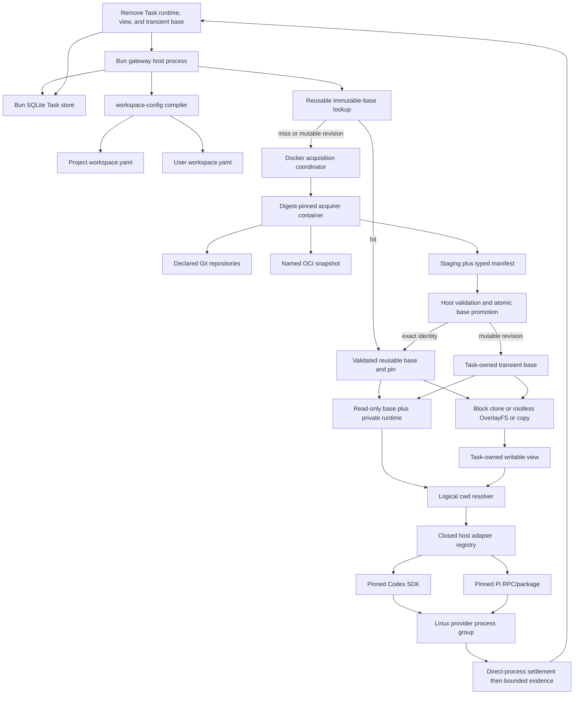

# Coding-Agent Execution Gateway - Plan

## Goal Capsule

- **Objective:** A developer can install and run one trusted-network A2A
  endpoint for one AllAgents workspace and invoke built-in or explicitly
  gateway-enabled profile targets against either the complete configured Git
  repository set, with optional named revision overrides, or a digest-pinned
  OCI workspace snapshot. AI Evals can configure either source mode in
  Promptfoo YAML through a custom provider without sending origins.
- **Means:** Convert the repository to a private Bun workspace monorepo with
  independently released `allagents` and `allagents-gateway` applications,
  versioned workspace/execution/acquisition contract packages, generated
  portable fixtures under `contracts/`, a bounded SQLite Task store, direct
  Codex and Pi host-process adapters, and one digest-pinned acquisition image
  used only when no reusable validated base exists. Read-only Tasks share a
  reusable base or own a non-reusable base for mutable revisions; read-write
  Tasks receive disposable writable views through an automatic block-clone/
  OverlayFS materializer with an explicit portable copy backend.
  Providers still run bare metal on the trusted Linux CI runner.
- **Authority:** [ADR 0002](../decisions/0002-serve-coding-agent-execution-through-an-a2a-gateway.md)
  owns the public, trust, runtime, and packaging boundaries. Project and user
  `workspace.yaml` files own source and profile declarations. A2A 1.0 owns core
  wire semantics. The CI job, VM, or deployment container is the only
  operational execution and isolation boundary. AllAgents does not claim that
  boundary contains hostile code or hides job secrets from model-invoked tools;
  it owns process lifecycle and truthful evidence only.
- **Execution order:** Capture red CLI-only and standalone-gateway package
  smokes; complete the Bun monorepo, A2A SDK, provider-surface, process-group,
  Docker-acquirer, package, and release feasibility gate; freeze schemas,
  generated fixtures, configuration projection, SQLite ownership, and release
  binding; implement the Task store and A2A server, host supervisor, Docker-only
  acquisition, Codex, and Pi; run final review; then run green packed-package,
  exact-image, registry-conformance, repository, and documentation gates.
- **Stop conditions:** Stop dependent production work if the pinned A2A surface
  cannot implement the required public protocol or if the acquisition-container
  boundary and exact image/package release binding are infeasible. A missing
  Codex or Pi capability makes that target unavailable rather than changing the
  A2A, trust, source, or Task contracts. Do not add application authentication,
  deployment YAML, remote workers, caller-supplied origins/commands, mutable OCI
  tags, provider fallback, evaluation behavior, automatic retries, per-provider
  Docker, or containment claims.
- **Tail ownership:** The implementing workflow runs focused contract,
  lifecycle, provider-environment, process-group, acquisition-boundary, and
  release-binding tests; repository quality gates; packed CLI/gateway and exact
  acquisition-image smoke tests; registry conformance; and documentation
  validation.

---

## Product Contract

### Summary

AllAgents gains a single-workspace coding-execution service without becoming an
evaluation framework or multi-tenant platform. Callers use A2A Tasks and one
required AllAgents extension. Network reachability is authorization. The
service resolves configured targets and sources from existing workspace files,
acquires or reuses an immutable base, shares it for read-only Tasks, creates an
independent disposable view for read-write Tasks, invokes Codex or Pi through a
typed adapter, and retains bounded terminal evidence. AI Evals consumes that
boundary through its own Promptfoo custom provider: evaluation YAML supplies
named revision overrides for the configured repository set, or one snapshot
handle and immutable digests, while AllAgents retains origin and credential
authority.

### Problem Frame

AllAgents configures and launches coding clients but has no service boundary for
trusted tools such as AI Evals. Those tools would otherwise import AllAgents
internals, drive interactive CLIs, or duplicate profile resolution, repository
acquisition, credential handling, cancellation, evidence capture, and cleanup.

Developers expect a process they can start in a workspace and expose on
loopback, `0.0.0.0`, a private interface, or Tailscale. They do not need an
application authentication stack, Kubernetes control plane, remote worker
registry, or another profile configuration file for the initial use case.

### Actors

- A1. **Trusted-network caller:** Any process able to reach the endpoint. All
  callers have the same authority and Task visibility. The first caller is an
  AI Evals-owned Promptfoo custom provider that maps one `callApi` to one Task.
- A2. **Execution gateway:** The A2A server and invocation supervisor. It owns
  deployment-wide Task identity, acquisition, routing, status, cancellation,
  evidence, retention, and cleanup.
- A3. **Backend adapter:** The Codex or Pi implementation translating native
  automation events and cancellation into the common contract.
- A4. **Operator/developer:** The person who selects the project workspace,
  gateway-enables profile launchers, supplies process flags and credential
  handles, and controls network access.
- A5. **GitHub/OCI source:** The remote content service used only during the
  acquisition phase.

### Key Decisions

- **Use A2A rather than inventing an invocation API.** Standard Agent Cards,
  Tasks, Artifacts, errors, streaming, and cancellation remain the public
  lifecycle. Governs R1-R3.
- **Treat the network as the trust boundary.** The initial service has no
  application authentication or caller ownership. Explicit `0.0.0.0` binding is
  valid. (session-settled: user-directed.) Governs R4-R5.
- **Reuse workspace configuration.** Project `workspace.yaml` owns sources;
  user `workspace.yaml` owns profiles, launchers, and gateway enablement. There
  is no `gateway.yaml`. (session-settled: user-directed.) Governs R6-R8, R18.
- **Support two acquisition modes.** Direct declared repositories and named,
  digest-pinned OCI workspace snapshots converge on one manifest and evidence
  contract. (session-settled: user-directed.) Governs R9-R11.
- **Share immutable bases; isolate writes.** `workspaceAccess` defaults to
  `readWrite`. Read-only Tasks may reuse one validated physical base and cwd
  with Task-private runtime state; read-write Tasks receive unique disposable
  writable views. Reflink/block clone is preferred, rootless OverlayFS is the
  Linux fallback, and an explicit copy backend preserves portability.
  (session-settled: user-directed.) Governs R2-R3, R5, R8-R11, R15-R16, R18-R19.
- **Use App-first GitHub credential eligibility.** Prefer an applicable GitHub
  App; use a configured `gh` account only when no App installation applies;
  never fall back after selected-App failure. (session-settled: user-directed.)
  Governs R12.
- **Keep a narrow typed backend seam.** Pinned supported Codex and Pi package or
  RPC surfaces are the complete initial backend set. Launcher-backed profiles
  resolve through AllAgents-owned adapters and execute on the gateway host
  rather than through generated wrapper files or the acquisition container.
  Governs R7-R8, R13-R15.
- **Persist Task truth, not provider sessions.** Restart settles interrupted
  work failed; it never resumes or automatically replays provider execution.
  Governs R5, R13-R16.
- **Keep evaluation outside AllAgents.** Consumers own datasets, repetitions,
  scoring, assertions, and evaluation Runs. Governs R17.
- **Bridge Promptfoo at the consumer boundary.** AI Evals owns a custom provider
  that maps Promptfoo YAML and test variables to the closed A2A source modes and
  maps terminal Tasks back to `ProviderResponse`. AllAgents owns no Promptfoo
  runtime behavior. Governs R19.

### Requirements

**Public protocol**

- R1. Implement A2A 1.0 HTTP+JSON for Agent Card discovery, `SendMessage`,
  `GetTask`, `ListTasks`, `CancelTask`, streaming send, and active Task
  subscription. Every A2A request carries `A2A-Version: 1.0`; another version
  receives `VersionNotSupportedError`. The Agent Card advertises exactly one
  absolute interface URL with `protocolBinding: "HTTP+JSON"`,
  `protocolVersion: "1.0"`, and `capabilities.streaming: true`. It declares
  `https://allagents.dev/a2a/extensions/coding-execution/v1` with
  `required: true` and strict `params: { targets: TargetId[] }`, populated from
  ready built-in and gateway-enabled profile targets. Production interface URLs
  use HTTPS; direct HTTP is limited to loopback development. Every operation
  that creates, returns, lists, subscribes to, or mutates profiled Tasks or
  Artifacts includes that URI in `A2A-Extensions`; missing activation receives
  `ExtensionSupportRequiredError`.

  Honor both `SendMessageConfiguration.returnImmediately` modes. `ListTasks`
  implements every standard filter, cursor pagination, `pageSize` 1-100 with a
  default no greater than 50, descending status-timestamp order, and required
  `tasks`, `nextPageToken`, `pageSize`, and `totalSize` fields.
  `nextPageToken` is present and empty on the final page. With the default
  `includeArtifacts: false`, each returned Task omits `artifacts`; `true`
  includes the field.
- R2. Generate a strict versioned request schema from the canonical domain type
  and place it only at `Message.metadata[extensionUri]`; the Message also lists
  `extensionUri` in `Message.extensions`. Strict objects reject every unlisted
  member. V1 uses these wire scalars:
  - `InvocationKey` matches `^[A-Za-z0-9][A-Za-z0-9._:-]{0,127}$`.
  - `ConfigName` and `TargetId` match
    `^[A-Za-z0-9][A-Za-z0-9._-]{0,63}$`.
  - `RevisionText` is NFC UTF-8, 1-255 bytes, with no U+0000-U+001F or U+007F.
  - `Digest` matches `^sha256:[0-9a-f]{64}$`.
  - `RelativeDirectory` is NFC UTF-8 of 1-1024 bytes containing 1-32
    slash-separated segments. Each segment is 1-255 bytes, is neither `.` nor
    `..`, and contains no slash, backslash, U+0000-U+001F, or U+007F.
  The request object is exactly:
  `version: "1"`; `invocationKey: InvocationKey`; `target: TargetId`; `source`,
  one of `{ kind: "repositories", revisions?: Record<ConfigName,
  RevisionText> }` or `{ kind: "workspaceSnapshot", snapshot: ConfigName,
  digest: Digest, workspaceManifestDigest: Digest }`; optional
  `workingDirectory`, one of `{ kind: "workspaceRoot" }` or
  `{ kind: "repository", repository: ConfigName, path?: RelativeDirectory }`,
  defaulting to `{ kind: "workspaceRoot" }`; optional `workspaceAccess`, one of
  `"readOnly" | "readWrite"`, defaulting to `"readWrite"`; optional
  `deadlineSeconds` (integer 1-3600, default 1800); and optional
  `resultSchema: { version: "1", schema: SchemaNode }`.

  A `SchemaNode` is exactly one branch below. `description` is optional NFC
  UTF-8 of at most 1024 bytes. Scalar `enum` arrays contain 1-128 canonically
  distinct values of the node's type; string enum values are at most 4096 UTF-8
  bytes, numbers are finite, integers are JSON safe integers, and null permits
  only `[null]`.
  - null or boolean: `{ type, description?, enum? }`;
  - string: `{ type: "string", description?, enum?, minLength?, maxLength? }`,
    where lengths are integers 0-1,048,576 Unicode scalar values and minimum
    does not exceed maximum;
  - number or integer:
    `{ type, description?, enum?, minimum?, maximum? }`, where number bounds
    are finite, integer bounds are JSON safe integers, and minimum does not
    exceed maximum;
  - array:
    `{ type: "array", description?, items: SchemaNode, minItems?, maxItems? }`,
    where item bounds are integers 0-4096 and minimum does not exceed maximum;
  - object:
    `{ type: "object", description?, properties, required?,
    additionalProperties: false, minProperties?, maxProperties? }`, where
    `properties` is a strict record of 0-256 `ConfigName` keys,
    `required` is a unique subset of those keys, property bounds are integers
    0-256, and minimum does not exceed maximum.
  No pattern dialect exists in v1. References, unions/combinators, conditionals,
  formats, defaults, coercion, non-finite numbers, duplicate canonical enum
  values, and unknown keywords are rejected. The canonical result schema is at
  most 64 KiB, 256 nodes, and 32 levels deep. Repository revision count cannot
  exceed declared repositories. The Message contains exactly one `Part` with
  `text` set to a UTF-8 prompt of 1 byte to 1 MiB; other Part content fields are
  rejected. Only the extension-owned metadata object is strict; unrelated A2A
  metadata and other activated-extension keys are preserved or ignored
  according to A2A. Canonicalization materializes defaults, normalizes extension
  strings to UTF-8 NFC, sorts record keys, and hashes RFC 8785 extension JSON
  plus prompt bytes. Do not add `Task.extensions` or backend-specific public
  fields.

  A client generates an opaque invocation key with at least 128 bits of
  randomness once per logical execution, durably reuses that key and identical
  canonical request after an ambiguous transport failure, and creates a new key
  only for intentionally new execution. A2A `messageId` remains Message identity
  and does not replace the extension idempotency key.
- R3. One valid new request creates one addressable Task. Follow-up messages to
  an existing Task are unsupported. Every terminal Task has exactly one
  integrity Artifact plus zero or more produced Artifacts. The integrity
  Artifact has `artifactId` and `name` equal to
  `allagents.execution-integrity`, lists `extensionUri` in
  `Artifact.extensions`, and has one `Part` with `data` set to the strict
  `allagents.execution-integrity/v1` object and `mediaType:
  "application/json"`. Its `taskId` equals the enclosing A2A `Task.id`.
  `SafeUInt` is an integer 0-9,007,199,254,740,991; `ShortText` is valid UTF-8
  of at most 4096 bytes; `ArtifactId` matches
  `^[A-Za-z0-9][A-Za-z0-9._:-]{0,127}$`; and `MediaType` is a valid RFC 6838
  media type of at most 255 ASCII bytes.
  - `version` is the literal `"1"`; `taskId` is a lowercase canonical UUIDv7;
    and `target` is `TargetId`.
  - `workingDirectory` is the effective logical selector from the request:
    `{ kind: "workspaceRoot" }` or
    `{ kind: "repository", repository: ConfigName,
    path?: RelativeDirectory }`. It never contains a physical path or configured
    repository destination.
  - `workspaceAccess` is the effective `"readOnly" | "readWrite"` value.
    `readOnly` is a consumer-selected cooperative contract with best-effort
    provider-policy enforcement, not hostile-code containment.
  - `sourceIdentity` is either
    `{ kind: "repositories", complete, repositories }` or
    `{ kind: "workspaceSnapshot", snapshot: ConfigName, digest: Digest,
    workspaceManifestDigest: Digest, layerDigests, complete, repositories }`.
    `complete` is boolean. `layerDigests` contains 0-64 `Digest` values in
    manifest order. `repositories` contains 0-64 unique strict entries
    `{ name: ConfigName, requestedRevision?: RevisionText,
    resolvedCommit: string, verification:
    "independentlyVerified" | "snapshotAttested" }`; `resolvedCommit` matches
    `^[0-9a-f]{40}$`. Before provider execution, `complete` must be true,
    `repositories` must exactly match the configured catalog, and snapshot
    identities must include every layer digest. Failed acquisition records only
    verified members and sets `complete` false.
  - Gateway-generated source identity, workspace-manifest fields, evidence
    metadata, and provider-added metadata never contain Git URLs, OCI repository
    origins, or destination paths. This guarantee applies only to
    gateway-managed credentials and generated metadata; it does not inspect or
    sanitize opaque prompts, terminal output, structured results, native
    evidence, or produced-Artifact payloads.
  - optional `workspaceManifestDigest` is `Digest`.
  - `terminalOutput` is `{ text, truncated }`, where `text` is valid UTF-8 of at
    most 1 MiB and `truncated` is boolean.
  - optional `usage` is a strict object with optional `inputTokens`,
    `outputTokens`, `cachedInputTokens`, and `totalTokens` `SafeUInt` fields,
    plus optional `provider` containing 0-64 `ConfigName: SafeUInt` counters.
  - `producedArtifacts` contains 0-128 strict entries
    `{ artifactId: ArtifactId, name?: ShortText, mediaType?: MediaType,
    size: SafeUInt, digest: Digest }`; each references one additional A2A
    Artifact embedded in the Task.
  - `evidence` is `{ items, complete, truncated }`, where the booleans have
    their literal JSON meaning and `items` contains 0-256 strict entries
    `{ kind, artifactId?, digest?, summary? }`. `kind` is one of
    `gitState | providerTrace | fileChanges | usage | cancellation |
    termination | cleanup`; `artifactId` and `digest` use the aliases above,
    `summary` is `ShortText`, and at least one of those three optional members
    is present.
    `complete` means every configured bounded evidence category was attempted
    after the direct provider process settled; it never means every descendant
    was enumerated or quiescent.
  - `termination` is `{ status: "clean" | "failed" | "unknown",
    reason?: ShortText }` and reports the direct provider/process-group
    observation only.
  - `cleanup` is
    `{ workspace: "shared" | "removed" | "retained" | "failed",
    reason?: ShortText }`. `shared` means a read-only Task removed its private
    runtime state while retaining a reusable cached base; `removed` means every
    Task-owned runtime, writable view, and non-reusable base was removed.
  - optional `failure` is `{ code, message, retryable, cause }`, where `code`
    is one stable code from the error table below, `cause` is one member of the
    closed cause union defined below that table, `message` is `ShortText`, and
    `retryable` is that row's fresh-invocation value.
  - `result` is exactly one of
    `{ status: "valid", value }`,
    `{ status: "invalid", errors }`, or
    `{ status: "notProduced", reason }`. `value` is JSON that validates against
    the requested `SchemaNode`, serializes to at most 1 MiB, and is used only
    when a result schema was requested. `errors` contains 1-64 strict
    `{ path, keyword, message }` entries: `path` is an RFC 6901 JSON Pointer of
    at most 1024 bytes, `keyword` is one of the v1 `SchemaNode` member names,
    and `message` is `ShortText`. `reason` is one of
    `notRequested | providerDidNotReturn | providerFailed | canceled |
    deadlineExceeded | invalidProviderPayload`.

  Failure, rejection, and cancellation retain every available field without
  implying a valid result. Task records, Artifacts, events, and claims expire
  atomically after the configured TTL; expired keys may create new Tasks. The
  gateway never evicts unexpired Tasks to satisfy the retained-count limit: it
  rejects new admission until expiry frees capacity.

**Trust, identity, and Task storage**

- R4. Do not authenticate application callers. Allow loopback, specific-address,
  and explicit `0.0.0.0` listeners. Every reachable caller may create, list,
  retrieve, subscribe to, and cancel every Task. Artifacts are retrieved only
  inside Tasks through `GetTask` or `ListTasks(includeArtifacts: true)`; v1 adds
  no separate Artifact endpoint. Document Tailscale ACLs, firewalls, or
  equivalent network controls as the authorization boundary.
- R5. Idempotency and Task visibility are deployment-wide. Atomically and
  durably bind an invocation key to the canonical request, selected target,
  source identity, effective logical working directory, effective workspace
  access, optional result-schema digest, deadline, and effective configuration
  digest before acknowledging Task creation. One transactional
  `createOrReplay` operation arbitrates competing requests. Identical replay
  returns the existing Task; a changed request conflicts. Status and terminal
  settlement are monotonic. The project-specific state root persists the
  canonical workspace identity and holds an exclusive process lock.

  The Bun gateway privately owns one SQLite database through `bun:sqlite`.
  Claims, Tasks, events, bounded Artifact bytes, the single execution lease,
  internal outcome intent, acquisition-container identity, staging and
  transient-base identity, direct provider process-group identity, and expiry
  live in ordinary transactional tables. Enable foreign keys, use WAL where
  supported, set `synchronous=FULL`, and acknowledge only committed
  transactions. The current user owns the state root and database with
  `0700`/`0600`-equivalent permissions; the root is disjoint from project,
  staging, publication, profile, and provider-auth roots. No custom SQLite VFS
  or native file primitive is introduced. Startup verifies the root, lock,
  schema/integrity, and workspace identity; terminalizes interrupted Tasks
  failed; removes recorded acquisition containers and orphan staging; and
  attempts to terminate recorded provider process groups. It releases a stale
  or termination-poisoned lease only after the container is gone, the recorded
  process group is confirmed absent, and recorded Task-owned runtime, view, and
  transient-base cleanup has completed. Otherwise readiness remains false and
  admission stays stopped. Provider work is never resumed.
  Store open, corruption, write, transaction, or synchronization failure stops
  admission and prevents terminal success.

**Workspace and target configuration**

- R6. One gateway process serves one project workspace selected by `--workspace`
  or cwd. Parse its `.allagents/workspace.yaml` through the authoritative project
  schema, then compile a gateway-only repository catalog without tightening
  ordinary workspace parsing. Derive each logical name from `name` or the
  existing path-basename fallback; require 1-64 unique `ConfigName` values,
  collision-free normalized destinations, and one supported canonical GitHub
  origin resolved through existing `source`/`repo` semantics. Repository names,
  origins, destinations, default revisions, workspace projection, plugins, and
  named OCI snapshot repositories come only from that declaration. A catalog
  failure makes the gateway not ready.
- R7. Parse `~/.allagents/workspace.yaml` through the authoritative user schema.
  Built-in `codex` and `pi` targets are available when ready. A launcher-bearing
  profile client adds a target only when `gateway.enabled: true`. Its public ID
  is the globally collision-checked launcher basename and resolves to exactly
  one `(profile, client)` pair. Built-in IDs are reserved under the same portable
  collision key; colliding enablement is a configuration error. Initially only
  Codex and Pi profile clients are executable.
- R8. A request selects a declared target, may select one logical
  `workingDirectory`, may select `workspaceAccess`, may set the bounded
  `deadlineSeconds`, and may provide one bounded result schema. `workspaceAccess`
  defaults to `readWrite`; it is never inferred from prompt text.

  A read-only Task resolves its cwd directly inside its validated base. An exact
  immutable request may share a reusable cached base; a mutable branch or tag
  request owns a non-reusable base for the Task lifetime. The Task receives a
  private `<invocation-root>/<task-id>/runtime` for temporary, home,
  provider-state, and evidence files. Provider environments disable optional
  Git locks, and adapters request native read-only policy when available. The
  gateway does not inspect prompts or add a per-Task mount, chmod pass, or full-
  tree verification. The consumer remains responsible for assigning work that
  does not require project mutation.

  A read-write Task receives a unique writable view at
  `<invocation-root>/<task-id>/workspace`. The configured host materializer
  prefers a filesystem block clone, falls back to rootless OverlayFS on
  supported Linux hosts, and supports an explicit ordinary-copy backend for
  portability. Writable files never use hard links. Normal settlement removes
  the writable view and any non-reusable base after evidence collection; non-
  settling execution retains them with the poisoned lease until verified
  reconciliation.

  `{ kind: "workspaceRoot" }` selects the effective base or Task view. A
  repository selector maps its declared name through the compiled catalog,
  appends only the validated `RelativeDirectory`, resolves links without escape,
  and must name an existing directory beneath that repository. Absolute paths,
  configured destinations, undeclared repositories, non-directories, and
  escaping resolutions fail before provider start. Gateway-generated requests,
  structured Task/Artifact metadata, and operational logs never contain the
  physical path. Opaque terminal output, native evidence, and produced-Artifact
  payloads are not sanitized and may contain it.

  The gateway owns one durable execution lease covering base acquisition or
  lookup through final evidence collection. Admission claims that lease
  transactionally before starting an acquisition container or provider process;
  at most one Task may hold it. A second otherwise-valid request is accepted as
  a Task and settles failed with `execution_capacity_unavailable` without
  creating a container or process. Lease identity is stored with the Task and
  survives gateway restart. Normal final settlement releases it; a provider-
  termination failure retains it until verified startup reconciliation confirms
  the recorded process group is absent.

  The overall deadline covers cache lookup, Docker acquisition on miss,
  publication, optional materialization, typed preparation, bare-metal provider
  execution, and evidence collection. Acquisition receives
  `min(900 seconds, remaining overall deadline)`; exceeding that sub-budget
  removes the acquisition container and fails before provider execution.
  Overall expiry initiates adapter abort and Linux process-group escalation.
  Cleanup then uses its own fixed bounded budget. A request cannot provide or
  override backend, executable path, command, argv, environment, provider home,
  profile settings, plugins, MCP servers, repository URLs, destination paths,
  credential provider, setup behavior, provider permission policy, materializer,
  cache key, Docker options, image reference, or mounts. Readiness rejects
  missing, partial, drifted, unsupported, or declaration-missing gateway-enabled
  profiles.

**Workspace acquisition**

- R9. Use exactly one closed source union:
  - `{ kind: "repositories", revisions?: Record<repositoryName, revision> }`; or
  - `{ kind: "workspaceSnapshot", snapshot, digest, workspaceManifestDigest }`.
  Unknown variants, cross-variant fields, undeclared names, mutable snapshot
  references, malformed digests, and destination overrides fail admission.
  Source-mode failure never falls through to the other mode.
- R10. Repository mode materializes every entry in the compiled gateway catalog.
  Caller revisions may override only a declared repository's default revision.
  Canonicalize HTTPS GitHub origins, resolve and record full commits before
  provider execution, use hermetic Git configuration, disable redirects and
  repository-controlled secondary fetch/exec features, verify checkout
  identities, and reject path collisions or escapes.
- R11. Snapshot mode maps `snapshot` to a declared OCI repository and constructs
  `<repository>@<digest>` server-side. The same digest-pull contract must
  interoperate with Docker Hub, GHCR, JFrog Artifactory/JFrog Container
  Registry, and compatible private OCI Distribution registries; registry choice
  does not alter the accepted snapshot format. V1 accepts only
  `application/vnd.oci.image.manifest.v1+json` with `schemaVersion: 2` directly
  at the requested digest. Reject image indexes, nested indexes, descriptor
  `urls` or embedded `data`, non-distributable layers, unknown media types, and
  more than 64 layers. The config descriptor must use
  `application/vnd.allagents.workspace-manifest.v1+json`; its digest must equal
  `workspaceManifestDigest`, and its bytes are RFC 8785 canonical JSON. Accepted
  layer media types are the OCI distributable tar, gzip, and zstd variants.
  Verify the raw manifest body and every config/layer descriptor size and digest
  while streaming, before decoding. Apply layers base-to-top with OCI whiteout
  and opaque-whiteout semantics.

  The wire-visible workspace manifest contains every compiled project
  repository exactly once by logical name and omits destination paths. After
  applying layers, the gateway uses the compiled operator catalog to verify that
  each listed repository exists at its configured destination and that no
  repository is missing, extra, renamed, misplaced, duplicated, or accompanied
  by undeclared generated content. Apply these fixed v1 ceilings across all
  processed layers, including overwritten or whiteouted content: 4 MiB manifest,
  4 MiB config, 8 GiB total compressed layer bytes, 32 GiB total expanded bytes,
  500,000 entries, 4 GiB per regular file, 4096 UTF-8 bytes and 128 components
  per path, and 1 MiB per PAX or other extended header. Abort before crossing a
  limit. Validate paths, collisions, file types, modes, links, and the compiled
  filesystem layout in staging before atomic publication. Reject absolute or
  traversing paths, devices, sockets, sparse files, escaping links, credentials
  in redirect URLs, unapproved cross-origin redirects, and external layers.
  Cross-origin redirects are limited to layer-blob `GET`/`HEAD` requests and
  exact operator-declared `layerRedirectHosts`; token, manifest, and config
  requests remain same-origin. Private or otherwise non-global destinations are
  permitted only when the exact host is the source's declared repository host
  or a declared layer-redirect host, with per-hop rebinding checks. The common
  path-free workspace manifest distinguishes independently verified Git facts
  from snapshot-attested facts; compiled destinations remain private validation
  inputs.

  After host validation, atomically promote staging to a validated base. An OCI
  identity is reusable under a gateway-owned cache key containing its manifest
  and workspace-manifest digests. A repository identity is reusable only when
  every effective revision is a full commit ID. Its cache key also binds the
  acquisition-contract version, compiled catalog/layout digest, and every
  commit. Branch and tag requests instead receive a non-reusable Task-owned base
  and never populate or reuse a cache entry. A valid cache hit starts no
  acquisition container and resolves no source credential. Active Tasks pin a
  reusable base; bounded eviction removes only unpinned cache entries.

**Credential selection and containment**

- R12. Repository requests never carry credentials or select providers. For
  `github.com`, a configured App lookup returning installation coverage is
  `eligible`. A 404 is `ineligible` only after the repository's existence is
  independently proven through the configured GitHub CLI identity; an
  uncorroborated 404, 401, 403, 429, timeout, or 5xx is `unknown`. An explicit
  installation ID is eligible only after positive repository-coverage
  verification. For `eligible`, the host gateway creates the App JWT from the
  configured private key, discovers and verifies installation coverage, and
  mints a new repository-scoped read-only installation token for every cache-
  miss acquisition. Credentials are never cached. Validate the token's
  repository selection,
  permissions, creation time, and expiry, and require remaining lifetime greater
  than the R8 acquisition sub-budget plus a 60-second clock-skew margin. Only
  the resulting installation token enters the acquisition container; the App
  private key remains on the host.

  Use the configured GitHub CLI account only when the App is absent or
  applicability is positively `ineligible`. An `unknown` result or any
  selected-App configuration, authentication, minting, permission, repository,
  rate-limit, or service failure terminates acquisition without `gh` fallback.
  Resolve `gh auth token --hostname github.com --user <account>` on the host
  with ambient token variables removed, then inject only the selected
  invocation-scoped source credential into the acquisition container. Revoke an
  App token after acquisition and fail before provider execution if revocation
  cannot be confirmed. OCI acquisition accepts anonymous pulls or exact-
  registry credentials from the strict Docker-auth/helper boundary and supports
  same-origin Basic and Distribution Bearer challenges, the documented Docker
  Hub token service, and an operator-supplied exact-host CA-bundle map. The
  acquisition container receives source-only credentials and trust material;
  they are destroyed with the container before provider preparation.

**Execution, evidence, and cleanup**

- R13. Keep one closed `codex | pi` backend registry behind a narrow
  AllAgents-owned TypeScript interface covering availability, capabilities,
  invocation, progress, deterministic permission handling, abort, direct
  process settlement, terminal output, optional structured result, usage,
  bounded native evidence, and disposal. The gateway owns contract
  normalization rather than adopting AI SDK Harnesses. Profile targets resolve
  adapter-owned configuration directly; never execute generated launchers,
  discover arbitrary executables as targets from `PATH`, scrape a TUI, append
  public input to argv, or download a provider runtime per request. A configured
  globally installed binary override is eligible only after an exact version
  and protocol compatibility probe.
- R14. Codex uses a pinned `@openai/codex-sdk` directly from the Bun gateway.
  Codex app-server is allowed only if U0 demonstrates a required capability
  absent from that pinned SDK; the reason and tested protocol version must then
  be recorded. Each Task receives one fresh SDK execution context, streamed
  events, native cancellation, and an explicitly constructed child environment.
  When API credentials are absent, preserve the existing host `CODEX_HOME` and
  ChatGPT login in place; do not copy, mount, parse, or import OAuth files.
  Pass native `outputSchema` only when the public schema has an object root,
  every object's `required` set equals its property set, nesting is at most 10
  levels, and every keyword is supported by the pinned SDK/model. Other valid
  public schemas use explicit JSON guidance plus the common gateway-side
  validator.

  Pi uses a pinned supported package/RPC surface, invocation-owned
  configuration, one restricted policy extension, and the existing host Pi
  authentication location. Repository extensions and unrestricted built-ins do
  not auto-load. Do not copy, mount, parse, or import Pi authentication files.
  Both adapters preserve only required host identity, authentication paths,
  executable lookup, locale, certificate, and proxy settings in an explicit
  environment allowlist. This reduces accidental environment leakage; it is
  not a secret-isolation guarantee because model-invoked tools run with the same
  CI-job authority.
- R15. Start a fresh Docker container only when a request has no reusable
  validated base, including a cache miss or a non-reusable branch/tag request.
  Probe Docker and the exact digest-pinned `apps/acquirer` image at that point.
  A repository-mode probe failure is `source_git_unavailable`; a snapshot-mode
  probe failure is `source_snapshot_unavailable`. The gateway creates private
  staging and starts the image with that directory as its only writable bind
  mount. The container receives the canonical acquisition request, compiled
  catalog, strict network/size/archive policy, source-only GitHub or OCI
  credentials, and only required exact-host CA material. It receives no GitHub
  App private key, host home, provider home, Docker socket, gateway database,
  published base, unrelated credential, Codex, Pi, or other coding harness. It
  never downloads a coding harness. Docker network access is limited to source
  endpoints required by the selected Git or OCI mode.

  The acquirer writes content beneath staging and emits one typed manifest
  through the bind mount, then exits. The host gateway waits for exit, removes
  the container, destroys source credentials, validates the manifest and tree
  against the compiled catalog and fixed limits, and atomically promotes staging
  to a reusable cache entry or non-reusable Task-owned base. Every cancellation,
  deadline, validation failure, or other non-publication path removes staging
  idempotently; cleanup uncertainty fails `source_cleanup_failed` and stops
  admission. Source-mode failure never falls through.

  A read-only Task uses the base directly plus Task-private runtime state.
  Adapter-owned preparation for that mode must keep project files unchanged and
  place invocation configuration outside the base. A read-write Task first
  receives a unique block-cloned, overlaid, or copied view; typed preparation
  may then project validated project/profile settings, plugins, and MCP
  declarations into that view. Project or user `setup` entries and other
  configured shell commands never run automatically.

  Codex and Pi execute as direct host processes on the same trusted Linux CI
  runner as the gateway. The adapter receives the access-appropriate resolved
  cwd selected by the logical `workingDirectory`, Task-private runtime paths,
  and the effective access mode; it never receives a caller-supplied physical
  path or materializer choice. Provider execution never reuses the acquisition
  container and never creates a per-invocation provider container. The CI job,
  VM, or deployment container is the isolation boundary. AllAgents does not
  claim containment of hostile repository code, network access by model tools,
  or provider/MCP/operator secrets from those tools. Capture bounded provider
  events while the direct provider process is live. Collect filesystem/Git
  evidence only after that direct process settles and process-group termination
  attempts finish; phrase the evidence as observed after direct-process
  settlement, never as proof that every descendant is quiescent. Run Git
  inspection with hermetic configuration that disables hooks, filters, drivers,
  fsmonitor, pagers, helpers, optional locks, and external commands.
- R16. On trusted Linux runners, start each direct provider in a new process
  group and persist its leader PID plus Linux process-start marker with the Task
  and execution lease before recording provider execution as started. One
  durable compare-and-set arbitrates provider terminal outcome, caller
  cancellation, overall deadline, and shutdown as an internal `outcomeIntent`
  while the external Task remains nonterminal. The winning intent owns the
  stable result or failure code and drives one idempotent abort path: request
  graceful adapter abort, wait the configured grace period, send `SIGTERM` to
  the process group, then `SIGKILL` after the forced-termination period.

  After the direct provider process has settled and bounded evidence collection
  finishes, cleanup removes a read-only Task's private runtime state, unmounts
  and removes a read-write Task's writable view, and removes any non-reusable
  base. One transaction then writes terminal Task status, result/failure,
  bounded evidence, exactly one integrity Artifact, produced Artifacts, observed
  termination, cleanup outcome, and lease release. Any Task-owned cleanup
  failure settles `workspace_cleanup_failed` with
  `cleanup.workspace: "failed"` and retains its internal cleanup record for
  startup or operator repair; admission stops when an active mount or uncertain
  writable view remains. If the direct process does not settle after `SIGKILL`,
  one transaction instead writes a failed Task with
  `execution_termination_failed`, live provider evidence, and observed
  termination, but no filesystem, Git, or produced-Artifact evidence. It retains
  the Task runtime, any writable view or non-reusable base, and the lease; makes
  readiness false; and stops admission. Startup may release that poisoned lease
  only after the recorded process group is confirmed absent following runner
  teardown and retained Task-owned state is reconciled; otherwise it remains
  unready.

  Repeated cancellation while intent is pending does not re-signal work.
  Startup never resumes a session. Gateway shutdown stops admission, commits
  shutdown intent, performs the same escalation and settlement rules, and
  exits. CI runner teardown is the final orphan boundary. AllAgents does not use
  cgroups, pidfds, namespaces, nftables, `openat2`, a native platform layer, or
  non-bypassable spawn mediation, and does not claim complete descendant
  enumeration or hostile-code containment.

**Scope and configuration**

- R17. Do not add evaluation commands, datasets, assertions, scoring,
  repetitions, experiment scheduling, or automatic Task retry.
- R18. Do not add `gateway.yaml` or `worker.yaml`. Process configuration uses
  the exact CLI flags and environment variables in the Configuration Contract
  for listener, advertised interface URL, workspace, state/retention,
  immutable-base cache, workspace materializer, acquisition image and Docker
  access, GitHub/OCI source credentials, provider executable overrides, provider
  home/auth paths, and process-group timeouts. The listener also exposes
  unauthenticated metadata-only `/healthz` and `/readyz` endpoints outside A2A:
  liveness returns 200 while the process can serve; readiness returns 200 only
  while new admission is safe and otherwise 503. They reveal no targets,
  sources, paths, or failure details and do not require A2A headers. Gateway code
  never copies acquisition credential values into generated workspace files,
  requests, logs, Task/Artifact metadata, retained Task views, cache entries, or
  provider environments. This is not a redaction or isolation guarantee for
  opaque prompts, provider/tool output, structured results, inherited host
  authentication, native evidence, or produced-Artifact payloads.
- R19. Document AI Evals consumption through a Promptfoo custom
  JavaScript/TypeScript provider implementing Promptfoo's `ApiProvider`.
  `constructor(options: ProviderOptions)` requires and retains a nonempty
  `options.id`, validates `options.config`, and `id()` returns that ID. Static
  config contains the gateway endpoint, target ID, optional default logical
  `workingDirectory`, optional `workspaceAccess` defaulting to `readWrite`, and
  exactly one closed source mode: repository mode materializes the complete
  configured repository set and carries only an optional revision map keyed by
  declared repository name; snapshot mode carries one declared snapshot name
  with OCI and workspace-manifest digests.
  `callApi(prompt, context?, options?)` may apply the exact
  `context?.vars?.allagentsSource` leaf overrides, may replace the default
  selector through `context?.vars?.allagentsWorkingDirectory`, and may replace
  access through `context?.vars?.allagentsWorkspaceAccess`; missing context
  retains static values. Dynamic source values remain limited as defined below.
  The working-directory variable is exactly `{ kind: "workspaceRoot" }` or
  `{ kind: "repository", repository: ConfigName,
  path?: RelativeDirectory }`; access is exactly `readOnly` or `readWrite`.
  Unknown members, invalid relative paths, URLs, physical or configured
  destination paths, credentials, commands, Docker options, materializer
  choices, and provider permission policy fail before provider execution.

  The provider sends `SendMessage` with `configuration.returnImmediately: true`,
  captures the accepted Task ID, and calls `SubscribeToTask`; a terminal-before-
  subscribe race or broken stream falls back to `GetTask` and resubscription
  within the same deadline. A deadline or `options?.abortSignal` issues exactly
  one `CancelTask` with a fresh bounded cleanup signal rather than the already
  aborted request signal. One `callApi` creates one A2A Task and maps terminal
  output, usage, Task/Artifact IDs, structured result, and logical provenance
  into `ProviderResponse`. Admission or terminal failure maps a safe human
  message to `error` and stable `code`, `retryable`, and accepted `taskId` to
  `metadata`. AI Evals owns the provider implementation. AllAgents publishes the
  protocol and YAML examples without importing Promptfoo provider code or adding
  Promptfoo as a runtime dependency.

### Key Flows

- F1. **Start and advertise**
  1. Resolve cwd or `--workspace`, user workspace, project-specific state root,
     disjoint immutable-base cache and invocation roots, cache/task retention,
     workspace materializer, listener, advertised URL, digest-pinned acquisition
     image, Docker endpoint, source credentials, provider homes, and configured
     provider executable overrides.
  2. Validate the SQLite state root, cache/invocation roots, workspace identity,
     materializer policy, and static acquisition-image reference; compile
     repository, snapshot, and target catalogs; verify Codex SDK and Pi RPC/
     package compatibility; and check any global binary override exactly. Do not
     contact Docker or the acquisition registry at startup.
  3. Reconcile interrupted Tasks by removing any recorded acquisition container
     and orphan staging, terminating any recorded Linux provider process group,
     and marking the Task failed without resuming it. Release the durable lease
     only after container removal, confirmed process-group absence, and cleanup
     of recorded Task-owned runtime, view, and non-reusable base; otherwise keep
     readiness false and the lease poisoned.
  4. Bind the requested address, including `0.0.0.0` when explicit; serve
     metadata-only health/readiness probes; and publish one Agent Card whose
     absolute interface URL, required extension, and target allowlist match the
     validated configuration.

- F2. **Acquire or reuse repositories and execute**
  1. Negotiate A2A version and the required extension, then validate the strict
     request, one text Part, target, repository-name/revision map, logical
     working-directory selector, workspace access, result schema, deadline, and
     deployment-wide idempotency claim.
  2. In one SQLite transaction, create or replay the claim and Task and acquire
     the execution lease before starting work. Capacity failure settles the Task
     with `execution_capacity_unavailable` and launches neither Docker nor a
     provider.
  3. When every effective revision is a full commit, derive the immutable-base
     key and pin a matching validated cache entry. On a miss or for mutable
     branch/tag revisions, classify App applicability and mint a fresh
     installation token or resolve the configured `gh` token only according to
     eligibility. Probe Docker and the exact digest-pinned acquisition image,
     then start it with only private staging, compiled request/policy, and the
     selected token. The container fetches hermetically, verifies full commits,
     writes the typed manifest, exits, and is removed.
  4. On acquisition, revoke any App token, destroy source credentials, validate
     the manifest/staging on the host, and atomically promote it to either a
     reusable cache entry or a non-reusable Task-owned base. A cache hit performs
     none of those acquisition, Docker, or credential operations. Every
     non-publication path removes staging.
  5. For `readOnly`, resolve the logical cwd directly in the base and create only
     Task-private runtime state. For `readWrite`, create the unique writable view
     through the selected materializer, then resolve cwd in that view. Run
     access-appropriate typed preparation and start the adapter there as a direct
     host process group with explicit environment and existing host auth.
     Validate structured results while capturing bounded live events.
  6. After the direct provider process settles and cancellation escalation
     finishes, collect bounded truthful evidence; remove private runtime, any
     writable view, and any non-reusable base; unpin a reusable base; and
     atomically settle the Task, Artifacts, observed termination, cleanup, and
     lease. If the process does not settle after `SIGKILL`, publish
     `execution_termination_failed` without filesystem/Git evidence, retain
     Task-owned state and the lease for runner teardown, make readiness false,
     and stop admission until startup reconciliation confirms the process group
     absent and cleans retained state.

- F3. **Acquire or reuse an OCI snapshot and execute**
  1. Perform the same version/extension validation and atomic
     claim+Task+lease transaction as F2.
  2. Pin a cache entry matching the named snapshot, manifest digest, workspace-
     manifest digest, catalog/layout digest, and acquisition-contract version.
     On a miss, probe Docker and the exact digest-pinned acquisition image, then
     start it with the digest-pinned reference, staging mount, exact-host
     registry credentials/CA material, and frozen network/archive policy. Pull
     and verify the direct image manifest, workspace-manifest config, and
     distributable layers; apply changesets in order; enforce all limits; and
     emit the typed manifest.
  3. On a miss, remove the container and registry material, validate and publish
     the immutable base on the host, or remove staging on every non-publication
     path. Then select the read-only shared base or read-write Task view and
     settle through the same bare-metal and cleanup path as F2. Provider
     execution never occurs in the acquisition container.

- F4. **Cancel**
  1. Atomically persist cancellation intent if the Task remains cancelable.
  2. For acquisition, stop and remove the Docker container, source material, and
     unpublished staging. For provider work, request graceful adapter abort,
     then escalate to process-group `SIGTERM` and `SIGKILL` within bounded
     periods. Preserve only observed, bounded evidence; clean up and settle
     canceled or failed according to the durable winning intent.
  3. Repeated cancellation while intent is pending does not re-signal work.
     Cancellation after any terminal state returns A2A
     `TaskNotCancelableError`.

- F5. **Shut down**
  1. Stop new admission before signaling active work.
  2. Persist shutdown intent, remove active acquisition Docker work or escalate
     the direct provider process group, collect evidence only after the direct
     provider settles, and settle the accepted Task once.
  3. Exit after the bounded settlement and cleanup path. Document that CI runner
     teardown is the final orphan boundary and that gateway shutdown does not
     prove every model-tool descendant is gone.

- F6. **Invoke from Promptfoo**
  1. Promptfoo constructs the AI Evals-owned TypeScript provider with
     `ProviderOptions`; the provider retains the ID and validates
     `options.config` containing the private-network endpoint, target, optional
     default logical working directory, optional default workspace access, and
     one closed source-mode object.
  2. `callApi(prompt, context?, options?)` applies only valid
     `context?.vars?.allagentsSource` leaves and optional strict
     `context?.vars?.allagentsWorkingDirectory` and
     `context?.vars?.allagentsWorkspaceAccess` replacements, creates and retains
     one high-entropy invocation key, and sends one A2A Message with
     `configuration.returnImmediately: true`.
  3. After receiving the Task ID, subscribe to terminal updates. Resolve a
     terminal-before-subscribe or disconnected-stream race through `GetTask`
     and bounded resubscription. Deadline or abort sends `CancelTask` once with
     a fresh cleanup signal.
  4. Return terminal text or validated structured output in
     `ProviderResponse.output`; map `inputTokens -> prompt`,
     `outputTokens -> completion`, `cachedInputTokens -> cached`, and
     `totalTokens -> total`; and put other usage plus Task, Artifact, logical
     source, termination, cleanup, and stable failure facts in `metadata`.
     Admission or terminal failure returns a safe `error`.

### Acceptance Examples

- AE1. A caller on a permitted Tailscale or firewalled network discovers the
  gateway through its configured HTTPS interface URL while it is bound to
  `0.0.0.0`, selects `codex-review`, and receives one durable Task without an
  application credential.
- AE2. Any reachable caller can list, retrieve, and cancel a Task created by
  another reachable caller and inspect its embedded Artifacts through `GetTask`
  or `ListTasks(includeArtifacts: true)`; documentation states this shared trust
  model without implying tenant privacy.
- AE3. A launcher-bearing Codex profile without `gateway.enabled: true` is
  absent from discovery and rejected when selected. An enabled but drifted
  profile fails readiness/new admission.
- AE4. A multi-client profile gateway-enables `codex-review` and `pi-review` as
  distinct targets. Both resolve through adapters; neither generated wrapper is
  executed.
- AE5. Repository mode accepts declared names and revision overrides, rejects an
  undeclared name or URL override, and records the resolved full commits.
- AE6. On a base-acquisition miss, including a mutable branch/tag request, an
  applicable GitHub App bypasses its token cache, mints a repository-scoped
  read-only token with adequate lifetime, validates and revokes it after
  acquisition. A cache hit resolves no source credential.
  A corroborated existing repository with no applicable installation uses the
  configured `gh` account. An uncorroborated 404, unknown applicability, auth,
  mint, validation, or revocation failure does not fall through to `gh` or start
  the provider.
- AE7. Snapshot mode accepts a direct image manifest with matching manifest,
  config/workspace, and layer digests; applies gzip/zstd layers and whiteouts in
  order; and enforces every fixed limit. Same-origin metadata redirects work;
  only layer requests may cross origin to an exact declared host, with
  credentials stripped and every resolved address checked. Mutable tags,
  indexes, unknown/non-distributable media, descriptor URLs/data, traversal,
  foreign layers, digest/size mismatch, malformed whiteouts, undeclared
  repositories, redirect loops/rebinding, non-global destinations not declared
  for that source, and unapproved origins fail.
- AE8. Repository and snapshot modes produce the same path-free wire-visible
  workspace-manifest shape and logical repository set. The gateway separately
  validates the acquired base against the exact compiled private destinations.
  OCI-contained commit identities are snapshot-attested unless independently
  verified; source identity includes completeness and ordered layer digests
  without origins. One hundred Tasks using the same immutable identity perform
  one full acquisition while the entry remains cached and pinned correctly.
  A branch or tag request acquires a non-reusable Task-owned base, never enters
  the reusable cache, and removes that base during settlement or reconciliation.
- AE9. Identical invocation-key replay, including after a lost response, returns
  the original Task. Reusing the key with changed target, source, prompt, logical
  working directory, workspace access, or result schema conflicts. Separate
  read-only Tasks may share one physical base and cwd while keeping private
  runtime state. Separate read-write Tasks receive independent writable views
  even when their logical working-directory selectors are equal.
- AE10. Cancellation during a Git or OCI base acquisition stops and removes the
  acquisition container and unpublished staging. Cancellation during Codex or
  Pi requests graceful abort, then sends process-group `SIGTERM` and `SIGKILL`
  on schedule.
  The Task records observed termination and cleanup without claiming complete
  descendant quiescence. If the direct process does not settle, the gateway
  retains the Task's runtime and any writable view plus the lease, omits
  filesystem/Git evidence, stops admission, and remains unready until post-
  teardown startup reconciliation confirms the group absent.
- AE11. Kill fixtures before and after durable Task/lease creation, acquisition-
  container start, provider process-group recording, and response
  acknowledgment leave one recoverable SQLite truth. Restart removes the
  recorded acquisition container, orphan staging, and safe Task-owned state;
  best-effort terminates the recorded process group; and turns the interrupted
  Task into one terminal failure without resuming a provider session. It retains
  the lease and stays unready unless provider absence and required cleanup are
  confirmed. Terminal Tasks and Artifacts remain until expiry.
- AE12. A valid structured result survives later check or evidence failure as a
  valid result with an overall failed Task; invalid or absent results are never
  published as valid.
- AE13. A gateway-enabled launcher named `codex`, `pi`, or a portable case-
  equivalent fails configuration compilation instead of shadowing a built-in
  target.
- AE14. Two gateways for different workspaces use distinct private state roots;
  a second process for the same root fails the exclusive lock. Wrong-owner,
  permissive, linked, or overlapping roots fail startup. Ordinary Bun SQLite
  transactions with foreign keys and `synchronous=FULL` recover a committed
  Task/claim/lease generation after process-kill fixtures and never acknowledge
  an uncommitted Task or publish false success; no custom VFS is required.
- AE15. Barrier-controlled provider-terminal, caller-cancel, deadline, and
  shutdown races durably select one internal intent and one abort path during
  Docker acquisition, preparation, Codex, Pi, or evidence. Normal settlement
  writes status, integrity Artifact, bounded evidence, result/failure, observed
  termination, cleanup, and lease release in one transaction. The
  `execution_termination_failed` exception writes the terminal failure without
  filesystem/Git evidence and deliberately retains the poisoned lease.
- AE16. Repeated cancel while cancellation is pending is idempotent; cancel
  after canceled, completed, failed, or rejected returns
  `TaskNotCancelableError`.
- AE17. A workspace containing `setup` shell entries never executes them during
  acquisition or startup. The acquisition image receives only staging,
  source-only credentials, exact source network policy, and archive limits; it
  receives no host home, Docker socket, gateway state, provider auth, Codex, Pi,
  or coding harness. Codex and Pi run afterward as direct host processes with
  explicit environments that preserve required host identity/auth paths and
  omit unrelated ambient values.
- AE18. Evidence collection starts only after the direct provider process has
  settled and process-group escalation has completed. Git inspection disables
  repository-controlled execution, and the integrity Artifact distinguishes
  observed direct-process termination and cleanup from full descendant
  quiescence. Documentation explicitly states that AllAgents provides no
  hostile-code or model-tool secret-isolation guarantee.
- AE19. The 1001st unexpired retained Task is rejected with
  `retention_capacity_exhausted`; no retained Task is evicted before TTL. While
  one Task holds the execution lease, a barrier-controlled second request
  settles `execution_capacity_unavailable` and launches no acquisition or
  provider child; races and restart never produce two lease holders.
- AE20. Official HTTP+JSON client fixtures send `A2A-Version: 1.0`, exercise
  required-extension activation and both `SendMessage` modes, preserve unrelated
  metadata, verify standard `google.rpc.Status` errors, and cover every
  `ListTasks` filter, cursor, order, response field, and artifact-inclusion rule.
  A terminal Task contains one extension-marked integrity Artifact with its
  effective logical working directory, workspace access, and referenced
  produced Artifacts using unified Parts.
- AE21. The AI Evals Promptfoo fixture has a top-level prompt and disables
  sharing, caching, result writes, and concurrency above one. It loads one
  repository-mode and one snapshot-mode provider, sends only closed logical
  source, working-directory, and workspace-access data, replaces cwd and access
  per trial through `allagentsWorkingDirectory` and
  `allagentsWorkspaceAccess`, retains one invocation key across ambiguous
  retries, and cancels an accepted Task on abort. Two read-only trials for the
  same immutable source share the validated base; two read-write trials receive
  independent disposable views. Both return scorable output, normalized token
  usage, and Task/Artifact/logical-provenance metadata. Safe failure metadata
  includes code, retryability, and accepted Task ID. Calls with omitted context
  work; unknown variables, invalid or escaping relative directories, physical
  paths, mutable revisions, origins, destinations, materializer choices, or
  undeclared names fail before provider execution.

### Success Criteria

- `allagents-gateway serve` starts from a real workspace with no deployment YAML.
- Explicit loopback, private-interface, and `0.0.0.0` listeners work with a
  distinct valid advertised interface URL; health/readiness reflect admission.
- The official A2A client exercises version and extension negotiation, both send
  modes, stream, get, complete list/pagination semantics, subscribe, replay,
  cancel, terminal cancel errors, Task-embedded Artifacts, standard HTTP+JSON
  errors, and expiry.
- An AI Evals-style Promptfoo custom-provider fixture consumes secure-default
  YAML for both source modes, selects a logical cwd and access mode per trial,
  proves shared-base reuse for read-only trials and independent disposable views
  for read-write trials, propagates post-acceptance cancellation, and maps a
  terminal Task to `ProviderResponse` without adding Promptfoo to the AllAgents
  runtime.
- Built-in Codex/Pi and gateway-enabled profile targets pass one backend
  conformance suite, including reserved-ID collisions, existing-host-auth
  behavior, explicit environment construction, cancellation escalation, and
  Codex native-schema gating.
- Direct Git and OCI snapshot acquisition in the exact digest-pinned image
  produces equivalent typed manifests and truthful provenance; repeated
  immutable requests reuse one validated base and the image is removed before
  provider execution. GitHub App eligibility, 404 ambiguity, unknown failure,
  no-installation `gh` fallback, base-acquisition token validation/revocation, OCI
  authentication/challenge handling, staging validation, and pre-provider
  credential teardown are proven end to end.
- No request can supply a command, executable, URL, physical cwd, configured
  destination, credential, mutable OCI tag, backend or materializer override,
  arbitrary environment value, Docker option, image reference, or mount.
- SQLite crash/race/restart, acquisition-container cleanup, host provider
  process-group cancellation, and truthful post-settlement evidence scenarios
  pass without claiming complete descendant containment.
- The independently packaged Bun gateway passes a trusted-network smoke against
  project and user workspaces under `/tmp/`; a CLI-only install fetches neither
  the gateway package nor the acquisition image.

### Scope Boundaries

**In scope**

- A2A 1.0 HTTP+JSON and the required AllAgents extension.
- One gateway process and one active invocation at a time initially.
- Built-in and gateway-enabled profile-backed Codex/Pi host execution.
- Docker-only acquisition of direct declared Git repositories and named OCI
  workspace snapshots when no reusable validated base exists.
- Reusable immutable bases and Task-private runtime state for read-only
  execution; non-reusable Task-owned bases for mutable revisions; unique
  disposable writable views for read-write execution.
- Logical workspace-root or declared-repository-relative provider cwd plus
  explicit `readOnly | readWrite` access selected at runtime.
- GitHub App and configured GitHub CLI acquisition credentials.
- Local durable Task/evidence storage, bounded base caching, process-group
  cancellation, materialization cleanup, and provenance.
- Listen addresses including `0.0.0.0`.

**Out of scope**

- Application authentication, tenant isolation, caller-private Tasks, and public
  Internet hardening.
- `gateway.yaml`, `worker.yaml`, remote workers, mTLS worker links, Kubernetes
  routing, autoscaling, and multiple gateway replicas.
- Caller-provided physical workspaces/cwds, repository or registry origins,
  mutable OCI tags, custom materializers, Dockerfiles, Compose files, or
  acquisition commands.
- GitHub Enterprise Server and multiple ordered Apps/accounts in the initial
  delivery.
- OpenCode, Claude, Copilot, OMP, arbitrary CLI, and TUI adapters.
- Evaluation orchestration and automatic retries.
- Per-provider containers; cgroups, pidfds, namespaces, nftables, `openat2`, a
  native platform layer, non-bypassable spawn mediation, hostile-code
  containment, and secret isolation from model-invoked tools.
- Non-Linux gateway execution in v1; ordinary `allagents` CLI behavior remains
  cross-platform.

### Sources

- [ADR 0002](../decisions/0002-serve-coding-agent-execution-through-an-a2a-gateway.md)
- [AHP decision inputs](../research/agent-host-protocol-decision-inputs.md)
- [Harbor repository materialization lessons](../research/harbor-repository-materialization.md)
- [Source credential broker precedents](../research/source-credential-broker-precedents.md)
- [A2A 1.0 specification](https://a2a-protocol.org/v1.0.0/specification/)
- [A2A extension guide](https://a2a-protocol.org/latest/topics/extensions/)
- [Official A2A JavaScript SDK](https://github.com/a2aproject/a2a-js)
- [Bun workspaces](https://bun.sh/docs/install/workspaces)
- [Bun SQLite](https://bun.sh/docs/api/sqlite)
- [Promptfoo custom providers](https://www.promptfoo.dev/docs/providers/custom-api/)
- [Promptfoo configuration reference](https://github.com/promptfoo/promptfoo/blob/main/site/docs/configuration/reference.md)
- [OpenAI Codex SDK](https://developers.openai.com/codex/sdk/)
- [OpenAI structured outputs](https://developers.openai.com/api/docs/guides/structured-outputs/)
- [GitHub App installation tokens](https://docs.github.com/en/apps/creating-github-apps/authenticating-with-a-github-app/generating-an-installation-access-token-for-a-github-app)
- [Git credential helpers](https://git-scm.com/docs/gitcredentials)
- [Docker credential stores](https://docs.docker.com/reference/cli/docker/login/#credential-stores)
- [OCI Image Specification](https://github.com/opencontainers/image-spec)
- [OCI Distribution Specification](https://github.com/opencontainers/distribution-spec)
- [GitHub Container registry](https://docs.github.com/en/packages/working-with-a-github-packages-registry/working-with-the-container-registry)
- [JFrog Artifactory Docker repositories](https://jfrog.com/help/r/jfrog-artifactory-documentation/docker-repositories)
- [JFrog Container Registry image](https://hub.docker.com/r/jfrog/artifactory-jcr)
- [Docker OverlayFS storage driver](https://docs.docker.com/engine/storage/drivers/overlayfs-driver/)
- [Docker VFS copy fallback](https://docs.docker.com/engine/storage/drivers/vfs-driver/)
- [Windows ReFS block cloning](https://learn.microsoft.com/en-us/windows-server/storage/refs/block-cloning)
- [GitHub-hosted runners](https://docs.github.com/en/actions/reference/runners/github-hosted-runners)

---

## Planning Contract

### Key Technical Decisions

- KTD1. **Gate the official A2A JavaScript SDK in the shipped Bun server
  direction before adopting it.** Pin the exact SDK version and prove Agent Card
  discovery, both send modes, streaming, Task get/list/cancel, resubscription,
  extension negotiation, metadata preservation, and HTTP error envelopes by
  driving the production gateway server with an independent official client
  fixture. Implement the SDK's public request-handler seam while AllAgents owns
  UUIDv7 creation, atomic `createOrReplay`, monotonic settlement, listing,
  retention, expiry, and HTTP+JSON error details. Do not use an SDK default store
  as the transaction boundary or replace A2A with a bespoke protocol.
- KTD2. **Keep contracts portable and generated from narrow TypeScript
  packages.** `packages/workspace-config` owns project/user parsing and compiled
  catalogs; `packages/execution-contracts` owns A2A extension, request,
  Task/Artifact, idempotency, result, error, adapter, and evidence schemas;
  `packages/acquisition-contracts` owns acquisition requests, typed manifests,
  OCI snapshot rules, and fixed limits. Check generated JSON Schemas and golden
  accepted/rejected examples into `contracts/` for the host gateway, acquirer
  image, public docs, and consumer fixtures. Do not create `core`, `common`, or
  a speculative shared package.
- KTD3. **Use one gateway supervisor, not a remote worker protocol.** The Bun
  gateway owns Task state, immutable-base caching, Task runtime/view
  materialization, provider child processes, evidence, termination, and cleanup.
  It creates an ephemeral Docker container only when no reusable validated base
  exists, removes it before provider execution, and launches Codex/Pi directly
  on the trusted host in Linux process groups.
- KTD4. **Make application authentication intentionally absent.** All Tasks and
  Artifacts share one deployment namespace. The listener accepts explicit
  `0.0.0.0`; network controls are external. Bind and advertised interface URL
  are distinct. (session-settled: user-directed.)
- KTD5. **Compile gateway configuration from existing workspace files.** Add
  `workspaceSnapshots` to the project schema and `gateway.enabled` to strict
  profile-client schemas. A gateway-only compiler normalizes the project
  repository catalog and resolves each public launcher ID to one profile/client.
  Add no deployment YAML. (session-settled: user-directed.)
- KTD6. **Keep source, cwd, and access input logical and closed.** Repository
  requests carry only declared-name revisions; snapshot requests carry only a
  declared snapshot name and immutable digests. Working-directory requests
  select only the effective workspace root or a declared repository plus a
  bounded relative directory. `workspaceAccess` is exactly `readOnly` or
  `readWrite`. Read-only Tasks may share the immutable base; read-write Tasks
  receive Task-ID-derived views. The gateway never accepts or returns a caller
  path or materializer choice. Include canonical source identity, logical cwd,
  and access in idempotency and provenance.
- KTD7. **Freeze Docker-only base acquisition.** Build `apps/acquirer` once as a
  multi-architecture GHCR image and select it by manifest digest. Each request
  without a reusable validated base starts a fresh container with one staging
  bind mount, a typed acquisition request, source-only credentials, strict
  source network policy, fixed size/archive limits, no host home, and no Docker
  socket.
  The image owns hermetic Git plus the minimal OCI Distribution client
  and implements only the v1 direct-image manifest/config/layer profile,
  RFC 8785 workspace-manifest config, explicit authentication/redirect rules,
  streaming digest checks, and changeset application. It emits a typed manifest,
  exits, and is removed before host validation/publication. It contains and
  downloads no Codex, Pi, or other coding harness. A deterministic producer
  fixture freezes the format.
- KTD8. **Select GitHub credentials by provable three-way eligibility.** On a
  base-acquisition miss, App lookup 200 is eligible; 404 is ineligible only with
  independent repository-existence proof; all ambiguous outcomes are unknown.
  Fresh App tokens bypass credential cache, are validated and revoked, and only
  positive ineligibility permits the configured `gh` account. The selected token
  enters only the acquisition container; base-cache hits resolve no credential.
  (session-settled: user-directed.)
- KTD9. **Keep one behavior-focused `codex | pi` adapter registry.** Direct
  targets and gateway-enabled profile targets resolve to the same narrow
  AllAgents-owned TypeScript adapter contract and conformance suite; profile
  context modifies server-owned configuration, never public argv. Codex uses
  pinned `@openai/codex-sdk` first; app-server is allowed only for a proven
  required SDK gap. Pi uses a pinned supported package/RPC surface. Neither
  adapter downloads runtimes per request or adopts AI SDK Harnesses. A global
  binary override requires an exact compatibility probe.
- KTD10. **Keep durable Task truth inside ordinary Bun SQLite ownership.** The
  gateway holds the process-lifetime `bun:sqlite` connection, private state
  root, and exclusive lock. SQLite uses foreign keys, transactional
  `createOrReplay`/lease/settlement/expiry operations, WAL where supported, and
  `synchronous=FULL`; acknowledge only committed state. Claims, Tasks, events,
  bounded Artifact bytes, execution lease, acquisition-container/staging/
  transient-base identity, provider process-group identity, internal outcome
  intent, and expiry live in tables. Startup integrity or durability failure
  stops admission and prevents false success. Do not build a custom VFS or
  native file layer.
- KTD11. **Treat the trusted Linux CI job as the provider isolation boundary.**
  The gateway uses Docker only when no reusable validated base exists. Codex and
  Pi run bare metal with the same CI-job authority as the gateway and existing
  host
  auth. Read-only is a consumer-selected cooperative contract with private
  runtime state, optional-lock suppression, and native provider policy where
  available; it is not hostile-code containment.
  Construct provider environments explicitly to preserve required identity/auth
  paths while omitting unrelated ambient values, but do not claim this protects
  secrets from model-invoked tools. Linux cancellation is adapter abort, then
  process-group `SIGTERM`, then `SIGKILL`; runner teardown is the final orphan
  boundary. Do not add cgroups, pidfds, `openat2`, namespaces, nftables, native
  containment packages, per-provider Docker, or spawn mediation.
- KTD12. **Capture live events, then collect bounded evidence after the direct
  provider settles.** Evidence retains bounded source, Git, provider, result,
  Artifact, observed termination, and cleanup facts. Git inspection disables
  repository-controlled execution. Evidence and docs must not turn process-
  group termination into a claim that all descendants are quiescent or that
  model-tool output is redacted.
- KTD13. **Use one private Bun workspace without coupling releases.** The root
  package is private orchestration. `apps/cli` publishes `allagents`;
  `apps/gateway` publishes `allagents-gateway`; `apps/acquirer` is never
  published to npm and ships only as a digest-pinned multi-architecture GHCR
  image. Shared packages are limited to `packages/workspace-config`,
  `packages/execution-contracts`, and `packages/acquisition-contracts`;
  generated portable fixtures live under `contracts/`.

  CLI and gateway have independent versions, tags, changelogs, triggers, npm
  tarballs, and release jobs. A CLI-only install resolves neither the gateway nor
  the acquisition image. A gateway release first builds the acquisition image
  once for the exact commit, resolves and records its multi-architecture
  manifest plus supported platform digests, runs package and registry checks
  against those exact immutable artifacts, and only then publishes the exact
  `allagents-gateway` npm tarball. A gateway-only release never publishes
  `allagents`; no Rust, Cargo, native binary, or platform npm package exists.
- KTD14. **Use tiered OCI registry conformance bound to exact release
  artifacts.** Every pull request runs a local Distribution fixture and a live
  public digest-pinned GHCR snapshot pull through the exact acquirer image. A
  reusable release workflow adds authenticated least-privilege GHCR and pinned
  private-CA JFrog Artifactory/JCR coverage.

  The callable workflow receives the exact gateway npm tarball, acquisition
  multi-architecture manifest digest, per-platform image digests where the
  registry supports them, build commit, and expected compatibility output; it
  never rebuilds either artifact. Reports record the tested commit, npm tarball
  digest, acquisition manifest/platform digests, architecture, image/registry
  identity, auth mode, snapshot descriptor digests, and compatibility output,
  including partial evidence on red paths. They cover valid anonymous and
  authenticated pulls plus wrong credentials, insufficient permissions, digest
  mismatch, missing/wrong CA, invalid media, and repository-path failures. The
  gateway release must verify GHCR and JFrog against those exact artifacts
  before npm publication; the JFrog target need not run on every pull request.

### Package compatibility contract

`allagents-gateway compatibility --format json` emits one strict, versioned
object containing `product: "allagents-gateway"`, `gatewayVersion`,
`buildCommit`, `runtime: "bun"`, the pinned acquisition image repository and
multi-architecture manifest digest, supported acquisition platforms/digests,
and supported A2A, coding-extension, workspace, execution-contract, acquisition-
contract, and snapshot versions. The packed npm tarball, clean-install smoke,
registry workflow, and release workflow consume this same object.

An optional `allagents gateway ...` dispatcher locates but never installs the
separate gateway. It accepts independent CLI and gateway versions only when the
product identity and required contract-version ranges intersect; otherwise it
prints a clear install/upgrade error and does not start the service. The gateway
rejects an acquisition image whose manifest digest, platform digest, build
identity, or acquisition-contract version differs from its release metadata.
Golden fixtures cover exact matches, supported CLI/gateway version skew,
unsupported contract versions, wrong image manifests/platforms, divergent npm
tarball or image build identities, and newest/oldest supported pairs. There are
no platform npm packages or native-binary compatibility checks.

### High-Level Technical Design



### Configuration Contract

No `gateway.yaml` or `worker.yaml` is introduced.

**CLI flags and environment**

| Concern | CLI | Environment | Default |
|---|---|---|---|
| Listener | `--listen` | `ALLAGENTS_GATEWAY_LISTEN` | `127.0.0.1:4732` |
| Advertised interface URL | `--advertise-url` | `ALLAGENTS_GATEWAY_ADVERTISE_URL` | `http://127.0.0.1:4732` only with the default loopback listener; otherwise required |
| Project workspace | `--workspace` | `ALLAGENTS_GATEWAY_WORKSPACE` | cwd |
| State directory | `--state-dir` | `ALLAGENTS_GATEWAY_STATE_DIR` | `~/.allagents/gateway/<workspace-id>` |
| Invocation workspace root | `--invocation-root` | `ALLAGENTS_GATEWAY_INVOCATION_ROOT` | `~/.allagents/gateway-workspaces/<workspace-id>` |
| Immutable-base cache root | `--base-cache-dir` | `ALLAGENTS_GATEWAY_BASE_CACHE_DIR` | `~/.allagents/gateway-cache/<workspace-id>` |
| Immutable-base cache budget | `--base-cache-max-bytes` | `ALLAGENTS_GATEWAY_BASE_CACHE_MAX_BYTES` | `64GiB` |
| Workspace materializer | `--workspace-materializer` | `ALLAGENTS_GATEWAY_WORKSPACE_MATERIALIZER` | `auto` (`auto | cow | copy`) |
| Automatic copy ceiling | `--max-auto-copy-bytes` | `ALLAGENTS_GATEWAY_MAX_AUTO_COPY_BYTES` | `1GiB` |
| Terminal Task TTL | `--task-ttl` | `ALLAGENTS_GATEWAY_TASK_TTL` | `24h` |
| Retained Task limit | `--max-retained-tasks` | `ALLAGENTS_GATEWAY_MAX_RETAINED_TASKS` | `1000` |
| Per-Task retained bytes | `--max-task-bytes` | `ALLAGENTS_GATEWAY_MAX_TASK_BYTES` | `64MiB` |
| Acquisition image | `--acquisition-image` | `ALLAGENTS_GATEWAY_ACQUISITION_IMAGE` | release-embedded `ghcr.io/.../allagents-acquirer@sha256:<manifest>` |
| Docker endpoint | `--docker-host` | `ALLAGENTS_GATEWAY_DOCKER_HOST` | existing local Docker context/socket |
| Docker acquisition network | `--acquisition-network` | `ALLAGENTS_GATEWAY_ACQUISITION_NETWORK` | release-documented acquisition-only network |
| Acquisition timeout | `--acquisition-timeout` | `ALLAGENTS_GATEWAY_ACQUISITION_TIMEOUT` | `900s`, capped by remaining Task deadline |
| GitHub App ID | `--github-app-id` | `ALLAGENTS_GATEWAY_GITHUB_APP_ID` | unset |
| App private key file | `--github-app-private-key-file` | `ALLAGENTS_GATEWAY_GITHUB_APP_PRIVATE_KEY_FILE` | unset |
| App installation ID | `--github-app-installation-id` | `ALLAGENTS_GATEWAY_GITHUB_APP_INSTALLATION_ID` | discovered/unset |
| GitHub CLI account | `--github-cli-account` | `ALLAGENTS_GATEWAY_GITHUB_CLI_ACCOUNT` | unset |
| OCI auth file | `--oci-auth-file` | `ALLAGENTS_GATEWAY_OCI_AUTH_FILE` | unset |
| OCI credential helper | `--oci-credential-helper` | `ALLAGENTS_GATEWAY_OCI_CREDENTIAL_HELPER` | unset |
| OCI CA bundle map | `--oci-ca-bundle-map` | `ALLAGENTS_GATEWAY_OCI_CA_BUNDLE_MAP` | system roots only |
| Codex home | `--codex-home` | `ALLAGENTS_GATEWAY_CODEX_HOME`, then `CODEX_HOME` | existing supported host Codex home |
| Codex binary override | `--codex-bin` | `ALLAGENTS_GATEWAY_CODEX_BIN` | pinned SDK-managed surface; unset |
| Pi home | `--pi-home` | `ALLAGENTS_GATEWAY_PI_HOME` | existing supported host Pi home |
| Pi binary override | `--pi-bin` | `ALLAGENTS_GATEWAY_PI_BIN` | pinned package/RPC surface; unset |
| Graceful abort period | `--abort-grace` | `ALLAGENTS_GATEWAY_ABORT_GRACE` | `10s` |
| SIGTERM period | `--term-grace` | `ALLAGENTS_GATEWAY_TERM_GRACE` | `10s` |
| Final cleanup period | `--cleanup-timeout` | `ALLAGENTS_GATEWAY_CLEANUP_TIMEOUT` | `30s` |

Precedence is CLI over gateway-specific environment over provider-standard
environment over default. For Codex this is `--codex-home`,
`ALLAGENTS_GATEWAY_CODEX_HOME`, then the ordinary `CODEX_HOME` identity
location. The advertised value is the absolute URL placed in
`AgentCard.supportedInterfaces`; wildcard hosts are invalid, non-loopback
listeners require an explicit value, and production uses HTTPS. The acquisition
image must be a full `repository@sha256:<manifest>` reference; tags are rejected.
The gateway verifies that the local platform resolves to the release-recorded
platform digest before starting acquisition.

Docker is a base-acquisition dependency only when no reusable validated base
exists. The configured endpoint must support creating, waiting for, stopping,
and removing a container plus bind-mounting gateway-created staging. A validated
cache hit does not contact Docker or resolve a source credential. The gateway
never passes the
Docker socket into the container. The acquisition network is preconfigured by
the operator to reach only declared Git/OCI source hosts and required auth/
redirect hosts; the gateway supplies the stricter per-request host policy to the
acquirer. No Docker flag, mount, network, image, or environment override is
accepted from A2A.

Credential and CA paths are resolved on the trusted host, must be current-user
owned regular files with private permissions, and are read only for acquisition.
Setting both OCI credential options is a startup error. `--oci-auth-file`
accepts at most 1 MiB of strict UTF-8 Docker-config JSON containing only
`auths`; each exact registry key contains one bounded `auth` or
`identitytoken`. `credsStore`, `credHelpers`, proxy/plugin fields, commands,
duplicate keys, and unknown members are rejected.

The fixed OCI helper receives argv `[helperPath, "get"]` without a shell and the
raw exact Docker lookup key on stdin. Exit-zero stdout is one bounded strict JSON
object with nonempty `Username` and `Secret` plus optional matching `ServerURL`.
Timeout, nonzero exit, signal, malformed output, mismatch, or empty credentials
fails with `source_auth_oci_failed`; stderr is secret-bearing and never logged.

`--oci-ca-bundle-map` names a bounded strict JSON file mapping exact normalized
`host[:port]` keys to private PEM CA files. Only the bundle for the exact
registry, token service, or declared layer-redirect host augments system roots;
there is no insecure-TLS switch. Registry access begins anonymously and accepts
only bounded same-origin Basic or Distribution Bearer behavior plus the
documented Docker Hub token service. Cross-origin redirects remain limited to
layer `GET`/`HEAD` requests for exact declared hosts, with credentials stripped
and every hop checked. The gateway passes only the selected source credential
and exact CA material into the acquisition container and destroys both before
provider execution.

Provider homes are never copied, mounted into Docker, parsed by AllAgents, or
imported into another store. The direct Codex/Pi host process receives the
selected home path and required host identity/auth environment in place.
Binary overrides are absolute host paths and must pass the pinned adapter's
exact version/protocol probe at readiness; they are not request-selectable.
The explicit provider environment starts from an allowlist rather than the
gateway's complete environment, but this is leakage reduction, not isolation.

The immutable-base cache and invocation roots are current-user owned, private,
and disjoint from state, project, profile, provider-auth, and each other.
Acquisition writes a unique directory under `<base-cache-dir>/.staging`; host
validation completes before an atomic same-filesystem rename to either the final
cache-key directory or `<base-cache-dir>/transient/<task-id>` for a non-reusable
base. Active Task references pin reusable entries. Least-recently-used eviction
enforces the byte budget and removes only unpinned reusable bases. Every non-
publication path removes its staging directory, and startup reconciles orphan
staging and recorded transient bases before readiness.

For read-only access, every Task owns
`<invocation-root>/<task-id>/runtime`; its cwd resolves in a reusable cached base
or its non-reusable transient base. For read-write access, the Task also owns
`<invocation-root>/<task-id>/workspace`. `auto` probes same-filesystem block
clone first, then rootless OverlayFS on Linux, then ordinary copy only when the
base does not exceed `--max-auto-copy-bytes`. `cow` requires block clone or
rootless OverlayFS and fails readiness when neither is available. `copy` is the
explicit portable, higher-I/O backend and may exceed the automatic copy ceiling.
The explicit `copy` backend has no Linux-only filesystem requirement, but it
does not by itself make the v1 gateway available on Windows; process lifecycle
and cancellation remain Linux-only in this plan. Startup logs the selected
capabilities without paths. No mode uses writable hard links. Startup rejects
overlapping roots and stale mounts it cannot safely reconcile.

The derived workspace ID is a stable digest of the canonical project-workspace
path and is verified against SQLite metadata. Retention includes Task records,
Artifact bytes, events, and invocation-key claims; expiry is transactional. Task
expiry does not evict a pinned base, and base eviction does not remove retained
Task metadata. When the unexpired Task-count limit is reached, new admission
fails rather than evicting retained Tasks.

**Project workspace additions**

```yaml
repositories:
  - name: allagents
    source: https://github.com/EntityProcess/allagents.git
    path: allagents
    branch: main

workspaceSnapshots:
  evaluation:
    repository: ghcr.io/entityprocess/allagents-workspaces
    layerRedirectHosts:
      - pkg-containers.githubusercontent.com
  enterprise:
    repository: company.jfrog.io/docker-local/allagents-workspaces
```

Snapshot names use the portable profile-name vocabulary. Repositories must have
unique stable names for remote acquisition. Non-Docker-Hub repository values
contain only an exact registry `host[:port]/repository-path` identity and an
optional exact `layerRedirectHosts` allowlist; never tags, digests, credentials,
or extraction paths.

Docker Hub uses only the canonical declaration
`docker.io/<namespace>/<repository>` with an explicit namespace. The gateway
maps that declaration to API origin `https://registry-1.docker.io`, Docker
credential lookup key `https://index.docker.io/v1/`, Bearer service
`registry.docker.io`, and token realm `https://auth.docker.io/token`;
`index.docker.io` and `registry-1.docker.io` declarations are rejected as
aliases. GHCR, JFrog Artifactory/JCR, and compatible private OCI registries keep
their declared exact host. An absent allowlist rejects cross-origin layer
redirects.

**User workspace additions**

```yaml
profiles:
  review:
    clients:
      - name: codex
        launcher: codex-review
        gateway:
          enabled: true
```

The nested object is strict and initially contains only `enabled: true`.
Absence or `false` keeps the client unavailable through the gateway. Enablement
requires a launcher, an initial supported backend, and a healthy installed
profile with matching declaration digest.

**Promptfoo custom-provider consumption**

AI Evals implements Promptfoo's
[`ApiProvider`](https://www.promptfoo.dev/docs/providers/custom-api/) in
TypeScript. Its `constructor(options: ProviderOptions)` requires and stores a
nonempty `options.id`, validates `options.config`, and `id()` returns that
stored value.
`callApi(prompt, context?, options?)` reads
`context?.vars?.allagentsSource`,
`context?.vars?.allagentsWorkingDirectory`, and
`context?.vars?.allagentsWorkspaceAccess` when present, plus
`options?.abortSignal` for cancellation.

Static YAML defines the source mode, logical names, and optional default logical
working directory and workspace access:

```yaml
prompts:
  - file://./prompts/coding-task.txt

sharing: false
evaluateOptions:
  maxConcurrency: 1
  cache: false
commandLineOptions:
  write: false
  share: false

providers:
  - id: file://./providers/allagents-a2a.ts
    label: codex-direct
    config:
      endpoint: https://allagents-gateway.example.internal
      target: codex
      workingDirectory:
        kind: repository
        repository: allagents
      workspaceAccess: readOnly
      source:
        kind: repositories
        revisions:
          allagents: 0123456789abcdef0123456789abcdef01234567

  - id: file://./providers/allagents-a2a.ts
    label: codex-evaluation-snapshot
    config:
      endpoint: https://allagents-gateway.example.internal
      target: codex
      workingDirectory:
        kind: repository
        repository: allagents
      workspaceAccess: readWrite
      source:
        kind: workspaceSnapshot
        snapshot: evaluation
        digest: sha256:0123456789abcdef0123456789abcdef0123456789abcdef0123456789abcdef
        workspaceManifestDigest: sha256:abcdef0123456789abcdef0123456789abcdef0123456789abcdef0123456789

tests:
  - description: direct repositories at an exact commit
    providers: [codex-direct]
    vars:
      allagentsSource:
        revisions:
          allagents: fedcba9876543210fedcba9876543210fedcba98
      allagentsWorkingDirectory:
        kind: repository
        repository: allagents
        path: apps/gateway
      allagentsWorkspaceAccess: readOnly

  - description: immutable prebuilt workspace
    providers: [codex-evaluation-snapshot]
    vars:
      allagentsSource:
        digest: sha256:fedcba9876543210fedcba9876543210fedcba9876543210fedcba9876543210
        workspaceManifestDigest: sha256:6789abcdef0123456789abcdef0123456789abcdef0123456789abcdef012345
      allagentsWorkingDirectory:
        kind: repository
        repository: allagents
        path: apps/gateway
      allagentsWorkspaceAccess: readWrite
```

The gateway enforces one active invocation transactionally. Promptfoo keeps
`maxConcurrency: 1` to avoid predictably creating failed capacity Tasks; other
trusted callers need no external queue for correctness. Disabling cache, local
result writes, and sharing is the safe baseline for confidential prompts and
opaque provider output. Consumers may enable persistence or sharing only after
defining their own access, retention, destination, and redaction policy.

`allagents` is a declared repository name used only as a revision-override key;
repository mode still materializes the complete configured set. `evaluation` is
the logical snapshot handle. The provider sends the source mode, optional named
revisions, and immutable digests, not
`https://github.com/EntityProcess/allagents.git` or
`ghcr.io/entityprocess/allagents-workspaces`. The gateway resolves origins and
credentials server-side and omits them from A2A source-identity responses.

`context?.vars?.allagentsSource` remains limited to source leaves. In repository
mode it may contain exactly `revisions`, whose keys must already exist in static
`config.source.revisions` and whose values are full lowercase 40-hex commits. In
snapshot mode it may contain exactly `digest` and/or
`workspaceManifestDigest`, both full lowercase `sha256:` digests. Present leaves
replace static leaves; absent leaves retain static values. Source kind,
repository-name allowlist, and snapshot name remain static.

`context?.vars?.allagentsWorkingDirectory` replaces the complete static
selector for that trial. It is exactly `workspaceRoot` or a declared repository
name plus an optional `RelativeDirectory`; the gateway performs catalog and
post-acquisition directory validation. `allagentsWorkspaceAccess` replaces the
static access value with exactly `readOnly` or `readWrite`. Missing access
defaults to `readWrite`. Neither variable accepts an absolute path, configured
destination, materializer, cache key, `.` or `..` segment, backslash, symlink
escape, or non-directory. Unknown members, mutable revisions, origins,
destinations, credentials, and commands fail before provider execution.

Each `callApi` creates one high-entropy invocation key and sends `SendMessage`
with `returnImmediately: true`, then follows the accepted Task through
`SubscribeToTask`, `GetTask`, and bounded resubscription. A read-only Task may
share its immutable physical base and cwd with other Tasks while keeping private
runtime state; a read-write Task receives a unique disposable writable view. The
caller chooses neither physical path nor materializer. An abort or deadline
sends one `CancelTask` with a fresh cleanup signal. Ambiguous submission retry
reuses the same key, canonical request, Task, base/view, cwd, and access mode.
The provider returns terminal text or validated structured result as
`ProviderResponse.output`. It maps gateway usage exactly as
`inputTokens -> tokenUsage.prompt`, `outputTokens -> tokenUsage.completion`,
`cachedInputTokens -> tokenUsage.cached`, and
`totalTokens -> tokenUsage.total`; provider-specific counters remain in
`metadata`. Task ID, Artifact references, logical source identity, logical
working directory, workspace access, termination, cleanup, and stable failure
`code`/`retryable`/accepted `taskId` also remain in metadata, without origins,
configured destinations, or physical paths.
Admission and terminal failures use a safe `ProviderResponse.error`. This
provider is AI Evals code;
AllAgents has no Promptfoo runtime dependency.

### Error and Status Mapping

Every unsuccessful HTTP response has `Content-Type: application/json` and the
A2A 1.0 `google.rpc.Status` JSON shape under `error`. Standard A2A errors include
`google.rpc.ErrorInfo` with domain `a2a-protocol.org` and the specified uppercase
reason. Custom admission errors include `google.rpc.ErrorInfo` with domain
`allagents.dev`, uppercase stable-code reason, and string metadata `code`,
`retryable`, and optional `taskId`; field validation also includes
`google.rpc.BadRequest`. No HTTP+JSON response uses JSON-RPC `.data`.

| Condition | Stable code and A2A/HTTP+JSON outcome | Fresh-invocation retryable |
|---|---|---|
| Unsupported A2A version | HTTP 400 A2A `VersionNotSupportedError`; no Task | No |
| Missing required extension | HTTP 400 A2A `ExtensionSupportRequiredError`; no Task | No |
| Malformed request, source, working-directory selector, workspace access, digest, schema, prompt, or unknown target/source/repository | HTTP 400 `INVALID_ARGUMENT`; `invalid_execution_request`; no Task | No |
| Invocation-key conflict | HTTP 409 `ALREADY_EXISTS`; `invocation_key_conflict`; no new Task | No |
| Identical retained invocation replay | Existing Task with embedded Artifacts | N/A |
| Cancel after terminal state | HTTP 400 A2A `TaskNotCancelableError` | No |
| Retained Task capacity exhausted | HTTP 429 `RESOURCE_EXHAUSTED`; `retention_capacity_exhausted`; `Retry-After`; no Task | Yes, after expiry |
| Runtime capacity unavailable after acceptance | `execution_capacity_unavailable`; failed Task | Yes |
| Valid logical cwd resolves to a missing, non-directory, or escaping path after acquisition | `execution_working_directory_invalid`; failed Task; no provider start; no physical path returned | No |
| Required copy-on-write materializer unavailable, or `auto` would copy above its ceiling | `workspace_materialization_unavailable`; failed Task; no provider start | No |
| Task-private runtime, non-reusable base, or writable-view creation/removal fails | `workspace_cleanup_failed`; failed Task; `cleanup.workspace: "failed"`; retain cleanup record; stop admission if an active mount or uncertain writable view remains | Yes only as a fresh invocation after operator repair |
| App absent/ineligible and configured `gh` succeeds | Continue with recorded provider class | N/A |
| App applicability unknown | `source_auth_applicability_unknown`; failed Task; no fallback | Yes for rate-limit/service causes only |
| Selected App config/auth/mint/validation/revocation failure | `source_auth_failed`; failed Task; no fallback | No |
| Selected App permission/repository denial | `source_auth_denied`; failed Task; no fallback | No |
| Selected App rate limit | `source_auth_rate_limited`; failed Task; no fallback | Yes |
| Selected App service failure | `source_auth_unavailable`; failed Task; no fallback | Yes |
| `gh` account missing or token resolution fails | `source_auth_unavailable`; failed Task | No |
| Git revision/identity failure | `source_git_identity_invalid`; failed Task | No |
| Git transport failure | `source_git_unavailable`; failed Task | Yes |
| OCI helper timeout, process, protocol, or credential failure | `source_auth_oci_failed`; failed Task; no fallback | No |
| OCI auth/challenge/digest/manifest/extraction validation failure | `source_snapshot_invalid`; failed Task; no Git fallback | No |
| OCI registry service failure | `source_snapshot_unavailable`; failed Task; no Git fallback | Yes |
| Deadline expires | `execution_deadline_exceeded`; abort/terminate; failed Task | Yes |
| Known provider permission denial | `execution_permission_denied`; rejected Task | No |
| Unknown provider protocol or result shape | `provider_protocol_invalid`; failed Task | No |
| Cancellation after acquisition removal or direct provider settlement | `execution_canceled`; canceled Task | No |
| Acquisition container or unpublished staging cannot be removed | `source_cleanup_failed`; failed Task; stop admission | No |
| Direct provider does not settle after abort/`SIGTERM`/`SIGKILL` | `execution_termination_failed`; failed Task; no filesystem/Git evidence; retain Task-owned runtime, view, or non-reusable base and lease; stop admission until post-teardown reconciliation | No |
| State store durability/integrity failure | `task_store_failed`; stop admission; request active-work abort; no success | No |
| Restart finds interrupted Task | `gateway_restarted`; failed Task; no provider resume | Yes as a new invocation |
| Retention expiry | HTTP 404 A2A `TaskNotFoundError` | Yes as a new invocation |

Accepted-Task failures use the integrity Artifact's strict `failure` object with
`code`, safe `message`, table-defined `retryable`, and one closed cause from
`validation | capacity | sourceAuth | sourceGit | sourceSnapshot | sourceCleanup |
workingDirectory | workspaceMaterialization | workspaceCleanup | deadline |
permission | providerProtocol | cancellation | termination | stateStore |
restart`. Retryability says whether a caller may create a fresh invocation; it
never enables automatic Task retry or provider/source fallback. Promptfoo copies
only the safe code, retryability, and accepted Task ID into metadata. Provider
identifiers, credentials, paths, and raw upstream messages enter neither
carrier.

### Phased Delivery

1. In a clean `/tmp/` npm prefix, install the current `allagents` package and
   record the red E2E showing that `allagents-gateway serve` is unavailable and
   that no acquisition image is fetched.
2. Execute U0 as a bounded feasibility gate: establish the private Bun
   workspace layout; prove the shipped A2A server with the official JavaScript
   client; pin and probe Codex SDK and Pi RPC/package surfaces; characterize
   explicit provider environments and Linux process groups; build and run the
   digest-pinned acquisition image for both supported architectures; and prove
   independent CLI/gateway packaging plus exact release binding.
3. Freeze workspace additions, published extension, snapshot format, execution
   and acquisition contracts, generated portable fixtures, error vocabulary,
   SQLite schema/transactions, compatibility output, and release manifest.
4. Build the Bun SQLite Task store, AllAgents A2A request handler, HTTP+JSON/SSE
   server, minimal backend interface/registry, and fake adapter.
5. Add direct host-process supervision, explicit environment construction,
   read-only runtime separation, read-write materialization, process-group
   cancellation, typed preparation, bounded evidence, terminal arbitration,
   restart handling, and cleanup around the fake adapter.
6. Add Docker-only Git and OCI acquisition for requests without reusable bases,
   with source-only credentials, strict mount/network/archive limits, typed
   manifest emission, host validation, reusable-cache or non-reusable-base
   publication, pinning, cleanup, reuse, and eviction.
7. Add Codex through the pinned SDK, then Pi through the pinned supported
   package/RPC surface, against the same conformance suite.
8. Run final implementation review and fix important correctness, security,
   contract, reliability, DRY, and coverage findings.
9. Run green packed CLI/gateway `/tmp/` smokes, exact multi-architecture
   acquirer-image tests, public GHCR conformance, exact-release authenticated
   GHCR/JFrog conformance, repository quality gates, user documentation, and
   release evidence.

### System-Wide Impact

- **Package surface:** Convert the root to private Bun workspace orchestration.
  `apps/cli` publishes `allagents`; `apps/gateway` publishes
  `allagents-gateway`; `apps/acquirer` publishes no npm package and builds only
  the digest-pinned GHCR image. The ordinary CLI has no gateway dependency.
  GitHub Actions has independent CLI and gateway release triggers. Gateway
  release builds and verifies the acquisition image first, then publishes the
  exact npm tarball; a gateway-only run never publishes the CLI.
- **Runtime surface:** `apps/gateway` owns gateway behavior end to end. Docker
  exists only at the base-acquisition boundary when no reusable validated base
  exists. Codex and Pi execute directly on the trusted Linux runner with
  existing host
  authentication. Packages share contracts and configuration, not generic
  implementation helpers; do not add `core`, `common`, native IPC, or dual
  implementations.
- **Schema surface:** `packages/workspace-config` extends project schemas with
  named snapshots/exact redirect hosts and user profile-client schemas with
  gateway enablement. `packages/execution-contracts` and
  `packages/acquisition-contracts` generate versioned JSON Schemas and fixtures
  under `contracts/`; update extension, snapshot-format, and configuration docs.
- **Dependency surface:** Pin Bun, the official A2A JavaScript SDK,
  `@openai/codex-sdk`, the supported Pi package/RPC dependency, and the minimal
  Git/OCI/archive dependencies used by `apps/acquirer` in the Bun lockfile.
  Minimize dependencies per workspace and scan both the npm tarball and image.
- **State surface:** Add one bounded private Bun SQLite state root, one bounded
  immutable-base cache, and per-Task runtime plus optional writable-view roots.
  Do not alter provider profile or authentication state.
- **Security surface:** Network reachability authorizes callers. The acquisition
  container has staging, source-only credentials, and strict source policy but
  no host home or Docker socket. Provider execution has trusted CI-job
  authority; explicit environments reduce accidental leakage but do not isolate
  secrets or hostile code from model tools.
- **Compatibility:** Existing workspace files remain valid because new fields
  are optional; request access defaults to `readWrite`. Gateway startup applies
  stricter catalog, cache-root, materializer, and provider-readiness rules.
  CLI/gateway version skew is governed by contract ranges; gateway/image
  compatibility is exact by manifest digest and acquisition-contract version.

### Risks and Mitigations

- **A2A or provider-surface immaturity:** Pin exact JavaScript package versions
  and run U0 wire/provider probes before production units. If the Codex SDK
  lacks a required capability, document proof before selecting pinned app-server;
  if neither works, the target is unavailable rather than silently scraped.
- **Contract drift:** Generate public and private schemas plus accepted/rejected
  fixtures from the three narrow packages and run drift checks in the gateway,
  acquirer, docs, and consumer fixtures.
- **Install-size regression:** Keep CLI and gateway workspace dependency graphs
  separate, report packed/installed sizes, enforce budgets, and fail CLI-only
  smoke if it resolves the gateway or acquisition image.
- **Accidental network exposure:** Binding `0.0.0.0` is intentional and allowed;
  require a distinct advertised URL, use HTTPS in production, and state in
  startup output/docs that every reachable peer has full authority.
- **Profile identity drift:** Derive targets only from current validated user
  declarations and matching installed state; never resurrect declaration-missing
  launchers from retained profile state.
- **Working-directory escape or mutable cross-trial reuse:** Accept only the
  closed logical selector and `RelativeDirectory` grammar, resolve through the
  compiled catalog, and require an existing directory beneath the selected
  repository. Read-only Tasks share only the gateway-managed immutable base and
  keep private runtime state; read-write views derive from Task IDs. Never expose
  or accept a resolved host path.
- **Read-only contract violated by the prompt or provider:** Do not inspect
  prompts or claim a sandbox. Disable optional Git locks, request native provider
  read-only policy when available, isolate runtime writes, and document that
  consumers must choose `readWrite` when project mutation is required. Do not
  add a per-Task mount, chmod traversal, or full-tree verification in v1. A
  violating provider can contaminate the base and later Tasks; the operator must
  evict that entry before reuse.
- **Large workspace duplication or unsupported copy-on-write:** Acquire each
  immutable identity once, pin shared bases, prefer block clone, fall back to
  rootless OverlayFS, and retain explicit `copy` for portability. `auto` refuses
  a full copy above its byte ceiling; startup reports capabilities, and CI users
  provision enough disk or choose a larger/self-hosted runner.
- **Base-cache corruption or unbounded growth:** Bind keys to immutable source,
  catalog/layout, and acquisition-contract identity; publish atomically; keep
  roots private; pin active entries; evict only unpinned least-recently-used
  entries under a byte budget; and stop admission on detected metadata or
  filesystem inconsistency. This is trusted-runner state, not a hostile-process
  integrity boundary.
- **Acquisition credential leakage:** Mount only staging, inject only the
  selected source credential and exact-host CA material, never mount host home
  or Docker socket, remove the container before provider execution, and scan
  the manifest/staging/logs for gateway-managed credential values.
- **Identity-changing fallback:** Classify App applicability as eligible,
  ineligible, or unknown; require repository-existence proof for 404
  ineligibility; only positive ineligibility permits `gh`.
- **OCI registry/archive abuse:** Require immutable digests, a closed
  manifest/config/layer profile, exact host/redirect policy, changeset
  semantics, fixed extraction limits, safe paths/types/links, and exact catalog
  validation inside the image and again at the host publication boundary.
- **Untrusted provider execution:** The acquired workspace and model tools run
  with the same authority as the trusted CI job. Mitigate by using ephemeral
  runners or an operator-managed VM/container boundary, least-privilege CI
  credentials, explicit provider environments, no automatic setup commands,
  and clear documentation. Do not describe AllAgents as a sandbox.
- **Evidence overclaim:** Collect only after the direct provider process settles,
  keep evidence bounded, record process-group signals and observed cleanup, and
  explicitly avoid claiming full descendant quiescence or output redaction.
- **Provider/API churn:** Pin SDK/package/protocol/model compatibility, require
  exact probes for binary overrides, retain native fixtures, and share one
  adapter conformance suite. Never download a provider runtime per request.
- **Orphaned processes:** Use a new Linux process group per direct provider,
  persist the leader identity, escalate abort to `SIGTERM` and `SIGKILL`, and
  rely on CI runner teardown as the final orphan boundary.
- **Store corruption or disclosure:** Use a current-user private state root,
  exclusive gateway lock, ordinary Bun SQLite transactions, foreign keys,
  `synchronous=FULL`, integrity checks, and bounded data. Integrity/durability
  failure stops admission and prevents false success.
- **Artifact mismatch:** Bind every release report to the exact gateway npm
  tarball digest and acquisition manifest/platform digests. Reject rebuilt,
  mutable-tagged, wrong-commit, or contract-incompatible substitutes.

### Assumptions

- The initial deployment is one gateway process and one transactionally enforced
  active invocation on a trusted Linux CI runner.
- Every external network peer able to connect is trusted with all available
  targets and retained Tasks.
- The CI job, VM, or deployment container is the isolation boundary. AllAgents
  does not isolate hostile repository code, provider credentials, MCP secrets,
  or host network access from model-invoked tools.
- The selected project workspace is operator-controlled and compiles to 1-64
  uniquely named GitHub repositories with collision-free destinations.
- GitHub.com is the only authenticated Git host in the initial delivery.
- OCI snapshots use HTTPS Docker Hub, GHCR, JFrog Artifactory/JCR, or compatible
  private OCI registries and the frozen v1 direct-image format.
- Docker is available solely for base-acquisition containers when no reusable
  validated base exists, and the operator-provided acquisition network enforces
  the deployment's source egress boundary. Immutable repository cache reuse
  requires full commit IDs.
- Codex and Pi are installed or provided by pinned workspace dependencies before
  gateway start and can reuse their existing host authentication locations.
- The implementation units after U0 assume the Bun/A2A/provider/process/acquirer
  feasibility gates passed. A failed provider probe disables that target; a
  failed architecture or release-binding gate stops the affected release rather
  than introducing Rust, native platform packages, or a split runtime.

---

## Implementation Units

### U0. Bun monorepo, provider, process, and acquirer feasibility

- **Goal:** Prove the settled Bun architecture can preserve A2A behavior,
  independent distribution, supported provider control, Linux cancellation,
  read-only shared-base execution, read-write materialization, and exact
  acquisition-image release binding before production implementation.
- **Requirements:** R1-R2, R8, R13-R16, R18; AE8-AE11, AE17-AE18, AE20;
  KTD1-KTD3, KTD6-KTD7, KTD9, KTD11-KTD14.
- **Files:** private root `package.json`/`bun.lock`, `apps/cli`,
  `apps/gateway`, `apps/acquirer`, the three named `packages/` workspaces,
  representative generated fixtures under `contracts/`, acquisition Dockerfile/
  image metadata, provider and workspace-materializer feasibility probes,
  process-group probe, independent CLI/gateway pack scripts, and gateway release
  workflow skeleton.
- **Approach:** Move the existing CLI into `apps/cli` without changing its
  public package or behavior. Establish `apps/gateway` as the separately packed
  Bun executable package and `apps/acquirer` as image-only code. Pin the
  official A2A JavaScript SDK and drive a minimal production-direction server
  through every required operation. Probe `@openai/codex-sdk` for invocation,
  events, native abort, usage, structured-output support, and existing
  `CODEX_HOME` behavior; consider app-server only when a named required
  capability is proven absent. Probe the supported Pi package/RPC surface for
  invocation, events, abort, usage, and existing host auth. Prove exact
  compatibility rejection for global binary overrides.

  Run a real Linux child in a new process group and demonstrate graceful abort,
  `SIGTERM`, and `SIGKILL` escalation plus the limit that unrelated/escaped
  descendants are not proven gone. Prove one immutable base can serve repeated
  read-only Tasks with private runtime state; probe block cloning and rootless
  OverlayFS; verify independent writable changes and removal; and prove explicit
  copy behavior plus the automatic copy ceiling. Build the acquirer image for
  every supported architecture, run it with only a staging mount and synthetic
  source secret, verify typed manifest output and container removal, and prove
  the image has no provider runtime or Docker socket. Pack CLI and gateway
  separately, prove a CLI-only install fetches neither gateway nor image, and
  define the immutable gateway-tarball/acquisition-manifest release record.
- **Execution note:** U0 is a feasibility gate, not partial production
  scaffolding. Do not paper over missing SDK/RPC behavior with TUI scraping,
  AI SDK Harnesses, per-request downloads, per-provider Docker, or native
  containment machinery. A missing provider capability disables that provider;
  failed A2A, process, acquisition, or release-binding feasibility returns the
  affected design for revision before dependent units.
- **Verification:** Official JavaScript client fixtures pass against the Bun
  server; provider probes record exact pinned versions and auth-path behavior;
  shared read-only base, private runtime, reflink, rootless-overlay, explicit
  copy, cleanup, environment, and process-group probes pass on Linux; multi-
  architecture image manifests/digests are recorded and the image boundary
  rejects extra mounts/credentials/network; independent packed CLI/gateway
  installs and compatibility fixtures pass; CLI-only installation fetches
  neither gateway nor acquisition image.

### U1. Workspace packages, contracts, SQLite, and release foundation

- **Goal:** Freeze the monorepo ownership, workspace configuration, public and
  acquisition contracts, ordinary SQLite transactions, and exact release
  artifact binding before runtime implementation.
- **Requirements:** R1-R3, R5-R9, R11-R12, R18; AE3-AE9, AE13-AE14, AE16,
  AE20; KTD1-KTD2, KTD5-KTD8, KTD10, KTD13-KTD14.
- **Files:** `packages/workspace-config`, `packages/execution-contracts`,
  `packages/acquisition-contracts`, generated `contracts/` schemas and golden
  examples, gateway SQLite schema/migrations, release scripts/workflows,
  deterministic snapshot producer/conformance fixture, published extension and
  snapshot-format assets, and configuration docs.
- **Approach:** Move authoritative project/user parsing and gateway catalog
  compilation into `workspace-config`; add strict named `workspaceSnapshots`,
  exact redirect hosts, and nested `gateway.enabled` without changing ordinary
  CLI behavior. Define execution contracts for Agent Card params, version/header
  activation, Message metadata/extensions, unified Parts, source union, logical
  working-directory union and relative-path grammar, workspace access/default,
  result-schema grammar, deadline, idempotency/replay, materialization errors,
  HTTP errors, integrity/produced Artifacts, adapter events/results, and
  evidence. Define acquisition contracts for the closed request, path-free typed
  manifest, immutable-base cache key, private compiled-layout checks, OCI
  media/change-set profile, fixed limits, and canonical digests. Generate
  portable accepted/rejected fixtures beneath `contracts/`.

  Add private `bun:sqlite` ownership with foreign keys, WAL where supported,
  `synchronous=FULL`, migrations, one execution lease, `createOrReplay`,
  immutable-base metadata and active pins, internal outcome intent, atomic
  settlement, transactional expiry, and recorded acquisition-container/provider-
  process identities. Establish independent CLI/gateway versions and release
  triggers. The gateway release record binds the exact npm tarball digest to the
  acquirer multi-architecture manifest and supported platform digests; the image
  is verified before npm publication.
- **Execution note:** Do not add `core`, `common`, a custom VFS, native file
  primitives, native/platform npm packages, or runtime compatibility shims.
  Start with external wire/manifest fixtures and stable rejection codes. Fault
  SQLite transactions and process exit around commit/acknowledgment boundaries,
  not filesystem attacks the ordinary SQLite contract does not claim to defeat.
- **Verification:** Workspace parsing/catalog fixtures, generated-schema drift,
  wire/manifest accepted/rejected examples, canonicalization, Artifact
  cardinality, SQLite commit/replay/lease/settlement/expiry/crash fixtures,
  independent package versions, CLI-only and gateway clean-registry installs,
  compatibility skew/image-mismatch matrix, exact tarball/image release record,
  and idempotent absent/identical/divergent publication fixtures pass.

### U2. Deployment-wide Task store and A2A server

- **Goal:** Serve the A2A lifecycle without application authentication and keep
  durable deployment-wide Task/idempotency truth behind a fake backend.
- **Requirements:** R1-R5, R8, R13, R16-R18; AE1-AE2, AE9, AE11-AE16,
  AE19-AE20; KTD1-KTD4, KTD9-KTD10.
- **Files:** `apps/gateway` Task-store module, Agent Card, A2A request handler,
  HTTP+JSON/SSE server, pagination/retention, backend registry/fake adapter,
  health/readiness, `allagents-gateway` command, and focused integration tests.
- **Approach:** Implement flags/environment precedence, bind/advertised-URL
  separation, private state/lock, SQLite transactions, startup integrity and
  interrupted-Task reconciliation, A2A version/extension negotiation, exact
  `SendMessage` modes and `ListTasks` semantics, standard/custom
  `google.rpc.Status` errors, durable `createOrReplay`, one execution lease,
  internal outcome intent plus atomic terminal settlement, bounded
  events/Artifact bytes, no early eviction, transactional expiry, deployment-
  wide listing/cancellation, deadline handling, and graceful shutdown against a
  fake adapter.
- **Execution note:** Use an independent official JavaScript A2A client to prove
  one external caller can read and cancel another caller's Task; that is expected
  trusted-network behavior. Kill gateway subprocesses around SQLite transaction,
  commit, acknowledgment, cancellation-intent, Artifact, and settlement
  boundaries. Do not add caller ownership or an application credential.
- **Verification:** Discovery, both send modes, stream/get/full list/subscribe/
  cancel/replay/expiry, HTTP errors, loopback and explicit
  `0.0.0.0`/advertised URL, probes, retained/active capacity, competing lock,
  SQLite crash/fault, deadline, shutdown, restart, and fake-backend tests pass.

### U3. Host process supervisor and backend contract

- **Goal:** Run fake-backed direct host invocations through shared read-only and
  independent read-write workspace selection, logical cwd resolution, typed
  preparation, explicit environment construction, process-group cancellation,
  evidence, terminal arbitration, and cleanup with truthful limits before real
  adapters.
- **Requirements:** R3, R5, R8, R13-R16, R18; AE8-AE12, AE14-AE18;
  KTD3, KTD6, KTD9-KTD12.
- **Files:** `apps/gateway` backend types/registry, immutable-base manager,
  workspace materializer, provider environment builder, Linux process-group
  supervisor, invocation state machine, typed preparation, evidence collector,
  result validator, cleanup/restart reconciliation, fake process fixtures, and
  lifecycle tests.
- **Approach:** Define the minimal adapter contract for availability,
  capabilities, access-aware invoke/events, graceful abort, direct-process
  settlement, result/usage/evidence, and disposal. Resolve fake targets without
  executing generated launchers or setup commands. For read-only, resolve cwd in
  immutable base and allocate private runtime state. For read-write, materialize
  a Task-ID-derived view via block clone, rootless OverlayFS,
  or explicit copy. Resolve workspace-root and repository-relative selectors,
  reject missing/non-directory/escaping paths, and pass only the effective cwd,
  runtime paths, and access mode to the adapter. Start each direct provider in a
  new process group, persist its leader PID and process-start marker before
  marking execution started, and build its environment from a reviewed allowlist
  that preserves required host identity/auth paths. Commit one internal intent
  across provider terminal, cancel, deadline, and shutdown. Escalate adapter
  abort to process-group `SIGTERM` and `SIGKILL`; capture bounded live events;
  collect filesystem/Git evidence only after the direct process settles; remove
  Task runtime or writable view; and atomically settle status, evidence,
  Artifacts, observed termination, cleanup, and lease release. The non-settling
  path emits only termination failure and live evidence, retains Task-owned
  state plus lease, and blocks admission until verified reconciliation.
- **Execution note:** Fixtures must distinguish what AllAgents observes from what
  it cannot guarantee. Exercise child and grandchild processes, including one
  that escapes or outlives the direct process, and assert the gateway never
  labels process-group cleanup as complete descendant quiescence. The CI runner
  teardown is the final orphan boundary. No cgroups, pidfds, namespaces,
  nftables, `openat2`, spawn broker, provider container, or isolation claim.
- **Verification:** Deterministic lifecycle; shared-base reuse without shared
  runtime state; adapter-native read-only policy where available; independent
  reflink, rootless-overlay, and copy views; automatic copy ceiling; cwd
  resolution and escape rejection; single lease; explicit environment
  inclusion/exclusion;
  required host-auth preservation; binary-override compatibility rejection;
  graceful/TERM/KILL timing; cancellation/deadline/shutdown races; poisoned-
  lease behavior; post-teardown reconciliation; evidence ordering; result
  states; cleanup outcomes; and truthful orphan-limit fixtures pass on trusted
  Linux CI.

### U4. Docker-only Git and OCI immutable-base acquisition

- **Goal:** Materialize declared repository sets and named OCI snapshots when no
  reusable validated base exists, validate and promote bases on the host, and
  prove reuse and non-reusable cleanup without placing providers in Docker.
- **Requirements:** R6, R8-R12, R15-R16, R18; AE5-AE11, AE15, AE17-AE19;
  KTD3, KTD6-KTD8, KTD10-KTD14.
- **Files:** `apps/acquirer` Git/OCI implementations and entrypoint,
  `packages/acquisition-contracts`, `apps/gateway` Docker coordinator,
  immutable-base cache/pin/eviction manager and host staging/manifest validator,
  deterministic producer fixture, local/GHCR/JFrog fixtures, reusable registry-
  conformance workflow, and focused tests.
- **Approach:** Derive cacheability and keys from the compiled catalog,
  acquisition-contract version, layout digest, and immutable source identity.
  A valid hit pins the base and starts no container or credential flow. On a
  miss, the host creates private staging, resolves only the selected source
  credential, and starts the exact digest-pinned image with staging as its sole
  writable bind, no host home, no Docker socket, and per-request source policy.
  In repository mode the host coordinator implements the App eligibility table,
  mints and injects only the fresh repository-scoped token, validates/revokes it,
  selects `gh` only for positive ineligibility, and never falls back after
  selected-provider failure. Branch/tag requests bypass reusable bases. In
  snapshot mode implement anonymous-first bounded Basic/Bearer authentication,
  canonical Docker Hub normalization, exact-host CA/realm/redirect rules,
  direct-image media profile, streaming digest verification, gzip/zstd
  changesets/whiteouts, fixed limits, and path-free manifest/private layout
  checks.

  The acquirer emits only typed manifest and staging content, then exits. The
  gateway removes it, destroys source material, validates manifest, limits, and
  exact catalog again on the host, and atomically publishes the base. Private-
  root, pinning, budgeted unpinned-LRU eviction, and
  restart fixtures cover cache lifecycle. Image probes prove no Codex/Pi/harness,
  provider auth, host home, gateway state, or Docker control reaches acquisition.
  Snapshot failure never invokes Git fallback.
- **Execution note:** Every PR runs local Git, local Distribution, and live
  public digest-pinned GHCR against the exact built image. Release conformance
  reuses the exact gateway npm tarball plus multi-architecture acquisition
  manifest/platform digests without rebuilding. Authenticated GHCR uses least-
  privilege pull credentials; pinned JFrog JCR uses HTTPS/private CA/private
  repository/pull-only identity. Run platform-specific cases only where the
  registry/runner supports that architecture and record coverage explicitly.
- **Verification:** App three-way selection, base-acquisition token lifetime/
  validation/revocation, cache-hit no-credential/no-container behavior, `gh`
  fallback, Git revisions, immutable key invalidation, pin/eviction/restart,
  non-reusable branch/tag base cleanup, Docker mount/env/network/credential/limit
  enforcement, container and orphan-staging removal,
  host revalidation/atomic publication, OCI auth/realm/redirect/CA/media/digest/
  size/whiteout/path/catalog cases, clean leak scans, equivalent typed manifests,
  and exact local/public GHCR/authenticated GHCR/private-CA JFrog reports pass.

### U5. Codex SDK adapter

- **Goal:** Run built-in and profile-backed Codex targets on the trusted host
  through the pinned SDK while preserving progress, result, usage, cancellation,
  existing authentication, and truthful evidence.
- **Requirements:** R7-R8, R13-R16, R18; AE1, AE3-AE4, AE10-AE12,
  AE15, AE17-AE18; KTD9, KTD11-KTD12.
- **Files:** `apps/gateway` Codex adapter, typed profile projection, environment
  policy, SDK fixtures, shared conformance tests, and optional credentialed
  smoke tests.
- **Approach:** Use pinned `@openai/codex-sdk` first. Create one fresh execution
  context per Task; pass the resolved cwd, access mode, Task-private runtime
  paths, and typed profile settings. For `readOnly`, request the native read-only
  policy when supported and keep preparation outside the base. Preserve the
  existing host `CODEX_HOME`/ChatGPT login when API credentials are absent;
  stream/normalize events and usage; connect native abort to U3; bound evidence;
  and dispose.
  Use app-server only if U0 recorded a specific required SDK gap and pin/probe
  its protocol.
  Pass native `outputSchema` only for the supported Structured Outputs subset;
  otherwise add JSON guidance and use the common terminal validator.
- **Execution note:** Characterize pinned SDK/model auth, abort, event, tool, and
  schema behavior before normalization. Provider and model tools retain trusted
  CI-job authority; tests inspect the explicit environment but make no hostile-
  code, network, or secret-isolation claim. Do not import Promptfoo or AI SDK
  Harnesses and do not download Codex per request.
- **Verification:** Shared adapter conformance; built-in/profile targets;
  existing `CODEX_HOME` and API-credential paths; environment allowlist; exact
  override probe; event/usage/result normalization; graceful/TERM/KILL
  cancellation; native-schema and validated-fallback paths; deadline; malformed
  provider payload; and opt-in credentialed smoke pass outside Docker.

### U6. Pi RPC adapter

- **Goal:** Run built-in and profile-backed Pi targets on the trusted host through
  the pinned supported package/RPC surface with the same public lifecycle and
  honest capability reporting.
- **Requirements:** R7-R8, R13-R16, R18; AE3-AE4, AE10-AE12, AE15,
  AE17-AE18; KTD9, KTD11-KTD12.
- **Files:** `apps/gateway` Pi adapter/RPC parser, restricted policy extension,
  typed profile projection, environment policy, fixtures, shared conformance
  tests, and optional credentialed smoke tests.
- **Approach:** Launch Pi directly in the resolved cwd with access mode,
  Task-private runtime paths, typed invocation configuration, existing host Pi
  authentication location, strict RPC, explicit supported tools/extensions,
  deterministic permissions, validated events, bounded evidence, and U3
  cancellation escalation. Request a native read-only policy when supported.
  Never copy, mount, parse, or import Pi auth.
  Repository extensions and unrestricted built-ins remain disabled. A global
  Pi binary override must pass the exact pinned version/protocol probe.
- **Execution note:** Characterize and pin Pi's RPC/auth/abort/event contract.
  Pi-specific facts remain bounded native evidence rather than public schema
  branches. Model tools retain trusted CI-job authority; do not claim the
  explicit environment isolates provider/MCP/operator secrets.
- **Verification:** Shared adapter conformance; built-in/profile targets;
  existing host auth; environment allowlist; exact override probe; strict
  malformed/unknown RPC rejection; event/usage/result normalization; graceful/
  TERM/KILL cancellation; deadline; and opt-in credentialed smoke pass outside
  Docker. Malformed RPC can never produce success.

### U7. End-to-end delivery and documentation

- **Goal:** Prove independently released Bun CLI/gateway packages and the exact
  acquisition image, then document the trusted-network and trusted-runner model,
  workspace/source configuration, host auth, registry coverage, Promptfoo
  consumption, installation, release ordering, and limits.
- **Requirements:** R1-R19; F1-F6; AE1-AE21; KTD1-KTD14.
- **Files:** published extension/snapshot-format pages, gateway guide/reference,
  configuration reference, README, CHANGELOGs, real project/user workspaces,
  AI Evals-style Promptfoo YAML/provider contract fixture, E2E fixtures,
  CLI-only and gateway packed-install smokes, acquisition-image release record,
  GHCR/JFrog reports, size/SBOM evidence, and independent release evidence.
- **Approach:** After final review, pack `apps/cli` and `apps/gateway`
  independently without publishing. Prove CLI-only installation resolves
  neither gateway nor image; install the gateway tarball in a clean trusted
  Linux environment with Docker and pre-existing Codex/Pi host auth. Create
  project/user workspaces under `/tmp/`; serve on loopback and `0.0.0.0`; test
  probes and the complete A2A lifecycle; acquire local Git/OCI plus live registry
  fixtures through the exact image; and run Codex/Pi on the host. Exercise the
  Promptfoo consumer fixture in both source modes with per-trial logical cwd and
  workspace access. Prove read-only Tasks reuse one immutable base without
  shared runtime state, read-write Tasks receive independent disposable views,
  and requests carry only logical source, cwd, and access data.

  Run registry workflows with the exact gateway tarball, acquisition manifest,
  supported platform digests, and build commit. Gateway publication is blocked
  until the image has passed required GHCR/JFrog conformance. Document that
  network peers have full Task authority, providers/model tools have CI-job
  authority, explicit environments are not isolation, evidence follows only
  direct-process settlement, Docker is acquisition-only, and ephemeral runner
  teardown is the final orphan boundary.
- **Execution note:** Green smoke uses the release-candidate npm tarball and
  exact acquisition image artifacts, never a checkout rebuild. The consumer
  fixture is AI Evals-owned test/documentation code; AllAgents runtime does not
  import Promptfoo.
- **Verification:** CLI-only/gateway clean installs and sizes, independent
  release dry runs, compatibility/image mismatch fixtures, local Distribution
  and public digest-pinned GHCR on every PR, authenticated GHCR and private-CA
  JFrog release conformance against exact artifacts, complete A2A/Task/provider/
  acquisition E2E, Promptfoo contract fixture, Bun typecheck/lint/test/build,
  dependency/image scans, generated contract/docs drift, docs build, and exact
  red/green commands/results in the PR description.

---

## Verification Contract

| Gate | Applies to | Required evidence |
|---|---|---|
| Bun architecture feasibility | U0 | Exact A2A JavaScript SDK pin and official-client server-direction operations; pinned Codex SDK and Pi RPC/package probes; existing host-auth behavior; shared read-only base/private runtime; reflink, rootless-overlay, and copy probes; Linux abort/TERM/KILL process-group probe with truthful descendant limit; exact multi-architecture acquirer image; independent packed CLI/gateway installs; immutable tarball/image binding |
| Bun repository quality | U0-U7 | One lockfile; private root orchestration; workspace-scoped typecheck/lint/test/build; dependency and image scans; generated-contract drift; minimized runtime dependencies; packed and installed size budgets |
| Package and release separation | U0-U1, U7 | Independent `allagents` and `allagents-gateway` versions/tags/triggers/tarballs; image-first gateway release; exact npm tarball plus acquisition manifest/platform digests; idempotent publication; CLI-only install fetches neither gateway nor image; gateway-only release never publishes the CLI |
| Workspace and contract packages | U0-U1 | Only `workspace-config`, `execution-contracts`, and `acquisition-contracts` shared packages; generated portable `contracts/` fixtures; normalized catalogs/defaults/order/collision keys/stable errors; project/user parsing; schema/spec drift; no `core`/`common` |
| Public contract | U0-U2 | Official JavaScript client against the Bun gateway; card interface/params/streaming; A2A version and extension headers; unified Parts; logical cwd and workspace-access schema/default/canonicalization/integrity evidence; both send modes; complete listing; metadata; `google.rpc.Status`; request/result/Artifact fixtures |
| Trusted-network and runner model | U2-U7 | Loopback and `0.0.0.0` with distinct advertised URL; HTTPS docs; shared external Task visibility/cancellation; trusted Linux CI job/VM/deployment container as provider isolation boundary; read-only described as cooperative best-effort; explicit no-hostile-code/no-secret-isolation wording; metadata-only probes |
| Durable Task lifecycle | U1-U3 | Private gateway-owned `bun:sqlite`; foreign keys and `synchronous=FULL`; transactions for create/replay, base pins, lease, intent, settlement, and expiry; no early eviction; process-kill/store faults; lock/restart/interrupted-Task reconciliation |
| Acquisition-container boundary | U0, U4, U7 | One fresh container when no reusable validated base exists and none on cache hit; exact digest-pinned image; staging-only writable bind; selected repository/registry credentials and CA material only; no App private key, host home, Docker socket, gateway state, provider auth, Codex, Pi, or harness downloads; strict source network/size/archive policy; typed manifest; exit/removal before host validation and provider execution; orphan-staging cleanup |
| Immutable-base cache | U0-U4, U7 | Key binds acquisition contract, compiled catalog/layout, and immutable source; exact commit/digest reuse; branch/tag bypass into non-reusable Task-owned bases; atomic promotion; active pins; unpinned LRU byte-budget eviction; one acquisition across 100 identical read-only trials; no cached credentials; transient-base cleanup |
| Repository acquisition | U0, U4 | Compiled-name resolution; hermetic Git/full commits; App 200/404/ambiguous eligibility; fresh base-acquisition token validation/revocation; cache-hit no credential; `gh` only after positive ineligibility; acquisition sub-budget; no provider start on failure |
| OCI acquisition | U4 | Canonical Docker Hub plus GHCR/JFrog/private-registry matrix; exact-key auth/helper/CA; bounded Basic/Bearer; redirect/rebinding policy; direct-image/config/layer media; descriptor verification; path-free manifest/private layout; changesets/whiteouts; fixed limits; no fallback |
| Registry and exact-artifact conformance | U4, U7 | Local Distribution and public digest-pinned GHCR on every PR; authenticated GHCR and private-CA JFrog release targets; exact gateway npm tarball plus acquisition multi-architecture manifest/platform digests without rebuild; positive/negative auth/permission/CA/media/path cases; explicit architecture coverage |
| Host supervisor lifecycle | U3 | One active lease; reusable-base read-only/private-runtime and non-reusable-base paths; independent writable views and cleanup; provider PID/start identity persisted before started state; explicit environment allowlist and host auth paths; cancel/deadline/shutdown races; graceful abort then TERM/KILL; non-settling failure retains Task-owned state/lease and blocks readiness; verified post-teardown reconciliation |
| Truthful bounded evidence | U3-U6 | Live bounded events; collection only after the direct provider settles and escalation finishes; hermetic Git inspection; observed termination/cleanup recorded; no claim of full descendant quiescence, hostile-code containment, secret isolation, or opaque-output redaction |
| Backend conformance | U0, U2-U3, U5-U6 | Narrow access-aware AllAgents adapter contract; same lifecycle suite for fake, Codex SDK, and Pi RPC/package; built-in/profile variants; reusable or non-reusable read-only bases and independent read-write views; resolved logical cwd/runtime/access passed to providers; existing host auth; exact binary override probes; direct host execution outside acquisition Docker; no AI SDK Harnesses or per-request runtime download |
| Structured result | U1, U3, U5-U6 | Public grammar; Codex native-subset gate and validated fallback; valid/invalid/not-produced states; Artifact cardinality; malformed provider/RPC payload cannot publish success |
| Repository quality | All | Bun install/typecheck/lint/test/build; focused and full suites; clean-registry packed installs; dependency/image audit; generated schema/spec checks; docs build |
| Packaged gateway E2E | U7 | Recorded red/green `/tmp/` commands; explicit gateway install; exact acquisition image; Git/local OCI/GHCR/JFrog sources; base reuse/materialization/cleanup; advertised URL/probes; capacity/replay/cancel/deadline/shutdown/restart; host Codex/Pi auth; truthful trust documentation |
| Promptfoo consumption | U7 | Secure-default AI Evals YAML for both source modes; optional context; per-trial `allagentsWorkingDirectory` and `allagentsWorkspaceAccess`; shared-base read-only trials; independent disposable read-write views; nonblocking acceptance/subscription/cancel; logical source/cwd/access provenance without origins or physical paths; output/usage/error metadata mapping; no AllAgents Promptfoo runtime dependency |

## Definition of Done

### Global

- Every R1-R19 requirement is implemented or explicitly demonstrated by a
  passing acceptance scenario; F1-F6 and AE1-AE21 agree with the implementation
  and error table.
- U0's Bun/A2A/provider/process/acquirer/package gate passes before dependent
  units. The private root, three apps, three named packages, and generated
  `contracts/` fixtures are the complete shared layout; no speculative shared
  package, native sidecar, or split runtime remains.
- `allagents` and `allagents-gateway` remain independently versioned and
  released. A CLI-only install fetches neither gateway nor acquisition image.
  Gateway release builds/verifies the exact acquisition image and registry
  reports before publishing the bound npm tarball.
- The gateway starts without `gateway.yaml` or `worker.yaml`, defaults to
  loopback HTTP, accepts explicit `0.0.0.0`, requires a distinct advertised URL
  away from default loopback, documents production HTTPS, and exposes truthful
  metadata-only health/readiness.
- Network reachability is the external caller authorization boundary; Task
  visibility and idempotency are deployment-wide. Provider execution uses the
  trusted Linux CI job/VM/deployment-container boundary and existing host auth.
  Documentation explicitly says AllAgents does not contain hostile repository
  code or isolate provider/MCP/operator secrets from model-invoked tools.
- Project workspace declarations compile to the exact repository/snapshot
  catalog; user declarations own profile launcher gateway enablement; built-in
  IDs cannot be shadowed. Requests may select only the effective workspace root
  or a declared repository plus a bounded relative directory and may select only
  `readOnly | readWrite` access. They cannot supply physical/configured
  destination paths, origins, credentials, commands, provider environments,
  materializers, cache keys, Docker images/options/mounts, or provider permission
  policy.
- The published extension, Agent Card interface/params, A2A version and
  activation headers, logical cwd and workspace-access unions/defaults, unified
  Parts, both send modes, full `ListTasks`, metadata preservation, strict
  schemas, HTTP+JSON errors, embedded Artifacts, canonicalization, retention,
  and cancellation pass official-client fixtures.
- Secure-default AI Evals Promptfoo YAML selects repository mode with optional
  named revisions or snapshot mode with immutable digests and can replace the
  logical cwd and access per trial. Each `callApi` maps to one nonblocking Task;
  read-only Tasks may share the immutable base and physical cwd, while read-
  write Tasks receive independent disposable views. Ambiguous retries retain the
  same key, base/view, cwd, and access. The provider propagates cancellation,
  normalizes usage, and returns safe failure/logical provenance without origins,
  configured destinations, physical paths, or an AllAgents Promptfoo dependency.
- Every request without a reusable validated base starts the exact digest-pinned
  image with staging as its only writable bind plus source-only credentials and
  strict policy. A valid cache hit starts no container and resolves no
  credential. The image has
  no host home, Docker socket, gateway state, provider auth, Codex, Pi, or
  harness download path. It emits a typed manifest, exits, and is removed before
  host validation, immutable-base publication, typed preparation, or provider
  execution. Git and OCI modes produce one path-free manifest contract while the
  host validates exact private destinations. OCI v1 remains registry-neutral
  across Docker Hub, GHCR, JFrog, and compatible private registries with
  immutable digests, descriptor verification, exact redirect/auth/CA rules,
  changesets, fixed limits, no cross-mode fallback, and truthful source
  verification.
- App eligibility/ambiguous 404 handling, base-acquisition fresh token
  validation/revocation, cache-hit credential avoidance, positive-ineligibility
  selection, OCI auth/challenges, exact-host CA, and acquisition credential
  teardown pass. Local Distribution and public digest-pinned GHCR run on every
  PR; authenticated GHCR and private-CA JFrog release reports match the exact
  gateway tarball, acquisition manifest, supported platform digests, commit, and
  compatibility output.
- Codex uses pinned `@openai/codex-sdk` first and existing `CODEX_HOME`/ChatGPT
  login when API credentials are absent; app-server is used only for a recorded
  SDK capability gap. Pi uses its pinned supported package/RPC surface and
  existing host auth. No OAuth/auth files are copied, mounted, parsed, or
  imported, and no provider runtime is downloaded per request.
- Direct providers start in Linux process groups with explicit environments that
  preserve required identity/auth paths. Read-only Tasks use shared immutable
  bases with private runtime state and best-effort provider policy; read-write
  Tasks use independent disposable block-cloned, overlaid, or copied views.
  Cancellation escalates adapter abort to `SIGTERM` to `SIGKILL`. Evidence is
  bounded and begins only after the direct provider settles. A non-settling
  provider publishes no filesystem/Git evidence, retains its Task-owned runtime
  and any writable view plus the lease, and blocks readiness until verified
  post-teardown reconciliation. Evidence reports observed termination/cleanup,
  not full descendant quiescence; CI runner teardown is the final orphan
  boundary.
- Ordinary private Bun SQLite ownership, foreign keys, full synchronization,
  create/replay, base pins, one lease, internal outcome races, atomic settlement,
  immutable terminal Tasks, expiry, crash/restart reconciliation, cache
  eviction, and cleanup pass fault tests without a custom VFS or native file
  layer.
- Evaluation behavior, public-Internet authentication, remote workers, caller-
  selected custom materializers, per-provider Docker, native containment
  primitives, non-Linux gateway execution, and multi-tenant policy remain absent.

### Per unit

- U0: Bun workspace layout, official-client A2A server direction, pinned Codex
  SDK/Pi surface probes, host-auth behavior, shared read-only/private-runtime and
  read-write materializer probes, explicit environment/process-group
  feasibility, multi-architecture acquirer image, independent packed installs,
  and exact tarball/image release binding all pass.
- U1: Three narrow packages and generated fixtures, workspace additions,
  execution/acquisition contracts including logical cwd, workspace access,
  relative-path grammar, base-cache identity, and materialization errors, Bun
  SQLite transactions/pins, published extension/snapshot format, independent
  versions, compatibility matrix, and image-first release fixtures agree.
- U2: Official-client operations, version/extension/error/list semantics,
  logical cwd/access defaults/canonicalization/integrity evidence, deployment-
  wide replay/visibility, SQLite lock/crash/lease behavior, listeners/advertised
  URL/probes, deadline/shutdown/restart/retention, and fake backend pass.
- U3: The fake lifecycle proves shared immutable-base read-only execution with
  private runtime state, independent read-write views across every configured
  materializer, cwd resolution/escape rejection, explicit provider environments,
  required host-auth preservation, process-group abort/TERM/KILL, outcome races,
  atomic settlement, evidence ordering, restart cleanup, and truthful orphan
  limitations on Linux.
- U4: Git/OCI fixtures, App/`gh` selection, cache hit/miss/key/pin/eviction,
  exact acquisition image boundary, staging-only mount, source credentials/
  network/limits, typed manifest, host revalidation/publication, local/public/
  authenticated GHCR, private-CA JFrog, exact manifest/platform digests, no
  fallback, and leak scans pass.
- U5: Codex passes shared access-aware conformance and both schema paths through
  the pinned SDK or documented required app-server fallback, receives resolved
  cwd/runtime/access, reuses existing host auth, runs outside Docker, and records
  optional credentialed smoke evidence.
- U6: Pi passes the same host-process conformance through pinned RPC/package
  support with resolved cwd/runtime/access, reuses existing auth, and malformed
  RPC cannot produce success.
- U7: Final review is resolved; CLI-only/gateway packed smokes and `/tmp/` E2E,
  independent release/size/SBOM evidence, public GHCR on every PR,
  authenticated GHCR/private-CA JFrog exact-artifact reports, Promptfoo
  per-trial logical-cwd/access shared-base/read-write-view fixture, repository
  gates, published schemas/specs, truthful threat-model docs, and reproducible PR
  instructions are complete.
