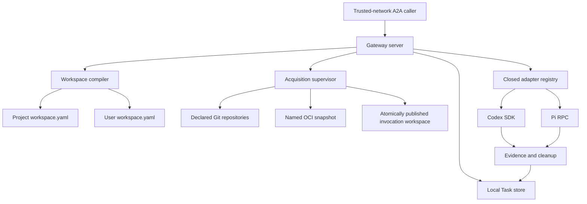

# Coding-Agent Execution Gateway - Plan

## Goal Capsule

- **Objective:** A developer can run one trusted-network A2A endpoint for one
  AllAgents workspace and invoke built-in or explicitly exposed profile targets
  against either the complete configured Git repository set, with optional
  named revision overrides, or a digest-pinned OCI workspace snapshot. AI Evals
  can configure either source mode in Promptfoo YAML through a custom provider
  without sending origins.
- **Means:** Add `allagents gateway serve`, a private execution-service package,
  a bounded durable Task store, direct Codex and Pi adapters, GitHub App and
  GitHub CLI acquisition providers, OCI snapshot acquisition, one supervised
  invocation lifecycle, and a documented Promptfoo provider contract.
- **Authority:** [ADR 0002](../decisions/0002-serve-coding-agent-execution-through-an-a2a-gateway.md)
  owns the public and trust boundaries. Project and user `workspace.yaml` files
  own source and profile declarations. A2A 1.0 owns core wire semantics.
- **Execution order:** Capture a red built-CLI E2E for the missing gateway;
  freeze schemas and configuration projection; implement the Task store, A2A
  server, acquisition, supervisor, Codex, and Pi; run a final implementation
  review and fix important findings; then run the green built-CLI E2E,
  repository gates, and documentation validation.
- **Stop conditions:** Do not add application authentication, `gateway.yaml`,
  `worker.yaml`, remote worker routing, caller-supplied URLs or commands,
  mutable OCI tags, selected-provider failure fallback, evaluation behavior, or
  automatic execution retry.
- **Tail ownership:** The implementing workflow runs focused contract and
  lifecycle tests, provider fixture tests, the repository quality gates, a
  built-CLI trusted-network smoke test, and documentation validation.

---

## Product Contract

### Summary

AllAgents gains a single-workspace coding-execution service without becoming an
evaluation framework or multi-tenant platform. Callers use A2A Tasks and one
required AllAgents extension. Network reachability is authorization. The
service resolves configured targets and sources from existing workspace files,
acquires a fresh invocation workspace, invokes Codex or Pi through a typed
adapter, and retains bounded terminal evidence. AI Evals consumes that boundary
through its own Promptfoo custom provider: evaluation YAML supplies named
revision overrides for the configured repository set, or one snapshot handle
and immutable digests, while AllAgents retains origin and credential authority.

### Problem Frame

AllAgents configures and launches coding clients but has no service boundary for
trusted tools such as AI Evals. Those tools would otherwise import AllAgents
internals, drive interactive CLIs, or duplicate profile resolution, repository
acquisition, credential handling, cancellation, evidence capture, and cleanup.

Developers expect a process they can start in a workspace and expose on
loopback, `0.0.0.0`, a private interface, or Tailscale. They do not need an
application authentication stack, Kubernetes control plane, remote worker
registry, or another profile configuration file for the initial use case.

### Actors

- A1. **Trusted-network caller:** Any process able to reach the endpoint. All
  callers have the same authority and Task visibility. The first caller is an
  AI Evals-owned Promptfoo custom provider that maps one `callApi` to one Task.
- A2. **Execution gateway:** The A2A server and invocation supervisor. It owns
  deployment-wide Task identity, acquisition, routing, status, cancellation,
  evidence, retention, and cleanup.
- A3. **Backend adapter:** The Codex or Pi implementation translating native
  automation events and cancellation into the common contract.
- A4. **Operator/developer:** The person who selects the project workspace,
  exposes profile launchers, supplies process flags and credential handles, and
  controls network access.
- A5. **GitHub/OCI source:** The remote content service used only during the
  acquisition phase.

### Key Decisions

- **Use A2A rather than inventing an invocation API.** Standard Agent Cards,
  Tasks, Artifacts, errors, streaming, and cancellation remain the public
  lifecycle. Governs R1-R3.
- **Treat the network as the trust boundary.** The initial service has no
  application authentication or caller ownership. Explicit `0.0.0.0` binding is
  valid. (session-settled: user-directed.) Governs R4-R5.
- **Reuse workspace configuration.** Project `workspace.yaml` owns sources;
  user `workspace.yaml` owns profiles, launchers, and exposure. There is no
  `gateway.yaml`. (session-settled: user-directed.) Governs R6-R8, R18.
- **Support two acquisition modes.** Direct declared repositories and named,
  digest-pinned OCI workspace snapshots converge on one manifest and evidence
  contract. (session-settled: user-directed.) Governs R9-R11.
- **Use App-first GitHub credential eligibility.** Prefer an applicable GitHub
  App; use a configured `gh` account only when no App installation applies;
  never fall back after selected-App failure. (session-settled: user-directed.)
  Governs R10-R11.
- **Keep a typed backend seam.** Codex SDK and Pi RPC are the complete initial
  backend set. Launcher-backed profiles resolve through those adapters rather
  than executing generated wrapper files. Governs R7-R8, R12-R15.
- **Persist Task truth, not provider sessions.** Restart settles interrupted
  work failed; it never resumes or automatically replays provider execution.
  Governs R5, R13-R16.
- **Keep evaluation outside AllAgents.** Consumers own datasets, repetitions,
  scoring, assertions, and evaluation Runs. Governs R17.
- **Bridge Promptfoo at the consumer boundary.** AI Evals owns a custom provider
  that maps Promptfoo YAML and test variables to the closed A2A source modes and
  maps terminal Tasks back to `ProviderResponse`. AllAgents owns no Promptfoo
  runtime behavior. Governs R19.

### Requirements

**Public protocol**

- R1. Implement A2A 1.0 HTTP+JSON for Agent Card discovery, `SendMessage`,
  `GetTask`, `ListTasks`, `CancelTask`, streaming send, and active Task
  subscription when advertised. The Agent Card declares
  `https://allagents.dev/a2a/extensions/coding-execution/v1` with
  `required: true`. Every operation that creates, returns, lists, subscribes to,
  or mutates profiled Tasks or Artifacts must include
  `A2A-Extensions: https://allagents.dev/a2a/extensions/coding-execution/v1`;
  responses echo the activated URI, and unsupported calls receive A2A
  `ExtensionSupportRequiredError`.
- R2. Generate a strict versioned request schema from Zod and place it only at
  `Message.metadata[extensionUri]`. Strict objects reject every unlisted member.
  V1 uses these wire scalars:
  - `InvocationKey` matches `^[A-Za-z0-9][A-Za-z0-9._:-]{0,127}$`.
  - `ConfigName` and `TargetId` match
    `^[A-Za-z0-9][A-Za-z0-9._-]{0,63}$`.
  - `RevisionText` is NFC UTF-8, 1-255 bytes, with no U+0000-U+001F or U+007F.
  - `Digest` matches `^sha256:[0-9a-f]{64}$`.
  The request object is exactly:
  `version: "1"`; `invocationKey: InvocationKey`; `target: TargetId`; `source`,
  one of `{ kind: "repositories", revisions?: Record<ConfigName,
  RevisionText> }` or `{ kind: "workspaceSnapshot", snapshot: ConfigName,
  digest: Digest, workspaceManifestDigest: Digest }`; optional
  `deadlineSeconds` (integer 1-3600, default 1800); and optional
  `resultSchema: { version: "1", schema: SchemaNode }`.

  A `SchemaNode` is exactly one branch below. `description` is optional NFC
  UTF-8 of at most 1024 bytes. Scalar `enum` arrays contain 1-128 canonically
  distinct values of the node's type; string enum values are at most 4096 UTF-8
  bytes, numbers are finite, integers are JSON safe integers, and null permits
  only `[null]`.
  - null or boolean: `{ type, description?, enum? }`;
  - string: `{ type: "string", description?, enum?, minLength?, maxLength? }`,
    where lengths are integers 0-1,048,576 Unicode scalar values and minimum
    does not exceed maximum;
  - number or integer:
    `{ type, description?, enum?, minimum?, maximum? }`, where number bounds
    are finite, integer bounds are JSON safe integers, and minimum does not
    exceed maximum;
  - array:
    `{ type: "array", description?, items: SchemaNode, minItems?, maxItems? }`,
    where item bounds are integers 0-4096 and minimum does not exceed maximum;
  - object:
    `{ type: "object", description?, properties, required?,
    additionalProperties: false, minProperties?, maxProperties? }`, where
    `properties` is a strict record of 0-256 `ConfigName` keys,
    `required` is a unique subset of those keys, property bounds are integers
    0-256, and minimum does not exceed maximum.
  No pattern dialect exists in v1. References, unions/combinators, conditionals,
  formats, defaults, coercion, non-finite numbers, duplicate canonical enum
  values, and unknown keywords are rejected. The canonical result schema is at
  most 64 KiB, 256 nodes, and 32 levels deep. Repository revision count cannot
  exceed declared repositories. The Message contains exactly one `TextPart`
  whose UTF-8 prompt is 1 byte to 1 MiB; other Part kinds are rejected. Only the
  extension-owned metadata object is strict; unrelated A2A metadata and other
  activated-extension keys are preserved or ignored according to A2A.
  Canonicalization materializes defaults, normalizes extension strings to UTF-8
  NFC, sorts record keys, and hashes RFC 8785 extension JSON plus prompt bytes.
  Do not add `Task.extensions` or backend-specific public fields.
- R3. One valid new request creates one addressable Task. Follow-up messages to
  an existing Task are unsupported. Every terminal Task has exactly one
  integrity Artifact plus zero or more produced Artifacts. The integrity
  Artifact has `artifactId` and `name` equal to
  `allagents.execution-integrity` and one `DataPart` whose strict
  `allagents.execution-integrity/v1` object has the following normative wire
  shape. `SafeUInt` is an integer 0-9,007,199,254,740,991; `ShortText` is valid
  UTF-8 of at most 4096 bytes; `ArtifactId` matches
  `^[A-Za-z0-9][A-Za-z0-9._:-]{0,127}$`; and `MediaType` is a valid RFC 6838
  media type of at most 255 ASCII bytes.
  - `version` is the literal `"1"`; `taskId` is a lowercase canonical UUIDv7;
    and `target` is `TargetId`.
  - `sourceIdentity` is either
    `{ kind: "repositories", repositories }` or
    `{ kind: "workspaceSnapshot", snapshot: ConfigName, digest: Digest,
    workspaceManifestDigest: Digest, repositories }`.
    `repositories` contains 1-64 unique strict entries
    `{ name: ConfigName, requestedRevision?: RevisionText,
    resolvedCommit: string, verification:
    "independentlyVerified" | "snapshotAttested" }`; `resolvedCommit` matches
    `^[0-9a-f]{40}$`. Gateway-generated source identity, workspace-manifest
    fields, evidence metadata, and provider-added metadata never contain Git
    URLs, OCI repository origins, or destination paths. This guarantee does not
    inspect or sanitize opaque caller prompts, provider terminal output, or
    produced-Artifact payloads.
  - optional `workspaceManifestDigest` is `Digest`.
  - `terminalOutput` is `{ text, truncated }`, where `text` is valid UTF-8 of at
    most 1 MiB and `truncated` is boolean.
  - optional `usage` is a strict object with optional `inputTokens`,
    `outputTokens`, `cachedInputTokens`, and `totalTokens` `SafeUInt` fields,
    plus optional `provider` containing 0-64 `ConfigName: SafeUInt` counters.
  - `producedArtifacts` contains 0-128 strict entries
    `{ artifactId: ArtifactId, name?: ShortText, mediaType?: MediaType,
    size: SafeUInt, digest: Digest }`; each references one additional A2A
    Artifact.
  - `evidence` is `{ items, complete, truncated }`, where the booleans have
    their literal JSON meaning and `items` contains 0-256 strict entries
    `{ kind, artifactId?, digest?, summary? }`. `kind` is one of
    `gitState | providerTrace | fileChanges | usage | cancellation |
    termination | cleanup`; `artifactId` and `digest` use the aliases above,
    `summary` is `ShortText`, and at least one of those three optional members
    is present.
  - `termination` is `{ status: "clean" | "failed" | "unknown",
    reason?: ShortText }`; `cleanup` is
    `{ workspace: "removed" | "retained" | "failed", reason?: ShortText }`.
  - optional `failure` is `{ code, message, retryable, cause }`, where `code`
    is one stable code from the error table below, `cause` is one member of the
    closed cause union defined below that table, `message` is `ShortText`, and
    `retryable` is that row's fresh-invocation value.
  - `result` is exactly one of
    `{ status: "valid", value }`,
    `{ status: "invalid", errors }`, or
    `{ status: "notProduced", reason }`. `value` is JSON that validates against
    the requested `SchemaNode`, serializes to at most 1 MiB, and is used only
    when a result schema was requested. `errors` contains 1-64 strict
    `{ path, keyword, message }` entries: `path` is an RFC 6901 JSON Pointer of
    at most 1024 bytes, `keyword` is one of the v1 `SchemaNode` member names,
    and `message` is `ShortText`. `reason` is one of
    `notRequested | providerDidNotReturn | providerFailed | cancelled |
    deadlineExceeded | invalidProviderPayload`.

  Failure, rejection, and cancellation retain every available field without
  implying a valid result. Task records, Artifacts, events, and claims expire
  atomically after the configured TTL; expired keys may create new Tasks. The
  gateway never evicts unexpired Tasks to satisfy the retained-count limit: it
  rejects new admission until expiry frees capacity.

**Trust, identity, and Task storage**

- R4. Do not authenticate application callers. Allow loopback, specific-address,
  and explicit `0.0.0.0` listeners. Every reachable caller may create, list,
  retrieve, subscribe to, cancel, and fetch Artifacts for every Task. Document
  Tailscale ACLs, firewalls, or equivalent network controls as the authorization
  boundary.
- R5. Idempotency and Task visibility are deployment-wide. Atomically and
  durably bind an invocation key to the canonical request, selected target,
  source identity, optional result-schema digest, deadline, and effective
  configuration digest before acknowledging Task creation. Identical replay
  returns the existing Task; a changed request conflicts. The project-specific
  state root persists the canonical workspace identity and holds an exclusive
  process lock. The root and all state files must be current-user owned, use
  `0700`/`0600`-equivalent permissions, be disjoint from project, profile, and
  invocation roots, and be opened descriptor-relatively without following
  symlinks or accepting hard-linked files. Startup verifies those invariants,
  store integrity, and workspace identity; terminalizes interrupted Tasks
  failed; and never resumes provider work. Store open, corruption, write,
  rename, or fsync failure stops admission, aborts and contains active work,
  prevents terminal success, and exits only after quiescence or a validated
  external manager accepts cleanup ownership.

**Workspace and target configuration**

- R6. One gateway process serves one project workspace selected by `--workspace`
  or cwd. Parse its `.allagents/workspace.yaml` through the authoritative project
  schema. Repository names, URLs, destinations, default revisions, workspace
  projection, plugins, and named OCI snapshot repositories come only from that
  declaration.
- R7. Parse `~/.allagents/workspace.yaml` through the authoritative user schema.
  Built-in `codex` and `pi` targets are available when ready. A launcher-bearing
  profile client adds a target only when `gateway.expose: true`. Its public ID is
  the globally collision-checked launcher basename and resolves to exactly one
  `(profile, client)` pair. Built-in IDs are reserved under the same portable
  collision key; colliding exposure is a configuration error. Initially only
  Codex and Pi profile clients are executable.
- R8. A request selects a declared target, may set the bounded
  `deadlineSeconds`, and may provide one bounded result schema. The overall
  deadline covers acquisition, publication, typed preparation, provider
  execution, and evidence collection. Acquisition receives
  `min(900 seconds, remaining overall deadline)`; exceeding that sub-budget
  fails before provider execution. Overall expiry initiates abort and bounded
  forced termination. Cleanup then uses its own fixed bounded budget and the
  R16 fail-closed quiescence rule. A request cannot provide or override backend,
  executable path, command, argv, environment, profile settings, plugins, MCP
  servers, repository URLs, destination paths, credential provider, setup
  behavior, or permission policy. Readiness rejects missing, partial, drifted,
  unsupported, or declaration-missing exposed profiles.

**Workspace acquisition**

- R9. Use exactly one closed source union:
  - `{ kind: "repositories", revisions?: Record<repositoryName, revision> }`; or
  - `{ kind: "workspaceSnapshot", snapshot, digest, workspaceManifestDigest }`.
  Unknown variants, cross-variant fields, undeclared names, mutable snapshot
  references, malformed digests, and destination overrides fail admission.
  Source-mode failure never falls through to the other mode.
- R10. Repository mode materializes every configured repository required by the
  selected project workspace. Caller revisions may override only a declared
  repository's default revision. Canonicalize HTTPS GitHub origins, resolve and
  record full commits before provider execution, use hermetic Git configuration,
  disable redirects and repository-controlled secondary fetch/exec features,
  verify checkout identities, and reject path collisions or escapes.
- R11. Snapshot mode maps `snapshot` to a declared OCI repository and constructs
  `<repository>@<digest>` server-side. Validate registry origin, OCI manifest
  and layer digests, expected workspace-manifest digest, paths, symlinks, file
  types, file/layer counts, individual and total sizes, and manifest
  completeness in staging before atomic publication. Reject external or foreign
  layers and cross-origin credential forwarding. The common workspace manifest
  distinguishes independently verified Git facts from snapshot-attested facts.

**Credential selection and containment**

- R12. Repository requests never carry credentials or select providers. For
  `github.com`, determine configured-App applicability as
  `eligible | ineligible | unknown` through an App-authenticated GitHub API
  client, or verify an explicit installation ID against the repository. For
  `eligible`, mint a fresh repository-scoped, read-only installation token
  through `@octokit/auth-app` and require remaining lifetime greater than the
  R8 acquisition sub-budget plus a 60-second clock-skew margin. Use the
  configured GitHub CLI account only when the App is absent or applicability is
  positively `ineligible`. An `unknown` result or any selected-App
  configuration, authentication, minting, permission, repository, rate-limit,
  or service failure terminates acquisition without `gh` fallback. Run
  `gh auth token --hostname github.com --user <account>` with ambient token
  variables removed. Deliver either token only through an invocation-scoped Git
  credential helper and destroy it before typed preparation or provider
  execution. OCI credentials likewise exist only during snapshot acquisition.

**Execution, evidence, and cleanup**

- R13. Keep one closed `codex | pi` backend registry and one behavior-focused
  interface covering availability, capabilities, invocation, progress,
  deterministic permission handling, abort, terminal output, optional structured
  result, usage, bounded native evidence, and disposal. Profile targets resolve
  adapter-owned configuration directly; never execute generated launchers,
  discover executables as targets from `PATH`, scrape a TUI, or append public
  input to argv.
- R14. Codex uses pinned `@openai/codex-sdk`, one fresh thread per Task,
  `AbortSignal`, streamed events, optional native `outputSchema`, and an
  operator-selected Codex auth-file handle. Pi uses strict RPC, invocation-owned
  configuration, an operator-selected Pi auth-file handle, and one restricted
  policy extension; repository extensions and unrestricted built-ins do not
  auto-load. The gateway copies only the selected adapter's required auth
  material into an invocation-private, read-only control-process view and
  removes it during cleanup.
- R15. Acquire into a private staging root and atomically publish the invocation
  workspace. Run only adapter-owned typed preparation that projects validated
  project/profile settings, plugins, and MCP declarations through existing
  deterministic transforms; never execute project or user `setup` entries or
  other configured shell commands. Enforce distinct process views:
  - the provider control process receives only its invocation workspace,
    minimum non-secret profile configuration, and adapter auth channel;
  - each MCP child receives only its own resolved secret references; and
  - model-invoked shell/tools receive the workspace and no provider or MCP
    credentials.
  All views exclude gateway state, operator home, App keys, GitHub/OCI stores,
  source helpers, unrelated adapter credentials, and the parent environment.
  Fail readiness for a target when its adapter cannot enforce those separations.
  Acquisition credentials and mounts are absent first. Treat the mutated
  workspace as untrusted during evidence collection: use descriptor-relative
  no-follow reads; reject hard links, special/sparse files, path replacement,
  out-of-root targets, and `.git` gitdir/core.worktree/alternates escapes; and
  run Git inspection with hermetic configuration that disables hooks, filters,
  drivers, fsmonitor, pagers, helpers, and external commands.
- R16. Supervise the complete acquisition/provider descendant set inside an
  invocation-owned OS containment primitive whose membership children cannot
  escape. Fail readiness when the platform cannot enforce and inspect that
  boundary. Cancellation persists intent with an atomic state transition before
  native abort, then applies bounded forced termination. A terminal commit that
  wins first makes later cancellation not cancelable; cancellation intent that
  wins settles cancelled after quiescence. Terminal cleanup evidence requires
  proof that the containment set is empty. Failure records termination
  unknown/failed and rejects admission. An unmanaged foreground gateway remains
  alive with poisoned readiness and continues reaping; it prints the stable
  containment identifier and platform recovery command. It may exit with a
  nonempty set only after a validated external manager accepts ownership. Startup
  proves every interrupted set empty before it may quarantine stale roots or
  advertise readiness. Graceful shutdown stops admission atomically, persists
  shutdown/cancellation intent, drains or aborts active work within a bounded
  grace period, proves quiescence, settles once, and only then exits.

**Scope and configuration**

- R17. Do not add evaluation commands, datasets, assertions, scoring,
  repetitions, experiment scheduling, or automatic Task retry.
- R18. Do not add `gateway.yaml` or `worker.yaml`. Process configuration uses
  the exact CLI flags and environment variables in the Configuration Contract
  for listener, workspace, state/retention, GitHub, OCI, and Codex/Pi auth-file
  handles. Secret values never enter workspace files, requests, logs, Tasks,
  Artifacts, retained workspaces, or model-invoked tool environments.
- R19. Document AI Evals consumption through a Promptfoo custom
  JavaScript/TypeScript provider implementing Promptfoo's `ApiProvider`.
  `constructor(options: ProviderOptions)` retains `options.id`, validates
  `options.config`, and `id()` returns the retained ID. Static config contains
  the gateway endpoint, target ID, and exactly one closed source mode:
  repository mode materializes the complete configured repository set and
  carries only an optional revision map keyed by declared repository name;
  snapshot mode carries one declared snapshot name with OCI and workspace-
  manifest digests. `callApi(prompt, context, options)` may apply the exact
  `context.vars.allagentsSource` leaf overrides defined below. Dynamic
  repository revisions must be full lowercase 40-hex commit IDs; dynamic
  snapshot values must be full lowercase `sha256:` digests. Source kind,
  snapshot name, and repository origins never vary per test. Unknown members,
  revision names absent from static config, URLs, destinations, tags,
  credentials, commands, and permission policy fail before submission.
  `options?.abortSignal` and the provider's bounded deadline both invoke A2A
  `CancelTask` after acceptance. One `callApi` creates one A2A Task and maps
  terminal output, usage, Task/Artifact IDs, structured result, and logical
  provenance into `ProviderResponse`; admission or terminal failure maps to
  `error`. AI Evals owns the provider implementation. AllAgents publishes the
  protocol and YAML examples without importing Promptfoo provider code or adding
  Promptfoo as a runtime dependency.

### Key Flows

- F1. **Start and advertise**
  1. Resolve cwd or `--workspace`, user workspace, project-specific state root,
     retention limits, listen address, source credentials, and provider auth
     handles.
  2. Validate state-root ownership, permissions, links, disjointness, and
     workspace identity; acquire the exclusive lock; validate repositories,
     snapshots, target namespace, backend availability, profile state,
     containment, separate provider/MCP/tool views, and credential handles.
  3. Reconcile interrupted Tasks and prove every stale containment set empty
     before quarantining filesystem roots.
  4. Bind the requested address, including `0.0.0.0` when explicit, and publish
     one Agent Card whose required extension and allowlisted targets match the
     validated configuration.

- F2. **Acquire repositories and execute**
  1. Negotiate the required extension and validate the strict request, one text
     prompt, target, repository-name/revision map, result schema, deadline, and
     deployment-wide idempotency claim.
  2. Durably commit the claim and Task before acknowledgment; create the
     invocation containment and staging root.
  3. For each declared repository, classify App applicability, select App or
     `gh` only by eligibility, resolve the revision, fetch hermetically, verify
     the commit, and remove credentials.
  4. Publish the complete workspace, run typed preparation, invoke the isolated
     adapter, validate any structured result, collect evidence through safe
     reads, terminate descendants, clean up, and settle the Task once.

- F3. **Acquire an OCI snapshot and execute**
  1. Resolve the named snapshot repository and digest-pinned reference.
  2. Authenticate if required, pull and verify the OCI manifest and layers,
     extract safely, and validate the workspace-manifest digest.
  3. Remove registry credentials, publish atomically, run typed preparation,
     invoke the isolated adapter, collect safe evidence, clean up, and settle.

- F4. **Cancel**
  1. Atomically persist cancellation intent if the Task remains cancelable.
  2. Abort acquisition or provider work, escalate within the bounded termination
     budget, prove containment quiescence, preserve partial evidence, clean up,
     and settle cancelled.
  3. Repeated cancellation while intent is pending does not re-signal work.
     Cancellation after any terminal state returns A2A
     `TaskNotCancelableError`.

- F5. **Shut down**
  1. Stop new admission before signaling active work.
  2. Persist shutdown cancellation intent, abort and escalate, drain evidence,
     prove quiescence, and settle the accepted Task once.
  3. Exit only after durable settlement and empty containment. If proof fails,
     unmanaged mode remains alive, not ready, and continues reaping while
     printing the platform recovery command. Managed mode may exit only after
     its validated external manager accepts containment ownership.

- F6. **Invoke from Promptfoo**
  1. Promptfoo constructs the AI Evals-owned TypeScript provider with
     `ProviderOptions`; the provider retains the ID and validates
     `options.config` containing the private-network endpoint, target, and one
     closed source-mode object.
  2. `callApi(prompt, context, options)` applies only valid
     `context.vars.allagentsSource` leaf overrides, creates one invocation key,
     and sends one A2A Message with the prompt and required extension.
  3. The provider waits or streams until terminal. Its deadline or
     `options?.abortSignal` sends `CancelTask` once after acceptance and waits
     for the same terminal cleanup path.
  4. It returns terminal text or validated structured output in
     `ProviderResponse.output`; maps `inputTokens -> prompt`,
     `outputTokens -> completion`, `cachedInputTokens -> cached`, and
     `totalTokens -> total`; and puts other usage plus Task, Artifact, logical
     source, termination, and cleanup facts in `metadata`. Admission or terminal
     execution failure returns `error`.

### Acceptance Examples

- AE1. A caller on a permitted Tailscale or firewalled network discovers the
  gateway bound to `0.0.0.0`, selects `codex-review`, and receives one durable
  Task without presenting an application credential.
- AE2. Any reachable caller can list, retrieve, cancel, and fetch Artifacts for
  a Task created by another reachable caller; documentation states this shared
  trust model without implying tenant privacy.
- AE3. A launcher-bearing Codex profile without `gateway.expose: true` is absent
  from discovery and rejected when selected. An exposed but drifted profile
  fails readiness/new admission.
- AE4. A multi-client profile exposes `codex-review` and `pi-review` as distinct
  targets. Both resolve through adapters; neither generated wrapper is executed.
- AE5. Repository mode accepts declared names and revision overrides, rejects an
  undeclared name or URL override, and records the resolved full commits.
- AE6. An applicable GitHub App mints a fresh repository-scoped token whose
  lifetime exceeds the acquisition sub-budget plus skew. A repository with no
  applicable installation uses the configured `gh` account. Unknown App
  applicability, auth, or mint failure does not fall through to `gh`.
- AE7. Snapshot mode accepts a declared snapshot name and matching OCI/workspace
  digests, rejects mutable tags, traversal, foreign layers, digest mismatch, or
  undeclared registry repositories, and publishes only after full validation.
- AE8. Repository and snapshot modes produce the same workspace-manifest shape,
  while OCI-contained commit identities remain marked snapshot-attested unless
  independently verified.
- AE9. Identical invocation-key replay returns the original Task. Reusing the key
  with a changed target, source, prompt, or result schema conflicts.
- AE10. Cancellation during Git, OCI pull, Codex, or Pi terminates the complete
  process set and records cleanup. Unproved quiescence poisons readiness; an
  unmanaged foreground process stays alive and reaps, while managed exit
  requires accepted external cleanup ownership.
- AE11. Restart turns interrupted Tasks into one terminal failure and never
  resumes a provider session. Terminal Tasks and Artifacts remain retrievable
  until expiry.
- AE12. A valid structured result survives later check or evidence failure as a
  valid result with an overall failed Task; invalid or absent results are never
  published as valid.
- AE13. An exposed launcher named `codex`, `pi`, or a portable case-equivalent
  fails configuration compilation instead of shadowing a built-in target.
- AE14. Two gateways for different workspaces use distinct private state roots;
  a second process for the same root fails the exclusive lock. Wrong-owner,
  permissive, linked, hard-linked, or overlapping roots fail startup. Store
  fault injection cannot acknowledge an uncommitted Task or false success.
- AE15. Deadline expiry during Git, OCI, preparation, Codex, Pi, or evidence
  initiates one abort/termination path and retains truthful partial evidence.
- AE16. Repeated cancel while cancellation is pending is idempotent; cancel
  after cancelled, completed, failed, or rejected returns
  `TaskNotCancelableError`.
- AE17. A workspace containing `setup` shell entries never executes them through
  gateway acquisition or startup. Built-in Codex/Pi authenticate through their
  selected private control-process auth views; model-invoked tools cannot read
  provider or MCP secrets, operator stores, or gateway state.
- AE18. Evidence collection rejects a provider-created escaping link, hard link,
  special file, sparse-file abuse, or `.git` indirection and runs Git inspection
  without repository-controlled execution hooks.
- AE19. The 1001st unexpired retained Task is rejected with
  `retention_capacity_exhausted`; no retained Task is evicted before TTL.
- AE20. Unrelated Message metadata survives request processing. Every profiled
  A2A operation requires activation, and a terminal Task may contain the single
  integrity Artifact plus referenced produced Artifacts.
- AE21. The AI Evals Promptfoo provider loads one repository-mode and one
  snapshot-mode YAML instance. Repository mode materializes the complete
  configured set and sends only optional revision overrides keyed by declared
  name; snapshot mode sends one declared name and immutable digests. Neither
  request source metadata nor response source-identity metadata contains a Git
  URL, OCI repository, or destination.
  Both calls return scorable `ProviderResponse.output`, the exact normalized
  token mapping, and Task/Artifact/logical-provenance metadata. Per-test
  repository overrides accept only full commits. An unknown variable member,
  mutable revision, origin, destination, or undeclared name fails before
  submission.

### Success Criteria

- `allagents gateway serve` starts from a real workspace with no deployment YAML.
- Explicit loopback, private-interface, and `0.0.0.0` listeners work.
- The official A2A client exercises required-extension negotiation, send,
  stream, get, list, subscribe, replay, cancel, terminal cancel errors, Artifact
  retrieval, and expiry.
- An AI Evals-style Promptfoo custom-provider fixture consumes representative
  YAML for both source modes and maps a terminal Task to `ProviderResponse`
  without adding Promptfoo to the AllAgents runtime.
- Built-in Codex/Pi and exposed profile targets pass one conformance suite,
  including reserved-ID collisions.
- Direct Git and OCI snapshot fixtures produce equivalent validated workspace
  manifests and truthful provenance.
- GitHub App eligibility, unknown failure, no-installation `gh` fallback,
  selected-App failure, token lifetime, containment, and OCI credential cleanup
  are proven end to end.
- No request can supply a command, executable, URL, destination, credential,
  mutable OCI tag, backend override, or arbitrary environment value.
- State-store fault, deadline, cancellation-race, shutdown, descendant escape,
  unsafe evidence, and stale-root scenarios fail closed.
- The built CLI passes a trusted-network smoke test against project and user
  workspaces created under `/tmp/`.

### Scope Boundaries

**In scope**

- A2A 1.0 HTTP+JSON and the required AllAgents extension.
- One process and one active invocation at a time initially.
- Built-in and exposed profile-backed Codex/Pi targets.
- Direct declared Git repositories and named OCI workspace snapshots.
- GitHub App and configured GitHub CLI acquisition credentials.
- Local durable Task/evidence storage, cancellation, cleanup, and provenance.
- Listen addresses including `0.0.0.0`.

**Out of scope**

- Application authentication, tenant isolation, caller-private Tasks, and public
  Internet hardening.
- `gateway.yaml`, `worker.yaml`, remote workers, mTLS worker links, Kubernetes
  routing, autoscaling, and multiple gateway replicas.
- Caller-provided repository or registry origins, mutable OCI tags, custom
  materializers, Dockerfiles, Compose files, or acquisition commands.
- GitHub Enterprise Server and multiple ordered Apps/accounts in the initial
  delivery.
- OpenCode, Claude, Copilot, OMP, arbitrary CLI, and TUI adapters.
- Evaluation orchestration and automatic retries.

### Sources

- [ADR 0002](../decisions/0002-serve-coding-agent-execution-through-an-a2a-gateway.md)
- [AHP decision inputs](../research/agent-host-protocol-decision-inputs.md)
- [Harbor repository materialization lessons](../research/harbor-repository-materialization.md)
- [Source credential broker precedents](../research/source-credential-broker-precedents.md)
- [A2A 1.0 specification](https://a2a-protocol.org/latest/specification/)
- [OpenAI Codex SDK](https://developers.openai.com/codex/sdk/)
- [OpenAI Codex app-server](https://developers.openai.com/codex/app-server/)
- [GitHub App installation tokens](https://docs.github.com/en/apps/creating-github-apps/authenticating-with-a-github-app/generating-an-installation-access-token-for-a-github-app)
- [Git credential helpers](https://git-scm.com/docs/gitcredentials)
- [OCI Image Specification](https://github.com/opencontainers/image-spec)

---

## Planning Contract

### Key Technical Decisions

- KTD1. **Use the official A2A JavaScript SDK behind a small AllAgents request
  decorator.** The decorator validates the required extension and canonical
  request, resolves the deployment-wide retained claim, performs new-admission
  checks, and preserves standard Task/Artifact carriers.
- KTD2. **Generate public, Task-store, workspace-manifest, and adapter contracts
  from canonical Zod schemas.** Keep the result-schema subset shared across
  Codex and Pi and forbid backend-specific public fields.
- KTD3. **Use a single-process supervisor, not a remote worker protocol.** One
  service owns Task state, staging, publication, backend child processes,
  evidence, termination, and cleanup. Child processes remain contained behind
  an invocation lifecycle boundary.
- KTD4. **Make application authentication intentionally absent.** All Tasks and
  Artifacts share one deployment namespace. The listener accepts explicit
  `0.0.0.0`; network controls are external. (session-settled: user-directed.)
- KTD5. **Compile configuration from existing workspace files.** Add
  `workspaceSnapshots` to the project schema and `gateway.expose` to strict
  profile-client schemas. Resolve the public launcher ID to one profile/client.
  Add no deployment YAML. (session-settled: user-directed.)
- KTD6. **Keep source input name-based and closed.** Repository requests carry
  only declared-name revisions; snapshot requests carry only a declared snapshot
  name and immutable digests. Compute one canonical source identity for
  idempotency and provenance.
- KTD7. **Use direct acquisition implementations.** Git runs with hermetic config
  and an invocation credential helper. OCI pulls through a library or fixed
  non-shell client interface that validates registry redirects and digests and
  extracts without trusting archive paths.
- KTD8. **Select GitHub credentials by three-way eligibility.** Discover
  repository coverage with an App-authenticated GitHub API client or verify an
  explicit installation ID. Only positive `ineligible` permits the configured
  `gh` account; `unknown` and selected-provider failure are terminal.
  (session-settled: user-directed.)
- KTD9. **Keep one behavior-focused `codex | pi` adapter registry.** Direct
  targets and exposed profile targets resolve to the same adapter types and
  conformance tests; profile context modifies server-owned configuration, never
  the public command line. Provider control, each MCP child, and model-invoked
  tools receive separate secret scopes and filesystem/environment views.
- KTD10. **Store one immutable terminal Task generation.** A private,
  project-specific locked local store supports one process, durable atomic
  idempotency claim plus Task creation, monotonic status, bounded
  events/Artifacts, no eviction before TTL, atomic expiry, and startup
  terminalization. State paths are ownership/mode/link/disjointness checked.
  Integrity or durability failure stops admission and prevents false success.
- KTD11. **Use enforceable invocation containment.** The platform implementation
  owns a non-escapable descendant set, drains stdout/stderr, and covers
  credential helpers, Git/OCI, MCP, and provider processes. Failure to inspect
  or prove an empty set fails or poisons readiness. An unmanaged gateway remains
  alive to reap and expose recovery instructions; managed exit requires an
  external manager that already accepted containment ownership.
- KTD12. **Keep durable evidence separate and collect it defensively.** Evidence
  retains bounded source, Git, provider, result, artifact, and cleanup facts.
  Post-execution workspace reads are descriptor-relative and no-follow; Git
  metadata indirections and repository-controlled execution are rejected.
  Structured logs remain metadata-only and never retain secrets or unrestricted
  request/output/file bodies.

### High-Level Technical Design



### Configuration Contract

No `gateway.yaml` or `worker.yaml` is introduced.

**CLI flags and environment**

| Concern | CLI | Environment | Default |
|---|---|---|---|
| Listener | `--listen` | `ALLAGENTS_GATEWAY_LISTEN` | `127.0.0.1:4732` |
| Project workspace | `--workspace` | `ALLAGENTS_GATEWAY_WORKSPACE` | cwd |
| State directory | `--state-dir` | `ALLAGENTS_GATEWAY_STATE_DIR` | `~/.allagents/gateway/<workspace-id>` |
| Terminal Task TTL | `--task-ttl` | `ALLAGENTS_GATEWAY_TASK_TTL` | `24h` |
| Retained Task limit | `--max-retained-tasks` | `ALLAGENTS_GATEWAY_MAX_RETAINED_TASKS` | `1000` |
| Per-Task retained bytes | `--max-task-bytes` | `ALLAGENTS_GATEWAY_MAX_TASK_BYTES` | `64MiB` |
| GitHub App ID | `--github-app-id` | `ALLAGENTS_GITHUB_APP_ID` | unset |
| App private key file | `--github-app-private-key-file` | `ALLAGENTS_GITHUB_APP_PRIVATE_KEY_FILE` | unset |
| App installation ID | `--github-app-installation-id` | `ALLAGENTS_GITHUB_APP_INSTALLATION_ID` | discovered/unset |
| GitHub CLI account | `--github-cli-account` | `ALLAGENTS_GITHUB_CLI_ACCOUNT` | unset |
| OCI auth file | `--oci-auth-file` | `ALLAGENTS_OCI_AUTH_FILE` | unset |
| OCI credential helper | `--oci-credential-helper` | `ALLAGENTS_OCI_CREDENTIAL_HELPER` | unset |
| Codex auth file | `--codex-auth-file` | `ALLAGENTS_CODEX_AUTH_FILE` | supported Codex default if safe |
| Pi auth file | `--pi-auth-file` | `ALLAGENTS_PI_AUTH_FILE` | supported Pi default if safe |

Precedence is CLI over environment over default. Credential options name file
handles, accounts, or IDs, never secret values. Auth files must be regular,
current-user/root-owned, non-hard-linked, and no broader than `0600`. Setting
both OCI options is a startup error. The OCI helper value is one absolute
executable path with no arguments; it must be current-user/root-owned and not
group/world-writable. The gateway implements Docker credential-helper `get`
directly, without a shell: argv is exactly `[helperPath, "get"]`; stdin is the
canonical registry origin `https://<lowercase-host>[:nondefault-port]` plus one
newline; and an exit-zero stdout must be one UTF-8 JSON object with exactly
nonempty string fields `Username` and `Secret`, each at most 64 KiB. Stdout over
128 KiB, a timeout, nonzero exit, signal, malformed UTF-8/JSON, an unknown
member, or an empty credential fails acquisition with
`source_auth_oci_failed`; stderr is bounded, treated as secret-bearing, and not
placed in logs or evidence. The helper is invoked once per registry origin and
its credential is scoped to that origin and destroyed after acquisition.
Provider defaults are eligible only when their resolved auth files pass the
same checks; otherwise the target is not ready. The gateway projects only the
selected provider auth into its control-process view.

The derived workspace ID is a stable digest of the canonical project-workspace
path and is verified against store metadata. Retention includes Task records,
Artifacts, events, and invocation-key claims; expiry is atomic. When the
unexpired Task-count limit is reached, new admission fails rather than evicting
retained Tasks.

**Project workspace additions**

```yaml
repositories:
  - name: allagents
    source: https://github.com/EntityProcess/allagents.git
    path: allagents
    branch: main

workspaceSnapshots:
  evaluation:
    repository: ghcr.io/entityprocess/allagents-workspaces
```

Snapshot names use the portable profile-name vocabulary. Repositories must have
unique stable names for remote acquisition. Snapshot repository values contain
only scheme/host/repository identity and never tags, digests, credentials, or
extraction paths.

**User workspace additions**

```yaml
profiles:
  review:
    clients:
      - name: codex
        launcher: codex-review
        gateway:
          expose: true
```

The nested object is strict and initially contains only `expose: true`. Absence
means not exposed. Exposure requires a launcher, an initial supported backend,
and a healthy installed profile with matching declaration digest.

**Promptfoo custom-provider consumption**

AI Evals implements Promptfoo's
[`ApiProvider`](https://www.promptfoo.dev/docs/providers/custom-api/) in
TypeScript. Its `constructor(options: ProviderOptions)` stores
`options.id ?? "allagents-a2a"` and validates `options.config`; `id()` returns
that stored value. Its
`callApi(prompt, context, options)` uses `context.vars` for test data and
`options?.abortSignal` for request cancellation.

Static YAML defines the source mode and every logical name:

```yaml
providers:
  - id: file://./providers/allagents-a2a.ts
    label: codex-direct
    config:
      endpoint: http://allagents-gateway.tailnet:4732
      target: codex
      source:
        kind: repositories
        revisions:
          allagents: 0123456789abcdef0123456789abcdef01234567

  - id: file://./providers/allagents-a2a.ts
    label: codex-evaluation-snapshot
    config:
      endpoint: http://allagents-gateway.tailnet:4732
      target: codex
      source:
        kind: workspaceSnapshot
        snapshot: evaluation
        digest: sha256:0123456789abcdef0123456789abcdef0123456789abcdef0123456789abcdef
        workspaceManifestDigest: sha256:abcdef0123456789abcdef0123456789abcdef0123456789abcdef0123456789

tests:
  - description: direct repositories at an exact commit
    providers: [codex-direct]
    vars:
      allagentsSource:
        revisions:
          allagents: fedcba9876543210fedcba9876543210fedcba98

  - description: immutable prebuilt workspace
    providers: [codex-evaluation-snapshot]
    vars:
      allagentsSource:
        digest: sha256:fedcba9876543210fedcba9876543210fedcba9876543210fedcba9876543210
        workspaceManifestDigest: sha256:6789abcdef0123456789abcdef0123456789abcdef0123456789abcdef012345
```

`allagents` is a declared repository name used only as a revision-override key;
repository mode still materializes the complete configured set. `evaluation` is
the logical snapshot handle. The provider sends the source mode, optional named
revisions, and immutable digests, not
`https://github.com/EntityProcess/allagents.git` or
`ghcr.io/entityprocess/allagents-workspaces`. The gateway resolves origins and
credentials server-side and omits them from A2A source-identity responses.

`context.vars.allagentsSource` is the only per-test override. In repository mode
it may contain exactly `revisions`, whose keys must already exist in static
`config.source.revisions` and whose values are full lowercase 40-hex commits.
In snapshot mode it may contain exactly `digest` and/or
`workspaceManifestDigest`, both full lowercase `sha256:` digests. Present leaves
replace static leaves; absent leaves retain static values. Source kind,
repository-name allowlist, and snapshot name remain static. Unknown members,
mutable revisions, origins, destinations, credentials, and commands fail before
A2A submission.

Each `callApi` creates one invocation key and A2A Task. The provider sends
`CancelTask` when its bounded deadline or `options?.abortSignal` fires after
acceptance. It returns terminal text or the validated structured result as
`ProviderResponse.output`. It maps gateway usage exactly as
`inputTokens -> tokenUsage.prompt`, `outputTokens -> tokenUsage.completion`,
`cachedInputTokens -> tokenUsage.cached`, and
`totalTokens -> tokenUsage.total`; provider-specific counters stay in
`metadata`. Task ID, Artifact references, logical source identity, termination,
and cleanup evidence also remain in `metadata`, without origins or destination
paths. Admission and terminal failures use `ProviderResponse.error`. This
provider is AI Evals code; AllAgents has no Promptfoo runtime dependency.

### Error and Status Mapping

| Condition | Stable code and A2A outcome | Fresh-invocation retryable |
|---|---|---|
| Missing required extension | A2A `ExtensionSupportRequiredError`; no Task | No |
| Malformed request, source, digest, schema, prompt, or unknown target/source | `invalid_execution_request` in A2A `InvalidParamsError.data`; no Task | No |
| Invocation-key conflict | `invocation_key_conflict` in A2A `InvalidParamsError.data`; no new Task | No |
| Identical retained invocation replay | Existing Task and Artifacts | N/A |
| Cancel after terminal state | A2A `TaskNotCancelableError` | No |
| Retained Task capacity exhausted | `retention_capacity_exhausted` in A2A `InternalError.data`; no Task | Yes, after expiry |
| Runtime capacity unavailable after acceptance | `execution_capacity_unavailable`; failed Task | Yes |
| App absent/ineligible and configured `gh` succeeds | Continue with recorded provider class | N/A |
| App applicability unknown | `source_auth_applicability_unknown`; failed Task; no fallback | Yes for rate-limit/service causes only |
| Selected App config/auth/mint failure | `source_auth_failed`; failed Task; no fallback | No |
| Selected App permission/repository denial | `source_auth_denied`; failed Task; no fallback | No |
| Selected App rate limit | `source_auth_rate_limited`; failed Task; no fallback | Yes |
| Selected App service failure | `source_auth_unavailable`; failed Task; no fallback | Yes |
| `gh` account missing or token resolution fails | `source_auth_unavailable`; failed Task | No |
| Git revision/identity failure | `source_git_identity_invalid`; failed Task | No |
| Git transport failure | `source_git_unavailable`; failed Task | Yes |
| OCI helper timeout, process, protocol, or credential failure | `source_auth_oci_failed`; failed Task; no fallback | No |
| OCI auth/digest/manifest/extraction validation failure | `source_snapshot_invalid`; failed Task; no Git fallback | No |
| OCI registry service failure | `source_snapshot_unavailable`; failed Task; no Git fallback | Yes |
| Deadline expires | `execution_deadline_exceeded`; abort/terminate; failed Task | Yes |
| Known provider permission denial | `execution_permission_denied`; rejected Task | No |
| Unknown provider protocol or result shape | `provider_protocol_invalid`; failed Task | No |
| Cancellation with proven quiescence | `execution_cancelled`; cancelled Task | No |
| Termination or cleanup cannot be proven | `execution_quiescence_unknown`; failed Task; readiness poisoned | No |
| State store durability/integrity failure | `task_store_failed`; stop admission; abort/contain; no success | No |
| Restart finds interrupted Task | `gateway_restarted`; failed Task; no provider resume | Yes as a new invocation |
| Retention expiry | A2A `TaskNotFoundError` | Yes as a new invocation |

Accepted-Task failures use the integrity Artifact's strict `failure` object with
`code`, safe `message`, table-defined `retryable`, and one closed cause from
`validation | capacity | sourceAuth | sourceGit | sourceSnapshot | deadline |
permission | providerProtocol | cancellation | termination | stateStore |
restart`. Admission failures use the exact A2A error type in the table with the
same stable code and retryability in safe `data`. Retryability describes whether
a caller may create a fresh invocation; it never enables automatic Task retry
or fallback. Provider identifiers, credentials, paths, and raw upstream
messages never enter either carrier.

### Phased Delivery

1. Build the current CLI and record the red E2E showing that
   `allagents gateway serve` is unavailable. Record the exact `/tmp/` workspace
   setup, command, and observed failure.
2. Freeze workspace additions, public extension, common manifests, result
   schema, errors, and fixtures.
3. Build the deployment-wide Task store and unauthenticated A2A server against
   a fake adapter.
4. Add repository and OCI acquisition with credential containment and manifest
   validation.
5. Add the invocation supervisor, execution containment, safe evidence, and
   shared backend contract.
6. Add Codex, then Pi, against the same conformance suite.
7. Run final implementation review and fix important correctness, security,
   contract, reliability, DRY, and coverage findings.
8. Run the green built-CLI `/tmp/` E2E, repository quality gates, user
   documentation, and release evidence.

### System-Wide Impact

- **Package surface:** Add a private execution-service package and the public
  `allagents gateway serve` command. Preserve existing profile and sync commands.
- **Schema surface:** Extend project workspace schemas with named snapshots and
  user profile-client schemas with explicit exposure. Regenerate versioned JSON
  Schemas and update configuration docs.
- **Dependency surface:** Add the official A2A SDK, pinned Codex SDK,
  `@octokit/auth-app`, and a focused OCI client/extraction implementation to the
  private execution package.
- **State surface:** Add a bounded gateway state root and per-invocation staging,
  publication, evidence, and cleanup roots. Do not alter existing profile state.
- **Security surface:** The network is the authorization boundary. Source
  credentials are phase-scoped; acquired code and agent tools never receive App,
  `gh`, or OCI credentials.
- **Compatibility:** Existing workspace files remain valid because new fields are
  optional. Older binaries reject the new strict nested profile field, so docs
  must state the minimum supporting version.

### Risks and Mitigations

- **Accidental network exposure:** Binding `0.0.0.0` is intentional and allowed;
  startup output and docs state that every reachable host has full authority.
- **Profile identity drift:** Derive targets only from current validated user
  declarations and matching installed state; never resurrect declaration-missing
  launchers from retained profile state.
- **Credential leakage:** Use fresh App tokens or one configured `gh` account,
  invocation-only helpers, hermetic Git, and credential teardown before
  publication. Separate provider-control, per-MCP, and model-tool views prevent
  one secret scope from reading another.
- **Identity-changing fallback:** Classify App applicability as eligible,
  ineligible, or unknown; only positive ineligibility permits `gh`.
- **OCI archive abuse:** Require immutable digests, configured repositories,
  bounded extraction, path/type/link validation, and manifest verification.
- **Untrusted acquired code:** General hostile-code sandboxing is not claimed,
  but model-invoked tools cannot reach provider/MCP/operator credentials or
  gateway state. Project/user setup shell commands are never automatic.
- **Evidence-time attacks:** Treat the mutated workspace as untrusted, use
  descriptor-relative no-follow reads, reject Git metadata indirection, and
  disable repository-controlled Git execution features.
- **Provider/API churn:** Pin compatible SDK/CLI versions and retain versioned
  native fixtures plus one adapter conformance suite.
- **Orphaned processes:** Require a platform containment primitive whose
  descendants cannot escape; fail readiness when unavailable. On uncertain
  quiescence, unmanaged mode stays alive to reap and managed mode exits only
  after cleanup ownership transfer.
- **Store corruption or disclosure:** Validate ownership, modes, links, root
  disjointness, lock, and workspace identity. Integrity/durability failure stops
  admission and prevents terminal success.

### Assumptions

- The initial deployment is one gateway process and one active invocation.
- Every network peer able to connect is trusted with all exposed targets and
  retained Tasks.
- The selected project workspace is operator-controlled and uses supported
  repository/snapshot declarations.
- GitHub.com is the only authenticated Git host in the initial delivery.
- OCI snapshots use registries reachable through HTTPS and immutable manifests.
- Codex and Pi automation surfaces remain compatible with the pinned versions.
- Supported platforms provide a non-escapable invocation containment strategy;
  the gateway fails readiness where that invariant cannot be met.

---

## Implementation Units

### U1. Workspace, extension, and manifest contracts

- **Goal:** Freeze configuration additions and all versioned public/private data
  contracts before runtime implementation.
- **Requirements:** R1, R2, R3, R6, R7, R8, R9, R18; AE3, AE4, AE5, AE7,
  AE8, AE9, AE13, AE16, AE20; KTD1, KTD2, KTD5, KTD6.
- **Files:** `src/models/workspace-config.ts`, schema generation tests and
  generated public schemas, `packages/execution-service/src/contracts/*`,
  `packages/execution-service/tests/unit/contracts/*`, configuration docs.
- **Approach:** Add strict named `workspaceSnapshots` and nested profile-client
  `gateway.expose`; preserve project/user scope and reserve built-in IDs. Define
  activation on every profiled operation, the extension-owned request envelope,
  other-metadata behavior, exact result-schema grammar, source union, deadline,
  integrity and produced Artifacts, stable failures, workspace manifest, and
  canonical digest preimages from Zod.
- **Execution note:** Start with fixtures that reject missing activation, cross-
  variant/unknown extension fields, extra Message Parts, undeclared names,
  mutable snapshot references, malformed digests, invalid deadlines, exposure
  without launcher, built-in collisions, and unsupported clients while
  preserving unrelated metadata.
- **Verification:** Focused workspace-schema and contract tests; generated schema
  drift check; representative YAML and wire examples parse through runtime
  schemas; canonicalization and Artifact-cardinality fixtures pass.

### U2. Deployment-wide Task store and A2A server

- **Goal:** Serve the A2A lifecycle without application authentication and keep
  durable deployment-wide Task/idempotency truth.
- **Requirements:** R1, R2, R3, R4, R5, R8, R16, R17, R18; AE1, AE2, AE9,
  AE11, AE14, AE15, AE16, AE19, AE20; KTD1, KTD2, KTD3, KTD4, KTD10.
- **Files:** execution-service Task repository, Agent Card, request handler,
  server, pagination/retention, CLI gateway command, and focused tests.
- **Approach:** Implement flags/env precedence, private link-safe project state
  and lock, loopback default, explicit `0.0.0.0`, startup integrity/
  reconciliation, per-operation extension negotiation, durable atomic
  claim+Task creation, monotonic terminal settlement, bounded events/Artifacts,
  no early eviction, atomic expiry, global listing/cancellation, deadline
  handling, and fail-closed graceful shutdown.
- **Execution note:** Prove with the official A2A client that one caller can read
  and cancel another caller's Task; this is expected behavior. Fault-inject
  unsafe state paths plus open/write/rename/fsync boundaries before
  acknowledgment, cancellation intent, Artifact, and terminal settlement.
- **Verification:** A2A discovery/send/stream/get/list/subscribe/cancel/replay/
  expiry integration tests on loopback and `0.0.0.0`; state-path, retained-
  capacity, store-fault, competing-lock, deadline, shutdown, and restart tests.

### U3. Git and OCI workspace acquisition

- **Goal:** Materialize declared repository sets and named OCI snapshots into the
  same validated invocation workspace contract.
- **Requirements:** R6, R9, R10, R11, R12, R15, R16, R18; AE5, AE6, AE7,
  AE8, AE10, AE15, AE17, AE18; KTD6, KTD7, KTD8, KTD11.
- **Files:** acquisition coordinator, Git transport, GitHub provider selection,
  OCI client/extractor, workspace-manifest validator, staging/publication helper,
  fixtures and tests.
- **Approach:** Resolve name-based source requests from project workspace.
  Implement hermetic Git and full-commit verification. Classify App
  applicability as eligible/ineligible/unknown, mint a fresh token with adequate
  lifetime, permit `gh` only for positive ineligibility, and use temporary
  credential helpers. Pull digest-pinned OCI manifests from declared
  repositories, validate every layer and extraction boundary, validate the
  expected workspace-manifest digest, and publish atomically. Tear down every
  acquisition credential before typed preparation.
- **Execution note:** Use local Git remotes and a local OCI test registry/fixture;
  prove unknown/selected-App failures do not call `gh`, token lifetime is
  enforced, and snapshot failures never invoke Git fallback.
- **Verification:** Focused three-way provider-selection tests, Git integration
  tests including branch/tag resolution, OCI digest/path/limit tests, credential
  leak scans, and equivalent manifest output across both acquisition modes.

### U4. Invocation supervisor and backend contract

- **Goal:** Run one invocation through acquisition, adapter execution, evidence,
  cancellation, descendant termination, and cleanup with truthful terminal
  outcomes.
- **Requirements:** R3, R5, R8, R13, R14, R15, R16; AE9, AE10, AE11, AE12,
  AE14, AE15, AE16, AE17, AE18; KTD3, KTD9, KTD10, KTD11, KTD12.
- **Files:** backend interface/registry, typed preparation, provider/MCP/tool
  secret-view compiler, invocation state machine, platform containment, evidence
  collector, result validator, cleanup/reaper, fake adapter, and lifecycle tests.
- **Approach:** Resolve targets to typed adapter context; never use generated
  launchers or workspace setup commands. Project validated configuration through
  deterministic transforms. Give provider control, each MCP child, and model
  tools separate minimal views; enforce deadlines; track the non-escapable
  containment set; preserve result states; collect evidence through safe reads;
  and require quiescence before cleanup success. Startup reconciles Tasks and
  containment before roots. Unmanaged poisoned mode continues reaping; managed
  exit proves cleanup ownership transfer.
- **Execution note:** Build the fake adapter first and fault-inject every
  boundary: cancellation/terminal races, deadline, shutdown, child escape,
  cross-scope provider/MCP/tool secret reads, unsafe state reads, output
  truncation, malicious evidence, valid-result-then-evidence-failure, unknown
  cleanup, and manager handoff.
- **Verification:** Deterministic lifecycle, containment, separate-secret-view,
  preparation, and evidence tests plus one real child-process smoke fixture per
  supported platform strategy.

### U5. Codex backend adapter

- **Goal:** Run built-in and profile-backed Codex targets through the supported
  SDK while preserving structured progress, result, usage, cancellation, and
  native evidence.
- **Requirements:** R7, R8, R13, R14, R15, R16; AE1, AE3, AE4, AE10, AE12,
  AE15, AE17, AE18; KTD9, KTD11, KTD12.
- **Files:** Codex adapter, profile-context and auth bridge, fixtures,
  conformance and optional credentialed smoke tests.
- **Approach:** Pin the SDK; create one fresh thread per Task; pass cwd, typed
  profile configuration, abort signal, optional output schema, and the private
  Codex control-process auth view inside containment. Keep Codex-invoked tools
  outside that auth view; normalize events/usage; bound evidence; dispose fully.
- **Execution note:** Characterize the pinned SDK and its tool-sandbox/auth
  separation with captured fixtures before implementing normalization. Do not
  import Promptfoo provider code.
- **Verification:** Shared adapter conformance, deadline, auth-isolation, and
  tool-secret-denial fixtures plus an opt-in credentialed smoke case.

### U6. Pi backend adapter

- **Goal:** Run built-in and profile-backed Pi targets through strict RPC with the
  same public lifecycle and honest capability reporting.
- **Requirements:** R7, R8, R13, R14, R15, R16; AE3, AE4, AE10, AE12, AE15,
  AE17, AE18; KTD9, KTD11, KTD12.
- **Files:** Pi adapter, RPC parser, restricted policy extension, profile-context
  and auth bridge, fixtures, conformance and optional credentialed smoke tests.
- **Approach:** Launch Pi with typed invocation configuration, its private
  control-process auth view, strict JSONL RPC, explicit allowed tools/extensions,
  per-MCP secret views, deterministic permissions, event validation, deadline/
  cancellation escalation, and settled completion. Pi-invoked tools receive no
  provider or MCP credentials. Repository extensions and unrestricted built-ins
  remain disabled.
- **Execution note:** Reuse the adapter contract exactly; record Pi-specific facts
  as bounded native evidence rather than public schema branches.
- **Verification:** Shared adapter conformance, malformed/unknown RPC, deadline,
  auth/MCP/tool-secret denial, and an opt-in credentialed smoke case.

### U7. End-to-end delivery and documentation

- **Goal:** Prove the built CLI and document the trusted-network operating model,
  workspace configuration, credentials, sources, Promptfoo consumption, and
  risks.
- **Requirements:** R1-R19; F1-F6; AE1-AE21.
- **Files:** gateway guide/reference, configuration reference, README, CHANGELOG,
  real example project/user workspaces, AI Evals-style Promptfoo YAML and custom-
  provider contract fixture, E2E fixtures, release evidence.
- **Approach:** After the final implementation review is resolved, build the CLI;
  create project and user workspaces under `/tmp/`; expose Codex/Pi fixture
  targets; serve on loopback and `0.0.0.0`; acquire from local Git and OCI
  fixtures; run the official A2A client through negotiation, success, replay,
  cancellation, deadline, shutdown, restart, and expiry. Run a minimal custom-
  provider fixture through one configured-repository-set invocation and one
  named-snapshot invocation, proving Promptfoo configuration carries only
  source mode, named revision overrides, snapshot handle, and digests while the
  gateway resolves origins. Document that network reachability grants full
  authority and App/OCI secrets are process inputs, not YAML.
- **Execution note:** The green smoke test must exercise the same built command
  and `/tmp/` workspace shape as the recorded red E2E, not a test-only server.
  The consumer fixture models AI Evals but remains test/documentation code; the
  AllAgents runtime does not import Promptfoo.
- **Verification:** `bun run build`, focused and full tests, typecheck, lint, docs
  build, schema drift check, custom-provider contract fixture, and exact
  red/green E2E commands/results recorded in the PR description.

---

## Verification Contract

| Gate | Applies to | Required evidence |
|---|---|---|
| Workspace schema | U1 | Project/user parsing, strict nested fields, built-in collision rules, generated-schema drift |
| Public contract | U1-U2 | Official A2A client, every-operation activation, metadata preservation, exact request/result/Artifact/error/canonicalization fixtures |
| Trusted-network model | U2, U7 | Loopback and `0.0.0.0`; shared Task visibility/cancellation; docs warning |
| Durable Task lifecycle | U2, U4 | Private safe state paths, lock, durable claim+Task, no early eviction, store faults, races, restart, atomic expiry |
| Repository acquisition | U3 | Declared-name revision resolution, hermetic Git, full commits, three-way App/`gh` eligibility and sub-budget |
| OCI acquisition | U3 | Declared repository, manifest/layer/workspace digests, safe extraction, no fallback |
| Credential and state isolation | U3-U7 | Separate provider/MCP/tool views; teardown; no cross-scope secrets, operator home, or state root |
| Supervisor lifecycle | U4 | Deadline, shutdown, cancellation races, non-escapable containment, unmanaged recovery, manager handoff, stale-root proof |
| Safe evidence | U4-U6 | Descriptor-relative no-follow reads; links/special files/Git indirection rejected; hermetic Git |
| Backend conformance | U4-U6 | Same suite for fake, Codex, and Pi; profile and built-in variants |
| Structured result | U1, U4-U6 | Exact subset and envelope, valid/invalid/not-produced states, Artifact cardinality, no false publication |
| Repository quality | All | Build, focused/full tests, typecheck, lint, schema check, docs build |
| Built CLI E2E | U7 | Recorded red then green built command under `/tmp/`, both sources, auth isolation, replay/cancel/deadline/shutdown/restart |
| Promptfoo consumption | U7 | AI Evals-style YAML for both source modes; request source metadata and gateway-generated response provenance omit origins; terminal Task maps to `ProviderResponse` |

## Definition of Done

### Global

- Every R1-R19 requirement is implemented or explicitly demonstrated by a
  passing acceptance scenario.
- The gateway starts with no `gateway.yaml` or `worker.yaml`, defaults to
  loopback, and accepts explicit `0.0.0.0`.
- Network reachability is the only caller trust boundary; Task visibility and
  idempotency are deployment-wide and documented accurately.
- Project workspace declarations own repositories and named OCI snapshot
  repositories; user workspace declarations own profile launcher exposure;
  built-in target IDs cannot be shadowed.
- The A2A card, every-operation activation header, metadata preservation, strict
  request and result-schema grammar, exact error mapping, integrity/produced
  Artifacts, canonicalization, retention capacity, and cancellation semantics
  pass official-client contract fixtures.
- AI Evals-style Promptfoo YAML selects repository mode with optional named
  revision overrides, or snapshot mode with one logical handle and immutable
  digests. The custom-provider fixture maps one `callApi` to one Task, propagates
  cancellation, normalizes usage, and returns output, Artifacts, and logical
  provenance without sending origins or adding a Promptfoo runtime dependency.
- Repository and OCI modes produce one validated workspace-manifest contract,
  never fall back across source modes, and retain truthful provenance.
- GitHub App eligibility/unknown state, acquisition sub-budget, no-installation
  `gh` fallback, selected-App failure, OCI auth containment, and pre-provider
  source-credential teardown are proven.
- Typed preparation never runs workspace setup shell commands. Built-in and
  profile targets authenticate through private provider-control views; every MCP
  child is secret-scoped; model tools cannot reach provider/MCP/operator
  credentials or gateway state.
- Deadline, cancellation/terminal races, shutdown, result states, safe private
  state paths, retention capacity, store failure, descendant quiescence,
  managed/unmanaged recovery, safe evidence, and cleanup pass fault tests.
- Evaluation behavior, public-Internet authentication, remote workers, custom
  materializers, and multi-tenant policy remain absent.

### Per unit

- U1: Runtime and generated schemas agree; invalid negotiation, request,
  source/exposure/collision/configuration fixtures fail at expected paths.
- U2: Official A2A operations, global replay/visibility, project locks, store
  faults, listeners, deadline, shutdown, restart, and retention pass.
- U3: Git and OCI fixtures pass; three-way provider eligibility, token lifetime,
  and all no-fallback rules are observed; leak scans are clean.
- U4: Fake-adapter lifecycle proves terminal monotonicity, typed preparation,
  isolation, containment, bounded/safe evidence, deadline/cancellation/shutdown,
  poisoning, and cleanup.
- U5: Codex passes shared conformance and optional credentialed smoke evidence is
  recorded when credentials exist.
- U6: Pi passes the same conformance and malformed RPC cannot produce success.
- U7: Final review is resolved; built CLI red/green E2E under `/tmp/`, Promptfoo
  custom-provider contract fixture, complete repository gates, schemas, docs,
  and reproducible PR instructions are complete.
