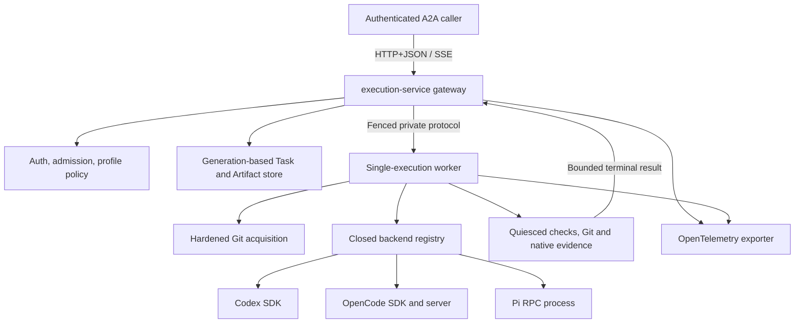
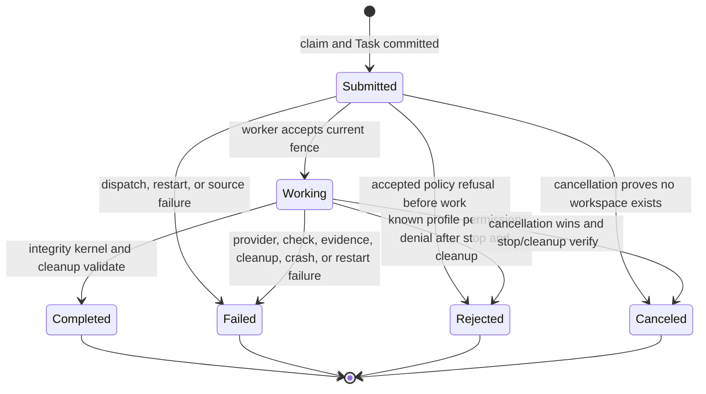
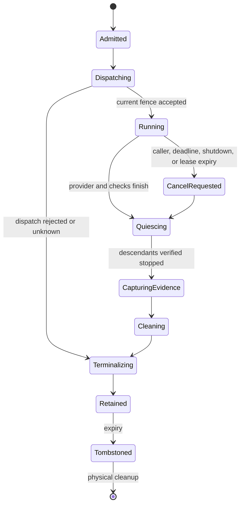

# Coding-Agent Execution Gateway - Plan

## Goal Capsule

- **Objective:** External systems can run Codex, OpenCode, or Pi against an immutable repository revision through one authenticated, cancellable, evidence-preserving remote contract.
- **Means:** Add a separately deployable A2A 1.0 gateway, a private worker protocol, and backend-neutral workers with three provider adapters (KTD1, KTD5, KTD7).
- **Authority:** [ADR 0002](../decisions/0002-serve-coding-agent-execution-through-an-a2a-gateway.md) owns the public boundary. The A2A 1.0 specification owns core wire semantics. The versioned AllAgents extension owns coding-execution semantics.
- **Execution profile:** Build contract-first, then durable gateway state, worker lifecycle, provider adapters, packaging, and cross-backend conformance. Preserve the existing local CLI and Node 18 package compatibility.
- **Stop conditions:** Do not execute agents in the gateway process, accept mutable source identity, put deployment credentials in requests, treat streams or telemetry as terminal evidence, or add evaluation behavior.
- **Tail ownership:** The implementing workflow runs focused contract and lifecycle tests, the complete repository quality gates, isolated gateway/worker smoke tests, provider-specific credentialed smoke tests where credentials are available, and documentation validation.

---

## Product Contract

### Summary

AllAgents gains a remote coding-execution service without becoming an evaluation framework. Callers use A2A Tasks and one required AllAgents extension. The gateway owns caller identity, idempotency, routing, status, cancellation, evidence normalization, and bounded retention. Separate workers own repository materialization, provider processes, mutable workspaces, evidence capture, termination, and cleanup.

### Problem Frame

AllAgents currently configures and launches coding clients but has no service boundary for external callers. AI Evals and future consumers would otherwise need to import AllAgents internals, drive interactive CLIs, or independently reimplement repository acquisition, permissions, cancellation, evidence, and cleanup.

The three initial runtimes expose different programmatic contracts. Codex provides a TypeScript SDK over structured JSONL events, OpenCode provides a typed HTTP SDK and SSE event stream, and Pi provides a strict JSONL RPC mode. The public service must preserve one stable lifecycle without flattening provider-specific facts into false equivalence.

### Actors

- A1. **Gateway caller:** An authenticated service such as AI Evals that creates, observes, lists, cancels, and retrieves coding-execution Tasks.
- A2. **Execution gateway:** The A2A server that owns caller scope, Task identity, idempotency, routing, retention, and normalized results.
- A3. **Execution worker:** A separately deployed process that owns source materialization, one mutable workspace per invocation, provider execution, evidence capture, and cleanup.
- A4. **Backend adapter:** The Codex, OpenCode, or Pi integration that translates native events, cancellation, usage, failures, and evidence into the worker contract.
- A5. **Operator:** The person or deployment system that defines profiles, credentials, limits, retention, worker endpoints, and observability policy.

### Key Decisions

- **Profile A2A rather than creating a public invocation API.** The service keeps standard Agent Cards, Tasks, Artifacts, operations, errors, and capability negotiation. Governs R1-R4.
- **Keep execution outside the gateway process.** Mutable repositories and provider processes belong to workers. Governs R10-R16, R21-R22.
- **Keep evaluation outside AllAgents.** Dataset expansion, repetitions, assertions, scoring, retries, and durable evaluation Runs remain caller concerns. Governs R20.

### Requirements

**Public protocol and compatibility**

- R1. The gateway implements A2A 1.0 HTTP+JSON for Agent Card discovery, `SendMessage`, `GetTask`, `ListTasks`, and `CancelTask`; it implements streaming send and task subscription when the card advertises streaming.
- R2. Every valid new request returns exactly one addressable Task. Direct-Message completion and follow-up messages to an existing Task are unsupported. Non-streaming send honors A2A `returnImmediately`; streaming always emits the durable Task first.
- R3. Every request and terminal Task uses one required, versioned AllAgents coding-execution extension URI. Unsupported required extension versions fail without fallback.
- R4. Terminal output and execution evidence are retrievable as Task Artifacts for the configured retention window even when the original stream disconnects. Active subscription emits the current Task snapshot then future events without promising replay of missed progress; terminal subscription returns the standard unsupported-operation error and callers use `GetTask`.

**Caller identity, Task identity, and retention**

- R5. Every protocol operation authenticates the caller and scopes Task lookup, listing, subscription, cancellation, and artifact retrieval to that caller's tenant and principal before storage access can reveal resource existence.
- R6. Authentication, required-extension validation, request validation, source/profile authorization, quota admission, and deadline validation complete before Task creation. A caller-scoped invocation key, effective profile, authenticated owner, and canonical request digest then bind atomically to one Task; identical replay returns that Task and conflicting reuse is rejected without dispatch.
- R7. Public Task state uses only A2A states and each Task has one immutable terminal transition. Task state and terminal Artifact metadata survive gateway restart; nonterminal Tasks that cannot be reattached settle failed once and stale worker events cannot overwrite them.
- R8. List operations implement all A2A filters, history bounds, page-size bounds, owner/query-bound cursor pagination, and descending status-update time. One immutable expiry logically hides the Task, claim, events, and artifacts before best-effort physical deletion; expired and unauthorized IDs are indistinguishable.
- R9. Small deployments work without an external database. The built-in durable store supports one gateway replica, enforces per-owner/global admission and storage quotas, and reserves capacity for cancellation and terminal settlement; multi-replica storage is outside this delivery.

**Execution and policy**

- R10. Codex, OpenCode, and Pi are peer backends behind one conformance contract. (session-settled: user-directed — chosen over an additional enterprise-only adapter: the open-source gateway supports the three named runtimes directly.)
- R11. A request selects a server-defined execution profile. The profile fixes backend, model/runtime settings, source policy, setup and check commands, permissions, environment allowlists, artifact paths, resource budgets, deadline ceiling, trust class, and evidence limits.
- R12. The only initial remote source form is a canonical credential-free HTTPS Git URL plus full commit object ID and optional repository-relative subdirectory. Acquisition revalidates destination policy for every connection, disables redirects and repository-controlled secondary fetch/exec features, uses hermetic Git configuration, and verifies that the fetched object is the requested commit before setup.
- R13. Requests never contain deployment credentials or arbitrary secret values. Profiles name environment variables whose values are scoped to the required worker phase and excluded from repository configuration, process arguments, logs, errors, evidence, and retained workspaces.
- R14. The effective deadline is the earlier of the caller deadline and profile ceiling and is persisted before dispatch. The first durable terminal-or-cancel-intent write wins; cancellation is idempotent, reaches the worker and provider once, suppresses late success, and records termination and cleanup before publishing canceled. Stream or HTTP disconnect alone does not cancel a Task.
- R15. Initial profiles are unattended. Known provider permission requests are deterministically approved or denied by profile policy for one invocation; unknown permission types fail as adapter incompatibility. The gateway never emits `INPUT_REQUIRED` or `AUTH_REQUIRED` for these profiles and never depends on a live client.
- R16. A worker creates a fresh invocation directory and isolated backend configuration/data roots, runs setup, captures a post-setup baseline, invokes the provider, and runs configured checks. It then proves all invocation descendants quiescent before final evidence/artifact capture and cleanup or explicit retention.

**Evidence and observability**

- R17. Every terminal result contains an integrity kernel: Task/source/profile/backend identities, action outcome, cancellation or failure classification, termination and cleanup outcomes including explicit unknown, Artifact index metadata, per-dimension completeness, and provenance. Missing or invalid integrity data fails the Task; predictable bounded omission of optional evidence may complete with an explicit gap.
- R18. Normalized file evidence distinguishes create, edit, delete, and rename where truthful. It preserves bounded provider-native diffs, events, or trajectories when normalization loses information and separately records truncation, redaction, attribution, original/captured size, and digest semantics.
- R19. Gateway and worker spans propagate W3C Trace Context and export OpenTelemetry data. Telemetry is operational evidence, not the only durable result.

**Ownership and safety boundary**

- R20. The gateway executes one coding request. It does not own eval configuration, datasets, repetition, scoring, retry policy, experiment scheduling, or a durable evaluation Run ledger.
- R21. The initial worker topology is one execution at a time for reviewed repositories inside one configured mutual-trust domain. Profiles that claim hostile-source or cross-tenant isolation are rejected until a stronger per-invocation UID, mount, PID, network, and credential boundary is configured.
- R22. Gateway admission and worker execution enforce profile limits for request rate, active/retained Tasks, subscriptions, stored bytes, source transfer/expansion, files/inodes, workspace bytes, CPU, memory, PIDs, network, phase deadlines, events, logs, and artifacts. Exhaustion is scoped to one invocation or owner and leaves capacity for terminalization and cleanup.

### Key Flows

- F1. **Admit, create, and stream an execution**
  - **Actors:** A1, A2, A3, A4.
  - **Trigger:** A caller sends a text Message with the required extension, immutable source, profile, invocation key, and deadline.
  - **Steps:** Authenticate; validate and authorize the complete request; reserve quota; atomically claim idempotency and create a submitted Task; dispatch a fenced worker attempt; materialize and verify source; execute the selected backend; persist progress before emission; terminalize with Artifacts after quiescence and cleanup.
  - **Outcome:** `returnImmediately: true` returns the durable current Task, false/unset waits for terminal state, and streaming starts with that Task before ordered updates.
  - **Covered by:** R1-R22.
- F2. **Replay or reconnect to an invocation**
  - **Actors:** A1, A2.
  - **Trigger:** The owner repeats an invocation key or subscribes after a stream disconnect.
  - **Steps:** Recompute the canonical digest; reject a conflict; return the existing Task; for active streaming replay/subscription emit its current snapshot then future events; for a terminal Task return it through send replay or `GetTask` without dispatch.
  - **Outcome:** Retries do not multiply agent work, and reconnect never promises transient event replay.
  - **Covered by:** R4, R6-R8.
- F3. **Cancel or time out an execution**
  - **Actors:** A1, A2, A3, A4.
  - **Trigger:** The caller invokes `CancelTask`, the effective deadline expires, or gateway shutdown claims cancellation.
  - **Steps:** Atomically record the first cancellation source; if dispatch never occurred, prove no workspace exists; otherwise send one fenced worker cancel, invoke native abort, terminate descendants, capture termination-safe evidence, clean, and publish canceled only after verification.
  - **Outcome:** Completion that wins first remains terminal and later cancel returns `TaskNotCancelableError`; cancellation that wins suppresses late provider success and fails instead of claiming canceled when termination or cleanup cannot be verified.
  - **Covered by:** R7, R14, R16-R18.
- F4. **Recover from gateway or worker loss**
  - **Actors:** A2, A3.
  - **Trigger:** The gateway restarts with nonterminal Tasks, an acknowledgement is lost, or a worker crashes.
  - **Steps:** Invalidate the attempt fence; settle each non-reattachable Task failed once; reject late events/results; stop renewing leases; let workers self-abort and clean. Record cleanup complete only when the worker/process boundary proves it; otherwise record unknown.
  - **Outcome:** One Task has one terminal result, no ambiguous dispatch is retried automatically, and no stale worker can overwrite durable truth.
  - **Covered by:** R7, R9, R14, R16-R18, R21-R22.
- F5. **Expire retained execution data**
  - **Actors:** A1, A2.
  - **Trigger:** The immutable Task expiry is reached.
  - **Steps:** Atomically tombstone the complete ownership aggregate; stop authorizing Task and Artifact access; retry physical cleanup independently; permit the old invocation key to create a new Task only after logical expiry.
  - **Outcome:** Expired, unknown, and unauthorized identifiers are indistinguishable and no Artifact outlives Task authorization.
  - **Covered by:** R5-R9.

### Acceptance Examples

- AE1. **Covers R1-R4, R10-R18.** Given an authorized Codex profile and an exact Git SHA, when the caller streams a request, then one Task moves from submitted to working to completed and later `GetTask` returns the same output and evidence Artifacts.
- AE2. **Covers R6.** Given an existing Task, when its owner reuses the invocation key with the same canonical request, then the gateway returns the original Task without a second worker dispatch.
- AE3. **Covers R6.** Given an existing Task, when its owner reuses the invocation key with a different prompt, source, profile, or deadline, then the gateway rejects the request and leaves the original Task unchanged.
- AE4. **Covers R5.** Given a Task owned by caller A, when caller B lists Tasks, gets the Task, cancels it, subscribes, or requests an Artifact, then the gateway reveals no resource existence or content.
- AE5. **Covers R12, R16-R18.** Given a requested SHA that does not match the materialized repository, when the worker verifies source, then provider execution never starts and the Task fails with source-verification and cleanup evidence.
- AE6. **Covers R7, R14.** Given cancellation races worker acceptance or completion, when the first durable outcome is chosen, then exactly one abort occurs when needed, late success cannot overwrite cancellation, and terminal cancellation appears only after termination and cleanup are verified.
- AE7. **Covers R10.** Given equivalent profiles and fixture runtime events for Codex, OpenCode, and Pi, when each completes the same repository mutation, then all three produce the same required normalized result fields while retaining distinct native evidence.
- AE8. **Covers R4, R7, R19.** Given a caller disconnects during work, when it subscribes again, then it receives the current Task and future updates without duplicate dispatch; telemetry loss does not affect later terminal lookup.
- AE9. **Covers R15.** Given a known capability denied by profile, the accepted Task becomes rejected after stop and cleanup; given an unknown permission type, it becomes failed as an adapter incompatibility without waiting for a client.
- AE10. **Covers R17-R18.** Given optional logs/diffs/native events exceed configured budgets, the Task may complete with explicit truncation metadata; given capture cannot establish the integrity kernel, it fails in the evidence phase.
- AE11. **Covers R6, R22.** Given invalid input or exhausted admission quota, the gateway returns a request/resource error and creates no Task; given capacity disappears after durable acceptance, the retained Task fails at dispatch and replay returns it without retry.
- AE12. **Covers R7, R14.** Given a duplicate, out-of-order, or stale-fence worker event arrives after restart or terminal settlement, the gateway ignores it for Task state and records only safe operator telemetry.
- AE13. **Covers R8.** Given a Task reaches expiry while physical deletion fails, all Task and Artifact operations return the same not-found response and the invocation key can create a new Task.
- AE14. **Covers R21-R22.** Given a profile requests pooled hostile-source or cross-tenant execution, startup/admission rejects it; a reviewed single-trust-domain profile runs one bounded execution without exposing worker control credentials to the child environment.

### Success Criteria

- The official A2A JavaScript client can discover the card and exercise create, immediate/waiting send, stream, reconnect, get, list, subscribe, replay, cancel, and expiry behavior against the built service.
- One conformance fixture passes unchanged through Codex, OpenCode, and Pi adapters.
- Admission, replay, fencing, cancellation races, restart recovery, authorization isolation, source hardening, quotas, and evidence integrity have deterministic integration coverage.
- The gateway image contains no coding-agent runtime and cannot access worker workspace roots.
- The initial worker runs one reviewed-trust-domain execution at a time and leaves no live descendant or retained workspace unless policy requests retention.

### Scope Boundaries

**In scope**

- A2A 1.0 HTTP+JSON and SSE streaming.
- One versioned AllAgents coding-execution extension and one versioned private worker protocol.
- Codex, OpenCode, and Pi backends.
- Built-in bearer authentication with OIDC/JWT and static service-token modes.
- Single-replica durable file storage, authenticated Artifact retrieval, OpenTelemetry, admission/resource limits, container images, configuration examples, and operator documentation.
- Reviewed repositories in one configured mutual-trust domain per worker deployment.

**Deferred to follow-up work**

- Multi-replica database-backed Task and idempotency storage.
- Kubernetes Job dispatch, queue brokers, autoscaling controllers, and stronger hostile-source or cross-tenant sandbox providers.
- Push-notification configuration, gRPC, JSON-RPC transport, and A2A extended Agent Cards.
- AHP server/client surfaces, long-lived interactive sessions, and client-contributed tools.
- Additional coding backends and provider-session restoration after gateway restart.
- Optional ATIF conversion after the format and tooling mature.

**Outside this product's identity**

- Evaluation authoring, datasets, assertions, grading, repetitions, experiment scheduling, and durable evaluation Runs.
- Caller-specific result projections such as Promptfoo `ProviderResponse` mapping.

### Sources

- [ADR 0002](../decisions/0002-serve-coding-agent-execution-through-an-a2a-gateway.md)
- [AHP decision inputs](../research/agent-host-protocol-decision-inputs.md)
- [AI Evals ADR 0036](https://github.com/WiseTechGlobal/ai-evals/blob/main/docs/adr/0036-remove-the-ai-evals-workspace-runtime.md)
- [A2A 1.0 specification](https://a2a-protocol.org/v1.0.0/specification/)
- [Official A2A JavaScript SDK](https://github.com/a2aproject/a2a-js)
- [Codex TypeScript SDK](https://github.com/openai/codex/tree/main/sdk/typescript)
- [OpenCode SDK and server](https://opencode.ai/docs/sdk/)
- [Pi RPC protocol](https://github.com/badlogic/pi-mono/blob/main/packages/coding-agent/docs/rpc.md)

---

## Planning Contract

### Key Technical Decisions

- KTD1. **Use the official A2A JavaScript SDK behind an AllAgents request-handler decorator.** Pin a compatible A2A 1.x SDK. The decorator owns admission, canonical Task reservation, idempotent replay, stream snapshot selection, and cancellation routing before `DefaultRequestHandler` can allocate another Task or terminalize cancellation prematurely; the SDK retains standard transport/event mechanics. Governs R1-R8, R14.
- KTD2. **Define the public extension and private worker protocol from canonical Zod schemas.** U1 freezes both versioned contracts, generated JSON Schemas, bounds, and fixtures. The worker protocol carries attempt identity, profile digest, dispatch acceptance, monotonic event sequence, lease fence/expiry, renew/cancel, terminal acknowledgement, and error mapping. Governs R3, R6-R7, R11-R18, R22.
- KTD3. **Commit each Task ownership aggregate through generations and one manifest.** The built-in repository creates the invocation claim and submitted Task together, stores immutable Artifact blobs before atomically switching the manifest to a new generation, tombstones the aggregate before physical retention cleanup, and garbage-collects unreachable generations on startup. A revision/fence compare-and-swap makes terminal settlement immutable. Governs R4-R9, R14, R17-R18.
- KTD4. **Authenticate at HTTP ingress before A2A storage or dispatch.** Production OIDC mode verifies JWT issuer, audience, signature, expiry, and required execution scope. Static token mode uses constant-time comparison for local or service deployments. Unauthenticated mode is allowed only on a loopback listener. A canonical length-delimited issuer/tenant/subject tuple is hashed into an opaque owner key; raw claims and caller IDs never become paths. Governs R5-R6, R13.
- KTD5. **Use fenced, separately deployable gateway and worker services.** The gateway owns A2A and durable results; the worker owns workspaces and provider processes. Every dispatch has a gateway-generated attempt ID, lease ID/epoch, short-lived capability, and event sequence. Workers idempotently accept duplicate delivery of the same attempt, reject conflicting attempts, and gateways ignore stale/out-of-order events and late terminal results. Governs R7, R10-R16, R21-R22.
- KTD6. **Make worker leases the orphan-execution fail-safe, not a replay mechanism.** Gateway cancellation is explicit. Lost acknowledgement or ambiguous dispatch settles `dispatch_unknown` without automatic redelivery; lease expiry aborts and cleans the worker. Gateway restart invalidates old fences and records cleanup as unknown unless a process boundary proves it. Caller stream disconnect never affects the lease. Governs R7, R14, R16-R18.
- KTD7. **Keep one behavior-focused backend interface and explicit registry.** Adapters implement availability/capabilities, invoke, progress, deterministic permission response, abort, terminal output, usage, native evidence, and disposal. Shared worker code owns source, setup, checks, Git evidence, artifacts, process-tree cleanup, limits, and isolated backend roots. A closed `codex | opencode | pi` registry is the only production dispatch point. Governs R10, R14-R18, R21-R22.
- KTD8. **Use each provider's supported automation surface.** Codex uses `@openai/codex-sdk` streaming with `AbortSignal`; OpenCode uses its typed SDK against a worker-owned loopback server and session abort; Pi uses `pi --mode rpc --no-session` with a strict LF-delimited JSON parser, `agent_settled`, `get_session_stats`, and RPC abort. Governs R10, R14-R18.
- KTD9. **Make profiles the policy boundary.** Requests select a profile ID but cannot override backend credentials, executable paths, setup/check commands, environment allowlists, permission rules, trust class, resource limits, workspace retention, or evidence budgets. Profile digests enter idempotency and provenance. Governs R6, R11-R16, R21-R22.
- KTD10. **Capture Git and provider evidence as separate layers after quiescence.** The worker verifies source, runs setup, records a post-setup Git tree, invokes the adapter, runs checks, and stops every invocation process before final Git/artifact capture. Provider-native events remain a distinct bounded layer. Neither layer is promoted as exact causality when incomplete. Governs R16-R18.
- KTD11. **Treat Codex, OpenCode, and Pi as the complete initial backend set.** (session-settled: user-directed — chosen over adding an enterprise-only adapter: only the three named open-source gateway backends belong in this plan.) Governs R10.
- KTD12. **Separate terminal integrity from optional evidence bodies.** Identity, action outcome, failure/cancellation, termination, cleanup, Artifact index, completeness, and provenance must validate before terminal publication. Predictable budget truncation/redaction of logs, diffs, native events, or produced-file bodies may preserve completion with explicit metadata; capture failure that breaks the integrity kernel fails in the evidence phase. Governs R4, R17-R18.
- KTD13. **Harden Git acquisition as a network security boundary.** Accept canonical HTTPS origins only. Use hermetic Git configuration, disable redirects, proxies, helpers, hooks, filters, LFS smudge, submodule recursion, alternates, and non-HTTPS protocols. Revalidate normalized host/address policy for every connection, never forward credentials across origins, and verify the full object ID resolves to a commit fetched from the approved remote. Governs R12-R13, R22.
- KTD14. **Limit the initial worker to one reviewed trust domain and one execution.** The worker rejects hostile-source or cross-tenant claims and runs with concurrency one. Deployment-level CPU/memory/PID/network/filesystem limits become per-invocation limits. Provider/source credentials are absent from setup/check phases and child-visible worker control state. Stronger isolation is a separate sandbox-driver capability. Governs R16, R21-R22.
- KTD15. **Keep service dependencies out of the Node 18 CLI package.** Add a private `packages/execution-service` workspace requiring Node 22.19+ for the A2A SDK, current Pi, gateway, and worker. The published root `allagents` CLI keeps its Node 18 engine and does not import service-only dependencies. Governs R1, R10, R16.

### High-Level Technical Design

#### Component topology



#### Admission, dispatch, and settlement sequence

```mermaid
sequenceDiagram
  participant C as Caller
  participant G as Gateway decorator
  participant S as Durable aggregate store
  participant W as Worker
  participant B as Backend adapter

  C->>G: SendMessage + required extension
  G->>G: Authenticate, validate, authorize, quota, deadline
  G->>S: Atomic claim + submitted Task
  alt identical replay
    S-->>G: Existing Task and current fence
    G-->>C: Existing Task; follow active future events only
  else new accepted Task
    S-->>G: Task + attempt/lease fence
    G->>W: Dispatch(attempt, fence, profile, source, deadline)
    W-->>G: Accepted(attempt, fence)
    W->>W: Materialize, verify, setup, baseline
    W->>B: Invoke with isolated roots and policy
    B-->>W: Progress, usage, native evidence
    W-->>G: Sequenced fenced progress
    G->>S: Compare-and-swap Task generation
    opt cancellation or deadline wins
      C->>G: CancelTask
      G->>S: Persist cancellation intent once
      G->>W: Fenced cancel
      W->>B: Native abort
    end
    W->>W: Stop descendants, capture evidence, cleanup
    W-->>G: Fenced terminal result
    G->>S: Store blobs then atomically commit terminal manifest
    G-->>C: Terminal status and Artifacts
  end
```

#### Public A2A Task state



Terminal states are immutable. Cancellation intent, termination, evidence capture, cleanup, and retention expiry are private record phases, not A2A Task states.

#### Private execution-record phases



### Output Structure

```text
packages/execution-service/
  package.json
  tsconfig.json
  src/
    execution/
      contract.ts
      extension-v1.ts
      worker-protocol-v1.ts
      errors.ts
      profiles.ts
      telemetry.ts
    gateway/
      index.ts
      config.ts
      auth.ts
      agent-card.ts
      request-handler.ts
      executor.ts
      server.ts
      worker-client.ts
      store/
        gateway-repository.ts
        file-gateway-repository.ts
    worker/
      index.ts
      config.ts
      server.ts
      lease.ts
      workspace.ts
      evidence.ts
      adapters/
        types.ts
        registry.ts
        codex.ts
        opencode.ts
        pi.ts
  tests/
    fixtures/execution/
    unit/execution/
    unit/gateway/
    unit/worker/
    e2e/execution-gateway.test.ts
containers/
  gateway.Dockerfile
  worker.Dockerfile
examples/gateway/
  gateway.yaml
  worker.yaml
docs/src/content/docs/
  guides/execution-gateway.mdx
  reference/execution-gateway-configuration.mdx
```

### Configuration Contract

- Gateway configuration defines listener/public URL, auth and canonical owner mapping, store/retention, admission and subscription quotas, low-space watermarks, Artifact limits, worker endpoints, internal capability secrets, and profiles.
- Each profile defines backend, worker route, allowed Git origins/addresses, provider/model settings, phase-specific environment allowlists, deterministic permissions, setup/check commands, artifact globs, effective deadline ceiling, trust class, resource limits, cleanup policy, and evidence budgets.
- Worker configuration fixes a private listener, one-execution concurrency, workspace root, lease grace, backend runtime constraints, trust domain, resource-control capability, and request/result limits.
- Configuration contains environment-variable names but never secret values. Startup resolves the complete graph, verifies that profile claims do not exceed deployment capabilities, and becomes ready only when store, workers, runtimes, quotas, and free-space reserves pass.

### Error and Status Mapping

| Condition | A2A result | Required extension detail |
|---|---|---|
| Authentication, malformed/unsupported extension, invalid source/profile, unauthorized policy, expired deadline, or pre-claim quota failure | Operation error; no Task | Safe standard/extension code and field; no invocation claim |
| Identical invocation replay | Existing Task | No new Task, worker attempt, or quota reservation |
| Conflicting invocation key | Operation error; no new Task | Conflict code; existing Task unchanged |
| Worker capacity loss after acceptance | `TASK_STATE_FAILED` | `dispatch/capacity_exhausted`, retriable fact, no workspace created; gateway does not retry |
| Lost acknowledgement or ambiguous dispatch | `TASK_STATE_FAILED` | `dispatch/dispatch_unknown`; old fence invalidated and cleanup unknown until proven |
| Known profile permission denial after acceptance | `TASK_STATE_REJECTED` | Policy decision plus provider stop and cleanup outcomes |
| Unknown permission or provider protocol shape | `TASK_STATE_FAILED` | Adapter incompatibility, never mislabeled as policy |
| Source, setup, provider, check, mandatory evidence, worker crash, or infrastructure failure | `TASK_STATE_FAILED` | Typed phase, safe message, retriable fact, termination/cleanup/completeness |
| Cancellation/deadline wins and stop/cleanup verify | `TASK_STATE_CANCELED` | First source plus contributors, native abort, termination, cleanup |
| Cancellation loses to terminal completion | Existing terminal Task / `TaskNotCancelableError` | No state mutation or second abort |
| Successful action with valid integrity kernel and complete evidence | `TASK_STATE_COMPLETED` | Output plus complete required evidence |
| Successful action with allowed bounded optional-evidence gap | `TASK_STATE_COMPLETED` | Per-dimension incomplete flag, reason, original/captured size, digest and redaction/truncation flags |
| Restart cannot reattach active work | `TASK_STATE_FAILED` | `gateway_restart`; old fence invalid and cleanup unknown unless proven |
| Retention expiry | Not found | Aggregate logically hidden before physical deletion; Artifact URL also invalid |

### Phased Delivery

1. Create the private Node 22 service package and freeze the public extension, worker protocol, profiles, fixtures, and error vocabulary.
2. Build authenticated durable A2A Task handling and fenced worker dispatch against a fake worker.
3. Build the single-execution worker lifecycle and hardened source/evidence handling against a fake adapter.
4. Add Codex, OpenCode, and Pi adapters in parallel, then compose them through the closed registry.
5. Package the services and run cross-backend, security, process, and A2A conformance before enabling a consumer.

### System-Wide Impact

- **Package surface:** A private Node 22 execution-service workspace and two container entrypoints are added. The published root `allagents` CLI package, Node 18 engine, command surface, and imports remain unchanged.
- **Runtime support:** Gateway and worker require Node 22.19+; startup checks SDK/CLI versions. The Linux worker is one execution per instance and scales by adding instances, not concurrent work inside one trust domain.
- **Filesystem:** The gateway owns a generation-based private Task/Artifact store. Workers own isolated invocation and backend roots. Existing workspace/profile paths are never execution workspaces.
- **Security:** New review-critical surfaces are auth, owner-key derivation, source SSRF, admission/resource quotas, setup/check policy, phase-scoped secrets, internal fences, Artifact capture/serving, and reviewed-source trust enforcement.
- **Operations:** Gateway and worker health, readiness, quotas, low-space state, structured logs, traces, tombstone backlog, lease expiry, stale event rejection, and graceful shutdown need independent signals.
- **Consumers:** AI Evals can build its runner provider only after the Agent Card, extension schemas, and conformance fixtures are versioned and published.

### Risks and Mitigations

- **Provider API churn:** Pin exact compatible SDK/CLI versions in the service lockfile and worker image. Gate capabilities at startup and keep captured provider fixtures versioned.
- **False idempotency or stale settlement:** Claim Task/idempotency in one aggregate, use revision/fence compare-and-swap, sequence events, and fault-test duplicate delivery, cancellation races, restart, and late results.
- **Task/store corruption:** Publish immutable blobs and generations before one manifest switch; tombstone before deletion; validate owner tuples/manifests at startup; garbage-collect unreachable generations; document the one-replica limit.
- **Owner collision or path injection:** Hash a bounded canonical issuer/tenant/subject tuple, store and verify the tuple inside the owner aggregate, and use only server-generated opaque IDs in paths.
- **Orphan processes:** Combine explicit cancel, native abort, process-group termination, one-execution worker/container death, lease expiry, and quiescence proof before evidence capture.
- **Source SSRF or credential leakage:** Enforce KTD13 for every connection and phase. Credentials are ephemeral, origin-bound, and absent from repository config, process arguments, retained workspaces, logs, and errors.
- **Resource exhaustion:** Reserve per-owner/global gateway quota before claims, enforce store watermarks and stream limits, and require one-execution deployment CPU/memory/PID/network/filesystem controls before accepting a profile.
- **Artifact race or disclosure:** Stop all invocation processes first; accept only stable regular files under the repository subdirectory; reject links, special files, mount crossings, unstable metadata, and unsafe sparse files; stage bounded bytes privately, hash once, and verify size/digest at gateway publication.
- **Evidence overclaim:** Enforce KTD12's integrity kernel and per-dimension completeness. Truncation and redaction remain independent facts.
- **Permission deadlock:** Initial profiles never prompt. Known requests resolve for one isolated invocation; unknown shapes fail closed as adapter incompatibility.
- **Trust-boundary overclaim:** Reject pooled hostile-source/cross-tenant profiles and state the reviewed mutual-trust boundary in config, readiness, Agent Card metadata, and docs.
- **Cross-platform drift:** Keep gateway/store tests cross-platform. State that worker execution and hardened evidence/source controls are Linux-only.

### Assumptions

- The first production deployment runs one gateway replica with persistent storage. Multi-replica transactional storage is deferred.
- Git over hardened HTTPS and exact commit object ID covers the initial consumer. Other source transports require a later extension version or capability.
- Setup and check commands are operator-controlled profile policy, not caller-supplied shell text.
- Initial repositories are reviewed inside one configured mutual-trust domain. Strong hostile-code or cross-tenant execution remains unavailable until a stronger sandbox driver exists.
- Current implementation baselines are A2A SDK 1.x on Node 20+, Codex SDK 0.154.x, OpenCode CLI 1.18.x with its compatible SDK, and Pi 0.85.x on Node 22.19+. The private service standardizes on Node 22.19+ and rechecks exact pins before lockfile changes.

---

## Implementation Units

### U1. Versioned public and worker contracts

- **Goal:** Freeze the extension, profile vocabulary, private worker protocol, canonical digest input, result envelope, typed failures, and conformance fixtures before either service endpoint.
- **Requirements:** R2-R3, R6-R7, R10-R22; AE2-AE3, AE6-AE12, AE14; KTD2, KTD5-KTD12.
- **Dependencies:** None.
- **Files:** `packages/execution-service/package.json`, `packages/execution-service/tsconfig.json`, `packages/execution-service/src/execution/contract.ts`, `packages/execution-service/src/execution/extension-v1.ts`, `packages/execution-service/src/execution/worker-protocol-v1.ts`, `packages/execution-service/src/execution/errors.ts`, `packages/execution-service/src/execution/profiles.ts`, `packages/execution-service/tests/unit/execution/contracts.test.ts`, `packages/execution-service/tests/fixtures/execution/*.json`, `scripts/generate-execution-schemas.ts`, `package.json`, `bun.lock`.
- **Approach:** Create the private Node 22 workspace package. Define strict Zod request/result/profile schemas, one public extension URI, and one private protocol version. Include attempt/fence/lease identity, monotonic event sequence, accepted dispatch, renew/cancel, bounded terminal acknowledgement, public/private state separation, and integrity-kernel rules. Canonicalize caller input plus effective profile digest for idempotency. Generate checked-in JSON Schemas and fixtures from the same source.
- **Execution note:** Start with fixture-driven schema, framing, and digest tests. Observe failures for unknown versions, credential-bearing sources, mutable revisions, unsafe paths, invalid public states, stale fences, oversized records, and conflicting canonical inputs before implementing schemas.
- **Patterns to follow:** `src/models/workspace-config.ts` for strict schemas, `scripts/generate-workspace-schemas.ts` for generated-schema drift checks, and `src/core/native/types.ts` for safe error/provenance normalization.
- **Test scenarios:**
  - A minimal valid request with text prompt, invocation key, profile, exact commit, and deadline parses and produces a stable digest across object-key ordering.
  - Changing prompt, source object ID, profile ID/digest, artifact selection, or deadline changes the digest; trace IDs and transport metadata do not.
  - A source URL with credentials, a branch/tag revision, absolute subdirectory, traversal, secret value, unknown backend, or unknown extension version is rejected safely.
  - Public Task fixtures accept only A2A states; cancellation, cleanup, evidence, and tombstone phases exist only in private records.
  - Worker fixtures reject missing/mismatched attempt IDs, lease epochs, profile digests, event sequence, bounds, and terminal acknowledgements.
  - Completed, failed, canceled, and rejected results validate only with the integrity kernel; optional usage/native evidence gaps require explicit completeness reasons.
  - File evidence accepts create/edit/delete/rename and rejects unsafe paths, duplicate identities, oversized inline content, and inconsistent before/after forms.
- **Verification:** Generated schemas are stable, public/private fixtures round-trip, digest vectors are cross-platform deterministic, and the private client/server fixture suite agrees before gateway or worker implementation.

### U2. Authentication and durable gateway repository

- **Goal:** Provide caller-scoped authentication, authorization, atomic Task/idempotency aggregates, Artifact storage, quota admission, pagination, restart fencing, logical expiry, and cleanup.
- **Requirements:** R4-R9, R13-R14, R17-R18, R22; AE2-AE4, AE6, AE8, AE10-AE13; KTD1, KTD3-KTD4, KTD12.
- **Dependencies:** U1.
- **Files:** `packages/execution-service/src/gateway/config.ts`, `packages/execution-service/src/gateway/auth.ts`, `packages/execution-service/src/gateway/store/gateway-repository.ts`, `packages/execution-service/src/gateway/store/file-gateway-repository.ts`, `packages/execution-service/tests/unit/gateway/auth.test.ts`, `packages/execution-service/tests/unit/gateway/file-gateway-repository.test.ts`.
- **Approach:** Adapt one owner-scoped repository to the A2A SDK `TaskStore`. Derive an opaque owner key from a bounded canonical issuer/tenant/subject tuple. Commit claim plus submitted Task in one manifest generation; publish immutable Artifact blobs before terminal manifest switch; compare-and-swap revisions/fences; tombstone before physical expiry cleanup; recover and garbage-collect unreachable generations on startup. Reserve owner/global quotas before claims. Verify OIDC JWTs and constant-time static tokens before all repository access.
- **Execution note:** Implement concurrent-claim, transition-race, and crash-publication tests before request handling. Inject faults between blob, generation, manifest, tombstone, and cleanup operations.
- **Patterns to follow:** `src/core/marketplace.ts` and `src/core/profile/files.ts` for atomic publication/recovery, `src/core/mcp-http-stdio-proxy.ts` for private files and loopback safety, and the official A2A `TaskStore` owner-scoping contract.
- **Test scenarios:**
  - Covers AE2-AE3. Concurrent identical claims create one aggregate; a conflicting digest returns conflict without dispatch permission.
  - Covers AE4. Load/list/cancel/subscribe/Artifact lookup scopes before path/database access and gives unknown, unauthorized, and expired IDs indistinguishable behavior.
  - Hostile/ambiguous issuer, tenant, subject, invocation key, Task ID, Artifact name, Unicode, case, delimiter, traversal, and Windows-reserved values cannot collide or become paths.
  - All standard list filters, `historyLength`, page size 1-100, omitted Artifacts, ordering, total size, and always-present next token match A2A semantics. Tokens are owner/query-bound and reject malformed, swapped, or stale filters.
  - Covers AE12. Terminal compare-and-swap wins once; stale fence, duplicate, and out-of-order updates cannot mutate the Task.
  - Restart fails nonterminal Tasks once, invalidates fences, preserves terminal Tasks, and records cleanup unknown unless proven.
  - Covers AE13. Exact expiry tombstones the aggregate before cleanup; failed deletion never restores visibility; same-key replay before expiry returns the old Task and after expiry creates a new Task.
  - A crash between every aggregate publication step leaves either the prior or next valid manifest, never claim-without-Task or Task-with-missing-Artifact state.
  - OIDC rejects wrong issuer, audience, signature, expiry, scope, tenant, and subject; static tokens and internal capabilities never appear in logs/errors.
  - Quota-boundary races admit exactly the allowed count and preserve reserved capacity for cancel/terminal writes; low-space mode stops new claims without blocking settlement.
  - Unauthenticated mode starts on loopback and refuses wildcard or non-loopback listeners.
- **Verification:** A fresh process retrieves prior records, fault recovery finds one valid aggregate generation, authorization cannot reveal neighboring owners, and expiry/quota behavior remains deterministic under concurrency.

### U3. A2A gateway server and fenced worker client

- **Goal:** Expose the accepted A2A profile while making admission, replay, streaming, lookup, worker fencing, failure, and cancellation use one durable state machine.
- **Requirements:** R1-R9, R11, R14-R15, R17-R22; F1-F5; AE1-AE4, AE6, AE8-AE13; KTD1-KTD7, KTD9, KTD12.
- **Dependencies:** U1, U2.
- **Files:** `packages/execution-service/src/gateway/agent-card.ts`, `packages/execution-service/src/gateway/request-handler.ts`, `packages/execution-service/src/gateway/executor.ts`, `packages/execution-service/src/gateway/server.ts`, `packages/execution-service/src/gateway/worker-client.ts`, `packages/execution-service/tests/unit/gateway/agent-card.test.ts`, `packages/execution-service/tests/unit/gateway/request-handler.test.ts`, `packages/execution-service/tests/unit/gateway/executor.test.ts`, `packages/execution-service/tests/e2e/gateway-fake-worker.test.ts`.
- **Approach:** Mount the official HTTP+JSON and Agent Card handlers behind auth. Put an AllAgents `A2ARequestHandler` decorator above `DefaultRequestHandler` so admission and canonical Task reservation happen first, identical replay bypasses new SDK Task/bus allocation, and cancellation waits for worker terminal evidence. Persist each public state before emission. Dispatch one fenced attempt, validate sequence/fence on every worker event, renew its lease, and atomically publish Artifact blobs plus terminal manifest.
- **Execution note:** Begin with an in-process fake worker and official A2A client. Prove operation errors versus accepted-Task failures, replay/subscribe behavior, fencing, cancellation races, and restart before adding providers.
- **Patterns to follow:** Official A2A sample `AgentExecutor`, `A2ARequestHandler`, `DefaultRequestHandler`, Express handlers, and cancellable-agent flow; `src/core/mcp-http-stdio-proxy.ts` for HTTP shutdown and loopback tests.
- **Test scenarios:**
  - Covers AE1. `returnImmediately` true returns the submitted/working Task, false/unset waits for terminal state, and streaming starts with the same durable Task before ordered updates.
  - Authentication, invalid extension/source/profile, expired deadline, and pre-claim quota failure return operation errors with no Task or worker request.
  - Covers AE11. Capacity loss after acceptance fails the retained Task at `dispatch/capacity_exhausted`; ambiguous dispatch fails `dispatch_unknown`; neither is retried.
  - Covers AE2-AE3. Identical send/stream replay returns the existing Task and follows only future events if active; conflict returns the documented operation error.
  - Covers AE8. Active subscribe emits current snapshot then future events without missed-event replay; terminal subscribe errors and `GetTask` returns terminal truth.
  - Covers AE4. Get/list/subscribe/cancel/Artifact endpoints apply owner authorization consistently.
  - Covers AE6. Cancel in submitted/working, cancel versus accept/completion, caller versus deadline, duplicate cancel, and terminal cancel each produce one linearized outcome and at most one worker abort.
  - Covers AE12. Duplicate, out-of-order, malformed, wrong-fence, and late terminal events cannot overwrite Task state; stale facts go only to safe telemetry.
  - Known policy denial rejects only after stop/cleanup; unknown permission shape fails as adapter incompatibility.
  - Caller SSE disconnect and telemetry exporter failure leave execution and terminal lookup intact.
  - Graceful shutdown stops admission, claims cancellation for bounded active work, persists honest terminal state, and closes listeners.
- **Verification:** The official SDK client exercises every advertised operation against the built gateway and fake worker; persisted snapshots match streams while aggregate/fence invariants remain intact under races.

### U4. Worker protocol and safe workspace lifecycle

- **Goal:** Implement the single-execution worker, hardened immutable Git acquisition, profile enforcement, leases, isolated backend roots, resource controls, race-resistant evidence, termination, and cleanup independent of any provider.
- **Requirements:** R10-R22; F1, F3-F4; AE5-AE6, AE8-AE10, AE12, AE14; KTD2, KTD5-KTD7, KTD9-KTD10, KTD12-KTD14.
- **Dependencies:** U1.
- **Files:** `packages/execution-service/src/worker/config.ts`, `packages/execution-service/src/worker/server.ts`, `packages/execution-service/src/worker/lease.ts`, `packages/execution-service/src/worker/workspace.ts`, `packages/execution-service/src/worker/evidence.ts`, `packages/execution-service/src/worker/adapters/types.ts`, `packages/execution-service/src/worker/adapters/registry.ts`, `packages/execution-service/tests/unit/worker/server.test.ts`, `packages/execution-service/tests/unit/worker/lease.test.ts`, `packages/execution-service/tests/unit/worker/workspace.test.ts`, `packages/execution-service/tests/unit/worker/evidence.test.ts`, `packages/execution-service/tests/fixtures/execution/fake-backend.ts`.
- **Approach:** Authenticate and fence the private protocol, reserve the one execution before workspace creation, validate profile/deployment capability, and emit sequenced NDJSON. Acquire source under KTD13. Create separate workspace and backend config/data roots with a scrubbed phase-specific environment. Run setup, baseline, adapter, and checks under enforced budgets. Stop and verify the process group before descriptor-based regular-file evidence staging, then clean in `finally`. Lease expiry self-cancels.
- **Execution note:** Characterize every phase with a fake adapter, malicious fixtures, and disposable Git servers before real providers. Fault-inject dispatch acknowledgement, events, leases, acquisition, processes, evidence publication, and cleanup.
- **Patterns to follow:** `src/core/managed-repos.ts` and `src/core/git.ts` for Git execution shape, `src/core/native/types.ts` for child-process results and redaction, `src/core/profile/files.ts` for filesystem ownership, profile adapter context isolation under `src/core/profile/adapters/`, and `tests/helpers/env.ts` for isolated state.
- **Test scenarios:**
  - Covers AE5. Exact object ID verifies; wrong/missing object, disallowed URL/host/address/port, credential-bearing URL, redirect, DNS rebinding, unsafe subdirectory, and fetch failure stop before adapter invocation.
  - Repositories with LFS configuration/pointers, submodules, hooks, filters, alternates, proxy/helper config, or non-HTTPS secondary protocols cause no secondary connection or helper execution.
  - Source credentials leave no repository config, process argument, child phase environment, log, error, evidence, or retained workspace trace.
  - Setup changes establish the baseline; setup and checks receive no provider/control secrets; every backend gets disjoint invocation config/data roots with ambient selectors removed.
  - Covers AE6. Cancel, deadline in every phase, lease expiry, worker shutdown, and adapter failure terminate/clean once; late adapter completion cannot change the result.
  - Covers AE14. Concurrency above one and hostile/cross-tenant trust claims are rejected; worker control credentials are absent from child environment and configured filesystem roots.
  - Source pack/tree/file/inode/path/sparse-file/disk limits and setup/provider/check CPU, memory, PID, network, phase-time, and workspace limits stop only the invocation and preserve worker health.
  - Covers AE9. Known permissions receive one-invocation decisions; prompt-required profiles fail startup; unknown permission types fail the adapter.
  - Covers AE10. Predictable evidence limits retain the integrity kernel and explicit gaps; capture I/O or malformed result that breaks the kernel fails the Task.
  - Background swap attacks, links, mount crossings, FIFOs/devices/sockets, unstable files, and tampering between worker staging and gateway publication never expose external bytes or partial Artifacts.
  - A worker crash before/after provider spawn reports cleanup complete only when the process/container boundary proves descendant death.
- **Verification:** A built worker mutates a disposable exact-SHA repository through the fake adapter and proves fenced dispatch, source hardening, phase isolation, budgets, quiescence, evidence integrity, and cleanup from its emitted result alone.

### U5. Codex backend adapter

- **Goal:** Run Codex through its supported TypeScript SDK while preserving structured progress, output, usage, file-change evidence, cancellation, and runtime identity.
- **Requirements:** R10-R22; AE1, AE6-AE10, AE12, AE14; KTD7-KTD12, KTD14-KTD15.
- **Dependencies:** U4.
- **Files:** `packages/execution-service/src/worker/adapters/codex.ts`, `packages/execution-service/tests/unit/worker/adapters/codex.test.ts`, `packages/execution-service/tests/fixtures/execution/codex-events.jsonl`.
- **Approach:** Construct a fresh SDK thread in the invocation workspace with an isolated `CODEX_HOME` and scrubbed environment. Apply model, sandbox, network, approval, and writable-root settings only from the profile. Consume `runStreamed()` and pass an AbortSignal. Normalize agent messages, items, usage, failures, and file-change events while preserving the bounded native stream.
- **Execution note:** Drive the SDK through its executable override with a fixture Codex process before any credentialed smoke test.
- **Patterns to follow:** `src/core/profile/adapters/codex.ts` for root/environment isolation, `src/core/native/codex.ts` for version checks, and the SDK's `runStreamed`/AbortSignal contract.
- **Test scenarios:**
  - A successful stream exposes thread ID, progress, final response, token usage, native file-change items, and terminal completion.
  - Empty final response, turn failure, malformed JSONL, non-zero exit, unavailable runtime, and usage omission map to typed result/completeness fields.
  - Covers AE6/AE12. Cancellation aborts the SDK process once; completion after cancel or stale fence cannot alter the selected terminal outcome.
  - Profile sandbox, network, model, approval, working directory, and environment settings reach the SDK; caller input cannot override them.
  - Two sequential invocations have disjoint `CODEX_HOME`, thread/session state, and writable roots; ambient selectors are removed.
  - Native diffs and shared Git evidence coexist without claiming identical attribution.
- **Verification:** Fixture-driven tests cover every supported event and failure shape, followed by an isolated credentialed repository smoke test when Codex credentials are available.

### U6. OpenCode backend adapter

- **Goal:** Run OpenCode through its typed SDK and worker-owned loopback server while preserving session progress, output, usage/cost, diffs, permissions, cancellation, and disposal.
- **Requirements:** R10-R22; AE6-AE10, AE12, AE14; KTD7-KTD12, KTD14-KTD15.
- **Dependencies:** U4.
- **Files:** `packages/execution-service/src/worker/adapters/opencode.ts`, `packages/execution-service/tests/unit/worker/adapters/opencode.test.ts`, `packages/execution-service/tests/fixtures/execution/opencode-events.jsonl`.
- **Approach:** Start one loopback instance per invocation with isolated `OPENCODE_CONFIG`, `OPENCODE_CONFIG_DIR`, data/cache roots, scrubbed environment, profile configuration, and AbortSignal. Subscribe before prompting, create one session, resolve permission events from policy, collect message/session events and session diff, abort on cancellation, then delete the session and close the server in `finally`. Prevent the agent subprocess from reaching the worker control listener under the declared trust topology.
- **Execution note:** Inject SDK/server factories so protocol fixtures prove ordering and teardown without downloading or authenticating a real runtime.
- **Patterns to follow:** `src/core/profile/adapters/opencode.ts` for configuration/environment isolation and OpenCode's `createOpencode`, event subscription, session prompt/diff/abort APIs.
- **Test scenarios:**
  - Successful execution collects text parts, assistant tokens/cost, session ID, events, and session diff before disposal.
  - Subscription starts before prompt, ignores other session IDs, and finishes only after the target session becomes idle or errors.
  - Covers AE6/AE12. Cancellation calls session abort once; late idle/completion cannot overwrite cancellation; server teardown remains idempotent.
  - Covers AE9. Known permission events receive invocation-scoped `once`, `always`, or `reject` according to profile; `always` does not survive disposal and unknown types fail the adapter.
  - Provider auth error, API error, aborted message, server-start timeout, SSE disconnect, and malformed SDK response map to typed failures.
  - Sequential invocations have disjoint config/data/session roots; caller input cannot enable sharing, alter bind, select another project, or override provider/model/tools.
- **Verification:** Fixture tests prove session scoping, permission lifetime, cancellation races, and disposal, followed by an isolated credentialed repository smoke test when OpenCode credentials are available.

### U7. Pi backend adapter

- **Goal:** Run Pi through strict RPC mode while preserving settled completion, output, usage/cost, tool progress, cancellation, and process cleanup.
- **Requirements:** R10-R22; AE6-AE10, AE12, AE14; KTD7-KTD12, KTD14-KTD15.
- **Dependencies:** U4.
- **Files:** `packages/execution-service/src/worker/adapters/pi.ts`, `packages/execution-service/src/worker/adapters/pi-rpc.ts`, `packages/execution-service/tests/unit/worker/adapters/pi.test.ts`, `packages/execution-service/tests/unit/worker/adapters/pi-rpc.test.ts`, `packages/execution-service/tests/fixtures/execution/pi-events.jsonl`.
- **Approach:** Spawn a supported Pi 0.85.x runtime with `--mode rpc --no-session`, an invocation-local `PI_CODING_AGENT_DIR`, profile model/provider, and scrubbed environment. Implement an LF-only JSONL parser rather than Node `readline`. Correlate responses, wait for `agent_settled`, read messages/stats, send RPC abort, and escalate process-group termination after the grace period.
- **Execution note:** Build parser and state-machine tests from captured RPC fixtures before process integration.
- **Patterns to follow:** `src/core/native/pi.ts` for version/trust checks, `src/core/profile/adapters/pi.ts` for root isolation, and the official Pi RPC framing/cancellation contract.
- **Test scenarios:**
  - Successful prompt acceptance streams message/tool events, stops on `agent_settled`, retrieves final messages/stats, and reports session ID, usage, and cost.
  - LF framing preserves `U+2028`/`U+2029` inside JSON strings, accepts CRLF by stripping trailing CR, handles partial/multiple chunks, and rejects oversized/malformed records.
  - Covers AE6/AE12. Cancellation sends RPC abort once, waits for idle, then terminates the process group only after grace; late settled events cannot overwrite the terminal fence.
  - Prompt rejection, agent error, aborted stop reason, retry/compaction sequence, premature exit, stderr overflow, and stats failure map truthfully.
  - Sequential invocations have disjoint `PI_CODING_AGENT_DIR` and session state; caller input cannot send extension commands, steering/follow-up, arbitrary RPC commands, or override provider/model.
- **Verification:** Fixture and fake-process tests prove framing, correlation, settled completion, stats, isolation, and abort, followed by an isolated credentialed repository smoke test when Pi credentials are available.

### U8. Production registry, service packaging, and observability

- **Goal:** Compose exactly three production adapters and package independently runnable gateway and worker services with safe startup, health, shutdown, tracing, and reproducible containers.
- **Requirements:** R1, R5, R7-R22; AE7-AE8, AE12, AE14; KTD4-KTD8, KTD11-KTD15.
- **Dependencies:** U3-U7.
- **Files:** `packages/execution-service/src/worker/adapters/registry.ts`, `packages/execution-service/src/gateway/index.ts`, `packages/execution-service/src/worker/index.ts`, `packages/execution-service/src/execution/telemetry.ts`, `packages/execution-service/package.json`, `packages/execution-service/tsconfig.json`, `package.json`, `bun.lock`, `containers/gateway.Dockerfile`, `containers/worker.Dockerfile`, `.dockerignore`, `.github/workflows/ci.yml`, `.github/workflows/publish.yml`, `packages/execution-service/tests/unit/worker/adapters/registry.test.ts`, `packages/execution-service/tests/e2e/service-lifecycle.test.ts`.
- **Approach:** Register only Codex, OpenCode, and Pi through an explicit capability/availability map. Add gateway and worker entrypoints inside the private Node 22 workspace instead of the Node 18 CLI package. Validate config, store, workers, runtime pins, trust, quotas, and resource controls before readiness. Propagate `traceparent` and instrument every phase. Build a minimal gateway image with no provider runtimes and a one-execution worker image with exact runtime versions.
- **Execution note:** Treat this as integration and packaging work; prove it with built-process and container smoke tests rather than source-shape assertions.
- **Patterns to follow:** `src/core/profile/adapters/registry.ts` for explicit adapter composition, root package scripts for workspace delegation, `src/core/mcp-http-stdio-proxy.ts` for server lifecycle, `.github/workflows/ci.yml` for quality gates, and `.github/workflows/publish.yml` for immutable releases.
- **Test scenarios:**
  - Registry exposes exactly Codex, OpenCode, and Pi, reports their capabilities/versions, accepts an injected fake registry in tests, and rejects unknown backend IDs before workspace creation.
  - Gateway and worker start from built service outputs, become ready only after dependencies pass, and stop gracefully on SIGTERM.
  - Gateway readiness fails for malformed auth, invalid aggregate store, unavailable required worker, quota/free-space failure, or non-loopback unauthenticated bind.
  - Worker readiness fails for concurrency above one, unsupported trust claim, unavailable resource enforcement, or unsupported backend runtime.
  - Trace context enters through A2A, crosses the private call, and correlates result identities; exporter failure cannot change Task status.
  - Gateway image contains no Codex, OpenCode, Pi, Git workspace, or provider credential material.
  - Worker image pins all runtimes, confines one workspace/config root, enforces deployment limits, and completes fake-provider health smoke tests.
  - Installing the root npm package on Node 18 does not load service dependencies; the private service workspace and containers enforce Node 22.19+.
- **Verification:** The registry dispatches every adapter through the same worker contract; built services and images pass lifecycle/security smoke tests; CI and publication bind immutable image tags to the release commit.

### U9. Cross-backend conformance, documentation, and release evidence

- **Goal:** Prove the public contract and operational workflow end to end and document deployment without leaking backend details into callers.
- **Requirements:** R1-R22; F1-F5; AE1-AE14.
- **Dependencies:** U1-U8.
- **Files:** `packages/execution-service/tests/e2e/execution-gateway.test.ts`, `packages/execution-service/tests/fixtures/execution/conformance-cases.ts`, `examples/gateway/gateway.yaml`, `examples/gateway/worker.yaml`, `docs/src/content/docs/guides/execution-gateway.mdx`, `docs/src/content/docs/reference/execution-gateway-configuration.mdx`, `README.md`, `CHANGELOG.md`.
- **Approach:** Run one conformance suite against the fake backend and each provider fixture, plus opt-in credentialed smoke cases. Exercise gateway and worker as separate processes. Document extension/worker protocols, profiles, auth, trust boundary, storage/HA limits, source hardening, quotas, runtime requirements, cancellation races, evidence integrity, Artifact access, retention, observability, and troubleshooting.
- **Execution note:** Use a disposable local Git HTTP server, temporary gateway store, temporary worker root, and loopback ports. Never read the developer's real home, sessions, or credentials in deterministic tests.
- **Patterns to follow:** Existing `tests/e2e/*` built-process style, `tests/helpers/env.ts` home isolation, and Starlight guide/reference organization under `docs/src/content/docs/docs/`.
- **Test scenarios:**
  - Covers AE1-AE14 through built services with a fake backend and official A2A client.
  - The same mutation fixture passes through Codex, OpenCode, and Pi event fixtures and produces contract-equivalent normalized evidence.
  - Concurrent callers cannot observe each other's Tasks, streams, cancellations, page tokens, quotas, or Artifacts; the one-execution worker serializes admitted work.
  - Gateway restart, stream reconnect, lost dispatch acknowledgement, duplicate/out-of-order events, worker crash, lease expiry, cancellation race, provider failure, evidence truncation, logical expiry, and cleanup failure preserve one truthful terminal outcome.
  - Redirect/DNS-rebinding, secondary Git fetch, resource exhaustion, malicious file types/link swaps, control-endpoint probing, and secret-exfiltration fixtures are blocked within the documented reviewed-source boundary.
  - Examples validate with production schemas and reference secrets only through environment variable names.
  - Docs state one gateway replica, one execution per worker, reviewed mutual-trust sources, Node/runtime floors, and no hostile-code isolation claim.
  - Opt-in real-provider smoke tests record backend/runtime versions and skip only when the named credential/runtime prerequisite is absent.
- **Verification:** A clean install builds root CLI and private service without raising the CLI engine floor, the full suites and docs pass, the official A2A client exercises every advertised operation, and release evidence records each available real backend plus explicit skipped prerequisites.

---

## Verification Contract

| Gate | Applies to | Required evidence |
|---|---|---|
| Contract generation | U1 | Public extension and private worker schema generation report no drift; positive and negative fixtures pass. |
| Focused unit tests | U1-U8 | Active-unit tests pass with fault injection, state races, limits, cancellation, and cleanup. |
| Gateway/worker integration | U3-U4, U8-U9 | Built processes agree on fenced dispatch, sequencing, leases, Task persistence, Artifacts, shutdown, and cleanup. |
| Backend conformance | U5-U9 | One shared suite passes against Codex, OpenCode, and Pi adapters with fixture runtimes. |
| Credentialed provider smoke | U5-U7, U9 | Each available provider mutates a disposable exact-SHA repository; missing credentials/runtime are recorded as skipped prerequisites, never passing coverage. |
| A2A interoperability | U3, U9 | Official `@a2a-js/sdk` client passes immediate/waiting send, stream, reconnect, get, list/filter/page, subscribe, replay, cancel races, expiry, and owner isolation. |
| Security and abuse | U2-U4, U8-U9 | Malicious identity/source/artifact/resource fixtures prove auth-before-lookup, opaque owner keys, Git SSRF controls, phase-scoped secrets, quotas, quiescence, race-resistant capture, and trust-topology rejection. |
| Service packaging | U8-U9 | Root Node 18 install, private Node 22 build, gateway/worker smoke, and both container builds pass. |
| Repository quality | All | `bun run schema:check`, `bun run typecheck`, `bun run lint`, and `bun test` pass. |
| Documentation | U9 | `bun run docs:build` passes and examples validate against current schemas. |

The authoritative behavioral proof is the built-process E2E path with the official A2A client and a separately started worker. Unit tests alone do not prove protocol, durable aggregation, process isolation, fencing, cancellation, or cleanup integration.

---

## Definition of Done

### Global

- Every R1-R22 requirement is implemented or explicitly shown in a passing conformance scenario.
- Public Agent Card/extension and private worker schemas are stable, generated from one source, and consumable without importing root AllAgents CLI modules.
- Codex, OpenCode, and Pi pass the same backend conformance suite and preserve bounded native evidence through the closed registry.
- Gateway and worker run as separate Node 22 processes/images; the Node 18 root CLI does not import service dependencies, and the gateway has no provider runtime or writable repository.
- Authentication precedes lookup, quota precedes Task creation, aggregate commits cannot split claims/Tasks/Artifacts, and terminal fences survive races and restart.
- Cancellation/deadlines reach one native abort, process termination, quiescence, evidence, and cleanup for all three backends.
- Source hardening, phase-scoped secrets, one-execution trust policy, resource limits, Artifact race defenses, completeness, provenance, and authenticated expiry are enforced end to end.
- Focused tests, full repository gates, built-process smoke, container builds, docs build, and applicable credentialed backend smoke tests have recorded outcomes.
- Public documentation states supported topology, configuration, security boundary, storage/HA limitation, runtime pins, and deferred capabilities.
- Abandoned experiments, unused adapters, compatibility shims, generated scratch files, retained test workspaces, and stale documentation are removed.

### Per unit

- U1: Public/worker schemas, digest vectors, state/fence rules, typed failures, and fixtures are generated and stable.
- U2: Auth, opaque owner isolation, aggregate idempotency, CAS settlement, pagination, restart, quotas, Artifact access, tombstones, and cleanup pass fault injection.
- U3: Every advertised A2A operation agrees across stream and lookup while replay, fencing, and cancellation races preserve one Task.
- U4: Worker dispatch/source/setup/action/check/quiescence/evidence/cleanup lifecycle passes malicious and faulted disposable-repository scenarios.
- U5: Codex streaming, usage, native evidence, isolated roots, cancellation, and failure mapping pass adapter and applicable smoke verification.
- U6: OpenCode session/event/diff/permission isolation, abort, and disposal pass adapter and applicable smoke verification.
- U7: Pi strict JSONL framing, settled completion, stats, isolated roots, abort, and process cleanup pass adapter and applicable smoke verification.
- U8: Closed registry, Node-version separation, readiness, tracing, graceful shutdown, containers, and release artifacts work from built outputs.
- U9: Cross-backend E2E, A2A interoperability, abuse cases, examples, operator docs, changelog, and release evidence are complete.
