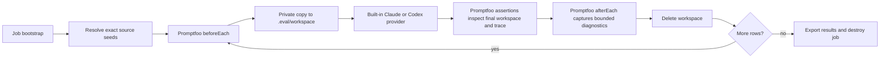

# Promptfoo Coding-Agent Evaluations - Implementation Plan

## Goal capsule

- **Objective:** Evaluate write-capable Claude and Codex agents against fresh,
  reproducible workspaces and grade their final filesystem state.
- **Means:** Run Promptfoo's built-in agent providers in one disposable job,
  using a lifecycle extension to copy an immutable seed into
  `.eval/workspace` before every row and remove it afterward.
- **Evaluation owner:** Promptfoo owns prompts, provider matrices, repetitions,
  assertions, scores, pass/fail decisions, OpenTelemetry traces, and reports.
- **Stop conditions:** Do not build an execution gateway, custom Promptfoo
  provider, agent adapter, ATIF converter, durable run service, or reusable
  session layer.

The authoritative decision is
[ADR 0002](../decisions/0002-use-promptfoo-native-agent-execution.md).
Primary-source findings are in
[Promptfoo native agent workspaces](../research/promptfoo-native-agent-workspaces.md).
The earlier
[one-shot gateway research](../research/one-shot-coding-agent-gateway-boundary.md)
is retained as analysis of the rejected hosted-service alternative.

## Product contract

One evaluation job owns one private `.eval` root. Job bootstrap materializes
exact source inputs once as read-only seeds. Promptfoo then runs every expanded
test/provider/repetition row serially:



The fixed provider working directory is:

```text
<config-directory>/.eval/workspace
```

The extension is lifecycle glue, not a provider. It never calls a model,
interprets agent output, assigns a reward, or replaces Promptfoo's provider
metadata and tracing.

## Scope

### Included

- Promptfoo configuration for `anthropic:claude-agent-sdk` and
  `openai:codex-sdk`.
- One source-staging command that creates immutable job-private seeds from
  declared local, Git, or OCI inputs.
- One JavaScript lifecycle extension implementing `beforeAll`, `beforeEach`,
  `afterEach`, and `afterAll`.
- One fixed `.eval/workspace` configured on every write-capable provider.
- Serial execution with Promptfoo response caching disabled.
- Deterministic JavaScript assertions over files, commands, provider metadata,
  and trace data.
- Promptfoo's built-in OpenTelemetry receiver and trajectory assertions.
- Result, trace, source-provenance, and bounded diagnostic artifacts retained by
  the surrounding job.
- Local and CI/VPS execution inside the same disposable container or VM shape.

### Excluded

- `allagentsdev/allagents-gateway` or another network execution service.
- A custom Promptfoo provider or local/remote provider mode.
- Queues, databases, idempotency APIs, artifact download APIs, leases, or
  cancellation protocols.
- Custom Claude, Codex, or OMP adapters.
- ATIF normalization or a second public trajectory format.
- Cross-row session or thread persistence.
- Concurrent rows sharing one workspace.
- Hidden verifier bytes that must be inaccessible to a shell-capable agent.
- Hostile multi-tenant isolation or caller-specific authorization policy.
- Checkpoints, resumable runs, workspace recovery, or generic patch export.

## Repository layout

Add the evaluation implementation to this repository:

```text
evals/coding-agent/
  promptfooconfig.yaml
  sources.yaml
  extensions/
    workspace.cjs
  assertions/
    workspace.cjs
  scripts/
    stage-sources.ts
  fixtures/
    ...
  .eval/                    # ignored, job-private runtime state
    seeds/
    workspace/
    artifacts/
```

The configuration, extension, assertions, and source catalog are checked in.
`.eval` is always generated and ignored.

## Fixed Promptfoo configuration

Start from this shape:

```yaml
description: AllAgents coding-agent evaluations

providers:
  - id: anthropic:claude-agent-sdk
    config:
      working_dir: ./.eval/workspace
      append_allowed_tools: [Write, Edit, MultiEdit, Bash]
      permission_mode: acceptEdits
      persist_session: false
      sandbox:
        enabled: true
        failIfUnavailable: true

  - id: openai:codex-sdk
    config:
      working_dir: ./.eval/workspace
      sandbox_mode: workspace-write
      approval_policy: never
      enable_streaming: true
      persist_threads: false

extensions:
  - file://extensions/workspace.cjs:workspaceLifecycle

evaluateOptions:
  maxConcurrency: 1
  cache: false

tracing:
  enabled: true
  otlp:
    http: {}

defaultTest:
  assert:
    - type: javascript
      value: file://assertions/workspace.cjs
```

Provider settings remain provider-specific:

- Claude receives only the explicit tools required by a case. Use
  `acceptEdits` for unattended edits, set `persist_session: false`, and require
  its sandbox with `failIfUnavailable: true`; do not use permission bypass by
  default.
- Codex uses `workspace-write`, `approval_policy: never`, explicit
  `persist_threads: false`, and its minimal process environment.
  `enable_streaming` supplies provider-level operation and turn spans.
- Do not enable provider thread or session persistence. Every row is a new
  attempt.
- Do not enable deep tracing globally. Add it to a focused configuration only
  when native SDK spans answer a specific question and their additional data
  exposure is acceptable.

The normal evaluation command uses `--no-cache` as defense in depth even though
the checked-in configuration sets `evaluateOptions.cache: false`.

## Case contract

Every test row supplies:

```yaml
vars:
  case_id: safe-stable-id
  source_id: staged-source-id
  task: rendered agent instruction
  check:
    command: [bun, test]
    timeout_ms: 120000
    expected_exit: 0
```

`case_id` and `source_id` are identifiers, not paths. Restrict them to a short
ASCII identifier grammar such as `^[a-z0-9][a-z0-9._-]*$`. The extension maps
`source_id` beneath its own resolved `.eval/seeds` directory and rejects
unknown identifiers, symlinks escaping the seed, and any resolved path outside
the evaluation root.

The extension assigns each expanded provider/test/repetition row a monotonic
`workspace_row_id` such as `000001-safe-stable-id` during `beforeEach` and
returns it in the test variables. Authors do not supply this value. It is the
artifact and receipt key, so repeated cases and provider matrices cannot
overwrite one another.

Checks are closed data consumed by the checked-in assertion module. A command
is an executable plus literal argument vector; it is never a shell string.
Cases cannot supply an environment map, arbitrary assertion module, working
directory, or cleanup command.

Promptfoo `metadata` is descriptive report data, not the execution control
plane. Repository URLs, refs, workdir paths, Git-cache settings, skill-copy
commands, and verifier commands belong in the checked-in source/workspace
catalog. A suite may select a catalog entry with `defaultTest.vars.source_id`;
the extension consumes that validated identifier. Keep suite metadata for
source links, experiment tags, and other annotations.

## Source staging

`scripts/stage-sources.ts` runs before Promptfoo. It reads `sources.yaml` and
materializes only source IDs used by the selected evaluation:

- local sources are copied from an explicitly allowed repository-relative
  path;
- Git sources resolve a requested ref to a full commit and check out that exact
  commit;
- OCI sources, when present, resolve and verify an exact manifest digest before
  extracting the declared filesystem content.

Each staged seed contains a provenance record with:

- source ID and kind;
- requested source and ref, when applicable;
- resolved Git commit or OCI manifest digest;
- materializer version; and
- a deterministic digest of the staged tree or source descriptor.

Staging uses private temporary directories and publishes a seed only after
materialization and verification succeed. Before Promptfoo starts, bootstrap
exposes published seeds through a read-only mount or transfers them to an
identity the unprivileged Promptfoo/agent user cannot modify. Mode bits owned by
that same user are not an immutability boundary. No credentials, Git
credential-helper responses, registry tokens, or temporary acquisition files
enter the seed.

Seeds are reusable only inside the current disposable job. V1 does not define a
cross-job cache, eviction protocol, or shared authorization boundary.

For a composed workspace, the source catalog defines non-overlapping
destinations and staging produces one complete seed tree. Composition happens
once during bootstrap rather than during every Promptfoo row.

## Workspace lifecycle extension

Export one extension function:

```javascript
module.exports.workspaceLifecycle = async function workspaceLifecycle(hookName, context) {
  // beforeAll | beforeEach | afterEach | afterAll
};
```

Resolve all paths from CommonJS `__dirname`, not `process.cwd()`.

### `beforeAll`

- Refuse to run when `.eval` or the selected seeds resolve outside the
  evaluation directory.
- Remove a stale `.eval/workspace` from an interrupted local run.
- Verify that every referenced source ID has a complete staged seed and
  provenance record.
- Create a fresh bounded artifacts directory for this evaluation.

### `beforeEach`

- Validate `context.test.vars.case_id` and `source_id`.
- Allocate the next unique `workspace_row_id` and add it to the returned test
  variables.
- Remove `.eval/workspace` unconditionally.
- Copy the selected read-only seed to a private temporary sibling.
- Never hardlink files or create another writable alias to seed content.
- Use a reflink/copy-on-write copy only when writes cannot reach the seed; use a
  full recursive copy otherwise.
- Make the private copy writable, then atomically rename it to
  `.eval/workspace`.
- Return the modified context so `workspace_row_id` reaches assertions and
  `afterEach`.

Any setup failure throws and prevents the provider call.

### `afterEach`

For deterministic-only rows, Promptfoo's normal path invokes `afterEach` after
provider execution and assertions. The hook:

- records the row ID, case ID, source provenance digest, and bounded workspace
  status in `context.result.metadata`;
- optionally copies explicitly allowlisted diagnostic files to
  `.eval/artifacts/<workspace-row-id>/`;
- removes `.eval/workspace` in `finally`;
- writes the row's success receipt only after diagnostics and cleanup finish;
  and
- writes `.eval/hook-failure.json` before throwing if diagnostic collection or
  cleanup fails.

Promptfoo currently catches and logs `afterEach` exceptions. Throwing is still
useful for logs, but it does not make the CLI exit nonzero. The job wrapper must
reject any run with a hook-failure sentinel, a surviving workspace, duplicate
row IDs, or a missing receipt for any Promptfoo result row.

The hook must not attempt to rewrite `success`, `score`, or `response.output`;
Promptfoo does not persist such overrides from `afterEach`.

### `afterAll`

- Verify that `.eval/workspace` is absent.
- Write a compact source/artifact manifest for the surrounding job.
- Remove remaining temporary directories.
- Leave only explicitly retained seeds or artifacts required by job export.

The job wrapper performs the authoritative post-Promptfoo sentinel, workspace,
receipt, and manifest checks. Disposable job teardown remains the final cleanup
boundary if Promptfoo or the extension process crashes before hooks complete.

## Deterministic workspace assertion

`assertions/workspace.cjs` receives `output` and Promptfoo's assertion context.
It resolves the same fixed workspace path independently of test-controlled
strings.

For each declared check it:

1. validates the closed check object;
2. resolves the executable from the disposable job's fixed `PATH`;
3. starts the executable directly with a literal argument vector and
   `cwd = .eval/workspace`;
4. enforces the per-check timeout and terminates the spawned process tree;
5. captures bounded stdout and stderr;
6. compares the actual exit status with `expected_exit`; and
7. returns a `GradingResult` with a factual reason and named scores.

Additional file assertions read only declared workspace-relative paths, reject
absolute paths and `..`, reject symlink escape, and bound bytes read.

The assertion is authoritative for filesystem behavior because a
deterministic-only row executes it before `afterEach` removes the workspace. The
hook may retain its summary for diagnostics but does not re-grade it.

Do not combine a live-workspace assertion with a model-graded assertion in the
same evaluation row. Promptfoo can defer the complete assertion set for grouped
model grading, allowing a later `beforeEach` to replace the shared workspace
first. When semantic grading is required, the deterministic evaluation must
serialize all required facts to a unique row artifact; a separate
evaluation grades that artifact without reading `.eval/workspace`.

Tests for the assertion cover:

- passing and failing exit statuses;
- timeout and process termination;
- missing executable and launch failure;
- stdout/stderr truncation;
- missing, non-regular, oversized, and symlink-escaping files; and
- an assertion observing an agent mutation before teardown.

## Traces and transcripts

Promptfoo OpenTelemetry is the only V1 trace model.

- Claude's built-in provider emits an `invoke_agent` span, per-turn markers,
  and completed tool spans; detailed tool calls also remain in
  `response.metadata.toolCalls`.
- Codex uses `enable_streaming: true` to emit provider-level turn, command,
  file, search, MCP, response, and reasoning-item spans where the SDK exposes
  them.
- Built-in `trajectory:*` assertions check tool use, arguments, sequence, step
  count, and goal success.
- JavaScript assertions may inspect `context.trace` when a built-in assertion
  is insufficient.

Retain the Promptfoo result export and trace JSON as job artifacts. These are
observability and evaluation records, not guaranteed lossless transcripts.
Provider coverage differs, subagent text may be summarized or omitted, and
native reasoning may be unavailable.

Do not add ATIF in V1. Add a converter only when a named downstream consumer
requires ATIF, and preserve explicit missing fields rather than inventing
content absent from Promptfoo/provider telemetry.

Trace retention and redaction need explicit job settings. Promptfoo's OTLP
receiver redaction does not filter all spans emitted by built-in providers
before local storage. The disposable trace store must contain no test variables
or custom attributes with credentials, and the job must delete local trace
storage after exporting approved artifacts.

## Isolation and security boundary

Run write-capable evaluations inside a disposable rootless container or VM with:

- source bootstrap separated from the unprivileged Promptfoo/agent user;
- `.eval/seeds` mounted read-only or owned by a non-agent identity;
- no host workspace mounted writable;
- no container runtime socket or host device access;
- a private writable evaluation workspace and artifacts directory;
- explicit CPU, memory, process, disk, and wall-time limits;
- network disabled unless the provider call requires an allowlisted endpoint;
  and
- only scoped credentials required by source staging and model access.

Source acquisition should finish before Promptfoo starts so acquisition
credentials can be removed. Model credentials remain provider concerns and must
not be copied into the workspace or test variables.

This is a trusted single-tenant evaluation design. It does not safely expose a
remote endpoint to arbitrary callers. It also does not guarantee that verifier
files elsewhere in the same job are hidden from an agent with shell access.

Agent-started background processes may outlive one tool call depending on the
provider runtime. V1 cases must not depend on persistent background services,
and disposable job teardown is the guaranteed process cleanup boundary. A
requirement for process-perfect row isolation changes the design to one
disposable sandbox per row.

## Failure semantics

- Source staging failure stops the job before Promptfoo.
- `beforeAll` or `beforeEach` failure prevents affected provider execution.
- Provider launch, timeout, or SDK failure remains a Promptfoo error row.
- A deterministic check returning the wrong exit status is a behavioral
  assertion failure, not an infrastructure error.
- Check launch failure, timeout, invalid configuration, or unsafe path is an
  assertion error with its exact cause.
- `afterEach` collection or cleanup failure writes a failure sentinel; the job
  wrapper fails the run even though Promptfoo itself only logs the hook error.
- A surviving workspace, missing source/artifact manifest, job export failure,
  or outer cleanup failure fails the job.

No automatic agent retry exists. Promptfoo repetitions are intentional new
attempts, each with a new workspace. Provider-internal transport retries remain
provider behavior and must be visible through its output or trace where
supported.

## Delivery phases and proof

### Phase 0 — Pin the native execution surface

Add Promptfoo and the two optional SDK dependencies at tested versions. Add the
evaluation directory, `.eval` ignore rule, configuration, and one read-only
fixture case.

**Proof:** Promptfoo validates the configuration and both providers resolve the
same absolute `.eval/workspace` from the config directory.

### Phase 1 — Stage exact reusable seeds

Implement the source catalog reader and staging command with local and exact
Git sources first. Add OCI materialization only when an initial case requires
it. Record source provenance and reject path escape, mutable published seeds,
credentials in output, and partial staging directories.

**Proof:** stage the same exact source twice in one job, observe one immutable
seed identity, and verify a failed staging attempt publishes nothing.

### Phase 2 — Reset one private workspace per row

Implement the lifecycle extension. Exercise two serial rows against one seed:
the first mutates and adds files; the second must observe only seed content.
Force an `afterEach` failure and verify the next `beforeEach` still deletes the
stale workspace before copying.

**Proof:** both rows start from the same seed digest, receive different writable
workspace instances, cannot mutate the seed, and leave no workspace after the
suite.

### Phase 3 — Grade the final filesystem

Implement closed command and file checks. Keep check programs outside the
workspace and treat them as trusted job code, not secret material. Add focused
tests for the behavioral and safety branches listed above.

**Proof:** a fixture agent mutation is visible to the assertion, a correct
change passes, an incorrect change fails with exact command/file evidence, and
cleanup runs after either outcome.

### Phase 4 — Capture native traces and metadata

Enable Promptfoo tracing, Codex streaming spans, Claude tool metadata, and
trajectory assertions. Configure approved result and trace exports plus local
trace-store deletion.

**Proof:** one Claude and one Codex run each show final output, usage when
reported, at least one provider/tool span for a tool-using case, deterministic
workspace evidence, and no ATIF artifact.

### Phase 5 — Run in the disposable job

Package the exact local and CI/VPS invocation in a rootless container or VM.
Apply resource, filesystem, environment, and network limits. Export results only
after Promptfoo and the extension finish, then destroy the job.

**Proof:** two consecutive jobs cannot see one another's workspace, seeds,
provider sessions, processes, or local trace database; approved result
artifacts remain available to CI.

## Focused release E2E

Run the built evaluation path, not an isolated test helper:

1. Build the disposable job image.
2. Stage an exact fixture repository revision.
3. Run Promptfoo with `maxConcurrency: 1`, caching disabled, and both built-in
   providers.
4. Give each provider a task that must edit a file and run a command.
5. Let the external assertion run the repository's deterministic check.
6. Repeat the case and verify the second row starts pristine.
7. Inspect Promptfoo output, provider metadata, and the trace timeline.
8. Verify the seed is unchanged and `.eval/workspace` is absent.
9. Export approved results/traces and destroy the container.
10. Start another container and verify no mutable state or provider session is
    present.

Record the exact source revision, image digest, Promptfoo/provider versions,
commands, and observed results in the eventual pull request.

## Completion checklist

- [ ] Promptfoo invokes Claude and Codex through built-in providers only.
- [ ] Every provider uses `working_dir: ./.eval/workspace`.
- [ ] `maxConcurrency: 1` and response-cache disablement are checked in.
- [ ] Source staging records exact immutable identities and leaks no credential
      material.
- [ ] Every row receives a fresh private copy and cannot mutate its seed.
- [ ] Setup failures stop provider execution; cleanup failures create a
      wrapper-checked failure sentinel.
- [ ] Live-workspace assertions are deterministic-only and execute before
      teardown; model grading, when needed, consumes separately persisted
      evidence.
- [ ] Assertions execute literal argument vectors with bounded output and time.
- [ ] Promptfoo results and OpenTelemetry traces are retained as the native
      evidence formats.
- [ ] No custom provider, gateway protocol, runner service, or ATIF conversion
      remains.
- [ ] Write-capable E2E runs inside a disposable rootless container or VM.
- [ ] The focused release E2E proves row and job isolation, grading, tracing,
      export, and cleanup.
