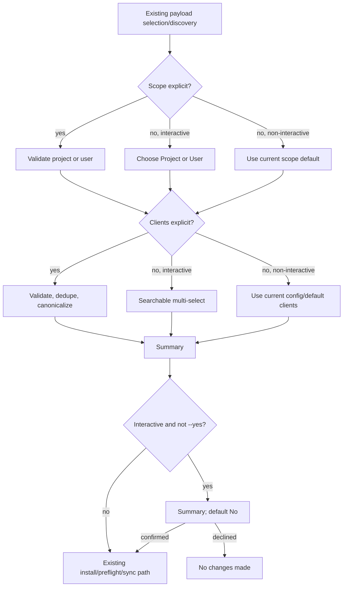

# Interactive Install Scope and Clients - Plan

## Goal Capsule

Add the useful `npx skills` interaction pattern to AllAgents installs without redesigning installation transactions or sync:

1. choose the plugin or skills;
2. choose project or user scope;
3. choose one or more clients;
4. review the target;
5. confirm.

The feature is primarily UX. Existing marketplace resolution, declaration installation, native preflight, and full-scope sync remain authoritative. The only required persistence change is storing the selected clients on the installed declaration when they differ from the selected scope’s configured clients.

## Product Contract

### Actors

- **Interactive CLI operator:** wants to see where an install will go before AllAgents writes config or client artifacts.
- **TUI operator:** expects the same target choices when installing from plugin or skill browsing.
- **Automation caller:** needs existing non-interactive defaults, no prompts, and explicit flags when a different target is required.

### Requirements

- **R1 — Scope choice:** Interactive new plugin and source-backed skill installs MUST offer project and user scope. If the project config path aliases the user config at `$HOME`, only user scope is valid and the UI MUST explain why.
- **R2 — Client choice:** After scope resolution, interactive installs MUST show a searchable client multi-select initialized from that scope’s configured clients, or its current first-config defaults. At least one client is required.
- **R3 — Target persistence:** If the selected client set equals the selected scope’s configured clients, the new declaration inherits them. If it differs, only the installed declaration receives a canonical `clients` override. Existing declarations and top-level clients remain unchanged. On first config creation, preserve the current behavior: the chosen clients initialize the scope defaults, so the summary MUST disclose that future installs inherit them.
- **R4 — Confirmation:** Interactive installs MUST show payload, scope/config path, clients, effective file/native methods, and whether the choice initializes defaults, inherits defaults, or creates an override. Confirmation defaults to **No**.
- **R5 — Flags:** Direct `plugin install` and new-source `skill add` routes MUST accept strict `--scope`, comma-separated `--client`, and `--yes`. `--yes` skips only the final confirmation; it does not choose payload, scope, or clients.
- **R6 — Automation compatibility:** JSON, CI, and non-TTY execution MUST never prompt. Omitted scope and clients retain current deterministic defaults and auto-apply without requiring `--yes`.
- **R7 — Existing-skill stability:** Re-enabling a skill or changing an allowlist on an already installed plugin stays on that declaration’s existing scope and clients and does not open the install chooser.
- **R8 — Cancellation:** Cancelling scope, clients, or confirmation exits without an error, reports that no changes were made, and occurs before declaration/config publication or client sync. TUI cancellation returns to the previous screen.

### Key Decisions

- **KD1 — Thin target resolver, existing executor.** Add one presentation-neutral helper for scope/client precedence and summary data. Do not add a shared transaction executor, new registry lifecycle, or new sync engine.
- **KD2 — Existing sync remains authoritative.** Use `buildPluginSyncPlans` to preview effective methods, then call the existing project/user sync path after installation. Do not introduce targeted-sync semantics or new outcome aggregation.
- **KD3 — Existing first-config behavior remains.** The selected clients seed a missing scope config, as today. Make this future-default consequence visible instead of changing it.
- **KD4 — Per-install differences stay local.** A subset becomes `plugins[].clients`; it never rewrites top-level clients or unrelated plugin entries.
- **KD5 — `--yes` means confirmation only.** Scripts bypass every prompt with explicit `--scope`, `--client`, and `--yes`; JSON/CI/non-TTY continue to auto-apply current defaults.
- **KD6 — Skill sources remain file installs.** A new declaration created by `skill add` keeps `install: file` and its allowlist while gaining the selected client target.

### Success Criteria

1. An interactive project install can select a subset of configured clients; only the new declaration is overridden and only those clients receive it.
2. A first user-scope install clearly states that its client selection becomes the user-scope default, then creates the same config shape as the current first-config flow.
3. An operator can identify payload, config path, clients, effective methods, and any future-default change before confirming.
4. Explicit flags produce the same config and client artifacts without scope/client prompts; `--yes` skips only confirmation.
5. Reinstalling an object declaration changes targeting without dropping its skills, install mode, excludes, ref, or unrelated fields.
6. Existing skill enable/allowlist operations remain prompt-free and do not retarget their plugin.
7. A built CLI plugin install can dogfood the complete interactive flow successfully.

## Evidence and Prior Art

- AllAgents currently prompts for clients only when a selected-scope config is missing and otherwise inherits configured clients: `src/cli/commands/plugin.ts`, `src/cli/tui/prompt-clients.ts`.
- `PluginEntry.clients` already provides the needed per-plugin override; `buildPluginSyncPlans` already resolves inherited versus overridden file/native targets: `src/models/workspace-config.ts`, `src/core/sync.ts`.
- Current project and user plugin writers accept strings and force-reinstall by replacing the old entry, so a targeted reinstall can lose object fields unless the localized writer change preserves them: `src/core/workspace-modify.ts`, `src/core/user-workspace.ts`.
- TUI plugin installation already asks for scope but not clients or confirmation: `src/cli/tui/actions/plugins.ts`.
- `npx skills@1.7.0` demonstrates searchable agent selection, explicit project/global scope descriptions, a summary, and confirmation: [`add.ts` at `7407f389`](https://github.com/vercel-labs/skills/blob/7407f3893ad4dceab546ac002c3ef806e4000c73/src/add.ts) and its [README](https://github.com/vercel-labs/skills/blob/7407f3893ad4dceab546ac002c3ef806e4000c73/README.md).
- `npx plugins@1.3.4` supports explicit `--target`, `--scope`, and `-y` but silently chooses defaults interactively. It supports the flag design, not the chooser UX: [bundle](https://unpkg.com/plugins@1.3.4/dist/index.js), [README](https://unpkg.com/plugins@1.3.4/README.md).

## Scope

### In Scope

- Interactive target selection for direct plugin install, new source-backed CLI skill installs, and corresponding TUI install entry points.
- `--client` and confirmation-only `--yes` flags.
- Scope-aware client labels and initial values.
- A shared summary-data model rendered by CLI and TUI.
- Localized project/user declaration persistence for client overrides while preserving object fields.
- Crash-safe publication of the targeted project/user config via the repository’s established same-directory temporary-write-and-rename pattern.
- Existing command metadata, structured help, user docs, changelog, focused regression tests, and built-CLI dogfood.

### Out of Scope

- New marketplace registration, staging, rollback, or registry ownership semantics.
- Cross-process config locks or a new atomic batch writer.
- A targeted sync API, per-client outcome algebra, or changes to sync success semantics.
- Source revision pinning or content freezing between summary and execution.
- A new JSON result schema beyond keeping existing JSON execution prompt-free and machine-readable.
- Redesigning update, uninstall, workspace client management, search payload semantics, or installation-method selection.
- Making multi-plugin skill actions transactional. Existing partial-failure behavior remains unchanged.

## Technical Design

### Interaction Flow

### Target Resolver

Add a small presentation-neutral module, expected at `src/cli/install-target.ts`, with no config writes or sync calls. It returns:

- `scope: 'project' | 'user'`;
- exact config path;
- canonical selected client names;
- persistence disposition: `initialize`, `inherit`, or `override`;
- the prospective declaration used only to call `buildPluginSyncPlans` for summary methods;
- summary rows consumed by CLI and TUI adapters.

Precedence is fixed:

1. validate explicit `--scope` / `--client`;
2. otherwise ask in interactive human mode;
3. otherwise preserve the command’s current scope/client defaults.

The module receives prompt ports. It does not import Clack, TUI actions, command handlers, JSON mode, marketplace mutation, or sync execution.

### UX Contract

- Scope choices:
  - **Project — this workspace**; show `.allagents/workspace.yaml`.
  - **User — all workspaces**; show `~/.allagents/workspace.yaml`.
- At `$HOME`, show a note that project and user config resolve to the same file, expose only User, and reject explicit project scope.
- Client choices use project mappings for project scope and user mappings for user scope. Show a native-install hint where no authoritative file destination exists.
- Existing config clients are initially selected. Missing configs use the same defaults the current installer uses.
- Submitting no clients keeps the chooser open with inline validation; it never silently selects `universal`.
- Summary order is identical across CLI and TUI:
  1. action and payload;
  2. scope and config path;
  3. clients and effective methods;
  4. `initializes scope defaults`, `inherits scope defaults`, or `plugin override`.
- Final confirmation defaults to No.
- Cancellation returns exit status 0 in CLI, prints `Install cancelled. No changes made.`, and returns the TUI to its previous screen.

### Localized Persistence Change

Extend the existing project and user plugin-write paths to accept the final targeted `PluginEntry` for the install being performed while keeping legacy string callers unchanged.

For the new target-aware call only:

- resolve/normalize the source through the existing add/auto-registration path;
- find the exact or semantic existing declaration using current rules;
- if reinstalling an object entry, merge the normalized source and requested client disposition into that object rather than replacing it with a string;
- omit `clients` for inheritance and store a canonical array for an override;
- preserve `skills`, `install`, `exclude`, `ref`, and unknown schema-preserved fields;
- leave every unrelated declaration and top-level client unchanged;
- publish the validated config with the repository’s established same-directory temporary-write-and-rename pattern, clean the temporary file on failure, and then call the current sync path.

No new batch transaction, lock, rollback, or registry operation is introduced.

### High-Risk Boundaries

Only these areas require code-review attention beyond dogfooding:

1. **Declaration preservation:** target-aware reinstall must not erase object fields.
2. **Ownership isolation:** a plugin override must not mutate top-level clients or unrelated declarations.
3. **Automation compatibility:** JSON/CI/non-TTY must not enter prompt code and must retain current defaults.
4. **Skill semantics:** a source-backed skill declaration must retain its allowlist and `install: file` while receiving target clients.
5. **Mutation ordering:** confirmation must precede the existing declaration write and sync call.
6. **Config crash safety:** interruption during publication must leave the previous config intact rather than truncated.

## Implementation Units

### U1 — Build the Scope/Client Resolver and Prompt UX

**Files:**

- `src/cli/install-target.ts` (new)
- `src/cli/tui/prompt-clients.ts`
- `tests/unit/cli/install-target.test.ts` (new)
- `tests/unit/cli/tui/prompt-clients.test.ts`

**Changes:**

- Implement explicit → interactive → existing/default precedence.
- Add scope-aware client options and initial values.
- Return summary data and `initialize`/`inherit`/`override` disposition without mutating state.
- Keep an empty interactive selection in the chooser with inline validation.
- Handle `$HOME` aliasing as one user scope.
- Keep non-interactive resolution prompt-free; `--yes` affects only the confirmation port.

**Focused proof:** option precedence, canonical deduplication, empty-selection recovery, home alias, first-config disclosure, confirmation default, and prompt calls suppressed in JSON/CI/non-TTY mode.

### U2 — Preserve Targeted Plugin Declarations

**Files:**

- `src/core/workspace-modify.ts`
- `src/core/user-workspace.ts`
- `src/models/workspace-config.ts` only if a shared target-aware write type is needed
- existing project/user writer unit tests

**Changes:**

- Add a target-aware form of the existing writer that accepts the final `PluginEntry` after current source normalization.
- Preserve existing public behavior for callers that still pass only a source string.
- Merge a forced reinstall into an existing object rather than discarding fields.
- Store canonical client overrides only when selected clients differ from top-level scope clients.
- Keep first-config creation behavior unchanged: selected clients initialize top-level clients and the declaration inherits them.
- Publish the validated config through a same-directory temporary file and atomic rename; preserve the existing file mode and remove the temporary file on failure.

**High-risk proof:** project and user tests for new override, inherited target, first config, object-field preservation, semantic match, unrelated-entry/top-level-client byte-equivalent semantics after parse, and an injected pre-rename failure that leaves the original config intact with no temporary file.

### U3 — Wire Direct Plugin CLI and TUI Install

**Files:**

- `src/cli/commands/plugin.ts`
- `src/cli/tui/actions/plugins.ts`
- `src/cli/metadata/plugin.ts`
- `tests/unit/cli/tui-plugin-install.test.ts` (new)
- `tests/unit/cli/structured-help.test.ts`
- `tests/e2e/plugin-install-options.test.ts` (new)

**Changes:**

- Add `-c, --client <name,...>` and `-y, --yes` alongside strict `--scope`.
- Resolve the target before the existing native preflight and declaration write.
- Preview effective methods with `buildPluginSyncPlans` using the prospective declaration.
- Render the shared summary, confirm, then call the existing add/preflight/sync path.
- Return a minimal TUI result containing installed/cancelled status and resolved scope so callers do not guess after installation.
- Remove the stale `--force` metadata claim; do not add force behavior.

**High-risk proof:** explicit flags equal interactive persistence, cancellation precedes add/sync, native preflight receives the selected target, reinstall preserves fields, and JSON/non-TTY never invokes prompt ports.

### U4 — Wire New Source-Backed Skill Paths

**Files:**

- `src/cli/commands/plugin-skills.ts`
- `src/cli/tui/actions/skills.ts`
- `src/cli/metadata/plugin-skills.ts`
- focused existing skill-add tests
- `tests/e2e/skill-install-options.test.ts` (new)

**Changes:**

- Invoke U1 once after the existing payload/skill selection and before the existing declaration mutation/sync boundary.
- Add `--client` and confirmation-only `--yes` to new-source `skill add` routes.
- Apply the selected clients to each new declaration using U2 without changing current batch ordering or failure semantics.
- Preserve `install: file` and the complete selected skill allowlist.
- Leave `skill add --list`, installed-skill re-enable, and installed-plugin allowlist changes unchanged and prompt-free.
- Have TUI skill callers consume the minimal resolved-scope result instead of re-querying user scope first.

**High-risk proof:** one new source and one multi-entry marketplace selection retain file mode/allowlists and target clients; existing-skill operations do not prompt or retarget; a failed/cancelled confirmation does not call declaration mutation or sync.

### U5 — Documentation and Cleanup

**Files:**

- `README.md`
- `docs/src/content/docs/docs/getting-started/quick-start.mdx`
- `docs/src/content/docs/docs/guides/plugins.mdx`
- `docs/src/content/docs/docs/reference/cli.mdx`
- `docs/src/content/docs/docs/reference/configuration.mdx`
- `CHANGELOG.md`

**Changes:**

- Document chooser order, first-config default consequence, per-plugin overrides, flags, and non-interactive behavior.
- Add a valid `plugins[].clients` example using `source`.
- Update command metadata and structured help.
- Remove temporary dogfood workspaces and any obsolete plan artifacts after implementation.

## Verification Contract

### Automated High-Risk Regression Proof

Run focused tests while implementing, then the repository gates once:

1. Project and user writer tests: selected override, inheritance, first-config initialization, object-field preservation, unrelated declaration isolation, and atomic publication failure safety.
2. Resolver tests: explicit/interactive/default precedence, `$HOME` alias, empty selection, confirmation-only `--yes`, and no prompt calls in JSON/CI/non-TTY.
3. Direct plugin E2E: interactive-equivalent flags write the expected target and sync only its effective clients; cancellation does not write config or sync.
4. Skill E2E: a new source-backed skill retains `install: file`, its allowlist, and selected clients; existing-skill re-enable remains unchanged.
5. `bun run typecheck`
6. `bun run lint`
7. `bun run build`
8. `bun test`
9. `bun run test:e2e`
10. `bun run docs:build`

Tests assert parsed config and resulting client files, not internal helper calls or source text.

### Manual Dogfood

Use the built CLI in isolated temporary project/HOME directories:

1. Create a project config with at least two clients.
2. Run interactive `plugin install` under `agent-tui`.
3. Choose Project, select one client, inspect the summary, and confirm.
4. Verify the declaration contains only the expected override and only that client receives the new plugin’s artifacts.
5. Repeat with `--scope user --client <client> --yes` to prove prompt bypass.
6. Start one install and cancel at confirmation; verify the command reports no changes and no declaration/client artifact was added.

Record the exact commands, selections, config diff, and artifact paths in the PR description. Additional copy, labels, navigation, and summary clarity can be evaluated during this dogfood pass rather than encoded as broad architectural tests.

## Risks and Mitigations

| Risk | Mitigation |
|---|---|
| Reinstall converts an object declaration to a string | U2 merge path plus project/user field-preservation tests |
| Client subset changes scope defaults or unrelated plugins | Persist only `PluginEntry.clients`; assert top-level clients and unrelated entries remain unchanged |
| First-config selection unexpectedly becomes the future default | Preserve current behavior and disclose it in chooser summary and docs |
| Interactive code runs in JSON/CI/non-TTY | Central mode gate with prompt-port tests and one E2E |
| Skill path loses `install: file` or allowlist | Dedicated skill E2E over parsed config and synced artifact |
| Scope/client summary differs from sync target | Build summary methods from the same prospective declaration using existing `buildPluginSyncPlans` |
| Interrupted config publication truncates `workspace.yaml` | Validate first, write a same-directory temporary file, then atomically rename; inject a pre-rename failure in project/user tests |
| Feature expands into installer transaction work | Explicit out-of-scope boundary; no sync, registry, lock, rollback, or result-schema redesign |

## Definition of Done

- Scope, clients, summary, and confirmation work for direct plugin and new source-backed skill install surfaces.
- `--scope`, `--client`, and `--yes` provide equivalent prompt-free targeting.
- JSON/CI/non-TTY behavior retains current defaults and never prompts.
- Targeted declarations preserve existing object fields and do not retarget unrelated plugins.
- Targeted project/user config writes are atomically published and preserve the prior file on failure.
- New source-backed skill declarations retain file mode and allowlists.
- Existing skill operations remain prompt-free and unchanged.
- Focused high-risk regressions and full repository gates pass.
- One built-CLI plugin install is dogfooded end to end, with exact evidence recorded for the PR.
- Documentation and changelog match behavior.
- No transaction executor, targeted sync API, cross-process lock, registry redesign, or source-freezing mechanism is introduced.
