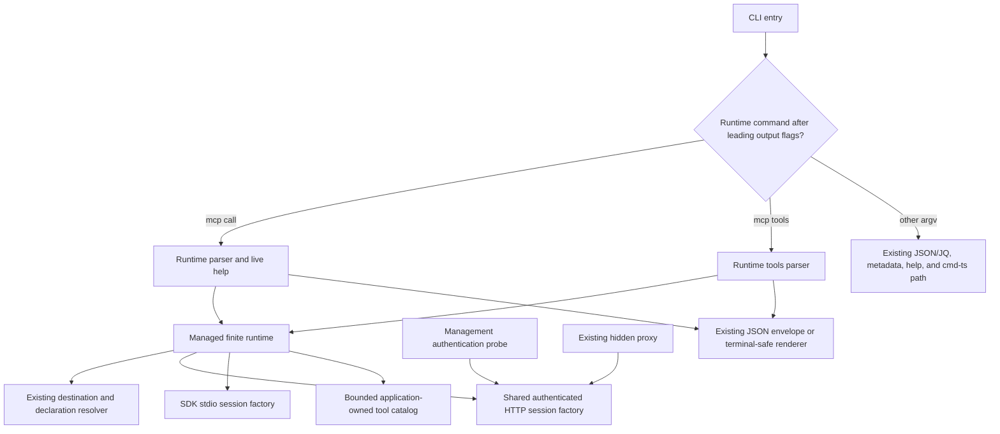
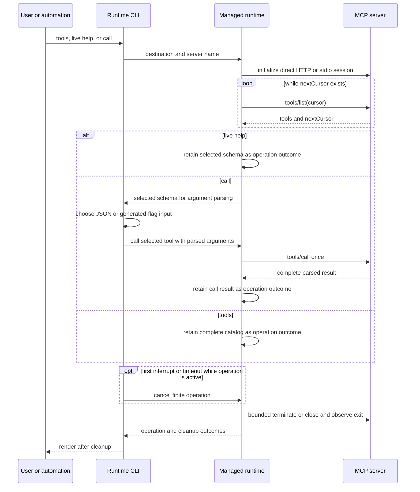
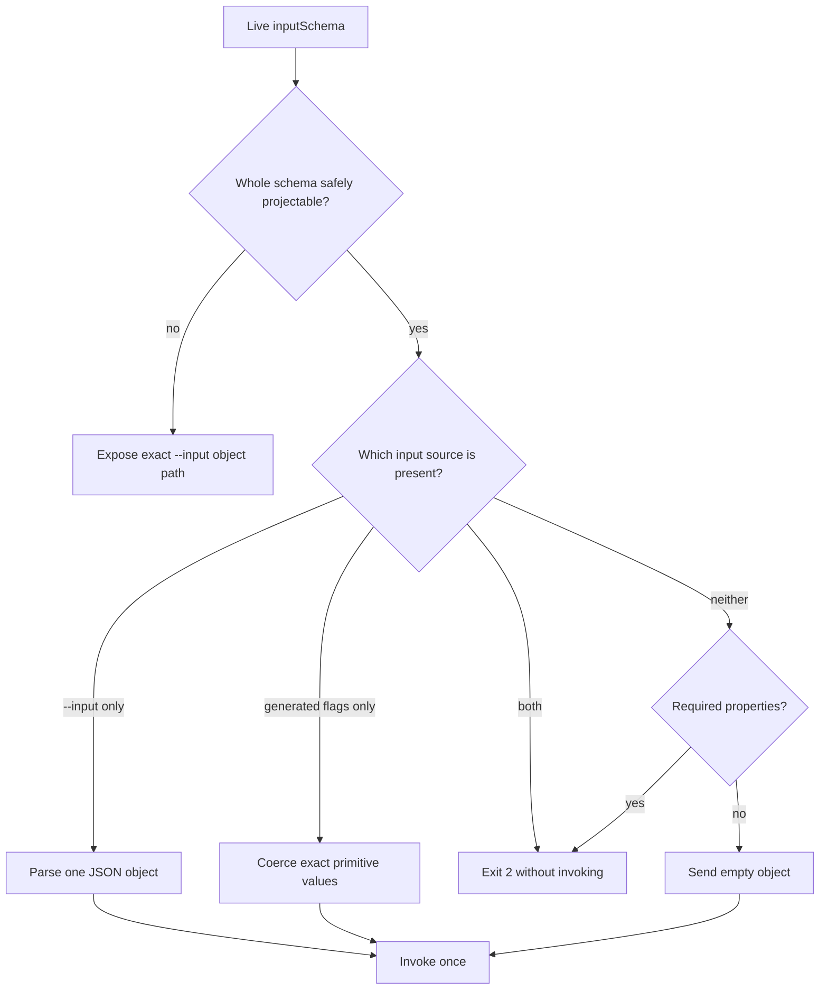

# Runtime MCP CLI - Plan

## Goal Capsule

- **Objective:** Humans and automation can inspect and invoke tools from any MCP server declared in the selected AllAgents destination without installing a separate MCP client or learning server-specific commands.
- **Means:** Add runtime-discovered `mcp tools` and `mcp call` commands over a shared direct MCP client boundary for authenticated Streamable HTTP and stdio transports. (KTD1, KTD4)
- **Authority:** The user-facing contract in this plan overrides implementation convenience; existing destination, JSON, help, terminal-safety, and authentication conventions override new local conventions; the installed MCP SDK and protocol define transport behavior.
- **Execution profile:** Begin with a failing built-CLI reproduction, implement in dependency order, run a final code review, then repeat the green built-CLI E2E before shipping.
- **Stop conditions:** Do not ship if runtime calls route through the hidden proxy process, if a configured secret appears in output, if live help can disagree with call parsing, or if a successful/error result can leave an HTTP session or stdio child running.
- **Tail ownership:** Update user-facing docs and changelog, commit explicit files with conventional messages, push `feat/mcp-runtime-cli`, and open a non-draft PR against `main`; do not merge.

---

## Product Contract

### Summary

Add a generic runtime MCP interface that discovers configured-server tools through live `tools/list`, displays their contracts, and invokes them through either exact JSON input or safe generated primitive flags.
The interface uses the same project, user, and profile destinations and the same authenticated connection state as existing AllAgents MCP management.
Automation is the primary v1 contract: complete JSON records, deterministic parsing, and non-interactive behavior decide scope conflicts. Human help, generated flags, and readable output are a required convenience surface over that same contract, not a separate source of truth.

### Problem Frame

AllAgents can declare, authenticate, synchronize, and proxy MCP servers, but it cannot currently use those declarations as a scriptable tool catalog.
Users must switch to another MCP client or know a server-specific wrapper even though AllAgents already owns the destination lookup, credential references, OAuth cache, and transport details.
Hard-coded subcommands would immediately drift from server capabilities, and routing AllAgents back through its hidden proxy would add a process boundary and duplicate its own connection lifecycle.

### Actors

- A1. **CLI user or automation** selects one declaration destination, discovers a live tool contract, and optionally invokes that tool.
- A2. **Configured MCP server** supplies the authoritative tool catalog and executes calls over Streamable HTTP or stdio.
- A3. **Human operator** performs fresh OAuth consent through the existing interactive `mcp add` or `mcp reauth` flow when cached credentials are insufficient.

### Requirements

**Discovery and command surface**

- R1. `allagents mcp tools <server>` MUST connect to the named inline declaration in exactly one selected destination and list every tool returned by paginated `tools/list`. Human output MUST emit one discovery-order block per tool with exact name, optional title, optional single-line sanitized description, and the fully qualified live-help command; an empty catalog and an empty search result MUST be distinct successful states.
- R2. `allagents mcp tools <server> --search <text>` SHOULD filter the complete discovered catalog with a deterministic case-insensitive substring match over tool name, title, and description while preserving discovery order.
- R3. `allagents mcp call <server> <tool>` MUST find the tool by exact case-sensitive name in a fresh live catalog and invoke it on the same connection used for discovery unless the descriptor requires the deferred MCP task lifecycle, in which case it MUST fail before `tools/call`.
- R4. Root and `mcp` group help MUST expose concise static entries for `tools` and `call`, while `mcp proxy` remains hidden and unchanged.

**Destination, authentication, and transport**

- R5. Both runtime commands MUST reuse the current destination contract: default project, `--scope user`, or `--profile <name>`, including mutual exclusion and the home-directory alias rule.
- R6. Runtime lookup MUST read only inline declarations from the selected destination and MUST NOT merge project, user, profile, or plugin-provided servers.
- R7. HTTP servers MUST use the existing authenticated Streamable HTTP core directly, including header reference resolution, cached token reuse, refresh, origin-safe header forwarding, and existing project/user versus profile credential ownership.
- R8. Runtime commands and live help MUST use public or cached/refreshable HTTP credentials without initiating fresh OAuth consent; authorization-required errors MUST name the exact `mcp reauth` recovery command for the selected destination.
- R9. Stdio servers MUST run directly through the MCP SDK with the configured literal command and arguments, configured environment entries and references, and the SDK safe inherited environment baseline. Native runtime execution MUST reject environment-reference tokens in argv because resolved values would be exposed through the host process list; the hidden proxy's existing compatibility behavior remains unchanged.
- R10. Every discovery, help, call, failure, timeout, and interrupt path MUST close its MCP client. HTTP sessions MUST attempt termination under a finite cleanup deadline before close, and stdio close MUST terminate and observe the child process exit.

**Input and live help**

- R11. `mcp call` MUST accept one `--input <json>` object without flattening, default insertion, key normalization, or schema-driven reconstruction.
- R12. `--input` MUST be mutually exclusive with every runtime-generated tool flag; destination and global output flags remain compatible with either input mode.
- R13. A wholly straightforward top-level input schema MUST expose generated flags for string, finite number, safe integer, boolean, homogeneous primitive enum, and repeatable homogeneous primitive array properties.
- R14. Required generated properties MUST be enforced locally; optional omitted properties MUST remain absent; booleans MUST accept explicit `true` or `false`; repeated arrays MUST preserve occurrence order.
- R15. A schema containing an unsafe or ambiguous property, collision, nested object, reference, union, composition, tuple, nullable type, or other unsupported construct MUST remain callable through `--input` and MUST NOT receive a partial generated-flag surface.
- R16. `mcp call <server> <tool> --help` and `--help --json` MUST connect, discover, and disclose the live description, exact input schema, required fields, generated flags when safe, and the reason for `--input`-only fallback.

**Output and failures**

- R17. Global `--json` output for discovery MUST preserve complete parsed tool records, including input/output schemas, annotations, execution metadata, icons, and `_meta` when supplied, subject only to the credential-reflection guard in R20.
- R18. Global `--json` output for calls MUST preserve the complete parsed MCP call result, including `content`, `structuredContent`, `isError`, `_meta`, and top-level extension fields, nested under the existing AllAgents JSON envelope with destination, server, and tool identity, subject only to the credential-reflection guard in R20. Human output MUST preserve `content` order, render sanitized text directly, render each non-text item as JSON, and render `structuredContent` once under a distinct label; a cleanup failure follows the operation output on stderr and forces exit 1.
- R19. A completed result with `isError: true` MUST remain available in output and exit nonzero; transport, protocol, lookup, schema, authorization, catalog-budget, response-budget, credential-reflection, and cleanup failures MUST use the existing structured error contract without fabricating a tool result.
- R20. Human output MUST sanitize every server-controlled name, description, error, and content value. Before any human or JSON rendering, the runtime MUST recursively detect whether a successful catalog or call result contains any configured header value, OAuth token, or resolved environment reference used by that connection and fail closed with a redacted operational error instead of emitting the payload. JSON output otherwise preserves protocol strings and MUST never include connection configuration, credential material, or resolved secret references.

**Compatibility and delivery**

- R21. Existing `mcp add`, `reauth`, `remove`, `list`, `get`, `update`, and hidden `proxy` behavior MUST remain compatible after the shared connection refactor.
- R22. The CLI reference and Unreleased changelog MUST document runtime discovery, generated flag eligibility, JSON fallback, destination/auth behavior, transport execution, output semantics, and live-help side effects.
- R23. Shipping MUST include a red/green built-CLI E2E over a real MCP fixture, focused automated coverage, final build/typecheck/lint/full tests, final review, explicit commits, push, and a non-draft PR with exact validation evidence.

### Key Flows

- F1. **Discover tools**
  - **Trigger:** A1 runs `mcp tools` with a server and destination selector.
  - **Actors:** A1, A2.
  - **Steps:** Resolve one declaration; connect directly; consume all tool pages; close; then render the complete filtered or unfiltered catalog.
  - **Outcome:** The command emits one complete catalog or one error, never a partial page stream.
  - **Covered by:** R1, R2, R5-R10, R17, R20.
- F2. **Inspect live tool help**
  - **Trigger:** A1 requests fully qualified call help.
  - **Actors:** A1, A2.
  - **Steps:** Resolve and connect; discover the exact tool; classify its schema; close; render live human or JSON help without invoking the tool.
  - **Outcome:** Help and later invocation use the same schema-classification rules.
  - **Covered by:** R3, R11-R16, R20.
- F3. **Invoke with one input mode**
  - **Trigger:** A1 supplies exact JSON, generated flags, or no arguments for an inputless tool.
  - **Actors:** A1, A2.
  - **Steps:** Discover the tool; reject task-required or unsupported input modes; build one arguments object; invoke once; close; render the result and exit according to `isError`.
  - **Outcome:** The server receives the intended JSON object once and the caller receives the complete parsed result.
  - **Covered by:** R3, R10-R20.
- F4. **Recover from missing consent**
  - **Trigger:** A runtime connection cannot proceed with public or cached/refreshable credentials.
  - **Actors:** A1, A3.
  - **Steps:** Close connection state; emit an error naming the selected declaration and exact `mcp reauth` selector; allow A3 to authorize separately and retry.
  - **Outcome:** Automation never opens a browser or prompt, and credential ownership remains explicit.
  - **Covered by:** R5-R8, R10, R19, R20.

### Acceptance Examples

- AE1. **Project discovery:** Given an HTTP declaration in the project workspace with two paginated tool pages, when the built CLI runs `mcp tools`, then it returns both pages in discovery order and leaves no active server session. Covers R1, R5-R7, R10, R17.
- AE2. **Primitive flag call:** Given a tool whose top-level schema contains required string, number, integer, boolean, enum, and primitive-array properties, when the built CLI calls it with generated flags, then the server observes correctly typed values and ordered repeated arrays. Covers R3, R13, R14.
- AE3. **Lossless JSON path:** Given a tool with nested objects, arrays, nulls, Unicode, empty strings, and unusual property names, when the caller uses `--input`, then the server observes the same parsed JSON object and no generated flag can be mixed into the call. Covers R11, R12, R15.
- AE4. **Live structured help:** Given a server changes a tool description or schema between runs, when `mcp call <server> <tool> --help --json` runs, then it reports the current live contract while root and `mcp` group help remain concise and offline. Covers R4, R16.
- AE5. **Cached profile authentication:** Given an authorized profile-scoped HTTP server with an expired access token and valid refresh token, when non-interactive JSON discovery runs with `--profile`, then it refreshes without consent and does not use ordinary-scope or another profile's cache. Covers R5, R7, R8.
- AE6. **Direct stdio cleanup:** Given a configured stdio fixture with environment references, when discovery, success, protocol error, or interruption ends, then the child receives the resolved configured environment and is terminated through the SDK lifecycle. Covers R9, R10.
- AE7. **Structured tool failure:** Given a tool returns `content`, `structuredContent`, `_meta`, and `isError: true`, when it is called with global `--json`, then the full result remains in `data`, the envelope reports failure, and the process exits nonzero. Covers R18-R20.

### Scope Boundaries

**In scope**

- Runtime access to inline MCP declarations in exactly one existing destination.
- Direct Streamable HTTP and stdio clients, paginated tool discovery, synchronous ordinary tool calls, static progressive command help, and fully qualified live tool help.
- Safe generated flags only when the whole tool input schema fits the supported projection.

#### Deferred to Follow-Up Work

- MCP task lifecycle, progress streaming, detached/background calls, polling, cancellation options, and resume semantics.
- Runtime caching or subscription to `notifications/tools/list_changed`; every command in this change discovers afresh.

**Outside this product's identity for this change**

- Hard-coded server tool subcommands, automatic tool selection, multi-tool orchestration, annotation-based authorization policy, or generated workflow commands.
- Merging plugin-provided servers into an inline destination lookup.
- A TUI tool runner or any public expansion of `mcp proxy`.

### Success Criteria

- A reviewer can reproduce tools discovery, live help, primitive flags, exact JSON input, structured output, cached auth reuse, all destination modes, stdio execution, and cleanup with the built CLI.
- Existing public MCP help remains progressive and the hidden proxy never appears in root, group, human, or structured help.
- No tool-specific name or argument is compiled into AllAgents source.

---

## Planning Contract

### Key Technical Decisions

- KTD1. **Separate transport session construction from finite runtime policy.** Move authenticated Streamable HTTP session construction, OAuth/cache ownership, and origin-safe header behavior into a transport-focused core used by three peers: the hidden proxy, the management authentication probe, and the managed runtime. The managed runtime depends on the existing declaration resolver plus HTTP/stdio session factories and owns finite catalog/invocation policy; neither shared transport code nor the proxy depends on the runtime CLI. Governs R5-R10, R21.
- KTD2. **Support stdio in the first release.** SDK 1.30.0 already provides direct shell-free spawning and bounded close escalation, and the declaration model already supplies command, arguments, and environment; an HTTP-only exception would add policy without reducing architecture. Governs R9, R10.
- KTD3. **Keep runtime authorization non-interactive.** Runtime discovery, help, and calls may use public, cached, or refreshable credentials, but fresh human consent remains in `mcp add` and `mcp reauth`; this keeps JSON and automation deterministic and preserves the existing explicit consent boundary. Governs R7, R8, R20.
- KTD4. **Preclassify both runtime commands before generic help and `cmd-ts` interpretation.** Non-destructively recognize `mcp tools` and `mcp call` after any legal leading global-output flags, then pass the untouched argv to one value-aware runtime parser that owns server/tool positionals, search, destination flags, global output flags, live help, input, and generated flags. Every non-runtime argv follows the existing extraction, metadata/help, update-check, and `cmd-ts` path unchanged. Static metadata owns root, group, and generic call help; only a call with both server and tool identity performs live discovery. Governs R1-R4, R12-R16, R21.
- KTD5. **Project the whole schema or fall back.** Generate flags only when every declared property is safely representable, names are exact portable long options, and the complete namespace has no reserved or normalization collision; otherwise expose only `--input`. Generated string and array values that begin like CLI syntax use the attached `--property=value` form; the parser never reinterprets that value as a global, help, destination, or separator token. This prevents partial or ambiguous surfaces that cannot construct a valid required object. Governs R11-R16.
- KTD6. **Keep tool metadata application-owned and bounded.** The managed runtime aggregates all `tools/list` pages, detects repeated cursors and duplicate tool names, and rejects more than 100 pages, more than 10,000 tools, more than 16 MiB of serialized aggregate metadata, schemas deeper than 64 nodes, or schemas with more than 100,000 nodes. The limits admit catalogs far beyond ordinary interactive use while bounding hostile input; reaching a limit is allowed and exceeding it fails without partial output. The aggregate is authoritative for help and calls because SDK 1.30.0 replaces its internal tool cache on every page. Required-task tools are rejected by this synchronous command. Governs R1-R3, R16-R19.
- KTD7. **Preserve safe parsed protocol values inside the existing envelope.** Discovery returns full parsed tool records and calls return the complete parsed SDK result after the credential-reflection guard; human rendering is a separate sanitized view. `isError: true` sets command failure without replacing tool diagnostics. Governs R17-R20.
- KTD8. **One finite operation owns exactly-once cleanup and both outcomes.** The managed runtime registers scoped cancellation after transport creation and funnels success, failure, timeout, and first-signal interruption through one idempotent awaited close. HTTP attempts session DELETE under a finite cleanup deadline, then closes streams to abort an unresponsive termination request; stdio uses SDK escalation and confirms process exit within a final bound. The boundary retains operation and cleanup outcomes independently so cleanup failure never erases a received tool result. Rendering begins only after cleanup settles; a second signal may force exit and the long-lived proxy remains outside this finite wrapper. Governs R10, R18, R19, R21.

### Assumptions

- The MCP SDK's parsed result object is the fidelity boundary. The named protocol fields and top-level extensions are preserved, but byte-for-byte wire JSON and unknown nested fields stripped by SDK schemas are outside this command's contract.
- `--input` uses strict JSON parsing and accepts one object. It preserves structure and JSON value types supported by the JavaScript/MCP SDK data model; unsafe integer literals are rejected rather than rounded.
- Generated flags use exact property names without camelCase or underscore normalization. Names outside the portable long-option grammar, reserved names, and boolean negation collisions make the entire schema `--input`-only.
- Boolean flags take an explicit `true` or `false` value. Primitive arrays use repeated occurrences; an empty array uses `--input` because zero occurrences means omission. A flag-looking string or array element uses `--property=--value`; the detached two-token form rejects an ambiguous flag-looking value before invocation.
- `clients` on a declaration controls synchronization only. An explicit runtime call to that inline declaration is not gated by the client filter.
- Runtime commands use the SDK's finite request timeout and do not add a timeout flag in this release; slow ordinary tools must adopt the protocol task lifecycle before timeout configurability is reconsidered.
- Every inbound MCP HTTP response or SSE event is capped at 16 MiB before SDK materialization. The same post-parse 16 MiB bound applies to stdio catalog pages and call results; budget failure aborts the operation and emits no payload.
- Tool annotations remain untrusted display metadata and do not authorize, block, or prompt for a call.
- Fresh discovery minimizes schema staleness but does not create a server snapshot. `notifications/tools/list_changed` subscription and the residual post-dispatch race are deferred with task/progress lifecycle work; calls are never retried.

### High-Level Technical Design

**Component and ownership flow**

The shared HTTP session factory owns authentication and transport construction, not command lifetime.
The proxy retains its session until the local stdio bridge closes, the management probe opens and immediately terminates a session, and the managed runtime owns one finite session through discovery/help/call cleanup.
The managed runtime owns catalog aggregation, invocation policy, cancellation, and outcome retention.
The CLI owns argv classification, rendering, and exit mapping.

**Discovery, help, and call sequence**

**Argument-mode decision flow**

### Sequencing

1. Establish the shared direct client and cleanup contract before exposing commands.
2. Build catalog aggregation and schema projection against the core contract.
3. Add the runtime pre-dispatch and public CLI metadata after parser behavior is testable in isolation.
4. Extend the real fixture and prove HTTP, stdio, auth, destination, output, and cleanup behavior.
5. Update docs and changelog only after the executable contract is green.

### System-Wide Impact

- **Authentication:** The refactor touches the OAuth provider and cache path used by `mcp add`, `mcp reauth`, and the hidden proxy. Configured headers remain bound to the MCP resource origin and subordinate to transport-owned authorization, session, protocol, content-negotiation, and framing headers on initial, refreshed, ordinary, and termination requests.
- **Process lifecycle:** Direct stdio help and discovery execute configured local code. The managed runtime takes ownership as soon as a transport is created, including connect failure and interruption. Native runtime rejects argument reference tokens so resolved values never enter host argv; stdio stderr is piped and bounded rather than inherited, and cleanup completion requires an observed child exit within a final deadline.
- **CLI parsing:** A non-destructive preclassifier recognizes both runtime commands after legal leading global-output flags before generic extraction. The runtime parser is value-aware, treats all remote names as data in `Map`, `Set`, or null-prototype records, and accepts a flag-looking generated value only in attached `--property=value` form.
- **Untrusted input:** HTTP bodies and SSE events are bounded before SDK parsing. Tool pages, names, descriptions, cursors, schemas, and call results remain subject to aggregate byte, count, and depth limits after parsing; budget failure emits no partial output and follows normal cleanup.
- **Agent parity:** JSON discovery and calls expose the complete parsed safe result after the credential-reflection guard. The human view may summarize but cannot become the authoritative machine contract.
- **Compatibility:** The proxy stays hidden and its exported invocation shape stays unchanged. Shared session factories move out of the proxy-owned module so proxy, management, and runtime remain peer consumers.

### Risks and Mitigations

- **Remote-controlled catalogs, schemas, and results can be unbounded.** Cap inbound response/event bytes before SDK parsing and enforce the explicit page, tool, aggregate-byte, schema-depth, and schema-node budgets afterward. Reaching a boundary succeeds; exceeding it aborts without partial output.
- **Remote names can collide with parser or object semantics.** Use explicit name maps and prototype-safe records. Invalid, reserved, normalized, boolean-negation, or prototype-sensitive collisions make the whole schema `--input`-only. Flag-looking generated values require attached `--property=value` form.
- **Configured headers can collide with transport security state.** Preserve same-origin forwarding and SDK-header-wins precedence. Never forward configured resource headers to OAuth or redirect origins, and never include header names or values in errors.
- **SDK pagination cache is page-local.** Maintain the complete authoritative aggregate in the managed runtime before exact lookup so duplicate names, required-task metadata, and catalog limits are deterministic.
- **A cleanup error can mask a useful result or hang forever.** Retain operation and cleanup outcomes separately. Bound HTTP termination, close to abort on expiry, report cleanup failure separately, and exit nonzero without discarding a received result.
- **Secrets can leak through errors, URLs, causes, child stderr, or a hostile server echo.** Resolve references only at connection time, reject native stdio argument references, pipe and bound stderr, and never replay raw child diagnostics. Project every error through credential-aware redaction, and fail closed if any successful payload contains a credential value used by the connection; apply `terminalSafe` only after the guard for human output.
- **SDK stdio close does not prove final child exit.** Preserve SDK escalation, then observe process exit within a final deadline. Install cleanup ownership before connect and make it idempotent across signal/error races.
- **The v1 SDK differs from current v2 documentation.** Implement against installed `@modelcontextprotocol/sdk` 1.30.0 and the 2025-11-25 protocol; do not import split v2 packages or assume the newer stateless lifecycle.
- **A schema can change after discovery.** Fresh same-connection discovery reduces but does not eliminate staleness. Do not retry a call; document the residual race and keep list-changed subscription deferred with task/progress lifecycle work.

### Sources and Research

- Existing destination and declaration authority: `src/core/mcp-servers.ts`.
- Existing OAuth, header reference, Streamable HTTP, and proxy behavior: `src/core/mcp-http-stdio-proxy.ts` and `src/core/mcp-management.ts`.
- Existing CLI metadata, JSON, and progressive-help conventions: `src/cli/index.ts`, `src/cli/help.ts`, `src/cli/structured-help.ts`, `src/cli/json-output.ts`, and `src/cli/metadata/mcp.ts`.
- Existing authenticated real MCP fixture: `tests/helpers/dummy-mcp-oauth-server.ts` and `tests/e2e/mcp-proxy-oauth.test.ts`.
- Installed SDK contract: `@modelcontextprotocol/sdk` 1.30.0 in `package.json` and `bun.lock`.
- MCP 2025-11-25 tools, pagination, transports, and authorization specifications: https://modelcontextprotocol.io/specification/2025-11-25.
- SDK 1.30.0 client guidance: https://github.com/modelcontextprotocol/typescript-sdk/tree/1.30.0/docs.

---

## Implementation Units

### U1. Shared managed MCP client lifecycle

- **Goal:** Create the direct, reusable HTTP/stdio client boundary while preserving existing proxy and management behavior.
- **Requirements:** R5-R10, R21; KTD1-KTD3, KTD8.
- **Dependencies:** None.
- **Files:** `src/core/mcp-http-client.ts` (new), `src/core/mcp-http-stdio-proxy.ts`, `src/core/mcp-management.ts`, `src/core/mcp-runtime.ts` (new), `tests/unit/core/mcp-http-stdio-proxy.test.ts`, `tests/unit/core/mcp-runtime.test.ts` (new), `tests/e2e/mcp-proxy-oauth.test.ts`.
- **Approach:**
  1. Move authenticated HTTP session construction, OAuth/cache ownership, and origin-safe header composition into the shared transport-focused module; keep the proxy export and command surface unchanged.
  2. Make proxy, management probe, and managed runtime peer consumers of the HTTP session factory, and add configured-server resolution over the existing destination/config unions.
  3. Add direct stdio construction with exact literal command/arguments, connection-time environment-reference resolution for configured child environment entries, safe inherited environment, piped bounded stderr, and no shell. Reject argument reference tokens before spawn.
  4. Register cleanup ownership before connect. Implement exactly-once cancellation, deadline-bounded HTTP termination followed by aborting close, SDK stdio escalation, bounded child-exit observation, and independent operation/cleanup outcomes.
  5. Keep fresh authorization disabled for runtime consumers while preserving interactive authorization for management commands. Capture every credential value used by the connection for redaction and reflection detection without exposing it on errors or result objects.
- **Patterns to follow:** OAuth cache/provider and header-origin code currently in `src/core/mcp-http-stdio-proxy.ts`; `connectConfiguredHttpServer` in `src/core/mcp-management.ts`; declaration lookup in `src/core/mcp-servers.ts`.
- **Test scenarios:**
  - A public HTTP declaration connects directly and closes its session without spawning an AllAgents proxy process.
  - Cached ordinary credentials are reused and refreshed, while profile A, profile B, and ordinary scope never load each other's cache.
  - Configured security-header collisions cannot override SDK authorization/session/protocol/framing headers, no configured header reaches OAuth or redirect origins, and reflected credential values fail closed before human or JSON output.
  - A missing header or environment reference fails before request/spawn and never appears in human or JSON errors, causes, URLs, or stderr; a stdio argument reference is rejected without resolution.
  - A stdio declaration receives configured literal args/env plus only the SDK safe inherited baseline; raw child stderr never escapes and success, connect failure, timeout, first signal, and protocol failure each produce exactly-once cleanup.
  - HTTP termination success, allowed 405, failure, or a DELETE that never responds still closes streams within the deadline; a child ignoring EOF/SIGTERM reaches SIGKILL and observed exit before rendering.
  - Existing proxy list/call forwarding and add/reauth connection checks remain behaviorally unchanged.
- **Verification:** All three HTTP consumers share one session factory, and a finite runtime operation leaves no session/child while retaining both operation and cleanup outcomes.

### U2. Runtime tool catalog and schema projection

- **Goal:** Produce one authoritative live tool catalog and one deterministic arguments object for safe schemas.
- **Requirements:** R1-R3, R11-R16, R17; KTD5, KTD6.
- **Dependencies:** U1.
- **Files:** `src/core/mcp-runtime.ts`, `src/cli/mcp-runtime-args.ts` (new), `tests/unit/core/mcp-runtime.test.ts`, `tests/unit/cli/mcp-runtime-args.test.ts` (new), `tests/helpers/dummy-mcp-oauth-server.ts`.
- **Approach:**
  1. Follow opaque `nextCursor` values until absent, preserve discovery order, and fail before output on repeated cursors, duplicate tool names, or the explicit page/tool/aggregate-byte limits; validate schema depth and node limits iteratively.
  2. Use the complete aggregate for exact case-sensitive lookup and reject `execution.taskSupport: required` before ordinary invocation.
  3. Classify the complete top-level input schema into generated-flag or `--input`-only mode using one shared model consumed by help and parsing.
  4. Map portable option names explicitly to exact JSON property names in prototype-safe structures; reserve global/destination/input/help names and fail the whole projection on collision.
  5. Parse strict JSON objects or typed generated flags without defaults, unknown keys, partial numeric parses, non-finite numbers, or unsafe integers. Require attached syntax for flag-looking generated string/array values.
- **Execution note:** Implement the schema classifier and parser test-first because small coercion or collision mistakes can invoke a remote side effect with the wrong arguments.
- **Patterns to follow:** SDK `Tool` and `ListToolsResult` types; existing `parseKeyValuePairs` error style in `src/core/mcp-servers.ts`; global flag ownership in `src/cli/index.ts`.
- **Test scenarios:**
  - Catalog aggregation includes empty and non-empty pages, forwards opaque cursors unchanged, accepts each exact limit, and rejects the first page/tool/byte/schema-depth/schema-node value beyond it without partial output.
  - Every supported scalar, homogeneous enum, and repeated primitive array becomes the expected JSON type and preserves array order.
  - Required values fail before invocation; omitted optional values stay absent; explicit boolean false remains false.
  - Nested objects, refs, combinators, nullable or multi-type properties, tuples, heterogeneous enums, unsafe names, reserved names, prototype-sensitive names, and collisions make the whole tool `--input`-only without mutating object prototypes.
  - `--input` preserves nested arrays/objects/null/Unicode/empty strings and unusual property names, rejects a non-object or unsafe integer, and rejects any generated tool flag in the same invocation.
  - Inputless tools send an empty object; required-task tools from an early pagination page fail before `callTool`.
- **Verification:** Human help and command parsing derive from the same classifier, and the fixture observes exactly one correctly typed arguments object or no invocation on error.

### U3. Public commands, live help, and result rendering

- **Goal:** Expose the runtime core through the existing progressive CLI and JSON contracts without changing unrelated command parsing.
- **Requirements:** R1-R4, R12, R16-R21; KTD4, KTD7, KTD8.
- **Dependencies:** U1, U2.
- **Files:** `src/cli/index.ts`, `src/cli/commands/mcp.ts`, `src/cli/help.ts`, `src/cli/structured-help.ts`, `src/cli/json-output.ts`, `src/cli/metadata/mcp.ts`, `src/cli/mcp-runtime-args.ts`, `tests/e2e/mcp-proxy-command.test.ts`, `tests/e2e/mcp-runtime-cli.test.ts` (new).
- **Approach:**
  1. Register static `tools` and generic `call` metadata so root/group structured help stays concise and discoverable.
  2. Preclassify both runtime commands after legal leading global-output flags before generic extraction; pass untouched argv to one value-aware parser and retain the existing path for every non-runtime argv.
  3. Make fully qualified human and structured help connect once, render the live classifier output, and stop before invocation.
  4. Render discovery as deterministic tool blocks and calls in protocol content order; keep structured content separately labeled, preserve full JSON records/results plus stable destination/server/tool context, and render distinct success messages for an empty catalog and an empty search.
  5. Guard successful payloads against reflected credentials and redact all operational errors before JSON output or terminal sanitization. Human content passes through `terminalSafe`; non-text and structured values render as JSON.
  6. Delay rendering until the managed runtime returns operation and cleanup outcomes; map usage errors to exit 2, operational/cleanup failures to exit 1, and `isError: true` to a preserved failed result with exit 1. After a received operation result, report cleanup failure separately on stderr without replacing stdout.
- **Patterns to follow:** `destinationArgs`, `resolveCommandDestination`, `runManagedMcpOperation`, and `serializeDestination` in `src/cli/commands/mcp.ts`; progressive registration in `src/cli/structured-help.ts`; envelope and `--jq` behavior in `src/cli/json-output.ts`.
- **Test scenarios:**
  - Root and `mcp` human/JSON help list `tools` and `call` but not `proxy`; generic call help performs no connection.
  - Fully qualified help reflects changed live descriptions/schemas in human and JSON modes, sanitizes hostile terminal text, and never invokes the tool.
  - Generated scalar/array values equal to `--json`, `--json=...`, `--jq`, `--help`, `-h`, or `--` round-trip only through attached `--property=value` syntax; ambiguous detached forms fail before invocation.
  - Leading global output flags and runtime values that resemble global flags route correctly for both `tools` and `call`; non-runtime parsing remains unchanged.
  - `--search` matches name/title/description case-insensitively and preserves complete discovery order; empty catalog and no-match human states are distinct while JSON returns an empty successful catalog.
  - Project, user, and profile selectors reach only the matching inline declaration; mixed selectors, missing profiles, servers, and tools use existing error conventions.
  - JSON output and `--jq` preserve complete safe call results and discovery records; reflected credential values fail closed. Human output preserves content order, labels structured content once, and reports cleanup failures separately.
  - `isError: true` emits the full result, reports failure, and exits 1; a transport failure emits no fabricated result.
  - All non-runtime commands retain their existing help and parsing behavior, including values that equal help tokens.
- **Verification:** The source-level CLI E2E covers every public command shape, exact exit code, stdout/stderr boundary, and hidden-proxy regression.

### U4. Real transport E2E and regression proof

- **Goal:** Prove the built Node CLI works end to end against authenticated HTTP and direct stdio fixtures across destinations and cleanup paths.
- **Requirements:** R5-R10, R13-R20, R23; AE1-AE7.
- **Dependencies:** U1-U3.
- **Files:** `tests/helpers/dummy-mcp-oauth-server.ts`, `tests/helpers/mcp-runtime-stdio-server.ts` (new), `tests/e2e/mcp-runtime-cli.test.ts`, `scripts/smoke-node-cli.mjs`.
- **Approach:**
  1. Extend the existing OAuth fixture with multiple tools/pages, primitive and complex schemas, captured arguments, mixed content, structured content, metadata, and tool errors.
  2. Add a deterministic stdio fixture that records inputs/env and exposes process-close observation without mocks.
  3. Reuse disposable home/workspace conventions to exercise project, user, and profile declarations without touching real state.
  4. Keep permanent E2E cases for the cross-layer contracts most likely to regress; use the built `dist/index.js` smoke for final proof rather than coupling every test run to a build artifact.
- **Execution note:** Start with a red built-CLI invocation showing `mcp tools` is absent, then preserve the exact fixture and commands for the final green PR evidence.
- **Patterns to follow:** temp-home and CLI spawning in `tests/e2e/mcp-add-proxy.test.ts`; OAuth counters/session inspection in `tests/helpers/dummy-mcp-oauth-server.ts`; Node distribution smoke in `scripts/smoke-node-cli.mjs`.
- **Test scenarios:**
  - Covers AE1. Built CLI discovers both HTTP pages, applies search, distinguishes empty/no-match human states, and reduces active session count to zero.
  - Covers AE2 and AE3. Primitive flags and exact JSON input reach the fixture unchanged and mutually exclusive validation prevents accidental calls.
  - Covers AE4. Live human/JSON help changes with the fixture while root/group help remains static.
  - Covers AE5. A prior authorization is reused and an expired token refreshes without a new authorization call; profile caches remain isolated. Missing consent never opens authorization and emits the exact project, user, or profile `mcp reauth` command.
  - Covers AE6. Built CLI launches stdio directly, resolves configured environment references, rejects argument references, suppresses raw child stderr, and observes child exit after help, success, connect failure, timeout, first signal, and protocol failure.
  - Covers AE7. Mixed ordered content, separately labeled structured content, `_meta`, explicit false, and `isError: true` survive safe JSON output with the expected exit codes.
  - Exact catalog limits and the first value beyond each limit, oversized inbound HTTP/SSE and stdio results, missing credentials, reflected secrets, server disconnects, invalid schemas, stuck HTTP termination, cleanup failures, secret-bearing child stderr, and header collisions fail once without partial output, credential leakage, active sessions, or child processes.
- **Verification:** A clean build followed by the recorded disposable-home commands proves the published Node artifact, not only Bun source execution.

### U5. User-facing reference and release notes

- **Goal:** Make the runtime contract reproducible without exposing internal proxy plumbing.
- **Requirements:** R22, R23.
- **Dependencies:** U3, U4.
- **Files:** `docs/src/content/docs/docs/reference/cli.mdx`, `docs/src/content/docs/docs/guides/mcp-proxy.mdx`, `CHANGELOG.md`.
- **Approach:** Add command syntax and examples, exact destination behavior, generated-flag eligibility, `--input` exclusivity, live-help network/process behavior, noninteractive auth recovery, direct stdio trust boundary, parsed-result/exit semantics, and task-required constraint. Update the proxy guide only where wording must distinguish the external-client bridge from native CLI calls.
- **Patterns to follow:** Existing MCP command tables and destination explanation in `docs/src/content/docs/docs/reference/cli.mdx`; concise Unreleased/Added bullets in `CHANGELOG.md`.
- **Test scenarios:** Test expectation: none -- documentation reflects the executable contracts already covered by U3 and U4.
- **Verification:** Every documented example maps to a command exercised by automated or built-CLI E2E evidence, and no public documentation tells users to run the hidden proxy.

---

## Verification Contract

| Gate | Commands or scenario | Coverage | Done signal |
|---|---|---|---|
| Red reproduction | Build the current CLI and run `dist/index.js mcp tools <fixture>` in a disposable workspace | R1, R23 | Command is absent or rejected before implementation, and the exact failure is recorded for PR evidence. |
| Focused core tests | `bun test tests/unit/core/mcp-runtime.test.ts tests/unit/core/mcp-http-stdio-proxy.test.ts` | U1, U2 | HTTP/stdio connection, auth scope, pagination and payload budgets, reference policy, credential guard, and bounded cleanup cases pass. |
| Focused parser tests | `bun test tests/unit/cli/mcp-runtime-args.test.ts` | U2 | Supported values coerce exactly; attached flag-looking values round-trip; every unsafe, ambiguous, or mixed input mode fails before invocation. |
| Focused CLI E2E | `bun test tests/e2e/mcp-runtime-cli.test.ts tests/e2e/mcp-proxy-command.test.ts tests/e2e/mcp-proxy-oauth.test.ts` | U3, U4 | Public commands, live help, destination/auth recovery, human output states, result fidelity, credential guards, and proxy regressions pass. |
| Build and static quality | `bun run build`, `bun run typecheck`, `bun run lint` | All units | Distribution builds cleanly with no TypeScript or Biome findings. |
| Full regression | `bun test`, `bun run test:e2e` | R21, R23 | Unit and E2E suites pass without touching user-owned state. |
| Built-CLI E2E | Run `node dist/index.js` against disposable HTTP/OAuth and stdio fixtures for tools, search, live help, primitive flags, JSON input, JSON/JQ output, auth refresh and exact reauth recovery, all destinations, budget/secret failures, and bounded cleanup | AE1-AE7 | Exact commands and observed outputs/exit codes are recorded in the PR; sessions and children return to zero. |
| Final review | Review the complete branch diff before the last green E2E | R1-R23 | All correctness, security, simplicity, and coverage findings are fixed or recorded as honest residual constraints. |
| Shipping | Explicit-file commits, branch push, and non-draft PR against `main` | R23 | PR URL exists, body includes design decisions plus exact validation steps/results, and the PR is not merged. |

---

## Definition of Done

- All R1-R23 requirements are implemented or an implementation-blocking conflict stops shipping.
- U1 proves one shared direct client boundary serves the existing proxy and new runtime commands without subprocess indirection for AllAgents' own calls.
- U2 proves catalog pagination and the safe schema projection produce deterministic, typed arguments or an explicit `--input` fallback.
- U3 proves progressive static help, live fully qualified help, global JSON/JQ output, terminal safety, and exit semantics.
- U4 proves the built Node artifact against real HTTP/OAuth and stdio transports, including cache reuse, destination isolation, and cleanup after errors.
- U5 documents only behavior that the built CLI evidence demonstrates and records the feature under Unreleased.
- Existing MCP management and hidden proxy tests remain green.
- Full build, typecheck, lint, unit, and E2E suites pass after actionable review fixes.
- Temporary workspaces, OAuth caches, fixture processes, and throwaway scripts are removed; no abandoned implementation attempt remains in the diff.
- Commits name the delivered behavior, the branch is pushed, and a non-draft PR against `main` contains exact reproducible validation evidence without being merged.
