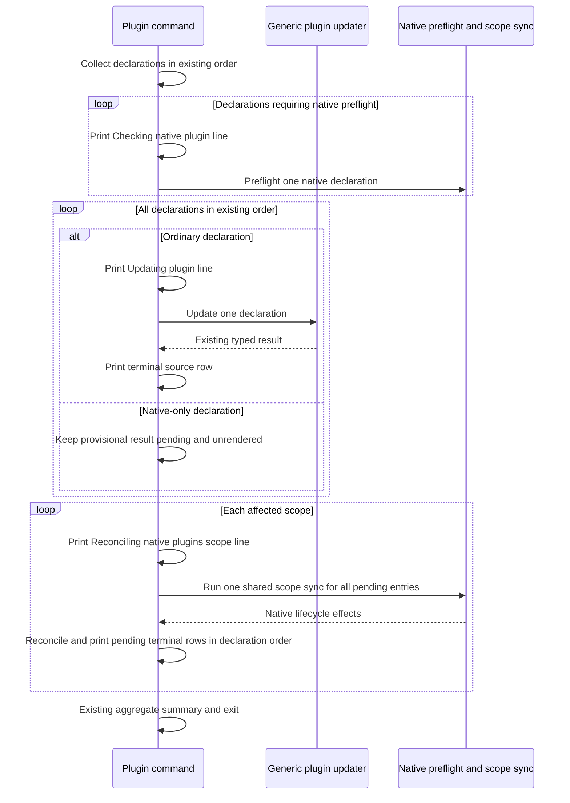

# Progressive Plugin and Skill Update Status - Plan

## Goal Capsule

- **Objective:** A person running a multi-source plugin or skill update can see which source AllAgents is processing before that source finishes, instead of waiting for one end-of-command result dump.
- **Means:** Add append-only TTY lifecycle output at the existing sequential source boundaries, plus narrow skill-update observer hooks where preflight and execution are separated (KTD1-KTD4).
- **Authority:** The Product Contract owns visible behavior. The existing typed plugin and skill results remain authoritative for statuses, totals, JSON, exit codes, and update semantics.
- **Execution profile:** Preserve current source order and mutation behavior, emit source starts before slow work, emit terminal source rows when existing results become authoritative, and retain the final aggregate output.
- **Stop conditions:** Stop before adding concurrency, changing public status values or JSON fields, weakening skill deletion/rollback guarantees, or broadening this work into workspace sync, marketplace update, or TUI flows.
- **Tail ownership:** Complete focused unit and built-CLI E2E coverage, update public help/docs and the changelog, then verify the actual terminal surface with local delayed Git sources.

---

## Product Contract

### Summary

Add progressive source visibility to the direct `plugin update` and `skill update` CLI flows. Interactive terminals announce each selected plugin declaration or physical skill source before its slow work and print its existing outcome as soon as that outcome is authoritative. Final summaries remain in place, while JSON and redirected human output retain their current one-shot behavior.

### Problem Frame

The reported RED behavior is source-backed. `skillUpdateCmd` prints one generic checking line, waits for inventory, sequential preflight, decisions, execution, and offline sync, then renders every unit result. `pluginUpdateCmd` updates all generic sources, performs scope sync and native-only reconciliation, then renders every result. A slow first source therefore makes both commands look stalled even though deterministic work is in progress.

`skills@1.7.0` demonstrates the useful minimum: it prints `Checking skills from source: <source>` before each sequential source check. AllAgents has stronger typed result and automation contracts, so this plan adds early visibility without copying the upstream command's lack of JSON support or weakening AllAgents' deletion, rollback, native reconciliation, and scope-sync behavior.

### Key Decisions

- **Cover both direct update commands.** Add progressive status to `plugin update` and every alias that reaches `skill update`. (session-settled: user-approved — chosen over changing only `skill update`: the user confirmed the full scope to close the same feedback gap for plugins and skills.) Governs R1-R8.
- **Preserve automation and non-interactive output.** JSON remains one parseable document and redirected human output retains its existing batched shape. (session-settled: user-approved — chosen over streaming every invocation: the confirmed scope improves interactive UX without destabilizing machine and pipe consumers.) Governs R4-R5.

### Requirements

**Live source feedback**

- R1. In non-JSON invocations with TTY stdout, lifecycle copy identifies both the source and the active phase before each slow phase begins: skill preflight and execution, ordinary plugin update, native plugin preflight, and shared native scope reconciliation.
- R2. A started source prints its existing `updated`, `removed`, `retained`, `skipped`, `failed`, or `cancelled` human result as soon as that typed outcome is authoritative. If a plugin operation rejects before producing a typed result, print the same source identity as a presentation-only failure and preserve the established fail-fast error path without adding a result object.
- R3. Progress labels use the existing source/unit display identity, sanitize terminal-controlled text, and add scope only when identical plugin declarations would otherwise be ambiguous.

**Compatibility and finality**

- R4. Existing result values, human outcome wording, aggregate counts, JSON fields and ordering, exit codes, prompt behavior, update order, and final summary placement remain unchanged.
- R5. JSON emits no lifecycle text on stdout or stderr, and non-TTY human output remains batched without cursor control or new progress records.
- R6. Skill progress does not reorder inventory, physical-unit preflight, deletion decisions, transactions, rollback, or one offline sync per affected scope; cancellation still occurs before the first mutation.
- R7. Plugin native-only entries do not settle from their provisional skipped placeholder; they settle only after matching native lifecycle effects are reconciled.
- R8. A source-level success is not command-final. Later scope-sync failures remain visible through the established sync result, overall failure, and nonzero exit behavior.

**Proof and communication**

- R9. Permanent tests prove that a source start is observable while controlled source work is still blocked, terminal rows preserve sequential finality, and JSON/non-TTY paths do not gain lifecycle output.
- R10. Structured help, the CLI reference, and the changelog describe progressive terminal status without promising changed-source detection, per-skill attribution, or concurrency.

### Acceptance Examples

- AE1. **Two skill sources.** Given two remote physical skill units and a delayed first source, when a TTY user runs `skill update`, then each unit prints a checking line during preflight, each unit prints an updating line when execution reaches it, each typed result follows that unit's execution, and the existing final summary remains last. Covers R1-R4, R6, and R9.
- AE2. **Two plugin declarations.** Given two ordinary plugin declarations and a delayed first update, when a TTY user runs `plugin update`, then `Updating plugin: <plugin><scope suffix>...` appears before each update awaits, its typed row appears before the next declaration starts, and scope sync and aggregate counts retain current behavior. Covers R1-R4, R8-R9.
- AE3. **Native-only plugins.** Given one or more native-only declarations, when the command preflights and syncs their scope, then `Checking native plugin: <plugin><scope suffix>...` appears before each awaited preflight, `Reconciling native plugins (scope: <scope>)...` marks the shared sync, and no skipped placeholder prints before effects classify each result. Covers R1-R2 and R7-R9.
- AE4. **Deletion decision and cancellation.** Given preflighted skill units with an upstream deletion, when the user confirms, declines, or cancels, then no source receives a success row before the decision, and cancellation settles all started units without mutation or sync. Covers R2, R4, R6, and R9.
- AE5. **Partial failure.** Given one failing source and one independent healthy source, when update runs, then the failure is printed when known, later work still follows the established command behavior, and final counts and exit status match existing results. Covers R2, R4, R8-R9.
- AE6. **Automation and pipes.** Given the same multi-source fixtures, when the command runs with `--json` or redirected stdout, then no lifecycle lines are added and the current JSON or batched text remains parseable and ordered. Covers R4-R5 and R9.

### Success Criteria

- With a controlled delayed source, the source-identifying TTY line is observable before the delayed Git operation is released and before the child process exits.
- Every source with any TTY lifecycle line reaches one terminal settlement: its authoritative typed result, or for an unexpected plugin rejection with no typed result, one presentation-only failed row before the established command-level error. Command-final success remains reserved for the aggregate completion point.
- Existing JSON E2E assertions continue to parse exactly one document with unchanged fields, statuses, counts, result ordering, and exit behavior.

### Scope Boundaries

#### Deferred to Follow-Up Work

- Progressive source status for top-level `allagents update` / workspace sync.
- Progressive status for `plugin marketplace update` and interactive TUI plugin-update actions.
- A repository-wide progress event bus shared by every update and sync path.

#### Outside This Delivery

- Concurrent source processing, background execution, persistent progress state, or retry orchestration.
- New public outcomes such as `up-to-date`, renamed totals, changed JSON schemas, or changed action-driven scope-sync behavior.
- Per-skill changed-content attribution, content fingerprints, or a redesign of physical refresh units.
- Spinner or cursor-rewrite output that would require terminal cleanup around deletion prompts.

### Sources and Research

- `src/cli/commands/skill-update.ts`, `src/cli/skill-update.ts`, and `src/core/skill-update.ts` — current inventory, preflight, prompt, transaction, rollback, sync, and delayed-render boundaries.
- `src/cli/commands/plugin.ts` and `src/core/plugin.ts` — current generic plugin loop, native-only placeholder reconciliation, scope sync, and delayed rendering.
- `tests/e2e/skill-update.test.ts` and `tests/e2e/plugin-update.test.ts` — existing local bare-remote, Git-wrapper, JSON, pseudo-TTY, and filesystem verification patterns.
- `docs/plans/2026-09-17-1211-perf-update-no-op-paths-plan.md` — current compatibility decisions: successful no-op checks still report existing update outcomes, and JSON/status/sync contracts stay stable.
- [`vercel-labs/skills` `src/update.ts` at `skills@1.7.0`](https://github.com/vercel-labs/skills/blob/7407f3893ad4dceab546ac002c3ef806e4000c73/src/update.ts) — primary-source precedent for sequential, pre-await `Checking skills from source` output.
- No institutional solution corpus exists under `docs/solutions/`.

---

## Planning Contract

### Key Technical Decisions

- KTD1. **Use append-only TTY lines.** Gate lifecycle rendering on non-JSON TTY stdout, independent of whether `--yes` suppresses prompts. Use stable newline-delimited output instead of a spinner so deletion warnings and confirmations cannot collide with cursor-managed state. Governs R1, R4-R5.
- KTD2. **Keep existing results authoritative.** Lifecycle rows are projections of the current plugin action or skill execution status. Do not add a second status model or reinterpret successful no-op checks. A source row describes source finality; only the established summary/exit path describes command finality. Governs R2, R4, R7-R8.
- KTD3. **Add observers only at unavoidable skill seams.** After inventory and filter validation, the skill command owns live-mode policy and constructs an optional observer; the CLI adapter only forwards it to the core loops that own source-start order and terminal finality. Observer payloads contain narrow primitive or read-only lifecycle facts, never mutable plan/result containers. The plugin command already owns its sequential loops and reports locally. Do not introduce a repository-wide event bus or put terminal I/O in core modules. Governs R1-R2 and R6-R8.
- KTD4. **Validate skill filters before lifecycle emission.** Separate inventory acquisition from remote preflight so the command can reject unmatched filters and decide live mode before it constructs or supplies an observer. Preserve inventory, grouping, filter matching, and exit 2 semantics. JSON, non-TTY, and unmatched-filter paths omit the observer. Governs R1-R2, R4-R6.
- KTD5. **Make observation best-effort and structurally separate from domain control flow.** Guard each notification at its boundary; a callback failure never escapes to the command catch, becomes a typed failure, changes the plan/result or exit code, or enters reconciliation, commit, restore, rollback, or sync catch regions. Record the authoritative result and finish any rollback before terminal notification. Commands track which terminal identities were rendered successfully. After the first presentation fault, disable further lifecycle notifications without retrying; at completion, run the established renderer for only authoritative rows not yet delivered, then attempt the normal summary. Ignore callback return values. Governs R2, R6, and R8.
- KTD6. **Use phase-specific append-only copy.** A source can reappear when work moves from checking to updating; each line names its phase so the latest line remains truthful. Use the canonical templates below, preserve the existing command banner and terminal outcome wording, and use one conditional plugin scope suffix format. Governs R1-R3 and R9-R10.
- KTD7. **Settle plugin starts on unexpected rejection without inventing results.** If native preflight or an ordinary update rejects after its start, print one presentation-only failed terminal row for that declaration and rethrow. If shared native sync rejects, print one such row for every still-pending native declaration in that scope and rethrow. Do not append synthetic result objects, change JSON, continue past the established fail-fast boundary, or replace the command-level error. Governs R2, R4-R5, and R8.

### High-Level Technical Design

#### Skill update lifecycle

```mermaid
sequenceDiagram
  participant C as Skill command
  participant A as CLI adapter
  participant P as Core preflight
  participant X as Core execution
  participant S as Offline scope sync

  C->>A: Build inventory
  A-->>C: Inventory and filter facts
  C->>C: Reject unmatched filters and decide live mode
  C->>A: Preflight selected units with optional observer
  A->>P: Forward observer
  loop Existing unit order
    P-->>A: Read-only source-start fact
    A-->>C: Render guarded start
    P->>P: Precheck or exact inspection
  end
  C->>C: Collect every deletion decision
  C->>A: Execute inspected plan with optional observer
  A->>X: Forward observer
  loop Existing unit order
    X-->>A: Read-only execution-start fact
    A-->>C: Render Updating skills from source
    X->>X: Settle branch; complete commit or rollback; append result
    X-->>A: Read-only terminal fact
    A-->>C: Render guarded terminal row
  end
  X->>S: Sync each affected scope once
  S-->>X: Existing scope result
  X-->>A: Read-only sync terminal fact
  A-->>C: Render guarded sync row
  C->>C: Existing aggregate summary and exit
```

#### Plugin update lifecycle



#### Output routing

| Mode | Lifecycle starts/results | Final output | Prompts |
|---|---|---|---|
| Human with TTY stdout | Stream append-only source lines | Preserve existing sync detail and summary | Existing stdin/stdout TTY and `--yes` rules |
| Human with redirected stdout | No new lifecycle lines | Preserve existing batched text | No redirected-input prompt behavior changes |
| JSON | No lifecycle lines on either channel | One unchanged JSON document | Never prompt |

#### Canonical TTY lifecycle copy

| Phase | Exact template |
|---|---|
| Skill preflight | `Checking skills from source: <source>` |
| Skill execution | `Updating skills from source: <source>` |
| Ordinary plugin update | `Updating plugin: <plugin><scope suffix>...` |
| Native plugin preflight | `Checking native plugin: <plugin><scope suffix>...` |
| Shared native reconciliation | `Reconciling native plugins (scope: <scope>)...` |

`<scope suffix>` is empty unless the same plugin identity exists in both project and user scope; when required it is exactly ` (scope: project)` or ` (scope: user)`. Terminal rows reuse the same sanitized source identity and the existing icons/status wording. Existing command banners remain before these lifecycle lines.


### Sequencing

1. Land the skill lifecycle seam and filter-validation boundary first because the command cannot report per-unit progress correctly without them.
2. Integrate skill TTY rendering and prove the terminal timing contract.
3. Integrate plugin command-local rendering, including native-only finality.
4. Update public descriptions and run the complete compatibility and terminal verification matrix.

### System-Wide Impact

- **Terminal users:** Long updates become visibly active and identify the current source without changing actual throughput.
- **Automation and agents:** `--json`, result schemas, exit codes, and redirected human output remain stable; no agent-facing action is added or removed.
- **Core safety:** Skill callbacks observe existing state transitions only. They do not participate in deletion decisions, transactions, rollback, or sync eligibility.
- **Performance:** TTY output adds one bounded line per entered lifecycle phase and moves each existing terminal result row to that source's authoritative completion point. Source processing remains sequential and does not allocate persistent progress state.

### Risks and Mitigations

- **A start line can precede a later global cancellation.** Settle every prepared skill unit as cancelled in existing plan order and preserve cancellation-before-mutation.
- **A source result can precede a later sync failure.** Keep source wording tied to the typed result and retain the established sync failure, aggregate, and exit path as command-final truth.
- **Mixed valid and invalid filters could leave dangling starts.** Move unmatched validation before remote preflight and before installing the TTY observer.
- **Native-only provisional results can lie or appear to reorder work.** Announce native-only entries before their awaited per-declaration preflight, keep them pending across subsequent declarations, run exactly one existing sync per affected scope, and render only reconciled effects in declaration order.
- **Duplicate declarations can look identical.** Add project/user scope to lifecycle labels when needed, while leaving JSON values unchanged.
- **Progress output could leak unsafe terminal controls.** Pass source labels and rendered error detail through `terminalSafe`; do not sanitize JSON.
- **Observers can accidentally become control flow or mutate authoritative state.** Supply only narrow primitive/read-only facts, guard callbacks outside every domain catch region, disable lifecycle delivery after the first presentation fault, and keep result/exit computation unchanged.
- **The latest start line can become stale across phases.** Emit a second, explicitly labeled skill execution start before each unit transaction and an explicit native scope-reconciliation line before shared sync.
- **An unexpected plugin rejection can strand a visible start.** Print a presentation-only failed row for the affected declaration or pending native scope entries, then preserve the existing rethrow, JSON error, and exit behavior without synthesizing results.

---

## Implementation Units

### U1. Skill lifecycle observation and filter gate

- **Goal:** Expose the existing physical-unit preflight-start, execution-start, and terminal-result boundaries without changing skill-update ordering or safety.
- **Requirements:** R1-R2, R4, R6, R8-R9; KTD2-KTD7.
- **Dependencies:** None.
- **Files:**
  - Modify `src/core/skill-update.ts`.
  - Modify `src/cli/skill-update.ts`.
  - Modify `tests/unit/core/skill-update.test.ts`.
  - Modify `tests/unit/cli/skill-update-command.test.ts`.
- **Approach:**
  1. Add optional observer ports to physical-unit preflight and execution. Emit narrow read-only checking and execution-start facts immediately before the existing per-unit precheck/inspection and per-unit transaction respectively.
  2. Route every execution branch through one authoritative result-recording boundary. Emit its narrow terminal fact only after the result is appended and the transaction or rollback catch has fully completed; emit cancellation notifications only after the complete cancelled result list exists.
  3. Guard every notification independently from domain work. A callback fault disables later lifecycle notifications but cannot skip inspection, trigger or repeat rollback, synthesize a failure, mutate returned results, or alter the exit computation.
  4. Split inventory from preflight enough for the command to validate unmatched filters before remote work and before supplying an observer. Reuse existing inventory and preflight builders rather than duplicating discovery.
  5. Let the production CLI adapter forward observer facts without giving core code terminal, Chalk, Clack, JSON, or TTY knowledge.
- **Execution note:** Add deferred-operation characterization coverage before changing the loops; the proof is event timing around existing awaits, not call-count padding.
- **Patterns to follow:** Dependency-injected async fakes in `tests/unit/core/skill-update.test.ts`; production adapter injection in `prepareSkillUpdate`; existing rollback assertions in `tests/unit/cli/skill-update-reconciliation.test.ts`.
- **Test scenarios:**
  - Given two deferred physical units, checking starts preserve preflight order, each execution start fires only when its unit's execution begins, and terminal results preserve execution order.
  - Given a mixed valid and unmatched filter set, inventory identifies the mismatch, exit-2 handling occurs before inspection, and the preflight caller supplies no observer.
  - Given each non-mutating terminal branch—preflight failure, out-of-scope block, retained deletion, and safe no-op—the observer receives a value-equivalent read-only projection of the authoritative typed result.
  - Given observer-side mutation attempts, the returned plan/results and aggregate computation remain unchanged.
  - Given a transaction failure and a throwing terminal observer, no terminal fact is delivered until config rollback and reverse checkout restoration finish; no second rollback, duplicate result, or changed combined error occurs.
  - Given a cancellation decision, the complete cancelled result list exists before notifications, every unit is reported in plan order, and no reconcile, advance, restore, or sync dependency runs.
  - Given a start or terminal observer that throws, preparation/execution continue, later independent units run, lifecycle delivery stops, and normal result/exit computation remains governed by domain work.
  - Given a scope-sync rejection, updated source results remain intact and the synthetic `sync:<scope>` failed result is observed after source units.
- **Verification:** The observer trace is a faithful, ordered projection of the returned plan/result and all existing deletion, rollback, and offline-sync tests remain behaviorally unchanged.

### U2. Progressive skill command output

- **Goal:** Show which physical skill source is being checked or updated in real time while preserving batched and machine-readable output elsewhere.
- **Requirements:** R1-R6, R8-R10; AE1 and AE4-AE6; KTD1-KTD6.
- **Dependencies:** U1.
- **Files:**
  - Modify `src/cli/commands/skill-update.ts`.
  - Modify `src/cli/metadata/plugin-skills.ts`.
  - Modify `tests/e2e/skill-update.test.ts`.
- **Approach:**
  1. Derive a live-output mode from TTY stdout and non-JSON mode, separate from prompt eligibility so `--yes` can remain prompt-free while still showing terminal progress.
  2. Render preflight starts as `Checking skills from source: <source>` and execution starts as `Updating skills from source: <source>`. Render terminal events through the existing status wording and channel policy; use `unitDisplayName` and `terminalSafe` for the shared identity.
  3. Keep local-source skips outside `result.units`; show them at the earliest stable inventory boundary in live mode without changing JSON or non-TTY placement.
  4. Track successfully rendered terminal unit identities. In healthy live mode, suppress the duplicate final unit loop; after a presentation fault, use that loop to render only authoritative rows not yet delivered before the summary. Preserve zero-source, cancellation, success-summary, failure, and exit behavior.
- **Execution note:** Start with a RED built-CLI pseudo-TTY scenario whose Git wrapper records entry into a chosen operation, waits on a test-owned release sentinel, then delegates to real Git. Read the source line while the entry sentinel exists and before releasing the wrapper; use bounded timeouts and release/cleanup in `finally`.
- **Patterns to follow:** The incremental pseudo-TTY stream reader, injectable Git wrapper, local bare remotes, and deletion prompt driver in `tests/e2e/skill-update.test.ts`.
- **Test scenarios:**
  - Covers AE1. With two delayed sources, the first checking line is readable while preflight is blocked; the ordinary no-prompt sequence is `check 1`, `check 2`, `update 1`, `terminal 1`, `update 2`, `terminal 2`, then the final summary.
  - A healthy equal unit still renders `Updated`, not a new up-to-date status, and preserves existing action-driven offline sync.
  - Covers AE4. Confirmed removal emits no success before the prompt and settles as removed only after commit; No settles retained; cancellation settles every started unit and mutates nothing.
  - A failed unit is printed once when authoritative, an independent healthy unit still follows current behavior, and no success `Done:` line appears on overall failure.
  - A forced presentation failure after one terminal row disables later live delivery, then the established final renderer prints only missing authoritative rows once before the summary; results and exit status remain unchanged.
  - A scope-sync failure appears after source rows, keeps the earlier source result, exits 1, and does not emit the success summary.
  - Covers AE6. Existing JSON scenarios still parse one unchanged document with empty stderr, and a redirected non-JSON run retains the established batched text without new lifecycle lines.
  - Local-only and empty inventories emit no phantom remote starts and preserve `No skill updates found.` and current exit behavior.
- **Verification:** The built CLI visibly streams skill-source starts/results under a pseudo-TTY, while JSON snapshots and redirected output stay compatible.

### U3. Progressive plugin command output

- **Goal:** Stream phase-specific per-declaration plugin status from the command's existing preflight, sequential update, and native-reconciliation boundaries.
- **Requirements:** R1-R5, R7-R10; AE2-AE3 and AE5-AE6; KTD1-KTD7.
- **Dependencies:** None.
- **Files:**
  - Modify `src/cli/commands/plugin.ts`.
  - Modify `src/cli/metadata/plugin.ts`.
  - Modify `tests/e2e/plugin-update.test.ts`.
- **Approach:**
  1. Keep native preflight fail-fast and declaration ordering unchanged. In live mode, print `Checking native plugin: <plugin><scope suffix>...` immediately before each awaited native-only preflight; the entry remains pending until reconciliation.
  2. In the existing declaration loop, print `Updating plugin: <plugin><scope suffix>...` immediately before an ordinary `updatePlugin` call and its existing row immediately after the typed result returns. Do not render native-only provisional placeholders.
  3. For each affected scope, print `Reconciling native plugins (scope: <scope>)...`, preserve exactly one shared sync covering every pending native-only declaration in that scope, then reconcile and settle those declarations in existing declaration order.
  4. If native preflight or an ordinary update rejects after its start, render one presentation-only failed row for that declaration and rethrow. If shared native sync rejects, do the same for each still-pending declaration in that scope and rethrow. Do not add synthetic results or continue beyond the current fail-fast boundary.
  5. Preserve the full `results` array as the sole source for counts, JSON, summary, and exit status. Track successfully rendered terminal declaration identities; in healthy live mode skip the duplicate final loop, but after a presentation fault use it to render only missing authoritative rows before the summary.
  6. Sanitize live labels/errors and use the canonical conditional scope suffix without changing stored result values.
- **Execution note:** Add a built-CLI pseudo-TTY helper and extend the Git-wrapper fixture with an entry/release sentinel handshake, bounded timeout, and unconditional release/cleanup. The test must read the expected line before releasing Git; complete-output ordering or TRACE2 counts alone do not prove streaming.
- **Patterns to follow:** Incremental `script -qefc` output reading in `tests/e2e/skill-update.test.ts` and `tests/e2e/plugin-install-options.test.ts`; local remotes, Git tracing, JSON projection, and `UpdateContext` deduplication in `tests/e2e/plugin-update.test.ts`.
- **Test scenarios:**
  - Covers AE2. Two generic, non-native-only declarations render `update A`, `result A`, `update B`, `result B` in existing order while the first controlled Git operation is blocked; sync detail and counts remain afterward.
  - Covers AE5. A typed failed declaration settles once, a later independent declaration still runs as today, counts remain result-derived, and exit status is 1.
  - Covers AE3. Two native-only declarations in one scope render both checking lines, then one reconciliation line and one shared sync; they emit no provisional skipped rows and settle in declaration order only after matching effects are known.
  - The same plugin spec in project and user scope receives the exact conditional scope suffix on starts and terminal identity, while JSON retains the existing two result objects and ordering.
  - A native preflight rejection prints one presentation-only failed row for its declaration, then follows the existing command-level error/exit path without entering the update loop.
  - An ordinary update rejection prints one presentation-only failed row and then follows the existing command-level error/exit path without a synthetic result or later declaration work.
  - A shared native sync rejection prints one presentation-only failed row for every pending declaration in that scope, then follows the existing command-level error/exit path without reconciliation placeholders becoming results.
  - A later typed scope-sync failure does not rewrite an ordinary source result; existing sync error data, aggregate counts, JSON error, and exit 1 remain authoritative.
  - A forced presentation failure after one terminal row disables later live delivery, then the final result loop prints only missing authoritative rows once; counts, summary, and exit status remain result-derived.
  - Covers AE6. JSON remains one document with no lifecycle text, and redirected human output preserves the current batched rows and summary.
  - Zero selected plugins emit no lifecycle rows and preserve the established human message and empty JSON result.
- **Verification:** A delayed built-CLI run proves per-declaration visibility before completion, and existing JSON/deduplication E2Es remain unchanged.

### U4. Public guidance and end-to-end UX proof

- **Goal:** Document the terminal behavior and verify the complete user-visible contract across both commands.
- **Requirements:** R9-R10.
- **Dependencies:** U2, U3.
- **Files:**
  - Modify `docs/src/content/docs/docs/reference/cli.mdx`.
  - Modify `CHANGELOG.md`.
  - Verify `src/cli/metadata/plugin.ts` and `src/cli/metadata/plugin-skills.ts` changes from U2-U3.
- **Approach:**
  1. Document that direct plugin and skill updates stream source status only when stdout is a terminal, while JSON and redirected output remain one-shot.
  2. Describe source progress as visibility, not changed-content detection or concurrency.
  3. Add an Unreleased changelog entry naming both commands and the preserved automation boundary.
  4. Exercise the built CLI in an isolated temporary workspace with at least two local Git sources and a controlled delay. Manually verify only the distinct terminal surface: pre-completion phase visibility, prompt usability, terminal-row ordering, and the durable final summary.
- **Execution note:** Use `agent-tui` for that focused interactive smoke path after automated E2E is green; rely on U2-U3 for partial-failure, JSON, redirected-output, and filesystem compatibility. Record the exact temporary-workspace setup and observed lifecycle order for the PR description.
- **Patterns to follow:** Existing skill-update safety prose in the CLI reference; Added entries in `CHANGELOG.md`; repository manual E2E guidance in `AGENTS.md`.
- **Test scenarios:** Test expectation: none — this unit documents and manually verifies behavior already covered by U2-U3 automated tests.
- **Verification:** A reviewer can reproduce the live progress behavior from the PR's E2E steps, and public guidance does not imply any new update semantic.

---

## Verification Contract

| Gate | Command or evidence | Proves |
|---|---|---|
| Skill lifecycle | `bun test tests/unit/core/skill-update.test.ts tests/unit/cli/skill-update-command.test.ts tests/unit/cli/skill-update-reconciliation.test.ts` | Observer timing and finality preserve filtering, cancellation, rollback, result typing, and offline sync. |
| Built skill CLI | `bun test tests/e2e/skill-update.test.ts` | A bounded Git entry/release handshake proves preflight-time TTY output, skill phase ordering, deletion decisions, partial failures, JSON silence, redirected output, and filesystem outcomes. |
| Built plugin CLI | `bun test tests/e2e/plugin-update.test.ts` | A bounded Git entry/release handshake proves ordinary interleaving; native-only coverage proves one shared scope sync, pending finality, scope disambiguation, deduplication, JSON compatibility, and exit behavior. |
| Full unit suite | `bun test` | Optional observer additions and command rendering do not regress other callers, including TUI callers that omit progress hooks. |
| Build and types | `bun run build` and `bun run typecheck` | The production bundle and every changed exported dependency contract compile. |
| Lint | `bun run lint` | Changed TypeScript follows repository static conventions. |
| Interactive runtime proof | Built `dist/index.js` under `agent-tui` in a temporary workspace with two delayed local remotes | Phase-specific lines appear before delayed work completes, prompts remain usable, terminal rows settle once in order, and the final summary remains durable. |
| Automation compatibility | Built `plugin update` and `skill update` with `--json`, plus redirected non-JSON stdout | JSON is one unchanged document; pipe output retains the established batched shape and contains no cursor-control sequences. |

The RED baseline is the current implementation and reported trace: both direct commands print only a generic banner during slow source work, and source rows arrive after the complete orchestration path. The GREEN runtime proof must use a test-owned entry/release sentinel: observe the source line after Git enters its wrapper but before the test releases that operation, then release in `finally` and await completion. Final text order or TRACE2 counts alone are insufficient.

---

## Definition of Done

- R1-R10 and AE1-AE6 are satisfied without changing update ordering, mutation semantics, prompts, status unions, JSON schemas, or exit codes.
- Every source with any TTY lifecycle line has one terminal settlement: an authoritative typed result where available, otherwise a presentation-only plugin failure before the unchanged fail-fast command error. Native-only entries can remain pending across later declarations but settle only after their scope's single shared sync; rolled-back failures do not settle early, and a presentation fault falls back to rendering only undelivered authoritative rows.
- Mixed unmatched skill filters fail before remote progress starts, and cancellation remains global-before-mutation.
- Targeted unit/E2E tests, the full unit suite, build, typecheck, and lint pass.
- `agent-tui` verifies the built CLI with delayed local sources and confirms usable deletion prompts and durable summaries.
- Structured help, CLI reference, changelog, and PR reproduction steps match the shipped behavior.
- No temporary delay hooks, fixture artifacts, duplicate render paths, abandoned reporter abstraction, or stale planning notes remain in the final diff.
