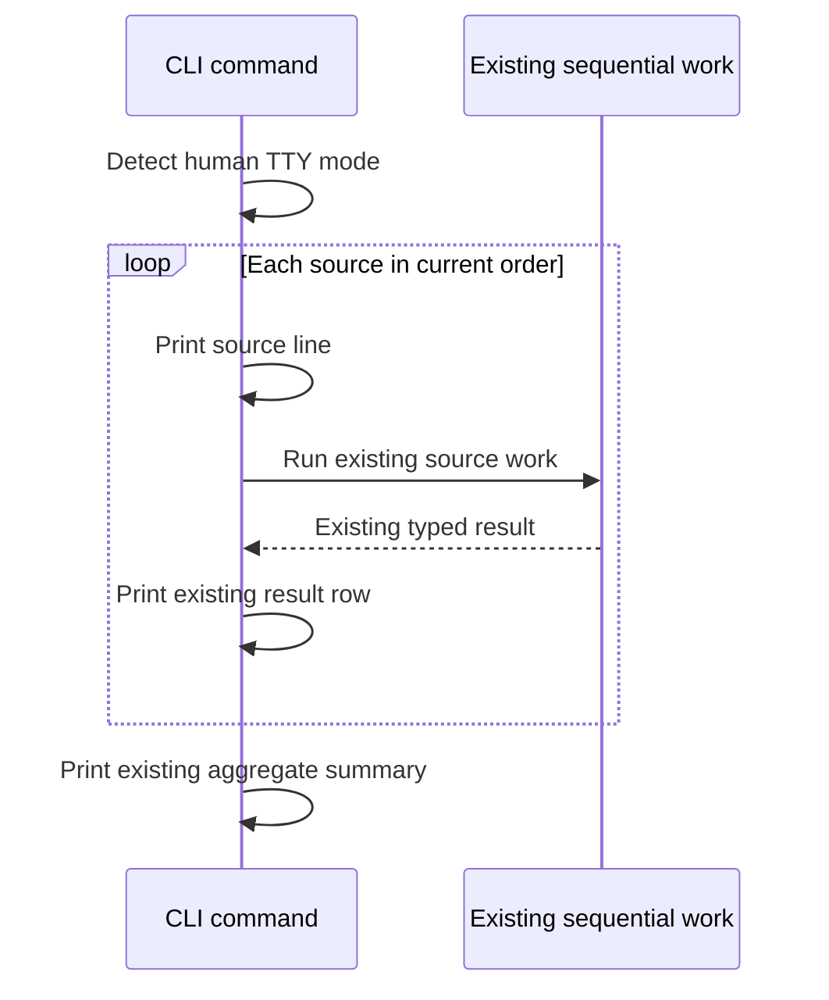

# Progressive Plugin and Skill Update Status - Plan

## Goal Capsule

- **Objective:** A person running a multi-source plugin or skill update can see which source AllAgents is processing instead of waiting for one end-of-command result dump.
- **Means:** Follow the `npx skills update` pattern: print an append-only source line immediately before slow source work, then print the existing result when that source settles.
- **Authority:** Existing typed results remain authoritative for statuses, totals, JSON, exit codes, and update semantics.
- **Stop conditions:** No spinner, cursor rewriting, concurrent updates, synthetic outcomes, delivery tracker, global event bus, or reusable progress framework.

---

## Product Contract

### Summary

Add progressive source visibility to direct `plugin update` and `skill update` CLI flows. Interactive terminals show source work as it starts and existing outcomes as they become available. JSON and redirected human output remain unchanged.

### Problem Frame

The RED behavior is confirmed by the reported transcript and current orchestration. `skillUpdateCmd` and `pluginUpdateCmd` await multi-source work before rendering source-specific rows, so a slow source makes the command look stalled. `skills@1.7.0` solves the same feedback gap by printing `Checking skills from source: <source>` before each sequential source check.

### Key Decisions

- **Cover both direct update commands.** Add progressive status to `plugin update` and every alias that reaches `skill update`. (session-settled: user-approved — chosen over changing only `skill update`.)
- **Preserve automation output.** JSON remains one parseable document and redirected human output retains its current batched shape. (session-settled: user-approved — chosen over streaming every invocation.)
- **Prefer the smallest implementation.** Add only the callback seams required to expose existing sequential skill boundaries; keep plugin reporting inside its command.

### Requirements

- R1. In non-JSON invocations with TTY stdout, identify each selected remote source immediately before its existing slow source operation begins.
- R2. Print the existing human result row as soon as the current typed source outcome is available; keep the aggregate summary last.
- R3. Preserve existing result values, wording, counts, JSON fields and ordering, exit codes, prompts, update order, rollback, deletion decisions, and sync behavior.
- R4. Emit no progressive lifecycle text in JSON mode or redirected human output.
- R5. Sanitize terminal labels and add project/user scope only when duplicate plugin identities would otherwise be ambiguous.
- R6. Prove real streaming with a blocked local Git operation; final-output ordering alone is insufficient.
- R7. In the interactive TUI's Plugins → Update all flow, keep the existing spinner and update its message with the current plugin or standalone skill source; keep the final results note unchanged.

### Acceptance Examples

- AE1. With two remote skill sources and the first Git check blocked, `Checking skills from source: <source>` is readable before the operation is released. Source checks remain sequential, existing result rows print when execution settles them, and the existing summary remains last.
- AE2. With two ordinary plugins and the first update blocked, the first plugin line is readable before release. Its existing result prints before the next ordinary plugin starts.
- AE3. Native-only plugins print a source line before native preflight, retain the current one-sync-per-scope behavior, and print results only after existing native-effect reconciliation.
- AE4. The same fixtures under `--json` or redirected stdout produce the current one-shot JSON or batched human output with no progressive lines.
- AE5. In Plugins → Update all, a delayed source changes the spinner message to identify that source before work completes, then the spinner stops once and the existing results note appears.

### Scope Boundaries

**Included**

- Direct `plugin update`.
- Canonical and alias entry points that share `skill update`.
- TTY-only append-only source lines and earlier rendering of existing result rows.
- Interactive TUI Plugins → Update all source visibility.

**Excluded**

- Workspace sync, marketplace update, and unrelated TUI actions.
- Concurrency, background work, new spinners, cursor rewriting outside the existing TUI spinner, retries, or persistent progress state.
- New public statuses such as `up-to-date` or any JSON schema change.
- Per-skill changed-content attribution.

### Sources

- `src/cli/commands/skill-update.ts`, `src/cli/skill-update.ts`, `src/core/skill-update.ts` — current skill inventory, preflight, execution, rollback, sync, and delayed rendering.
- `src/cli/commands/plugin.ts`, `src/core/plugin.ts` — current plugin update loop, native-only reconciliation, scope sync, and delayed rendering.
- `tests/e2e/skill-update.test.ts`, `tests/e2e/plugin-update.test.ts` — local Git remotes, wrappers, JSON coverage, and pseudo-TTY patterns.
- [`vercel-labs/skills` `src/update.ts` at `skills@1.7.0`](https://github.com/vercel-labs/skills/blob/7407f3893ad4dceab546ac002c3ef806e4000c73/src/update.ts) — sequential pre-await source output precedent.

---

## Planning Contract

### Key Technical Decisions

- KTD1. **Use plain lines, not terminal state.** Gate progressive output on non-JSON TTY stdout and use newline-delimited `console` output. `--yes` affects prompts, not progress visibility.
- KTD2. **Keep progress local.** The plugin command already owns its source loop. Skill core receives only narrow optional callbacks for the two boundaries the command cannot otherwise observe: source preflight start and typed result availability.
- KTD3. **Keep current results authoritative.** Progress does not create outcomes. It renders the same result objects the command already uses for counts, JSON, summaries, and exit status.
- KTD4. **Validate skill filters before remote progress.** Build inventory first, reject unmatched filters, then begin preflight so usage errors do not leave dangling source lines.
- KTD5. **Reuse the TUI's existing spinner.** The TUI is a separate caller and will not inherit CLI console lines. Update its current spinner message at the same source boundaries; do not print append-only rows while the spinner is active or change the final note.

### High-Level Flow

Skill update keeps its current two phases: every selected physical source is announced during sequential preflight, then typed results stream from the existing execution loop. Plugin update keeps its current declaration loop and one shared native sync per affected scope.

The interactive TUI's Plugins → Update all action already owns one Clack spinner. It reuses the same narrow skill start callback and its existing generic-plugin loop to change only `spinner.message(...)`; it does not reuse CLI rendering.

### Risks and Mitigations

- **Filtering currently happens after skill preparation.** Separate inventory from remote preflight only enough to validate filters before source lines or network work.
- **Native-only plugin placeholders are provisional.** Do not print them; wait for the existing effect reconciliation.
- **A source result can precede a later sync failure.** Keep the current sync error, overall failure, and exit path; a source row is not command-final.
- **Duplicate plugin declarations can look identical.** Add a scope suffix only for the ambiguous project/user case.
- **A timing test can pass without proving streaming.** Block a Git operation with entry/release sentinels and assert the line arrives before release.
- **CLI lines would clash with the TUI spinner.** Keep rendering policy at each caller: append-only lines in direct CLI commands, message replacement in the existing TUI spinner.

---

## Implementation Units

### U1. Stream skill source progress

- **Goal:** Expose current skill source work without changing update semantics.
- **Files:**
  - Modify `src/core/skill-update.ts`.
  - Modify `src/cli/skill-update.ts`.
  - Modify `src/cli/commands/skill-update.ts`.
  - Modify `tests/unit/core/skill-update.test.ts`.
  - Modify `tests/e2e/skill-update.test.ts`.
- **Approach:**
  1. Return inventory before remote preflight so the command can reject unmatched filters first.
  2. Add narrow optional callbacks for physical-unit preflight start and typed execution result availability. Call them at the existing sequential loop boundaries; do not add a reporter class or event system.
  3. In human TTY mode, render `Checking skills from source: <label>` from the start callback and render each existing status row from the result callback.
  4. Keep JSON and non-TTY paths on the current batched renderer. In TTY mode, avoid printing the same result rows again at the end.
  5. Preserve local-source skips, deletion prompts, cancellation, transaction rollback, one offline sync per affected scope, summaries, and exit behavior.
- **Test scenarios:**
  - Two deferred units invoke starts in current preflight order and results in current execution order.
  - An unmatched filter exits before preflight and emits no source start.
  - Rollback and cancellation produce the same typed results and mutations as before.
  - A pseudo-TTY test blocks the first Git check, observes its source line before release, then verifies existing result rows and summary.
  - JSON and redirected human output contain no progressive lines.
- **Verification:** The real built command shows the current skill source before delayed Git work completes, with unchanged final results and filesystem state.

### U2. Stream plugin source progress

- **Goal:** Render plugin declarations from the command's existing sequential boundaries.
- **Files:**
  - Modify `src/cli/commands/plugin.ts`.
  - Modify `tests/e2e/plugin-update.test.ts`.
- **Approach:**
  1. Detect the same human TTY mode used by skill update.
  2. For ordinary declarations, print `Updating plugin: <label>...` immediately before `updatePlugin`, then print the existing result row after it returns.
  3. For native-only declarations, print a source line immediately before the existing native preflight. Keep provisional results hidden until the current shared scope sync and effect reconciliation finish.
  4. Preserve `results` as the only source for JSON, counts, summary, and exit status. In TTY mode, skip only the duplicate final result loop.
  5. Reuse existing label formatting and terminal sanitization; append scope only for duplicate project/user identities.
- **Test scenarios:**
  - Two ordinary declarations show start/result/start/result in current order while the first Git operation is blocked.
  - Native-only declarations show a source line before preflight and settle only after existing reconciliation.
  - A failed typed result, later scope-sync failure, and zero-plugin case retain current counts and exits.
  - JSON and redirected human output remain unchanged.
- **Verification:** The built command identifies the active plugin before delayed source work completes and retains current native sync and result behavior.

### U3. Keep TUI progress smooth and document the UX

- **Goal:** Give Plugins → Update all the same source visibility without replacing its existing spinner or result note, then document both surfaces.
- **Dependencies:** U1, U2.
- **Files:**
  - Modify `src/cli/tui/actions/plugins.ts`.
  - Modify `tests/unit/cli/tui-plugin-update.test.ts`.
  - Modify `src/cli/metadata/plugin.ts`.
  - Modify `src/cli/metadata/plugin-skills.ts`.
  - Modify `docs/src/content/docs/docs/reference/cli.mdx`.
  - Modify `CHANGELOG.md`.
- **Approach:**
  1. Before each generic plugin update, change the existing spinner message to identify that plugin.
  2. Supply U1's narrow skill-source start callback during standalone-skill preflight and use it to change the same spinner message.
  3. Keep the spinner active through current work, stop it once, and preserve the existing `Update Results` note and cache invalidation.
  4. Document that direct CLI commands use append-only lines while the TUI updates its existing spinner message. JSON and redirected output remain one-shot.
  5. Add an Unreleased changelog entry.
  6. After automated coverage is green, use `agent-tui` with delayed local sources to navigate Plugins → Update all and verify message changes, keyboard flow, one spinner stop, and the final results note.
- **Test scenarios:**
  - Generic plugin updates change the spinner message in existing update order.
  - Standalone skill preflight changes the spinner message through the shared narrow callback.
  - Mixed generic and standalone updates retain the existing final result note, counts, cache effects, and sync behavior.
- **Verification:** `agent-tui` observes the current source before the delayed operation is released and the unchanged final note after completion.

---

## Verification Contract

- `bun test tests/unit/core/skill-update.test.ts tests/unit/cli/skill-update-command.test.ts tests/unit/cli/skill-update-reconciliation.test.ts`
- `bun test tests/e2e/skill-update.test.ts tests/e2e/plugin-update.test.ts`
- `bun test tests/unit/cli/tui-plugin-update.test.ts`
- `bun test`
- `bun run build`
- `bun run typecheck`
- `bun run lint`
- Focused `agent-tui` run against the built direct CLI commands and Plugins → Update all with delayed local remotes.

The GREEN timing proof must observe a source line after a wrapper records entry into Git but before the test releases that operation. Release and cleanup belong in `finally` with bounded timeouts.

---

## Definition of Done

- TTY users see the current plugin or physical skill source before slow source work completes.
- Existing typed outcomes print progressively and remain the only authority for counts, JSON, summaries, and exit status.
- JSON and redirected human output remain unchanged.
- Skill filtering, prompts, deletion safety, rollback, and offline sync retain current behavior.
- Plugin ordering, deduplication, native reconciliation, and scope sync retain current behavior.
- Plugins → Update all identifies the current source through its existing spinner, stops the spinner once, and retains the existing final results note.
- Targeted tests, full tests, build, typecheck, lint, and the focused terminal smoke pass.
- Help, CLI reference, changelog, and PR reproduction steps match the shipped behavior.
