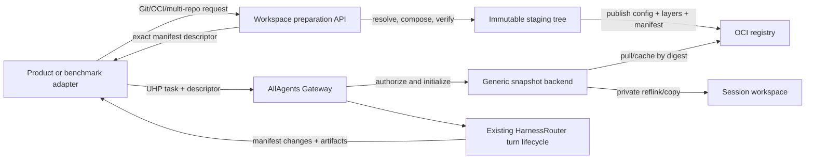

# Prebuilt immutable workspace snapshots at the HarnessRouter boundary

## Decision

AllAgents Gateway should consume **one prebuilt immutable workspace snapshot**, while a separate preparation plane owns Git resolution, OCI acquisition, credentials, multi-repository composition, source policy, provenance generation, and snapshot publication.

The execution boundary should be one direct, digest-pinned OCI image-manifest descriptor. The gateway should never receive Git URLs, refs, per-repository destinations, source credentials, tags, indexes, or caller-selected registry locations. It should authorize the descriptor against one operator-configured snapshot repository, materialize a private writable session tree, establish an exact filesystem-manifest cursor, and then enter HarnessRouter's existing turn lifecycle.

This should be implemented in **two source repositories**:

1. `allagents-workspace-builder`: product-specific Git/OCI/multi-repository preparation and immutable snapshot publication.
2. `allagents-gateway`: the stock-derived execution distribution, carrying only a generic immutable-snapshot initializer, explicit-cursor Git-independent journal, and recoverable turn finalizer until equivalent seams land upstream.

This recommendation reverses the current runtime-composition boundary in [ADR 0002](../decisions/0002-adopt-uhp-through-harnessrouter.md) and its [implementation plan](../plans/2026-09-18-0837-feat-coding-execution-gateway-plan.md).

## Evidence points

The accepted baseline is HarnessRouter commit [`5f82db1`](https://github.com/HarnessRouter/harnessrouter/commit/5f82db1d1f13ea25b8ed0893c38b5b7d2e3e57e3). The current source point inspected here is [`8f7868c`](https://github.com/HarnessRouter/harnessrouter/commit/8f7868ccb2c97d1f611acf11e7cad0357a43064e), seven commits later in the [comparison](https://github.com/HarnessRouter/harnessrouter/compare/5f82db1d1f13ea25b8ed0893c38b5b7d2e3e57e3...8f7868ccb2c97d1f611acf11e7cad0357a43064e). Release [`v0.25.6`](https://github.com/HarnessRouter/harnessrouter/releases/tag/v0.25.6) points to `fbcb731`; `8f7868c` is a later commit. HarnessRouter code claims below therefore use pinned `8f7868c` links, with the accepted baseline cited separately.

The inspected baseline and current source retain the same relevant workspace architecture: a per-session directory, internal checkpoint hydrate/tar routes, root-Git produced-file cursoring, gateway capture-before-ack, and one-file `BACKING.workspace` access. Compare the baseline runner's [`/hydrate`, `/checkpoint`, `_produced_list`, and `_produced_ack`](https://github.com/HarnessRouter/harnessrouter/blob/5f82db1d1f13ea25b8ed0893c38b5b7d2e3e57e3/runner/server.py#L6968-L7176) with the current implementations cited below.

## Three meanings of workspace

These terms must not be collapsed:

| Term | Meaning | Owner |
| --- | --- | --- |
| HarnessRouter product **Workspace** | Security/product-integration boundary containing API keys, configured agents, sessions, and returned files | HarnessRouter control plane |
| UHP/session filesystem workspace | Working directory and file namespace shared by the responses in one session | HarnessRouter session/runner |
| Repositories in the filesystem | Ordinary directory trees that may contain independent `.git` metadata | Snapshot preparation and tools operating in the session |

HarnessRouter's product documentation defines a Workspace as “the boundary for one product integration” and says API keys, configured agents, sessions, and files live in it; it also tells integrating products to retain their own user, tenant, session, response, and artifact records ([Workspace docs](https://www.harnessrouter.ai/docs/workspace)). That product object is not the runner's `/workspace` directory.

UHP defines a session as a chain of responses sharing conversational context and a working directory, and a container as the session's file namespace ([UHP architecture](https://github.com/HarnessRouter/harnessrouter/blob/8f7868ccb2c97d1f611acf11e7cad0357a43064e/protocol/versions/2026-09-12/architecture.md#L67-L91)). Continuation through `previous_response_id` must use the same session, working directory, files, and configured harness ([UHP sessions](https://github.com/HarnessRouter/harnessrouter/blob/8f7868ccb2c97d1f611acf11e7cad0357a43064e/protocol/versions/2026-09-12/sessions.md#L7-L31)).

HarnessRouter does not model repositories as UHP objects. Its Community Edition README promises native filesystem, shell, and Git workflows with separate session workspaces, and says self-hosted sessions use separate workspaces and operating-system users rather than separate containers ([pinned README](https://github.com/HarnessRouter/harnessrouter/blob/8f7868ccb2c97d1f611acf11e7cad0357a43064e/README.md#L290-L329)). A repository is content inside the session filesystem, not another HarnessRouter Workspace or session.

## Stock HarnessRouter behavior

### Session directory and turn sequence

The runner derives a workspace from the session identifier. Hosted per-session sandboxes use `WORKSPACE_ROOT` itself; the shared self-hosted runner uses a sanitized per-session subdirectory and optionally a per-session UID write wall ([`WORKSPACE_ROOT`, `_ws`, and isolation invariants](https://github.com/HarnessRouter/harnessrouter/blob/8f7868ccb2c97d1f611acf11e7cad0357a43064e/runner/server.py#L78-L171)).

The gateway's turn sequence is hydrate, refuse execution if an existing checkpoint could not be restored, then launch the runner turn; the runner writes attached input files immediately before the harness starts ([`_resp_execute`](https://github.com/HarnessRouter/harnessrouter/blob/8f7868ccb2c97d1f611acf11e7cad0357a43064e/gateway/app.py#L6816-L6888), [runner `/turn`](https://github.com/HarnessRouter/harnessrouter/blob/8f7868ccb2c97d1f611acf11e7cad0357a43064e/runner/server.py#L7286-L7335)). Snapshot initialization must gate execution at this boundary.

### Checkpoint and continuation

The internal runner `POST /hydrate` spools a gzip tar body to disk, wipes the session directory only after the full body arrives, runs `tar xzf` into the directory, and then calls `_git_ensure`. Empty input creates a fresh workspace ([runner `/hydrate`](https://github.com/HarnessRouter/harnessrouter/blob/8f7868ccb2c97d1f611acf11e7cad0357a43064e/runner/server.py#L6982-L7062)). `GET /checkpoint` calls `git add -A`, creates an allow-empty commit, and tars the whole directory subject to `CHECKPOINT_EXCLUDE` ([runner `/checkpoint`](https://github.com/HarnessRouter/harnessrouter/blob/8f7868ccb2c97d1f611acf11e7cad0357a43064e/runner/server.py#L7065-L7110)). `.git` is not excluded; Git history travels in the tarball ([checkpoint exclusions and `_git_ensure`](https://github.com/HarnessRouter/harnessrouter/blob/8f7868ccb2c97d1f611acf11e7cad0357a43064e/runner/server.py#L452-L631)).

The gateway streams the runner checkpoint to `sessions/{sid}/workspace.tgz`, stores its SHA only after the blob write succeeds, and restores that blob before a later turn. A transient blob or runner failure does not silently become an empty workspace ([checkpoint/hydrate relays](https://github.com/HarnessRouter/harnessrouter/blob/8f7868ccb2c97d1f611acf11e7cad0357a43064e/gateway/app.py#L1497-L1615), [`_hydrate` and `_checkpoint`](https://github.com/HarnessRouter/harnessrouter/blob/8f7868ccb2c97d1f611acf11e7cad0357a43064e/gateway/app.py#L2074-L2195)). `HarnessSession` graph state is the durable, replica-independent session record ([`_vertex_upsert` and `_vertex_get`](https://github.com/HarnessRouter/harnessrouter/blob/8f7868ccb2c97d1f611acf11e7cad0357a43064e/gateway/app.py#L2203-L2225)).

This machinery supports continuation after a snapshot has been initialized, but it is not a public snapshot-import protocol. The runner route consumes HarnessRouter's own checkpoint shape, has no OCI descriptor, size, digest, provenance, or authorization contract, and directly extracts an internally supplied tar. It must not be exposed as an untrusted northbound upload.

### Produced-file journal

`_git_ensure` creates or reuses a Git repository at the session root and overwrites the root `.gitignore`. The repository has one HarnessRouter reader, `/produced`; the directory tar, not Git, is durable storage ([`_git_ensure`](https://github.com/HarnessRouter/harnessrouter/blob/8f7868ccb2c97d1f611acf11e7cad0357a43064e/runner/server.py#L596-L631)).

`_produced_list` combines `git diff --name-status refs/hr/collected` and `git status --porcelain -uall`. `_produced_ack` stages and commits the current root tree, then advances `refs/hr/collected`. `_produced_keep` deliberately drops deleted paths and runtime noise ([collection cursor and produced routes](https://github.com/HarnessRouter/harnessrouter/blob/8f7868ccb2c97d1f611acf11e7cad0357a43064e/runner/server.py#L7111-L7205)). The gateway fetches each listed regular file through `/file`, stores it as an artifact, and calls `/produced/ack` only after capture; if acknowledgement fails, the cursor remains behind and the next collection can retry ([`_collect_produced`](https://github.com/HarnessRouter/harnessrouter/blob/8f7868ccb2c97d1f611acf11e7cad0357a43064e/gateway/app.py#L6659-L6734)). Capture-before-ack is worth preserving.

`BACKING.workspace` is not a snapshot hook. Its protocol reads or writes one path. `RunnerWorkspaceFiles` proxies a live runner file, while `CheckpointWorkspaceFiles` rewrites one member in a stored checkpoint tar ([`WorkspaceFiles`](https://github.com/HarnessRouter/harnessrouter/blob/8f7868ccb2c97d1f611acf11e7cad0357a43064e/gateway/backing.py#L76-L99), [implementations](https://github.com/HarnessRouter/harnessrouter/blob/8f7868ccb2c97d1f611acf11e7cad0357a43064e/gateway/backing.py#L389-L535)). It should remain the application/files seam, not be stretched into acquisition.

## Stock capability verdict

| Required property | Stock result | Why |
| --- | --- | --- |
| Public import of one prepared large snapshot | **No** | UHP file input is inline bytes or an uploaded file; public session/file endpoints expose artifacts and archives, not session-root initialization ([UHP Files](https://github.com/HarnessRouter/harnessrouter/blob/8f7868ccb2c97d1f611acf11e7cad0357a43064e/protocol/versions/2026-09-12/files.md), [official session/file endpoints](https://www.harnessrouter.ai/docs/sessions-and-files)). `/hydrate` is internal. |
| Preserve several nested `.git` histories as bytes | **Conditionally yes after unsupported injection** | The full-directory tar includes `.git`, so nested repositories survive checkpoint/hydrate. A `.git` at workspace root is commandeered by `_git_ensure`, which writes `.gitignore`, stages, commits, and adds `refs/hr/collected`. |
| Exact changes across several repositories | **No** | Root Git sees an embedded repository as a repository boundary/gitlink, not recursively tracked files, and stock deliberately discards deletions. |
| Checkpoint and continuation | **Yes after initialization, with qualifications** | The tar and UHP session machinery preserve the session. Stock re-archives the entire snapshot each checkpoint and excludes dependency/scratch names such as `node_modules`, `.venv`, and `venv`, so arbitrary prepared content is not an exact round trip without snapshot-specific policy. |
| Reusable immutable snapshot cache | **No** | The warm probe verifies only that one live runner still holds one session's exact `ws_sha`; durable blobs are session-keyed. There is no descriptor-keyed cross-session cache ([`_ws_blob`](https://github.com/HarnessRouter/harnessrouter/blob/8f7868ccb2c97d1f611acf11e7cad0357a43064e/gateway/app.py#L1497-L1504), [`_hydrate`](https://github.com/HarnessRouter/harnessrouter/blob/8f7868ccb2c97d1f611acf11e7cad0357a43064e/gateway/app.py#L2074-L2158)). |

### Why root Git cannot evaluate multiple repositories

Git defines a submodule as one repository embedded inside another, with independent history; the superproject records only a gitlink containing the expected commit ([`gitsubmodules`](https://git-scm.com/docs/gitsubmodules/2.52.0)). Git also recognizes an old-form submodule whose working directory contains an embedded `.git` directory. When `git add` encounters an embedded repository without `git submodule add`, it warns because the outer index records an embedded repository rather than ordinary descendant files ([`git-add`](https://git-scm.com/docs/git-add/2.54.0#Documentation/git-add.txt---no-warn-embedded-repo)).

The superproject's short status reports only that a nested repository's HEAD changed (`M`), it has modified content (`m`), or it has untracked content (`?`); modified and untracked files inside the nested repository cannot be added through `git add` in the superproject ([`git-status`](https://git-scm.com/docs/git-status/2.53.0#_short_format)). `git diff` defaults to ignoring submodules; even `--ignore-submodules=none` reports whether a submodule is dirty or at another HEAD, not a canonical workspace-wide per-file add/modify/delete manifest ([`git-diff`](https://git-scm.com/docs/git-diff/2.55.0#Documentation/git-diff.txt---ignore-submodulesnoneuntrackeddirtyall)).

A prepared workspace may contain multiple self-contained `.git` histories as data, but HarnessRouter's stock root-Git cursor cannot be the exact change-reporting engine. If a source repository occupies the workspace root, HarnessRouter mutates that repository to operate its cursor.

## Recommended snapshot artifact

The preparation plane should publish one OCI artifact and return one direct descriptor:

```json
{
  "media_type": "application/vnd.oci.image.manifest.v1+json",
  "digest": "sha256:<64 lowercase hex>",
  "size": 123456
}
```

An OCI descriptor's required `mediaType`, `digest`, and `size` provide type, content identity, and a pre-processing length check. Consumers should verify size and digest before expensive processing, and OCI requires SHA-256 verification support ([OCI Image Specification 1.1.1 descriptor](https://github.com/opencontainers/image-spec/blob/v1.1.1/descriptor.md)). The Distribution Specification permits retrieving a manifest by digest and says clients should verify that a digest-addressed response matches the requested digest ([OCI Distribution Specification 1.1.1](https://github.com/opencontainers/distribution-spec/blob/v1.1.1/spec.md#pulling-manifests)). The execution request rejects tags and image indexes so platform or tag selection cannot change the admitted bytes.

Use an OCI image manifest as an artifact container with:

- custom `artifactType` `application/vnd.allagents.workspace-snapshot.v1`;
- a custom config media type containing the snapshot-format version, final workspace-manifest descriptor, default working directory, preparation implementation/policy identity, and ordered source provenance;
- ordered layer descriptors that the AllAgents snapshot format defines as standard OCI filesystem changesets applied to an empty directory.

OCI permits non-container content to be packaged with an image manifest and permits an unknown/custom config media type to represent arbitrary artifact metadata ([artifact guidance](https://github.com/opencontainers/image-spec/blob/v1.1.1/artifacts-guidance.md), [manifest config rules](https://github.com/opencontainers/image-spec/blob/v1.1.1/manifest.md#image-manifest-property-descriptions)). OCI layers are changesets, not tarballs to concatenate or blindly extract: consumers must apply ordered additions, modifications, whiteouts, opaque-directory behavior, and replacement semantics ([OCI layer specification](https://github.com/opencontainers/image-spec/blob/v1.1.1/layer.md#applying-changesets)).

The digest identifies the serialized manifest and everything it references; it is not human-auditable source provenance or a canonical final-tree identity. Put the composition record in the digest-covered config, including each repository's normalized identity, requested selector, resolved commit, history completeness, destination, preparation implementation, and the final tree-manifest digest. Keep the exact manifest descriptor as execution identity and expose the final tree digest separately as baseline identity.

Do not rely on an OCI `subject` relationship alone for provenance or signatures. The OCI manifest specification calls `subject` a weak association, and referrers may be added independently after the subject artifact exists ([OCI manifest `subject`](https://github.com/opencontainers/image-spec/blob/v1.1.1/manifest.md#image-manifest-property-descriptions)). Referrer signatures and attestations are useful additional evidence, but source provenance required to interpret the workspace must be digest-covered by the admitted manifest.

To preserve multiple Git histories, the preparation plane packages self-contained `.git` directories as snapshot content after removing credentials, unsafe alternates, transient locks, and acquisition-only state. HarnessRouter neither interprets nor rewrites those repositories. A Git-free repository tree is equally valid.

## Preparation plane versus execution plane



Preparation should be asynchronous when expensive: submit preparation, poll or receive completion, then invoke UHP with the returned descriptor. HarnessRouter does not call back into the product-specific preparation API during a task. This keeps preparation availability and Git credentials out of the execution critical path after publication.

| Concern | Compose Git/OCI inside HarnessRouter | Prebuild one snapshot, then execute |
| --- | --- | --- |
| Northbound request | Product-specific source list | One immutable descriptor |
| Runtime credentials and egress | Git and registry credentials, DNS, ref resolution, redirects, helpers, and source policy | Snapshot-registry read only |
| HarnessRouter changes | Source schema, resolvers, Git/OCI clients, per-component caches, destination rules, mount/copy lifecycle, provenance, expiry/reconciliation | Generic initializer, descriptor binding, journal, optional cwd |
| Cache identity | Per-component keys plus composition state | One final manifest key; OCI blob/layer reuse remains available underneath |
| First-task latency | Acquisition and composition happen on task start | Moved to preparation; task start is pull/cache/materialize |
| Failure surface | Partial source resolution and attachment must reconcile with session state | Preparation fails before UHP; execution sees only published immutable artifacts |
| Upstreamability | Low: Git/OCI/source policy is AllAgents product logic | High: immutable workspace initialization is execution-runtime plumbing |
| Cost | No separate preparation API, but a large permanent fork | Separate contract; snapshots need retention and garbage collection |

A one-snapshot execution cache cannot independently swap one component at runtime. That reuse stays in preparation and the registry: a builder may reuse Git mirrors, resolved trees, and unchanged OCI blobs/layers while publishing a new final manifest. The executor treats the result as one atomic filesystem.

## Immutable base plus private writable session

“Immutable snapshot” describes the reusable baseline, not the agent's live workspace. The harness needs a private writable view.

| Mechanism | Assessment |
| --- | --- |
| Per-file reflink tree clone from an immutable unpacked cache | **Recommended first choice.** Linux `FICLONE` shares physical data copy-on-write, requires source and destination on the same filesystem, and keeps later writes private ([`ioctl_ficlone(2)`](https://man7.org/linux/man-pages/man2/ioctl_ficlonerange.2.html)). Walk without following links, create new directory entries/inodes, reflink regular files, and never hardlink mutable files. |
| Full private copy | **Required fallback.** Portable and leaves a normal directory, at startup I/O and space cost. |
| OverlayFS with immutable lower and per-session upper/work directories | **Defer.** OverlayFS supports a non-writable lower, writable upper, whiteouts, and copy-up ([Linux v6.17 OverlayFS documentation](https://git.kernel.org/pub/scm/linux/kernel/git/torvalds/linux.git/plain/Documentation/filesystems/overlayfs.rst?h=v6.17)). It expands checkpoint, hydrate, archive, deletion, mount, and crash-cleanup work. |
| Read-only bind mount of the whole snapshot | **Reject for editable sessions.** Mounts require privilege and namespace care; HarnessRouter writes input, instruction, and `.harness` state into the workspace ([`mount(2)`](https://man7.org/linux/man-pages/man2/mount.2.html), [`mount_namespaces(7)`](https://man7.org/linux/man-pages/man7/mount_namespaces.7.html)). |
| Shared writable tree, hardlinks, or symlink to cache | **Reject.** A session could mutate cache or sibling state. |

A private reflink/copy leaves checkpointing and `BACKING.workspace` operating on an ordinary directory. It is the smallest correct boundary. It means stock full-tar checkpoints re-archive the baseline on cold continuation; measure that cost before adopting OverlayFS or base-plus-delta checkpoints. The runner already streams large checkpoints through disk rather than buffering them in memory, so this is primarily I/O/storage cost, not a reason to redesign UHP.

The unpacked cache key is the verified manifest descriptor plus one materializer/schema revision. Publication is immutable and complete before readers claim it. The cache never contains a live session's writable tree.

## Minimal northbound extension

UHP permits additional request/response metadata and recommends vendor prefixes; extensions must not redefine specified fields or add a required field ([UHP schema extension points](https://github.com/HarnessRouter/harnessrouter/blob/8f7868ccb2c97d1f611acf11e7cad0357a43064e/protocol/versions/2026-09-12/schema.md#L47-L58)). HarnessRouter models create-response metadata as an open dictionary, and its OpenAPI schema permits additional metadata properties ([`CreateResponseBody`](https://github.com/HarnessRouter/harnessrouter/blob/8f7868ccb2c97d1f611acf11e7cad0357a43064e/gateway/app.py#L7524-L7539), [pinned OpenAPI schema](https://github.com/HarnessRouter/harnessrouter/blob/8f7868ccb2c97d1f611acf11e7cad0357a43064e/protocol/schema/uhp-2026-09-12.openapi.yaml#L1041-L1082)).

Use a first-turn-only vendor extension:

```json
{
  "input": "Make the requested change.",
  "metadata": {
    "allagents_workspace_snapshot": {
      "version": 1,
      "descriptor": {
        "media_type": "application/vnd.oci.image.manifest.v1+json",
        "digest": "sha256:...",
        "size": 123456
      }
    }
  }
}
```

The registry, repository, credentials, redirects, and trust policy are server configuration. The caller cannot select them. The digest-covered snapshot config supplies and binds the default working directory and provenance. Continuations omit this metadata; repeating or replacing the descriptor on a continuation fails before hydrate or materialization.

Advertise support as an additional vendor capability, treated as false when absent, consistent with UHP discovery's extensible named-boolean capability model ([UHP capability discovery](https://github.com/HarnessRouter/harnessrouter/blob/8f7868ccb2c97d1f611acf11e7cad0357a43064e/protocol/versions/2026-09-12/lifecycle.md#L29-L83)). Do not claim the extension is part of UHP 2026-09-12.

## Minimal upstream-neutral hook and durable state

The upstream proposal should not mention Git, repository arrays, source credentials, composition, catalog entries, or AllAgents provenance fields. It needs one optional immutable-workspace initializer and one optional non-Git journal mode.

Conceptual interface:

```text
WorkspaceInitializer.initialize(
  principal,
  session_id,
  immutable_descriptor,
  empty_session_root
) -> InitializedWorkspace

InitializedWorkspace = {
  verified_descriptor,
  tree_digest,
  working_directory,
  initializer_schema,
  journal_mode
}
```

Required semantics:

- descriptor immutable and verified before content is consumed;
- initializer configured by the operator, never selected by caller;
- destination is an empty private session root;
- success all-or-nothing before input files or harness start;
- retries for the same session/descriptor idempotent;
- failure leaves no runnable partial tree;
- returned working directory relative, confined, and verified as a directory;
- hook returns no credentials, registry URL, host/cache path, mount identity, or product source plan.

The durable `HarnessSession` extension contains only:

```text
workspace_snapshot = {
  state: pending | ready | failed,
  descriptor: { media_type, digest, size },
  verified_tree_digest,
  working_directory,
  initializer_schema,
  journal_cursor_blob_digest
}
```

Keep existing `ws_sha`, checkpoint blob, response/artifact records, and control leases separate. The durable binding also needs a private immutable repository/catalog/signature-policy selector so restart can reauthorize and refetch the original tuple; the public descriptor alone is insufficient. Do not persist cache paths, mount IDs, inode numbers, attachment flags, registry credentials, or preparation-service records.

For exact reporting, the gateway-owned cursor blob is the sole durable authority. The gateway supplies its explicit base cursor to the runner's manifest journal; the runner returns the next cursor and an idempotent collection token without owning durable cursor state. A recoverable turn commit captures artifacts and an exact checkpoint, verifies streamed file hashes and checkpoint state against the next manifest, acknowledges the token, then atomically publishes gateway cursor/checkpoint/artifact pointers and terminal visibility. This preserves capture-before-ack without a hidden runner/gateway cursor split.

## Smallest required HarnessRouter changes

### Gateway

1. Parse and bind the extension in the existing create-response path. Validate first-turn-only use after session resolution but before hydration; bind the exact descriptor plus private repository/catalog authorization subject to `HarnessSession`.
2. Gate execution around `_resp_execute`/`_hydrate`. A new snapshot session performs empty hydrate/wipe, initialization, input/control preparation, captures a canonical initialization delta from builder snapshot to ready tree, stores the ready cursor, and transitions `pending -> ready` before `/turn`. Continuation restores checkpoint and cursor.
3. Return the verified descriptor, snapshot and ready manifest digests, provenance digest, initialization-change artifact, working directory, retention deadline, and expiry after ready; replay uses stored values.
4. Extend `_collect_produced`, not public Files endpoints. Supply the ready/acknowledged base cursor to the runner, hash changed files while capturing, verify the exact checkpoint, then acknowledge and publish terminal state through a recoverable turn commit.
5. Release initializer/cache references on session deletion and reconcile every preparing/durable/acknowledged/committed/aborted turn state idempotently.

### Runner

1. Add a trusted internal initialization route or equivalent hydrate mode that invokes the configured initializer. Do not reuse raw checkpoint `/hydrate` as a public OCI importer.
2. Do not call `_git_ensure` for snapshot-backed sessions. `/hydrate`, `/checkpoint`, `/produced`, and `/produced/ack` need a session journal/checkpoint mode.
3. Use an explicit-cursor manifest journal behind `/produced` and `/produced/ack`; keep root Git for stock sessions.
4. Allow a validated relative working directory beneath `_ws(identifier)` while retaining the session UID ([runner `/turn`](https://github.com/HarnessRouter/harnessrouter/blob/8f7868ccb2c97d1f611acf11e7cad0357a43064e/runner/server.py#L7286-L7335)).
5. Make snapshot-mode checkpoint exclusions exact and versioned. Stock dependency exclusions cannot silently remove declared files.

### What remains stock

Keep UHP versioning/authentication, idempotency, session and response identity, provider routing, harness adapters and supervision, SSE translation, cancellation, graph/blob backing, warm `ws_sha` probe, checkpoint relays, file/artifact endpoints, `BACKING.workspace`, capture-before-ack ordering, explicit session deletion, and ordinary-session root-Git behavior.

With a normal private reflink/copy, checkpoint/hydrate can remain full-directory tar operations after two snapshot-mode adjustments: skip root Git and use an exact compatible exclusion policy. OverlayFS would expand changes to mount-aware hydrate, checkpoint, archive, file access, deletion, reaping, and crash recovery; it is not the minimum.

## Two repositories versus one

Two repositories are the better boundary.

**Why two wins:**

- Preparation owns product policy, source credentials, Git behavior, OCI composition, provenance, asynchronous jobs, and snapshot publication. None is HarnessRouter execution logic.
- It can scale, release, and cache independently from latency-sensitive execution.
- The gateway fork becomes narrow enough to propose upstream without asking HarnessRouter to adopt AllAgents source semantics.
- Migration to stock becomes possible only after upstream exposes initializer, explicit-cursor journal, and recoverable finalization seams; `allagents-gateway` can then become a thin distribution or disappear, while preparation remains unchanged.
- The OCI descriptor is a stable cross-repository contract and release boundary.

**Costs:** two components require contract versioning, availability/retention ownership, integration tests, and a compatibility matrix. Preparation must publish fully before returning a descriptor; execution must fail clearly if a retained digest disappears. These obligations are smaller and better isolated than permanent Git/OCI product-policy code in a HarnessRouter fork.

A monorepo with two binaries would reduce atomic-edit friction, but would keep source-product lifecycle coupled to the upstream-derived repository and make returning to stock a source-tree surgery. Given the explicit upstream-migration goal, separate repositories are preferable.

## Upstream proposal

Propose three generic changes to HarnessRouter:

1. **Optional immutable workspace initialization hook**
   - registered by operator configuration;
   - invoked once after a fresh session root is established and before inputs/harness start;
   - receives an immutable descriptor and returns verified identity, relative cwd, and journal mode;
   - persists a minimal pending/ready binding on `HarnessSession`;
   - advertises one optional capability;
   - leaves requests without the extension on the stock path.

2. **Pluggable explicit-cursor journal behind `/produced` and `/produced/ack`**
   - existing root Git remains default;
   - gateway supplies the authoritative base cursor;
   - a generic manifest journal supports non-Git and multi-repository workspaces;
   - capture-before-ack remains in the gateway;
   - hook has no AllAgents artifact schema or source model.

3. **Recoverable terminal-finalization seam**
   - orders changed-file artifacts, change artifact, exact checkpoint, next cursor, journal ACK, and terminal response;
   - exposes terminal state only after durable checkpoint/cursor evidence and ACK;
   - resumes crashes without rerunning the harness.

Focused tests should prove initialization before inputs/harness, idempotent duplicate first requests, continuation with the same binding, descriptor-replacement rejection, explicit cursor handoff, restore failure that does not run or overwrite a checkpoint, exact add/modify/delete behavior excluding `.git`, checkpoint/cursor durability before terminal visibility, and unchanged stock behavior. UHP itself need not change because vendor-prefixed metadata is already an extension point. The proposal is tracked in [HarnessRouter issue #304](https://github.com/HarnessRouter/harnessrouter/issues/304).

## Migration from fork to stock

1. Implement preparation and the versioned OCI snapshot format in `allagents-workspace-builder`.
2. In the existing fork, isolate execution changes behind `WorkspaceInitializer`, `WorkspaceJournal`, and `WorkspaceTurnFinalizer`; keep Git/OCI composition outside.
3. Submit generic initializer, explicit-cursor journal, and recoverable-finalization seams upstream with stock defaults and no AllAgents source model.
4. While review is pending, ship the same interfaces in `allagents-gateway`; keep the OCI backend and metadata adapter separate from copied HarnessRouter logic.
5. When upstream contains equivalent seams, rebase onto that release and delete only superseded fork implementations rather than preserving aliases.
6. Make `allagents-gateway` consume stock HarnessRouter plus backend packaging once every required seam is upstream. If upstream supports external backend loading, stop maintaining a source fork.
7. Retain cross-version tests for stock UHP, first-turn initialization, exact changes, finalization, continuation, and descriptor-keyed cache reuse before dropping the fork.

## Rejected alternatives

| Alternative | Reason |
| --- | --- |
| Keep Git/OCI/multi-repository composition inside AllAgents Gateway | Couples product source policy and credentials to HarnessRouter lifecycle and produces the largest, least upstreamable patch. |
| Upload a prepared tar through stock `/hydrate` | Internal checkpoint route without OCI identity/provenance/import policy; still invokes root Git and has no cross-session cache or exact nested-repository changes. |
| Make the agent clone repositories | Acquisition occurs after harness start, exposes credentials/network policy to agent code, and cannot establish a verified pre-turn baseline. |
| Use one repository at workspace root and nested repos below it | HarnessRouter mutates the root repository, while Git reports nested repositories only coarsely and stock omits deletions. |
| Use a shared writable unpacked snapshot or hardlinks | A session can mutate cache or sibling state. |
| Adopt OverlayFS immediately | Expands every filesystem lifecycle seam before a measured need. Start with reflink/private copy. |
| Keep preparation and execution in one source repository | Easier atomic edits, but undermines independent ownership and migration from a fork to stock. |
| Put required provenance only in OCI referrers | `subject` is a weak association and referrers do not contribute to admitted snapshot manifest digest. |
| Accept tags or indexes at execution | Selection can change independently of request; execution receives one direct manifest descriptor. |

## Conclusion

Stock HarnessRouter can continue a private tree once it is inside its checkpoint lifecycle, and its tar format generally carries nested `.git` bytes. It cannot, as a supported stock product, import a prepared immutable large snapshot with untouched multiple repository histories, exact workspace-wide changes including deletions, reusable descriptor-keyed cache, and a public immutable provenance contract.

The smallest robust change is a generic first-turn snapshot initializer, an explicit-cursor Git-independent journal, and recoverable terminal finalization, feeding an ordinary private writable session directory while retaining the rest of HarnessRouter. Put every mutable source and composition concern in a separate preparation repository, publish one OCI descriptor, and use that descriptor as the execution-plane source identity.

## Primary sources

### HarnessRouter and UHP

- [HarnessRouter Workspace documentation](https://www.harnessrouter.ai/docs/workspace)
- [HarnessRouter sessions and files documentation](https://www.harnessrouter.ai/docs/sessions-and-files)
- [HarnessRouter run-task boundary](https://www.harnessrouter.ai/docs/run-a-task)
- [HarnessRouter release v0.25.6](https://github.com/HarnessRouter/harnessrouter/releases/tag/v0.25.6)
- [HarnessRouter commit `8f7868c`](https://github.com/HarnessRouter/harnessrouter/commit/8f7868ccb2c97d1f611acf11e7cad0357a43064e)
- [Pinned runner source](https://github.com/HarnessRouter/harnessrouter/blob/8f7868ccb2c97d1f611acf11e7cad0357a43064e/runner/server.py)
- [Pinned gateway source](https://github.com/HarnessRouter/harnessrouter/blob/8f7868ccb2c97d1f611acf11e7cad0357a43064e/gateway/app.py)
- [Pinned backing abstractions](https://github.com/HarnessRouter/harnessrouter/blob/8f7868ccb2c97d1f611acf11e7cad0357a43064e/gateway/backing.py)
- [UHP 2026-09-12 architecture](https://github.com/HarnessRouter/harnessrouter/blob/8f7868ccb2c97d1f611acf11e7cad0357a43064e/protocol/versions/2026-09-12/architecture.md)
- [UHP 2026-09-12 lifecycle](https://github.com/HarnessRouter/harnessrouter/blob/8f7868ccb2c97d1f611acf11e7cad0357a43064e/protocol/versions/2026-09-12/lifecycle.md)
- [UHP 2026-09-12 sessions](https://github.com/HarnessRouter/harnessrouter/blob/8f7868ccb2c97d1f611acf11e7cad0357a43064e/protocol/versions/2026-09-12/sessions.md)
- [UHP 2026-09-12 files](https://github.com/HarnessRouter/harnessrouter/blob/8f7868ccb2c97d1f611acf11e7cad0357a43064e/protocol/versions/2026-09-12/files.md)
- [UHP 2026-09-12 schema extension rules](https://github.com/HarnessRouter/harnessrouter/blob/8f7868ccb2c97d1f611acf11e7cad0357a43064e/protocol/versions/2026-09-12/schema.md)

### OCI

- [OCI Image Specification 1.1.1 descriptors](https://github.com/opencontainers/image-spec/blob/v1.1.1/descriptor.md)
- [OCI Image Specification 1.1.1 manifests](https://github.com/opencontainers/image-spec/blob/v1.1.1/manifest.md)
- [OCI Image Specification 1.1.1 layers](https://github.com/opencontainers/image-spec/blob/v1.1.1/layer.md)
- [OCI Image Specification 1.1.1 artifact guidance](https://github.com/opencontainers/image-spec/blob/v1.1.1/artifacts-guidance.md)
- [OCI Distribution Specification 1.1.1](https://github.com/opencontainers/distribution-spec/blob/v1.1.1/spec.md)

### Git

- [Git submodule model 2.52.0](https://git-scm.com/docs/gitsubmodules/2.52.0)
- [Git add embedded-repository behavior 2.54.0](https://git-scm.com/docs/git-add/2.54.0#Documentation/git-add.txt---no-warn-embedded-repo)
- [Git status submodule behavior 2.53.0](https://git-scm.com/docs/git-status/2.53.0#_short_format)
- [Git diff submodule behavior 2.55.0](https://git-scm.com/docs/git-diff/2.55.0#Documentation/git-diff.txt---ignore-submodulesnoneuntrackeddirtyall)

### Linux filesystem behavior

- [Linux `FICLONE`/`FICLONERANGE`](https://man7.org/linux/man-pages/man2/ioctl_ficlonerange.2.html)
- [Linux v6.17 OverlayFS documentation](https://git.kernel.org/pub/scm/linux/kernel/git/torvalds/linux.git/plain/Documentation/filesystems/overlayfs.rst?h=v6.17)
- [Linux `mount(2)` bind/read-only behavior](https://man7.org/linux/man-pages/man2/mount.2.html)
- [Linux mount namespaces](https://man7.org/linux/man-pages/man7/mount_namespaces.7.html)
- [Linux recursive mount attributes](https://man7.org/linux/man-pages/man2/mount_setattr.2.html)
