# One-shot coding-agent gateway boundary

## Decision

Use **Promptfoo as the first caller of
`allagentsdev/allagents-gateway`**, a general one-shot coding-agent gateway.
Promptfoo owns prompts, provider and model variants, test matrices, repetition,
assertions, metrics, and result presentation. Promptfoo authoring may declare
multiple Git, OCI, or provider-local workspace sources; the provider packages
local content as an uploaded bundle before submitting `AgentRunRequest v1`.

The same repository contains the API, disposable trial worker, agent adapters,
source materializers, artifact service, and Promptfoo provider. One public
`AgentRun` request owns one fresh internal trial:

1. authorize every source, reuse or populate exact Git/OCI cache generations,
   and materialize the requested read-only or writable views;
2. authorize the required immutable runtime profile and run Codex or OMP in its
   isolated runtime;
3. after the agent reaches a terminal state, tear down its process/cgroup and
   network namespace, verify descendant absence, and remove credentials; only
   then materialize any authorized hidden bundle and run configured structured
   post-run commands in the retained runtime/final workspace with declared
   source modes preserved;
4. durably seal bounded agent output plus complete or partial raw command/file
   observations;
5. complete workspace/runtime cleanup and release cache/artifact leases; and
6. only then publish `AgentRunResult v1`.

Source credentials, source policy, credential selection, network policies, and
runtime profiles are operator configuration, never caller-supplied policy
bodies. Harbor and Terminal-Bench integration is outside the current v1 and
requires a future ADR plus closed adapter request/result mapping. The gateway
has no reusable sessions, checkpoint or continuation contract, or generic
produced-file service. Any exact patch production belongs only in a future
benchmark adapter whose upstream evaluator requires it.

See [ADR 0002](../decisions/0002-use-allagents-gateway-for-one-shot-runs.md)
for the current decision record.

## Why Promptfoo is the control plane

Promptfoo already owns the evaluation-shaped abstractions:

- its configuration expands prompts, providers, and test variables into a matrix and applies
  per-test assertions ([configuration guide](https://www.promptfoo.dev/docs/configuration/guide/));
- its assertion layer supports deterministic JavaScript/Python checks, structured-output checks,
  weighted scores, cost/latency limits, and model-graded rubrics
  ([assertions and metrics](https://www.promptfoo.dev/docs/configuration/expected-outputs/));
- its coding-agent guidance recommends repeated runs for stochastic agents, disposable
  workspaces for write-capable tests, and checking files after the run when final text is not
  sufficient evidence
  ([Evaluate Coding Agents](https://www.promptfoo.dev/docs/guides/evaluate-coding-agents/)); and
- a custom JavaScript or TypeScript provider needs only `id()` and `callApi()`, and may return
  structured `output`, `error`, usage, cost, and arbitrary metadata
  ([custom JavaScript provider](https://www.promptfoo.dev/docs/providers/custom-api/)).

Promptfoo's stock Codex provider is useful when evaluating text, traces, or
operations in an already prepared directory. It creates an ephemeral thread by
default and accepts an explicit working directory and sandbox policy
([OpenAI Codex SDK provider](https://www.promptfoo.dev/docs/providers/openai-codex-sdk/)).
It does not by itself materialize several Git/OCI sources, create a pristine
remote trial, optionally verify the resulting filesystem, or guarantee cleanup.
The repository's custom provider is therefore a thin Promptfoo-to-gateway
adapter; the general gateway supplies materialization, one-shot agent execution,
same-runtime post-run checks, raw evidence, and cleanup while Promptfoo retains
all grading and reward policy.

## Multi-turn and sandboxed-code boundaries

Promptfoo's simulated-user provider has two different transport modes. Its default
resends the complete transcript on each turn. With `stateful: true`, Promptfoo
sends only the newest user message after the target returns a session ID and
expects that target to retain its own history
([simulated-user provider](https://www.promptfoo.dev/docs/providers/simulated-user/)).
The gateway can accept a fully rendered transcript as one instruction, but every
provider call still creates a fresh run and workspace. That can test textual
conversation continuity; it cannot test a coding conversation that depends on
files, processes, tools, or services from an earlier turn. The provider therefore
must not return a reusable session ID or pool native Codex/OMP sessions in V1.

Promptfoo's
[sandboxed-code guide](https://www.promptfoo.dev/docs/guides/sandboxed-code-evals/)
does not put Promptfoo or its provider inside a sandbox. Its `type: python`
assertion runs trusted user code, and that assertion explicitly calls Epicbox to
launch the generated code snippet in a one-time Docker container. This is useful
for grading code returned as text. It does not prepare a repository, isolate a
write-capable coding agent, preserve the agent's final workspace for hidden
checks, or provide the source, credential, artifact, and cleanup contracts needed
here. A larger custom assertion could rebuild those responsibilities, but that
would be another implementation of the gateway rather than a Promptfoo feature.

## AgentRun contract

The normative wire contracts are
[`AgentRunRequest v1`](../plans/2026-09-18-0837-feat-coding-execution-gateway-plan.md#agentrunrequest-v1),
[`PostRunSpec v1`](../plans/2026-09-18-0837-feat-coding-execution-gateway-plan.md#postrunspec-v1),
and
[`AgentRunResult v1`](../plans/2026-09-18-0837-feat-coding-execution-gateway-plan.md#agentrunresult-v1).
Their checked-in JSON Schemas are authoritative for implementation. This
research note deliberately does not publish a second pseudo-wire schema.

The request contract is closed. At a logical level it carries request identity,
the instruction, ordered workspace sources and working directory, an agent
selection, a required `runtime_profile_id`, an agent network-policy name,
`post_run` as either `null` or the closed post-run specification, and all
required limits including `max_agent_output_bytes`. Admission resolves and
persists one authorized immutable runtime-profile revision and its canonical
`profile_digest`; dispatch uses only that revision and re-verifies the profile,
runtime image, tool/service implementation, and containerized-service image
digests. Callers do not submit an image, environment map, tool path, service
command, implementation digest, or mutable runtime configuration.

Git sources carry a canonical HTTPS URL, ref, history policy, destination, and
access mode. OCI sources carry a canonical repository fetch location, direct
descriptor, destination, and access mode; a digest alone has no fetch location.
Uploaded bundles carry an authorized `BundleReference`. For Git and OCI, the
authenticated caller plus canonical source must match exactly one
operator-configured policy/credential route; zero or ambiguous matches reject
before network access. Caller JSON carries no credential or route selector.
Source acquisition denies redirects. Any OCI bearer-token realm is pinned by
the matched operator route rather than trusted from an arbitrary challenge.

`PostRunSpec v1` uses an optional authorized bundle reference, one named
post-run network policy, ordered structured executable variants with literal
arguments, and ordered output-file requests. It permits no shell parsing,
caller environment, command-specific working directory, or command-specific
network policy. Runtime-only commands and output-only collection need no bundle.

`AgentRunResult v1` has status `completed`, `cancelled`, or
`infrastructure_error`; direct workspace provenance when available; immutable
runtime provenance; bounded agent output, usage, timing, trajectory, raw
post-run evidence, and typed error data. `RuntimeProvenance` records
`runtime_profile_id`, `profile_digest`, `image_digest`, sandbox-policy version,
each tool's name/version/`implementation_digest`, and each service's
name/version/`implementation_digest` plus container image digest when applicable.

`AgentResult.final_output` is a bounded `CapturedText` union. Its inline form
records UTF-8 text, digest, byte size, and truncation; its artifact form records
an `ArtifactReference` and truncation. `PostRunEvidence` keeps complete
request-order command and output-file observation vectors. Command observations
distinguish `completed`, `timed_out`, `not_run`, and `unavailable`; file
observations distinguish collected, missing, limit-exceeded, non-regular,
not-run, and unavailable states. Each completed observation is sealed durably,
so cancellation and infrastructure errors can return raw partial evidence
instead of discarding it. Promptfoo alone interprets that evidence as behavioral
pass/fail or reward.

An `ArtifactReference` includes `artifact_id`, media type, digest, byte size, and
expiry.
Status, cancellation, terminal-result, and artifact-dereference operations
authenticate the caller and enforce tenant/run ownership. The provider obtains
referenced bytes through the authenticated artifact endpoint before expiry and
verifies streamed size and digest; an opaque artifact ID is never treated as
self-authenticating evidence.

Post-run commands execute only after the agent reaches a terminal state and its
process/cgroup and network namespace are torn down, descendant absence is
verified, and source/model credentials are removed. Hidden-bundle bytes do not
exist in the run filesystem before that boundary. The worker then materializes
any authorized bundle. Commands run in the retained runtime and final workspace
with the exact dependencies, services, filesystem state, and declared source
modes produced by setup and the agent.

Network access is phase-separated and default-drop: private acquisition,
task-service, agent, and post-run namespaces expose only the destinations
authorized for that phase. Post-run external egress is denied by default; its
named policy may expose only declared localhost or sidecars. A nonzero or timed
out command remains a raw observation, while failure to create/materialize the
workspace, enforce isolation, or launch a command is infrastructure failure.

Terminal visibility is cleanup-gated. The gateway first assembles and seals all
available evidence, then cleans the workspace/runtime and releases cache and
artifact leases, and only afterward publishes `AgentRunResult v1`. Cleanup or
lease-release failure returns `infrastructure_error` with the partial evidence
collected so far; it never publishes a misleading completed result.

Keep the API, disposable trial worker, agent adapters, source materializers,
post-run command executor, artifact service, and first Promptfoo provider
together in `allagentsdev/allagents-gateway`. This is a general one-shot
coding-agent boundary, not an evaluation-specific service or session platform.

## Policy-bound immutable source cache

The gateway owns a shared cache of verified, immutable source generations so
concurrent trials do not refetch or recopy large inputs. A cache lookup never
bypasses policy: canonicalize the source and repeat the authenticated-caller
route match on every request, including hits. Credentials are used only to
populate a missing generation and are not stored in cached content.

Cache identity is an exact Git commit/object generation or an OCI repository
plus direct manifest descriptor and the materializer/cache format version. The
descriptor supplies content identity; the repository supplies fetch and policy
context. Populate misses in private staging, verify identity and limits, remove
acquisition-only state, then publish the generation atomically and read-only. A
mutable Git ref or OCI tag may be an input to resolution but never a cache
identity.

Materialize each declared source according to access:

- **read-only:** mount the policy-admitted cached generation directly into every
  concurrent trial;
- **writable:** create a private reflink/copy-on-write clone; if the filesystem
  cannot clone, make a full private copy.

No trial may write the cache or another trial's view. Agent files, hidden check
bundles, post-run mutations, credentials, processes, and service state remain
trial-private. Cleanup removes those trial views but not the immutable cache
generation.

Linux reflinks provide the local copy-on-write primitive, with same-filesystem
constraints ([`FICLONE`](https://man7.org/linux/man-pages/man2/ioctl_ficlonerange.2.html)).

## Authenticated private precedent

The authenticated WiseTechGlobal example
[`exercises/coding-agent-harness`](https://github.com/WiseTechGlobal/ai-evals-examples/tree/main/exercises/coding-agent-harness)
is direct evidence for this boundary (the repository is private and the links require access):

- [`lib/coding-agent.mjs`](https://github.com/WiseTechGlobal/ai-evals-examples/blob/main/exercises/coding-agent-harness/lib/coding-agent.mjs)
  creates a unique temporary root with `mkdtempSync`, recursively copies the fixture into a fresh
  workspace, launches the SDK agent in a constrained Docker container, and removes the complete
  temporary root in `finally`;
- after the agent exits, checks run with the final workspace mounted into the
  check environment and networking disabled;
- [`lib/coding-agent.mjs`](https://github.com/WiseTechGlobal/ai-evals-examples/blob/main/exercises/coding-agent-harness/lib/coding-agent.mjs)
  collects fixture-test exits and hidden-check JSON from the workspace, proving
  that filesystem checks must execute where the final files and task runtime are
  available;
- the example uses separate check containers. The gateway should instead keep
  checks in the same trial runtime and final workspace so installed dependencies
  and declared services remain available without changing declared source modes;
  hidden checks are injected only after the agent and its descendants stop and
  credentials are removed;
- the example currently converts observations into pass/fail/reward inside its
  provider. The gateway boundary should stop one step earlier: assemble raw
  exits, output, and requested artifacts, complete cleanup, then return the
  terminal result for Promptfoo code or LLM graders to judge;
- the trial path contains no Git initialization, diff, commit, or produced-file
  cursor—the authoritative object is the final filesystem state; and
- [`promptfooconfig.yaml`](https://github.com/WiseTechGlobal/ai-evals-examples/blob/main/exercises/coding-agent-harness/promptfooconfig.yaml)
  leaves repetition, prompt variants, task rows, assertions, tracing, timeout,
  and concurrency to Promptfoo.

The example currently runs a Copilot SDK agent in-process with Promptfoo rather
than calling a general gateway. Its reusable evidence is the disposable trial
lifecycle and the requirement that checks execute beside the final workspace.
Keep all judgment in Promptfoo.

## Harbor and Terminal-Bench are future adapter research

Harbor packages an instruction, environment, and test script as a self-contained
task. A trial starts the environment, runs the agent, then runs the test script
in that environment; the script writes a numeric or structured reward under
`/logs/verifier/`
([task overview](https://docs.harborframework.com/core-concepts/tasks/overview),
[task tutorial](https://docs.harborframework.com/tutorials/create-a-task)).

Harbor and Terminal-Bench are not part of the current `AgentRun v1` contract or
implementation plan. Any future integration requires its own ADR and closed
adapter request/result mapping, including provenance, evidence, artifact,
cancellation, and cleanup semantics. It must remain optional, must not become a
core source kind, and must not move pass/fail or reward into the gateway.

## SWE-bench is future adapter research

SWE-bench's official evaluator consumes a prediction record containing
`instance_id`, model identity, and `model_patch`; it creates a Docker
environment, applies that patch, runs tests, and writes per-instance reports and
logs
([evaluation guide](https://www.swebench.com/SWE-bench/guides/evaluation/),
[harness reference](https://www.swebench.com/SWE-bench/reference/harness/)).
That is useful evidence that any future SWE-bench adapter owns its exact patch
transport.

SWE-bench is outside the current v1 contract and implementation plan. A future
adapter requires its own ADR and closed extension, including base-commit,
filename, diff-format, size, and evaluator compatibility rules. Core
`AgentRun v1` exposes no generic diff, patch, modified workspace, or change
artifact.

## Recommendation

Implement the smallest complete loop:

```mermaid
flowchart LR
  P[Promptfoo JSON matrix] --> Q[Promptfoo provider]
  Q --> G[AgentRun API]
  G --> K[Map caller + canonical source to one policy route]
  K --> M[RO mount or private CoW / full copy]
  M --> W[Disposable trial + authorized runtime profile]
  W --> A[Codex or OMP]
  A --> T[Teardown agent process/netns + remove credentials]
  T --> C{Post-run commands?}
  C -->|yes| H[Only now materialize authorized bundle]
  H --> E[Same runtime + declared source modes]
  E --> R[Raw exits + output + artifacts]
  C -->|no| O[Agent output + evidence]
  R --> Z[Assemble terminal evidence]
  O --> Z
  Z --> D[Cleanup + release leases]
  D --> V[Return terminal AgentRunResult to provider]
  V --> X[Dereference authorized artifacts + verify digest]
  X --> J[Promptfoo code / LLM graders]
```

Promptfoo is the first caller and sole evaluation owner.
`allagentsdev/allagents-gateway` owns the general one-shot `AgentRun v1` API,
policy-rechecked immutable source cache, read-only mounts, private CoW/full-copy
writable views, operator-authorized immutable runtime profiles with profile and
image digests plus tool/service implementation digests, disposable trial workers,
agent adapters, phase-separated default-drop networking, lifecycle fencing, optional
same-runtime post-run commands, bounded structured agent output, raw
complete/partial evidence, and cleanup. Result and artifact access
is tenant/run authorized; the provider dereferences expiring artifacts and
verifies size and digest.

The gateway assembles and seals evidence, completes cleanup and lease release,
and only then returns `completed`, `cancelled`, or `infrastructure_error`;
cleanup failure produces `infrastructure_error` with partial evidence. It does
not own pass/fail or reward, and no mutable trial state is shared. Source
credentials and policy/credential routes stay out-of-band. Harbor,
Terminal-Bench, and SWE-bench are future work requiring dedicated ADRs and
closed extensions. No reusable-session layer, generic diff service, checkpoint
architecture or session protocol is warranted.
