# One-shot coding-agent gateway boundary

## Status

This note records the hosted one-shot gateway alternative that was considered
and rejected for the initial trusted local/CI evaluation scope. Its source,
sandbox, credential, and artifact analysis remains useful if AllAgents later
needs a remote multi-tenant execution service.

The current decision uses Promptfoo's built-in Claude and Codex providers with
an extension-managed disposable workspace. See
[ADR 0002](../decisions/0002-use-promptfoo-native-agent-execution.md) and
[Promptfoo native agent workspaces](./promptfoo-native-agent-workspaces.md).

## Historical decision

The prior proposal placed a general one-shot `AgentRun` API between Promptfoo
and coding agents. It assigned source materialization, immutable caching,
runtime profiles, agent adapters, post-run evidence, artifacts, and cleanup to
`allagentsdev/allagents-gateway`.

That boundary is not part of V1. Promptfoo now invokes its built-in agent
providers directly inside one disposable job. A lifecycle extension resets
`.eval/workspace` for every serial row, deterministic assertions inspect the
final filesystem, and Promptfoo retains its native result and OpenTelemetry
trace formats.

The gateway alternative remains relevant only if later requirements demand
remote callers, hostile tenant isolation, credential brokering, hidden
verifiers, durable cancellation/recovery, or retention independent of a
disposable job.

## Why Promptfoo is the control plane

Promptfoo already owns the evaluation-shaped abstractions:

- its configuration expands prompts, providers, and test variables into a matrix and applies
  per-test assertions ([configuration guide](https://www.promptfoo.dev/docs/configuration/guide/));
- its assertion layer supports deterministic JavaScript/Python checks, structured-output checks,
  weighted scores, cost/latency limits, and model-graded rubrics
  ([assertions and metrics](https://www.promptfoo.dev/docs/configuration/expected-outputs/));
- its coding-agent guidance recommends repeated runs for stochastic agents, disposable
  workspaces for write-capable tests, and checking files after the run when final text is not
  sufficient evidence
  ([Evaluate Coding Agents](https://www.promptfoo.dev/docs/guides/evaluate-coding-agents/)); and
- a custom JavaScript or TypeScript provider needs only `id()` and `callApi()`, and may return
  structured `output`, `error`, usage, cost, and arbitrary metadata
  ([custom JavaScript provider](https://www.promptfoo.dev/docs/providers/custom-api/)).

Promptfoo's stock Codex and Claude Agent SDK providers accept an explicit
working directory and expose provider-native output, usage, metadata, and
tracing. They do not materialize pristine source trees themselves. The selected
design supplies that missing lifecycle with job bootstrap plus Promptfoo
`beforeEach` and `afterEach` hooks; it does not require a custom provider or
gateway.

## Multi-turn and sandboxed-code boundaries

Promptfoo's simulated-user provider has two different transport modes. Its default
resends the complete transcript on each turn. With `stateful: true`, Promptfoo
sends only the newest user message after the target returns a session ID and
expects that target to retain its own history
([simulated-user provider](https://www.promptfoo.dev/docs/providers/simulated-user/)).
The native V1 deliberately disables cross-row session persistence. Provider
turns that occur inside one Promptfoo row share that row's private workspace,
but the next provider/test/repetition row starts from a new seed copy. A later
multi-turn evaluation that intentionally preserves filesystem state needs an
explicit case-level lifecycle rather than accidental thread pooling.

Promptfoo's
[sandboxed-code guide](https://www.promptfoo.dev/docs/guides/sandboxed-code-evals/)
does not put Promptfoo or its provider inside a sandbox. Its `type: python`
assertion runs trusted user code, and that assertion explicitly calls Epicbox
to launch generated code in a one-time Docker container. The current design
therefore uses a disposable outer container or VM for write-capable agent
execution and uses Promptfoo JavaScript assertions only for trusted
deterministic checks against the retained final workspace.

## Historical `AgentRun` contract

The rejected gateway proposal defined closed `AgentRunRequest`,
`PostRunSpec`, and `AgentRunResult` wire contracts. They are not current
implementation contracts and the superseded implementation plan has been
replaced by the
[Promptfoo coding-agent evaluation plan](../plans/2026-09-18-0837-feat-promptfoo-coding-agent-evals-plan.md).
The details below are retained only to document what a future hosted execution
service would need to decide.

The request contract is closed. At a logical level it carries request identity,
the instruction, ordered workspace sources and working directory, an agent
selection, a required `runtime_profile_id`, an agent network-policy name,
`post_run` as either `null` or the closed post-run specification, and all
required limits including `max_agent_output_bytes`. Admission resolves and
persists one authorized immutable runtime-profile revision and its canonical
`profile_digest`; dispatch uses only that revision and re-verifies the profile,
runtime image, tool/service implementation, and containerized-service image
digests. Callers do not submit an image, environment map, tool path, service
command, implementation digest, or mutable runtime configuration.

Git sources carry a canonical HTTPS URL, ref, history policy, destination, and
access mode. OCI sources carry a canonical repository fetch location, direct
descriptor, destination, and access mode; a digest alone has no fetch location.
Uploaded bundles carry an authorized `BundleReference`. For Git and OCI, the
authenticated caller plus canonical source must match exactly one
operator-configured policy/credential route; zero or ambiguous matches reject
before network access. Caller JSON carries no credential or route selector.
Source acquisition denies redirects. Any OCI bearer-token realm is pinned by
the matched operator route rather than trusted from an arbitrary challenge.

`PostRunSpec v1` uses an optional authorized bundle reference, one named
post-run network policy, ordered structured executable variants with literal
arguments, and ordered output-file requests. It permits no shell parsing,
caller environment, command-specific working directory, or command-specific
network policy. Runtime-only commands and output-only collection need no bundle.

`AgentRunResult v1` has status `completed`, `cancelled`, or
`infrastructure_error`; direct workspace provenance when available; immutable
runtime provenance; bounded agent output, usage, timing, trajectory, raw
post-run evidence, and typed error data. `RuntimeProvenance` records
`runtime_profile_id`, `profile_digest`, `image_digest`, sandbox-policy version,
each tool's name/version/`implementation_digest`, and each service's
name/version/`implementation_digest` plus container image digest when applicable.

`AgentResult.final_output` is a bounded `CapturedText` union. Its inline form
records UTF-8 text, digest, byte size, and truncation; its artifact form records
an `ArtifactReference` and truncation. `PostRunEvidence` keeps complete
request-order command and output-file observation vectors. Command observations
distinguish `completed`, `timed_out`, `not_run`, and `unavailable`; file
observations distinguish collected, missing, limit-exceeded, non-regular,
not-run, and unavailable states. Each completed observation is sealed durably,
so cancellation and infrastructure errors can return raw partial evidence
instead of discarding it. Promptfoo alone interprets that evidence as behavioral
pass/fail or reward.

An `ArtifactReference` includes `artifact_id`, media type, digest, byte size, and
expiry.
Status, cancellation, terminal-result, and artifact-dereference operations
authenticate the caller and enforce tenant/run ownership. The provider obtains
referenced bytes through the authenticated artifact endpoint before expiry and
verifies streamed size and digest; an opaque artifact ID is never treated as
self-authenticating evidence.

Post-run commands execute only after the agent reaches a terminal state and its
process/cgroup and network namespace are torn down, descendant absence is
verified, and source/model credentials are removed. Hidden-bundle bytes do not
exist in the run filesystem before that boundary. The worker then materializes
any authorized bundle. Commands run in the retained runtime and final workspace
with the exact dependencies, services, filesystem state, and declared source
modes produced by setup and the agent.

Network access is phase-separated and default-drop: private acquisition,
task-service, agent, and post-run namespaces expose only the destinations
authorized for that phase. Post-run external egress is denied by default; its
named policy may expose only declared localhost or sidecars. A nonzero or timed
out command remains a raw observation, while failure to create/materialize the
workspace, enforce isolation, or launch a command is infrastructure failure.

Terminal visibility is cleanup-gated. The gateway first assembles and seals all
available evidence, then cleans the workspace/runtime and releases cache and
artifact leases, and only afterward publishes `AgentRunResult v1`. Cleanup or
lease-release failure returns `infrastructure_error` with the partial evidence
collected so far; it never publishes a misleading completed result.

Keep the API, disposable trial worker, agent adapters, source materializers,
post-run command executor, artifact service, and first Promptfoo provider
together in `allagentsdev/allagents-gateway`. This is a general one-shot
coding-agent boundary, not an evaluation-specific service or session platform.

## Policy-bound immutable source cache

The gateway owns a shared cache of verified, immutable source generations so
concurrent trials do not refetch or recopy large inputs. A cache lookup never
bypasses policy: canonicalize the source and repeat the authenticated-caller
route match on every request, including hits. Credentials are used only to
populate a missing generation and are not stored in cached content.

Cache identity is an exact Git commit/object generation or an OCI repository
plus direct manifest descriptor and the materializer/cache format version. The
descriptor supplies content identity; the repository supplies fetch and policy
context. Populate misses in private staging, verify identity and limits, remove
acquisition-only state, then publish the generation atomically and read-only. A
mutable Git ref or OCI tag may be an input to resolution but never a cache
identity.

Materialize each declared source according to access:

- **read-only:** mount the policy-admitted cached generation directly into every
  concurrent trial;
- **writable:** create a private reflink/copy-on-write clone; if the filesystem
  cannot clone, make a full private copy.

No trial may write the cache or another trial's view. Agent files, hidden check
bundles, post-run mutations, credentials, processes, and service state remain
trial-private. Cleanup removes those trial views but not the immutable cache
generation.

Linux reflinks provide the local copy-on-write primitive, with same-filesystem
constraints ([`FICLONE`](https://man7.org/linux/man-pages/man2/ioctl_ficlonerange.2.html)).

## Authenticated private precedent

The authenticated WiseTechGlobal example
[`exercises/coding-agent-harness`](https://github.com/WiseTechGlobal/ai-evals-examples/tree/main/exercises/coding-agent-harness)
is direct evidence for this boundary (the repository is private and the links require access):

- [`lib/coding-agent.mjs`](https://github.com/WiseTechGlobal/ai-evals-examples/blob/main/exercises/coding-agent-harness/lib/coding-agent.mjs)
  creates a unique temporary root with `mkdtempSync`, recursively copies the fixture into a fresh
  workspace, launches the SDK agent in a constrained Docker container, and removes the complete
  temporary root in `finally`;
- after the agent exits, checks run with the final workspace mounted into the
  check environment and networking disabled;
- [`lib/coding-agent.mjs`](https://github.com/WiseTechGlobal/ai-evals-examples/blob/main/exercises/coding-agent-harness/lib/coding-agent.mjs)
  collects fixture-test exits and hidden-check JSON from the workspace, proving
  that filesystem checks must execute where the final files and task runtime are
  available;
- the example uses separate check containers. The gateway should instead keep
  checks in the same trial runtime and final workspace so installed dependencies
  and declared services remain available without changing declared source modes;
  hidden checks are injected only after the agent and its descendants stop and
  credentials are removed;
- the example currently converts observations into pass/fail/reward inside its
  provider. The gateway boundary should stop one step earlier: assemble raw
  exits, output, and requested artifacts, complete cleanup, then return the
  terminal result for Promptfoo code or LLM graders to judge;
- the trial path contains no Git initialization, diff, commit, or produced-file
  cursor—the authoritative object is the final filesystem state; and
- [`promptfooconfig.yaml`](https://github.com/WiseTechGlobal/ai-evals-examples/blob/main/exercises/coding-agent-harness/promptfooconfig.yaml)
  leaves repetition, prompt variants, task rows, assertions, tracing, timeout,
  and concurrency to Promptfoo.

The example currently runs a Copilot SDK agent in-process with Promptfoo rather
than calling a general gateway. Its reusable evidence is the disposable trial
lifecycle and the requirement that checks execute beside the final workspace.
Keep all judgment in Promptfoo.

## Harbor and Terminal-Bench are future adapter research

Harbor packages an instruction, environment, and test script as a self-contained
task. A trial starts the environment, runs the agent, then runs the test script
in that environment; the script writes a numeric or structured reward under
`/logs/verifier/`
([task overview](https://docs.harborframework.com/core-concepts/tasks/overview),
[task tutorial](https://docs.harborframework.com/tutorials/create-a-task)).

Harbor and Terminal-Bench are outside the native Promptfoo V1. A future
integration should define its own adapter boundary and provenance rather than
revive the rejected gateway implicitly. Promptfoo remains the owner of
behavioral pass/fail and reward.

## SWE-bench is future adapter research

SWE-bench's official evaluator consumes a prediction record containing
`instance_id`, model identity, and `model_patch`; it creates a Docker
environment, applies that patch, runs tests, and writes per-instance reports and
logs
([evaluation guide](https://www.swebench.com/SWE-bench/guides/evaluation/),
[harness reference](https://www.swebench.com/SWE-bench/reference/harness/)).
That is useful evidence that any future SWE-bench adapter owns its exact patch
transport.

SWE-bench is outside the native Promptfoo V1. A future adapter must define its
base-commit, filename, diff-format, size, and evaluator compatibility rules.
The current workspace extension does not expose a generic diff, patch,
modified-workspace, or change-artifact API.

## Historical recommendation

Implement the smallest complete loop:

```mermaid
flowchart LR
  P[Promptfoo JSON matrix] --> Q[Promptfoo provider]
  Q --> G[AgentRun API]
  G --> K[Map caller + canonical source to one policy route]
  K --> M[RO mount or private CoW / full copy]
  M --> W[Disposable trial + authorized runtime profile]
  W --> A[Codex or OMP]
  A --> T[Teardown agent process/netns + remove credentials]
  T --> C{Post-run commands?}
  C -->|yes| H[Only now materialize authorized bundle]
  H --> E[Same runtime + declared source modes]
  E --> R[Raw exits + output + artifacts]
  C -->|no| O[Agent output + evidence]
  R --> Z[Assemble terminal evidence]
  O --> Z
  Z --> D[Cleanup + release leases]
  D --> V[Return terminal AgentRunResult to provider]
  V --> X[Dereference authorized artifacts + verify digest]
  X --> J[Promptfoo code / LLM graders]
```

The diagram above summarizes the rejected hosted-service recommendation. It
would be appropriate only if AllAgents needed a remote execution product with
tenant authorization, strong sandboxing, policy-bound source and model
credentials, cleanup-gated results, and durable artifacts.

For the selected trusted local/CI scope, those controls would duplicate the
disposable job and Promptfoo's built-in providers while adding a second API,
provider, adapter, trace, and persistence stack. The current design therefore
keeps the reusable insight—fresh private workspaces and post-agent filesystem
checks—but implements it with Promptfoo lifecycle hooks and assertions.
